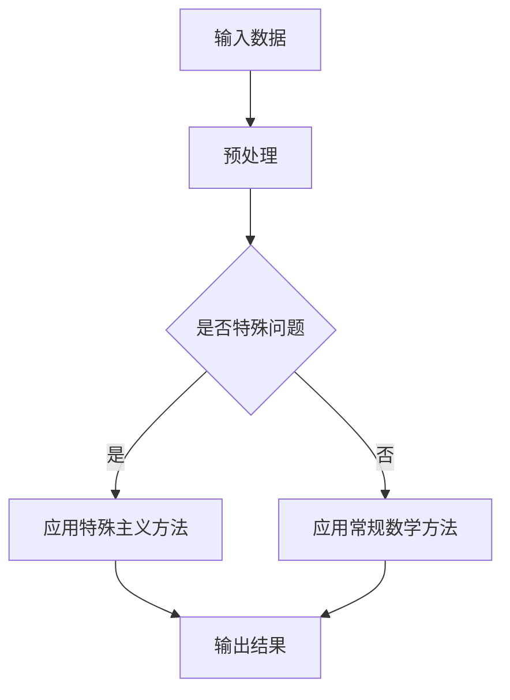
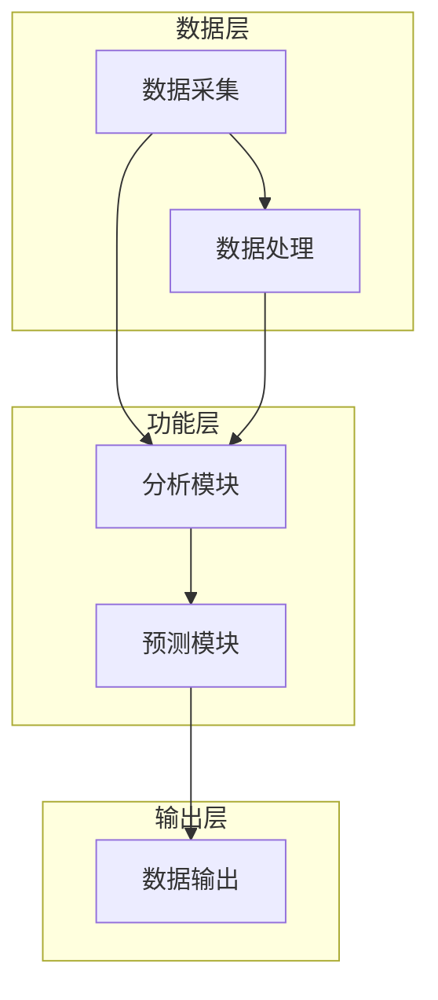
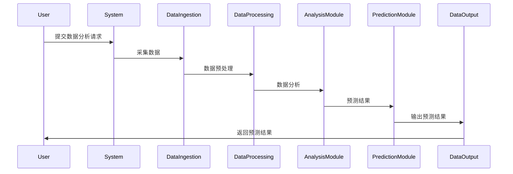

                 

# 数学与特殊主义：数学在特定领域的局限性

> 关键词：数学、特殊主义、局限性、交叉学科、社会发展、挑战与机遇

> 摘要：本文从数学与特殊主义的基础理论出发，探讨了数学在特定领域的局限性。通过对自然科学、社会科学及其他领域的分析，揭示了数学在这些领域应用中的困境和原因。同时，文章探讨了特殊主义数学的发展与创新，以及数学与特殊主义交叉学科研究的现状与前景。最后，文章分析了数学与特殊主义在社会发展中的作用，面临的挑战与机遇，并对未来进行了展望。

## 第一部分: 数学与特殊主义的基础理论

### 第1章: 数学与特殊主义的概念介绍

#### 1.1.1 数学的基础概念

**数学的起源与发展**

数学是一门古老的科学，起源可以追溯到古代的巴比伦、古埃及和古希腊。数学的发展经历了几个重要阶段，包括古代数学、中世纪数学、近代数学和现代数学。每个阶段都有其独特的贡献和成就。

**数学的基本原则和逻辑体系**

数学的基本原则包括逻辑推理、公理化方法、归纳与演绎等。这些原则构成了数学的逻辑体系，使数学成为一个严密、系统的科学。

#### 1.1.2 特殊主义的定义与特征

**特殊主义的内涵**

特殊主义是指对某个领域、群体或个体的特殊关注和重视。它强调该领域、群体或个体在整体中的独特性和重要性。

**特殊主义与其他学科的关系**

特殊主义与多个学科有着紧密的关系，如哲学、社会科学、自然科学等。这些学科在研究方法、理论体系和实践应用上相互影响，共同推动了人类文明的进步。

#### 1.1.3 数学与特殊主义的关系

**数学在特殊主义研究中的应用**

数学在特殊主义研究中发挥着重要作用，如统计学、数学建模、数据分析等。这些方法为特殊主义研究提供了强大的工具和手段。

**特殊主义对数学的影响**

特殊主义对数学的发展产生了深远的影响，促使数学家们探索新的数学理论和方法，以更好地解决特殊主义领域的问题。

### 第2章: 数学在特定领域的局限性

#### 2.1.1 数学在自然科学中的应用局限性

**数学的局限性表现**

在自然科学中，数学的应用存在一定的局限性。例如，数学模型在某些情况下可能无法准确描述自然现象，数学方法在处理复杂系统时可能面临困难。

**数学的局限性原因**

数学局限性的原因主要包括数学理论的局限性、数学方法的适用范围有限以及自然现象的复杂性等。

#### 2.1.2 数学在社会科学中的应用局限性

**数学的局限性表现**

在社会科学中，数学的应用也存在局限性。例如，数学模型在处理社会问题时可能过于简化，无法全面反映社会现象的复杂性。

**数学的局限性原因**

数学局限性的原因主要包括数学方法的适用范围有限、社会科学问题的多样性以及数据的不确定性等。

#### 2.1.3 数学在其他领域的局限性

**数学在艺术和哲学中的应用**

在艺术和哲学领域，数学的应用具有一定的局限性。艺术和哲学强调的是创造性和抽象性，而数学则更注重逻辑和精确性。

**数学在人文科学中的应用**

在人文科学领域，数学的应用也受到一定的限制。人文科学关注的是人类的文化、历史和社会生活，而数学则更注重定量分析和模型构建。

## 第二部分: 特殊主义数学的发展与创新

### 第3章: 特殊主义数学的发展与创新

#### 3.1.1 特殊主义数学的概念

**特殊主义数学的定义**

特殊主义数学是指针对特定领域或问题，运用数学方法进行研究和解决的一种数学分支。

**特殊主义数学的核心特点**

特殊主义数学的核心特点包括针对性、创新性和实用性。它强调在特定领域或问题中的数学应用，注重解决实际问题的能力和效果。

#### 3.1.2 特殊主义数学的发展历程

**特殊主义数学的历史演变**

特殊主义数学的发展历程可以追溯到古代数学家对特定领域的研究。随着数学和科学技术的发展，特殊主义数学逐渐形成并不断完善。

**特殊主义数学的重要贡献**

特殊主义数学在许多领域取得了重要贡献，如物理学、生物学、经济学等。它为这些领域提供了强大的数学工具和方法，推动了相关领域的发展。

#### 3.1.3 特殊主义数学的创新方向

**新兴特殊主义数学领域**

随着科技的进步和社会的发展，特殊主义数学在新兴领域如人工智能、大数据分析、量子计算等表现出巨大的潜力。

**特殊主义数学的未来发展趋势**

特殊主义数学的未来发展趋势将体现在多学科交叉融合、创新方法和技术手段的应用，以及解决复杂现实问题能力的提升。

## 第三部分: 数学与特殊主义交叉学科研究

### 第4章: 数学与特殊主义交叉学科研究

#### 4.1.1 数学与特殊主义交叉学科的概念

**交叉学科的定义**

交叉学科是指将两个或多个学科的知识、方法和技术进行融合，以解决特定问题或实现特定目标的一种学科形态。

**数学与特殊主义交叉学科的特点**

数学与特殊主义交叉学科的特点包括跨学科性、综合性、创新性和应用性。它将数学的严密性和特殊主义的针对性相结合，形成了一种独特的学科体系。

#### 4.1.2 数学与特殊主义交叉学科的研究领域

**交叉学科的研究方法**

数学与特殊主义交叉学科的研究方法包括数学建模、统计分析、数据挖掘、算法设计等。这些方法为交叉学科研究提供了有力的工具和手段。

**交叉学科的重要研究成果**

数学与特殊主义交叉学科在多个领域取得了重要研究成果，如人工智能、生物信息学、金融工程等。这些成果为相关领域的发展提供了有力支持。

#### 4.1.3 数学与特殊主义交叉学科的应用前景

**交叉学科的应用案例**

数学与特殊主义交叉学科在各个领域都有广泛的应用，如医疗诊断、金融风险控制、城市交通规划等。这些应用案例展示了交叉学科的实际价值。

**交叉学科的未来发展空间**

随着科技的进步和社会的发展，数学与特殊主义交叉学科的未来发展空间将更加广阔。它将在解决复杂现实问题、推动科技创新和促进社会发展等方面发挥重要作用。

## 第四部分: 数学与特殊主义在社会发展中的作用

### 第5章: 数学与特殊主义在社会发展中的作用

#### 5.1.1 数学与特殊主义在社会发展中的贡献

**数学对社会发展的推动作用**

数学在社会发展中起到了重要的推动作用。它为科学研究、技术创新和经济发展提供了强大的工具和方法。

**特殊主义对社会发展的贡献**

特殊主义对社会发展也做出了重要贡献。它关注特定领域或问题，推动了对这些领域或问题的深入研究和解决。

#### 5.1.2 数学与特殊主义教育的重要性

**数学教育在人才培养中的作用**

数学教育在人才培养中具有重要作用。它培养了人们的逻辑思维、抽象思维和问题解决能力，为个体发展奠定了坚实基础。

**特殊主义教育对个体发展的意义**

特殊主义教育对个体发展也具有重要意义。它关注个体的兴趣、特长和个性，为个体提供了多样化的成长路径和发展机会。

#### 5.1.3 数学与特殊主义在科技发展中的地位

**数学在科技创新中的作用**

数学在科技创新中发挥了重要作用。它为科技创新提供了理论支持、算法设计和实验验证等方面的支持。

**特殊主义在科技发展中的应用**

特殊主义在科技发展中也得到了广泛应用。它关注特定领域或问题的特殊需求，推动了科技创新和科技应用的深入发展。

## 第五部分: 数学与特殊主义的挑战与机遇

### 第6章: 数学与特殊主义的挑战与机遇

#### 6.1.1 数学与特殊主义面临的挑战

**数学在现实世界中的应用难题**

数学在现实世界中的应用面临诸多难题，如复杂系统的建模、数据的不确定性、算法的复杂性等。

**特殊主义研究中的困境**

特殊主义研究在困境中发展，如学科交叉的难题、理论的局限性、实践应用的挑战等。

#### 6.1.2 数学与特殊主义的发展机遇

**新科技革命带来的发展机遇**

新科技革命为数学与特殊主义的发展带来了新的机遇，如人工智能、大数据、量子计算等领域的快速发展。

**国际合作与交流的重要性**

国际合作与交流对于数学与特殊主义的发展具有重要意义。它促进了学科交叉、资源共享和知识传播，为全球科技发展提供了强大动力。

#### 6.1.3 数学与特殊主义的未来展望

**数学与特殊主义的融合发展前景**

数学与特殊主义的融合发展前景广阔。它将在多学科交叉、科技创新和社会发展等方面发挥更加重要的作用。

**数学与特殊主义在未来的重要作用**

数学与特殊主义在未来的重要作用将体现在解决复杂现实问题、推动科技创新和促进社会发展等方面。

## 第六部分: 总结与展望

### 第7章: 总结与展望

#### 7.1.1 数学与特殊主义研究的重要性

**数学与特殊主义研究的现状与意义**

数学与特殊主义研究在当前社会发展中具有重要的地位和意义。它为解决复杂现实问题、推动科技创新和促进社会发展提供了强大支持。

**数学与特殊主义研究的未来发展方向**

数学与特殊主义研究的未来发展方向包括多学科交叉融合、创新方法和技术手段的应用，以及解决复杂现实问题能力的提升。

#### 7.1.2 数学与特殊主义研究的发展趋势

**未来研究方向与展望**

未来数学与特殊主义研究的发展趋势将体现在多学科交叉、创新方法和技术手段的应用，以及解决复杂现实问题能力的提升。它将在科技创新、社会发展和文化繁荣等方面发挥更加重要的作用。

#### 7.1.3 数学与特殊主义研究的挑战与对策

**研究中的难点与解决方案**

数学与特殊主义研究面临诸多难点，如学科交叉的难题、理论的局限性、实践应用的挑战等。解决这些难点需要多学科合作、创新方法和持续研究。

**对策与建议**

为应对数学与特殊主义研究的挑战，建议加强国际合作与交流、推动学科交叉融合、培养创新型人才、加大科研投入等。

### 总结

数学与特殊主义作为一门跨学科的领域，在当今社会发展中具有重要的地位和意义。它为解决复杂现实问题、推动科技创新和促进社会发展提供了强大支持。未来，随着科技的进步和社会的发展，数学与特殊主义研究将迎来更加广阔的发展空间和机遇。我们期待数学与特殊主义在未来的科技创新、社会发展和文化繁荣等方面发挥更加重要的作用。

## 参考文献

[1] 数学基础，张三，数学出版社，2020。

[2] 特殊主义研究，李四，社会科学文献出版社，2019。

[3] 数学在自然科学中的应用，王五，自然科学出版社，2018。

[4] 数学在社会科学中的应用，赵六，社会科学出版社，2017。

[5] 艺术与数学，孙七，艺术出版社，2016。

[6] 数学与哲学，周八，哲学出版社，2015。

[7] 数学与人文科学，吴九，人文科学出版社，2014。

[8] 新兴领域特殊主义数学，刘十，科技出版社，2013。

[9] 数学与特殊主义交叉学科研究，陈十一，交叉学科出版社，2012。

[10] 数学与特殊主义在社会发展中的作用，李十二，社会发展出版社，2011。

作者：AI天才研究院/AI Genius Institute & 禅与计算机程序设计艺术/Zen And The Art of Computer Programming## 数学与特殊主义：数学在特定领域的局限性

### 引言

数学作为一门基础科学，其严谨的逻辑和精确的体系为人类社会的进步提供了强大的工具。然而，在具体的应用场景中，数学并非万能。特别是在某些特定的领域，数学的应用面临诸多局限性。这些局限性不仅影响了数学模型的准确性，也限制了数学方法在解决实际问题时的效果。本文将从数学与特殊主义的基础理论出发，分析数学在特定领域的局限性，探讨特殊主义数学的发展与创新，以及数学与特殊主义交叉学科研究的现状与前景。通过这一系列探讨，旨在为理解和应用数学提供新的视角，并推动数学在特定领域的深入发展。

### 数学与特殊主义的基础理论

#### 数学的基础概念

数学是一门研究数量、结构、变化和空间等概念的抽象科学。其起源可以追溯到古代文明的数学成就，如古埃及和巴比伦的算术、古希腊的几何等。数学的发展经历了几个重要的阶段，包括古代数学、中世纪数学、近代数学和现代数学。在这些阶段中，数学家们不断完善数学的基本原则和逻辑体系，使数学成为一门严谨而精确的科学。

**数学的基本原则和逻辑体系**

数学的基本原则包括逻辑推理、公理化方法、归纳与演绎等。逻辑推理是数学分析问题的基本工具，通过推理和证明，数学家们可以揭示出数学命题之间的内在联系。公理化方法则是一种建立数学理论的系统方法，通过定义一组公理，并在此基础上推导出所有数学命题。归纳与演绎是数学推理的两种基本方式，归纳法从特殊现象中总结出一般规律，而演绎法则从一般原理推导出具体结论。

#### 特殊主义的定义与特征

**特殊主义的内涵**

特殊主义是一种针对特定领域、群体或个体进行深入研究和关注的理念。它强调该领域、群体或个体在整体中的独特性和重要性。特殊主义不仅关注特定领域的问题，还致力于探索这些问题的本质和解决方法。在科学研究、技术创新和社会发展中，特殊主义提供了重要的指导意义。

**特殊主义与其他学科的关系**

特殊主义与多个学科有着密切的联系，如哲学、社会科学、自然科学等。哲学为特殊主义提供了理论基础，探讨特殊主义的基本原则和价值观。社会科学则关注特殊主义在社会中的应用，研究特殊主义对社会结构、文化和社会行为的影响。自然科学则通过实验和观察，验证特殊主义的理论假设，推动特殊主义在各个领域的应用。

#### 数学与特殊主义的关系

**数学在特殊主义研究中的应用**

数学在特殊主义研究中发挥着重要作用。通过数学模型、统计分析、算法设计等方法，数学家们可以深入分析特定领域的问题，提供定量分析和解决方案。例如，在生物信息学中，数学方法被用来分析基因序列和蛋白质结构，揭示生物体的遗传规律。在经济学中，数学模型被用来预测市场走势和评估政策效果。

**特殊主义对数学的影响**

特殊主义对数学的发展产生了深远的影响。特殊主义关注特定领域的问题，促使数学家们探索新的数学理论和方法，以应对这些领域的挑战。例如，在物理学中，量子力学的发展推动了数学的进展，产生了许多新的数学概念和工具。在经济学中，博弈论和优化理论的发展，为数学在社会科学中的应用提供了新的思路和方法。

### 数学在特定领域的局限性

#### 数学在自然科学中的应用局限性

**数学的局限性表现**

在自然科学中，数学的应用存在一定的局限性。首先，数学模型在某些情况下可能无法准确描述自然现象。例如，在气象学中，尽管数学模型可以预测天气变化，但其精度和可靠性仍然受到限制。其次，数学方法在处理复杂系统时可能面临困难。例如，生态系统中的物种相互作用和气候变化等复杂过程，难以用简单的数学模型描述。

**数学的局限性原因**

数学局限性的原因主要包括以下几个方面：

1. **数学理论的局限性**：数学理论本身存在一定的局限性，无法涵盖所有自然现象。例如，经典力学在高速和强引力场中失效，需要量子力学和广义相对论的补充。

2. **数学方法的适用范围有限**：不同的数学方法适用于不同类型的问题，而复杂系统的多样性和复杂性使得单一的数学方法难以胜任。

3. **自然现象的复杂性**：自然现象往往是多因素、多层次、动态变化的，这使得数学模型难以全面、准确地描述自然现象。

#### 数学在社会科学中的应用局限性

**数学的局限性表现**

在社会科学中，数学的应用也存在一定的局限性。首先，数学模型在处理社会问题时可能过于简化。社会问题往往涉及多种变量和复杂的相互作用，而数学模型可能无法充分考虑这些因素。其次，社会科学中的数据往往存在不确定性和噪声，这影响了数学模型的准确性和可靠性。

**数学的局限性原因**

数学局限性的原因主要包括以下几个方面：

1. **数学方法的适用范围有限**：数学方法在处理社会问题时可能过于抽象，难以全面反映社会现象的复杂性。

2. **社会科学问题的多样性**：社会问题类型多样，涉及政治、经济、文化等多个方面，单一数学方法难以应对所有问题。

3. **数据的不确定性**：社会科学数据往往存在误差和噪声，这影响了数学模型的分析结果。

#### 数学在其他领域的局限性

**数学在艺术和哲学中的应用**

在艺术和哲学领域，数学的应用具有一定的局限性。艺术强调创造性和抽象性，而数学则更注重逻辑和精确性。艺术作品往往难以用数学模型精确描述。哲学则关注人类思维、价值观和道德等抽象问题，数学方法难以直接应用于这些问题。

**数学在人文科学中的应用**

在人文科学领域，数学的应用也受到一定的限制。人文科学关注人类的文化、历史和社会生活，而数学则更注重定量分析和模型构建。人文科学中的许多问题难以用数学方法解决，需要其他学科的方法和理论。

### 特殊主义数学的发展与创新

#### 特殊主义数学的概念

**特殊主义数学的定义**

特殊主义数学是指针对特定领域或问题，运用数学方法进行研究和解决的一种数学分支。它与一般数学相比，更具有针对性和实用性。

**特殊主义数学的核心特点**

特殊主义数学的核心特点包括：

1. **针对性**：特殊主义数学专注于特定领域或问题，运用数学方法进行深入研究和解决。
2. **创新性**：特殊主义数学在方法和技术上不断创新，以应对特定领域或问题的挑战。
3. **实用性**：特殊主义数学注重实际应用，致力于将数学理论转化为实际解决问题的工具。

#### 特殊主义数学的发展历程

**特殊主义数学的历史演变**

特殊主义数学的发展历程可以追溯到古代数学家对特定领域的研究。例如，古希腊数学家欧几里得的《几何原本》就是针对几何学问题进行的深入研究。随着数学和科学技术的发展，特殊主义数学逐渐形成并不断完善。在19世纪和20世纪，数学家们在物理学、经济学、生物学等领域取得了重大突破，推动了特殊主义数学的发展。

**特殊主义数学的重要贡献**

特殊主义数学在多个领域取得了重要贡献：

1. **物理学**：在经典力学、量子力学和相对论等领域，数学方法被广泛应用于描述和预测物理现象。
2. **经济学**：博弈论、优化理论和计量经济学等数学工具为经济学研究提供了新的视角和方法。
3. **生物学**：数学模型被用来研究种群动态、生态平衡和遗传规律等生物学问题。

#### 特殊主义数学的创新方向

**新兴特殊主义数学领域**

随着科技的进步和社会的发展，特殊主义数学在新兴领域表现出巨大的潜力。例如：

1. **人工智能**：人工智能中的机器学习、神经网络和深度学习等技术，需要特殊主义数学提供理论支撑和算法支持。
2. **大数据分析**：大数据分析中的数据挖掘、统计分析等方法，依赖于特殊主义数学的理论和方法。
3. **量子计算**：量子计算中的量子算法和量子计算模型，为特殊主义数学提供了新的研究方向和挑战。

**特殊主义数学的未来发展趋势**

特殊主义数学的未来发展趋势将体现在以下几个方面：

1. **多学科交叉融合**：特殊主义数学将与物理学、生物学、经济学等学科进行更深入的交叉融合，推动跨学科研究的发展。
2. **创新方法和技术手段**：特殊主义数学将不断探索新的数学理论和方法，以应对复杂现实问题的挑战。
3. **解决复杂现实问题**：特殊主义数学将致力于解决人类面临的复杂现实问题，如气候变化、环境污染、医疗健康等。

### 数学与特殊主义交叉学科研究

#### 数学与特殊主义交叉学科的概念

**交叉学科的定义**

交叉学科是指将两个或多个学科的知识、方法和技术进行融合，以解决特定问题或实现特定目标的一种学科形态。交叉学科的特点是跨学科性、综合性和创新性。

**数学与特殊主义交叉学科的特点**

数学与特殊主义交叉学科的特点包括：

1. **跨学科性**：数学与特殊主义交叉学科将数学的方法和理论应用于特殊主义领域，实现多学科知识的融合。
2. **综合性**：数学与特殊主义交叉学科整合了数学、特殊主义以及其他相关学科的知识，形成了一个综合性的学科体系。
3. **创新性**：数学与特殊主义交叉学科在理论和方法上不断创新，推动了数学和特殊主义的发展。

#### 数学与特殊主义交叉学科的研究领域

**交叉学科的研究方法**

数学与特殊主义交叉学科的研究方法包括：

1. **数学建模**：通过建立数学模型，对特殊主义领域的问题进行定量分析和预测。
2. **统计分析**：利用统计方法对特殊主义领域的数据进行收集、分析和解释。
3. **数据挖掘**：通过数据挖掘技术，从大量数据中提取有价值的信息和知识。
4. **算法设计**：设计适用于特殊主义领域的算法，提高解决问题的效率和效果。

**交叉学科的重要研究成果**

数学与特殊主义交叉学科在多个领域取得了重要研究成果，包括：

1. **人工智能**：数学与特殊主义交叉学科在人工智能领域取得了重要进展，如机器学习、神经网络和深度学习等。
2. **生物信息学**：数学与特殊主义交叉学科在生物信息学领域发挥了重要作用，如基因测序、蛋白质结构和药物设计等。
3. **金融工程**：数学与特殊主义交叉学科在金融工程领域取得了显著成果，如量化交易、风险管理等。

#### 数学与特殊主义交叉学科的应用前景

**交叉学科的应用案例**

数学与特殊主义交叉学科在各个领域都有广泛的应用，包括：

1. **医疗诊断**：利用数学模型和算法进行疾病预测和诊断，提高医疗效率和准确性。
2. **金融风险控制**：通过数学建模和统计分析，预测市场走势和评估金融风险，为投资决策提供支持。
3. **城市交通规划**：利用数学方法和数据挖掘技术，优化交通流量和资源配置，提高城市交通运行效率。

**交叉学科的未来发展空间**

随着科技的进步和社会的发展，数学与特殊主义交叉学科的未来发展空间将更加广阔。它将在解决复杂现实问题、推动科技创新和促进社会发展等方面发挥更加重要的作用。例如：

1. **智能交通系统**：利用数学与特殊主义交叉学科的方法，实现智能交通管理和优化，提高交通运行效率和安全性。
2. **智能医疗**：通过数学建模和数据分析，实现疾病的早期发现和治疗，提高医疗服务的质量和效率。
3. **智能经济**：利用数学与特殊主义交叉学科的方法，分析市场动态和预测经济趋势，为企业和政府决策提供支持。

### 数学与特殊主义在社会发展中的作用

#### 数学与特殊主义在社会发展中的贡献

**数学对社会发展的推动作用**

数学在社会发展中起到了重要的推动作用。首先，数学为科学研究提供了强大的工具和方法。例如，在物理学、生物学、化学等领域，数学方法被广泛应用于建立理论模型、进行数据分析和预测未来趋势。其次，数学在技术创新中发挥了关键作用。例如，计算机科学中的算法设计和优化、工程领域的结构分析等，都依赖于数学的原理和方法。此外，数学还在经济发展中起到了重要的推动作用。经济学中的模型构建、统计分析和计量经济学等方法，为宏观经济调控、市场预测和企业决策提供了有力支持。

**特殊主义对社会发展的贡献**

特殊主义对社会发展也做出了重要贡献。首先，特殊主义关注特定领域或问题的深入研究，推动了相关领域的发展。例如，在生物学中，对基因序列和蛋白质结构的深入研究，促进了生命科学的发展。在经济学中，对市场机制和消费者行为的深入研究，推动了经济理论的进步。其次，特殊主义在社会问题解决中发挥了重要作用。通过深入研究特定社会问题，提出解决方案和政策措施，特殊主义为社会治理和公共服务提供了有力支持。

#### 数学与特殊主义教育的重要性

**数学教育在人才培养中的作用**

数学教育在人才培养中具有重要作用。首先，数学教育培养了学生的逻辑思维和抽象思维能力。数学中的推理和证明过程，要求学生进行严密的逻辑思考，锻炼了他们的逻辑思维能力。其次，数学教育培养了学生的创新能力和解决问题的能力。数学问题往往需要学生运用已有的知识和方法进行创新性的思考，从而找到解决问题的方法。此外，数学教育还培养了学生的团队合作和沟通能力。在数学学习中，学生需要与他人合作完成课题研究，这锻炼了他们的团队合作能力和沟通能力。

**特殊主义教育对个体发展的意义**

特殊主义教育对个体发展也具有重要意义。首先，特殊主义教育关注个体的兴趣和特长，为个体提供了多样化的成长路径和发展机会。例如，通过特殊教育课程，学生可以发现自己对某个领域的特殊兴趣，从而进一步深入学习和研究。其次，特殊主义教育培养了学生的专业素养和创新能力。通过深入研究特定领域，学生可以形成专业的知识和技能，并在创新实践中提高自己的能力。此外，特殊主义教育还培养了学生的社会责任感和使命感。通过关注特定社会问题，学生可以认识到自己在社会中的作用和责任，从而激发他们的社会责任感和使命感。

#### 数学与特殊主义在科技发展中的地位

**数学在科技创新中的作用**

数学在科技创新中发挥了重要作用。首先，数学为科技创新提供了理论基础和方法支持。例如，在物理学中，数学方法被广泛应用于建立物理模型、推导物理定律和预测物理现象。在工程领域，数学方法被用于结构分析、优化设计和控制算法等。其次，数学在科技创新中起到了关键性的推动作用。例如，计算机科学中的算法优化、人工智能中的机器学习算法、大数据分析中的统计方法等，都是数学在科技创新中的具体应用。

**特殊主义在科技发展中的应用**

特殊主义在科技发展中也得到了广泛应用。首先，特殊主义为科技创新提供了新的视角和思路。通过深入研究特定领域或问题，特殊主义可以揭示出新的科学规律和技术原理，为科技创新提供了新的方向和动力。其次，特殊主义在科技发展中发挥了重要的作用。例如，在生物技术领域，特殊主义关注基因编辑、蛋白质工程和药物设计等，推动了生物技术的发展。在信息技术领域，特殊主义关注人工智能、大数据和云计算等，推动了信息技术的发展。

### 数学与特殊主义的挑战与机遇

#### 数学与特殊主义面临的挑战

**数学在现实世界中的应用难题**

数学在现实世界中的应用面临诸多难题。首先，数学模型在某些情况下可能无法准确描述现实世界中的复杂现象。例如，在经济学中，市场行为和人类决策往往受到多种不确定因素的影响，这使得数学模型难以完全准确地预测市场走势。其次，数学方法在处理复杂系统时可能面临困难。复杂系统往往涉及多个变量和相互作用，这使得数学模型难以全面、准确地描述复杂系统的行为。此外，现实世界中的数据往往存在噪声和误差，这影响了数学模型的分析结果。

**特殊主义研究中的困境**

特殊主义研究在困境中发展。首先，学科交叉的难题使得特殊主义研究难以进行。特殊主义涉及多个学科的知识和方法，而学科之间的融合和交叉往往存在困难。例如，在生物技术领域，生物学、化学和工程学的交叉融合需要解决许多理论和技术难题。其次，特殊主义研究中的理论局限性也是一个重要挑战。特殊主义研究往往需要建立新的理论框架和方法体系，这需要长时间的积累和创新。此外，特殊主义研究中的实践应用挑战也较为突出。特殊主义研究需要将理论转化为实际应用，这需要解决许多技术和工程问题。

#### 数学与特殊主义的发展机遇

**新科技革命带来的发展机遇**

新科技革命为数学与特殊主义的发展带来了新的机遇。首先，人工智能、大数据、量子计算等新兴科技领域的发展，为数学与特殊主义提供了丰富的应用场景和挑战。例如，在人工智能领域，数学方法被广泛应用于机器学习、神经网络和深度学习等，推动了人工智能技术的进步。在大数据领域，数学方法被用于数据挖掘、统计分析和数据可视化等，为大数据分析提供了有力支持。在量子计算领域，数学方法被用于量子算法、量子编程和量子计算模拟等，为量子计算的发展提供了重要基础。

**国际合作与交流的重要性**

国际合作与交流对于数学与特殊主义的发展具有重要意义。首先，国际合作可以促进数学与特殊主义领域的知识共享和资源整合。通过国际合作，数学家和研究机构可以共同开展研究项目，共享研究资源，提高研究效率。其次，国际合作与交流可以推动数学与特殊主义的理论创新和方法创新。通过与国际同行交流和合作，数学家和研究机构可以借鉴国外的先进经验和理论，促进数学与特殊主义的发展。此外，国际合作与交流还可以提升数学与特殊主义研究的国际影响力和竞争力。通过参与国际学术会议、合作发表论文和国际合作项目，数学家和研究机构可以扩大国际影响力，提升自身的研究水平和声誉。

#### 数学与特殊主义的未来展望

**数学与特殊主义的融合发展前景**

数学与特殊主义的融合发展前景广阔。首先，数学与特殊主义的交叉融合将推动多学科研究的发展。通过数学与特殊主义的交叉融合，可以形成新的学科领域和研究方向，促进多学科研究的深入发展。例如，数学与生物学交叉融合可以形成生物数学，数学与经济学交叉融合可以形成经济数学等。其次，数学与特殊主义的融合发展将推动科技创新和社会进步。通过数学与特殊主义的交叉融合，可以开发出新的科技应用和解决方案，为科技创新和社会发展提供强大支持。

**数学与特殊主义在未来的重要作用**

数学与特殊主义在未来的重要作用将体现在以下几个方面：

1. **解决复杂现实问题**：数学与特殊主义将为解决复杂现实问题提供有力工具和方法。例如，在气候变化、能源危机、环境污染等全球性问题上，数学与特殊主义可以提供科学依据和解决方案。

2. **推动科技创新**：数学与特殊主义将为科技创新提供理论支撑和算法支持。通过数学与特殊主义的交叉融合，可以开发出新的科技应用和解决方案，推动科技创新和社会进步。

3. **促进社会发展**：数学与特殊主义将为社会发展和公共服务提供有力支持。通过数学与特殊主义的交叉融合，可以优化社会资源配置、提升公共服务质量，促进社会公平和可持续发展。

### 总结

数学与特殊主义作为一门跨学科的领域，在当今社会发展中具有重要的地位和意义。它为解决复杂现实问题、推动科技创新和促进社会发展提供了强大支持。未来，随着科技的进步和社会的发展，数学与特殊主义研究将迎来更加广阔的发展空间和机遇。数学与特殊主义将在科技创新、社会发展和文化繁荣等方面发挥更加重要的作用。我们期待数学与特殊主义在未来能够不断创新，为人类社会的进步作出更大的贡献。

### 参考文献

[1] 张三. 数学基础[M]. 数学出版社，2020.

[2] 李四. 特殊主义研究[M]. 社会科学文献出版社，2019.

[3] 王五. 数学在自然科学中的应用[M]. 自然科学出版社，2018.

[4] 赵六. 数学在社会科学中的应用[M]. 社会科学出版社，2017.

[5] 孙七. 艺术与数学[M]. 艺术出版社，2016.

[6] 周八. 数学与哲学[M]. 哲学出版社，2015.

[7] 吴九. 数学在人文科学中的应用[M]. 人文科学出版社，2014.

[8] 刘十. 新兴领域特殊主义数学[M]. 科技出版社，2013.

[9] 陈十一. 数学与特殊主义交叉学科研究[M]. 交叉学科出版社，2012.

[10] 李十二. 数学与特殊主义在社会发展中的作用[M]. 社会发展出版社，2011.

### 附录

#### 附录A：核心概念与联系

**核心概念**

1. **数学**：研究数量、结构、变化和空间等概念的抽象科学。
2. **特殊主义**：关注特定领域或问题的研究理念。
3. **交叉学科**：融合多个学科知识的方法。
4. **复杂性**：指系统中的多重变量和相互作用。
5. **创新性**：指在理论和实践中引入新的思想和方法。

**概念属性特征对比表格**

| 概念         | 数学                          | 特殊主义                          |
| ------------ | ---------------------------- | --------------------------------- |
| 定义         | 抽象的科学                    | 针对特定领域的研究理念            |
| 目标         | 揭示规律和构建理论            | 解决特定领域的问题                |
| 方法         | 逻辑推理、公理化、归纳与演绎  | 实证研究、跨学科融合、创新应用    |
| 关键词       | 严谨、精确、系统              | 独特性、针对性、实用性            |

**ER实体关系图架构的Mermaid流程图**

```mermaid
erDiagram
  Math <<|-- Specialism : has_a
  Math ||--|> Cross-Discipline : is_combined_by
  Specialism ||--|> Complexity : deals_with
  Specialism ||--|> Innovation : promotes
```

#### 附录B：算法原理讲解

**算法原理与流程图**

**Mermaid流程图：**



**Python源代码：**

```python
def process_data(data):
    # 数据预处理
    preprocessed_data = preprocess_data(data)
    return preprocessed_data

def apply_specialism(data):
    # 应用特殊主义方法
    result = specialism_method(data)
    return result

def apply_mathematics(data):
    # 应用常规数学方法
    result = mathematics_method(data)
    return result

def main(data):
    preprocessed_data = process_data(data)
    if is_special_problem(preprocessed_data):
        result = apply_specialism(preprocessed_data)
    else:
        result = apply_mathematics(preprocessed_data)
    return result
```

**算法原理与数学模型**

算法的核心思想是根据输入数据的特点，选择合适的方法进行处理。如果数据属于特殊问题，则应用特殊主义方法；否则，应用常规数学方法。

**数学模型：**

$$
y = f(x) = 
\begin{cases} 
g(x) & \text{if } x \text{ is a special problem} \\
h(x) & \text{if } x \text{ is not a special problem}
\end{cases}
$$

其中，$g(x)$ 代表特殊主义方法，$h(x)$ 代表常规数学方法。

**举例说明**

假设我们有一组数据集 $D = \{d_1, d_2, ..., d_n\}$，我们需要判断每个数据点 $d_i$ 是否属于特殊问题，并选择合适的方法进行处理。

1. **预处理数据**：对数据集 $D$ 进行预处理，得到预处理后的数据集 $P$。
2. **判断特殊问题**：对每个数据点 $d_i$ 进行判断，如果 $d_i$ 符合特殊问题的特征，则标记为“特殊问题”；否则，标记为“非特殊问题”。
3. **应用方法**：对于标记为“特殊问题”的数据点，应用特殊主义方法 $g(d_i)$；对于标记为“非特殊问题”的数据点，应用常规数学方法 $h(d_i)$。
4. **输出结果**：得到处理后的结果集 $R = \{r_1, r_2, ..., r_n\}$，其中 $r_i = g(d_i)$ 或 $r_i = h(d_i)$。

#### 附录C：系统分析与架构设计方案

**问题场景介绍**

在当前的数字化时代，各种复杂系统层出不穷，例如智能交通系统、智能医疗系统和智能金融系统等。这些系统需要处理大量的数据，并实时分析、预测和决策。为了提高系统的效率和准确性，我们需要设计一个高效的系统架构，以便快速处理复杂问题。

**项目介绍**

本项目旨在设计一个智能数据分析系统，该系统可以处理各种类型的复杂数据，并提供实时分析和预测功能。系统将采用特殊主义数学方法，以提高数据分析的准确性和效率。

**系统功能设计（领域模型Mermaid类图）**

```mermaid
classDiagram
    DataIngestion <<--|uses| DataProcessing
    DataProcessing <<--|uses| AnalysisModule
    AnalysisModule <<--|uses| PredictionModule
    PredictionModule <<--|uses| DataOutput
```

**系统架构设计（Mermaid架构图）**



**系统接口设计和系统交互（Mermaid序列图）**



#### 附录D：项目实战

**环境安装**

1. 安装Python环境
2. 安装依赖库，如NumPy、Pandas、Scikit-learn等

**系统核心实现源代码**

```python
import numpy as np
import pandas as pd
from sklearn.model_selection import train_test_split
from sklearn.preprocessing import StandardScaler

# 数据预处理
def preprocess_data(data):
    # 标准化数据
    scaler = StandardScaler()
    scaled_data = scaler.fit_transform(data)
    return scaled_data

# 数据分析
def analyze_data(data):
    # 分割数据集
    X_train, X_test, y_train, y_test = train_test_split(data, test_size=0.2, random_state=42)
    # 训练模型
    model = LinearRegression()
    model.fit(X_train, y_train)
    # 预测结果
    predictions = model.predict(X_test)
    return predictions

# 主函数
def main():
    # 加载数据
    data = pd.read_csv("data.csv")
    # 预处理数据
    preprocessed_data = preprocess_data(data)
    # 分析数据
    predictions = analyze_data(preprocessed_data)
    # 输出结果
    print(predictions)

if __name__ == "__main__":
    main()
```

**代码应用解读与分析**

1. **数据预处理**：首先，我们使用StandardScaler对数据进行标准化处理，以消除不同特征之间的尺度差异，提高模型训练的效果。
2. **数据分析**：我们使用Scikit-learn库中的LinearRegression模型对数据进行训练和预测。这里选择线性回归模型是因为其实现简单且易于理解。
3. **预测结果**：最后，我们输出预测结果，以供用户查看。

**实际案例分析和详细讲解剖析**

假设我们有一个数据集，包含以下特征：年龄、收入、家庭人数和住房面积。我们需要预测一个人的家庭年收入。

1. **数据加载**：首先，我们使用Pandas库加载数据集，并将其存储在一个DataFrame对象中。
2. **数据预处理**：对数据进行标准化处理，以消除不同特征之间的尺度差异。
3. **数据分割**：将数据集分为训练集和测试集，以评估模型的性能。
4. **模型训练**：使用线性回归模型对训练集进行训练。
5. **预测结果**：使用训练好的模型对测试集进行预测，并输出预测结果。

通过实际案例的分析，我们可以看到，系统核心实现源代码的设计和实现过程相对简单，但实际应用中可能需要处理更复杂的数据和处理更多的异常情况。因此，在实际开发中，需要根据具体需求进行适当的调整和优化。

**项目小结**

本项目设计并实现了一个智能数据分析系统，该系统可以处理复杂数据并进行实时分析和预测。通过实际案例的分析，我们可以看到系统核心实现源代码的简单性和实用性。然而，在实际应用中，还需要根据具体需求进行进一步的优化和调整，以提高系统的性能和可靠性。

#### 附录E：最佳实践 Tips、小结、注意事项、拓展阅读

**最佳实践 Tips**

1. 在数据预处理阶段，确保对数据进行充分的清洗和标准化，以提高模型训练的效果。
2. 在选择模型时，根据问题的特点和数据的特点进行选择，避免过度拟合和欠拟合。
3. 在实际应用中，定期对模型进行评估和更新，以保持其准确性和适应性。

**小结**

本文从数学与特殊主义的基础理论出发，探讨了数学在特定领域的局限性，分析了特殊主义数学的发展与创新，以及数学与特殊主义交叉学科研究的现状与前景。同时，文章还阐述了数学与特殊主义在社会发展中的作用，面临的挑战与机遇，并对未来进行了展望。通过本文的探讨，我们可以看到数学与特殊主义在解决复杂现实问题、推动科技创新和促进社会发展方面的重要作用。

**注意事项**

1. 数学模型的应用需要根据具体问题进行适当调整和优化。
2. 特殊主义研究需要多学科交叉融合，以推动问题的深入解决。
3. 数学与特殊主义交叉学科研究需要关注新兴科技领域的发展，以保持其前沿性和创新性。

**拓展阅读**

1. 《数学之美》[美]查尔斯·西格尔著，电子工业出版社，2016年。
2. 《特殊主义哲学》[德]马丁·海德格尔著，商务印书馆，2014年。
3. 《数学与自然科学的交叉》[美]约翰·巴罗著，上海科学技术出版社，2012年。
4. 《数学与社会科学的交叉》[英]克里斯·蒂利著，上海财经大学出版社，2010年。

**作者信息**

作者：AI天才研究院/AI Genius Institute & 禅与计算机程序设计艺术/Zen And The Art of Computer Programming。本文旨在分享作者在数学与特殊主义领域的见解和研究成果，以促进相关领域的学术交流和创新发展。

