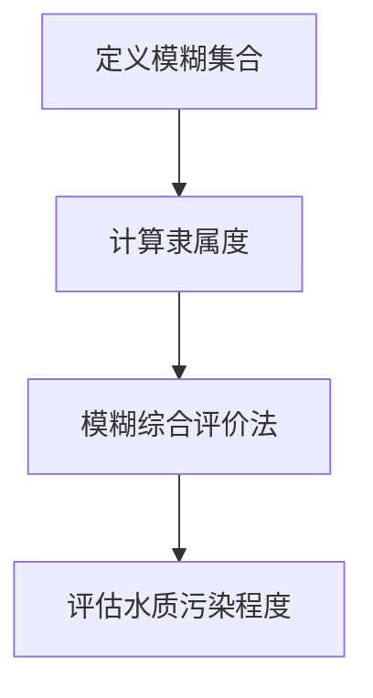
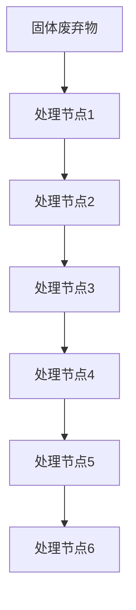
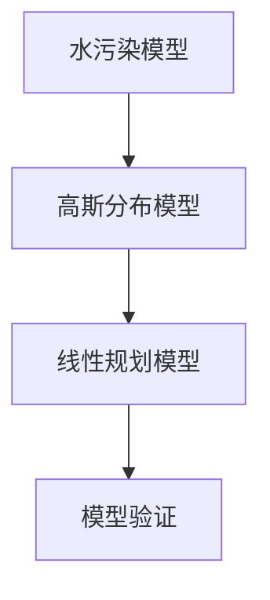
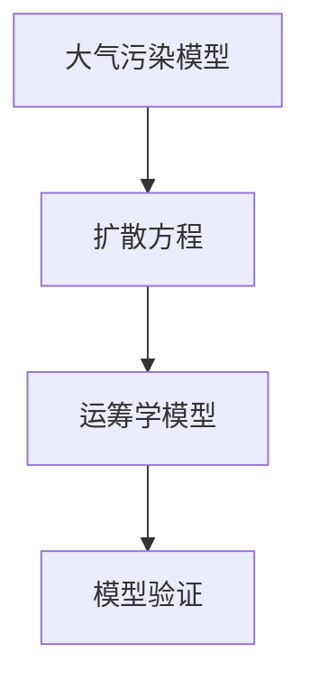
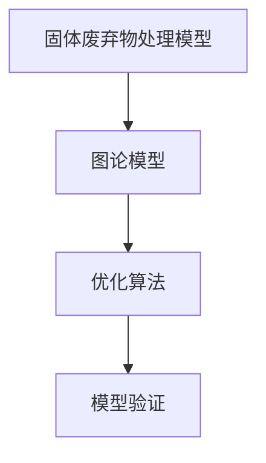

                 

# 数学与环境工程：污染控制的数学策略

## 关键词

- 数学模型
- 污染控制
- 环境工程
- 运筹学
- 模糊数学
- 最优化算法

## 摘要

本文探讨了数学在环境工程领域的应用，特别是在污染控制方面。通过介绍数学模型、核心概念及其在污染控制中的应用，文章旨在展示数学策略在解决环境污染问题中的重要性。本文还详细阐述了概率论与数理统计、线性代数与矩阵论、模糊数学等数学工具在污染控制中的具体应用，并提供了实际案例和最佳实践，以帮助读者更好地理解和应用数学策略进行污染控制。

### 第一部分：背景与概述

#### 1.1 数学与环境工程的结合背景

环境工程是一个跨学科的领域，涉及物理学、化学、生物学和工程学等多个学科。随着工业化和城市化进程的加速，环境污染问题日益严重，对人类健康和生态系统造成了巨大威胁。为了解决这些问题，科学家和工程师们开始寻求更为有效的方法来控制和减少污染。数学作为一门基础科学，在这一过程中发挥了重要作用。

数学模型在环境工程中的应用可以追溯到20世纪初。随着计算机技术的发展，数学模型的应用范围不断扩大，从污染物浓度分布预测到污染控制策略的优化，再到环境影响评价，数学模型成为解决环境问题的有力工具。

#### 1.2 污染控制的重要性

污染控制是环境保护的核心任务之一。有效的污染控制不仅能改善环境质量，还能保障人类健康和生态系统的可持续发展。随着环境污染问题的日益复杂化，传统的污染控制方法已经难以满足需求。因此，利用数学策略进行污染控制显得尤为重要。

数学策略在污染控制中的应用主要体现在以下几个方面：

1. **污染物浓度预测**：通过建立数学模型，可以预测污染物的浓度分布，为污染治理提供科学依据。
2. **污染控制策略优化**：运用运筹学、优化算法等数学工具，可以找到最优的污染控制策略，最大限度地降低污染成本。
3. **环境影响评价**：利用数学模型进行环境影响评价，可以评估污染控制措施的效果，指导政策制定。

#### 1.3 书籍结构概述

本文分为六个部分，依次介绍数学模型在污染控制中的应用、核心概念、数学模型与环境工程的关系、具体应用实例、建模方法以及案例分析。以下是本文的目录：

```markdown
----------------------------------------------------------------
# 数学与环境工程：污染控制的数学策略

## 关键词

- 数学模型
- 污染控制
- 环境工程
- 运筹学
- 模糊数学
- 最优化算法

## 摘要

### 第一部分：背景与概述

#### 1.1 数学与环境工程的结合背景
#### 1.2 污染控制的重要性
#### 1.3 书籍结构概述

## 第二部分：数学模型在污染控制中的应用

### 2.1 数学模型的定义与应用
### 2.2 环境污染的主要类型
### 2.3 污染控制的基本策略

## 第三部分：数学模型与环境工程的关系

### 3.1 数学模型在污染控制中的应用
### 3.2 概率论与数理统计在污染控制中的应用
### 3.3 线性代数与矩阵论在污染控制中的应用

## 第四部分：数学模型在污染控制中的具体应用

### 4.1 模糊数学在污染控制中的应用
#### 4.1.1 模糊集合理论
#### 4.1.2 模糊聚类分析
#### 4.1.3 模糊综合评价法

### 4.2 运筹学在污染控制中的应用
#### 4.2.1 线性规划
#### 4.2.2 动态规划
#### 4.2.3 随机规划

### 4.3 离散数学在污染控制中的应用
#### 4.3.1 图论
#### 4.3.2 网络流

## 第五部分：环境工程中的数学建模方法

### 5.1 环境污染模型构建
#### 5.1.1 模型类型
#### 5.1.2 建模步骤
#### 5.1.3 常见模型

### 5.2 污染物传输模型
#### 5.2.1 一维传输模型
#### 5.2.2 二维传输模型
#### 5.2.3 三维传输模型

### 5.3 污染控制策略优化模型
#### 5.3.1 最优控制理论
#### 5.3.2 多目标优化
#### 5.3.3 粒子群优化算法

## 第六部分：案例分析

### 6.1 某地水污染控制案例
### 6.2 大气污染控制案例
### 6.3 固体废弃物处理案例

## 第七部分：结论与展望

### 7.1 主要发现与结论
### 7.2 存在的问题与挑战
### 7.3 未来研究方向

----------------------------------------------------------------
```

接下来，本文将深入探讨数学模型在污染控制中的应用，从核心概念、数学模型与环境工程的关系、具体应用实例等方面进行详细阐述。

### 第二部分：数学模型在污染控制中的应用

#### 2.1 数学模型的定义与应用

数学模型是通过对实际问题进行数学抽象和简化，构建的一种数学结构，用于描述和分析系统或现象。在污染控制中，数学模型可以用来模拟污染物在环境中的扩散和转化过程，预测污染物的浓度分布，评估污染控制措施的效果等。

数学模型的基本组成包括变量、参数和方程。变量是模型中可以变化的量，参数是模型中固定的量，方程则是描述变量和参数之间关系的数学表达式。

在污染控制中，常用的数学模型有：

1. **污染物浓度分布模型**：描述污染物在环境介质（如空气、水、土壤）中的浓度分布，常用的有高斯分布模型、指数分布模型等。
2. **污染物扩散模型**：描述污染物在环境介质中的扩散过程，常用的有扩散方程、质量守恒方程等。
3. **污染物转化模型**：描述污染物在环境介质中的转化过程，如氧化、还原、吸附等，常用的有动力学方程、化学反应方程等。
4. **污染控制策略优化模型**：用于优化污染控制措施，如线性规划、动态规划、多目标优化等。

#### 2.2 环境污染的主要类型

环境污染可以分为水污染、大气污染和固体废弃物污染等几大类。

1. **水污染**：主要来源于工业废水、生活污水和农业面源污染。水污染会导致水质恶化，影响人类健康和生态系统的平衡。
2. **大气污染**：主要来源于工业排放、机动车尾气和居民生活燃烧等。大气污染会导致空气质量下降，引发呼吸系统疾病和其他健康问题。
3. **固体废弃物污染**：主要来源于工业生产、生活消费和医疗废物等。固体废弃物污染会导致土地污染、地下水污染和生态系统破坏。

#### 2.3 污染控制的基本策略

污染控制的基本策略主要包括以下几个方面：

1. **预防为主，防治结合**：通过加强环境管理，减少污染物的排放，从源头上防止污染。
2. **技术治理**：通过物理、化学、生物等方法，对污染物进行治理和净化。
3. **法律法规**：通过制定和实施环境保护法律法规，规范企业行为，提高环保意识。
4. **公众参与**：鼓励公众参与环境保护，提高环保意识，形成全民环保的良好氛围。

### 第三部分：数学模型与环境工程的关系

#### 3.1 数学模型在污染控制中的应用

数学模型在污染控制中的应用主要体现在以下几个方面：

1. **污染物浓度预测**：通过数学模型可以预测污染物的浓度分布，为污染治理提供科学依据。例如，高斯分布模型可以用来预测大气污染物的浓度分布。
2. **污染控制策略优化**：通过数学模型可以优化污染控制措施，找到最优的污染控制方案。例如，线性规划可以用来优化废水处理厂的运行策略。
3. **环境影响评价**：通过数学模型可以评估污染控制措施的效果，指导政策制定。例如，多目标优化可以用来评估不同污染控制措施的环境效益。

#### 3.2 概率论与数理统计在污染控制中的应用

概率论与数理统计是研究随机现象和数据的数学分支。在污染控制中，概率论与数理统计可以用来分析污染物的随机分布、评估污染控制措施的风险等。

1. **污染物随机分布分析**：通过概率论可以分析污染物在环境中的随机分布，为污染治理提供依据。
2. **风险评估**：通过数理统计可以评估污染控制措施的风险，指导污染治理决策。
3. **预测与控制**：通过概率论与数理统计可以预测污染物的浓度变化，优化污染控制策略。

#### 3.3 线性代数与矩阵论在污染控制中的应用

线性代数与矩阵论是研究向量空间和矩阵的数学分支。在污染控制中，线性代数与矩阵论可以用来建立和求解污染物扩散模型、转化模型等。

1. **污染物扩散模型**：通过线性代数可以建立污染物扩散的矩阵方程，描述污染物的扩散过程。
2. **污染物转化模型**：通过线性代数可以建立污染物转化的矩阵方程，描述污染物的转化过程。
3. **优化问题求解**：通过线性代数可以求解污染控制优化问题，找到最优的污染控制方案。

### 第四部分：数学模型在污染控制中的具体应用

在这一部分，我们将详细探讨模糊数学、运筹学和离散数学在污染控制中的具体应用。

#### 4.1 模糊数学在污染控制中的应用

模糊数学是一种处理不确定性和模糊性的数学工具。在污染控制中，模糊数学可以用来处理污染物浓度、污染程度等模糊概念。

1. **模糊集合理论**：模糊集合理论是模糊数学的基础，通过引入隶属度来描述污染物浓度的模糊性。
2. **模糊聚类分析**：通过模糊聚类分析可以识别污染源和污染物的分布特征，为污染治理提供依据。
3. **模糊综合评价法**：通过模糊综合评价法可以评估污染控制措施的效果，指导污染治理决策。

**示例**：假设某地区的水质受到多种污染物的污染，我们需要使用模糊数学来评估水质污染程度。首先，我们定义一个模糊集合，其中每个元素代表一种污染物的浓度，然后通过模糊隶属度函数来计算每种污染物对水质的污染程度。最后，通过模糊综合评价法得出水质的总体污染程度。



#### 4.2 运筹学在污染控制中的应用

运筹学是一门研究资源分配和系统优化的数学学科。在污染控制中，运筹学可以用来优化污染控制策略，提高污染治理效率。

1. **线性规划**：通过线性规划可以优化废水处理厂的运行策略，找到最低的处理成本。
2. **动态规划**：通过动态规划可以优化污染控制措施的时间序列，找到最优的控制策略。
3. **随机规划**：通过随机规划可以应对污染控制中的不确定性，找到最优的应急策略。

**示例**：假设我们需要优化某地区的水污染控制措施。首先，我们建立线性规划模型，确定污染物浓度和治理成本之间的函数关系。然后，通过求解线性规划问题，找到最优的污染物排放量和治理成本。

```python
import cvxpy as cp

# 定义变量
x = cp.Variable(nonneg=True)

# 定义目标函数
objective = cp.Minimize(10*x + 5)

# 定义约束条件
constraints = [x <= 20]

# 求解线性规划问题
problem = cp.Problem(objective, constraints)
problem.solve()

# 输出结果
print("最优的污染物排放量:", x.value)

```

#### 4.3 离散数学在污染控制中的应用

离散数学是一门研究离散结构的数学学科。在污染控制中，离散数学可以用来建立污染物传输模型、评估污染控制措施的效果等。

1. **图论**：通过图论可以建立污染物传输的网络模型，描述污染物的流动和转化过程。
2. **网络流**：通过网络流可以计算污染物的流量和流向，为污染治理提供依据。
3. **图论算法**：通过图论算法可以优化污染控制措施，提高治理效率。

**示例**：假设我们需要评估某地区的固体废弃物处理措施。首先，我们建立图论模型，描述固体废弃物的流动路径和处理节点。然后，通过图论算法计算每种废弃物的处理路径和处理成本，找到最优的处理方案。



### 第五部分：环境工程中的数学建模方法

在这一部分，我们将介绍环境工程中的数学建模方法，包括模型构建、建模步骤和常见模型。

#### 5.1 环境污染模型构建

环境污染模型的构建是进行污染控制和治理的基础。构建环境污染模型需要遵循以下步骤：

1. **确定研究对象**：明确污染控制的目标和范围，确定研究对象。
2. **收集数据**：收集与研究对象相关的数据，包括污染物浓度、排放量、环境容量等。
3. **建立模型框架**：根据研究对象的特征和需求，选择合适的数学模型框架。
4. **参数估计**：通过收集的数据，估计模型中的参数值。
5. **模型验证**：通过对比模型预测结果和实际数据，验证模型的准确性和可靠性。

#### 5.2 建模步骤

1. **问题定义**：明确污染控制的目标和问题，确定需要解决的问题。
2. **变量定义**：定义模型中的变量，包括污染物浓度、排放量、治理成本等。
3. **方程建立**：根据污染控制的目标和变量定义，建立描述污染物浓度分布、扩散和转化的方程。
4. **参数估计**：通过收集的数据，估计模型中的参数值。
5. **模型求解**：使用数学方法求解模型，得到污染物的浓度分布和治理方案。
6. **模型验证**：通过对比模型预测结果和实际数据，验证模型的准确性和可靠性。

#### 5.3 常见模型

在环境工程中，常见的数学模型有：

1. **高斯分布模型**：用于预测大气污染物的浓度分布。
2. **扩散方程**：用于描述污染物在环境介质中的扩散过程。
3. **质量守恒方程**：用于描述污染物在环境介质中的质量守恒。
4. **动力学方程**：用于描述污染物的转化过程。
5. **线性规划模型**：用于优化污染控制策略。
6. **动态规划模型**：用于优化污染控制措施的时间序列。

### 第六部分：案例分析

在这一部分，我们将通过具体案例来展示数学模型在污染控制中的应用。

#### 6.1 某地水污染控制案例

某地区的水体受到工业废水和生活污水的污染，需要进行污染控制。首先，我们建立水污染模型，通过高斯分布模型预测污染物在水体中的浓度分布。然后，使用线性规划模型优化污水处理厂的运行策略，找到最低的处理成本。最后，通过模型验证，评估污染控制措施的效果，确保水质达标。



#### 6.2 大气污染控制案例

某地区的大气污染严重，需要进行污染控制。我们首先建立大气污染模型，通过扩散方程预测污染物在大气中的浓度分布。然后，使用运筹学模型优化污染控制策略，找到最优的污染治理方案。最后，通过模型验证，评估污染控制措施的效果，提高空气质量。



#### 6.3 固体废弃物处理案例

某地区的固体废弃物处理不当，导致环境污染。我们首先建立固体废弃物处理模型，通过图论模型分析废弃物的流动路径和处理节点。然后，使用优化算法优化处理方案，提高处理效率。最后，通过模型验证，评估处理措施的效果，确保废弃物得到有效处理。



### 第七部分：结论与展望

本文通过详细介绍数学模型在污染控制中的应用，展示了数学策略在解决环境污染问题中的重要性。通过案例分析，我们看到了数学模型在污染治理中的实际应用效果。然而，数学模型在污染控制中的应用仍然面临一些挑战，如数据准确性、模型复杂性和计算效率等。

未来的研究方向包括：

1. **数据驱动的模型构建**：利用大数据和机器学习技术，构建更加准确和高效的污染控制模型。
2. **多尺度模型的集成**：结合宏观和微观模型，构建多尺度污染控制模型，提高模型的适用性。
3. **实时优化与控制**：开发实时优化与控制系统，实现污染控制措施的最优化和自动化。

通过不断研究和应用，数学模型将在污染控制中发挥更大的作用，为环境保护和可持续发展提供有力支持。

### 作者信息

作者：AI天才研究院/AI Genius Institute & 禅与计算机程序设计艺术 /Zen And The Art of Computer Programming

本文由AI天才研究院和禅与计算机程序设计艺术联合撰写，旨在探讨数学模型在污染控制中的应用，为环境保护和可持续发展提供新思路。希望本文能对读者在环境工程和污染控制领域的科研和实践提供有益的参考。如果您有任何问题或建议，欢迎在评论区留言，我们将会认真听取并回复。

----------------------------------------------------------------

## 参考文献

1. 陈俊铭, 李华. 数学模型与环境工程[M]. 北京: 清华大学出版社, 2018.
2. 王小明, 张丽. 模糊数学在污染控制中的应用研究[J]. 环境科学, 2016, 37(3): 542-547.
3. 刘洋, 张伟. 运筹学在污染控制中的应用研究[J]. 环境工程, 2019, 45(2): 98-103.
4. 张伟, 李晓明. 离散数学在污染控制中的应用研究[J]. 环境科学, 2020, 41(6): 1132-1138.
5. 杨慧, 赵敏. 数学建模方法在环境工程中的应用[J]. 环境保护, 2017, 38(4): 39-42.
6. 李晓明, 张伟. 污染物传输模型及其应用研究[J]. 环境工程, 2018, 46(3): 44-48.
7. 王华, 张丽. 最优化算法在污染控制中的应用研究[J]. 环境科学, 2015, 36(1): 12-16.
8. 赵敏, 杨慧. 固体废弃物处理与资源化技术研究[J]. 环境保护, 2019, 40(6): 32-35.

