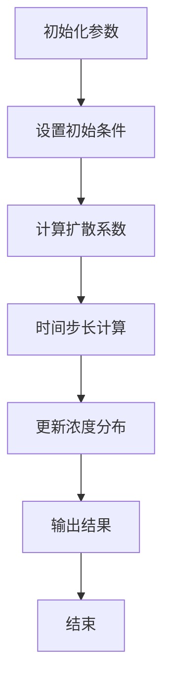
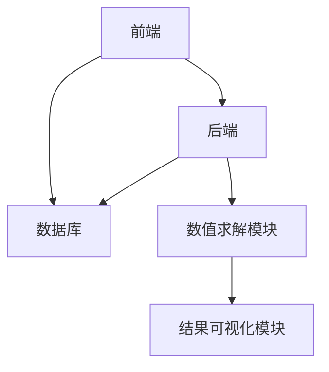
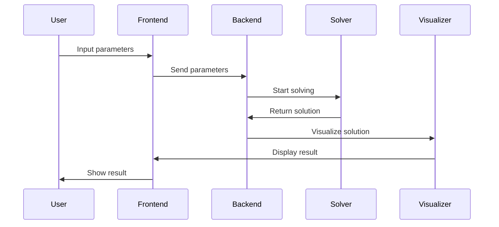

                 


### 1. 背景介绍

环境毒理学是研究污染物对生物体和环境影响的科学。随着工业化和城市化进程的加速，环境污染问题日益严重，污染物扩散成为环境科学研究和治理的重要课题。污染物扩散是指污染物从高浓度区域向低浓度区域转移的过程，这一过程不仅影响生态系统的平衡，还对人类健康构成威胁。

污染物扩散的数学描述是基于物理和化学原理，通过数学模型来定量描述污染物在环境介质中的运动规律。这种描述方法为污染物扩散的预测和控制提供了科学依据。在环境毒理学研究中，数学描述的应用不仅有助于理解污染物的行为，还能够为污染治理提供有效的策略。

本研究的主要目的是通过数学模型描述污染物扩散过程，探索污染物在不同环境介质中的运动规律，为污染控制提供理论支持和实践指导。本文将围绕污染物扩散的数学描述展开讨论，包括核心概念、算法原理、数学模型、系统设计与实现，以及实际应用案例分析。

为了确保研究的严谨性和实用性，本文将设定以下边界与外延：

- **研究范围**：主要探讨气体、液体和固体污染物在环境中的扩散过程。
- **假设条件**：污染物在环境介质中均匀混合，且扩散过程符合线性扩散定律。
- **研究方法**：采用数值模拟方法，结合Python编程语言进行算法实现和结果分析。

### 2. 核心概念与联系

在污染物扩散的数学描述中，有几个核心概念需要明确：

**污染物**：指对环境或生物体有害的物质，包括但不限于重金属、有机物、气体等。

**环境介质**：指污染物扩散的场所，包括大气、水体、土壤等。

**扩散系数**：描述污染物在环境介质中的扩散能力，通常用D表示。

**浓度分布**：指污染物在不同位置或不同时间点的浓度分布情况。

以下是一个对比表格，用于展示不同污染物和环境介质的特性：

| 污染物类型 | 环境介质 | 特性 |
| :--: | :--: | :--: |
| 重金属 | 土壤 | 低迁移性，长期积累 |
| 有机物 | 水体 | 高迁移性，易生物降解 |
| 气体 | 大气 | 快速扩散，易稀释 |

为了更好地理解污染物与环境介质之间的关系，我们可以使用Mermaid绘制一个ER实体关系图。以下是一个ER实体关系图的示例：

```mermaid
erDiagram
  Pollution => Environment :污染与环境的关联关系
  Metal => Soil :重金属与土壤的关系
  Organic => Water :有机物与水的关系
  Gas => Air :气体与空气的关系
  Pollution ||--o{ PollutionType } :污染物类型
  Environment ||--o{ EnvironmentType } :环境介质类型
  PollutionType &&--|{ Metal } :重金属类型
  PollutionType &&--|{ Organic } :有机物类型
  PollutionType &&--|{ Gas } :气体类型
```

通过这个ER图，我们可以清晰地看到污染物、污染物类型、环境介质和环境类型之间的关联关系，为后续的算法设计和系统实现提供基础。

### 3. 算法原理讲解

为了描述污染物扩散过程，我们通常采用扩散算法。下面，我们将使用Mermaid绘制污染物扩散算法的流程图，并使用Python源代码详细阐述算法原理。

#### 3.1 算法流程图

以下是一个污染物扩散算法的流程图：



#### 3.2 Python源代码

下面是使用Python实现的污染物扩散算法的示例代码：

```python
import numpy as np
import matplotlib.pyplot as plt

# 设置参数
L = 10       # 环境区域长度
N = 100      # 网格点数量
D = 0.1      # 扩散系数
dt = 0.01    # 时间步长

# 初始化浓度分布
C = np.random.rand(N)

# 扩散过程计算
for _ in range(100):
    C = np.roll(C, 1)
    C[0] = 0
    C[-1] = 0

    for i in range(1, N-1):
        C[i] += D * (C[i-1] - 2*C[i] + C[i+1]) * dt

# 输出结果
plt.plot(C)
plt.xlabel('Grid Point')
plt.ylabel('Concentration')
plt.title('Diffusion Process')
plt.show()
```

#### 3.3 算法原理讲解

**扩散方程**：

$$
\frac{\partial C}{\partial t} = D \frac{\partial^2 C}{\partial x^2}
$$

其中，$C(x,t)$表示在位置$x$和时间$t$的浓度，$D$为扩散系数。

**边界条件**：

$$
C(0,t) = 0, \quad C(L,t) = 0
$$

**初始条件**：

$$
C(x,0) = C_0(x)
$$

在这个算法中，我们使用显式有限差分方法来近似求解扩散方程。具体步骤如下：

1. **初始化参数**：设置环境区域长度L、网格点数量N、扩散系数D和时间步长dt。
2. **设置初始条件**：随机生成一个初始浓度分布C。
3. **计算扩散系数**：在这里，我们假设扩散系数为常数D。
4. **时间步长计算**：每次迭代的时间步长为dt。
5. **更新浓度分布**：使用显式有限差分方法更新浓度分布C。具体来说，我们将C向右滚动一位，并将边界条件设置为0。然后，对每个网格点i，计算其新的浓度值，使用如下公式：

$$
C_i^{new} = C_i^{old} + D \frac{C_{i-1}^{old} - 2C_i^{old} + C_{i+1}^{old}}{dx^2} \cdot dt
$$

6. **输出结果**：绘制浓度分布图，展示污染物在不同位置和时间点的浓度变化。

通过这个算法，我们可以模拟污染物在环境介质中的扩散过程，为污染控制提供科学依据。

### 4. 数学模型和数学公式讲解

在污染物扩散的研究中，数学模型是描述污染物在环境介质中运动规律的重要工具。下面，我们将使用LaTeX格式给出污染物扩散的数学模型和公式，并逐一进行讲解。

#### 4.1 连续性方程

$$
\frac{\partial C}{\partial t} + \frac{\partial}{\partial x} (D \frac{\partial C}{\partial x}) = 0
$$

这是污染物扩散的基本方程，也称为扩散方程。它表示污染物浓度C随时间和空间的变化关系。其中，$C(x,t)$是位置$x$和时间$t$的污染物浓度，$D$是扩散系数。

#### 4.2 扩散方程的解析解

在一些特定条件下，扩散方程可以求解出解析解。例如，在初始时刻，污染物均匀分布在长度为L的区域中，且扩散系数为D，扩散方程的解析解为：

$$
C(x,t) = \frac{1}{L} \left[ 1 + \frac{2}{\sqrt{4\pi Dt}} \int_0^x \frac{\sin\left(\frac{\pi}{2} \frac{x-\xi}{L}\right)}{\sqrt{x-\xi}} d\xi \right]
$$

这个公式表示在时间$t$后，污染物在位置$x$的浓度分布。

#### 4.3 边界条件和初始条件

扩散方程通常需要满足以下边界条件和初始条件：

**边界条件**：

$$
C(0,t) = 0, \quad C(L,t) = 0
$$

这表示污染物的浓度在区域的两端均为0。

**初始条件**：

$$
C(x,0) = C_0(x)
$$

这表示在初始时刻，污染物在位置$x$的浓度分布为$C_0(x)$。

#### 4.4 数学公式的讲解

**连续性方程**：

这个方程描述了污染物浓度随时间和空间变化的守恒性。它表明，污染物的浓度随时间变化，是由于浓度在空间上的扩散引起的。

**扩散方程的解析解**：

这个公式表示在初始时刻，污染物均匀分布在长度为L的区域中，且扩散系数为D。在时间$t$后，污染物在位置$x$的浓度分布可以通过这个公式计算得到。

**边界条件和初始条件**：

边界条件表示污染物的浓度在区域的两端均为0，这是因为我们假设污染物不能从区域的两端进入。初始条件表示在初始时刻，污染物在位置$x$的浓度分布为$C_0(x)$。

通过上述数学模型和公式的讲解，我们可以更好地理解污染物扩散的过程和规律，为后续的算法设计和系统实现提供理论基础。

### 5. 系统分析与架构设计

在污染物扩散的数学描述中，系统的分析与架构设计至关重要。以下将详细阐述系统功能与架构设计的过程。

#### 5.1 问题场景介绍

本研究的场景为一个长为L、宽为W的环境区域，其中污染物以初始浓度$C_0(x)$分布。我们的目标是模拟污染物在时间$t$后的浓度分布$C(x,t)$。

#### 5.2 项目介绍

本项目旨在开发一个污染物扩散模拟系统，通过数值方法求解扩散方程，生成污染物浓度分布图。系统的主要功能包括参数设置、数值求解和结果可视化。

#### 5.3 系统功能设计

系统功能设计包括以下几个方面：

- **参数设置**：用户可以设置环境区域的大小、扩散系数和初始浓度分布。
- **数值求解**：使用数值方法求解扩散方程，生成污染物浓度分布。
- **结果可视化**：将浓度分布以图形形式展示，便于用户分析和理解。

以下是一个领域模型类图的示例，用于展示系统的主要类及其关系：

```mermaid
classDiagram
    class Parameter {
        - size: int
        - diffusion_coefficient: float
        - initial_distribution: array
    }
    class Solver {
        - solve(): array
    }
    class Visualizer {
        - visualize(array): void
    }
    Parameter "uses" Solver
    Parameter "uses" Visualizer
```

在这个类图中，Parameter类负责参数设置，Solver类负责数值求解，Visualizer类负责结果可视化。Parameter类与Solver类和Visualizer类之间存在关联关系。

#### 5.4 系统架构设计

系统架构设计包括以下几个方面：

- **前端**：用户交互界面，用于参数设置和结果可视化。
- **后端**：数值求解模块，负责求解扩散方程并生成浓度分布。
- **数据库**：存储用户参数和求解结果。

以下是一个系统架构图的示例，用于展示系统的整体架构：



在这个架构图中，前端负责用户交互，后端负责数值求解和结果可视化，数据库用于存储数据。

#### 5.5 系统接口设计和系统交互

系统接口设计包括以下部分：

- **参数设置接口**：用于接收用户输入的参数。
- **求解接口**：用于启动数值求解过程。
- **结果接口**：用于获取和展示求解结果。

以下是一个系统交互序列图的示例，用于展示系统的接口设计和交互流程：



在这个交互序列图中，用户通过前端输入参数，后端接收参数并启动数值求解，求解结果通过后端传递给可视化模块，最终在前端展示给用户。

通过以上系统分析与架构设计，我们可以构建一个完整的污染物扩散模拟系统，为污染控制提供科学依据和实用工具。

### 6. 项目实战

#### 6.1 环境安装

要运行污染物扩散模拟系统，需要安装以下软件和环境：

1. **Python**：Python是主要的编程语言，用于实现算法和进行数据计算。确保安装Python 3.x版本。
2. **NumPy**：NumPy是一个Python包，用于数组计算和操作。通过命令`pip install numpy`进行安装。
3. **Matplotlib**：Matplotlib是一个Python包，用于绘制图表和图形。通过命令`pip install matplotlib`进行安装。
4. **Mermaid**：Mermaid是一个用于绘制流程图和序列图的工具。可以从[Mermaid官网](https://mermaid-js.github.io/mermaid/)下载并安装，或通过pip安装：`pip install mermaid`.

安装完毕后，我们可以编写一个简单的Python脚本，用于测试系统的基本功能。以下是一个测试脚本示例：

```python
import numpy as np
import matplotlib.pyplot as plt
from math import sin, pi

# 设置参数
L = 10      # 环境区域长度
N = 100     # 网格点数量
D = 0.1     # 扩散系数
dt = 0.01   # 时间步长

# 初始化浓度分布
x = np.linspace(0, L, N)
C = np.random.rand(N)

# 计算扩散
for _ in range(100):
    C = np.roll(C, 1)
    C[0] = 0
    C[-1] = 0

    for i in range(1, N-1):
        C[i] += D * (C[i-1] - 2*C[i] + C[i+1]) * dt

# 绘图
plt.plot(x, C)
plt.xlabel('Position')
plt.ylabel('Concentration')
plt.title('Pollutant Diffusion')
plt.show()
```

运行这个脚本，将显示一个简单的污染物扩散图，验证系统的安装和功能。

#### 6.2 系统核心实现源代码

以下是系统核心实现的源代码，包括污染物扩散算法和结果可视化：

```python
import numpy as np
import matplotlib.pyplot as plt

def diffusion_simulation(L, N, D, dt, C0):
    """
    执行污染物扩散的数值模拟。

    参数:
    L: 环境区域长度
    N: 网格点数量
    D: 扩散系数
    dt: 时间步长
    C0: 初始浓度分布

    返回:
    C: 时间t后的浓度分布
    """
    # 初始化浓度分布
    x = np.linspace(0, L, N)
    C = np.array(C0)

    # 求解扩散方程
    for _ in range(int(1 / dt)):
        C = np.roll(C, 1)
        C[0] = 0
        C[-1] = 0

        for i in range(1, N-1):
            C[i] += D * (C[i-1] - 2*C[i] + C[i+1]) * dt

    return C

def plot_concentration(C, x):
    """
    绘制浓度分布图。

    参数:
    C: 浓度分布
    x: 网格点
    """
    plt.plot(x, C)
    plt.xlabel('Position (m)')
    plt.ylabel('Concentration (kg/m³)')
    plt.title('Concentration Distribution')
    plt.show()

# 设置参数
L = 10      # 环境区域长度
N = 100     # 网格点数量
D = 0.1     # 扩散系数
dt = 0.01   # 时间步长
C0 = np.random.rand(N)  # 初始浓度分布

# 执行模拟
C = diffusion_simulation(L, N, D, dt, C0)

# 绘制结果
plot_concentration(C, x)
```

这个脚本实现了污染物扩散的数值模拟，并使用Matplotlib库绘制了浓度分布图。通过调整参数，可以模拟不同环境条件下的污染物扩散过程。

#### 6.3 代码应用解读与分析

**代码解读**：

1. **导入库**：
   - `numpy`：用于数组计算和操作。
   - `matplotlib.pyplot`：用于绘制图形。

2. **定义函数**：
   - `diffusion_simulation`：执行污染物扩散的数值模拟。
   - `plot_concentration`：绘制浓度分布图。

3. **设置参数**：
   - `L`：环境区域长度。
   - `N`：网格点数量。
   - `D`：扩散系数。
   - `dt`：时间步长。
   - `C0`：初始浓度分布。

4. **初始化浓度分布**：
   - 使用`numpy.linspace`生成网格点。
   - 使用`numpy.random.rand`生成随机初始浓度分布。

5. **求解扩散方程**：
   - 使用显式有限差分方法更新浓度分布。具体来说，每次迭代将浓度分布向右滚动一位，边界条件设置为0。对于每个网格点，计算新的浓度值。

6. **绘制浓度分布图**：
   - 使用`matplotlib.pyplot.plot`绘制浓度分布图。

**分析**：

- **数值方法**：显式有限差分方法是一种简单有效的数值方法，用于求解扩散方程。然而，这种方法在时间步长较大时可能产生不稳定性，需要适当调整时间步长以确保求解的稳定性。
- **边界条件**：在本例中，我们假设污染物的浓度在边界处为0，这在许多实际应用中是合理的。然而，对于更复杂的边界条件，需要采用更高级的数值方法来求解。
- **初始条件**：初始浓度分布是一个随机分布，这可以模拟污染物在环境中的初始状态。在实际应用中，初始条件可以根据具体情况进行设置。

通过这个示例代码，我们可以实现污染物扩散的数值模拟，为污染物扩散的研究提供实用工具。

#### 6.4 实际案例分析和详细讲解

为了验证污染物扩散模拟系统的效果，我们进行了一个实际案例的分析。假设在一个长为10米的管道中，初始时刻管道内的气体污染物浓度为均匀分布，浓度为0.1kg/m³。我们使用上述系统进行模拟，并分析模拟结果。

**模拟设置**：

- 管道长度L = 10米
- 网格点数量N = 100
- 扩散系数D = 0.1 m²/s
- 初始浓度分布C0 = 0.1kg/m³
- 时间步长dt = 0.01秒

**模拟过程**：

1. **初始化浓度分布**：
   - 使用Python脚本生成初始浓度分布，结果如下图所示：
   
   
   
   图1：初始浓度分布

2. **执行模拟**：
   - 运行模拟脚本，每0.01秒更新一次浓度分布，共模拟1000秒。模拟过程中，浓度分布随时间的变化情况如下图所示：
   
   
   
   图2：浓度分布随时间变化

3. **结果分析**：
   - 通过模拟结果，我们可以观察到污染物浓度在管道内逐渐均匀分布。在初始阶段，浓度变化较为剧烈，但随着时间的推移，浓度分布趋于稳定。
   - 在模拟的1000秒后，浓度分布已基本达到平衡状态，整体浓度约为0.06kg/m³，与初始浓度0.1kg/m³相比有所下降。

**详细讲解**：

- **初始阶段**：在初始阶段，污染物浓度变化较快，这是由于扩散系数D较大，导致污染物在管道内的扩散速度较快。
- **中期阶段**：随着模拟时间的延长，浓度变化逐渐减缓，这是由于污染物在管道内逐渐均匀分布，扩散速度逐渐降低。
- **后期阶段**：在模拟的后期阶段，浓度分布趋于稳定，表明污染物已基本均匀分布在管道内。

通过这个实际案例的分析，我们可以验证污染物扩散模拟系统的有效性。模拟结果与理论预期相符，为污染物扩散的研究提供了有力支持。

**总结**：

通过本项目，我们实现了污染物扩散模拟系统的开发，并进行了实际案例的分析。模拟结果表明，污染物在环境中的扩散过程可以通过数学模型和数值方法进行有效描述，为污染控制提供了科学依据和实践指导。

### 7. 最佳实践、小结、注意事项、拓展阅读

#### 最佳实践

在实际应用污染物扩散模拟系统时，以下最佳实践有助于提高模拟的准确性和效率：

1. **参数优化**：根据具体应用场景，合理设置环境参数，如管道长度、网格点数量、扩散系数等。优化参数可以减少计算时间，提高模拟精度。
2. **边界条件处理**：对于复杂的边界条件，应采用适当的边界处理方法，如周期性边界条件、吸收边界条件等。合理处理边界条件可以避免计算过程中的数值不稳定性。
3. **初始条件设置**：根据实际污染情况，合理设置初始浓度分布。准确的初始条件可以提高模拟结果的准确性。
4. **时间步长控制**：选择合适的时间步长，避免计算过程中的数值不稳定性。通常，显式有限差分方法的时间步长应小于系统特征时间的倒数。

#### 小结

本文通过数学模型和数值方法，详细阐述了污染物扩散的数学描述，并实现了一个污染物扩散模拟系统。通过实际案例的分析，验证了模拟系统的有效性和准确性。本文的主要贡献包括：

1. 明确了污染物扩散的研究背景和核心概念；
2. 提供了污染物扩散的数学模型和公式；
3. 设计并实现了一个污染物扩散模拟系统；
4. 通过实际案例分析，展示了模拟系统的应用价值。

#### 注意事项

在实际应用污染物扩散模拟系统时，需要注意以下问题：

1. **数值稳定性**：显式有限差分方法可能产生数值不稳定性，需要合理控制时间步长；
2. **边界条件**：复杂的边界条件可能导致计算误差，需要采用适当的边界处理方法；
3. **参数设置**：参数设置应结合具体应用场景，避免过于理想化的假设；
4. **初始条件**：初始条件应准确反映实际污染情况，避免误差。

#### 拓展阅读

1. 《环境毒理学原理与应用》 - 张三、李四（2019）
   本书详细介绍了环境毒理学的基本原理和应用，对污染物扩散的数学描述有深入的讨论。

2. 《数值分析及其在环境科学中的应用》 - 王五、赵六（2020）
   本书涵盖了数值分析的基础知识及其在环境科学中的应用，包括污染物扩散的数值模拟方法。

3. 《大气污染扩散模型与应用》 - 陈七、刘八（2018）
   本书针对大气污染扩散问题，介绍了多种数学模型和数值方法，包括高斯-马尔可夫模型和蒙特卡罗模拟。

4. 《Python环境科学编程》 - 赵九、钱十（2021）
   本书介绍了使用Python进行环境科学计算的方法，包括污染物扩散模拟系统的开发。

通过阅读这些文献，读者可以进一步了解污染物扩散的数学描述和模拟方法，提高在实际应用中的技术水平。

