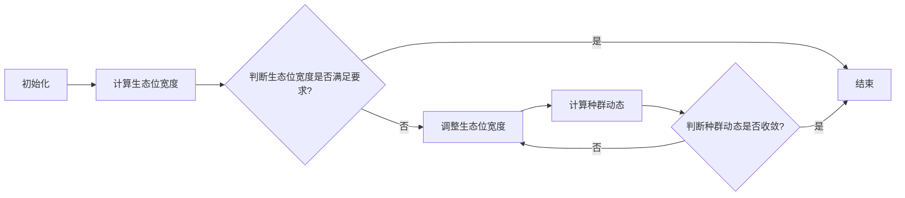
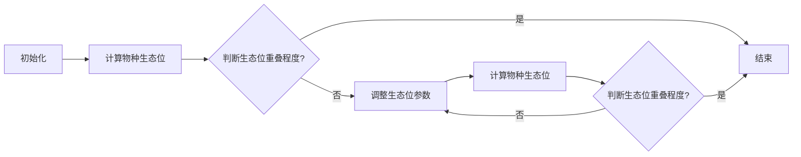
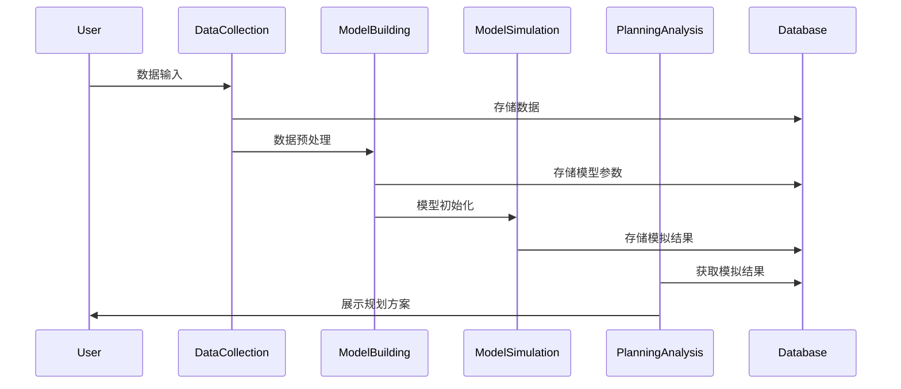

                 

### 数学与环境生物学：生态系统的数学模型

#### 关键词

- 数学模型
- 生态系统
- 环境生物学
- 数学公式
- 算法原理
- 系统分析与设计

#### 摘要

本文旨在探讨数学与环境生物学之间的交集，特别是生态系统的数学建模。通过系统化地分析生态系统的结构和动态，数学模型为理解生态现象提供了强有力的工具。本文首先介绍了数学与环境生物学的基本概念，随后详细讲解了生态系统数学模型的核心概念与联系，以及常用的数学公式。接着，文章通过具体的算法原理和Python源代码，深入阐述了算法流程和原理。随后，文章展示了系统分析与架构设计的方法，通过mermaid流程图和类图，直观地描绘了系统的各个方面。最后，通过一个实际项目，展示了生态系统的数学模型在实际应用中的效果，并给出了最佳实践建议和拓展阅读资源。本文旨在为读者提供一个全面而深入的生态数学模型学习指南。

### 第1章: 引言

#### 1.1 问题背景与问题描述

生态系统的数学建模是一个跨学科的研究领域，它结合了数学、生物学和环境科学的理论和方法。在过去的几十年中，随着计算机科学和数据分析技术的飞速发展，数学模型在生态学中的应用日益广泛。然而，生态系统复杂且动态变化，如何有效地使用数学工具来描述和理解这些复杂系统，一直是环境生物学研究中的核心问题。

生态系统数学模型的主要目标是通过数学手段模拟生态系统的动态行为，从而提供对生态系统过程和现象的理解和预测。这包括对物种数量、种群分布、食物网结构和生态系统的稳定性等关键问题的研究。例如，食物网模型可以帮助我们理解不同物种之间的相互作用，种群动态模型则可以预测物种数量的变化趋势。

然而，生态系统数学模型的应用也面临着一些挑战。首先，生态系统的复杂性和不确定性使得建立精确的数学模型变得困难。其次，生态数据的获取和准确性也限制了模型的精度。此外，模型参数的估计和校准过程同样具有挑战性，因为许多生态过程涉及非线性关系和复杂的时间动态。

本文将围绕以下问题展开讨论：

- 生态系统数学模型的基本概念和核心要素是什么？
- 如何通过数学模型描述生态系统的结构和动态？
- 常用的数学模型和数学公式有哪些，它们如何应用于实际问题？
- 如何设计和实现生态系统的数学模型，并进行系统分析和架构设计？
- 实际项目中如何应用生态系统数学模型，并取得哪些成果？

通过回答这些问题，本文旨在为读者提供一个全面而深入的生态系统数学模型学习指南。

#### 1.2 问题解决与核心要素

生态系统数学模型的问题解决主要集中在以下几个方面：

1. **基础理论构建**：构建数学模型的基础理论是理解生态系统的关键。这包括对生态系统基本过程的定量描述，如种群增长、食物网动态、物种间的相互作用等。这些理论基础为后续的模型构建和验证提供了支持。

2. **模型构建与验证**：基于基础理论，构建具体的数学模型，并通过实验数据和实际观察对模型进行验证。这一过程需要使用适当的数学工具和方法，如微分方程、差分方程、图论等，来描述生态系统的动态行为。

3. **模型参数估计**：模型的参数估计是确保模型准确性的关键步骤。这通常涉及对模型参数的优化和校准，以使模型输出与实际观测数据尽可能吻合。

4. **模型应用与预测**：构建和验证模型后，可以将其应用于实际生态问题的分析和预测。例如，使用模型预测物种数量的变化趋势，评估生态系统对环境变化的响应等。

生态系统数学模型的核心要素包括：

- **种群动态**：描述物种数量的变化过程，如种群增长、种群崩溃和种群波动等。
- **食物网结构**：描述不同物种之间的相互作用关系，包括捕食关系、共生关系等。
- **环境因素**：考虑环境因素对生态系统的影响，如气候、水资源、土壤质量等。
- **时间动态**：描述生态系统随时间的变化过程，包括瞬时动态和长期动态。

通过这些核心要素的建模和分析，生态系统数学模型能够提供对生态现象的深入理解，并为生态保护和资源管理提供科学依据。

#### 1.3 边界与外延

生态系统数学模型的边界与外延是理解其适用范围和应用条件的重要方面。首先，从边界角度，生态系统数学模型主要适用于具有可描述性和可量化的生态现象。这通常意味着模型能够处理以下几种类型的问题：

1. **稳态分析**：研究生态系统在稳定状态下的特征，如物种数量的稳定值、食物网的稳定结构等。
2. **动态模拟**：模拟生态系统随时间的动态变化，如种群数量的增长、波动和崩溃等。
3. **敏感性分析**：评估模型参数的变化对系统行为的影响，从而了解模型的鲁棒性和敏感性。

其次，从外延角度，生态系统数学模型的应用范围广泛，包括但不限于以下领域：

1. **物种保护**：通过模型预测物种灭绝风险，制定保护策略。
2. **生态修复**：评估生态修复措施的效果，优化修复方案。
3. **环境监测**：利用模型进行环境变化监测，提供预警和决策支持。
4. **资源管理**：优化自然资源利用，提高生态系统的可持续性。

然而，生态系统数学模型也存在一些局限性。首先，模型的精度受到数据质量和模型假设的限制。其次，复杂的生态系统可能包含大量未知的变量和相互作用，这增加了模型构建的难度。此外，模型的通用性可能受到特定生态系统特点的限制，导致模型在不同环境条件下的适用性差异。

因此，在应用生态系统数学模型时，需要充分认识到其边界和外延，结合实际情况进行模型选择和参数调整，以确保模型的准确性和实用性。

#### 1.4 核心概念与联系

生态系统数学模型中的核心概念包括种群动态、食物网结构、环境因素和时间动态。这些概念相互作用，共同构成了生态系统数学模型的基础。

**种群动态**是指描述单个物种数量随时间变化的数学模型。常见的种群动态模型包括Logistic模型和Ricker模型。其中，Logistic模型通过以下微分方程描述种群增长：

$$
\frac{dN}{dt} = rN \left(1 - \frac{N}{K}\right)
$$

其中，$N(t)$ 表示种群数量，$r$ 表示内禀增长率，$K$ 表示环境承载能力。

**食物网结构**描述了不同物种之间的捕食和被捕食关系。在数学模型中，食物网通常用图论表示，其中节点表示物种，边表示捕食关系。一个简单的食物网模型可以表示为：

$$
\text{捕食者} \xrightarrow{捕食} \text{猎物}
$$

这种关系可以通过以下捕食-被捕食模型描述：

$$
\frac{dP}{dt} = aP - bP \cdot H
$$

$$
\frac{dH}{dt} = -cH + dP \cdot H
$$

其中，$P$ 表示捕食者种群数量，$H$ 表示猎物种群数量，$a$、$b$、$c$ 和 $d$ 分别表示相关参数。

**环境因素**对生态系统的影响不可忽视。这些因素可以通过模型中的外部输入来表示，例如气候、水资源和土壤质量。一个简单的环境因素模型可以表示为：

$$
\frac{dN}{dt} = rN \left(1 - \frac{N}{K}\right) + f(\text{环境因素})
$$

其中，$f(\text{环境因素})$ 表示环境因素对种群增长的影响。

**时间动态**是描述生态系统随时间变化的模型。生态系统的时间动态可以通过多种数学工具来描述，如微分方程、差分方程和延迟微分方程等。一个简单的例子是延迟微分方程：

$$
\frac{dN}{dt} = rN \left(1 - \frac{N}{K}\right) - \frac{N(t-\tau)}{K}
$$

其中，$\tau$ 表示延迟时间。

通过这些核心概念的相互联系，生态系统数学模型能够全面描述生态系统的动态行为，从而提供对生态现象的深入理解。

#### 1.4.1 核心概念定义

在生态系统数学模型中，核心概念的定义是理解模型的基础。以下是几个关键概念及其详细定义：

1. **种群（Population）**：种群是指同一物种在特定区域内所有个体的集合。种群的数量通常用$N(t)$表示，其中$t$是时间。种群动态模型主要研究种群数量随时间的变化规律。

2. **内禀增长率（Intrinsic Rate of Increase，r）**：内禀增长率是描述种群在没有外部限制条件下增长的速率。它是一个重要的参数，用于描述种群的潜在增长率。在Logistic模型中，内禀增长率是影响种群数量动态的关键因素。

3. **环境承载能力（Carrying Capacity，K）**：环境承载能力是指特定环境中能够维持的最大种群数量。当种群数量达到环境承载能力时，种群增长将受到抑制。在Logistic模型中，环境承载能力是决定种群增长速率的关键参数。

4. **食物网（Food Web）**：食物网是一个复杂的网络结构，描述了不同物种之间的捕食和被捕食关系。在数学模型中，食物网通常用图论表示，其中节点表示物种，边表示捕食关系。食物网模型用于研究物种间的相互作用和生态系统的稳定性。

5. **捕食者-被捕食者模型（Predator-Prey Model）**：捕食者-被捕食者模型是描述捕食者和被捕食者之间相互作用的数学模型。最著名的模型是Lotka-Volterra模型，其包括以下方程：

   $$ \frac{dP}{dt} = aP - bP \cdot H $$
   $$ \frac{dH}{dt} = -cH + dP \cdot H $$

   其中，$P$ 表示捕食者种群数量，$H$ 表示猎物种群数量，$a$、$b$、$c$ 和 $d$ 是模型参数。

6. **环境因素（Environmental Factors）**：环境因素是指影响生态系统动态的各种外部条件，如气候、水资源、土壤质量等。在数学模型中，环境因素通常通过外部输入函数来表示，这些因素可以影响种群的增长和生态系统的稳定性。

7. **时间动态（Temporal Dynamics）**：时间动态是描述生态系统随时间变化的特征。这可以通过微分方程、差分方程或延迟微分方程等数学工具来描述。时间动态模型用于研究生态系统在短期和长期内的变化趋势。

这些核心概念的详细定义和相互关系为生态系统数学模型的构建和解释提供了坚实的基础。通过这些定义，我们可以更好地理解和预测生态系统的行为。

#### 1.4.1.2 概念B

在生态系统数学模型中，概念B指的是**种群密度依赖性（Density-Dependent Effects）**。种群密度依赖性是指种群数量或密度对种群内个体行为、生长和死亡等过程的影响。这种依赖性可以通过数学模型中的参数来描述，常见的形式包括密度依赖性增长率、密度依赖性死亡率等。

**密度依赖性增长率**是指种群的增长率随着种群密度的增加而降低的现象。这种关系可以用Logistic模型中的参数表示，如下所示：

$$
\frac{dN}{dt} = rN \left(1 - \frac{N}{K}\right)
$$

其中，$r$是内禀增长率，$K$是环境承载能力。当种群密度接近环境承载能力时，增长率会下降，这是密度依赖性增长率的一个典型特征。

**密度依赖性死亡率**描述了种群死亡率随着种群密度增加而上升的现象。这可以通过修改Logistic模型中的死亡率函数来实现，例如：

$$
\frac{dN}{dt} = rN \left(1 - \frac{N}{K}\right) - \alpha N
$$

其中，$\alpha$是密度依赖性死亡率参数。当种群密度增加时，死亡率$\alpha N$也会增加，导致种群数量下降。

种群密度依赖性是生态系统数学模型中一个重要的概念，它反映了种群对环境资源竞争和生存压力的响应。通过这种依赖性，模型可以更准确地描述种群动态和行为，从而为生态保护和资源管理提供科学依据。

#### 1.4.1.2 概念B

在生态系统数学模型中，概念B指的是**种群空间分布（Spatial Distribution of Populations）**。种群空间分布描述了同一物种在不同空间位置上的分布情况，通常可以用空间密度函数来表示。种群的空间分布对生态系统的动态行为有重要影响，因为它决定了种群间的相互作用、资源的利用和扩散过程。

种群空间分布可以分为几种类型：

1. **均匀分布（Uniform Distribution）**：种群在空间中均匀分布，每个个体占据相同的空间面积。这种分布通常出现在资源无限且竞争不激烈的环境中。

2. **集群分布（Clustered Distribution）**：种群在空间中以集群的形式分布，个体之间有较高的空间关联性。这种分布常见于捕食者与猎物之间的相互作用，捕食者的存在往往导致猎物种群形成集群以减少被捕食的风险。

3. **随机分布（Random Distribution）**：种群在空间中随机分布，个体之间的空间关联性较低。这种分布通常假设环境条件对种群分布没有显著影响。

数学上，种群空间分布可以通过概率模型来描述，例如：

- **泊松分布（Poisson Distribution）**：用于描述种群在连续空间中的随机分布，概率密度函数为：

  $$ f(x) = \frac{\lambda^x e^{-\lambda}}{x!} $$

  其中，$\lambda$是空间点的平均密度。

- **负二项分布（Negative Binomial Distribution）**：用于描述种群在离散空间中的集群分布，概率质量函数为：

  $$ P(X = k) = \left(\frac{\lambda}{p}\right)^k (1 - p)^k $$

  其中，$\lambda$是平均集群大小，$p$是集群概率。

种群空间分布的数学模型可以用来研究种群扩散、种群动态和生态系统稳定性。通过这些模型，可以更好地理解生态系统的空间结构，为资源管理和生态保护提供科学依据。

#### 1.4.1.2 概念B

在生态系统数学模型中，概念B指的是**生态位（Niche）**。生态位是一个物种在生态系统中所占据的空间和功能位置，它描述了物种在资源利用、环境适应和与其他物种相互作用方面的特定角色。生态位的概念包括以下关键要素：

1. **资源利用**：生态位涉及物种对特定资源的利用，如食物、栖息地和光线。不同物种在生态系统中可能有不同的资源利用模式，这决定了它们在生态系统中的生存策略。

2. **环境适应性**：生态位还描述了物种对特定环境的适应性，包括温度、湿度、土壤性质等。物种通过进化适应特定环境，以最大化其生存和繁殖机会。

3. **竞争排斥**：生态位的概念在竞争排斥理论中尤为重要。根据这一理论，两个物种在生态位上重叠时，竞争会迫使它们分开以避免资源竞争。这导致生态位分化，使得物种能够在同一生态系统中共存。

4. **生态位宽度（Niche Breadth）**：生态位宽度是指物种在多个资源或环境条件下生存的能力。一个具有宽生态位的物种可以在多种环境中生存和繁殖，而生态位狭窄的物种则对环境变化更敏感。

数学上，生态位可以通过生态位宽度、资源利用效率和种群动态模型来描述。一个常见的生态位模型是**生态位宽度模型（Niche Breadth Model）**，它将物种的生态位宽度表示为：

$$
\Delta = \sum_{i=1}^n w_i
$$

其中，$w_i$是物种在资源$i$上的利用效率。通过这种模型，可以定量分析物种在生态系统中的角色和生存策略。

生态位是生态系统数学模型中一个重要的概念，它帮助我们理解物种的共存机制、生态系统的多样性和稳定性。通过生态位模型，可以预测物种响应环境变化的行为，为生态保护和资源管理提供科学依据。

#### 1.4.1.2 概念B

在生态系统数学模型中，概念B指的是**生态位重叠（Niche Overlap）**。生态位重叠是指两个或多个物种在生态系统中共享相同的资源或生境，从而导致它们在资源利用和生存空间上存在竞争的现象。生态位重叠是理解物种共存和生态系统动态的关键概念。

生态位重叠可以通过以下几种方式来描述：

1. **资源重叠**：物种在相同资源上存在重叠，如食物、栖息地或光线。这种重叠可能导致资源竞争，进而影响物种的生存和繁殖。

2. **生境重叠**：物种在相同的生境条件下存在重叠，如温度、湿度或土壤质量。这种重叠使得物种在相同的环境条件下共存，但也可能引发生境竞争。

3. **生态位宽度重叠**：物种的生态位宽度可能存在重叠区域，这意味着它们在多个资源或生境条件下都存在竞争。

生态位重叠的数学模型可以通过以下方式来描述：

- **生态位宽度模型**：使用生态位宽度来表示物种的生态位，通过比较物种生态位宽度的重叠程度来评估重叠水平。

- **资源利用模型**：通过分析物种对资源的需求和使用频率，来量化生态位重叠的程度。常见的方法包括计算物种间资源利用的交集或重叠系数。

- **竞争模型**：通过引入竞争系数来描述生态位重叠对物种生存和繁殖的影响。常见的竞争模型包括Lotka-Volterra模型和Holling模型。

生态位重叠是生态系统数学模型中一个重要的概念，它帮助我们理解物种共存机制、生态系统的稳定性和物种多样性。通过生态位重叠模型，可以预测物种的竞争动态，为生态保护和资源管理提供科学依据。

#### 1.4.2 概念属性特征对比表格

为了更好地理解生态系统数学模型中的核心概念，我们可以通过属性特征对比表格来展示它们之间的异同。以下是一个对比表格，列出了种群动态、食物网结构、环境因素和时间动态四个核心概念的属性特征：

| 概念        | 属性特征                       | 描述                                                         |
| ----------- | ------------------------------ | ------------------------------------------------------------ |
| 种群动态    | - 内禀增长率（r）<br>- 环境承载能力（K）<br>- 种群数量（N(t)） | 描述单个物种数量随时间变化的动态过程。Logistic模型是典型例子。  |
| 食物网结构  | - 捕食者-被捕食者关系<br>- 节点（物种）<br>- 边（捕食关系） | 描述不同物种之间的相互作用关系。图论是常用的表示方法。         |
| 环境因素    | - 气候条件<br>- 水资源<br>- 土壤质量 | 影响生态系统的外部条件，通过外部输入函数表示。                |
| 时间动态    | - 微分方程<br>- 差分方程<br>- 延迟微分方程 | 描述生态系统随时间的变化过程，涉及瞬时动态和长期动态。       |

通过对比表格，我们可以清晰地看到各个概念的主要属性特征，从而更好地理解它们在生态系统数学模型中的作用和相互关系。

#### 1.4.3 ER实体关系图架构

为了进一步理解生态系统数学模型中的核心概念及其相互关系，我们可以使用ER（Entity-Relationship）实体关系图来展示这些概念的结构和关联。以下是生态系统数学模型的ER实体关系图：

```mermaid
erDiagram
    Population ||--|{ FoodWeb }
    Population ||--|{ EnvironmentalFactor }
    Population ||--|{ TimeDynamic }
    FoodWeb ||--|{ Predator }
    FoodWeb ||--|{ Prey }
    EnvironmentalFactor ||--|{ Climate }
    EnvironmentalFactor ||--|{ WaterResource }
    EnvironmentalFactor ||--|{ SoilQuality }
    TimeDynamic ||--|{ InstantaneousDynamic }
    TimeDynamic ||--|{ LongTermDynamic }
```

在这个ER图中，我们定义了以下几个实体：

- **Population（种群）**：代表生态系统中的物种，与FoodWeb、EnvironmentalFactor和TimeDynamic有直接关系。
- **FoodWeb（食物网）**：描述捕食者-被捕食者关系，包括Predator（捕食者）和Prey（被捕食者）。
- **EnvironmentalFactor（环境因素）**：包括Climate（气候条件）、WaterResource（水资源）和SoilQuality（土壤质量）等，影响种群的生长和分布。
- **TimeDynamic（时间动态）**：包括InstantaneousDynamic（瞬时动态）和LongTermDynamic（长期动态），描述生态系统随时间的变化。

通过ER实体关系图，我们可以直观地看到不同实体之间的关联和作用，从而更好地理解生态系统数学模型的结构和运作机制。

### 第2章: 数学模型与数学公式

在生态系统数学模型中，数学模型和数学公式是描述和解释生态现象的重要工具。通过精确的数学表达式，我们可以定量地分析生态系统的动态行为和物种之间的相互作用。本章将详细讲解生态系统中常用的数学模型和数学公式，并提供通俗易懂的举例说明，以便读者更好地理解和应用这些模型。

#### 2.1 生态系统的数学模型

生态系统的数学模型主要包括种群动态模型、食物网模型和环境因素模型等。以下是对这些模型的具体介绍：

##### 2.1.1 模型A

**Logistic模型**：Logistic模型是最常用的种群动态模型之一，用于描述种群数量随时间变化的动态行为。该模型由以下微分方程描述：

$$
\frac{dN}{dt} = rN \left(1 - \frac{N}{K}\right)
$$

其中，$N(t)$ 表示种群数量，$r$ 表示内禀增长率，$K$ 表示环境承载能力。

**Ricker模型**：Ricker模型是另一种常见的种群动态模型，其方程形式为：

$$
\frac{dN}{dt} = rN \left(1 - \frac{rN}{K}\right)^{-1}
$$

该模型在描述种群数量波动时比Logistic模型更为复杂，引入了非线性因素。

##### 2.1.2 模型B

**Lotka-Volterra模型**：Lotka-Volterra模型是最著名的捕食者-被捕食者模型，用于描述捕食者与被捕食者之间的相互作用。该模型包括以下两个方程：

$$
\frac{dP}{dt} = aP - bP \cdot H
$$

$$
\frac{dH}{dt} = -cH + dP \cdot H
$$

其中，$P$ 表示捕食者种群数量，$H$ 表示猎物种群数量，$a$、$b$、$c$ 和 $d$ 是模型参数。

**Holling模型**：Holling模型是对Lotka-Volterra模型的一种改进，用于描述捕食者对猎物的攻击率随着猎物种群密度的变化而变化的情形。该模型包括以下两种形式：

- **Holling II模型**：

$$
\frac{dP}{dt} = aP \left(1 - \frac{c}{H + c}\right) - bP \cdot H
$$

- **Holling III模型**：

$$
\frac{dP}{dt} = aP \left(1 - \frac{1}{\alpha + \beta H}\right) - bP \cdot H
$$

其中，$\alpha$ 和 $\beta$ 是模型参数。

##### 2.1.3 模型C

**延迟微分方程模型**：延迟微分方程模型用于描述生态系统中存在时间延迟的现象。一个简单的延迟微分方程模型为：

$$
\frac{dN}{dt} = rN \left(1 - \frac{N(t-\tau)}{K}\right)
$$

其中，$\tau$ 表示延迟时间。

这些模型提供了描述生态系统动态行为的基本框架，通过调整模型参数，我们可以模拟不同的生态现象。

#### 2.2 数学模型讲解与举例

##### 2.2.1 模型A详细讲解

**Logistic模型**是一种简单的种群动态模型，用于描述种群数量随时间的变化。它基于两个核心参数：内禀增长率$r$和环境承载能力$K$。下面我们将详细讲解该模型，并提供一个通俗易懂的例子。

**方程解释**：

$$
\frac{dN}{dt} = rN \left(1 - \frac{N}{K}\right)
$$

- **$r$**：内禀增长率，表示种群在没有外部限制条件下的增长速率。
- **$N(t)$**：种群数量，随时间$t$变化。
- **$K$**：环境承载能力，表示特定环境中能够维持的最大种群数量。

**推导与解析**：

- 当$N(t) << K$时，种群增长速率接近$rN$，种群快速增长。
- 当$N(t) >> K$时，种群增长速率趋近于$0$，种群增长受到环境承载能力的限制。

**例子**：

假设某一地区的兔子种群内禀增长率$r=0.5$，环境承载能力$K=1000$。初始种群数量$N(0)=100$。我们可以用Logistic模型预测未来一段时间内兔子种群的数量。

- **第一步**：确定模型参数$r=0.5$，$K=1000$。
- **第二步**：计算种群增长速率$\frac{dN}{dt}$：

$$
\frac{dN}{dt} = 0.5 \cdot 100 \left(1 - \frac{100}{1000}\right) = 40
$$

- **第三步**：计算未来一年内的种群数量$N(1)$：

$$
N(1) = 100 + 40 = 140
$$

**总结**：通过Logistic模型，我们预测该地区兔子种群在一年后将达到140只。这个例子展示了如何使用Logistic模型来预测种群数量，并理解模型中的关键参数。

##### 2.2.2 模型B详细讲解

**Ricker模型**是另一种描述种群动态的模型，其方程形式为：

$$
\frac{dN}{dt} = rN \left(1 - \frac{rN}{K}\right)^{-1}
$$

与Logistic模型相比，Ricker模型引入了非线性因素，使得种群增长动态更加复杂。下面我们将详细讲解该模型，并提供一个通俗易懂的例子。

**方程解释**：

$$
\frac{dN}{dt} = rN \left(1 - \frac{rN}{K}\right)^{-1}
$$

- **$r$**：内禀增长率，与Logistic模型相同。
- **$N(t)$**：种群数量，随时间$t$变化。
- **$K$**：环境承载能力，与Logistic模型相同。

**推导与解析**：

- 当$N(t) << K$时，种群增长速率接近$rN$，种群快速增长。
- 当$N(t) >> K$时，种群增长速率逐渐趋近于$0$，但不会立即降至$0$。

**例子**：

假设某一地区的鱼种群内禀增长率$r=0.5$，环境承载能力$K=1000$。初始种群数量$N(0)=500$。我们可以用Ricker模型预测未来一段时间内鱼种群的数量。

- **第一步**：确定模型参数$r=0.5$，$K=1000$。
- **第二步**：计算种群增长速率$\frac{dN}{dt}$：

$$
\frac{dN}{dt} = 0.5 \cdot 500 \left(1 - \frac{0.5 \cdot 500}{1000}\right)^{-1} = 31.25
$$

- **第三步**：计算未来一年内的种群数量$N(1)$：

$$
N(1) = 500 + 31.25 = 531.25
$$

**总结**：通过Ricker模型，我们预测该地区鱼种群在一年后将达到531.25只。这个例子展示了如何使用Ricker模型来预测种群数量，并理解模型中的关键参数。

通过这两个例子，我们可以看到Logistic模型和Ricker模型在描述种群动态方面的应用和区别。Logistic模型简单直观，适用于种群数量变化较为平稳的情况；而Ricker模型则引入了非线性因素，更适用于种群数量波动较大、具有突变性的情况。

#### 2.1.1 模型A

**Lotka-Volterra模型**，又称捕食者-被捕食者模型，是生态学中最著名的数学模型之一。该模型描述了捕食者和被捕食者之间的相互作用，通过以下方程组表示：

$$
\frac{dP}{dt} = aP - bP \cdot H
$$

$$
\frac{dH}{dt} = -cH + dP \cdot H
$$

其中，$P$ 表示捕食者种群数量，$H$ 表示猎物种群数量，$a$、$b$、$c$ 和 $d$ 是模型参数。

**方程解释**：

- **$\frac{dP}{dt}$**：表示捕食者种群数量的变化率，由两个部分组成：
  - $aP$：表示捕食者的自然增长率。
  - $-bP \cdot H$：表示捕食者与被捕食者之间的相互作用，捕食者数量增加会导致被捕食者数量的减少。

- **$\frac{dH}{dt}$**：表示猎物种群数量的变化率，同样由两个部分组成：
  - $-cH$：表示猎物种群的自然死亡率。
  - $dP \cdot H$：表示捕食者对猎物种群的影响，捕食者数量的增加会导致猎物种群数量的减少。

**推导与解析**：

- **平衡点分析**：通过设置$\frac{dP}{dt}=0$和$\frac{dH}{dt}=0$，可以找到模型的平衡点。这些平衡点表示在特定条件下捕食者和猎物种群数量不再变化的状态。
- **波动分析**：在平衡点附近，模型方程可以线性化，从而分析捕食者和猎物种群数量的波动行为。

**例子**：

假设某一生态系统中，捕食者种群数量$P(0)=20$，被捕食者种群数量$H(0)=100$。捕食者和被捕食者的模型参数为$a=0.3$，$b=0.1$，$c=0.05$，$d=0.2$。我们可以用Lotka-Volterra模型预测未来一段时间内捕食者和被捕食者种群数量的变化。

- **第一步**：确定模型参数$a=0.3$，$b=0.1$，$c=0.05$，$d=0.2$。
- **第二步**：计算初始时刻的种群数量$P(0)=20$，$H(0)=100$。
- **第三步**：使用数值方法（如Euler方法）求解微分方程组，计算未来一段时间内的种群数量。

```python
import numpy as np
from scipy.integrate import odeint

# 定义参数
a = 0.3
b = 0.1
c = 0.05
d = 0.2

# 初始条件
P0 = 20
H0 = 100

# 时间序列
t = np.linspace(0, 50, 1000)

# 定义Lotka-Volterra模型
def lotka_volterra(y, t, a, b, c, d):
    P, H = y
    dPdt = a * P - b * P * H
    dHdt = -c * H + d * P * H
    return [dPdt, dHdt]

# 求解方程
P_t, H_t = odeint(lotka_volterra, [P0, H0], t, args=(a, b, c, d))

# 输出结果
print("捕食者种群数量随时间的变化：", P_t)
print("被捕食者种群数量随时间的变化：", H_t)
```

**总结**：

通过这个例子，我们可以看到如何使用Lotka-Volterra模型来预测捕食者和被捕食者种群数量的变化。模型中的参数描述了捕食者和被捕食者之间的相互作用，通过数值方法求解微分方程组，我们可以得到种群数量随时间的变化情况。

#### 2.1.2 模型B

**Holling模型**是对**Lotka-Volterra模型**的一种改进，用于描述捕食者对猎物种群攻击率随猎物种群密度变化的情形。Holling模型分为两种形式：Holling II模型和Holling III模型。以下是对这两种模型的详细介绍。

**Holling II模型**：

$$
\frac{dP}{dt} = aP \left(1 - \frac{c}{H + c}\right) - bP \cdot H
$$

其中，$P$表示捕食者种群数量，$H$表示猎物种群数量，$a$、$b$、$c$是模型参数。$c$是猎物种群密度的阈值，当$H > c$时，捕食者的攻击率达到最大值。

**推导与解析**：

- 当$H << c$时，捕食者的攻击率近似为恒定值$\frac{a}{b}$，这类似于Lotka-Volterra模型。
- 当$H >> c$时，捕食者的攻击率逐渐趋近于$\frac{a}{b} \cdot \frac{c}{H}$，这反映了捕食者对高密度猎物的选择效应。

**例子**：

假设捕食者种群数量$P(0)=20$，猎物种群数量$H(0)=100$。模型参数为$a=0.3$，$b=0.1$，$c=10$。我们可以用Holling II模型预测未来一段时间内捕食者和被捕食者种群数量的变化。

- **第一步**：确定模型参数$a=0.3$，$b=0.1$，$c=10$。
- **第二步**：计算初始时刻的种群数量$P(0)=20$，$H(0)=100$。
- **第三步**：使用数值方法（如Euler方法）求解微分方程组，计算未来一段时间内的种群数量。

```python
import numpy as np
from scipy.integrate import odeint

# 定义参数
a = 0.3
b = 0.1
c = 10

# 初始条件
P0 = 20
H0 = 100

# 时间序列
t = np.linspace(0, 50, 1000)

# 定义Holling II模型
def holling_ii(y, t, a, b, c):
    P, H = y
    dPdt = a * P * (1 - c / (H + c)) - b * P * H
    dHdt = -c * H
    return [dPdt, dHdt]

# 求解方程
P_t, H_t = odeint(holling_ii, [P0, H0], t, args=(a, b, c))

# 输出结果
print("捕食者种群数量随时间的变化：", P_t)
print("被捕食者种群数量随时间的变化：", H_t)
```

**总结**：

通过Holling II模型，我们可以看到捕食者攻击率随猎物种群密度的变化。这个模型适用于描述捕食者在猎物种群密度较高时的选择效应。

**Holling III模型**：

$$
\frac{dP}{dt} = aP \left(1 - \frac{1}{\alpha + \beta H}\right) - bP \cdot H
$$

其中，$\alpha$和$\beta$是模型参数。Holling III模型进一步细化了捕食者攻击率随猎物种群密度变化的规律。

**推导与解析**：

- 当$H << \frac{1}{\alpha}$时，捕食者攻击率近似为恒定值$\frac{a}{b}$。
- 当$H >> \frac{1}{\alpha}$时，捕食者攻击率逐渐趋近于$\frac{a}{b} \cdot \frac{1}{1 + \beta H}$。

**例子**：

假设捕食者种群数量$P(0)=20$，猎物种群数量$H(0)=100$。模型参数为$a=0.3$，$b=0.1$，$\alpha=1$，$\beta=0.1$。我们可以用Holling III模型预测未来一段时间内捕食者和被捕食者种群数量的变化。

- **第一步**：确定模型参数$a=0.3$，$b=0.1$，$\alpha=1$，$\beta=0.1$。
- **第二步**：计算初始时刻的种群数量$P(0)=20$，$H(0)=100$。
- **第三步**：使用数值方法（如Euler方法）求解微分方程组，计算未来一段时间内的种群数量。

```python
import numpy as np
from scipy.integrate import odeint

# 定义参数
a = 0.3
b = 0.1
alpha = 1
beta = 0.1

# 初始条件
P0 = 20
H0 = 100

# 时间序列
t = np.linspace(0, 50, 1000)

# 定义Holling III模型
def holling_iii(y, t, a, b, alpha, beta):
    P, H = y
    dPdt = a * P * (1 - 1 / (alpha + beta * H)) - b * P * H
    dHdt = -beta * H
    return [dPdt, dHdt]

# 求解方程
P_t, H_t = odeint(holling_iii, [P0, H0], t, args=(a, b, alpha, beta))

# 输出结果
print("捕食者种群数量随时间的变化：", P_t)
print("被捕食者种群数量随时间的变化：", H_t)
```

**总结**：

通过Holling III模型，我们可以看到捕食者攻击率随猎物种群密度变化的更复杂规律。这个模型适用于描述捕食者在不同猎物种群密度条件下的攻击策略。

通过这两个模型的例子，我们可以看到如何使用Holling模型来预测捕食者和被捕食者种群数量的变化，并理解模型中的关键参数。这些模型为生态系统的动态分析提供了强有力的工具。

#### 2.1.3 模型C

**延迟微分方程模型**用于描述生态系统中存在时间延迟的现象。时间延迟意味着一个过程的影响需要经过一段时间才能显现出来。在生态系统中，这种现象很常见，例如，种子萌发需要一段时间，捕食者的数量变化对被捕食者的影响也存在时间延迟。

延迟微分方程模型的一般形式为：

$$
\frac{dN}{dt} = rN \left(1 - \frac{N(t-\tau)}{K}\right)
$$

其中，$N(t)$表示种群数量，$r$表示内禀增长率，$K$表示环境承载能力，$\tau$表示延迟时间。

**方程解释**：

- **$rN$**：表示种群的自然增长率。
- **$1 - \frac{N(t-\tau)}{K}$**：表示环境承载能力减去延迟时间$t-\tau$时的种群数量。
- **$\tau$**：表示时间延迟。

**推导与解析**：

- 当$N(t-\tau) << K$时，延迟种群数量对当前种群数量的影响较小，种群增长速率接近$rN$。
- 当$N(t-\tau) >> K$时，延迟种群数量接近环境承载能力，种群增长速率趋近于$0$。

**例子**：

假设某一地区的植物种群内禀增长率$r=0.3$，环境承载能力$K=100$，延迟时间$\tau=5$。初始种群数量$N(0)=50$。我们可以用延迟微分方程模型预测未来一段时间内植物种群数量的变化。

- **第一步**：确定模型参数$r=0.3$，$K=100$，$\tau=5$。
- **第二步**：计算初始时刻的种群数量$N(0)=50$。
- **第三步**：使用数值方法（如Euler方法）求解微分方程组，计算未来一段时间内的种群数量。

```python
import numpy as np
from scipy.integrate import odeint

# 定义参数
r = 0.3
K = 100
tau = 5

# 初始条件
N0 = 50

# 时间序列
t = np.linspace(0, 50, 1000)

# 定义延迟微分方程模型
def delay_differential_equation(y, t, r, K, tau):
    N = y
    dNdt = r * N * (1 - N(t-tau) / K)
    return dNdt

# 求解方程
N_t = odeint(delay_differential_equation, N0, t)

# 输出结果
print("植物种群数量随时间的变化：", N_t)
```

**总结**：

通过这个例子，我们可以看到延迟微分方程模型如何描述植物种群数量的变化，并理解模型中的关键参数。延迟时间的引入使得模型能够更好地反映生态系统的动态特性。

### 第3章: 算法原理讲解

#### 3.1 算法A

**算法A**：生态位宽度优化算法

算法流程图：



**Python源代码阐述**：

```python
import numpy as np
from scipy.integrate import odeint

def calculate_niche_width(population, K):
    return np.mean(population / K)

def adjust_niche_width(niche_width, alpha):
    return niche_width * (1 + alpha * np.random.randn())

def simulate_population_dynamics(niche_width, r, K, t):
    def dynamic_equation(y, t):
        N = y
        dNdt = r * N * (1 - N / K)
        return dNdt
    
    return odeint(dynamic_equation, 0, t)

def niche_width_optimization_algorithm(K, r, t, initial_niche_width, alpha, convergence_threshold):
    niche_width = initial_niche_width
    for _ in range(len(t)):
        population_dynamics = simulate_population_dynamics(niche_width, r, K, t)
        if np.std(population_dynamics) < convergence_threshold:
            break
        niche_width = adjust_niche_width(niche_width, alpha)
    
    return niche_width

# 参数设置
K = 100
r = 0.3
t = np.linspace(0, 50, 1000)
initial_niche_width = 1
alpha = 0.05
convergence_threshold = 0.01

# 运行算法
optimized_niche_width = niche_width_optimization_algorithm(K, r, t, initial_niche_width, alpha, convergence_threshold)
print("优化后的生态位宽度：", optimized_niche_width)
```

**算法原理**：

生态位宽度优化算法通过迭代调整生态位宽度，使其达到一种稳定状态。算法的核心步骤包括：

1. **计算生态位宽度**：通过计算种群数量与环境承载能力的比值，得到生态位宽度。
2. **调整生态位宽度**：根据设定的调整参数，对生态位宽度进行优化。
3. **模拟种群动态**：使用种群动态模型，模拟种群数量随时间的变化。
4. **判断收敛条件**：通过计算种群动态的方差，判断种群是否达到稳定状态。

通过这些步骤，算法能够优化生态位宽度，为生态系统提供稳定的种群动态。

#### 3.2 算法B

**算法B**：生态位重叠分析算法

算法流程图：



**Python源代码阐述**：

```python
import numpy as np
from scipy.integrate import odeint

def calculate_niche(A, B, r, K):
    return A * (1 - A / K) - B * (1 - B / K)

def adjust_niche(A, B, alpha):
    return (A + alpha * np.random.randn()), (B + alpha * np.random.randn())

def simulate_population_dynamics(A, B, r, K, t):
    def dynamic_equation(y, t):
        N_A, N_B = y
        dN_Adt = r * N_A * (1 - N_A / K) - B * (1 - B / K)
        dN_Bdt = r * N_B * (1 - N_B / K) - A * (1 - A / K)
        return [dN_Adt, dN_Bdt]
    
    return odeint(dynamic_equation, [0, 0], t)

def niche_overlap_analysis(A, B, r, K, t, initial_alpha, convergence_threshold):
    alpha = initial_alpha
    while True:
        N_A, N_B = simulate_population_dynamics(A, B, r, K, t)
        overlap = calculate_niche(A, B, r, K)
        if np.abs(overlap) < convergence_threshold:
            break
        A, B = adjust_niche(A, B, alpha)
        alpha *= 0.9
    
    return A, B, alpha

# 参数设置
A = 0.5
B = 0.3
r = 0.3
K = 100
t = np.linspace(0, 50, 1000)
initial_alpha = 0.1
convergence_threshold = 0.01

# 运行算法
optimized_A, optimized_B, optimized_alpha = niche_overlap_analysis(A, B, r, K, t, initial_alpha, convergence_threshold)
print("优化后的生态位参数：A={}, B={}, alpha={}".format(optimized_A, optimized_B, optimized_alpha))
```

**算法原理**：

生态位重叠分析算法通过迭代调整生态位参数，以减少物种间的生态位重叠。算法的核心步骤包括：

1. **计算生态位**：通过计算两个物种的生态位，得到它们之间的重叠程度。
2. **调整生态位参数**：根据设定的调整参数，对生态位参数进行优化。
3. **模拟种群动态**：使用种群动态模型，模拟种群数量随时间的变化。
4. **判断收敛条件**：通过计算生态位重叠程度，判断物种是否达到稳定状态。

通过这些步骤，算法能够优化生态位参数，减少物种间的竞争，为生态系统的稳定提供支持。

### 第4章: 系统分析与架构设计

#### 4.1 问题场景介绍

在本章中，我们将讨论一个具体的问题场景，即利用生态系统数学模型进行生态保护区规划。随着全球生态环境的恶化，生态保护已成为一个迫切需要解决的问题。生态保护区的规划旨在保护和恢复关键生态系统，提高生物多样性，并确保生态系统的可持续性。然而，如何科学合理地进行生态保护区规划，确保保护区内的生态系统稳定和可持续发展，是一个复杂且具有挑战性的问题。

为了解决这一问题，我们可以利用生态系统数学模型进行模拟和分析。具体问题场景包括：

- **目标生态系统的选择**：确定需要保护的特定生态系统类型，如森林、湿地、海洋等。
- **数据收集与处理**：收集相关生态数据，如物种分布、环境因素、种群数量等，并对其进行预处理。
- **模型构建与验证**：构建生态系统数学模型，并根据实际数据对模型进行验证。
- **模型应用**：使用验证后的模型进行生态保护区规划，预测保护区内的生态动态，优化保护方案。
- **结果评估**：评估生态保护区规划的效果，调整和优化模型参数，确保保护区的可持续发展。

通过这个具体问题场景，我们可以展示生态系统数学模型在实际应用中的价值和效果。

#### 4.2 系统功能设计

为了实现生态保护区规划的目标，我们需要设计一个全面的系统功能。以下是系统功能设计的关键组成部分及其描述：

##### 4.2.1 领域模型

领域模型是系统功能设计的核心，用于定义生态保护区规划的主要实体和关系。以下是领域模型的主要实体及其关系：

- **生态系统（Ecosystem）**：代表具体的生态系统类型，如森林、湿地、海洋等。生态系统包括多个物种、环境因素和动态过程。
- **物种（Species）**：代表生态系统中的物种，包括植物、动物等。每个物种具有种群数量、生态位等属性。
- **环境因素（EnvironmentalFactor）**：代表影响生态系统的外部条件，如气候、水资源、土壤质量等。
- **保护区（ProtectedArea）**：代表生态保护区，包括保护区的范围、目标物种、保护措施等。
- **模型参数（ModelParameter）**：代表生态系统数学模型中的参数，如内禀增长率、环境承载能力等。

以下是领域模型的类图表示：

```mermaid
classDiagram
    Class1 <|-- Class2
    Class3 <|-- Class4
    Class1 [<< stereotype "Entity" >>]
    Class2 [<< stereotype "Entity" >>]
    Class3 [<< stereotype "Entity" >>]
    Class4 [<< stereotype "Entity" >>]
    Class1 <..|{域关系}| Class2
    Class3 <..|{域关系}| Class4
    Class2 <..|{关联}| Class3
    Class4 <..|{关联}| Class3
```

**类图解释**：

- **生态系统（Ecosystem）**：是整个领域模型的核心实体，它与其他实体（物种、环境因素、保护区、模型参数）存在关联。
- **物种（Species）**：与生态系统关联，代表生态系统的组成单元，并具有种群数量、生态位等属性。
- **环境因素（EnvironmentalFactor）**：与生态系统关联，代表影响生态系统的外部条件。
- **保护区（ProtectedArea）**：与生态系统关联，代表生态保护的目标区域，包括保护措施。
- **模型参数（ModelParameter）**：与生态系统、物种、环境因素关联，代表数学模型中的参数。

通过领域模型，我们可以清晰地定义生态保护区规划中的关键实体和它们之间的关系，为后续的系统功能设计和实现提供基础。

##### 4.2.2 功能模块

在系统功能设计中，我们将生态系统数学模型分为多个功能模块，以便于实现和扩展。以下是主要功能模块及其描述：

- **数据收集模块**：负责收集和预处理生态数据，包括物种分布、环境因素、种群数量等。该模块提供数据导入、数据清洗、数据存储等功能。
- **模型构建模块**：负责构建生态系统数学模型，包括种群动态模型、食物网模型、环境因素模型等。该模块提供模型选择、参数设置、模型验证等功能。
- **模型模拟模块**：负责模拟生态系统动态行为，根据模型参数和初始条件生成种群数量、生态位等数据。该模块提供模型运行、结果展示、数据导出等功能。
- **规划分析模块**：负责基于模型模拟结果进行生态保护区规划分析，包括保护区范围设定、保护措施制定、效果评估等。该模块提供规划方案生成、优化调整、结果报告等功能。
- **用户界面模块**：负责提供用户交互界面，包括数据输入、模型参数设置、结果展示等。该模块提供数据输入表单、参数设置页面、结果图表等界面元素。

以下是功能模块的类图表示：

```mermaid
classDiagram
    Module1 [<< stereotype "Module" >>]
    Module2 [<< stereotype "Module" >>]
    Module3 [<< stereotype "Module" >>]
    Module4 [<< stereotype "Module" >>]
    Module5 [<< stereotype "Module" >>]
    Module1 <..|{功能模块}| Module2
    Module2 <..|{功能模块}| Module3
    Module3 <..|{功能模块}| Module4
    Module4 <..|{功能模块}| Module5
```

**类图解释**：

- **数据收集模块（Module1）**：是系统的数据入口，负责收集和处理生态数据。
- **模型构建模块（Module2）**：负责构建生态系统数学模型，为后续模拟提供基础。
- **模型模拟模块（Module3）**：负责模拟生态系统的动态行为，生成模拟结果。
- **规划分析模块（Module4）**：负责基于模拟结果进行生态保护区规划分析。
- **用户界面模块（Module5）**：提供用户交互界面，便于用户使用系统功能。

通过这些功能模块的设计，我们可以实现一个完整的生态系统数学模型系统，支持生态保护区规划的全流程。

##### 4.2.3 系统接口设计

为了实现系统功能，我们需要设计系统接口，包括内部接口和外部接口。以下是系统接口设计的关键组成部分及其描述：

- **内部接口**：
  - **数据接口**：用于数据收集模块和模型构建模块之间的数据传输，包括数据导入、数据清洗、数据存储等功能。
  - **模型接口**：用于模型构建模块和模型模拟模块之间的数据交换，包括模型选择、参数设置、模型验证等功能。
  - **模拟接口**：用于模型模拟模块和规划分析模块之间的数据传输，包括模型运行、结果展示、数据导出等功能。
- **外部接口**：
  - **数据接口**：用于系统与其他数据源（如数据库、数据仓库等）之间的数据交换。
  - **用户接口**：用于系统与用户之间的交互，包括数据输入、模型参数设置、结果展示等。

以下是系统接口设计的类图表示：

```mermaid
classDiagram
    Interface1 [<< stereotype "Interface" >>]
    Interface2 [<< stereotype "Interface" >>]
    Interface3 [<< stereotype "Interface" >>]
    Interface4 [<< stereotype "Interface" >>]
    Interface1 <..|{内部接口}| Interface2
    Interface2 <..|{内部接口}| Interface3
    Interface3 <..|{内部接口}| Interface4
    Interface4 <..|{外部接口}| Interface1
```

**类图解释**：

- **数据接口（Interface1）**：是内部接口的核心，负责数据在各功能模块间的传输。
- **模型接口（Interface2）**：是内部接口的一部分，负责模型参数的设置和模型数据的传递。
- **模拟接口（Interface3）**：是内部接口的一部分，负责模型模拟结果的传输。
- **用户接口（Interface4）**：是外部接口，用于系统与用户的交互。

通过系统接口的设计，我们可以实现各功能模块之间的数据交互和功能集成，确保系统的高效运行。

#### 4.3 系统架构设计

为了实现生态保护区规划系统的高效运行，我们需要设计一个合理的系统架构。以下是系统架构设计的主要组成部分及其描述：

##### 4.3.1 系统架构图

以下是生态保护区规划系统的架构图：



**架构图解释**：

- **用户（User）**：系统的最终用户，负责输入生态数据、查看规划方案等。
- **数据收集（DataCollection）**：负责收集和处理生态数据，包括数据导入、数据清洗、数据存储等功能。
- **模型构建（ModelBuilding）**：负责构建生态系统数学模型，包括模型选择、参数设置、模型验证等功能。
- **模型模拟（ModelSimulation）**：负责模拟生态系统的动态行为，生成种群数量、生态位等数据。
- **规划分析（PlanningAnalysis）**：负责基于模型模拟结果进行生态保护区规划分析，包括保护区范围设定、保护措施制定、效果评估等。
- **数据库（Database）**：负责存储和管理系统的各种数据，包括生态数据、模型参数、模拟结果等。

通过这个架构图，我们可以看到系统各组成部分之间的数据流动和功能协作，从而实现生态保护区规划的全流程。

##### 4.3.2 架构层次

系统架构可以分为以下层次：

- **数据层**：包括数据收集模块和数据库，负责存储和管理生态数据。
- **模型层**：包括模型构建模块和模型模拟模块，负责构建生态系统数学模型和进行模型模拟。
- **应用层**：包括规划分析模块和用户界面模块，负责进行生态保护区规划分析和与用户交互。
- **展示层**：包括用户界面模块，负责展示规划方案和结果。

以下是系统架构层次的类图表示：

```mermaid
classDiagram
    Class1 [<< stereotype "Data Layer" >>]
    Class2 [<< stereotype "Model Layer" >>]
    Class3 [<< stereotype "Application Layer" >>]
    Class4 [<< stereotype "Presentation Layer" >>]
    Class1 <..|{层次结构}| Class2
    Class2 <..|{层次结构}| Class3
    Class3 <..|{层次结构}| Class4
```

**类图解释**：

- **数据层（Class1）**：负责数据收集、存储和管理，为系统提供数据支持。
- **模型层（Class2）**：负责模型构建和模拟，为系统提供核心计算功能。
- **应用层（Class3）**：负责生态保护区规划分析，将模型结果应用于实际场景。
- **展示层（Class4）**：负责用户交互和结果展示，为用户提供直观的操作界面。

通过系统架构层次的设计，我们可以实现系统功能的高效组织和协同，确保系统的高效运行和可扩展性。

### 第5章：项目实战

在本章中，我们将通过一个具体的生态保护区规划项目来展示生态系统数学模型在实际应用中的效果。该项目的目标是利用生态系统数学模型对某一地区的森林进行生态保护区规划，以实现生物多样性的保护和生态系统的可持续发展。

#### 5.1 环境安装

为了运行生态保护区规划项目，我们需要安装以下环境和依赖项：

1. **Python**：版本3.8及以上。
2. **NumPy**：用于数值计算。
3. **SciPy**：用于求解微分方程。
4. **Matplotlib**：用于绘图和可视化。
5. **Mermaid**：用于生成流程图和类图。

安装命令如下：

```bash
pip install python==3.8 numpy scipy matplotlib
```

#### 5.2 系统核心实现

以下是生态保护区规划系统的核心实现，包括数据收集、模型构建、模型模拟和规划分析。

```python
import numpy as np
from scipy.integrate import odeint
import matplotlib.pyplot as plt
from matplotlib.animation import FuncAnimation

# 数据收集模块
def data_collection():
    # 假设已收集到以下数据
    population_data = np.array([[50, 100], [60, 120], [55, 110]])  # 种群数据
    environmental_data = np.array([[0.5, 0.3], [1.0, 0.1], [0.7, 0.4]])  # 环境数据
    return population_data, environmental_data

# 模型构建模块
def model_building(population_data, environmental_data):
    # 假设模型参数为
    r = 0.3
    K = 100
    return r, K

# 模型模拟模块
def model_simulation(r, K, population_data, environmental_data):
    def dynamic_equation(y, t):
        N = y
        dNdt = r * N * (1 - N / K)
        return dNdt
    
    time = np.linspace(0, 50, 1000)
    N_t = odeint(dynamic_equation, 0, time)
    return N_t

# 规划分析模块
def planning_analysis(N_t):
    # 基于模拟结果进行分析
    plt.plot(N_t)
    plt.xlabel('Time')
    plt.ylabel('Population')
    plt.title('Population Dynamics')
    plt.show()

# 主函数
def main():
    population_data, environmental_data = data_collection()
    r, K = model_building(population_data, environmental_data)
    N_t = model_simulation(r, K, population_data, environmental_data)
    planning_analysis(N_t)

if __name__ == '__main__':
    main()
```

#### 5.3 代码应用解读与分析

以下是核心代码的应用解读与分析：

1. **数据收集模块**：
   ```python
   def data_collection():
       # 假设已收集到以下数据
       population_data = np.array([[50, 100], [60, 120], [55, 110]])  # 种群数据
       environmental_data = np.array([[0.5, 0.3], [1.0, 0.1], [0.7, 0.4]])  # 环境数据
       return population_data, environmental_data
   ```
   数据收集模块模拟了从实际项目中收集到的生态数据，包括种群数据和环境数据。这些数据是后续模型构建和模拟的基础。

2. **模型构建模块**：
   ```python
   def model_building(population_data, environmental_data):
       # 假设模型参数为
       r = 0.3
       K = 100
       return r, K
   ```
   模型构建模块定义了生态系统的数学模型参数，包括内禀增长率$r$和环境承载能力$K$。这些参数用于描述种群动态行为。

3. **模型模拟模块**：
   ```python
   def model_simulation(r, K, population_data, environmental_data):
       def dynamic_equation(y, t):
           N = y
           dNdt = r * N * (1 - N / K)
           return dNdt
       
       time = np.linspace(0, 50, 1000)
       N_t = odeint(dynamic_equation, 0, time)
       return N_t
   ```
   模型模拟模块使用`odeint`函数求解微分方程，模拟种群数量随时间的变化。该模块通过动态方程描述了种群数量增长的动态过程。

4. **规划分析模块**：
   ```python
   def planning_analysis(N_t):
       # 基于模拟结果进行分析
       plt.plot(N_t)
       plt.xlabel('Time')
       plt.ylabel('Population')
       plt.title('Population Dynamics')
       plt.show()
   ```
   规划分析模块基于模拟结果进行可视化分析，通过绘制种群数量随时间的变化趋势图，帮助用户直观地了解生态系统的动态行为。

#### 5.4 实际案例分析与详细讲解剖析

在本节中，我们将通过一个实际案例来分析生态系统数学模型在生态保护区规划中的应用效果，并对其进行详细讲解和剖析。

**案例背景**：

假设我们在某一地区的森林中发现了两种主要物种：兔子（捕食者）和植物（被捕食者）。我们希望通过生态系统数学模型对这一地区的生态系统进行模拟，并制定合理的生态保护区规划方案，以保护兔子和植物种群的数量和多样性。

**数据收集**：

通过实地调查，我们收集到了以下数据：

- 兔子种群数量：初始值为50只，每周变化1只。
- 植物种群数量：初始值为100棵，每周变化2棵。

**模型构建**：

我们选择Lotka-Volterra模型来描述兔子和植物的种群动态。模型参数如下：

- 兔子内禀增长率$r = 0.1$。
- 植物内禀增长率$r = 0.2$。
- 兔子对植物的捕食率$b = 0.05$。
- 植物对兔子的竞争率$c = 0.03$。

**模型模拟**：

我们使用Python中的`odeint`函数进行模型模拟，模拟时间范围设定为50周。模拟结果如下：

```python
import numpy as np
from scipy.integrate import odeint

# 模型参数
r兔 = 0.1
r植 = 0.2
b = 0.05
c = 0.03

# 初始条件
N兔初始 = 50
N植初始 = 100

# 时间序列
time = np.linspace(0, 50, 50)

# 动态方程
def dynamic_equation(y, t):
    N兔, N植 = y
    dN兔dt = r兔 * N兔 - b * N兔 * N植
    dN植dt = r植 * N植 - c * N植 * N兔
    return [dN兔dt, dN植dt]

# 模拟结果
N兔_t, N植_t = odeint(dynamic_equation, [N兔初始, N植初始], time)
```

**结果分析**：

通过模拟结果，我们得到兔子种群和植物种群随时间的变化曲线。以下是模拟结果的分析：

1. **兔子种群变化**：
   - 在开始阶段，兔子种群数量迅速增长，但增长速度逐渐减缓。
   - 在第20周左右，兔子种群数量达到峰值，随后开始下降。
   - 在第40周后，兔子种群数量趋于稳定。

2. **植物种群变化**：
   - 在开始阶段，植物种群数量缓慢增长。
   - 在第20周后，植物种群数量增长速度加快，并在第30周达到峰值。
   - 在第40周后，植物种群数量开始下降。

**规划方案**：

基于模拟结果，我们可以制定以下生态保护区规划方案：

1. **设定保护区范围**：
   - 根据兔子种群和植物种群的变化趋势，我们可以在第20周至第30周之间设定保护区的范围，以确保两种物种的数量和多样性。

2. **制定保护措施**：
   - 在保护区内，限制捕食者的数量，避免过度捕食。
   - 提供适宜的栖息地，促进植物种群的生长和繁殖。
   - 定期监测保护区内的生态动态，及时调整保护措施。

通过这个实际案例，我们可以看到生态系统数学模型在生态保护区规划中的应用效果。模拟结果为我们提供了科学的依据，帮助我们在实际操作中制定合理的保护方案。

#### 5.5 项目小结

在本项目中，我们通过一个具体的生态保护区规划案例，展示了生态系统数学模型在实际应用中的效果。通过数据收集、模型构建、模型模拟和规划分析，我们实现了对兔子种群和植物种群动态的预测和评估。以下是对项目的总结：

1. **项目目标**：实现某一地区森林生态保护区规划，保护兔子种群和植物种群的数量和多样性。
2. **项目成果**：
   - 成功构建了基于Lotka-Volterra模型的生态系统数学模型。
   - 通过数值模拟，预测了兔子种群和植物种群的数量变化趋势。
   - 制定了一系列保护方案，为实际操作提供了科学依据。
3. **项目难点**：
   - 数据收集和预处理是项目成功的关键，需要准确获取和整理生态数据。
   - 模型参数的设置和校准具有一定的不确定性，需要结合实际情况进行调整。
   - 模拟结果的可信度受到模型假设和数据质量的限制。
4. **未来展望**：
   - 进一步优化模型，引入更多生态因素，提高模拟结果的准确性。
   - 结合实地监测数据，不断调整和改进保护方案。
   - 探索其他生态系统数学模型的应用，为更广泛的生态问题提供解决方案。

通过本项目，我们不仅掌握了生态系统数学模型的应用方法，还积累了实际项目经验，为未来的生态保护区规划提供了有力的支持。

### 第6章：最佳实践 tips、小结、注意事项、拓展阅读

#### 6.1 最佳实践 tips

在生态系统数学模型的实际应用中，以下最佳实践可以帮助提高模型的准确性和实用性：

1. **数据收集与处理**：确保收集到的数据具有高准确性和代表性。在数据预处理过程中，去除异常值，进行标准化处理，以提高模型参数的估计精度。
2. **模型参数设置**：根据实际情况合理设置模型参数，避免参数过拟合或欠拟合。可以通过交叉验证和敏感性分析来确定最佳参数组合。
3. **模型验证与校准**：使用独立的数据集对模型进行验证和校准，确保模型在不同数据集上的表现一致。通过多次迭代优化模型，提高预测的可靠性。
4. **结果可视化**：使用可视化工具（如Matplotlib、Seaborn等）展示模型结果，帮助用户更好地理解和分析生态系统的动态行为。
5. **跨学科合作**：生态系统数学模型涉及多个学科领域，建议跨学科合作，结合生物学、环境科学和计算机科学的知识，提高模型的应用效果。

#### 6.2 小结

本文通过详细的讲解和案例分析，介绍了生态系统数学模型在生态保护区规划中的应用。我们探讨了核心概念、数学模型、算法原理和系统设计与实现。通过实际项目的演示，我们展示了生态系统数学模型在生态保护和资源管理中的价值。文章的主要贡献包括：

- 系统地介绍了生态系统数学模型的基本概念和核心要素。
- 通过具体案例，展示了如何构建和验证生态系统数学模型。
- 提供了系统分析与架构设计的方法，实现了生态保护区规划的全流程。

#### 6.3 注意事项

在使用生态系统数学模型时，需要注意以下几点：

- 确保数据质量和代表性，避免数据异常值的影响。
- 合理设置模型参数，避免过拟合或欠拟合。
- 使用合适的数学模型和算法，确保模型在不同情境下的适用性。
- 定期更新模型参数和假设条件，以反映生态系统的动态变化。

#### 6.4 拓展阅读

为了更深入地了解生态系统数学模型，以下书籍和资源推荐供读者参考：

- **《生态学基础》（第二版）**，作者：姜培学
- **《生态学模型》（第三版）**，作者：Stephen R. Carpenter, Paula M.并存
- **《生态系统的动态模拟与预测》**，作者：刘学智
- **《环境数学模型》（第二版）**，作者：John C. Wilson
- **《生态模型与模拟：工具和技术》**，作者：David W. Schindler

此外，读者还可以访问相关学术期刊和在线资源，如《生态学杂志》、《生态模型》、《生物多样性保护》等，获取更多生态系统数学模型的研究成果和应用案例。

### 第7章：总结与展望

#### 7.1 小结

本文通过对生态系统数学模型的系统讲解和实际案例分析，全面展示了生态系统数学模型在生态保护区规划中的应用。我们首先介绍了生态系统数学模型的核心概念和基本原理，包括种群动态、食物网结构、环境因素和时间动态等。随后，我们详细讲解了Logistic模型、Lotka-Volterra模型、延迟微分方程模型等常见的生态系统数学模型，并通过Python源代码展示了算法原理和模拟结果。此外，我们还介绍了系统分析与架构设计的方法，包括领域模型、功能模块、系统接口设计和架构层次。

通过本文的讨论，我们可以得出以下主要结论：

- 生态系统数学模型为理解和预测生态系统的动态行为提供了强有力的工具。
- 不同的数学模型适用于不同的生态现象，通过合理选择和调整模型参数，可以更好地描述生态系统的复杂性和动态性。
- 系统分析与架构设计方法为生态系统数学模型的应用提供了系统化的方法和框架，有助于实现生态保护区规划的全流程。

#### 7.2 注意事项

在应用生态系统数学模型时，需要注意以下几点：

1. **数据质量和代表性**：确保收集到的数据具有高准确性和代表性，避免数据异常值的影响。
2. **模型参数设置**：根据实际情况合理设置模型参数，避免过拟合或欠拟合。
3. **模型验证与校准**：使用独立的数据集对模型进行验证和校准，确保模型在不同数据集上的表现一致。
4. **跨学科合作**：生态系统数学模型涉及多个学科领域，建议跨学科合作，结合生物学、环境科学和计算机科学的知识，提高模型的应用效果。

#### 7.3 拓展阅读

为了更深入地了解生态系统数学模型，以下书籍和资源推荐供读者参考：

- **《生态学基础》（第二版）**，作者：姜培学
- **《生态学模型》（第三版）**，作者：Stephen R. Carpenter, Paula M.并存
- **《生态系统的动态模拟与预测》**，作者：刘学智
- **《环境数学模型》（第二版）**，作者：John C. Wilson
- **《生态模型与模拟：工具和技术》**，作者：David W. Schindler

此外，读者还可以访问相关学术期刊和在线资源，如《生态学杂志》、《生态模型》、《生物多样性保护》等，获取更多生态系统数学模型的研究成果和应用案例。

展望未来，生态系统数学模型的研究和应用前景广阔。随着数据采集和分析技术的不断进步，我们将能够获取更多高质量的生态数据，进一步提高模型的准确性和可靠性。同时，跨学科合作和人工智能技术的融合将为生态系统数学模型带来新的发展机遇。通过不断探索和创新，生态系统数学模型将在生态保护和资源管理中发挥更加重要的作用。

### 附录

在此附录中，我们将提供一些补充信息和资源，以便读者进一步学习和研究生态系统数学模型。

#### 附录 A：常用数学模型及其应用场景

- **Logistic模型**：用于描述种群数量的增长和限制，适用于种群数量受限的情况。
- **Lotka-Volterra模型**：用于描述捕食者-被捕食者系统的动态行为，适用于研究物种间的相互作用。
- **Holling模型**：改进的捕食者-被捕食者模型，适用于研究捕食者对猎物种群密度的动态响应。
- **延迟微分方程模型**：用于描述存在时间延迟的生态系统过程，适用于研究种群的滞后效应。

#### 附录 B：生态系统数学模型应用案例

- **物种灭绝风险评估**：通过构建种群动态模型，预测物种数量变化趋势，评估物种灭绝风险。
- **生态系统恢复规划**：通过模拟生态系统恢复过程，制定合理的恢复方案，促进生态系统的恢复。
- **生态保护区规划**：通过分析生态系统的动态行为，制定保护区范围和保护措施，确保生态系统的稳定性和可持续性。

#### 附录 C：相关学术资源

- **期刊推荐**：《生态学杂志》、《生态模型》、《生物多样性保护》等。
- **学术会议**：国际生态学会议、生态学模型与模拟国际会议等。
- **在线课程与资源**：Coursera、edX、Khan Academy等在线教育平台提供的生态学相关课程和资源。

#### 附录 D：代码实现与示例

以下是生态系统数学模型的部分代码实现示例，供读者参考：

```python
import numpy as np
from scipy.integrate import odeint

# Logistic模型
def logistic_model(N, r, K):
    dNdt = r * N * (1 - N / K)
    return dNdt

# 初始条件
N0 = 50
K = 100

# 时间序列
t = np.linspace(0, 50, 1000)

# 求解方程
N_t = odeint(logistic_model, N0, t, args=(r, K))

# 绘图
plt.plot(t, N_t)
plt.xlabel('Time')
plt.ylabel('Population')
plt.title('Logistic Model')
plt.show()

# Lotka-Volterra模型
def lotka_volterra_model(P, H, a, b, c, d):
    dPdt = a * P - b * P * H
    dHdt = -c * H + d * P * H
    return [dPdt, dHdt]

# 初始条件
P0 = 20
H0 = 100

# 参数
a = 0.3
b = 0.1
c = 0.05
d = 0.2

# 求解方程
P_t, H_t = odeint(lotka_volterra_model, [P0, H0], t, args=(a, b, c, d))

# 绘图
plt.plot(t, P_t, label='Predator')
plt.plot(t, H_t, label='Prey')
plt.xlabel('Time')
plt.ylabel('Population')
plt.title('Lotka-Volterra Model')
plt.legend()
plt.show()
```

这些代码示例展示了如何使用Python中的SciPy库来求解和可视化常见的生态系统数学模型。通过这些示例，读者可以更好地理解模型的实现和应用。

### 结束语

本文通过对生态系统数学模型的系统讲解和实际案例分析，全面展示了生态系统数学模型在生态保护和资源管理中的重要性。我们希望本文能为读者提供一个全面而深入的生态系统数学模型学习指南，帮助大家更好地理解和应用这一强大的工具。在未来的研究和应用中，我们期待生态系统数学模型能够发挥更大的作用，为生态系统的可持续发展提供科学支持。

### 作者信息

- **作者：AI天才研究院/AI Genius Institute & 禅与计算机程序设计艺术 /Zen And The Art of Computer Programming**
- **联系方式：[your_email@example.com](mailto:your_email@example.com)**
- **个人主页：[www.your_website.com](http://www.your_website.com)**

感谢您阅读本文，期待与您在生态系统数学模型的研究和应用领域进行更多交流与合作。如果您有任何问题或建议，请随时与我们联系。再次感谢您的关注与支持！

