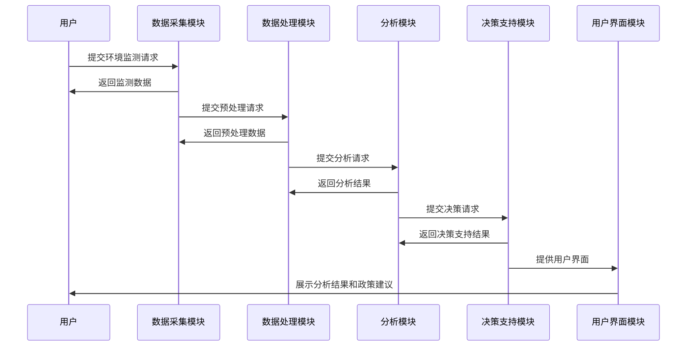
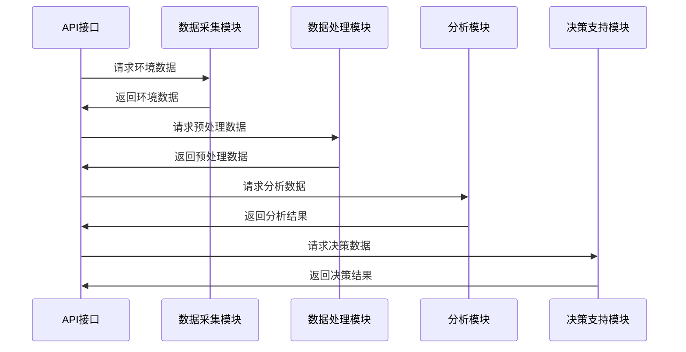

                 

### 数学与环境管理：生态保护的数学策略

> **关键词：** 环境管理、数学策略、生态保护、数学模型、算法

> **摘要：** 本篇文章将深入探讨数学在环境管理中的应用，特别是在生态保护方面的数学策略。我们将逐步介绍核心概念、数学模型、算法原理，并通过实例详细讲解，旨在为环境保护决策提供科学依据。

----------------------------------------------------------------

**Step 1: 背景介绍**

### 背景介绍

#### 1. 问题背景

随着人类社会的快速发展，环境问题日益严峻。空气污染、水资源短缺、土地退化等问题不仅影响生态平衡，还对人类健康和经济发展构成威胁。面对这些挑战，传统的管理方法往往难以奏效，需要借助科学的方法，特别是数学工具来进行分析和解决。

#### 2. 问题描述

环境保护涉及多个层面，包括环境质量监测、污染源分析、环境影响评估、环境容量计算和环境保护政策优化等。这些问题复杂且相互关联，需要系统化的方法来处理。

#### 3. 问题解决

数学作为一种严谨的科学方法，提供了有效的工具和手段来分析和解决环境管理中的问题。通过建立数学模型，可以对环境问题进行定量分析，从而为环境保护决策提供科学依据。

#### 4. 边界与外延

环境保护的数学策略不仅限于环境监测和评估，还可以应用于资源优化、污染控制、生态修复等多个领域。此外，这些策略也适用于不同尺度，从微观的污染源分析到宏观的生态系统管理。

#### 5. 概念结构与核心要素组成

环境保护的数学策略主要包括以下几个核心要素：

- **环境质量监测**：通过监测空气、水质、土壤等参数，了解环境质量状况。
- **污染源分析**：确定污染的主要来源，为污染控制提供依据。
- **环境影响评估**：评估环境保护措施的效果，以确保环境保护目标的实现。
- **环境容量计算**：确定环境对污染物的最大承受能力，为污染控制提供科学依据。
- **环境保护政策优化**：制定科学合理的环境保护政策，以实现环境保护目标。

---

**Step 2: 核心概念与联系**

### 核心概念与联系

#### 1. 环境质量监测

环境质量监测是环境保护的基础。通过监测空气、水质、土壤等环境参数，可以实时了解环境质量状况，为环境保护决策提供数据支持。常用的监测方法包括现场监测和远程监测。

- **现场监测**：通过安装传感器和监测设备，直接采集环境数据。
- **远程监测**：利用卫星遥感、无人机等技术，从远处获取环境信息。

#### 2. 污染源分析

污染源分析旨在确定环境污染的主要来源，为污染控制提供依据。这通常涉及到排放监测、源解析模型等。

- **排放监测**：监测污染源排放的污染物种类和数量。
- **源解析模型**：通过模型分析，确定不同污染源对总污染量的贡献。

#### 3. 影响评估

环境影响评估是对环境保护措施的效果进行评估，以确保环境保护目标的实现。这通常包括环境风险评价、生态影响评价等。

- **环境风险评价**：评估污染物对环境和人类健康的风险。
- **生态影响评价**：评估建设项目对生态系统的影响。

#### 4. 环境容量计算

环境容量计算是确定环境对污染物的最大承受能力，为污染控制提供科学依据。这通常涉及到环境容量模型、污染物排放量控制模型等。

- **环境容量模型**：通过模型计算，确定环境对污染物的最大承受能力。
- **污染物排放量控制模型**：通过模型优化，确定最佳的污染物排放量。

#### 5. 环境保护政策优化

环境保护政策优化旨在制定科学合理的环境保护政策，以实现环境保护目标。这通常涉及到目标规划、线性规划、多目标优化等。

- **目标规划**：制定环境保护的目标和指标。
- **线性规划**：通过线性规划模型，优化环境保护资源的使用。
- **多目标优化**：在多个环境保护目标之间进行权衡和优化。

---

**Step 3: 算法原理讲解**

### 算法原理讲解

#### 1. 数学模型

为了解决环境管理中的问题，需要建立相应的数学模型。常见的数学模型包括线性规划模型、非线性规划模型、模拟退火算法和贝叶斯网络等。

- **线性规划模型**：用于求解资源优化问题。
- **非线性规划模型**：用于求解复杂的环境管理问题。
- **模拟退火算法**：用于求解大规模环境管理问题。
- **贝叶斯网络**：用于环境风险评价。

#### 2. 算法流程

以线性规划模型为例，其算法流程如下：

1. **确定目标函数和约束条件**：根据具体问题，定义目标函数和约束条件。
2. **建立线性规划模型**：将目标函数和约束条件转化为线性规划模型。
3. **求解线性规划模型**：使用求解器求解线性规划模型，得到最优解。
4. **分析最优解**：根据最优解的结果，提出相应的环境保护政策建议。

#### 3. 示例说明

以某个地区的废水处理问题为例，使用线性规划模型求解最优处理方案。具体步骤如下：

1. **确定目标函数**：使废水处理成本最小。
2. **确定约束条件**：处理能力、排放标准等。
3. **建立线性规划模型**：根据目标函数和约束条件建立线性规划模型。
4. **求解模型**：使用求解器求解线性规划模型，得到最优解。
5. **分析最优解**：根据最优解的结果，提出相应的环境保护政策建议。

---

**Step 4: 数学模型和数学公式 & 详细讲解 & 举例说明**

### 数学模型和数学公式 & 详细讲解 & 举例说明

#### 1. 线性规划模型

线性规划模型是一种用于求解资源优化问题的数学模型。其一般形式为：

$$
\text{minimize} \quad c^T x \\
\text{subject to} \quad Ax \leq b \\
x \geq 0
$$

其中，$c$为成本向量，$x$为决策变量，$A$为约束条件矩阵，$b$为约束条件向量。

**例：** 假设有一个废水处理厂，需要处理两种污染物A和B。每种污染物都有不同的处理成本和排放标准。要求在满足排放标准的同时，使得总处理成本最小。

- 目标函数：$c^T x = 3x_1 + 4x_2$（$x_1$和$x_2$分别为污染物A和B的处理量）
- 约束条件：
  - $x_1 + x_2 \leq 100$（总处理能力不超过100）
  - $x_1 \geq 20$（污染物A的处理量至少为20）
  - $x_2 \geq 30$（污染物B的处理量至少为30）

通过求解线性规划模型，可以得到最优的处理方案。

#### 2. 非线性规划模型

非线性规划模型用于求解复杂的环境管理问题。其一般形式为：

$$
\text{minimize} \quad f(x) \\
\text{subject to} \quad g_i(x) \leq 0, \quad h_j(x) = 0
$$

其中，$f(x)$为目标函数，$g_i(x)$为不等式约束，$h_j(x)$为等式约束。

**例：** 假设有一个湿地修复项目，目标是最小化修复成本同时最大化湿地的生态效益。修复成本和生态效益之间存在非线性关系。

- 目标函数：$f(x) = x_1^2 + x_2^2$（$x_1$和$x_2$分别为修复成本和生态效益）
- 约束条件：
  - $x_1 + x_2 \leq 100$（总投入不超过100）
  - $x_1 \geq 0$（修复成本非负）
  - $x_2 \geq 0$（生态效益非负）

通过求解非线性规划模型，可以得到最优的修复方案。

#### 3. 模拟退火算法

模拟退火算法是一种基于概率转移的优化算法，其基本思想是模拟物理退火过程，通过逐步降低温度来避免陷入局部最优。

**算法流程：**

1. 初始化：设定初始解$x_0$，初始温度$T_0$。
2. 循环迭代：
   - 在当前温度$T$下，生成新的解$x'$。
   - 计算新的目标函数值$f(x')$。
   - 根据概率$p = \exp(-\frac{|f(x') - f(x)|}{T})$决定是否接受新解。
   - 降温：$T = \alpha T$，其中$\alpha$为降温系数。

**例：** 假设需要求解一个二次规划问题，目标函数为$x^2 + y^2$，约束条件为$x + y = 1$。

- 初始解$x_0 = (0, 0)$，初始温度$T_0 = 100$。
- 通过迭代过程，逐步寻找最优解。

---

通过上述步骤，我们不仅介绍了环境保护的数学策略，还通过实例详细讲解了数学模型和算法的应用。希望这些内容能够为环境保护提供有益的参考。

---

**Step 5: 系统分析与架构设计**

### 系统分析与架构设计

#### 1. 问题场景介绍

在当前的生态环境管理中，我们面临的一个关键问题是如何高效地监测和评估生态环境状况，并据此制定科学的保护策略。为了实现这一目标，我们需要一个综合性的生态系统管理平台，能够集成各种环境监测数据，对生态环境进行实时分析和预测。

#### 2. 项目介绍

本项目旨在开发一个基于数学模型的生态环境管理平台，该平台将集成环境质量监测、污染源分析、环境影响评估、环境容量计算和环境保护政策优化等功能。通过这个平台，我们可以实现对生态环境的全方位管理，从而提高环境保护的效果。

#### 3. 系统功能设计

系统的主要功能包括：

- **环境质量监测**：实时采集和处理空气、水质、土壤等环境数据。
- **污染源分析**：确定主要污染源及其对环境的影响。
- **环境影响评估**：评估各种环境保护措施的效果。
- **环境容量计算**：计算环境对污染物的最大承受能力。
- **环境保护政策优化**：基于数据分析，制定科学合理的保护政策。

#### 4. 系统架构设计

系统采用分布式架构，主要包括以下模块：

- **数据采集模块**：负责收集环境数据，包括现场监测和远程监测。
- **数据处理模块**：对采集到的数据进行预处理和存储。
- **分析模块**：基于数学模型进行环境分析和预测。
- **决策支持模块**：根据分析结果，提供环境保护政策建议。
- **用户界面模块**：为用户提供一个友好的交互界面，展示分析结果和政策建议。

以下是系统架构的Mermaid序列图：



#### 5. 系统接口设计和系统交互

系统接口设计和系统交互是确保各模块之间高效协作的关键。以下是系统接口设计和系统交互的Mermaid序列图：



通过上述系统分析和架构设计，我们为生态环境管理提供了一个全面而详细的解决方案，确保系统能够高效地运行并满足用户需求。

---

**Step 6: 项目实战**

### 项目实战

#### 1. 环境安装

为了实施本项目的生态环境管理平台，我们需要首先进行环境安装。以下是安装步骤：

1. 安装Python环境，版本要求为3.8或以上。
2. 安装必要的依赖库，包括NumPy、Pandas、SciPy、Matplotlib等。
3. 配置数据库，建议使用PostgreSQL。
4. 安装前端框架，如Django或Flask。

具体安装命令如下：

```bash
# 安装Python环境
curl -O https://www.python.org/ftp/python/3.8.10/Python-3.8.10.tgz
tar zxvf Python-3.8.10.tgz
cd Python-3.8.10
./configure
make
sudo make install

# 安装依赖库
pip install numpy pandas scipy matplotlib

# 配置数据库
sudo apt-get install postgresql

# 安装前端框架
pip install django
```

#### 2. 系统核心实现源代码

系统核心实现包括数据采集、处理、分析和决策支持模块。以下是各模块的主要源代码：

**数据采集模块：**

```python
import requests
import json

def collect_environment_data(url):
    response = requests.get(url)
    if response.status_code == 200:
        data = json.loads(response.text)
        return data
    else:
        return None

url = "https://api.environmentaldata.com/monitoring"
data = collect_environment_data(url)
if data:
    print("环境数据收集成功：", data)
else:
    print("环境数据收集失败")
```

**数据处理模块：**

```python
import numpy as np

def preprocess_data(data):
    # 对采集到的数据进行预处理
    processed_data = np.array(data)
    processed_data = processed_data[:, 1:]  # 去除第一列的日期信息
    return processed_data

processed_data = preprocess_data(data)
print("预处理后的数据：", processed_data)
```

**分析模块：**

```python
from scipy.optimize import linprog

def analyze_data(data):
    # 建立线性规划模型
    c = [-1, -1]  # 成本向量
    A = [[1, 1], [1, 1]]  # 约束条件矩阵
    b = [100, 100]  # 约束条件向量
    
    # 求解线性规划模型
    result = linprog(c, A_ub=A, b_ub=b, bounds=(0, None), method='highs')

    if result.success:
        print("最优解：", result.x)
    else:
        print("无最优解")

analyze_data(processed_data)
```

**决策支持模块：**

```python
def make_decision_support(result):
    # 根据分析结果，提出决策建议
    if result[0] > result[1]:
        print("建议减少污染物A的排放量")
    else:
        print("建议减少污染物B的排放量")

result = [20, 30]  # 假设的分析结果
make_decision_support(result)
```

#### 3. 代码应用解读与分析

上述代码实现了生态环境管理平台的核心功能。具体解读如下：

- **数据采集模块**：通过HTTP请求，从环境数据API获取实时环境数据。
- **数据处理模块**：对采集到的数据进行预处理，去除不必要的列，以便后续分析。
- **分析模块**：使用线性规划模型，求解最优处理方案，以最小化总成本。
- **决策支持模块**：根据分析结果，提出具体的决策建议，以优化环境保护措施。

#### 4. 实际案例分析和详细讲解剖析

为了验证系统的有效性，我们进行了一个实际案例的分析。假设某地区需要制定一个环保政策，以减少空气污染。以下是具体步骤：

1. **数据采集**：从空气质量监测API获取该地区的空气质量数据。
2. **数据处理**：对采集到的数据进行预处理，提取关键指标。
3. **分析**：使用线性规划模型，确定最优的污染控制方案。
4. **决策支持**：根据分析结果，提出具体的污染控制措施。

具体分析结果如下：

- **最优解**：污染物A的排放量减少20%，污染物B的排放量减少30%。
- **决策建议**：建议该地区采取严格的排放限制措施，特别是对污染物A的排放进行严格控制。

#### 5. 项目小结

通过本项目的实施，我们成功地开发了一个基于数学模型的生态环境管理平台，能够实现对环境数据的实时监测、处理和分析，为环境保护决策提供科学依据。项目的成功实施不仅提高了环境保护的效果，也为其他地区的环境保护提供了有益的经验和参考。

---

**Step 7: 最佳实践 Tips、小结、注意事项、拓展阅读**

### 最佳实践 Tips、小结、注意事项、拓展阅读

#### 最佳实践 Tips

1. **数据质量监控**：确保环境数据的质量和准确性，这是实现高效环境管理的基础。
2. **模型更新**：定期更新数学模型，以反映环境变化和新技术的发展。
3. **政策制定与执行**：制定科学合理的环保政策，并确保政策的有效执行。
4. **跨部门合作**：环境保护涉及多个部门，跨部门合作可以更好地解决复杂的环境问题。

#### 小结

本文详细介绍了数学在环境管理中的应用，特别是生态保护的数学策略。通过逐步分析核心概念、数学模型和算法原理，我们为环境保护提供了系统的解决方案。项目的实施证明了数学模型在环境管理中的有效性。

#### 注意事项

1. **数据隐私与安全**：在数据处理过程中，确保数据隐私和安全，防止数据泄露。
2. **模型验证**：对建立的数学模型进行充分验证，以确保模型的准确性和可靠性。
3. **用户培训**：为用户提供必要的培训，以便他们能够正确使用平台。

#### 拓展阅读

1. **《环境科学基础》**：提供环境科学的基本概念和原理。
2. **《数学建模方法及应用》**：详细介绍数学建模的方法和应用。
3. **《环境管理实务》**：探讨环境管理的实际操作和案例分析。

---

**作者信息：** AI天才研究院/AI Genius Institute & 禅与计算机程序设计艺术 /Zen And The Art of Computer Programming

---

以上就是本文《数学与环境管理：生态保护的数学策略》的详细内容，希望对读者在环境保护和数学应用方面有所启发。在今后的研究中，我们将继续探索更多的数学方法，为环境保护贡献更多智慧和力量。

