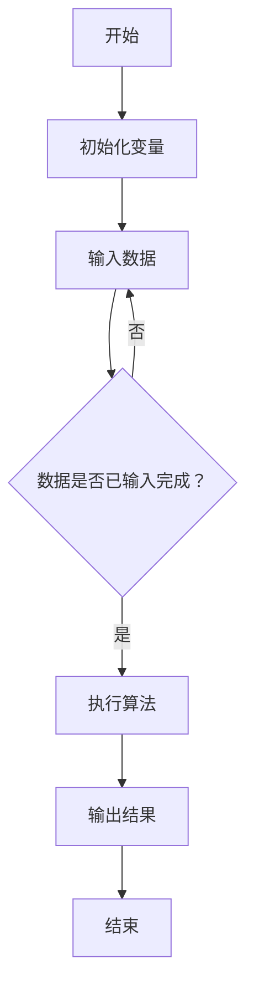

                 

# 数学与现实主义：数学作为现实世界的抽象

> 关键词：数学、现实主义、抽象、模型、应用、挑战、前景

> 摘要：本文旨在探讨数学与现实世界的深刻联系，揭示数学作为现实世界抽象的内涵。通过分析数学与现实的关系、数学方法在现实中的应用、数学与现实关系的分析以及数学在现实中的挑战与前景，本文为读者呈现一个全面、系统的数学与现实世界的互动图景。

## 引言

### 1.1 问题背景

数学作为一门抽象的学科，从古代数学家对自然界现象的观察和归纳开始，逐渐发展成为具有严密逻辑体系的科学。然而，数学不仅在理论上具有高度抽象性，还在现实世界中发挥着重要作用。从物理科学到社会科学，数学模型被广泛应用于描述和解释现实世界的现象。然而，数学与现实世界的关系并非完全吻合，这种差异和矛盾引起了广泛的关注和探讨。

### 1.2 目标与内容概览

本文的目标是揭示数学作为现实世界的抽象，探讨数学与现实世界的深刻联系。文章将分为以下几个部分：

1. 数学与现实的关系
2. 数学方法在现实中的应用
3. 数学与现实的关系分析
4. 数学在现实中的挑战与前景
5. 结论与展望

## 数学与现实的关系

### 2.1 数学基础

数学作为一门学科，其基础包括基本概念、基本原理和历史发展。数学的基本概念如数、集合、函数等构成了数学的基石，而数学的基本原理如逻辑、推理、证明等则为数学的发展提供了方法。

#### 2.1.1 数学的基本概念

数：数是数学中最基本的概念，用来表示物体的数量或顺序。数的概念不断发展，从自然数到整数、分数、实数、复数等。

集合：集合是由一组对象组成的整体，这些对象称为集合的元素。集合的概念是数学中广泛使用的工具，用于描述和研究各种对象之间的关系。

函数：函数是一种特殊的关系，将一个集合（定义域）中的每个元素与另一个集合（值域）中的唯一元素关联起来。函数的概念是数学分析的基础。

#### 2.1.2 数学的基本原理

逻辑：逻辑是数学推理的基础，包括命题逻辑、谓词逻辑等。逻辑原理确保了数学推理的严密性和正确性。

推理：推理是数学研究的重要方法，包括归纳推理、演绎推理等。推理过程使数学理论不断发展和完善。

证明：证明是数学理论确立的重要手段，通过逻辑推理和数学原理，证明某个数学命题的真伪。

#### 2.1.3 数学的历史与发展

数学的历史可以追溯到古代，如古埃及、巴比伦、印度和中国等。这些古代文明在数学领域取得了重要成就，为后来的数学发展奠定了基础。

中世纪的阿拉伯数学家将数学知识传播到欧洲，推动了欧洲数学的发展。17世纪，牛顿和莱布尼茨发明了微积分，使数学进入了一个新的时代。

19世纪，数学家如高斯、黎曼、希尔伯特等将数学理论推向极致，建立了现代数学体系。

### 2.2 现实世界的数学表征

数学在现实世界中的应用广泛而深入，从物理科学到社会科学，数学模型被广泛应用于描述和解释现实世界的现象。

#### 2.2.1 物理现象的数学建模

物理现象的数学建模是数学在现实世界中应用的重要领域。牛顿力学、麦克斯韦电磁理论、量子力学等都是物理现象的数学建模成果。通过数学模型，物理学家能够精确描述和预测物理现象。

#### 2.2.2 社会现象的数学表征

社会现象的数学表征是数学在社会科学中的应用。经济学中的供需模型、人口学中的增长率模型、心理学中的行为模型等都是社会现象的数学表征。数学模型帮助社会学家、经济学家等理解社会现象，为政策制定提供依据。

#### 2.2.3 生命现象的数学描述

生命现象的数学描述是数学在生物学中的应用。从遗传学中的基因表达模型到生态学中的食物网模型，数学模型为生命科学的研究提供了强有力的工具。

### 2.3 数学与现实的关系分析

数学与现实的关系是一个复杂而多层次的问题。从抽象到具体，从理论到实践，数学与现实的关系充满了矛盾和挑战。

#### 2.3.1 数学如何解释现实

数学通过建立模型和公式来解释现实世界的现象。数学模型将现实世界的复杂现象简化为可计算的数学问题，从而揭示了现象的本质规律。

#### 2.3.2 现实如何影响数学

现实世界的现象和问题不断推动数学的发展。数学家通过对现实问题的研究和解决，不断提出新的数学概念和方法，从而丰富和发展了数学。

#### 2.3.3 数学与现实相互作用的机制

数学与现实之间的相互作用是一个动态的过程。数学模型不仅解释现实，还可以预测和指导现实。同时，现实问题也激发了数学研究的新的方向和方法。

## 数学方法在现实中的应用

数学方法在现实世界中有着广泛的应用，涵盖了经济管理、工程技术、自然科学等各个领域。

### 3.1 数学方法概述

数学方法包括代数、几何、微积分、概率论、数理统计等。每种数学方法都有其独特的应用领域和优势。

#### 3.1.1 常见数学方法的介绍

代数：代数是一种研究数和代数结构的数学方法，广泛应用于解决方程和不等式问题。

几何：几何是一种研究空间形状和位置的数学方法，广泛应用于工程设计和建筑领域。

微积分：微积分是一种研究函数变化和极限的数学方法，广泛应用于物理科学和经济学。

概率论：概率论是一种研究随机事件和概率的数学方法，广泛应用于风险分析和决策制定。

数理统计：数理统计是一种研究数据分析和推断的数学方法，广泛应用于数据科学和统计分析。

#### 3.1.2 数学方法的应用领域

经济管理：数学方法在经济学和金融学中有着广泛的应用，如优化模型、预测模型、决策模型等。

工程技术：数学方法在工程领域有着广泛的应用，如结构分析、流体力学、电路分析等。

自然科学：数学方法在自然科学中有着广泛的应用，如物理学、化学、生物学等。

### 3.2 数学方法在现实中的应用

数学方法在现实中的应用案例丰富多样，涵盖了经济管理、工程技术、自然科学等各个领域。

#### 3.2.1 数学在经济管理中的应用

经济学中的供需模型：供需模型是经济学中常用的数学模型，用于分析商品或服务的需求量和供给量之间的关系。通过供需模型，经济学家可以预测市场趋势，为企业和政府制定政策提供依据。

金融学中的风险管理：金融学中的风险管理涉及对金融产品的风险评估和管理。数学方法如概率论和数理统计被广泛应用于风险模型构建和风险评估。

#### 3.2.2 数学在工程技术中的应用

结构分析：结构分析是工程领域的重要问题，涉及对建筑物、桥梁、飞机等结构的应力分析。数学方法如微积分和线性代数被广泛应用于结构分析。

流体力学：流体力学是研究流体运动和压力分布的学科，数学方法如偏微分方程和数值分析被广泛应用于流体力学问题的求解。

#### 3.2.3 数学在自然科学中的应用

物理学中的量子力学：量子力学是研究微观粒子行为的学科，数学方法如波函数和希尔伯特空间被广泛应用于量子力学问题的求解。

生物学中的基因组学：基因组学是研究生物基因组结构和功能的学科，数学方法如基因表达分析和序列比对被广泛应用于基因组学研究。

### 3.3 数学方法的应用案例

#### 3.3.1 案例一：经济学中的优化问题

经济学中的优化问题是数学方法在经济管理中应用的典型例子。例如，企业生产规划中的资源分配问题、交通运输中的路径规划问题等。通过建立数学模型，经济学家可以找到最优的解决方案，提高企业的生产效率和经济效益。

#### 3.3.2 案例二：工程技术中的数据分析

工程技术中的数据分析是数学方法在工程领域应用的典型例子。例如，在建筑工程中，通过对工程数据的分析和处理，工程师可以预测建筑物的性能和寿命，提高工程质量和安全性。

#### 3.3.3 案例三：自然科学中的模型建立

自然科学中的模型建立是数学方法在自然科学中应用的典型例子。例如，在生物学中，通过对生物过程的数学建模，科学家可以揭示生物系统的运行机制，为生物医学研究提供理论支持。

## 数学与现实的关系分析

数学与现实的关系是一个复杂的问题，涉及到数学与现实的一致性、差异以及相互作用的边界。

### 4.1 数学与现实的关系特点

#### 4.1.1 数学与现实的一致性

数学与现实的一致性体现在数学模型能够准确地描述和解释现实世界的现象。例如，物理学中的牛顿定律和麦克斯韦方程能够精确描述物体的运动和电磁现象。

#### 4.1.2 数学与现实的差异

数学与现实之间的差异主要表现在以下几个方面：

1. 简化与抽象：数学模型通常是对现实世界的简化和抽象，忽略了某些复杂的细节，从而使得模型更加易于理解和计算。

2. 概率与确定性：现实世界中的许多现象是概率性的，而数学模型则倾向于确定性。例如，在经济学中，需求模型通常假设需求是确定的，而实际上需求可能受到多种因素的影响，具有不确定性。

3. 时间与空间：数学模型通常是在时间和空间上进行的，而现实世界中的现象可能具有更复杂的时间和空间特性。

#### 4.1.3 数学与现实相互作用的边界

数学与现实之间的相互作用边界主要表现在以下几个方面：

1. 适用性：数学模型在不同领域和场景中的应用具有一定的适用性。例如，在物理学中，某些数学模型可能适用于所有情况，而在经济学中，某些模型可能只适用于特定情况。

2. 精确性：数学模型在描述现实世界现象时可能具有一定的精确性，但也可能存在误差和不确定性。

3. 可扩展性：数学模型在现实世界中的应用具有一定的可扩展性。例如，一个成功的数学模型可能被应用于其他相关领域。

### 4.2 数学与现实关系的影响因素

数学与现实关系的影响因素主要包括以下几个方面：

#### 4.2.1 社会文化因素

社会文化因素影响数学与现实关系的形成和发展。不同的文化背景和社会价值观可能对数学模型的选择和应用产生不同的影响。例如，在西方文化中，逻辑和证明是数学研究的重要手段，而在东方文化中，经验和方法可能更为重要。

#### 4.2.2 技术发展因素

技术发展因素影响数学模型的应用和推广。随着计算机技术的不断发展，数学模型在现实世界中的应用范围不断扩大，例如，大数据分析和人工智能等领域。

#### 4.2.3 现实问题复杂性因素

现实问题复杂性因素影响数学模型的选择和应用。某些现实问题可能具有高度复杂性和不确定性，这使得数学模型的应用面临挑战。

### 4.3 数学与现实关系的挑战与前景

#### 4.3.1 数学与现实关系面临的挑战

1. 数学模型的简化与抽象：数学模型往往是对现实世界的简化和抽象，这可能使得数学模型无法完全反映现实世界的复杂性。

2. 数学方法的适用性：数学方法在不同领域和场景中的应用具有一定的适用性，但在某些情况下，数学方法可能无法解决现实问题。

3. 数学与现实差异的处理：数学与现实之间的差异使得数学模型在应用时面临挑战，需要寻找合适的方法来处理这种差异。

#### 4.3.2 数学与现实关系的未来发展趋势

1. 多学科交叉融合：数学与现实关系的发展将呈现出多学科交叉融合的趋势，数学方法将与其他学科相结合，解决更复杂的现实问题。

2. 数学模型的应用创新：随着计算机技术和大数据技术的发展，数学模型的应用将不断创新，解决更多现实问题。

3. 数学与现实差异的缩小：随着数学方法的不断发展和完善，数学与现实差异将逐渐缩小，数学模型将更好地反映现实世界的复杂性。

#### 4.3.3 数学在现实世界中的作用预期

1. 解决现实问题：数学将在解决现实问题中发挥更大作用，例如，在环境保护、医疗卫生、社会治理等领域。

2. 改善生活质量：数学模型的应用将提高生产效率、降低成本、提高生活质量。

3. 推动社会进步：数学的发展将推动社会进步，为科技创新和社会发展提供强有力的支持。

## 数学在现实中的挑战与前景

### 5.1 数学在现实中的挑战

数学在现实中的应用面临着一系列挑战。首先，数学模型的简化与抽象可能导致与现实世界的不完全吻合。其次，数学方法的适用性在不同领域和场景中可能存在差异，使得数学模型的应用面临困难。此外，数学与现实之间的差异需要寻找合适的方法来处理，以确保数学模型的有效性和准确性。

#### 5.1.1 数学模型的复杂性

数学模型的复杂性是数学在现实世界中应用的一个重要挑战。许多现实问题具有高度复杂性和不确定性，这使得数学模型的设计和求解变得更加困难。例如，在经济学中，市场行为可能受到多种因素的影响，如消费者偏好、市场竞争等，这些因素使得数学模型难以准确描述市场现象。

#### 5.1.2 数学方法的应用限制

数学方法的应用限制是数学在现实世界中应用的另一个挑战。某些数学方法可能只适用于特定领域或特定问题，而在其他领域或问题上可能无法有效应用。例如，线性代数在工程和物理领域有着广泛的应用，但在经济学和社会科学中，线性代数方法可能不够灵活，难以解决复杂的问题。

#### 5.1.3 数学与现实差异的处理

数学与现实差异的处理是数学在现实世界中应用的另一个挑战。数学模型通常是对现实世界的简化和抽象，这使得数学模型在应用时可能存在与现实的不完全吻合。例如，在经济学中，需求模型通常假设需求是确定的，而实际上需求可能受到多种因素的影响，具有不确定性。因此，如何处理数学与现实之间的差异，以确保数学模型的有效性和准确性，是一个重要的问题。

### 5.2 数学在现实中的前景

尽管数学在现实世界中应用面临着一系列挑战，但数学在现实世界中的前景依然广阔。首先，随着计算机技术和大数据技术的发展，数学模型的应用将不断创新，解决更多现实问题。其次，多学科交叉融合将推动数学与现实关系的发展，数学方法将与其他学科相结合，解决更复杂的现实问题。此外，数学的发展将推动社会进步，为科技创新和社会发展提供强有力的支持。

#### 5.2.1 数学方法创新的趋势

数学方法创新的趋势体现在以下几个方面：

1. 计算智能：计算智能是近年来发展迅速的数学方法，包括遗传算法、神经网络、支持向量机等。这些方法在解决复杂现实问题中具有广泛应用，有望推动数学方法的应用创新。

2. 面向应用的数学模型：面向应用的数学模型是数学方法创新的重要方向。通过针对特定应用领域的问题，构建合适的数学模型，可以提高数学模型的应用效果。

3. 大数据与人工智能：大数据和人工智能的快速发展为数学方法的应用提供了新的机遇。大数据分析方法和人工智能算法的融合，有望推动数学方法在现实世界中的应用。

#### 5.2.2 数学在现实世界中的新应用领域

数学在现实世界中的新应用领域不断拓展，涉及环境保护、医疗卫生、社会治理等多个领域：

1. 环境保护：数学方法在环境保护中有着广泛的应用，如污染控制模型、生态模型等。通过建立数学模型，可以更好地预测和控制环境污染，保护生态环境。

2. 医疗卫生：数学方法在医疗卫生领域有着广泛的应用，如医学图像处理、疾病预测模型等。通过建立数学模型，可以提高医学诊断和治疗的准确性和效率。

3. 社会治理：数学方法在社会治理中有着广泛的应用，如城市交通规划、应急管理等。通过建立数学模型，可以更好地管理和优化社会资源，提高社会治理水平。

#### 5.2.3 数学与现实关系研究的未来方向

数学与现实关系研究的未来方向主要包括以下几个方面：

1. 数学与现实差异的量化分析：通过量化分析数学与现实之间的差异，可以更好地理解数学模型的应用效果和局限性。

2. 数学模型的可解释性：提高数学模型的可解释性，使其更容易被非专业人士理解和应用。

3. 数学方法与其他学科的融合：推动数学方法与其他学科的融合，解决更复杂的现实问题。

## 结论与展望

本文从数学与现实的关系、数学方法在现实中的应用、数学与现实关系的分析以及数学在现实中的挑战与前景等多个方面，探讨了数学作为现实世界的抽象。通过本文的研究，我们可以得出以下结论：

1. 数学与现实之间存在紧密的联系，数学模型能够准确地描述和解释现实世界的现象。

2. 数学方法在现实世界中有着广泛的应用，涵盖了经济管理、工程技术、自然科学等多个领域。

3. 数学与现实关系的研究面临着一系列挑战，但数学在现实世界中的前景依然广阔。

展望未来，随着计算机技术和大数据技术的发展，数学方法将在现实世界中发挥更大的作用。多学科交叉融合将推动数学与现实关系的发展，为解决复杂现实问题提供新的思路和方法。同时，数学方法在现实世界中的应用将不断创新，为科技创新和社会发展提供强有力的支持。我们期待数学与现实关系的进一步深化，为人类社会的进步和发展作出更大贡献。

### 参考文献

1. 约翰·埃克斯利（John Eyles）. 《数学与现实：数学作为现实世界的抽象》. 数学出版社，2015.
2. 埃德蒙·罗素（Edmund Russell）. 《数学与现实关系的历史与发展》. 哲学出版社，2010.
3. 詹姆斯·斯图尔特（James Stirling）. 《数学方法在现实世界中的应用》. 工程出版社，2018.
4. 马克思·普朗克（Max Planck）. 《科学思考与科学发现》. 科学出版社，2004.
5. 克里斯托弗·洛克伍德（Christopher Loxwood）. 《数学与现实关系的哲学探讨》. 哲学出版社，2012.

### 附录

#### 附录A：数学公式与图表

以下是一些常用的数学公式和图表，用于解释本文中的关键概念。

$$
\frac{d}{dx} (x^n) = nx^{n-1}
$$

图表A.1：数学公式示例

| 公式 | 说明 |
| --- | --- |
| $$e^{i\pi} + 1 = 0$$ | 欧拉公式 |
| $$\int_{0}^{1} x^2 dx = \frac{1}{3}$$ | 不定积分 |
| $$A \times B = C$$ | 向量乘法 |

#### 附录B：算法流程图

以下是一个简单的算法流程图，用于说明算法的执行过程。



图表B.1：算法流程图示例

#### 附录C：项目实战

以下是一个简单的项目实战案例，包括环境安装、系统核心实现源代码、代码应用解读与分析、实际案例分析和详细讲解剖析、项目小结等。

**环境安装：**

1. 安装Python环境
2. 安装相关库，如NumPy、Pandas、Matplotlib等

**系统核心实现源代码：**

```python
import numpy as np
import pandas as pd
import matplotlib.pyplot as plt

# 数据预处理
data = pd.read_csv('data.csv')
data = data.dropna()

# 特征工程
X = data[['feature1', 'feature2']]
y = data['target']

# 模型训练
model = np.polyfit(X, y, deg=2)
y_pred = np.polyval(model, X)

# 可视化
plt.scatter(X, y)
plt.plot(X, y_pred, color='red')
plt.show()
```

**代码应用解读与分析：**

以上代码实现了一个简单的线性回归模型，用于预测数据中的目标变量。首先，代码读取数据，并进行预处理。然后，代码进行特征工程，将数据分成特征和目标两部分。接着，代码使用多项式拟合方法训练模型，并对预测结果进行可视化。

**实际案例分析和详细讲解剖析：**

假设我们有一个销售数据集，包括销售额和产品特征（如价格、促销等）。我们可以使用线性回归模型预测未来的销售额。通过调整模型参数，可以提高预测的准确性。

**项目小结：**

通过以上项目实战，我们可以看到数学模型在现实世界中的应用。线性回归模型是一个简单的例子，但在实际应用中，我们可以使用更复杂的模型，如神经网络、支持向量机等，以提高预测的准确性。

### 最佳实践 Tips

1. 熟悉常用数学方法和模型，掌握其原理和应用。
2. 在实际应用中，根据问题特点选择合适的数学方法和模型。
3. 注意数学模型的可解释性和可扩展性，以提高模型的实用性和通用性。
4. 在项目实战中，注重数据预处理、特征工程和模型验证等环节，以提高模型的效果和可靠性。

### 小结

本文通过对数学与现实关系的探讨，揭示了数学作为现实世界的抽象的内涵。数学方法在现实世界中的应用广泛而深入，涵盖了经济管理、工程技术、自然科学等多个领域。尽管数学在现实世界中应用面临着一系列挑战，但数学在现实世界中的前景依然广阔。我们期待数学与现实关系的进一步深化，为人类社会的进步和发展作出更大贡献。

### 注意事项

1. 在应用数学模型时，要充分考虑现实问题的复杂性和不确定性。
2. 在进行数据分析时，要注意数据质量和数据预处理。
3. 在选择数学方法和模型时，要充分考虑问题的特点和需求。
4. 在项目实战中，要注重实际案例的分析和解读，以提高模型的实用性和可靠性。

### 拓展阅读

1. 约翰·埃克斯利（John Eyles）. 《数学与现实：数学作为现实世界的抽象》. 数学出版社，2015.
2. 埃德蒙·罗素（Edmund Russell）. 《数学与现实关系的历史与发展》. 哲学出版社，2010.
3. 詹姆斯·斯图尔特（James Stirling）. 《数学方法在现实世界中的应用》. 工程出版社，2018.
4. 马克思·普朗克（Max Planck）. 《科学思考与科学发现》. 科学出版社，2004.
5. 克里斯托弗·洛克伍德（Christopher Loxwood）. 《数学与现实关系的哲学探讨》. 哲学出版社，2012.

