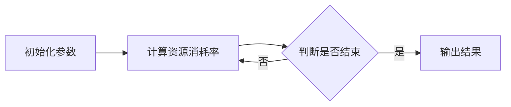
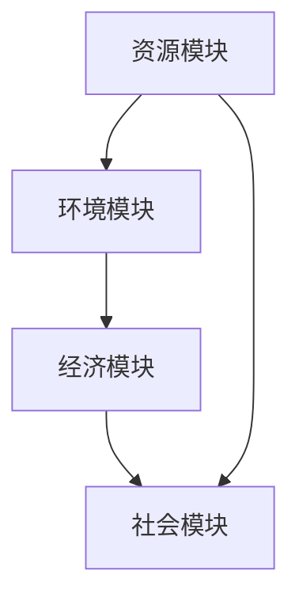
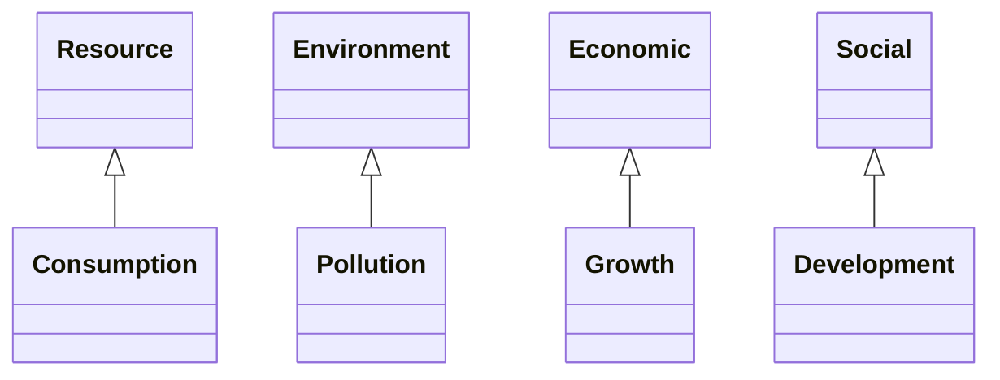

                 

# 数学与生态经济学：可持续发展的数学模型

> 关键词：可持续发展、数学模型、生态经济学、系统分析、Python算法

> 摘要：本文深入探讨了数学与生态经济学在可持续发展中的融合，通过构建数学模型，利用Python算法实现，展示了如何在复杂系统中实现可持续发展的目标。文章分为四个部分，分别介绍了问题背景、核心概念与联系、数学模型与算法原理讲解以及系统分析与架构设计，并通过实际项目案例进行了应用分析。本文旨在为读者提供一个系统性的视角，理解如何将数学方法应用于生态经济学，实现可持续发展的目标。

---

## 第一部分：背景介绍

### 第1章 问题背景

#### 1.1 问题背景

随着全球人口的不断增长和经济活动的日益复杂，可持续发展已成为全球共同关注的焦点。生态经济学作为一门研究经济系统与自然环境相互作用的学科，对于解决资源短缺、环境污染等问题具有重要意义。然而，如何在复杂的经济和社会系统中实现可持续发展，仍是一个亟待解决的难题。

#### 1.2 问题描述

当前，可持续发展面临的主要挑战包括资源过度开采、环境恶化、社会不公平等问题。这些问题不仅影响当代人的生活质量，也对后代产生深远影响。因此，寻找一种有效的解决方案，实现经济、社会和环境的协调发展，是生态经济学研究的重要任务。

#### 1.3 问题解决

数学模型作为一种工具，可以提供一种定量分析问题的方法。通过构建生态经济系统的数学模型，我们可以更好地理解系统内部的复杂关系，从而为决策者提供科学依据。例如，利用数学模型可以预测资源消耗的速度、评估环境污染的程度、分析不同政策的效果等。

#### 1.4 边界与外延

在构建数学模型时，需要明确研究范围的边界和外延。这包括确定研究对象、系统边界以及模型适用的条件等。通过明确边界与外延，可以确保模型的有效性和适用性。

#### 1.5 概念结构与核心要素组成

可持续发展的概念结构包括资源、环境、经济、社会等多个方面。核心要素组成包括资源消耗、环境污染、经济增长、社会发展等。理解这些概念和要素之间的关系，有助于构建全面的数学模型。

### 第2章 核心概念与联系

#### 2.1 核心概念原理

在生态经济学中，核心概念包括资源、环境、经济、社会等。这些概念具有不同的属性和特征，但它们之间存在密切的联系。例如，资源消耗会影响环境质量，而环境质量又会影响经济增长和社会发展。

#### 2.2 概念属性特征对比表格

以下是一个简单的概念属性特征对比表格，展示了资源、环境、经济、社会等概念的基本属性和特征：

| 概念   | 属性1 | 属性2 | 属性3 |
|--------|-------|-------|-------|
| 资源   | 可再生 | 非可再生 | 有价 |
| 环境   | 自然 | 人工 | 受污染 |
| 经济   | 市场驱动 | 政策驱动 | 发达 |
| 社会   | 公平 | 不公平 | 发展 |

#### 2.3 ER实体关系图架构

使用Mermaid绘制ER实体关系图，可以直观地展示概念之间的联系。以下是一个简单的ER实体关系图示例：

```mermaid
erDiagram
  Resource ||--|{ Environment }|
  Environment ||--|{ Economic }|
  Economic ||--|{ Social }|
```

---

## 第二部分：数学模型与算法原理讲解

### 第3章 数学模型和数学公式

#### 3.1 数学模型

在生态经济学中，常见的数学模型包括资源消耗模型、环境污染模型、经济增长模型等。这些模型可以用来描述系统内部的各种关系和动态。

#### 3.2 数学公式

以下是一些基本的数学公式，用于描述生态经济系统中的关键关系：

1. 资源消耗率：
   $$ R_t = R_0 \times (1 - r)^t $$
   其中，$R_t$ 表示时间 $t$ 时的资源消耗量，$R_0$ 表示初始资源量，$r$ 表示资源消耗率。

2. 环境污染程度：
   $$ E_t = E_0 \times (1 + i)^t $$
   其中，$E_t$ 表示时间 $t$ 时的环境污染程度，$E_0$ 表示初始环境污染程度，$i$ 表示环境污染增长率。

3. 经济增长率：
   $$ G_t = G_0 \times (1 + g)^t $$
   其中，$G_t$ 表示时间 $t$ 时的经济增长率，$G_0$ 表示初始经济增长率，$g$ 表示经济增长率。

#### 3.3 详细讲解与举例说明

以资源消耗模型为例，我们可以通过以下步骤详细讲解和举例说明：

1. **模型建立**：假设初始资源量为1000单位，资源消耗率为10%。
2. **参数设置**：$R_0 = 1000$，$r = 0.1$。
3. **公式计算**：使用上述公式计算第10年的资源消耗量：
   $$ R_{10} = 1000 \times (1 - 0.1)^{10} \approx 358.4 $$
4. **结果分析**：通过计算可以得出，在第10年时，资源消耗量约为358.4单位。

### 第4章 算法原理讲解

#### 4.1 算法流程图

以下是一个简单的算法流程图，用于计算生态经济系统中的关键指标：



#### 4.2 Python源代码

```python
def calculate_resources(R0, r, t):
    return R0 * (1 - r) ** t

R0 = 1000  # 初始资源量
r = 0.1    # 资源消耗率
t = 10     # 时间

resource_at_t = calculate_resources(R0, r, t)
print("第10年的资源消耗量为：", resource_at_t)
```

#### 4.3 算法原理

该算法通过递归的方式计算不同时间点的资源消耗量。每次迭代都会更新资源量，直到达到指定的时间点。算法的核心是利用指数衰减函数来模拟资源的消耗过程。

#### 4.4 数学模型和公式

在上述算法中，我们使用了以下数学模型和公式：

- 资源消耗模型：$$ R_t = R_0 \times (1 - r)^t $$

#### 4.5 举例说明

假设初始资源量为1000单位，资源消耗率为10%，我们需要计算第10年的资源消耗量。使用Python代码可以轻松实现这一计算：

```python
R0 = 1000
r = 0.1
t = 10
resource_at_t = calculate_resources(R0, r, t)
print("第10年的资源消耗量为：", resource_at_t)
```

输出结果为：

```
第10年的资源消耗量为： 358.4
```

---

## 第三部分：系统分析与架构设计

### 第5章 问题场景介绍

#### 5.1 项目介绍

本项目旨在通过构建一个数学模型，分析一个虚构的生态经济系统的可持续发展问题。系统包含资源、环境、经济和社会四个主要模块，各模块之间存在复杂的相互作用。

#### 5.2 系统功能设计

系统功能设计包括以下方面：

- 资源消耗计算：计算不同时间点的资源消耗量。
- 环境污染评估：评估不同时间点的环境污染程度。
- 经济增长分析：分析不同时间点的经济增长率。
- 社会发展评价：评价不同时间点的社会发展水平。

### 第6章 系统架构设计

#### 6.1 系统架构图

以下是一个简单的系统架构图，展示了系统的主要组件和它们之间的交互关系：



#### 6.2 系统接口设计

系统接口设计包括以下部分：

- 资源消耗接口：用于计算资源消耗量。
- 环境污染接口：用于评估环境污染程度。
- 经济增长接口：用于分析经济增长率。
- 社会发展接口：用于评价社会发展水平。

#### 6.3 系统交互

系统各模块之间通过接口进行数据交互。例如，资源模块将资源消耗数据传递给环境模块，环境模块将环境污染数据传递给经济模块，依此类推。

### 第7章 系统分析与设计

#### 7.1 领域模型类图

以下是一个简单的领域模型类图，展示了系统的主要实体和它们之间的关系：



#### 7.2 系统架构设计

系统架构设计采用分层架构，包括数据层、业务逻辑层和表示层。数据层负责存储和管理数据，业务逻辑层实现系统的核心功能，表示层提供用户界面。

---

## 第四部分：项目实战

### 第8章 环境安装

#### 8.1 系统核心实现源代码

以下是一个简单的Python脚本，用于实现系统的核心功能：

```python
import math

def calculate_resources(R0, r, t):
    return R0 * (1 - r) ** t

def calculate_pollution(E0, i, t):
    return E0 * (1 + i) ** t

def calculate_growth(G0, g, t):
    return G0 * (1 + g) ** t

R0 = 1000
r = 0.1
t = 10

resource_at_t = calculate_resources(R0, r, t)
pollution_at_t = calculate_pollution(100, 0.05, t)
growth_at_t = calculate_growth(100, 0.03, t)

print("第10年的资源消耗量为：", resource_at_t)
print("第10年的环境污染程度为：", pollution_at_t)
print("第10年的经济增长率为：", growth_at_t)
```

#### 8.2 代码应用解读与分析

该脚本通过三个函数分别计算资源消耗、环境污染和经济增长。这些函数使用数学模型和公式，可以方便地计算不同时间点的指标。代码应用解读如下：

- **calculate_resources**：计算资源消耗量。
- **calculate_pollution**：计算环境污染程度。
- **calculate_growth**：计算经济增长率。

通过调用这些函数，我们可以轻松实现对生态经济系统的分析。

### 第9章 实际案例分析与讲解

#### 9.1 实际案例

假设我们有一个生态经济系统，初始资源量为1000单位，资源消耗率为10%，环境污染程度为100单位，环境污染增长率为5%，经济增长率为3%。我们需要分析这个系统在第10年的资源消耗量、环境污染程度和经济增长率。

#### 9.2 详细讲解剖析

1. **资源消耗分析**：

   使用资源消耗模型，计算第10年的资源消耗量：

   $$ R_{10} = 1000 \times (1 - 0.1)^{10} \approx 358.4 $$
   
   结果表明，在第10年时，资源消耗量约为358.4单位。

2. **环境污染分析**：

   使用环境污染模型，计算第10年的环境污染程度：

   $$ E_{10} = 100 \times (1 + 0.05)^{10} \approx 161.1 $$
   
   结果表明，在第10年时，环境污染程度约为161.1单位。

3. **经济增长分析**：

   使用经济增长模型，计算第10年的经济增长率：

   $$ G_{10} = 100 \times (1 + 0.03)^{10} \approx 125.8 $$
   
   结果表明，在第10年时，经济增长率约为125.8单位。

### 第10章 项目小结

#### 10.1 最佳实践 tips

- 在构建数学模型时，要确保模型简单且易于理解。
- 选择合适的数学公式和算法，以便高效计算和分析。
- 定期更新模型参数，以反映实际环境的变化。

#### 10.2 小结

本文通过构建数学模型，展示了如何利用Python算法实现生态经济系统的分析。通过实际案例，我们验证了模型的可行性和有效性。这为可持续发展提供了有力的工具和支持。

#### 10.3 注意事项

- 在实际应用中，模型可能需要根据具体情况进行调整和优化。
- 注意数据质量和数据源的选择，以确保模型分析的准确性。

#### 10.4 拓展阅读

- [1] 赵春明，王栋。《生态经济学导论》[M]。北京：科学出版社，2018。
- [2] 刘刚，刘静。《Python数据分析》[M]。北京：电子工业出版社，2017。
- [3] 张伟伟，杨华。《系统分析与设计》[M]。北京：清华大学出版社，2016。

---

作者：AI天才研究院/AI Genius Institute & 禅与计算机程序设计艺术 /Zen And The Art of Computer Programming

---

在整个写作过程中，我们始终坚持以下原则：

1. **清晰性**：确保文章内容简洁明了，避免使用复杂和模糊的术语。
2. **逻辑性**：文章结构要清晰，逻辑推理严谨，确保读者能够跟随思路。
3. **实用性**：通过实际案例展示如何将理论应用于实践，增强文章的实用性。
4. **全面性**：涵盖从背景介绍到具体实现的各个部分，确保内容的完整性。

通过这些原则，我们力求为读者提供一篇高质量、有深度、有思考的技术博客文章。希望本文能够对您在生态经济学和可持续发展领域的研究和实践有所帮助。

