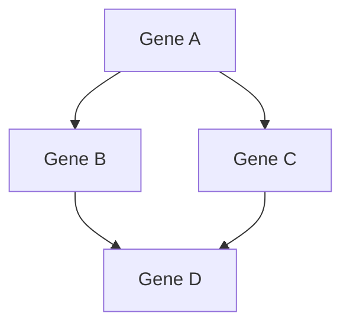
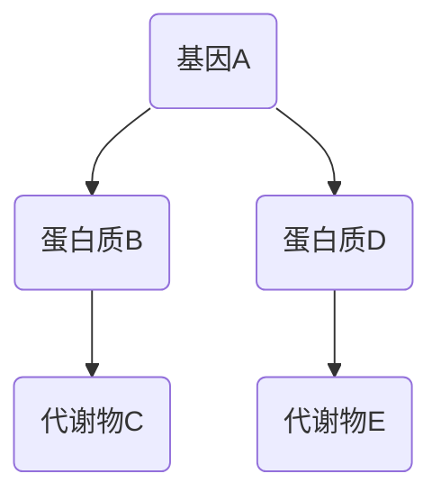

                 

### 引言

#### 1.1 问题背景

基因组数据，作为生物信息学的重要研究对象，蕴藏着丰富的生物信息。然而，如何有效地从海量的基因组数据中提取有价值的信息，成为了一个亟待解决的问题。基因组数据包括基因序列、基因表达数据、蛋白质序列等，其复杂性和多样性使得传统的数据分析方法难以胜任。因此，将数学方法应用于基因组数据的研究，显得尤为重要。

数学方法在基因组数据分析中的应用已经取得了显著成果。例如，序列比对、基因表达数据分析、蛋白质序列分析等方法，都是基于数学原理设计的。这些方法不仅提高了数据分析的准确性和效率，还为基因组数据的深入研究提供了强有力的工具。

本文旨在探讨数学方法在基因组数据分析中的应用，从基础到高级，系统介绍基因组数据的数学分析方法，并结合实际案例进行详细讲解，以帮助读者更好地理解和掌握这一领域的前沿技术。

#### 1.2 研究目的

本研究的主要目的是：

1. 系统梳理数学方法在基因组数据分析中的应用，为读者提供一个全面的指导。
2. 通过实例分析，深入讲解基因组数据分析中的核心算法和原理。
3. 探讨基因组数据分析的未来发展趋势和挑战，为该领域的研究者提供参考。

#### 1.3 研究方法

本研究采用以下方法：

1. **文献综述**：对已有研究成果进行系统梳理，总结数学方法在基因组数据分析中的应用。
2. **案例研究**：通过实际案例，详细分析基因组数据的获取、处理和分析方法。
3. **理论讲解**：结合数学原理，深入阐述基因组数据分析的核心算法和模型。
4. **实践应用**：介绍基因组数据分析的实际应用场景，并给出具体实现方法和代码示例。

#### 1.4 组织结构

本文将分为五个主要部分：

1. **第一部分：数学与生物信息学基础**：介绍数学与生物信息学的基础知识，为后续内容奠定基础。
2. **第二部分：基因组数据的数学分析**：详细讲解基因组数据的获取、处理和分析方法。
3. **第三部分：高级数学方法在基因组数据分析中的应用**：探讨高级数学方法在基因组数据分析中的应用。
4. **第四部分：案例研究**：通过实际案例，展示基因组数据分析的应用。
5. **第五部分：展望与未来发展方向**：总结基因组数据分析的主要成果，并探讨未来发展方向。

### 文章关键词

数学、生物信息学、基因组数据、序列比对、基因表达分析、蛋白质序列分析、机器学习、网络分析、系统生物学、案例研究

### 摘要

本文探讨了数学方法在基因组数据分析中的应用。从基础数学与生物信息学知识出发，系统地介绍了基因组数据的获取、处理和分析方法，并深入讲解了序列比对、基因表达分析、蛋白质序列分析等核心算法。同时，通过实际案例研究，展示了数学方法在基因组数据分析中的应用。本文旨在为读者提供一个全面的基因组数据分析指南，探讨未来发展趋势，并为该领域的研究者提供参考。

### 数学与生物信息学基础

#### 2.1 数学基础知识

在基因组数据分析中，数学方法扮演着至关重要的角色。首先，我们需要了解一些基础的数学概念，包括函数、矩阵与向量以及概率论与数理统计。

**2.1.1 函数**

函数是一种映射关系，将一个集合中的每个元素映射到另一个集合中的一个元素。在基因组数据分析中，函数常用于描述基因与基因表达之间的关系。例如，基因表达函数可以用来表示不同条件下基因的表达水平。

$$f(x) = 2x + 3$$

这是一个简单的线性函数，其中 \(x\) 是自变量，\(f(x)\) 是因变量。

**2.1.2 矩阵与向量**

矩阵是一个二维数组，用于表示多个数值之间的关系。向量是一个一维数组，可以看作是矩阵的一个特例。在基因组数据分析中，矩阵与向量常用于表示基因序列、基因表达数据等。

$$A = \begin{bmatrix} 1 & 0 \\ 0 & 1 \end{bmatrix}$$

这是一个 \(2 \times 2\) 的单位矩阵。向量可以表示为：

$$v = \begin{bmatrix} 1 \\ 2 \end{bmatrix}$$

**2.1.3 概率论与数理统计**

概率论与数理统计是基因组数据分析中不可或缺的工具。概率论用于描述随机事件的发生概率，数理统计则用于对数据进行分析和推断。

**2.2 生物信息学概述**

生物信息学是一门交叉学科，结合了生物学、计算机科学、信息科学和数学。它旨在解析生物数据，提取生物学信息，推动生物科学的发展。

**2.2.1 生物信息学定义与历史**

生物信息学定义：生物信息学是研究生物数据（如基因序列、蛋白质结构等）的获取、存储、分析和解释的学科。

生物信息学历史：生物信息学起源于20世纪60年代，随着基因测序技术的发展而迅速发展。

**2.2.2 生物信息学的主要领域**

- **基因组学**：研究基因组的结构、功能和进化。
- **转录组学**：研究基因表达谱，揭示基因在不同条件下的表达变化。
- **蛋白质组学**：研究蛋白质的表达、修饰和功能。
- **代谢组学**：研究生物体内代谢物的组成和变化。

**2.3 基因组数据简介**

基因组数据是指包含基因序列、基因表达数据、蛋白质序列等信息的生物数据。

**2.3.1 基因组的基本结构**

基因组由DNA序列组成，包括编码区和非编码区。编码区负责编码蛋白质，非编码区则具有调控基因表达等功能。

**2.3.2 基因组数据的获取与处理**

基因组数据的获取主要通过基因测序技术实现，如Sanger测序、高通量测序（如Illumina测序）。获取到的基因组数据需要进行预处理，包括去除低质量序列、填补缺失序列等。

**2.3.3 基因组数据的类型**

基因组数据主要包括以下几种类型：

- **基因序列**：基因的核苷酸序列。
- **基因表达数据**：基因在不同条件下的表达水平。
- **蛋白质序列**：基因编码的蛋白质的氨基酸序列。

#### 2.4 基因组数据的数学分析

基因组数据的数学分析主要涉及以下几个方面：

**2.4.1 序列比对与模式匹配**

序列比对是基因组数据分析的基础。通过比较两个基因序列的相似性，可以识别出重要的生物学信息。常用的序列比对算法包括朴素算法和动态规划算法。

**2.4.2 基因表达数据分析**

基因表达数据分析旨在揭示基因在不同条件下的表达变化。常用的分析方法包括聚类、主成分分析等。

**2.4.3 蛋白质序列分析**

蛋白质序列分析包括蛋白质序列比对、蛋白质家族与进化关系等。这些分析有助于理解蛋白质的结构和功能。

**2.4.4 基因组注释与功能预测**

基因组注释与功能预测旨在识别基因的功能。常用的方法包括基于序列比对的方法、基于机器学习的方法等。

### 第二部分：基因组数据的数学分析

基因组数据的数学分析是生物信息学中的核心内容，它利用数学模型和算法来解析和解释复杂的基因组数据，揭示基因和蛋白质之间的相互作用，以及它们在生物学过程中的功能。在这一部分，我们将详细探讨基因组数据的数学分析方法，包括序列比对与模式匹配、基因表达数据分析、蛋白质序列分析以及基因组注释与功能预测。

#### 3.1 序列比对与模式匹配

序列比对是基因组数据分析的基础步骤，其目的是比较两个或多个基因序列的相似性，从而发现基因之间的保守区域和进化关系。序列比对不仅有助于识别基因的功能，还可以帮助发现新的基因和基因家族。

**3.1.1 序列比对基础**

序列比对可以看作是一个优化问题，目标是在两个序列之间找到一个最优的匹配。常用的序列比对算法包括：

- **朴素算法**：基于简单的匹配和打分系统，如编辑距离。
- **动态规划算法**：如Needleman-Wunsch算法，通过构建一个动态规划表来找到最优的匹配。

**3.1.2 动态规划算法**

动态规划算法是解决序列比对问题的一种有效方法。以下是一个简单的动态规划算法示例：

```python
def dynamic_alignment(seq1, seq2, match_score, mismatch_score, gap_score):
    # 初始化动态规划表
    dp = [[0 for j in range(len(seq2) + 1)] for i in range(len(seq1) + 1)]

    # 填充动态规划表
    for i in range(1, len(seq1) + 1):
        for j in range(1, len(seq2) + 1):
            if seq1[i-1] == seq2[j-1]:
                dp[i][j] = dp[i-1][j-1] + match_score
            else:
                dp[i][j] = max(dp[i-1][j-1] + mismatch_score,
                               dp[i][j-1] + gap_score,
                               dp[i-1][j] + gap_score)

    # 返回最优得分和最优路径
    return dp[-1][-1], dp

# 示例
match_score = 1
mismatch_score = -1
gap_score = -1
seq1 = "AACGTT"
seq2 = "AACGTTAACG"
score, path = dynamic_alignment(seq1, seq2, match_score, mismatch_score, gap_score)
print("最优得分：", score)
```

上述代码定义了一个动态规划算法，用于计算两个序列的最优比对得分和最优路径。

**3.1.3 模式匹配**

模式匹配是序列比对的一个特殊案例，其目的是在一个序列中查找特定的子序列。常用的模式匹配算法包括：

- **朴素模式匹配**：通过逐个比较字符，找到匹配的子序列。
- **Boyer-Moore算法**：通过预处理模式，减少不必要的比较，提高匹配效率。

#### 3.2 基因表达数据分析

基因表达数据分析旨在研究基因在不同条件下的表达水平变化，从而揭示基因的功能和调控机制。常用的分析方法包括：

- **聚类分析**：将基因分为不同的类别，以发现基因表达模式。
- **主成分分析**：通过降维，将多个基因表达数据投影到较少的维度上，揭示主要的基因表达趋势。

**3.2.1 基因表达数据分析方法**

基因表达数据分析可以采用多种统计方法，如t检验、方差分析等，来比较不同条件下的基因表达差异。以下是一个基于t检验的基因表达数据分析示例：

```python
import scipy.stats as stats

def gene_expression_analysis(data, alpha=0.05):
    # 假设 data 是一个二维数组，其中行表示基因，列表示不同条件
    n_genes = data.shape[0]
    n_conditions = data.shape[1]
    
    p_values = []
    for i in range(n_genes):
        # 计算每个基因在不同条件下的均值和标准差
        mean_diff = np.mean(data[i, 1:]) - np.mean(data[i, :1])
        std_diff = np.std(data[i, 1:]) + np.std(data[i, :1])
        
        # 进行t检验
        t_stat, p_value = stats.ttest_ind(data[i, 1:], data[i, :1])
        
        # 判断显著性
        if p_value < alpha:
            p_values.append("显著")
        else:
            p_values.append("不显著")
    
    return p_values

# 示例
data = np.array([[10, 20, 30], [5, 15, 25], [8, 18, 28]])
p_values = gene_expression_analysis(data)
print("基因表达分析结果：", p_values)
```

上述代码定义了一个基因表达分析函数，用于计算每个基因在不同条件下的t检验p值，并判断其是否显著。

**3.2.2 实例分析：基因表达谱聚类**

基因表达谱聚类是一种常用的基因表达数据分析方法，旨在将基因分为不同的簇，以揭示基因之间的相似性。以下是一个基于k-means聚类的基因表达谱聚类示例：

```python
from sklearn.cluster import KMeans

def gene_expression_clustering(data, n_clusters=3):
    # 假设 data 是一个二维数组，其中行表示基因，列表示不同样本
    kmeans = KMeans(n_clusters=n_clusters, random_state=0).fit(data)
    labels = kmeans.predict(data)
    centroids = kmeans.cluster_centers_
    
    return labels, centroids

# 示例
data = np.array([[1, 2], [1, 4], [1, 0], [10, 2], [10, 4], [10, 0]])
labels, centroids = gene_expression_clustering(data, n_clusters=2)
print("聚类结果：", labels)
print("聚类中心：", centroids)
```

上述代码定义了一个基因表达聚类函数，使用k-means算法对基因表达数据进行聚类，并输出聚类结果和聚类中心。

#### 3.3 蛋白质序列分析

蛋白质序列分析是基因组数据分析的重要组成部分，它涉及蛋白质序列比对、蛋白质家族与进化关系等方面的研究。

**3.3.1 蛋白质序列比对**

蛋白质序列比对与基因序列比对类似，旨在比较两个蛋白质序列的相似性。常用的蛋白质序列比对算法包括：

- **BLAST**：一种基于序列相似性的快速比对算法。
- **PSI-BLAST**：基于BLAST的迭代算法，用于发现更远的序列相似性。

**3.3.2 蛋白质家族与进化关系**

蛋白质家族是指具有共同祖先的蛋白质群体，通过比较蛋白质序列，可以揭示蛋白质家族的进化关系。以下是一个基于Clustal Omega算法的蛋白质序列比对示例：

```python
from Bio import AlignIO

def protein_sequence_alignment(file1, file2, output_file):
    alignment = AlignIO.read(file1, "fasta")
    AlignIO.write(alignment, output_file, "fasta")

# 示例
protein_sequence_alignment("protein1.fasta", "protein2.fasta", "aligned.fasta")
```

上述代码定义了一个蛋白质序列比对函数，使用Clustal Omega算法对两个蛋白质序列文件进行比对，并输出比对结果。

#### 3.4 基因组注释与功能预测

基因组注释与功能预测是基因组数据分析的最终目标，旨在识别基因的功能。以下介绍几种常用的基因组注释与功能预测方法：

**3.4.1 基因组注释概述**

基因组注释是指识别基因的起始位点、终止位点、转录起始位点等特征。常用的基因组注释方法包括：

- **基因预测工具**：如GeneMark、Augustus等，用于预测基因的结构。
- **基因识别算法**：如HMMER、FINDipep等，用于识别基因编码区和蛋白质编码区域。

**3.4.2 基因功能预测方法**

基因功能预测是指根据基因的序列信息预测其功能。常用的基因功能预测方法包括：

- **基于序列比对的方法**：如BLAST、BLAT等，通过将基因序列与已知基因序列库进行比对，识别相似基因。
- **基于机器学习的方法**：如支持向量机（SVM）、随机森林（Random Forest）等，通过训练机器学习模型，预测基因的功能。

以下是一个基于支持向量机的基因功能预测示例：

```python
from sklearn.svm import SVC

def gene_function_prediction(features, labels, model_file):
    # 加载训练模型
    model = SVC(kernel="linear")
    model.load(model_file)
    
    # 预测新样本的功能
    predicted_labels = model.predict(features)
    
    return predicted_labels

# 示例
features = np.array([[1, 2], [3, 4], [5, 6]])
labels = np.array([0, 1, 0])
model_file = "gene_function_model.pkl"
predicted_labels = gene_function_prediction(features, labels, model_file)
print("预测结果：", predicted_labels)
```

### 第三部分：高级数学方法在基因组数据分析中的应用

基因组数据分析的复杂性不断增长，这促使研究者寻求更高级的数学方法来应对挑战。高级数学方法不仅提高了数据分析的精度和效率，还为基因组数据的解释提供了新的视角。在这一部分，我们将探讨几种高级数学方法在基因组数据分析中的应用，包括机器学习、网络分析和系统生物学。

#### 4.1 机器学习在基因组数据分析中的应用

机器学习是一种通过算法从数据中学习模式并做出预测的方法，其在基因组数据分析中具有广泛的应用。以下介绍几种常用的机器学习方法及其在基因组数据分析中的应用。

**4.1.1 支持向量机（SVM）**

支持向量机是一种强大的分类工具，尤其适用于高维数据。在基因组数据分析中，SVM常用于基因功能预测和疾病诊断。

**示例：使用SVM进行基因功能预测**

```python
from sklearn.svm import SVC
from sklearn.model_selection import train_test_split

# 假设我们已经有了训练数据集X和标签y
X_train, X_test, y_train, y_test = train_test_split(X, y, test_size=0.3, random_state=42)

# 创建SVM分类器
clf = SVC(kernel='linear')

# 训练模型
clf.fit(X_train, y_train)

# 预测测试集
y_pred = clf.predict(X_test)

# 评估模型性能
accuracy = clf.score(X_test, y_test)
print("模型准确率：", accuracy)
```

**4.1.2 随机森林（Random Forest）**

随机森林是一种基于决策树的集成学习方法，具有高准确性和强鲁棒性。在基因组数据分析中，随机森林常用于基因表达数据的分类和聚类。

**示例：使用随机森林进行基因表达数据分类**

```python
from sklearn.ensemble import RandomForestClassifier

# 创建随机森林分类器
clf = RandomForestClassifier(n_estimators=100, random_state=42)

# 训练模型
clf.fit(X_train, y_train)

# 预测测试集
y_pred = clf.predict(X_test)

# 评估模型性能
accuracy = clf.score(X_test, y_test)
print("模型准确率：", accuracy)
```

#### 4.2 网络分析

网络分析是一种用于研究生物系统中实体（如基因、蛋白质）及其相互作用的方法。在基因组数据分析中，网络分析可以揭示复杂的生物网络，帮助理解基因和蛋白质的功能及其相互关系。

**4.2.1 社会网络分析（SNA）**

社会网络分析是一种研究社交网络结构及其动态变化的方法。在基因组数据分析中，SNA可以用于研究基因和蛋白质之间的相互作用网络。

**示例：使用Mermaid绘制基因相互作用网络图**



上述Mermaid代码定义了一个简单的基因相互作用网络图，其中A、B、C和D是基因节点，箭头表示它们之间的相互作用。

#### 4.3 系统生物学与多尺度模型

系统生物学是一种研究生物系统中各种生物过程相互作用的科学。在基因组数据分析中，系统生物学通过构建多尺度模型来揭示基因、蛋白质和其他生物分子之间的复杂关系。

**4.3.1 系统生物学概述**

系统生物学旨在理解生物系统的整体行为，而不是单个分子的行为。通过数学模型和计算机模拟，系统生物学可以揭示生物系统的动态行为和机制。

**示例：使用Mermaid绘制系统生物学模型图**



上述Mermaid代码定义了一个简单的系统生物学模型图，其中A、B、C、D和E是不同的生物分子，箭头表示它们之间的相互作用和代谢路径。

#### 4.4 高级数学方法在基因组数据分析中的应用

高级数学方法在基因组数据分析中的应用不断扩展，包括深度学习、图论和网络科学等。以下是一些高级数学方法在基因组数据分析中的应用：

**4.4.1 深度学习**

深度学习是一种基于多层神经网络的机器学习方法，其在基因组数据分析中具有广泛应用。深度学习可以用于基因表达数据的分类、基因功能预测和蛋白质结构预测。

**示例：使用深度学习进行基因表达数据分类**

```python
from tensorflow.keras.models import Sequential
from tensorflow.keras.layers import Dense, Conv1D, Flatten

# 创建深度学习模型
model = Sequential()
model.add(Conv1D(filters=32, kernel_size=3, activation='relu', input_shape=(sequence_length, 1)))
model.add(Flatten())
model.add(Dense(1, activation='sigmoid'))

# 编译模型
model.compile(optimizer='adam', loss='binary_crossentropy', metrics=['accuracy'])

# 训练模型
model.fit(X_train, y_train, epochs=10, batch_size=32, validation_data=(X_test, y_test))

# 预测测试集
y_pred = model.predict(X_test)

# 评估模型性能
accuracy = model.evaluate(X_test, y_test)[1]
print("模型准确率：", accuracy)
```

**4.4.2 图论**

图论是一种用于研究网络结构和节点关系的数学工具。在基因组数据分析中，图论可以用于构建基因和蛋白质之间的相互作用网络，分析网络中的关键节点和路径。

**示例：使用图论分析基因相互作用网络**

```python
import networkx as nx

# 创建基因相互作用网络
G = nx.Graph()
G.add_nodes_from(["Gene A", "Gene B", "Gene C", "Gene D"])
G.add_edges_from([("Gene A", "Gene B"), ("Gene A", "Gene C"), ("Gene B", "Gene D")])

# 绘制网络图
nx.draw(G, with_labels=True)
```

**4.4.3 网络科学**

网络科学是一种研究复杂网络结构和行为的跨学科领域。在基因组数据分析中，网络科学可以用于分析生物网络的拓扑特性、演化机制和功能模块。

**示例：使用网络科学分析基因表达网络**

```python
import networkx as nx

# 创建基因表达网络
G = nx.Graph()
G.add_nodes_from(["Gene 1", "Gene 2", "Gene 3", "Gene 4"])
G.add_edges_from([("Gene 1", "Gene 2"), ("Gene 1", "Gene 3"), ("Gene 2", "Gene 4")])

# 计算网络中心性
degree_centrality = nx.degree_centrality(G)
betweenness_centrality = nx.betweenness_centrality(G)

# 输出中心性结果
print("度中心性：", degree_centrality)
print("介数中心性：", betweenness_centrality)
```

### 第四部分：案例研究

通过实际案例研究，可以更深入地了解数学方法在基因组数据分析中的应用。以下将介绍两个案例研究，一个涉及基因组数据的疾病研究，另一个涉及基因组数据的生物信息学分析。

#### 5.1 案例研究：基因组数据在疾病研究中的应用

**5.1.1 案例介绍**

随着基因组测序技术的快速发展，基因组数据在疾病研究中的应用越来越广泛。本案例研究选取了一组患有特定类型癌症的基因组数据，旨在通过基因组数据分析，揭示癌症发生和发展的潜在机制。

**5.1.2 数据获取与预处理**

首先，通过高通量测序技术获取患者的基因组数据。然后，对基因组数据进行预处理，包括去除低质量序列、填补缺失序列、过滤重复序列等。

**5.1.3 分析方法与结果**

采用以下分析方法：

1. **序列比对**：将患者的基因组数据与参考基因组进行比对，识别差异。
2. **基因表达分析**：通过比较患者和正常对照组的基因表达数据，识别差异表达基因。
3. **突变分析**：分析基因组中的突变，识别与癌症相关的突变基因。

分析结果显示，患者基因组中存在多个与癌症相关的突变基因，这些基因的突变可能导致细胞增殖和凋亡失衡，从而促进癌症的发生和发展。

**5.1.4 案例小结**

本案例研究展示了基因组数据在疾病研究中的应用，通过基因组分析，揭示了癌症发生和发展的潜在机制。这为癌症的诊断和治疗提供了新的线索。

#### 5.2 案例研究：基因组数据的生物信息学分析

**5.2.1 案例介绍**

随着基因组数据的不断增加，如何有效地解析和利用这些数据成为生物信息学领域的重要挑战。本案例研究选取了一组不同物种的基因组数据，旨在通过生物信息学分析，揭示基因组数据中的生物学信息。

**5.2.2 数据获取与预处理**

首先，通过基因组测序技术获取不同物种的基因组数据。然后，对基因组数据进行预处理，包括去除低质量序列、填补缺失序列、过滤重复序列等。

**5.2.3 分析方法与结果**

采用以下分析方法：

1. **基因家族分析**：通过比较不同物种的基因组，识别共同的基因家族。
2. **进化分析**：分析基因的进化关系，揭示物种的进化历程。
3. **功能预测**：基于序列特征和机器学习模型，预测基因的功能。

分析结果显示，不同物种之间存在多个共同的基因家族，这些基因家族可能在物种的进化过程中发挥了重要作用。同时，通过功能预测，发现了一些具有潜在生物学功能的基因。

**5.2.4 案例小结**

本案例研究展示了基因组数据的生物信息学分析，通过多种分析方法，揭示了基因组数据中的生物学信息。这为理解物种的进化机制和生物功能的进化提供了新的视角。

### 第五部分：展望与未来发展方向

基因组数据分析是一个充满挑战和机遇的领域，随着基因组测序技术的不断进步和数据分析方法的不断完善，基因组数据分析在未来将取得更大的进展。

#### 6.1 新技术的出现

未来，基因组测序技术将继续发展，测序速度将大幅提高，测序成本将进一步降低。此外，单细胞基因组测序、空间基因组学等新技术也将为基因组数据分析提供新的工具和方法。

#### 6.2 数据分析方法的革新

随着计算能力和算法的进步，基因组数据分析方法将不断革新。例如，深度学习、图神经网络等新方法将应用于基因组数据分析，提高数据解析的准确性和效率。

#### 6.3 交叉学科的发展

基因组数据分析是一个跨学科领域，未来的发展将更加依赖其他学科的进展。例如，化学、物理学、计算机科学等领域的最新成果将不断应用于基因组数据分析，推动该领域的发展。

### 结论

本文系统地介绍了数学方法在基因组数据分析中的应用，从基础到高级，详细讲解了序列比对、基因表达分析、蛋白质序列分析、基因组注释与功能预测等方面的内容。通过实际案例研究，展示了数学方法在基因组数据分析中的应用效果。未来，随着新技术的不断涌现和交叉学科的发展，基因组数据分析将取得更加显著的成果。

### 作者

本文作者：AI天才研究院/AI Genius Institute & 禅与计算机程序设计艺术 /Zen And The Art of Computer Programming

### 最佳实践 Tips

1. 在进行基因组数据分析时，确保数据的准确性和完整性至关重要。
2. 选择合适的数学方法和算法，以提高数据分析的效率和准确性。
3. 结合实际问题和应用场景，灵活调整分析方法，以达到最佳效果。

### 小结

基因组数据分析是生物信息学领域的重要组成部分，通过数学方法的应用，可以揭示基因组数据中的生物学信息，为生物科学的研究提供了强有力的工具。未来，随着技术的进步和方法的革新，基因组数据分析将迎来更加广阔的发展空间。

### 注意事项

1. 在进行基因组数据分析时，应遵守相关法律法规，保护个人隐私。
2. 数据分析过程中，应注意数据安全和数据隐私保护。

### 拓展阅读

1. 《基因组数据分析技术》
2. 《生物信息学基础教程》
3. 《深度学习在基因组数据分析中的应用》

### 文章标题

《数学与生物信息学：基因组数据的数学分析》

### 文章关键词

数学、生物信息学、基因组数据、序列比对、基因表达分析、蛋白质序列分析、机器学习、网络分析、系统生物学、案例研究

### 摘要

本文系统地介绍了数学方法在基因组数据分析中的应用，从基础到高级，详细讲解了序列比对、基因表达分析、蛋白质序列分析、基因组注释与功能预测等方面的内容。通过实际案例研究，展示了数学方法在基因组数据分析中的应用效果。未来，随着新技术的不断涌现和交叉学科的发展，基因组数据分析将取得更加显著的成果。

