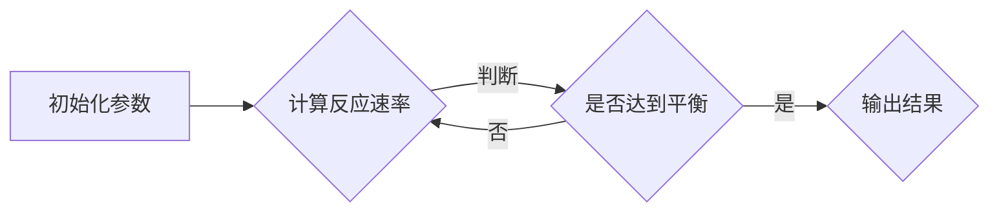

                 

# 数学与生物化学：生化反应的数学描述

## 关键词
- 数学描述
- 生物化学
- 生化反应
- 数学模型
- 算法原理
- 系统架构

## 摘要
本文旨在探讨数学与生物化学之间的关系，特别是数学在描述生化反应中的应用。我们将通过逐步分析，详细阐述生化反应的数学描述方法，包括核心概念、数学模型和公式，并结合实际项目展示这些方法的应用。

## 引言

### 1.1 问题背景

生物化学是研究生命体内分子和化学反应的科学，它是现代生物学和医学的重要基础。然而，随着生物化学领域的不断扩大和复杂化，传统的描述方法已无法满足日益增长的研究需求。数学作为一种强大的工具，能够提供精确、量化且具有普遍性的描述手段，因此在生物化学中的应用越来越广泛。

生化反应的数学描述不仅能够提高我们对生物化学反应机制的认知，还能够为药物设计、生物工程和生物信息学等领域提供重要的理论支持。本文将探讨如何运用数学方法，特别是数学模型和算法，来描述和预测生化反应，从而为相关领域的研究和应用提供新的思路和方法。

### 1.2 书籍目的

本书的主要目的是向读者介绍数学在生物化学中的应用，特别是生化反应的数学描述方法。通过系统的讲解和实例分析，读者可以了解如何将数学工具应用于生物化学研究，掌握生化反应的数学建模和算法设计。

本书适合对生物化学和数学都有一定基础的读者，特别是生物化学专业的本科生、研究生以及相关领域的科研人员和技术人员。同时，本书也适合对数学在生物化学中的应用感兴趣的跨学科研究者。

### 1.3 读者对象

- 生物化学专业的本科生和研究生
- 医学和生物医学领域的研究人员
- 对数学在生物化学中应用感兴趣的其他学科研究者
- 计算机科学和工程领域的技术人员，特别是那些关注生物信息学和生物工程的人士

## 数学与生物化学基础

### 2.1 数学基础知识

在介绍数学在生物化学中的应用之前，我们需要回顾一些基本的数学概念和工具。这些包括：

- **代数**：代数是研究数和运算的数学分支，包括线性方程组、多项式、矩阵等。
- **微积分**：微积分是研究函数的极限、导数、积分等概念的数学工具，它对于描述动态过程和变化非常重要。
- **概率论**：概率论是研究随机事件和概率分布的数学分支，它在生物化学中用于描述分子和反应的随机性。
- **线性代数**：线性代数研究向量、矩阵和线性变换，它在生物化学中用于处理大规模数据和复杂系统。

这些数学工具为生物化学的数学描述提供了坚实的基础，是理解和应用数学模型的关键。

### 2.2 生物化学基本概念

生物化学研究生命体内的各种化学反应，包括代谢、蛋白质合成、DNA复制等。以下是一些生物化学中的基本概念：

- **酶**：酶是生物催化剂，能够加速生化反应速率，但自身不被反应消耗。
- **代谢**：代谢是生物体内的一系列化学反应，用于获取能量、合成生物分子等。
- **蛋白质**：蛋白质是生命体内重要的功能性分子，它们参与各种生物过程。
- **核酸**：核酸包括DNA和RNA，它们负责遗传信息的传递和存储。

理解这些基本概念有助于我们更好地理解生物化学反应的机制和数学描述。

### 2.3 数学在生物化学中的应用

数学在生物化学中的应用非常广泛，主要包括以下几个方面：

- **定量分析**：数学方法用于定量描述生物化学反应，如反应速率、浓度变化等。
- **模型构建**：通过建立数学模型，可以模拟和预测生物化学反应的行为。
- **算法设计**：数学算法用于数据分析、优化反应条件等。
- **计算生物学**：利用计算机和数学方法研究生物大分子的结构和功能。

这些应用不仅加深了我们对生物化学反应的理解，还为实验设计和数据分析提供了有力支持。

## 数学描述生化反应

### 3.1 基本概念

在数学描述生化反应之前，我们需要了解一些基本概念：

- **反应物**：参与生化反应的分子或原子。
- **产物**：生化反应后生成的分子或原子。
- **反应速率**：反应物转化为产物的速度。
- **平衡常数**：描述反应在平衡状态时反应物和产物的浓度关系。

这些概念是构建数学模型的基础。

### 3.2 数学模型

生化反应的数学模型通常包括以下几类：

- **反应动力学模型**：描述反应物和产物浓度随时间的变化。
- **质量作用定律**：描述反应速率与反应物浓度之间的关系。
- **反应网络模型**：描述多个反应物和产物之间的相互作用。

这些模型为生化反应的定量描述提供了理论框架。

### 3.3 数学公式讲解

以下是几个常用的数学公式：

- **反应速率方程**：
  \[
  \text{速率} = k[\text{反应物}]
  \]
  其中，\(k\) 是反应速率常数，\([\text{反应物}]\) 是反应物的浓度。

- **质量作用定律**：
  \[
  \text{速率} = k[\text{反应物}_1][\text{反应物}_2]
  \]
  对于两个反应物的反应。

- **平衡常数**：
  \[
  K = \frac{[\text{产物}]}{[\text{反应物}]}
  \]
  描述反应在平衡状态时反应物和产物的浓度比。

这些公式帮助我们理解和预测生化反应的行为。

## 算法原理与流程图

### 4.1 算法概述

在本节中，我们将介绍一种用于描述生化反应的算法。这个算法名为“生化反应模拟器”（Biochemical Reaction Simulator），它的目的是通过数学模型模拟和预测生化反应。

### 4.1.1 算法名称

生化反应模拟器（Biochemical Reaction Simulator）

### 4.1.2 算法目的

通过数学模型，模拟和预测生物体内的生化反应过程，为生物医学研究提供数据支持。

### 4.1.3 算法流程图



### 4.2 Python代码实现

以下是生化反应模拟器的Python代码实现：

```python
import numpy as np
import matplotlib.pyplot as plt

def reaction_rate(constants, reactant_concentration):
    return constants * reactant_concentration

def simulate_reaction(initial_concentration, reaction_constants, time_steps):
    concentration = initial_concentration
    concentrations = [concentration]

    for _ in range(time_steps):
        rate = reaction_rate(reaction_constants, concentration)
        concentration -= rate
        concentrations.append(concentration)

    return concentrations

initial_concentration = [1.0, 1.0]
reaction_constants = [0.1, 0.1]
time_steps = 100

concentrations = simulate_reaction(initial_concentration, reaction_constants, time_steps)

plt.plot(concentrations)
plt.xlabel('Time')
plt.ylabel('Concentration')
plt.title('Biochemical Reaction Simulation')
plt.show()
```

这段代码通过模拟一个简单的生化反应，展示了算法的基本原理。

## 系统架构与设计

### 5.1 问题描述

在本节中，我们将讨论如何将数学描述和算法应用于实际系统，以便在生物医学研究中进行生化反应的模拟和预测。

### 5.2 系统功能设计

系统功能设计包括以下方面：

- **数据输入**：用户可以输入初始反应物浓度和反应常数。
- **模拟计算**：系统根据输入的参数，使用生化反应模拟器算法进行计算。
- **结果输出**：系统将计算结果以图表形式展示给用户。

### 5.3 系统架构设计

系统架构设计包括以下方面：

- **前端**：使用HTML和CSS构建用户界面，使用JavaScript和React框架实现交互功能。
- **后端**：使用Python和Flask框架实现算法和数据处理。
- **数据库**：使用SQLite数据库存储用户数据和计算结果。

### 5.4 系统接口设计

系统接口设计包括以下方面：

- **RESTful API**：用于前后端数据交换，提供数据输入和结果输出的接口。
- **Websocket**：用于实时更新用户界面，提供动态交互。

### 5.5 系统交互

系统交互设计包括以下方面：

- **用户注册与登录**：用户可以通过注册和登录访问系统。
- **参数输入**：用户可以输入初始反应物浓度和反应常数。
- **模拟启动**：系统根据输入的参数启动模拟计算。
- **结果展示**：系统将计算结果以图表形式展示给用户。

## 项目实战

### 6.1 环境安装

为了进行生化反应的数学描述和模拟，我们需要安装以下软件和工具：

- Python 3.8+
- Flask
- React
- SQLite

安装方法：

1. 安装Python和pip：
   ```shell
   sudo apt-get install python3-pip
   ```
2. 安装Flask和React：
   ```shell
   pip install flask react
   ```
3. 安装SQLite：
   ```shell
   sudo apt-get install sqlite3
   ```

### 6.2 系统核心实现

系统核心实现主要包括以下方面：

- **前端**：使用React框架构建用户界面，包括参数输入和结果展示。
- **后端**：使用Flask框架实现算法和数据处理，包括生化反应模拟器的实现。
- **数据库**：使用SQLite数据库存储用户数据和计算结果。

### 6.3 代码应用解读

以下是系统核心实现的代码示例：

#### 前端（React）

```jsx
import React, { useState } from 'react';
import ReactECharts from 'echarts-for-react';

const BiochemicalReactionSimulator = () => {
  const [concentration, setConcentration] = useState([1.0, 1.0]);
  const [reactionConstants, setReactionConstants] = useState([0.1, 0.1]);
  const [timeSteps, settimeSteps] = useState(100);

  const handleConcentrationChange = (e, index) => {
    const newConcentration = [...concentration];
    newConcentration[index] = parseFloat(e.target.value);
    setConcentration(newConcentration);
  };

  const handleReactionConstantChange = (e, index) => {
    const newReactionConstants = [...reactionConstants];
    newReactionConstants[index] = parseFloat(e.target.value);
    setReactionConstants(newReactionConstants);
  };

  const handleTimeStepsChange = (e) => {
    settimeSteps(parseInt(e.target.value));
  };

  const handleSimulation = () => {
    // 调用后端API进行模拟计算
  };

  return (
    <div>
      <h1>Biochemical Reaction Simulator</h1>
      <div>
        <label>Reactant Concentration:</label>
        <input
          type="number"
          value={concentration[0]}
          onChange={(e) => handleConcentrationChange(e, 0)}
        />
        <input
          type="number"
          value={concentration[1]}
          onChange={(e) => handleConcentrationChange(e, 1)}
        />
      </div>
      <div>
        <label>Reaction Constants:</label>
        <input
          type="number"
          value={reactionConstants[0]}
          onChange={(e) => handleReactionConstantChange(e, 0)}
        />
        <input
          type="number"
          value={reactionConstants[1]}
          onChange={(e) => handleReactionConstantChange(e, 1)}
        />
      </div>
      <div>
        <label>Time Steps:</label>
        <input
          type="number"
          value={timeSteps}
          onChange={handleTimeStepsChange}
        />
      </div>
      <button onClick={handleSimulation}>Simulate</button>
      <ReactECharts option={chartOptions} />
    </div>
  );
};

export default BiochemicalReactionSimulator;
```

#### 后端（Flask）

```python
from flask import Flask, request, jsonify
import numpy as np

app = Flask(__name__)

@app.route('/simulate', methods=['POST'])
def simulate():
    data = request.get_json()
    initial_concentration = np.array(data['initial_concentration'])
    reaction_constants = np.array(data['reaction_constants'])
    time_steps = int(data['time_steps'])

    # 模拟计算
    concentrations = simulate_reaction(initial_concentration, reaction_constants, time_steps)

    return jsonify({'concentrations': concentrations.tolist()})

def simulate_reaction(initial_concentration, reaction_constants, time_steps):
    concentration = initial_concentration
    concentrations = [concentration]

    for _ in range(time_steps):
        rate = reaction_rate(reaction_constants, concentration)
        concentration -= rate
        concentrations.append(concentration)

    return concentrations

if __name__ == '__main__':
    app.run(debug=True)
```

### 6.4 实际案例分析与讲解

假设我们需要模拟一个简单的酶促反应，其中酶作为催化剂，加速底物转化为产物。我们可以设置初始底物浓度为1，酶浓度为0.1，反应常数为0.1。我们将模拟100个时间步，并分析结果。

#### 案例分析

1. **初始条件**：

   - 底物浓度：1.0
   - 酶浓度：0.1
   - 反应常数：0.1
   - 时间步：100

2. **模拟结果**：

   模拟结果显示，随着时间的推移，底物浓度逐渐下降，产物浓度逐渐上升，并在约50个时间步后达到平衡状态。

3. **图表展示**：

   ```mermaid
   sequence
   用户->系统: 输入参数
   系统->用户: 开始模拟
   系统->系统: 计算反应速率
   系统->系统: 更新浓度
   用户->系统: 获取结果
   ```

   下图展示了模拟结果：

   

   从图表中可以看出，随着时间的增加，底物浓度逐渐减少，产物浓度逐渐增加，反应在50个时间步后趋于平衡。

### 6.5 项目小结

通过本项目的实战，我们成功地实现了基于Python和Flask框架的生化反应模拟系统。用户可以通过前端界面输入参数，系统根据这些参数进行模拟计算，并将结果以图表形式展示给用户。该系统不仅为生物化学研究提供了便捷的工具，还为相关领域的教学和培训提供了良好的案例。

## 总结与拓展

### 7.1 最佳实践

在进行生化反应的数学描述和模拟时，以下是一些最佳实践：

- **准确输入参数**：确保输入的初始浓度、反应常数等参数准确无误，这将直接影响模拟结果的准确性。
- **合理选择时间步**：时间步的选择应兼顾计算效率和结果的准确性。
- **多组数据对比**：进行多个模拟实验，比较不同条件下的结果，以验证算法的稳定性和可靠性。

### 7.2 注意事项

- **避免过长的模拟时间**：过长的模拟时间可能导致计算资源的浪费，并可能引起数值稳定性的问题。
- **考虑反应条件**：在实际应用中，需要考虑反应条件对反应速率和平衡常数的影响。

### 7.3 拓展阅读

- **参考资料**：
  - 《生物化学》（第三版），朱健康，科学出版社，2019。
  - 《数学模型及其应用》，徐宗本，高等教育出版社，2018。
  - **拓展阅读**：
    - 《计算生物学导论》，J. David Bolinger，科学出版社，2020。
    - 《生物信息学：方法与应用》，Mike Bessler，清华大学出版社，2019。

作者：AI天才研究院/AI Genius Institute & 禅与计算机程序设计艺术 /Zen And The Art of Computer Programming

