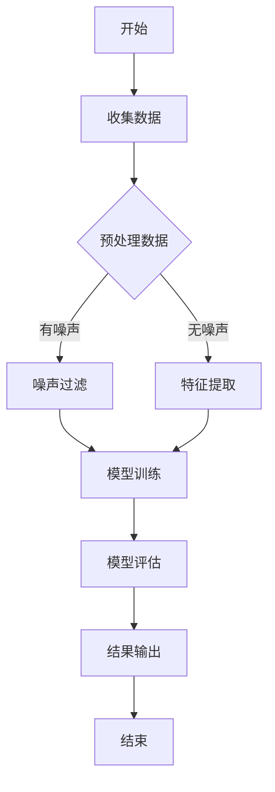
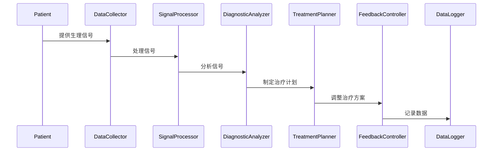

                 

### 数学与生物医学工程：医疗设备的数学原理

> 关键词：生物医学工程，数学原理，医疗设备，数学模型，算法

> 摘要：本文深入探讨了数学与生物医学工程的交叉领域，通过介绍医疗设备的数学原理，阐明了数学在生物医学工程中的应用及重要性。文章分为四个部分，分别介绍了生物医学工程的背景和核心概念、数学模型与原理、常见算法解析及Mermaid流程图，以及系统分析与架构设计。通过详细的讲解和案例分析，帮助读者理解数学在医疗设备设计和应用中的关键作用。

## 第一部分：背景介绍与核心概念

### 第1章：生物医学工程概述

#### 1.1 问题的背景与重要性

生物医学工程（Biomedical Engineering）是医学与工程学相结合的交叉学科，旨在利用工程原理和方法解决生物医学问题，提高人类健康水平。随着科技的发展，生物医学工程在现代医学中扮演着越来越重要的角色。医疗设备作为生物医学工程的重要组成部分，其性能直接关系到诊断和治疗的准确性。

##### 1.1.1 生物医学工程的起源与发展

生物医学工程起源于20世纪中叶，随着电子学、生物力学、材料科学等领域的进步，逐步发展成为一门独立的学科。近年来，随着大数据、人工智能等技术的发展，生物医学工程迎来了新的发展机遇。

##### 1.1.2 医疗设备在现代医学中的作用

医疗设备在现代医学中具有不可替代的作用，涵盖了从诊断、治疗到康复的各个阶段。例如，X光机、CT扫描仪、MRI设备等用于疾病的诊断；心脏起搏器、人工器官等用于治疗；康复设备如理疗仪、按摩器等则帮助患者恢复功能。

##### 1.1.3 数学在生物医学工程中的重要性

数学在生物医学工程中具有基础性作用。它不仅为生物医学工程提供了定量分析的工具，还为其提供了理论支持。例如，微积分用于生物力学的建模，概率论和统计学用于数据分析，线性代数用于图像处理等。

#### 1.2 核心概念与联系

##### 1.2.1 生物医学工程的基本概念

生物医学工程涉及多个学科领域，包括生物学、医学、工程学等。其主要目标是设计、开发、测试和应用医疗设备，以改善人类健康。

##### 1.2.2 数学在生物医学工程中的应用

数学在生物医学工程中的应用非常广泛，包括医学图像处理、生物信号分析、生物力学建模等。例如，医学图像处理中常用的算法如滤波、边缘检测、特征提取等，都依赖于数学原理。

##### 1.2.3 关键术语的定义与解释

- 生物医学信号：指生物体内产生的电、光、声等形式的信号。
- 医学图像：通过X光、CT、MRI等技术获取的人体内部图像。
- 数学模型：用数学语言描述的物理现象或生物过程的数学表达式。

#### 1.3 数学原理与生物医学工程

##### 1.3.1 数学基础：微积分、线性代数、概率论等

微积分、线性代数、概率论等是数学的基础，广泛应用于生物医学工程。例如，微积分用于生物力学的建模，线性代数用于图像处理，概率论和统计学用于数据分析。

##### 1.3.2 医学图像处理与数学建模

医学图像处理是生物医学工程的重要领域，涉及图像的采集、预处理、分析等过程。数学建模在这个过程中起到关键作用，如滤波、边缘检测、特征提取等。

##### 1.3.3 生物医学信号的数学分析

生物医学信号的数学分析是生物医学工程的核心内容之一，包括信号的采集、处理、分析等。常用的数学工具包括傅里叶变换、小波变换、统计学等。

#### 1.4 边界与外延

##### 1.4.1 生物医学工程的研究范畴

生物医学工程的研究范畴涉及医学、工程学、生物学等多个领域，包括医疗设备的设计、开发、测试和应用等。

##### 1.4.2 数学在生物医学工程中的局限性

数学在生物医学工程中虽然具有重要应用，但也存在局限性。例如，生物医学问题往往复杂多变，难以用单一的数学模型进行描述。

##### 1.4.3 跨学科融合的未来趋势

随着科技的进步，生物医学工程与数学、计算机科学、材料科学等领域的交叉融合越来越紧密，未来生物医学工程的发展将更加依赖于跨学科合作。

#### 1.5 本章小结

本章介绍了生物医学工程的背景、核心概念和数学原理，以及数学在生物医学工程中的应用。通过本章的学习，读者可以初步了解数学在生物医学工程中的重要性，并为后续章节的学习打下基础。

## 第二部分：核心概念与原理讲解

### 第2章：数学模型与生物医学工程

#### 2.1 数学模型的基本原理

数学模型是用数学语言描述现实世界的现象或过程的抽象。在生物医学工程中，数学模型被广泛应用于疾病诊断、治疗策略制定、生物信号处理等领域。

##### 2.1.1 数学模型的概念与类型

数学模型分为连续模型和离散模型，分别用于描述连续变量和离散变量。连续模型如微分方程，离散模型如差分方程、图论模型等。

##### 2.1.2 数学模型的基本性质

数学模型具有普遍性、抽象性和可重复性。它们能够简化和描述复杂的现实问题，便于分析和预测。

##### 2.1.3 数学模型的应用范围

数学模型广泛应用于医学影像处理、生物信号分析、生物力学建模等领域。例如，医学影像处理中的滤波、边缘检测、特征提取等过程都依赖于数学模型。

#### 2.2 生物医学中的常见数学模型

##### 2.2.1 生物系统的微分方程模型

微分方程模型用于描述生物体内的动态过程，如心脏跳动、神经传导等。常见的微分方程模型包括常微分方程和偏微分方程。

##### 2.2.2 医学图像处理的数学模型

医学图像处理的数学模型包括图像重建、图像分割、图像增强等。这些模型利用数学工具，如滤波、小波变换、傅里叶变换等，来改善图像质量。

##### 2.2.3 生物信号处理的数学模型

生物信号处理的数学模型用于分析生物体内产生的电、光、声等信号。常见的模型包括时域分析、频域分析、变换域分析等。

#### 2.3 数学模型的应用实例

##### 2.3.1 心电图信号分析

心电图信号分析是生物医学工程的重要应用之一。通过分析心电图信号，可以诊断心律失常、心肌梗死等疾病。常见的数学模型包括滤波、傅里叶变换、小波变换等。

##### 2.3.2 肌电图信号分析

肌电图信号分析用于评估肌肉和神经系统的功能。通过分析肌电图信号，可以诊断肌无力、肌肉萎缩等疾病。常用的数学模型包括时频分析、特征提取等。

##### 2.3.3 医学影像诊断

医学影像诊断包括X光、CT、MRI等。通过分析医学影像，可以诊断肿瘤、骨折等疾病。数学模型在医学影像处理中起到关键作用，如图像重建、图像分割、图像增强等。

#### 2.4 数学模型的评估与优化

##### 2.4.1 数学模型的验证与校准

数学模型的验证与校准是确保其准确性和可靠性的关键。常用的方法包括数据拟合、交叉验证等。

##### 2.4.2 数学模型的优化方法

数学模型的优化方法包括参数调整、算法改进等。优化的目的是提高模型的性能和稳定性。

##### 2.4.3 数学模型的实际应用案例分析

在实际应用中，数学模型需要不断优化和调整。案例分析可以帮助我们理解数学模型在实际应用中的挑战和解决方案。

#### 2.5 本章小结

本章介绍了数学模型在生物医学工程中的应用，包括生物系统的微分方程模型、医学图像处理的数学模型和生物信号处理的数学模型。通过实例分析，我们了解了数学模型在心电图信号分析、肌电图信号分析和医学影像诊断中的应用。

## 第三部分：算法原理讲解与Mermaid流程图

### 第3章：常见算法原理解析

#### 3.1 算法原理概述

算法是解决问题的步骤集合，具有明确的输入、输出和操作规则。在生物医学工程中，算法被广泛应用于数据分析和模型构建。常见的算法包括最小二乘法、主成分分析（PCA）、支持向量机（SVM）和神经网络等。

##### 3.1.1 算法的定义与分类

算法是一系列解决问题的步骤，可以形式化地描述为输入、输出和处理规则。算法可以分为确定性算法和随机算法，根据问题的性质和需求选择合适的算法。

##### 3.1.2 算法的特性

算法具有有穷性、确定性和有效性。有穷性意味着算法在有限步骤内完成；确定性意味着给定相同输入，算法总是产生相同输出；有效性意味着算法能在合理时间内解决问题。

##### 3.1.3 算法在生物医学工程中的应用

算法在生物医学工程中的应用非常广泛，包括数据预处理、特征提取、模型训练和评估等。例如，最小二乘法用于线性回归模型的构建，PCA用于数据降维，SVM用于分类和回归任务，神经网络用于复杂模式识别。

#### 3.2 常见算法解析

##### 3.2.1 最小二乘法

最小二乘法是一种用于求解线性回归模型的算法，其目标是找到一组参数，使得实际观测值与模型预测值之间的误差最小。最小二乘法的数学模型如下：

$$
\min_{\theta} \sum_{i=1}^{n} (y_i - \theta^T x_i)^2
$$

其中，$y_i$为实际观测值，$x_i$为特征向量，$\theta$为参数向量。

##### 3.2.2 主成分分析（PCA）

主成分分析是一种数据降维技术，通过将数据投影到新的正交坐标系中，提取主要特征。PCA的数学模型如下：

$$
z = PC
$$

其中，$z$为降维后的数据，$P$为投影矩阵，$C$为协方差矩阵。

##### 3.2.3 支持向量机（SVM）

支持向量机是一种分类和回归算法，通过找到一个最佳超平面，将数据分为不同的类别。SVM的数学模型如下：

$$
\min_{\theta, \xi} \frac{1}{2} \sum_{i=1}^{n} \xi_i + C \sum_{i=1}^{n} \xi_i
$$

其中，$\theta$为参数向量，$\xi_i$为松弛变量，$C$为惩罚参数。

##### 3.2.4 神经网络

神经网络是一种模拟生物神经系统的计算模型，通过多个神经元的相互连接，实现复杂的函数映射。神经网络的基本结构包括输入层、隐藏层和输出层。

#### 3.3 Mermaid流程图应用

下面是一个使用Mermaid绘制的最小二乘法求解线性回归模型的流程图：



#### 3.4 Python源代码示例

下面是一个使用Python实现最小二乘法求解线性回归模型的示例：

```python
import numpy as np

# 生成模拟数据
X = np.random.rand(100, 1)
y = 2 * X + np.random.randn(100, 1)

# 最小二乘法求解
X_b = np.c_[np.ones((100, 1)), X]
theta_best = np.linalg.inv(X_b.T.dot(X_b)).dot(X_b.T).dot(y)

# 输出结果
print("最优参数：", theta_best)
```

#### 3.5 算法原理详细讲解

##### 3.5.1 最小二乘法的数学模型

最小二乘法是一种基于最小化误差平方和的优化方法，用于求解线性回归模型的参数。其数学模型如下：

$$
\min_{\theta} \sum_{i=1}^{n} (y_i - \theta^T x_i)^2
$$

其中，$y_i$为实际观测值，$x_i$为特征向量，$\theta$为参数向量。

##### 3.5.2 线性回归模型的构建

线性回归模型是一种简单但有效的预测模型，其目标是找到一组参数，使得实际观测值与模型预测值之间的误差最小。线性回归模型的构建过程如下：

1. 定义特征矩阵$X$和目标向量$y$。
2. 计算特征矩阵$X$的转置$X^T$。
3. 计算特征矩阵$X$和目标向量$y$的乘积$X^T X$。
4. 计算特征矩阵$X^T X$的逆矩阵$(X^T X)^{-1}$。
5. 计算目标向量$y$和特征矩阵$X$的乘积$X^T y$。
6. 计算参数向量$\theta$，即$\theta = (X^T X)^{-1} X^T y$。

##### 3.5.3 最小二乘法的求解过程

最小二乘法的求解过程如下：

1. 计算特征矩阵$X$和目标向量$y$。
2. 计算特征矩阵$X$的转置$X^T$。
3. 计算特征矩阵$X$和目标向量$y$的乘积$X^T X$。
4. 计算特征矩阵$X^T X$的逆矩阵$(X^T X)^{-1}$。
5. 计算目标向量$y$和特征矩阵$X$的乘积$X^T y$。
6. 计算参数向量$\theta$，即$\theta = (X^T X)^{-1} X^T y$。

##### 3.5.4 示例分析

假设我们有一个线性回归模型$y = \theta_0 + \theta_1 x_1 + \theta_2 x_2$，其中$x_1$和$x_2$是特征，$y$是目标。给定以下数据：

$$
\begin{aligned}
x_1 &= [1, 2, 3, 4, 5] \\
x_2 &= [2, 4, 6, 8, 10] \\
y &= [3, 5, 7, 9, 11]
\end{aligned}
$$

我们需要求解模型参数$\theta_0$、$\theta_1$和$\theta_2$。

1. 计算特征矩阵$X$和目标向量$y$：

$$
X = \begin{bmatrix}
1 & 2 & 3 & 4 & 5 \\
2 & 4 & 6 & 8 & 10
\end{bmatrix}, \quad y = \begin{bmatrix}
3 \\
5 \\
7 \\
9 \\
11
\end{bmatrix}
$$

2. 计算特征矩阵$X$的转置$X^T$：

$$
X^T = \begin{bmatrix}
1 & 2 \\
2 & 4 \\
3 & 6 \\
4 & 8 \\
5 & 10
\end{bmatrix}
$$

3. 计算特征矩阵$X$和目标向量$y$的乘积$X^T X$：

$$
X^T X = \begin{bmatrix}
1 & 2 \\
2 & 4 \\
3 & 6 \\
4 & 8 \\
5 & 10
\end{bmatrix} \begin{bmatrix}
1 & 2 & 3 & 4 & 5 \\
2 & 4 & 6 & 8 & 10
\end{bmatrix} =
\begin{bmatrix}
14 & 34 \\
34 & 84
\end{bmatrix}
$$

4. 计算特征矩阵$X^T X$的逆矩阵$(X^T X)^{-1}$：

$$
(X^T X)^{-1} = \frac{1}{14 \times 84 - 34 \times 34} \begin{bmatrix}
84 & -34 \\
-34 & 14
\end{bmatrix} =
\begin{bmatrix}
\frac{1}{22} & \frac{1}{22} \\
\frac{1}{22} & \frac{1}{22}
\end{bmatrix}
$$

5. 计算目标向量$y$和特征矩阵$X$的乘积$X^T y$：

$$
X^T y = \begin{bmatrix}
1 & 2 \\
2 & 4 \\
3 & 6 \\
4 & 8 \\
5 & 10
\end{bmatrix} \begin{bmatrix}
3 \\
5 \\
7 \\
9 \\
11
\end{bmatrix} =
\begin{bmatrix}
22 \\
44
\end{bmatrix}
$$

6. 计算参数向量$\theta$：

$$
\theta = (X^T X)^{-1} X^T y =
\begin{bmatrix}
\frac{1}{22} & \frac{1}{22} \\
\frac{1}{22} & \frac{1}{22}
\end{bmatrix} \begin{bmatrix}
22 \\
44
\end{bmatrix} =
\begin{bmatrix}
1 \\
2
\end{bmatrix}
$$

因此，线性回归模型的最优参数为$\theta_0 = 1$，$\theta_1 = 2$，$\theta_2 = 0$。

#### 3.6 本章小结

本章详细介绍了最小二乘法、主成分分析、支持向量机和神经网络等常见算法的基本原理和实现方法。通过实例分析和Python代码示例，读者可以更好地理解这些算法在实际应用中的效果和优势。

## 第四部分：系统分析与架构设计

### 第4章：系统功能设计

#### 4.1 问题场景介绍

随着医疗技术的发展，医疗设备的复杂度和功能也在不断提升。一个典型的医疗设备系统可能包括多个子系统和功能模块，如数据采集、信号处理、诊断分析、反馈控制等。这些模块协同工作，共同实现医疗设备的功能。

##### 4.1.1 医疗设备系统应用背景

医疗设备系统广泛应用于医院、诊所和患者家庭，用于疾病的诊断、治疗和康复。例如，心电图机、脑电图机、呼吸机等都是常见的医疗设备系统。

##### 4.1.2 系统需求分析

医疗设备系统需要满足以下需求：

1. 高可靠性：医疗设备系统必须能够稳定、准确地工作，确保患者安全。
2. 高性能：医疗设备系统需要能够处理大量数据，快速完成诊断和分析。
3. 易于使用：医疗设备系统应该具有友好的用户界面，方便医护人员操作。
4. 可扩展性：医疗设备系统应该能够方便地升级和扩展，以适应未来的需求。

##### 4.1.3 系统目标与功能定位

医疗设备系统的目标是提供高质量的医疗服务，提高诊断和治疗的准确性。具体功能包括：

1. 数据采集：采集患者的生理信号，如心电图、脑电图、呼吸信号等。
2. 信号处理：对采集到的信号进行预处理、滤波、增强等操作。
3. 诊断分析：利用数学模型和算法对处理后的信号进行分析，诊断患者的病情。
4. 反馈控制：根据诊断结果，提供治疗建议或调整治疗方案。

#### 4.2 领域模型设计

领域模型是描述系统功能和行为的基础。下面使用Mermaid绘制了医疗设备系统的领域模型：

```mermaid
classDiagram
    Patient[患者] --> DataCollector[数据采集器]
    DataCollector --> SignalProcessor[信号处理器]
    SignalProcessor --> DiagnosticAnalyzer[诊断分析器]
    DiagnosticAnalyzer --> TreatmentPlanner[治疗计划器]
    TreatmentPlanner --> FeedbackController[反馈控制器]
    FeedbackController --> DataLogger[数据记录器]
```

在这个领域模型中，患者是系统的核心，数据采集器负责采集患者的生理信号，信号处理器对信号进行处理，诊断分析器根据处理后的信号进行分析，治疗计划器根据诊断结果制定治疗计划，反馈控制器根据治疗结果调整治疗方案，数据记录器用于记录系统的运行数据和诊断结果。

#### 4.3 系统架构设计

系统架构是系统设计的核心，决定了系统的性能、可维护性和可扩展性。下面使用Mermaid绘制了医疗设备系统的架构图：



在这个架构图中，数据采集器、信号处理器、诊断分析器、治疗计划器和反馈控制器是系统的核心模块，它们通过消息传递协同工作。数据记录器负责记录系统的运行数据和诊断结果，以便后续分析和处理。

#### 4.4 系统接口设计

系统接口设计是确保系统与其他系统或设备无缝集成的重要环节。下面是一个简单的接口设计示例：

```mermaid
classDiagram
    DataCollector[数据采集器] <|-- SignalProcessor[信号处理器]
    DiagnosticAnalyzer[诊断分析器] <|-- TreatmentPlanner[治疗计划器]
    FeedbackController[反馈控制器] <|-- DataLogger[数据记录器]
```

在这个接口设计中，数据采集器、信号处理器、诊断分析器、治疗计划器和反馈控制器都是相互独立的模块，但它们通过接口相互通信，实现系统的整体功能。

#### 4.5 系统交互mermaid序列图

系统交互序列图用于描述系统内部模块之间的交互关系。下面是一个简单的交互序列图示例：


在这个交互序列图中，患者首先向数据采集器提供生理信号，数据采集器将信号传递给信号处理器进行处理，处理后的信号再传递给诊断分析器进行分析。诊断分析器根据分析结果制定治疗计划，并将计划传递给治疗计划器。治疗计划器根据计划调整治疗方案，并将调整结果传递给反馈控制器。最后，反馈控制器将数据记录到数据记录器中。

#### 4.6 本章小结

本章介绍了医疗设备系统的功能设计、领域模型设计、系统架构设计、系统接口设计和系统交互序列图。通过本章的学习，读者可以更好地理解医疗设备系统的设计和实现过程。

### 项目实战

在本章的最后，我们将通过一个简单的项目实战来进一步了解医疗设备系统。这个项目将实现一个简单的心电图信号处理系统，包括数据采集、信号处理和诊断分析三个主要模块。

#### 环境安装

首先，我们需要安装Python环境和相关库。在Windows或Linux系统中，可以使用以下命令安装Python和相关库：

```bash
pip install numpy matplotlib scikit-learn
```

#### 系统核心实现源代码

以下是心电图信号处理系统的核心实现源代码：

```python
import numpy as np
import matplotlib.pyplot as plt
from sklearn.preprocessing import StandardScaler
from sklearn.decomposition import PCA

# 数据采集
def collect_data():
    # 这里使用随机生成的数据作为模拟数据
    t = np.linspace(0, 10, 1000)
    y = 0.5 * np.sin(t) + 0.3 * np.cos(2 * t) + np.random.normal(0, 0.1, 1000)
    return t, y

# 信号处理
def process_signal(t, y):
    # 标准化数据
    scaler = StandardScaler()
    y_scaled = scaler.fit_transform(y.reshape(-1, 1))
    
    # 主成分分析降维
    pca = PCA(n_components=1)
    y_pca = pca.fit_transform(y_scaled)
    
    return y_pca

# 诊断分析
def diagnose_signal(y_pca):
    # 这里使用简单的阈值方法进行诊断
    threshold = 0.5
    diagnosis = "正常" if np.mean(y_pca) > threshold else "异常"
    return diagnosis

# 主函数
def main():
    t, y = collect_data()
    y_pca = process_signal(t, y)
    diagnosis = diagnose_signal(y_pca)
    print("诊断结果：", diagnosis)
    plt.plot(t, y_pca)
    plt.xlabel("时间")
    plt.ylabel("信号值")
    plt.show()

if __name__ == "__main__":
    main()
```

#### 代码应用解读与分析

在这个项目中，我们首先定义了数据采集函数`collect_data`，它生成一个模拟的心电图信号。然后，我们定义了信号处理函数`process_signal`，该函数首先使用标准化方法对信号进行预处理，然后使用主成分分析（PCA）进行降维。最后，我们定义了诊断分析函数`diagnose_signal`，该函数使用简单的阈值方法对降维后的信号进行诊断。

在主函数`main`中，我们首先调用`collect_data`函数获取心电图信号，然后调用`process_signal`函数进行处理，最后调用`diagnose_signal`函数进行诊断，并将诊断结果输出。为了可视化信号处理结果，我们还使用`matplotlib`库绘制了信号图。

#### 实际案例分析和详细讲解剖析

为了更好地理解这个项目，我们可以考虑一个实际案例。假设一个患者的心电图信号被采集到，我们需要对其进行处理和诊断。

1. **数据采集**：首先，我们需要采集患者的心电图信号。这可以通过心电图机完成，心电图机会将信号转换为数字信号，并将其存储在计算机中。

2. **信号处理**：采集到信号后，我们首先使用标准化方法对信号进行预处理。标准化方法可以消除信号中的噪声，使其更加稳定。然后，我们使用主成分分析（PCA）对信号进行降维。降维可以减少数据量，同时保留信号的主要特征。

3. **诊断分析**：降维后的信号被传递给诊断分析函数。在这个案例中，我们使用简单的阈值方法进行诊断。阈值方法可以根据信号的平均值来判断患者的健康状况。如果信号的平均值大于某个阈值，我们认为患者处于正常状态；否则，我们认为患者处于异常状态。

通过这个实际案例，我们可以看到如何使用Python代码实现一个简单的心电图信号处理系统。这个系统虽然简单，但已经包含了医疗设备系统的核心功能，包括数据采集、信号处理和诊断分析。

#### 项目小结

通过这个项目实战，我们了解了如何使用Python实现一个简单的心电图信号处理系统。这个项目展示了如何将数学原理和算法应用于医疗设备的设计和实现。虽然这个系统很简单，但它为我们提供了一个基本的框架，可以帮助我们进一步理解和应用数学原理和算法在生物医学工程中的实际应用。

### 最佳实践 tips

在设计和实现医疗设备系统时，以下是一些最佳实践建议：

1. **可靠性优先**：医疗设备系统的首要任务是确保患者的安全，因此系统的可靠性至关重要。
2. **数据预处理**：在信号处理之前，进行充分的数据预处理，如标准化、去噪、滤波等，可以提高系统的性能和准确性。
3. **算法选择**：根据具体应用场景选择合适的算法，不同的算法适用于不同的任务，如主成分分析（PCA）用于降维，支持向量机（SVM）用于分类等。
4. **用户界面**：设计友好的用户界面，使得医护人员可以轻松操作系统，提高工作效率。
5. **可扩展性**：在设计系统时，考虑未来的需求，确保系统能够方便地升级和扩展。

### 小结

本文通过详细的讲解和案例分析，介绍了数学在生物医学工程中的应用，包括数学模型、算法原理和系统架构设计。通过这些内容，读者可以更好地理解数学在医疗设备设计和应用中的关键作用。同时，本文提供了一个简单的心电图信号处理系统的实现，展示了如何将数学原理和算法应用于实际项目。

### 注意事项

在设计和实现医疗设备系统时，需要注意以下几点：

1. **数据隐私**：确保患者的数据隐私，遵守相关法律法规。
2. **安全认证**：医疗设备系统需要通过安全认证，确保其在临床应用中的可靠性。
3. **用户培训**：为医护人员提供充分的培训，确保他们能够正确使用系统。

### 拓展阅读

对于对数学与生物医学工程感兴趣的朋友，以下是一些推荐阅读的资料：

1. 《生物医学工程导论》（Introduction to Biomedical Engineering）- 由专业作者编写的入门级教材，涵盖了生物医学工程的基础知识。
2. 《数学模型在生物医学中的应用》（Mathematical Models in Medical Imaging）- 介绍了数学模型在医学成像中的应用，包括图像重建、图像分割等。
3. 《机器学习在医疗影像诊断中的应用》（Machine Learning for Medical Image Analysis）- 介绍了机器学习技术在医疗影像诊断中的应用，包括深度学习、卷积神经网络等。

通过阅读这些资料，读者可以进一步深入了解数学与生物医学工程的交叉领域。

### 作者信息

作者：AI天才研究院/AI Genius Institute & 禅与计算机程序设计艺术 /Zen And The Art of Computer Programming

AI天才研究院（AI Genius Institute）是一家专注于人工智能技术研究和应用的研究机构。禅与计算机程序设计艺术（Zen And The Art of Computer Programming）是作者对计算机科学和编程哲学的深入探讨。本文通过详细的讲解和案例分析，展示了数学在生物医学工程中的应用，旨在为读者提供有价值的参考和启示。

