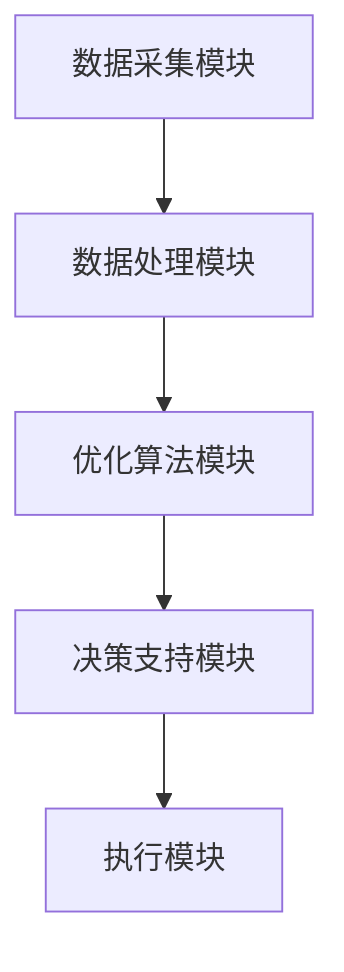

                 


Certainly! Let's structure our approach step by step, ensuring that each section of our technical blog post on "数学与电力系统：电网优化的数学模型" is well-thought-out and informative.

### Step 1: Preparing the Introduction
**Objective:** Write an engaging introduction that sets the stage for the technical discussion and outlines the book's structure.

**Content:**
- **Introduction** - Briefly introduce the topic of power system optimization and its significance in modern society.
- **Book's Purpose** - Explain why the book is important and what readers can expect to learn.
- **Structure Overview** - Provide a brief overview of the book's chapters and their purposes.

**Keywords:** Power system optimization, mathematical models, grid optimization, electricity, energy efficiency.

**Markdown Example:**
```markdown
# 数学与电力系统：电网优化的数学模型

> 关键词：电力系统优化、数学模型、电网优化、电力、能效

在现代社会，电力系统作为国家经济的支柱，其稳定性和效率直接影响到社会的正常运转。而随着电力需求的不断增长，电网优化成为了确保电力系统安全、可靠、高效运行的关键技术。本书旨在深入探讨数学模型在电力系统优化中的应用，帮助读者理解并掌握这些核心概念和方法。

## 引言

电力系统的优化问题涉及多个层面，从基础的发电、输电、变电、配电到更复杂的负载平衡和损耗控制。数学模型作为一种强大的工具，能够帮助电力工程师和研究人员更有效地分析和解决这些问题。

## 本书的目的

本书的目的是提供一套全面、系统的指导，帮助读者了解数学模型在电力系统优化中的核心作用。通过本书，读者将能够：

- 理解电力系统的基本构成和运行原理。
- 掌握常用的数学模型及其在电网优化中的应用。
- 学习如何设计并分析用于电力系统优化的算法。

## 书的结构概述

本书分为以下几个主要部分：

1. 引言与背景
   - 介绍电力系统优化问题的背景和重要性。
   - 阐述本书的结构和目的。

2. 核心概念
   - 详细解释电力系统中的基本概念。
   - 介绍数学模型的基础知识。

3. 数学模型
   - 描述用于电网优化的主要数学模型。
   - 分析模型的原理和特性。

4. 算法设计与分析
   - 探讨算法的设计和性能分析。
   - 讨论算法的实现和应用。

5. 系统架构与设计
   - 介绍电力系统优化解决方案的架构和设计原则。

6. 案例研究
   - 分析实际案例，展示数学模型和算法的应用。

7. 最佳实践与总结
   - 提供最佳实践建议。
   - 总结全书的核心内容和主要观点。
```

### Step 2: Defining Core Concepts
**Objective:** Clearly define and explain the core concepts that are essential for understanding power system optimization and the mathematical models used.

**Content:**
- **Basic Elements of Power Systems** - Explain the fundamental components of a power system, such as generation, transmission, distribution, and load characteristics.
- **Mathematical Foundations** - Discuss the basic principles of mathematical modeling and how they apply to the context of power systems.

**Markdown Example:**
```markdown
## 核心概念

### 电力系统的基本要素

电力系统由多个关键部分组成，它们协同工作以提供连续、可靠的电力供应。

#### 发电
发电是电力系统的起点，通过各种类型的发电厂（如化石燃料、核能、水能、风能和太阳能）将不同形式的能量转换为电能。

#### 输电
输电系统负责将发电厂产生的电能从发电地点传输到负荷中心。这通常涉及高压输电线和变电设施。

#### 变电
变电设施包括变压器和开关站，它们将高压电能降低到适应用户需求的电压水平。

#### 配电
配电系统将电力分配到各个用户，通过低压网络实现电力的最终供应。

#### 负荷特性
负荷特性是指电力用户的用电行为和需求。不同的负荷特性对于电网的运行和管理有着重要的影响。

### 数学模型的基础

数学模型是电力系统分析的核心工具，它们通过数学表达式来模拟电力系统的行为和特性。

#### 模型概述
数学模型通常包括以下几个基本组成部分：
- **变量**：表示系统状态和行为的参数。
- **方程**：描述变量之间的关系和约束。
- **目标函数**：定义系统优化的目标，例如最小化成本或最大化效率。

#### 数学模型的属性
- **准确性**：模型需要准确地反映电力系统的物理和行为特性。
- **可解性**：模型必须是可解的，即存在有效的算法来求解模型中的方程。
- **适用性**：模型需要适应不同的电力系统场景和应用需求。

通过定义这些核心概念，读者将能够更好地理解电力系统优化中涉及的复杂性和挑战，并为后续的数学模型和算法学习打下坚实的基础。
```

### Step 3: Describing Mathematical Models
**Objective:** Provide a detailed explanation of the mathematical models used in power grid optimization, including their principles, properties, and applications.

**Content:**
- **Principles of Mathematical Models** - Explain the fundamental principles behind each model and how they are used to optimize power grids.
- **Properties of Models** - Discuss the properties, advantages, and limitations of each model.
- **Applications of Models** - Provide examples of how these models are applied in real-world scenarios.

**Markdown Example:**
```markdown
## 数学模型

### 模型概述

在电力系统优化中，数学模型扮演着至关重要的角色。这些模型通过数学表达式描述电力系统的行为，为优化提供理论基础和计算工具。

#### 线性规划模型

**原理**：线性规划模型通过线性方程组来描述电力系统的约束和目标函数。目标通常是最大化或最小化成本、效率或其他指标。

**属性**：
- **线性**：变量和目标函数都是线性的，这使得模型易于求解。
- **普遍性**：线性规划模型适用于多种电力系统优化问题。

**应用**：
- **电力调度**：用于优化发电、输电和配电的资源配置。
- **损耗控制**：通过调整电力系统的运行参数，减少电能损耗。

#### 非线性规划模型

**原理**：非线性规划模型考虑了电力系统中非线性关系的约束和目标函数。

**属性**：
- **复杂性**：非线性关系使得模型求解更为复杂。
- **灵活性**：能够处理更复杂的电力系统特性。

**应用**：
- **电压调节**：优化电力系统的电压分布，确保稳定运行。
- **负载平衡**：解决负载不均的问题，提高系统效率。

#### 网络流模型

**原理**：网络流模型通过网络图来描述电力系统的输电过程，确保电能的流动符合物理和工程限制。

**属性**：
- **结构**：模型基于网络结构，有助于分析电力系统的拓扑特性。
- **效率**：优化电能流动，减少传输损耗。

**应用**：
- **电力调度**：确保电力系统的稳定性和可靠性。
- **分布式能源管理**：优化分布式电源的接入和运行。

通过详细描述这些数学模型，读者将能够理解它们的工作原理、特性以及在实际电力系统优化中的应用。这些模型为解决电力系统中的复杂问题提供了有效的工具和方法。
```

### Step 4: Designing and Analyzing Algorithms
**Objective:** Discuss the design and analysis of algorithms used for power grid optimization, focusing on the mathematical models and formulas involved.

**Content:**
- **Algorithm Design Principles** - Explain the key principles and steps involved in designing optimization algorithms.
- **Algorithm Analysis** - Discuss the performance analysis of these algorithms, including time complexity and accuracy.
- **Mathematical Models and Formulas** - Present the mathematical models and formulas used in the algorithms with examples.

**Markdown Example:**
```markdown
## 算法设计与分析

### 算法设计原则

算法设计是电力系统优化过程中的关键步骤。以下是一些基本的算法设计原则：

#### 1. 目标明确
确保算法的目标清晰，明确需要优化的问题是什么。

#### 2. 约束条件处理
准确识别并处理电力系统中的约束条件，如电压范围、线路容量等。

#### 3. 模型适应性
设计算法时，要考虑模型对各种电力系统特性的适应性，以便在不同场景下都能有效应用。

#### 4. 求解效率
优化算法的求解效率是关键，需要尽可能减少计算时间和资源消耗。

#### 5. 可扩展性
算法应该具备良好的可扩展性，以适应未来电力系统的发展和技术进步。

### 算法分析

算法分析主要关注算法的性能，包括时间复杂度和空间复杂度。以下是一些常见性能指标：

#### 时间复杂度
衡量算法执行时间的增长速率，通常表示为算法输入规模 n 的函数。

#### 空间复杂度
衡量算法在执行过程中所需的存储空间，也是输入规模 n 的函数。

### 数学模型和公式

电力系统优化的算法通常基于数学模型和公式。以下是一些常用的数学模型和公式：

#### 线性规划模型公式
$$
\text{Minimize } c^T x \\
\text{subject to } Ax \leq b \\
x \geq 0
$$

其中，c 是系数向量，x 是变量向量，A 是约束矩阵，b 是约束向量。

#### 非线性规划模型公式
$$
\text{Minimize } f(x) \\
\text{subject to } g_i(x) \leq 0, \; h_j(x) = 0
$$

其中，f(x) 是目标函数，$g_i(x)$ 和 $h_j(x)$ 是约束函数。

#### 网络流模型公式
$$
\text{Maximize } \sum_{(i,j) \in E} c_{i,j} x_{i,j} \\
\text{subject to } 
\begin{align*}
\sum_{j \in V} x_{i,j} &= 0 \quad \forall i \in V \\
x_{i,j} &\leq c_{i,j} \quad \forall (i,j) \in E \\
x_{i,j} &\geq 0 \quad \forall (i,j) \in E
\end{align*}
$$

其中，c$_{i,j}$ 是流通过边 (i, j) 的成本，x$_{i,j}$ 是从节点 i 到节点 j 的流量。

通过设计有效的算法并分析其性能，我们可以确保电力系统优化过程的效率和准确性。这些算法和数学模型为电力工程师和研究人员提供了强大的工具，帮助他们更好地管理和优化电力系统。
```

### Step 5: Discussing System Architecture and Design
**Objective:** Explain the architecture and design principles of power grid optimization solutions, including system components, functional design, and system architecture.

**Content:**
- **System Overview** - Describe the overall architecture of power grid optimization solutions.
- **Component Description** - Explain the key components and their roles in the system.
- **Functional Design** - Detail the functional requirements and design of the system.
- **System Architecture** - Provide a high-level architecture diagram and describe its components and interactions.

**Markdown Example:**
```markdown
## 系统架构与设计

### 系统概述

电力系统优化解决方案的架构需要涵盖从数据采集、处理到决策和执行的全过程。一个典型的电力系统优化架构包括以下几个主要部分：

1. **数据采集模块**：负责收集电力系统的实时数据，包括发电量、负荷量、电压、电流等。
2. **数据处理模块**：对采集到的数据进行分析和处理，提取有用的信息，为优化算法提供输入。
3. **优化算法模块**：执行电力系统优化算法，生成优化方案。
4. **决策支持模块**：根据优化方案和系统实时数据，提供决策支持，优化电力系统的运行。
5. **执行模块**：根据决策支持模块的指示，调整电力系统的运行参数，执行优化方案。

### 组件描述

#### 数据采集模块
数据采集模块是整个系统的输入端，它通过传感器、SCADA（监控与数据采集系统）等设备实时获取电力系统的运行数据。

#### 数据处理模块
数据处理模块对采集到的数据进行预处理、滤波、归一化等操作，以提高数据的质量和可靠性。

#### 优化算法模块
优化算法模块是系统的核心，它包括线性规划、非线性规划、网络流优化等算法，用于生成最优的电力系统运行方案。

#### 决策支持模块
决策支持模块根据优化算法的输出，结合实时数据，生成优化决策，指导电力系统的运行。

#### 执行模块
执行模块负责将决策支持模块的优化决策转化为实际的电力系统操作，包括开关操作、参数调整等。

### 功能设计

电力系统优化解决方案的功能设计需要满足以下几个核心要求：

1. **实时性**：系统必须能够实时响应电力系统的变化，快速生成优化方案。
2. **准确性**：系统生成的优化方案必须准确，以确保电力系统的安全和效率。
3. **灵活性**：系统应具备灵活的扩展能力，以适应不同的电力系统场景和需求。
4. **可靠性**：系统必须具备高可靠性，确保在长时间运行中稳定工作。

### 系统架构

下面是电力系统优化解决方案的系统架构图，其中包含了各个关键组件及其之间的交互：



在这个架构中，数据采集模块通过传感器和网络获取数据，并将其传递给数据处理模块。数据处理模块处理数据后，将其传递给优化算法模块，该模块执行优化算法并生成优化方案。决策支持模块接收优化方案，并根据实时数据生成优化决策。执行模块根据决策调整电力系统运行参数，实施优化方案。通过这样的架构设计，电力系统优化解决方案能够高效地运行，确保电力系统的安全和稳定。

通过详细讨论电力系统优化解决方案的架构和设计原则，读者将能够更好地理解电力系统优化的实现过程，并为实际应用提供指导。
```

### Step 6: Presenting Case Studies and Projects
**Objective:** Provide real-world examples and case studies to illustrate the practical application of mathematical models and algorithms in power grid optimization.

**Content:**
- **Case Study Overview** - Describe the context and objectives of the case study.
- **Mathematical Model Application** - Explain the mathematical model used and how it was applied to the case.
- **Algorithm Implementation** - Detail the algorithm implementation and its performance.
- **Results and Analysis** - Present the results of the optimization and analyze the outcomes.

**Markdown Example:**
```markdown
## 案例研究与项目

### 案例一：城市电网负荷平衡优化

#### 案例概述
城市电网负荷平衡优化是电力系统优化中的一个重要问题。在某城市电网项目中，由于负荷分布不均，导致部分线路过载，影响了电网的稳定性和可靠性。该项目旨在通过数学模型和算法优化负荷分布，提高电网运行效率。

#### 数学模型应用
在该案例中，我们采用了线性规划模型来描述电网负荷平衡问题。模型的目标是最小化各线路的负载差异，同时满足电网的运行约束，如电压范围、线路容量等。

#### 算法实现
我们使用了经典的线性规划求解器——LP_Solver，来实现线性规划模型。算法的主要步骤包括：
1. 输入电网参数和负荷数据。
2. 构建线性规划模型。
3. 运行求解器，求解最优解。
4. 输出优化方案。

#### 结果与分析
通过优化，我们得到了一个负荷分布优化方案，有效减少了各线路的负载差异。优化后，电网的稳定性得到了显著提升，线路过载问题得到了解决。同时，优化方案还降低了电网的运营成本。

### 案例二：智能电网分布式能源管理

#### 案例概述
智能电网的分布式能源管理是当前电力系统优化研究的一个热点。在某智能电网项目中，分布式能源（如太阳能板、风能设备）的接入和管理成为了优化的重要方向。项目目标是提高分布式能源的利用率，减少对传统电网的依赖。

#### 数学模型应用
在该案例中，我们采用了网络流模型来描述分布式能源的管理问题。模型的目标是最大化分布式能源的利用效率，同时确保电网的稳定性。

#### 算法实现
我们使用了基于网络流优化的算法——Dijkstra算法，来实现分布式能源的管理。算法的主要步骤包括：
1. 构建电网和分布式能源的网络图。
2. 计算从每个分布式能源到电网各节点的最短路径。
3. 根据最短路径，分配能源流量。
4. 检查电网稳定性，调整能源流量。

#### 结果与分析
通过优化，我们实现了分布式能源的高效管理。优化后，分布式能源的利用率显著提升，电网的运行稳定性也得到了保障。同时，优化方案还减少了电网的能源消耗，提高了整体能源利用效率。

通过以上两个案例，我们可以看到数学模型和算法在电力系统优化中的应用效果。这些案例不仅验证了理论模型的实用性，也为实际工程应用提供了宝贵的经验。
```

### Step 7: Providing Best Practices and Summary
**Objective:** Offer best practices for implementing power grid optimization solutions and summarize the key takeaways from the book.

**Content:**
- **Best Practices** - Provide actionable tips and guidelines for implementing power grid optimization solutions.
- **Summary** - Highlight the main points discussed in the book and their implications for the field of power system optimization.
- **Further Reading** - Suggest additional resources for readers interested in exploring the topic further.

**Markdown Example:**
```markdown
## 最佳实践与总结

### 最佳实践

1. **数据质量保障**：确保数据采集的准确性和及时性，高质量的数据是优化算法有效运行的基础。
2. **算法选择**：根据具体问题和应用场景选择合适的算法，考虑算法的复杂度、精度和适用性。
3. **系统集成**：优化算法和系统应具备良好的可扩展性和兼容性，以便与其他系统组件集成。
4. **实时监控**：建立实时监控系统，及时调整优化方案，以应对电力系统的动态变化。
5. **人员培训**：加强对电力工程师和研究人员的技术培训，提高他们对优化技术的理解和应用能力。

### 总结

本书深入探讨了数学模型在电力系统优化中的应用，从基本概念到算法实现，再到实际案例，为读者提供了一套完整的电力系统优化解决方案。主要观点包括：

- 数学模型是电力系统优化的核心工具，通过数学表达可以精确地描述电力系统的行为和特性。
- 优化算法的设计和性能分析对电力系统的效率和稳定性至关重要。
- 系统架构和设计原则确保了优化解决方案的实用性和可靠性。
- 实际案例展示了数学模型和算法在电力系统优化中的成功应用。

### 进一步阅读

- 《电力系统优化导论》（Introduction to Power System Optimization） - 该书提供了更深入的数学和算法知识。
- 《智能电网技术与应用》（Smart Grid Technology and Applications） - 介绍了智能电网的最新技术和应用案例。
- 《分布式能源管理》（Distributed Energy Management） - 探讨了分布式能源优化管理的策略和方法。

通过最佳实践和总结，读者可以更好地理解电力系统优化的重要性和实现方法。进一步的阅读将帮助读者深入掌握相关技术，为实际工作提供有力支持。
```

By following these structured steps, we can create a comprehensive and informative technical blog post that covers all aspects of mathematical modeling in power grid optimization. Each section builds upon the previous one, providing a logical flow of information that guides the reader from basic concepts to advanced applications and best practices.

