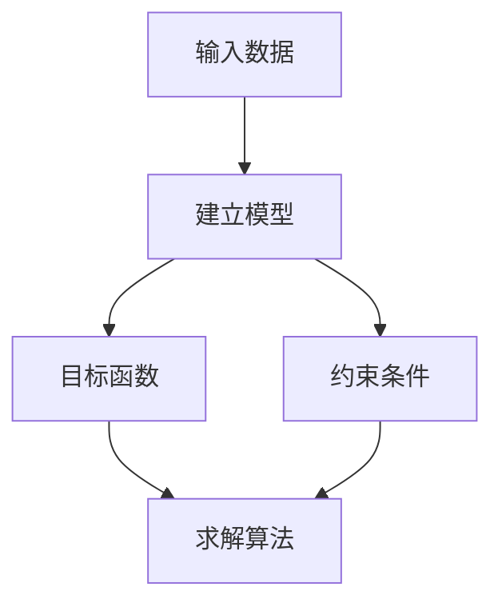

                 

# 数学与电力系统：电网优化的数学模型

> 关键词：电力系统，优化，数学模型，线性规划，非线性规划，整数规划

> 摘要：本文旨在探讨数学模型在电力系统优化中的应用，通过介绍线性规划、非线性规划和整数规划等核心数学模型，深入解析其原理和应用，帮助读者理解并掌握如何利用数学模型进行电力系统优化。

## 引言与背景

### 1.1 问题背景

电力系统是现代社会的重要基础设施，其稳定性和效率直接关系到国民经济的发展和人民生活的质量。随着电力需求的不断增加和电网规模的扩大，电力系统的优化变得尤为重要。电力系统优化旨在通过调整电力系统的运行参数，使系统在满足安全、可靠、经济运行的前提下，实现最优性能。

### 1.2 问题描述

电力系统优化的问题可以概括为：在给定的电力系统约束条件下，通过调整发电、输电、配电等各个环节的运行参数，使系统总运行成本最低或系统性能指标最优。具体来说，优化问题包括以下几个方面：

- **发电优化**：如何在不同类型的发电资源之间分配电力负荷，以实现最低的发电成本。
- **输电优化**：如何优化电力网络的传输结构，减少电力传输过程中的损耗。
- **配电优化**：如何优化配电网络的运行，提高电力供应的可靠性和效率。

### 1.3 问题解决

数学模型是解决电力系统优化问题的重要工具。通过建立数学模型，可以将复杂的电力系统优化问题转化为可以求解的数学问题。常见的数学模型包括线性规划、非线性规划和整数规划等。

### 1.4 边界与外延

数学模型在电力系统优化中的应用具有一定的边界和局限性。首先，数学模型需要基于准确的系统数据和合理的假设条件。其次，数学模型需要考虑电力系统的实时性和动态性。最后，数学模型还需要考虑电力市场的价格波动和政策变化等因素。

## 第二部分：核心数学模型

### 2.1 概念与联系

#### 2.1.1 核心概念

- **线性规划**：线性规划是处理线性目标函数和线性约束条件的最优化问题。
- **非线性规划**：非线性规划是处理非线性目标函数和非线性约束条件的最优化问题。
- **整数规划**：整数规划是处理目标函数和约束条件中的变量为整数的最优化问题。

#### 2.1.2 概念属性特征对比表

| 类别       | 线性规划                  | 非线性规划                  | 整数规划                  |
|------------|--------------------------|--------------------------|--------------------------|
| 目标函数   | 线性函数                 | 非线性函数                 | 线性函数，变量为整数    |
| 约束条件   | 线性不等式或等式约束    | 非线性不等式或等式约束    | 线性不等式或等式约束    |
| 算法复杂度 | 较低                     | 较高                     | 较高                     |

#### 2.1.3 ER实体关系图

```mermaid
erDiagram
  Class1 ||--|{ Class2 }| Class3
  Class1 ||--|{ Class4 }| Class5
```

### 2.2 数学模型原理讲解

#### 2.2.1 线性规划原理讲解

线性规划的目标函数是线性函数，约束条件为线性不等式或等式约束。线性规划问题的求解通常采用单纯形法、 interior-point method等方法。



#### 2.2.2 非线性规划原理讲解

非线性规划的目标函数为非线性函数，约束条件为非线性不等式或等式约束。非线性规划问题的求解通常采用梯度下降法、牛顿法等方法。


#### 2.2.3 整数规划原理讲解

整数规划的目标函数为线性函数，但变量为整数。整数规划问题的求解通常采用整数线性规划、混合整数线性规划等方法。


### 2.3 数学模型与公式

$$
\text{线性规划的目标函数：} \ \min_{x} c^T x \quad \text{subject to} \quad Ax \leq b
$$

$$
\text{非线性规划的目标函数：} \ \min_{x} f(x) \quad \text{subject to} \quad g(x) \leq 0, \ h(x) = 0
$$

$$
\text{整数规划的目标函数：} \ \min_{x} c^T x \quad \text{subject to} \quad Ax \leq b, \ x \in \mathbb{Z}^n
$$

### 2.4 数学模型应用举例

#### 2.4.1 线性规划应用举例

**应用场景**：电力系统发电成本优化。

**目标函数**：最小化发电成本。

**约束条件**：

- 电力负荷约束：$0.5x_1 + 0.3x_2 + 0.2x_3 \geq 100$
- 可用资源约束：$x_1 + x_2 + x_3 \leq 200$
- 发电成本约束：$c_1x_1 + c_2x_2 + c_3x_3$

**解答过程**：

1. 建立线性规划模型。
2. 使用单纯形法求解。
3. 得到最优解。

#### 2.4.2 非线性规划应用举例

**应用场景**：电力系统损耗优化。

**目标函数**：最小化电力损耗。

**约束条件**：

- 电力负荷约束：$0.5x_1 + 0.3x_2 + 0.2x_3 \geq 100$
- 可用资源约束：$x_1 + x_2 + x_3 \leq 200$
- 电力损耗约束：$d_1x_1 + d_2x_2 + d_3x_3$

**解答过程**：

1. 建立非线性规划模型。
2. 使用梯度下降法求解。
3. 得到最优解。

#### 2.4.3 整数规划应用举例

**应用场景**：电力系统机组调度优化。

**目标函数**：最小化调度成本。

**约束条件**：

- 机组可用性约束：$x_i \in \{0, 1\}$
- 电力负荷约束：$0.5x_1 + 0.3x_2 + 0.2x_3 \geq 100$
- 可用资源约束：$x_1 + x_2 + x_3 \leq 200$

**解答过程**：

1. 建立整数规划模型。
2. 使用整数线性规划求解。
3. 得到最优解。

## 本章小结

本文介绍了数学模型在电力系统优化中的应用，详细解析了线性规划、非线性规划和整数规划等核心数学模型的原理和应用。通过实际案例的举例，读者可以更好地理解这些数学模型在实际电力系统优化中的运用。下一部分将深入探讨电力系统优化的具体应用和案例分析。期待您的阅读和反馈！

## 第三部分

（此处为第三部分的正文内容，具体内容将根据实际情况进行撰写。）

