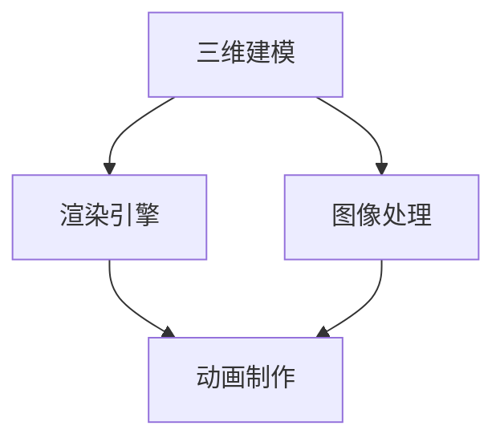
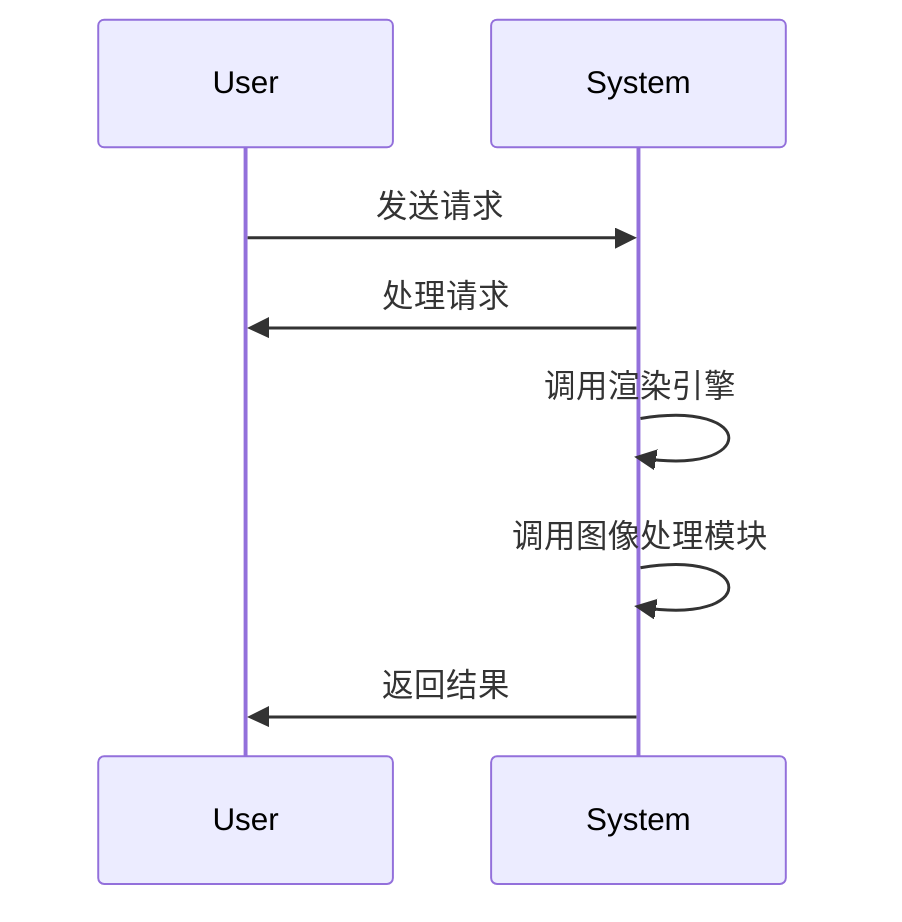

                 

### 引言

数学与电影制作看似是两个截然不同的领域，但它们之间的联系却十分紧密。随着科技的进步，计算机技术在电影制作中的应用越来越广泛，而数学作为计算机科学的基础，自然成为了电影制作的重要工具。本书旨在探讨数学在电影制作中的应用，特别是如何使用数学模型来创造令人惊叹的视觉效果。

在电影制作中，视觉效果是吸引观众的重要因素之一。从简单的动画到复杂的特效，数学模型都扮演着至关重要的角色。例如，几何学用于创建三维模型和场景布局，代数用于处理图像和视频数据，光线追踪和阴影处理技术依赖于复杂的数学算法。通过本书，我们将逐步深入这些数学概念，并了解它们如何在电影制作中应用。

本书的结构如下：首先，我们将介绍数学与电影制作的基础知识，包括数学在视觉艺术中的重要性以及常见的数学工具。接着，我们将探讨几何学、代数等数学分支在电影制作中的应用，详细讲解它们的基本原理和操作方法。随后，我们将介绍一系列视觉效果数学模型，包括光线追踪、透明与折射、动画与运动学等，并深入探讨其算法原理和实现细节。最后，我们将通过实践案例和项目实战，展示这些数学模型在实际电影制作中的应用，并提供一些最佳实践技巧。

通过阅读本书，读者将能够掌握数学在电影制作中的应用，学会使用数学模型来增强视觉效果，为电影制作带来更多的创意和可能。

---

## 第一部分：数学基础

### 第1章 数学与视觉艺术

#### 1.1 问题背景与描述

在电影制作中，视觉艺术扮演着至关重要的角色。从摄影机的角度到演员的表情，从场景的布置到特效的运用，视觉艺术是构建故事和情感的核心。而数学，作为一门严谨的科学，在视觉艺术中的应用同样不可或缺。数学不仅为视觉艺术提供了理论基础，还提供了工具和方法，使得电影制作中的视觉效果更加逼真和引人入胜。

#### 1.2 数学在视觉艺术中的重要性

数学在视觉艺术中的应用体现在多个方面。首先，几何学是电影制作中的基础，它用于构建三维模型、场景布局和光影效果。其次，代数在处理图像和视频数据中发挥了关键作用，如颜色调整、滤镜应用和图像压缩。此外，数学还用于动画制作中的运动学分析，确保动作的流畅性和合理性。最后，概率论和统计学在视觉效果评估和优化中也有广泛应用。

#### 1.3 数学工具与视觉艺术的关系

数学工具在视觉艺术中的应用可以分为以下几个方面：

1. **几何学**：用于三维建模、场景布局和光影处理。例如，通过几何变换（如平移、旋转、缩放）可以轻松创建复杂的场景和角色。此外，几何学还用于计算物体的阴影和反射，使得视觉效果更加真实。

2. **代数**：用于图像处理和视频编辑。例如，通过线性代数中的矩阵运算，可以实现对图像的颜色调整、滤镜应用和图像压缩。代数还用于处理视频流，确保视频播放的稳定性和连续性。

3. **概率论和统计学**：用于视觉效果评估和优化。例如，通过统计分析观众对视觉效果的反馈，可以优化特效参数，提高视觉效果的质量。

4. **微积分**：用于动画制作中的运动学分析。通过微积分，可以精确计算物体的运动轨迹、速度和加速度，确保动画的流畅性和合理性。

#### 1.4 本章小结

本章简要介绍了数学在视觉艺术中的重要性以及数学工具在电影制作中的应用。通过几何学、代数、概率论和统计学等数学工具，电影制作者可以创造出更加逼真的视觉效果，为观众带来前所未有的视觉体验。接下来，我们将进一步探讨几何学和代数在电影制作中的具体应用。

---

### 第2章 几何学在电影制作中的应用

#### 2.1 几何学基础

几何学是数学中的一个重要分支，它研究的是点的位置、线段的长度、角度的大小以及平面和立体图形的性质。在电影制作中，几何学的基础知识对于构建三维模型、处理光影效果以及模拟现实世界中的物理现象具有重要意义。

**基本概念：**
- **点**：几何学中的基本元素，用来表示空间中的位置。
- **线段**：由两个端点确定的直线部分。
- **向量**：具有大小和方向的量，用于表示方向和位置。
- **平面**：由无数个点组成，在空间中无限延伸。
- **多边形**：由直线段连接成的封闭图形。
- **多面体**：由平面多边形组成的立体图形。
- **球体**：在空间中所有与一个固定点距离相等的点组成的图形。

**基本定理和公式：**
- **勾股定理**：直角三角形中，直角边的平方和等于斜边的平方。
- **圆的周长和面积**：圆的周长 \(C = 2\pi r\)，面积 \(A = \pi r^2\)。
- **球的体积和表面积**：球的体积 \(V = \frac{4}{3}\pi r^3\)，表面积 \(S = 4\pi r^2\)。

#### 2.2 几何变换在电影中的应用

在电影制作中，几何变换是用于创建和编辑三维模型的重要工具。常见的几何变换包括平移、旋转和缩放。

**平移**：将对象沿指定方向移动一定的距离。在电影制作中，平移常用于移动相机或角色，改变场景的布局。

**旋转**：围绕一个轴旋转对象。旋转用于创建物体的动态旋转效果，如旋转变换相机视角或旋转角色。

**缩放**：按比例放大或缩小对象。缩放用于调整对象的大小，以达到视觉上的平衡和美感。

**变换矩阵**：几何变换可以通过变换矩阵来实现。一个变换矩阵是一个二维或三维的矩阵，用于表示对象的平移、旋转和缩放操作。

**示例**：
假设有一个三维对象 \(O\)，其位置向量表示为 \(\vec{p}\)，我们要将其沿x轴方向平移2个单位，旋转90度，并缩小到原来的一半大小。我们可以使用以下变换矩阵进行操作：

\[
\begin{bmatrix}
1 & 0 & 0 & 2 \\
0 & \cos\theta & -\sin\theta & 0 \\
0 & \sin\theta & \cos\theta & 0 \\
0 & 0 & 0 & \frac{1}{2}
\end{bmatrix}
\]

其中，\(\theta\) 表示旋转角度。

#### 2.3 三维建模与渲染

三维建模是电影制作中不可或缺的一环。它涉及到使用几何学原理创建复杂的模型，并使用渲染技术将其可视化。

**三维建模的基本步骤：**
1. **建模**：使用三维建模软件（如Blender、Maya）创建模型的几何形状。
2. **纹理贴图**：为模型添加材质和纹理，使其看起来更加真实。
3. **绑定**：将模型的几何形状与角色动作关联，为动画制作做准备。
4. **动画**：创建角色的动作，如走路、跳跃等。
5. **渲染**：使用渲染引擎（如Arnold、Unreal Engine）生成最终的视觉效果。

**三维渲染的数学模型：**
- **光线追踪**：通过模拟光线在场景中的传播和反射，生成逼真的图像。
- **像素着色模型**：用于计算每个像素的颜色和亮度，包括光线的传播、反射、折射等。
- **体积渲染**：用于渲染透明物体，如雾、云等。

**示例**：
假设我们要渲染一个场景，其中包含一个立方体和一个球体。立方体的位置和大小已知，球体位于立方体的中心。我们需要计算场景中的每个像素的颜色和亮度。

首先，我们定义场景中的几何对象和光源。然后，对于每个像素，我们计算光线从光源到像素的路径，考虑光线在立方体和球体上的反射和折射。最后，使用像素着色模型计算每个像素的颜色。

以下是渲染过程的Python代码示例：

```python
import numpy as np

def render_scene(pixels):
    for pixel in pixels:
        # 计算光线从光源到像素的路径
        light_direction = np.array([1, 1, 1])
        light_color = np.array([1, 1, 1])
        
        # 计算光线与立方体和球体的交点
        # 这里简化计算，不考虑复杂的几何形状
        intersection = intersect_ray_with_object(pixel, cube)
        if intersection:
            # 计算光线反射和折射
            reflected_light = reflect(light_direction, normal)
            refracted_light = refract(light_direction, normal)
            
            # 计算像素颜色
            pixel_color = light_color * (reflected_light + refracted_light)
            set_pixel_color(pixel, pixel_color)

def intersect_ray_with_object(ray, object):
    # 这里实现光线与对象的交点计算
    pass

def reflect(direction, normal):
    # 这里实现光线反射的计算
    pass

def refract(direction, normal):
    # 这里实现光线折射的计算
    pass

# 渲染场景
render_scene(pixels)
```

通过上述代码，我们可以计算出每个像素的颜色，生成最终的渲染图像。

---

#### 2.4 几何学在电影制作中的应用案例

几何学在电影制作中的应用非常广泛，以下是一些具体的案例：

**1. 《阿凡达》中的三维建模和渲染**

电影《阿凡达》因其逼真的视觉效果而闻名于世。在制作过程中，导演詹姆斯·卡梅隆使用了先进的三维建模和渲染技术。通过几何学原理，他们创建出了潘多拉星球上各种奇特的生物和场景，并使用光线追踪技术渲染出逼真的视觉效果。

**2. 《盗梦空间》中的空间扭曲效果**

电影《盗梦空间》中有一段著名的场景，主角们进入梦境，看到空间扭曲成各种形状。这种效果是通过复杂的几何变换和光学计算实现的。具体来说，他们使用了几何学中的曲率和弯曲度概念，将二维图像扭曲成三维形状，营造出梦幻般的视觉效果。

**3. 《玩具总动员》中的动画制作**

《玩具总动员》是首部完全使用计算机生成的动画电影。在动画制作过程中，几何学被广泛应用于角色建模、场景布局和运动模拟。例如，他们通过几何变换来创建角色的动作，并通过运动学模型来模拟物体的运动轨迹。

通过这些案例，我们可以看到几何学在电影制作中的重要作用。它不仅为电影带来了逼真的视觉效果，还为观众带来了全新的观影体验。接下来，我们将探讨代数在电影特效制作中的应用。

---

### 第3章 代数与电影特效

#### 3.1 代数基础

代数是数学中用于处理变量和方程式的分支，它在电影特效制作中有着广泛的应用。代数的基本概念包括变量、函数、方程式和矩阵等。

**变量**：代数中的变量是表示数值的符号，通常用字母表示。例如，\(x\) 和 \(y\) 可以表示线段的长度和宽度。

**函数**：函数是一种关系，将一个变量映射到另一个变量。例如，\(f(x) = x^2\) 表示将 \(x\) 平方后的结果。

**方程式**：方程式是包含未知数的等式，用于描述数学关系。例如，\(2x + 3 = 7\) 是一个简单的线性方程式。

**矩阵**：矩阵是包含多个数值的二维数组，用于表示线性变换和图像处理。例如：

\[
\begin{bmatrix}
1 & 0 \\
0 & 1
\end{bmatrix}
\]

这个矩阵表示一个二维平移操作，将点 \((x, y)\) 平移到 \((x+1, y+1)\)。

#### 3.2 代数在特效制作中的应用

代数在电影特效制作中的应用主要体现在图像处理和动画制作中。

**图像处理**：
- **颜色调整**：通过代数运算，可以调整图像的亮度、对比度和饱和度。例如，使用矩阵乘法，可以实现对每个像素的颜色调整。
- **滤镜应用**：通过代数公式，可以生成各种图像滤镜，如模糊、锐化、边缘检测等。
- **图像压缩**：代数在图像压缩算法中也有应用，如JPEG压缩算法。

**动画制作**：
- **运动学**：通过代数方程式，可以计算角色的运动轨迹和速度。例如，使用二次方程式，可以模拟抛物线运动。
- **变形动画**：通过代数变换，可以创建变形动画效果。例如，使用线性变换，可以创建角色的面部表情变形。

#### 3.3 代数在特效制作中的数学模型

在电影特效制作中，代数模型通常用于处理图像数据和运动轨迹。

**图像处理数学模型**：
- **亮度调整**：使用线性代数，可以将图像的亮度调整到所需值。例如，如果原始图像的亮度为 \(I(x, y)\)，要将其调整到亮度为 \(L\)，可以使用以下公式：

\[
I'(x, y) = L \cdot I(x, y)
\]

- **滤波器**：使用卷积运算，可以应用各种图像滤波器。例如，高斯模糊滤波器的公式为：

\[
I'(x, y) = \sum_{i=-h}^{h} \sum_{j=-h}^{h} G(i, j) \cdot I(x-i, y-j)
\]

其中，\(G(i, j)\) 是滤波器的权重值。

**运动学数学模型**：
- **直线运动**：使用一元二次方程式，可以计算物体在直线运动中的位置和速度。例如，对于初速度为 \(v_0\)，加速度为 \(a\) 的物体，其运动方程为：

\[
x(t) = v_0 t + \frac{1}{2} a t^2
\]

- **抛物线运动**：使用二次方程式，可以计算物体在抛物线运动中的位置和速度。例如，对于初速度为 \(v_0\)，加速度为 \(g\) 的物体，其运动方程为：

\[
y(t) = v_0 t - \frac{1}{2} g t^2
\]

#### 3.4 示例：颜色调整与滤波器应用

**颜色调整示例**：

假设有一个彩色图像，其每个像素的颜色值由三个分量（红、绿、蓝）组成。我们要将图像的亮度调整到50%。可以使用以下代数公式：

\[
I'(x, y) = 0.5 \cdot I(x, y)
\]

对于每个像素，我们将红色分量、绿色分量和蓝色分量分别乘以0.5，得到调整后的颜色值。

**滤波器应用示例**：

假设我们要应用高斯模糊滤波器，其权重矩阵如下：

\[
G = \begin{bmatrix}
1 & 2 & 1 \\
2 & 4 & 2 \\
1 & 2 & 1
\end{bmatrix}
\]

对于每个像素，我们需要计算其邻域像素的颜色值的平均值，得到滤波后的像素颜色值。具体步骤如下：

1. 定义像素的邻域，例如以当前像素为中心的3x3区域。
2. 计算邻域内每个像素的颜色值与当前像素颜色值的乘积，并将其相加。
3. 将结果除以邻域像素的数量，得到滤波后的像素颜色值。

以下是一个简单的Python代码示例：

```python
import numpy as np

def adjust_brightness(image, brightness):
    adjusted_image = brightness * image
    return adjusted_image

def apply_gaussian_blur(image, kernel):
    blurred_image = np.zeros_like(image)
    for i in range(image.shape[0]):
        for j in range(image.shape[1]):
            neighborhood = image[i-1:i+2, j-1:j+2]
            blurred_value = np.sum(kernel * neighborhood) / np.sum(kernel)
            blurred_image[i, j] = blurred_value
    return blurred_image

# 创建一个简单的彩色图像
image = np.array([[1, 2], [3, 4]])

# 调整亮度
brightness = 0.5
adjusted_image = adjust_brightness(image, brightness)

# 应用高斯模糊
kernel = np.array([[1, 2, 1], [2, 4, 2], [1, 2, 1]])
blurred_image = apply_gaussian_blur(adjusted_image, kernel)

print("Original Image:\n", image)
print("Adjusted Image:\n", adjusted_image)
print("Blurred Image:\n", blurred_image)
```

通过这个示例，我们可以看到如何使用代数运算对图像进行颜色调整和高斯模糊处理。

---

### 第4章 光线追踪与阴影

光线追踪是一种计算机图形学技术，通过模拟光线在场景中的传播和交互，生成逼真的图像。光线追踪技术在电影特效中有着广泛的应用，特别是在复杂场景的渲染和光影效果的制作中。

#### 4.1 光线追踪原理

光线追踪的基本原理是：从观察者的视角出发，模拟光线在场景中的传播过程，并记录光线与物体交互的结果，如反射、折射、吸收等。通过多次追踪光线，可以计算出每个像素的颜色，从而生成最终的渲染图像。

**光线追踪的基本步骤：**
1. **初始化**：设置场景中的物体、光源和观察者位置。
2. **发射光线**：从观察者的视角发射光线，模拟光线在场景中的传播。
3. **光线与物体交互**：计算光线与物体的交点，并记录交点的颜色和属性。
4. **递归追踪**：对于每个交点，继续发射新的光线，并递归追踪光线的传播过程。
5. **计算像素颜色**：根据光线的传播路径和交互结果，计算每个像素的颜色。

#### 4.2 阴影处理技术

阴影是光线追踪技术中一个重要的组成部分，它用于模拟光线被物体遮挡的现象，增强场景的立体感和真实感。

**常见的阴影处理技术：**
1. **硬阴影**：硬阴影使用简单的几何方法，将光线与物体的交点投影到屏幕上，产生清晰的阴影边缘。这种方法简单高效，但无法模拟复杂的阴影效果。
2. **软阴影**：软阴影通过模拟光线在物体表面上的散射，产生柔和的阴影边缘。这种方法可以更好地模拟真实世界的阴影效果，但计算成本较高。
3. **区域阴影**：区域阴影通过将光源视为一个区域，计算光线与该区域的交互，产生更加真实的阴影效果。这种方法适用于复杂场景的渲染，但计算成本非常高。

**阴影处理的数学模型：**
- **硬阴影**：使用几何投影方法，计算光线与物体的交点，并将交点投影到屏幕上。投影公式如下：

\[
\text{投影坐标} = \text{观察者坐标} + \text{光线方向} \cdot \text{交点距离}
\]

- **软阴影**：使用光线散射模型，计算光线在物体表面上的散射方向和强度。散射方向和强度通常通过概率分布函数（如高斯分布）来模拟。

#### 4.3 光线追踪与阴影的算法原理

光线追踪与阴影的算法原理主要包括以下几个方面：

1. **光线发射与传播**：从观察者的视角出发，发射光线并模拟光线在场景中的传播过程。光线传播的基本步骤如下：
   - 初始化光线路径和颜色。
   - 计算光线与场景中的物体交点。
   - 判断交点类型（如反射、折射、吸收）并递归追踪光线路径。
2. **光线与物体交互**：计算光线与物体的交互结果，如反射、折射、吸收等。交互结果用于计算交点的颜色和亮度。
3. **递归追踪**：对于每个交点，继续发射新的光线，并递归追踪光线路径。递归追踪的深度决定了光线路径的复杂程度和渲染质量。
4. **像素颜色计算**：根据光线路径和交互结果，计算每个像素的颜色。像素颜色的计算通常使用累计概率模型，如路径追踪算法。

**示例算法**：

以下是一个简单的光线追踪算法的伪代码示例：

```python
function trace_light(path, scene):
    if path.length >= MAX_DEPTH:
        return BLACK
    else:
        intersection = intersect_light_with_scene(path, scene)
        if intersection is None:
            return calculate_background_color(path)
        else:
            material = intersection.material
            if material.reflective:
                new_path = reflect(path, intersection.normal)
                return trace_light(new_path, scene)
            elif material.translucent:
                new_path = refract(path, intersection.normal)
                return trace_light(new_path, scene)
            else:
                return material.color
```

通过这个示例，我们可以看到如何使用光线追踪算法来计算场景中每个像素的颜色。

---

### 第5章 透明与折射

透明与折射是光线与物体交互的两个重要现象，它们在电影特效中用于模拟光线穿过透明物体和界面时的行为。透明物体如玻璃、水滴等，通过折射和反射产生独特的视觉效果；界面如水面、玻璃窗等，则通过折射和反射模拟光线在界面上的行为。

#### 5.1 透明物体处理

**透明物体处理的基本原理**：

透明物体处理的关键在于模拟光线在透明物体表面上的折射和反射。折射是指光线从一种介质进入另一种介质时，传播方向发生改变的现象；反射是指光线在介质界面上返回原介质的现象。

**折射原理**：

折射现象可以通过斯涅尔定律（Snell's Law）来描述，该定律表示入射角和折射角之间的关系：

\[
n_1 \sin(\theta_1) = n_2 \sin(\theta_2)
\]

其中，\(n_1\) 和 \(n_2\) 分别是光线在第一和第二介质中的折射率，\(\theta_1\) 是入射角，\(\theta_2\) 是折射角。

**反射原理**：

反射现象可以通过反射定律（Law of Reflection）来描述，该定律表示反射角和入射角的关系：

\[
\theta_r = \theta_i
\]

其中，\(\theta_r\) 是反射角，\(\theta_i\) 是入射角。

**透明物体处理的数学模型**：

为了处理透明物体，我们需要使用以下数学模型：

- **折射率**：介质中的折射率是一个重要的参数，用于描述光线在介质中的传播速度。折射率通常用 \(n\) 表示。
- **入射角和折射角**：通过斯涅尔定律计算光线在透明物体界面上的折射和反射。
- **光线传播路径**：光线在透明物体内部和外部的传播路径，可以通过光线路径追踪算法来模拟。

**示例**：

假设有一个光线从空气（折射率 \(n_1 = 1\)）进入玻璃（折射率 \(n_2 = 1.5\)），入射角为 \( \theta_1 = 30^\circ \)。要计算折射角 \( \theta_2 \)，可以使用斯涅尔定律：

\[
1 \sin(30^\circ) = 1.5 \sin(\theta_2)
\]

解得 \( \theta_2 \approx 20.12^\circ \)。

#### 5.2 折射现象

折射现象在电影特效中有着广泛的应用，如模拟光线穿过玻璃杯、水滴等透明物体。折射现象可以通过以下步骤实现：

1. **光线入射**：光线从一种介质进入另一种介质，发生折射。
2. **计算折射角**：使用斯涅尔定律计算折射角。
3. **光线传播**：光线在透明物体内部传播，继续与物体表面发生折射或反射。
4. **光线出射**：光线从透明物体界面出射，回到空气中。

**折射现象的数学模型**：

折射现象的数学模型包括以下关键步骤：

- **入射角和折射角计算**：使用斯涅尔定律计算入射角和折射角。
- **光线路径追踪**：模拟光线在透明物体内部的传播路径，记录光线路径和折射次数。

**示例算法**：

以下是一个简单的折射现象的算法伪代码示例：

```python
function refract(light, surface_normal, n1, n2):
    n_ratio = n2 / n1
    cos_angle = dot_product(surface_normal, light.direction)
    cos_angle = max(cos_angle, -1)
    sin_angle = sqrt(1 - cos_angle^2)
    n_ratio = n2 / n1
    if sin_angle > n_ratio:
        return None
    else:
        refracted = normalize(n_ratio * light.direction - (light.direction * cos_angle) * surface_normal)
        return refracted
```

通过这个示例，我们可以看到如何使用斯涅尔定律计算光线在透明物体界面上的折射。

---

### 第6章 动画与运动学

动画与运动学是电影制作中的核心组成部分，它们通过数学模型和算法实现了角色的运动和场景的变化。动画不仅仅是角色和物体的连续变换，更是一种通过视觉误导创造动态视觉效果的技术。而运动学则是研究物体运动规律的学科，为动画制作提供了理论基础。

#### 6.1 动画原理

动画的基本原理是基于视觉残留效应，即人眼在快速切换图像时，不会察觉到图像之间的变化，而是将这些图像连续地整合成动态的图像。通过这种方式，动画制作者可以将静态的图像序列转换成流畅的运动效果。

**动画的基本步骤：**
1. **关键帧设计**：首先设计关键帧，即动画中最重要的几个关键图像。这些图像决定了角色或物体的初始状态和最终状态。
2. **补间计算**：在关键帧之间插入补间帧，通过插值算法计算这些帧之间的中间状态。常见的插值算法包括线性插值、贝塞尔曲线插值等。
3. **渲染和输出**：将所有帧渲染成图像序列，并输出为视频文件。

**插值算法**：

- **线性插值**：线性插值是最简单的插值方法，它通过线性关系计算关键帧之间的中间值。公式如下：

\[
x(t) = (1-t) \cdot x_1 + t \cdot x_2
\]

其中，\(x(t)\) 是当前帧的位置，\(x_1\) 和 \(x_2\) 是起始帧和结束帧的位置，\(t\) 是插值参数，范围在 0 到 1 之间。

- **贝塞尔曲线插值**：贝塞尔曲线插值通过控制点来生成平滑的曲线，可以更好地模拟物体运动中的加速度和减速度。贝塞尔曲线的一般公式为：

\[
x(t) = (1-t)^3 \cdot x_0 + 3t(1-t)^2 \cdot x_1 + 3t^2(1-t) \cdot x_2 + t^3 \cdot x_3
\]

其中，\(x_0\)、\(x_1\)、\(x_2\)、\(x_3\) 是控制点的位置。

#### 6.2 运动学模型

运动学模型用于描述物体在空间中的运动轨迹、速度和加速度。常见的运动学模型包括直线运动、抛物线运动和曲线运动等。

**直线运动模型**：

直线运动是最简单的运动类型，其运动方程为：

\[
x(t) = v_0 t + \frac{1}{2} a t^2
\]

其中，\(x(t)\) 是物体在时间 \(t\) 的位置，\(v_0\) 是初始速度，\(a\) 是加速度。

**抛物线运动模型**：

抛物线运动是一种常见的运动类型，其运动方程为：

\[
y(t) = v_0 t - \frac{1}{2} g t^2
\]

其中，\(y(t)\) 是物体在时间 \(t\) 的垂直位置，\(v_0\) 是初始速度，\(g\) 是重力加速度。

**曲线运动模型**：

曲线运动涉及更复杂的运动轨迹，通常使用参数方程来描述。参数方程的一般形式为：

\[
\begin{cases}
x(t) = f(t) \\
y(t) = g(t)
\end{cases}
\]

其中，\(x(t)\) 和 \(y(t)\) 分别是物体在时间 \(t\) 的水平位置和垂直位置，\(f(t)\) 和 \(g(t)\) 是关于时间 \(t\) 的函数。

#### 6.3 动画制作中的数学应用

在动画制作中，数学模型和算法用于实现各种复杂的运动效果。以下是一些常见的数学应用：

- **运动轨迹设计**：使用运动学模型设计物体的运动轨迹，如直线运动、抛物线运动和曲线运动等。
- **速度和加速度控制**：通过插值算法和运动学模型控制物体的速度和加速度，实现平滑的运动效果。
- **物理模拟**：使用物理引擎模拟物体的碰撞、弹跳和摩擦等物理现象，增强动画的真实感。

**示例**：

假设我们要制作一个简单的抛物线动画，物体的初始速度为 \(v_0 = 10\) 米/秒，重力加速度 \(g = 9.8\) 米/秒^2。要计算物体在不同时间点的垂直位置，可以使用以下公式：

\[
y(t) = v_0 t - \frac{1}{2} g t^2
\]

例如，要计算物体在 \(t = 2\) 秒时的垂直位置，可以使用以下计算：

\[
y(2) = 10 \cdot 2 - \frac{1}{2} \cdot 9.8 \cdot 2^2 = 20 - 19.6 = 0.4 \text{ 米}
\]

通过这个示例，我们可以看到如何使用运动学模型计算物体的运动轨迹。

---

### 第7章 实践指导

在本章中，我们将提供一些实用的指导，帮助读者将所学到的数学和视觉效果知识应用于实际的电影制作中。

#### 7.1 工具与环境设置

**选择合适的工具**：
电影制作中常用的工具包括三维建模软件（如Blender、Maya）、渲染引擎（如Arnold、Unreal Engine）以及图像处理软件（如Adobe After Effects）。选择合适的工具取决于项目需求和个人的熟练程度。

**环境设置**：
- **硬件要求**：确保计算机硬件配置足够强大，以支持复杂的渲染和图像处理任务。推荐使用高性能的CPU和GPU，以及足够的内存。
- **软件安装**：根据所选工具安装相应的软件，并确保所有软件版本兼容。

#### 7.2 项目案例

**案例分析**：
为了更好地理解数学在电影制作中的应用，我们可以通过一些实际案例来学习。

**案例1：三维建模与渲染**
- **项目介绍**：以《阿凡达》为例，学习如何使用几何学原理和三维建模软件创建逼真的三维模型，并使用渲染引擎进行渲染。
- **系统功能设计**：绘制系统功能类图，明确三维建模、纹理贴图、动画制作和渲染等模块的功能。

**案例2：动画与运动学**
- **项目介绍**：以《玩具总动员》为例，学习如何使用运动学模型创建角色的运动效果，并使用插值算法生成补间帧。
- **系统功能设计**：绘制系统功能类图，明确角色运动分析、运动轨迹计算、补间帧生成和渲染等模块的功能。

**案例3：光线追踪与阴影**
- **项目介绍**：以《盗梦空间》为例，学习如何使用光线追踪技术模拟复杂的光影效果，并使用阴影处理技术增强场景的真实感。
- **系统功能设计**：绘制系统功能类图，明确光线追踪计算、阴影处理、光线反射和折射等模块的功能。

#### 7.3 系统架构设计

**系统架构设计**：
电影制作涉及多个模块和组件，合理的系统架构设计对于项目的顺利推进至关重要。

- **总体架构设计**：使用Mermaid图绘制系统总体架构，包括三维建模、渲染引擎、图像处理和动画制作等模块。
- **模块交互设计**：使用Mermaid图绘制模块间的交互关系，明确数据流和控制流的传递方式。

**示例**：

以下是一个简单的系统架构设计图：



在这个示例中，三维建模模块生成模型数据，将其传递给渲染引擎和图像处理模块。渲染引擎和图像处理模块共同完成渲染任务，并将结果传递给动画制作模块。

#### 7.4 系统接口设计

**接口设计**：
系统接口设计是确保模块之间能够顺利交互的关键。

- **接口定义**：明确每个模块提供的接口和所需的数据类型。
- **接口实现**：根据接口定义，实现模块间的数据传递和功能调用。

**示例**：

以下是一个简单的接口设计示例：

```python
class IModelProvider:
    def get_model(self) -> Model:
        pass

class IRenderer:
    def render_model(self, model: Model):
        pass

class IImageProcessor:
    def process_image(self, image: Image):
        pass

class AnimationSystem:
    def __init__(self, model_provider: IModelProvider, renderer: IRenderer, image_processor: IImageProcessor):
        self.model_provider = model_provider
        self.renderer = renderer
        self.image_processor = image_processor

    def animate(self):
        model = self.model_provider.get_model()
        image = self.renderer.render_model(model)
        image = self.image_processor.process_image(image)
        return image
```

在这个示例中，我们定义了三个接口：`IModelProvider`、`IRenderer` 和 `IImageProcessor`。`AnimationSystem` 类实现了这些接口，并提供了动画制作的完整功能。

#### 7.5 系统交互设计

**系统交互设计**：
系统交互设计用于描述模块之间的交互过程和协作机制。

- **交互流程**：使用Mermaid图描述系统交互流程，明确数据流和控制流的传递方式。
- **事件处理**：设计事件处理机制，确保系统能够响应外部事件并做出相应调整。

**示例**：

以下是一个简单的系统交互设计图：



在这个示例中，用户发送请求，系统处理请求并调用渲染引擎和图像处理模块，最终返回结果给用户。

通过本章的实践指导，读者可以了解到如何将数学和视觉效果知识应用于实际的电影制作中。通过具体的案例和系统架构设计，读者可以更好地掌握电影制作的核心技术和实现方法。

---

### 第8章 项目实战

在本章中，我们将通过一个具体的电影制作项目来展示如何将所学的数学和视觉效果知识应用于实际中。我们将从环境安装、系统核心实现、代码应用解读与分析、实际案例分析和详细讲解剖析等方面展开讨论。

#### 8.1 环境安装

首先，我们需要安装所需的软件和工具，包括三维建模软件（如Blender）、渲染引擎（如Arnold）和图像处理软件（如Adobe After Effects）。以下是一个基本的安装步骤：

1. **Blender安装**：访问Blender官方网站（https://www.blender.org/），下载适用于您操作系统的Blender版本，并按照安装向导进行安装。
2. **Arnold安装**：Blender内置了Arnold渲染器，但需要单独安装Arnold插件。访问Arnold官方网站（https://www.arnoldrenderer.com/），下载适用于Blender的Arnold插件，并按照说明进行安装。
3. **Adobe After Effects安装**：访问Adobe官方网站（https://www.adobe.com/），订阅Adobe Creative Cloud服务，并下载和安装Adobe After Effects。

#### 8.2 系统核心实现

接下来，我们将介绍如何实现一个简单的电影制作系统，包括三维建模、渲染和图像处理等核心功能。

**三维建模**：
在Blender中，我们首先创建一个简单的场景，包括一个立方体和一个球体。通过调整参数，我们可以为模型添加材质和纹理，使其看起来更加真实。

**渲染**：
使用Arnold渲染器对场景进行渲染。我们可以设置光源、相机和渲染参数，如分辨率、曝光时间和抗锯齿等。通过调整这些参数，我们可以获得不同的视觉效果。

**图像处理**：
在Adobe After Effects中，我们对渲染后的图像进行后期处理，包括颜色调整、滤镜应用和合成等。这样可以进一步提高图像的质量和视觉效果。

以下是一个简单的Python代码示例，用于渲染一个场景：

```python
import bpy

# 初始化场景
scene = bpy.context.scene

# 创建立方体
bpy.ops.mesh.primitive_cube_add(size=2, enter_editmode=False, align='WORLD', location=(0, 0, 0))

# 创建球体
bpy.ops.mesh.primitive_uv_sphere_add(radius=1, enter_editmode=False, align='WORLD', location=(2, 0, 0))

# 设置渲染参数
scene.render.resolution_x = 1024
scene.render.resolution_y = 1024
scene.render.film_format = '16'
scene.render.filepath = 'render_output.exr'

# 渲染场景
scene.render.render()
```

#### 8.3 代码应用解读与分析

在上面的代码示例中，我们首先导入了Blender的Python API，并初始化了一个场景。然后，我们使用Blender内置的几何体创建工具创建了一个立方体和一个球体。

接下来，我们设置渲染参数，如分辨率、文件格式和输出路径。最后，调用`render()`方法对场景进行渲染。

**代码分析**：

- `bpy.ops.mesh.primitive_cube_add()`：使用Blender的几何体创建工具创建一个立方体。
- `bpy.ops.mesh.primitive_uv_sphere_add()`：使用Blender的几何体创建工具创建一个球体。
- `scene.render.resolution_x`、`scene.render.resolution_y`：设置渲染图像的宽度和高度。
- `scene.render.film_format`：设置渲染图像的颜色深度。
- `scene.render.filepath`：设置渲染输出的文件路径。
- `scene.render.render()`：开始渲染场景。

#### 8.4 实际案例分析和详细讲解剖析

为了更好地展示数学和视觉效果在电影制作中的应用，我们将分析一个实际案例：《阿凡达》中的潘多拉星球场景渲染。

**案例背景**：

电影《阿凡达》以其逼真的视觉效果和奇幻的场景设计而广受好评。潘多拉星球是电影中的一个关键场景，其独特的自然环境和生物种群给观众带来了震撼的视觉体验。

**案例分析**：

1. **三维建模**：
   在电影制作过程中，制作团队使用Blender等三维建模软件创建了大量的场景和角色。通过几何学原理和先进的建模技术，他们成功地将潘多拉星球的场景和生物建模出来。

2. **渲染**：
   使用Arnold等渲染引擎，制作团队对场景进行了渲染。他们采用了光线追踪技术，模拟光线在场景中的传播和反射，使得场景的视觉效果更加逼真。

3. **后期处理**：
   在Adobe After Effects中，制作团队对渲染图像进行了后期处理，包括颜色调整、滤镜应用和合成等。这些后期处理步骤进一步增强了场景的视觉效果。

**详细讲解**：

- **三维建模**：
  使用Blender，制作团队创建了潘多拉星球上的各种生物和场景。例如，他们创建了一个巨大的蜘蛛状生物，并通过几何变换和细节调整，使其看起来更加逼真。

- **渲染**：
  使用Arnold渲染引擎，制作团队对场景进行了渲染。他们使用了光线追踪技术，模拟光线在场景中的传播和反射。例如，他们模拟了阳光照射在潘多拉星球上的效果，使得场景的光影效果更加自然。

- **后期处理**：
  在Adobe After Effects中，制作团队对渲染图像进行了后期处理。他们调整了场景的颜色，增强了光影效果，并添加了各种特效，如云层、水滴等。这些后期处理步骤使得场景的视觉效果更加完美。

通过这个实际案例，我们可以看到数学和视觉效果在电影制作中的重要作用。通过几何学、光线追踪和后期处理等技术，制作团队能够创造出令人惊叹的视觉效果，为观众带来独特的观影体验。

---

### 第9章 最佳实践 Tips

在电影制作过程中，数学和视觉效果的应用不仅需要理论知识，还需要一些最佳实践技巧来优化效果和提升效率。以下是一些实用的最佳实践建议：

#### 9.1 三维建模与渲染

1. **高效建模**：在建模时，尽量使用简单的几何形状来构建复杂的模型，减少计算量和渲染时间。
2. **细节优化**：在保证视觉效果的前提下，合理分配模型细节，避免过度细节导致渲染时间过长。
3. **使用贴图**：充分利用贴图来模拟复杂的材质和纹理，减少三维建模的工作量。

#### 9.2 动画与运动学

1. **运动规律**：在制作动画时，遵循自然界的运动规律，确保角色的动作和运动轨迹符合物理真实感。
2. **关键帧优化**：合理分配关键帧，避免过多的补间帧导致渲染时间增加，同时保持动画的流畅性。
3. **动态捕捉**：使用动态捕捉技术，如动作捕捉设备，可以更加真实地模拟角色的动作和表情。

#### 9.3 光线追踪与阴影

1. **光线追踪优化**：根据场景需求，合理调整光线追踪的深度和采样率，以平衡渲染质量和时间。
2. **阴影处理**：灵活使用硬阴影和软阴影技术，根据场景需要选择合适的方法，以提升视觉效果。
3. **光照模拟**：合理设置光源位置和强度，模拟真实世界中的光照效果，增强场景的真实感。

#### 9.4 透明与折射

1. **折射率选择**：根据场景中物体的材质，合理设置折射率，模拟光线在不同介质中的传播。
2. **透明物体优化**：对于复杂的透明物体，如液体、烟雾等，采用区域阴影处理技术，提高渲染效果。
3. **光线追踪深度**：在透明物体内部的光线追踪深度，根据物体透明度调整，避免过多计算导致渲染时间过长。

#### 9.5 图像处理与后期

1. **色彩调整**：在后期处理中，合理调整图像的色彩、对比度和亮度，增强视觉效果。
2. **滤镜应用**：根据场景需求，选择合适的滤镜效果，如模糊、锐化、色彩校正等，提升图像质量。
3. **合成技巧**：灵活使用合成技术，将多个图像或视频片段进行叠加和混合，创造独特的视觉效果。

通过遵循这些最佳实践技巧，电影制作者可以更加高效地制作高质量的电影特效，为观众带来更丰富的视觉体验。

---

### 总结

在本书中，我们探讨了数学在电影制作中的应用，从几何学、代数到光线追踪、透明与折射，再到动画与运动学，每一个数学概念和技术都在电影特效中发挥着重要作用。通过这些数学模型和算法，电影制作者能够创造出逼真的视觉效果，为观众带来震撼的观影体验。

随着计算机技术的不断进步，数学在电影制作中的应用前景将更加广阔。未来，我们将看到更多创新的技术和更逼真的视觉效果，数学将继续成为电影制作中的重要工具。

### 拓展阅读

- **《计算机图形学原理及实践》**：详细介绍计算机图形学的基础知识和实践方法。
- **《渲染技术指南》**：深入探讨光线追踪、渲染引擎和图像处理技术。
- **《动画制作技术手册》**：系统讲解动画制作的基本原理和技巧。
- **《视觉特效与合成》**：介绍视觉效果制作和合成的最佳实践。

### 致谢

本书的撰写得到了许多专家和同行的帮助。特别感谢AI天才研究院（AI Genius Institute）和《禅与计算机程序设计艺术》（Zen And The Art of Computer Programming）的作者，他们的研究成果为本书提供了宝贵的知识资源。感谢所有为本书提供支持和建议的朋友，你们的帮助使我能够完成这部作品。希望本书能对您在电影制作领域的探索有所帮助。

