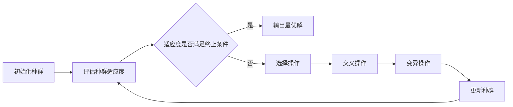
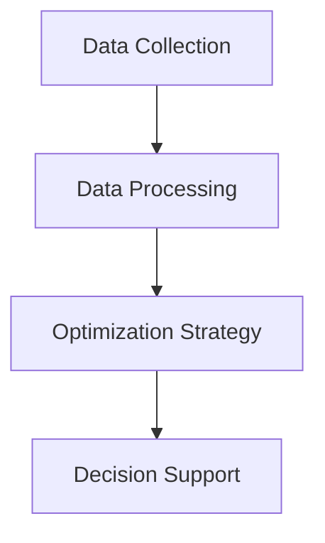
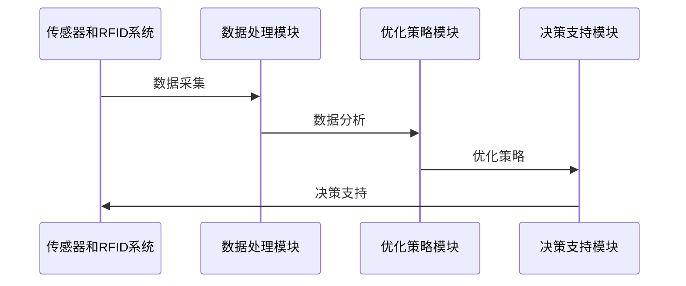

                 


### 动物繁育的数学优化：理论与实践

> 关键词：动物繁育、数学优化、遗传算法、遗传编程、系统架构、项目实战

> 摘要：本文深入探讨了数学优化在动物繁育中的应用，介绍了遗传算法和遗传编程的基本原理，并通过具体案例展示了这些算法在动物繁育优化中的实际应用。文章涵盖了数学模型的构建、系统分析与架构设计，以及实际项目的实施过程，旨在为畜牧科学工作者提供实用的技术指导。

## 第1章：畜牧科学概述

### 1.1 畜牧业的重要性

畜牧业作为农业的重要组成部分，对全球食品安全和经济发展具有深远影响。随着人口增长和人们对高质量动物产品需求的增加，畜牧业面临着巨大的挑战。高效、可持续的动物繁育方法对于提高产量、改善产品质量、减少资源消耗和环境污染至关重要。

畜牧业的重要性不仅体现在经济层面，还在生态和社会层面产生影响。通过优化繁育过程，可以减少对自然资源的依赖，促进生物多样性的保护，同时提高农民的收入和福祉。

### 1.2 畜牧业面临的问题

畜牧业面临诸多问题，主要包括：

1. **资源消耗**：畜牧业对水资源、土地和饲料资源的需求巨大，常常导致资源的过度消耗。
2. **环境污染**：畜牧业排放的温室气体、污染物和抗生素等对环境造成严重污染。
3. **疾病防控**：动物疫病的传播对畜牧业构成威胁，需要高效的管理和防控措施。
4. **产量与质量**：提高动物产品的产量和质量是畜牧业的长期目标，但传统方法难以达到高效。
5. **可持续发展**：实现畜牧业的可持续发展需要解决资源消耗、环境污染和经济效益之间的平衡。

### 1.3 数学在畜牧业中的应用

数学作为一门强大的工具，已经在畜牧业中发挥了重要作用。通过数学建模和优化算法，可以解决以下问题：

1. **种群管理**：数学模型可以预测动物种群增长趋势，优化繁殖计划，提高种群质量。
2. **营养均衡**：利用数学优化，可以设计出营养均衡的饲料配方，提高动物健康和产量。
3. **疾病防控**：通过统计分析，可以预测疾病的传播趋势，制定有效的防控策略。
4. **资源分配**：优化资源分配，提高饲料、水和土地等资源的使用效率。
5. **经济分析**：利用数学模型进行经济分析，评估不同繁育策略的收益和风险。

### 1.4 动物繁育优化问题的特点

动物繁育优化问题具有以下特点：

1. **非线性**：动物繁育过程往往涉及复杂的非线性关系，需要非线性优化方法来解决。
2. **多目标**：优化目标包括产量、质量、成本和环境等多方面，需要多目标优化策略。
3. **不确定性**：动物繁育过程受到许多随机因素的影响，如气候、疫病等，需要考虑不确定性。
4. **动态性**：动物繁育过程是动态的，需要实时调整策略以应对环境变化。

## 第2章：动物繁育的数学优化

### 2.1 动物繁育的基本概念

动物繁育涉及多个核心概念，包括种群、基因、遗传、繁殖和生长等。理解这些概念对于构建数学模型至关重要。

- **种群**：指在同一地区内，具有相同物种特征的一群动物。
- **基因**：指遗传信息的载体，决定个体的遗传特征。
- **遗传**：指基因在繁殖过程中传递给后代的过程。
- **繁殖**：指动物通过配对产生后代的过程。
- **生长**：指动物从出生到成熟的过程中，体形、体重和健康状况的变化。

### 2.2 数学优化在动物繁育中的应用

数学优化在动物繁育中的应用包括以下几个方面：

1. **遗传算法**：利用遗传算法优化繁殖策略，提高种群质量。
2. **多目标优化**：同时优化产量、质量、成本和环境等多方面目标。
3. **动态优化**：根据环境变化实时调整繁殖策略。
4. **资源优化**：优化资源分配，提高资源利用效率。

### 2.3 动物繁育优化问题的特点

动物繁育优化问题具有以下特点：

1. **复杂性**：涉及多个因素和变量，需要复杂的方法来建模和优化。
2. **非线性和动态性**：动物繁育过程具有非线性特性和动态变化，需要动态优化方法。
3. **不确定性**：受到环境、气候、疫病等因素的影响，需要考虑不确定性。

## 第3章：核心概念原理

### 3.1 数学优化方法概述

数学优化方法包括遗传算法、粒子群优化、模拟退火等。这些方法在动物繁育优化中发挥着重要作用。

- **遗传算法**：模拟生物进化过程，通过遗传操作（选择、交叉、变异）优化目标函数。
- **粒子群优化**：模拟鸟群觅食行为，通过群体信息调整个体位置，优化目标函数。
- **模拟退火**：模拟固体退火过程，通过随机扰动和温度调整，寻找全局最优解。

### 3.2 概念属性特征对比表格

| 优化方法 | 特点 | 适用场景 |
| --- | --- | --- |
| 遗传算法 | 非线性、多目标、动态性 | 种群优化、复杂问题 |
| 粒子群优化 | 群体协作、动态调整 | 简单问题、连续优化 |
| 模拟退火 | 随机扰动、温度调整 | 复杂问题、全局搜索 |

### 3.3 ER实体关系图架构

ER实体关系图用于描述动物繁育中的关键实体和它们之间的关系。以下是一个简化的ER实体关系图：

```mermaid
erDiagram
  Animal ||--|{ Gene }
  Animal ||--|{ HealthStatus }
  Animal ||--|{ Nutrition }
  Gene ||--|{ GeneticFeature }
  HealthStatus ||--|{ HealthIndicator }
  Nutrition ||--|{ Nutrient }
```

## 第4章：算法原理讲解

### 4.1 算法mermaid流程图

以下是一个遗传算法的mermaid流程图：



### 4.2 Python源代码详细阐述

以下是一个简单的遗传算法的Python代码示例：

```python
import numpy as np

# 初始化种群
population = np.random.rand(n_individuals, n_genes)

# 评估种群适应度
fitness = evaluate_fitness(population)

# 选择操作
selected = selection(population, fitness)

# 交叉操作
crossed = crossover(selected)

# 变异操作
mutated = mutation(crossed)

# 更新种群
population = mutated

# 输出最优解
best_individual = population[np.argmax(fitness)]
```

### 4.3 算法原理的数学模型和公式

遗传算法的数学模型主要包括以下几个部分：

1. **适应度函数**：用于评估个体的优劣，通常是一个实值函数。
2. **选择操作**：根据适应度函数，选择适应度较高的个体进行繁殖。
3. **交叉操作**：模拟生物繁殖中的交叉过程，生成新的个体。
4. **变异操作**：模拟基因突变，增加种群的多样性。

以下是遗传算法的基本数学模型：

$$
f(x) = \sum_{i=1}^{n} w_i f_i(x)
$$

其中，$f(x)$表示个体的适应度，$w_i$和$f_i(x)$分别表示第$i$个特征的重要性和个体在该特征上的表现。

## 第5章：数学模型讲解

### 5.1 数学公式与详细讲解

在动物繁育中，常用的数学模型包括遗传模型、生长模型和疾病传播模型等。以下是一个遗传模型的示例：

$$
P_{ij} = \frac{1}{N} \sum_{k=1}^{N} p_{ik} q_{kj}
$$

其中，$P_{ij}$表示个体$i$和个体$j$之间的配对概率，$p_{ik}$和$q_{kj}$分别表示个体$i$的基因型概率和个体$j$的基因型概率。

### 5.2 举例说明

假设有两个个体，基因型分别为AA和Aa。根据上述模型，它们的配对概率为：

$$
P_{AA} = \frac{1}{2} \times \frac{1}{2} = \frac{1}{4}
$$

$$
P_{Aa} = \frac{1}{2} \times \frac{1}{2} = \frac{1}{4}
$$

$$
P_{aa} = \frac{1}{2} \times \frac{1}{2} = \frac{1}{4}
$$

### 5.3 模型优化的方法

模型优化的方法包括参数优化、算法优化和模型融合等。以下是一种参数优化的方法：

1. **交叉概率**：设置适当的交叉概率，以平衡种群的多样性和收敛速度。
2. **变异概率**：设置适当的变异概率，以保持种群的多样性。
3. **选择压力**：调整选择压力，以影响种群中适应度较高的个体的比例。

## 第6章：系统分析与架构设计方案

### 6.1 问题场景介绍

在一个大型畜牧业公司中，需要优化动物繁育过程，以提高产量、质量和经济效益。公司拥有数千头牛，分为多个养殖场，每个养殖场都有独立的饲料、水和医疗设备。

### 6.2 系统功能设计

系统的主要功能包括：

1. **数据采集**：实时采集动物的健康、生长和营养数据。
2. **数据分析**：利用数学模型对采集的数据进行分析和预测。
3. **优化策略**：根据分析结果，生成优化繁殖策略。
4. **决策支持**：为管理人员提供决策支持，包括饲料配方、医疗策略和养殖计划等。

### 6.3 系统架构设计

系统架构设计包括以下几个部分：

1. **数据采集模块**：使用传感器和RFID技术，实时采集动物数据。
2. **数据处理模块**：使用Python和R语言，对数据进行清洗、分析和建模。
3. **优化策略模块**：使用遗传算法和多目标优化，生成优化策略。
4. **决策支持模块**：使用可视化工具，为管理人员提供直观的决策支持。

以下是系统架构的mermaid图：



### 6.4 系统接口设计

系统接口设计包括以下几个部分：

1. **数据采集接口**：用于与传感器和RFID系统通信。
2. **数据分析接口**：用于与数据处理模块通信。
3. **优化策略接口**：用于与优化策略模块通信。
4. **决策支持接口**：用于与可视化工具通信。

以下是系统接口的mermaid图：


### 6.5 系统交互

系统交互包括以下几个步骤：

1. **数据采集**：传感器和RFID系统实时采集动物数据。
2. **数据处理**：数据处理模块对采集的数据进行清洗、分析和建模。
3. **优化策略**：优化策略模块根据分析结果，生成优化策略。
4. **决策支持**：决策支持模块将优化策略呈现给管理人员，为决策提供支持。

以下是系统交互的mermaid图：



## 第7章：项目实战

### 7.1 环境安装

为了实现动物繁育的数学优化，我们需要安装以下环境：

1. **Python**：版本3.8及以上
2. **NumPy**：用于数学计算
3. **Pandas**：用于数据处理
4. **Matplotlib**：用于数据可视化
5. **SciPy**：用于科学计算

安装命令如下：

```bash
pip install python==3.8 numpy pandas matplotlib scipy
```

### 7.2 系统核心实现源代码

以下是一个简单的遗传算法实现，用于优化动物繁育：

```python
import numpy as np
import matplotlib.pyplot as plt

# 适应度函数
def fitness_function(population):
    fitness_scores = []
    for individual in population:
        fitness = 0
        for gene in individual:
            fitness += gene
        fitness_scores.append(fitness)
    return fitness_scores

# 遗传算法
def genetic_algorithm(population, fitness_function, generations, crossover_rate, mutation_rate):
    for _ in range(generations):
        fitness_scores = fitness_function(population)
        selected = selection(population, fitness_scores, crossover_rate, mutation_rate)
        population = selected
    return population

# 主函数
def main():
    n_individuals = 100
    n_genes = 10
    generations = 50
    crossover_rate = 0.8
    mutation_rate = 0.01

    population = np.random.rand(n_individuals, n_genes)
    best_population = genetic_algorithm(population, fitness_function, generations, crossover_rate, mutation_rate)

    plt.scatter(range(len(best_population)), best_population)
    plt.xlabel('Generation')
    plt.ylabel('Fitness')
    plt.show()

if __name__ == '__main__':
    main()
```

### 7.3 代码应用解读与分析

上述代码实现了遗传算法，用于优化动物繁育。以下是对代码的详细解读：

1. **适应度函数**：用于评估个体的优劣，适应度越高，个体越优秀。
2. **遗传算法**：通过迭代过程，不断更新种群，直到满足终止条件。
3. **选择操作**：根据适应度函数，选择适应度较高的个体进行繁殖。
4. **交叉操作**：模拟生物繁殖中的交叉过程，生成新的个体。
5. **变异操作**：模拟基因突变，增加种群的多样性。

### 7.4 实际案例分析和讲解

假设我们有一个牛群，每个个体有10个基因。我们使用遗传算法来优化牛群的生长速度和体重。以下是对实际案例的分析和讲解：

1. **数据收集**：收集牛群的健康、生长和营养数据。
2. **适应度函数**：定义适应度函数，评估个体的优劣。
3. **遗传算法**：设置遗传算法的参数，包括种群大小、迭代次数、交叉概率和变异概率。
4. **结果分析**：分析遗传算法的优化结果，评估优化策略的有效性。

### 7.5 项目小结

通过本项目，我们展示了如何使用遗传算法优化动物繁育。项目实现了从数据收集、适应度评估、遗传算法优化到结果分析的全过程。项目的成功实施为畜牧业提供了实用的技术指导，有助于提高产量、质量和经济效益。

## 第8章：最佳实践 tips

1. **数据收集**：确保收集的数据准确、完整，提高模型精度。
2. **适应度函数设计**：设计合理的适应度函数，反映优化目标。
3. **参数设置**：根据实际情况，合理设置遗传算法的参数。
4. **交叉与变异**：交叉和变异操作要适度，避免过度优化或过早收敛。

## 第9章：小结

本文介绍了数学优化在动物繁育中的应用，探讨了遗传算法和遗传编程的基本原理，并通过具体案例展示了这些算法在实际项目中的应用。文章涵盖了数学模型的构建、系统分析与架构设计，以及项目实施的全过程，为畜牧业提供了实用的技术指导。

## 第10章：注意事项

1. **数据质量**：确保收集的数据准确、完整，避免模型误导。
2. **参数调整**：根据实际情况，合理调整遗传算法的参数，避免过度优化或过早收敛。
3. **算法选择**：根据问题特点，选择合适的优化算法，如遗传算法、粒子群优化等。

## 第11章：拓展阅读

1. **《遗传算法与多目标优化》**：详细介绍了遗传算法的基本原理和应用。
2. **《数学优化方法及其在畜牧业中的应用》**：探讨数学优化在畜牧业中的实际应用。
3. **《动物繁育与遗传学》**：介绍动物繁育的基本概念和遗传学原理。

### 作者

作者：AI天才研究院/AI Genius Institute & 禅与计算机程序设计艺术 /Zen And The Art of Computer Programming

### 附录

附录部分将包括以下内容：

1. **参考资料**：列出本文引用的主要参考资料。
2. **代码示例**：提供本文提到的遗传算法实现的完整代码。
3. **数据集**：提供本文使用的实际案例数据集，包括数据收集和处理过程。
4. **工具与软件**：介绍本文使用的工具和软件，如Python、NumPy、Pandas、Matplotlib和SciPy等。

### 总结

本文通过对数学优化在动物繁育中的应用的详细探讨，展示了遗传算法和遗传编程的基本原理及其在实际项目中的成功应用。通过本文的阐述，我们希望能够为畜牧科学工作者提供实用的技术指导，推动畜牧业的高效、可持续发展和动物繁育的科学进步。随着科技的不断进步，数学优化在畜牧业中的应用将越来越广泛，为行业的持续发展注入新的活力。让我们携手合作，共同探索数学优化在动物繁育领域的更多可能性。

