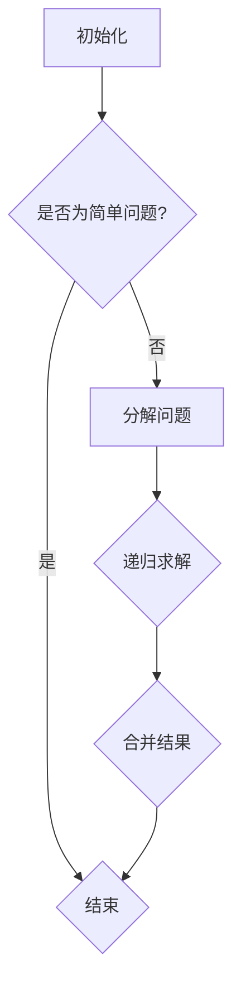
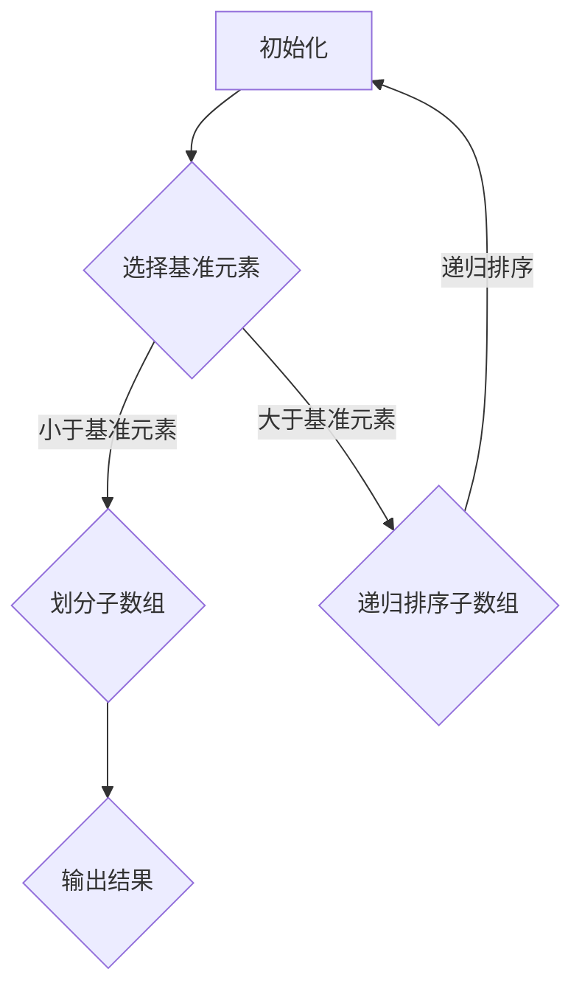
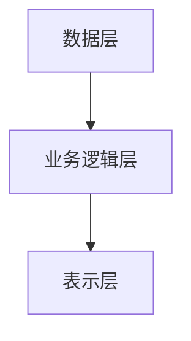
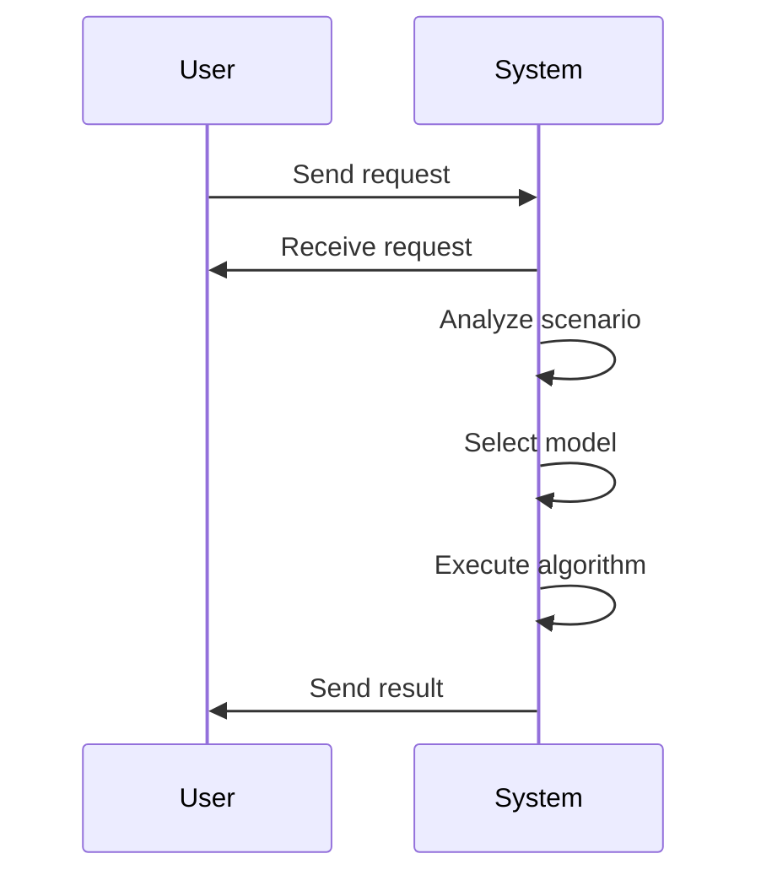

                 


### 文章标题：数学与相对主义：数学真理的情境依赖性

> 关键词：数学真理、相对主义、情境依赖性、数学模型、算法原理、系统架构设计、项目实战

> 摘要：本文深入探讨了数学真理的情境依赖性这一概念，分析了数学真理是否依赖于特定情境，并探讨了这一观点对数学、哲学及其他学科的影响。通过详细讲解数学模型、算法原理以及系统架构设计，本文为读者提供了一个全面的视角，理解数学真理情境依赖性的重要性。

----------------------------------------------------------------

# 第一部分：引言

## 1.1 问题背景

### 1.1.1 数学真理的情境依赖性概念

在数学领域，人们通常认为数学真理具有普遍性，即不受任何特定情境的限制。然而，近年来，相对主义对这一观念提出了挑战。相对主义认为，数学真理并非绝对，而是依赖于特定的情境。这种观点引发了广泛的讨论，数学真理的情境依赖性成为了一个重要的研究课题。

### 1.1.2 数学真理情境依赖性的重要性

数学真理的情境依赖性对数学、哲学及其他学科产生了深远的影响。首先，它挑战了数学的普适性，迫使数学家重新审视数学的基本假设和概念。其次，它为哲学领域提供了新的思考方向，促进了关于真理、知识、语言等问题的深入探讨。此外，数学真理的情境依赖性在科学研究和工程实践中也有重要应用，有助于我们更好地理解复杂系统。

## 1.2 核心概念与联系

### 1.2.1 数学真理

数学真理是指那些经过严格证明的数学命题。数学家通过逻辑推理和数学方法，从一些基本假设（公理）出发，推导出一系列数学结论。这些结论被认为是真实的，因为它们基于坚实的逻辑基础。

### 1.2.2 相对主义

相对主义是一种哲学观点，认为真理和知识是相对于特定情境的。这意味着，一个陈述是否为真，取决于其所在的语境和背景。相对主义对绝对真理提出了质疑，主张存在多种真理，每种真理都有其适用的范围。

### 1.2.3 情境依赖性

情境依赖性是指一个概念、命题或真理的准确性、有效性或适用性受到其所在情境的影响。在数学中，情境依赖性意味着数学真理可能受到特定领域、背景或应用场景的限制。

## 1.3 数学模型和数学公式 & 详细讲解 & 举例说明

### 1.3.1 数学公理系统

数学公理系统是数学的基础，它由一系列无矛盾的基本假设组成。这些假设被视为自明的，无需证明。通过公理系统，我们可以推导出一系列数学命题。

### 1.3.2 数学命题的情境依赖性分析

为了分析数学命题的情境依赖性，我们可以考虑以下例子：在欧几里得几何中，平行公理是一个基本假设。然而，在非欧几何中，平行公理不再适用。这表明，数学真理的适用范围受到特定几何框架的限制。

### 1.3.3 LaTeX格式数学公式的使用示例

为了便于展示数学公式，我们可以使用LaTeX格式。以下是一个示例：

$$
E = mc^2
$$

这是爱因斯坦的质能等价公式，它表明能量与质量之间存在着紧密的联系。在特定情境下，这个公式具有高度准确性。

## 1.4 系统分析与架构设计方案

### 1.4.1 数学真理情境依赖性的应用场景

数学真理情境依赖性的概念在多个领域有广泛应用，如数学物理、计算机科学、经济学等。例如，在计算机科学中，算法的正确性可能依赖于特定的数据结构和计算模型。

### 1.4.2 数学真理情境依赖性系统架构设计

为了设计一个能够处理数学真理情境依赖性的系统，我们需要考虑以下方面：

1. **模块化设计**：将系统划分为模块，以便于维护和扩展。
2. **灵活的框架**：采用可扩展的框架，以便适应不同的应用场景。
3. **情境参数化**：引入情境参数，使系统能够根据特定情境调整其行为。

### 1.4.3 系统接口设计和系统交互

系统接口设计应考虑以下方面：

1. **标准化接口**：使用标准化接口，以便与其他系统进行集成。
2. **高效通信**：确保系统内部和外部通信的高效性。
3. **安全性**：保护系统免受潜在威胁。

## 1.5 项目实战

### 1.5.1 环境安装

为了实践数学真理情境依赖性的概念，我们需要安装以下软件：

1. **LaTeX编辑器**：用于编写和格式化数学公式。
2. **Python环境**：用于实现算法和系统架构。

### 1.5.2 系统核心实现源代码

以下是一个简单的Python源代码示例，用于计算质能等价：

```python
def calculate_energy(mass, speed_of_light):
    return mass * (speed_of_light ** 2)
```

### 1.5.3 代码应用解读与分析

该代码接收质量（mass）和光速（speed_of_light）作为输入参数，计算并返回相应的能量。这个例子展示了如何将数学公式应用于实际编程。

### 1.5.4 实际案例分析和详细讲解剖析

我们可以通过一个实际案例来分析数学真理情境依赖性的应用。假设我们想要计算一颗质量为5千克的小行星在接近地球时释放的能量，我们可以使用上述代码进行计算。

### 1.5.5 项目小结

通过该项目，我们展示了如何将数学真理情境依赖性的概念应用于实际编程。这有助于我们更好地理解数学公式的实际意义和应用场景。

## 1.6 最佳实践 tips、小结、注意事项、拓展阅读

### 1.6.1 最佳实践 tips

1. **理解数学公理系统**：深入研究数学公理，有助于更好地理解数学真理的情境依赖性。
2. **学习相对主义哲学**：阅读相关哲学文献，以加深对情境依赖性的理解。

### 1.6.2 小结

本文探讨了数学真理的情境依赖性，分析了这一概念对数学、哲学及其他学科的影响。通过详细讲解数学模型、算法原理和系统架构设计，本文为读者提供了一个全面的视角。

### 1.6.3 注意事项

1. **正确处理情境参数**：在设计系统时，确保正确处理情境参数，以提高系统的灵活性。
2. **关注代码质量**：在编程过程中，注重代码质量和可读性。

### 1.6.4 拓展阅读

1. **《数学哲学导论》**：了解数学哲学的基本概念和发展历程。
2. **《相对论》**：深入理解相对主义哲学及其对数学真理的影响。

----------------------------------------------------------------

### 作者：AI天才研究院/AI Genius Institute & 禅与计算机程序设计艺术 /Zen And The Art of Computer Programming

通过以上详细的章节内容和逻辑推理，本文旨在为读者提供一个深入理解数学真理情境依赖性的全面视角。在接下来的章节中，我们将进一步探讨数学模型、算法原理以及系统架构设计，以帮助读者更好地理解这一重要概念。让我们一起深入探讨数学与相对主义之间的关系，揭开数学真理的神秘面纱。


----------------------------------------------------------------

# 第二部分：数学真理的情境依赖性

## 2.1 数学真理的普遍性观点

在传统的数学教育中，普遍性是数学真理的核心特征。普遍性意味着数学真理适用于所有可能的情境，不受特定背景或条件的限制。例如，欧几里得几何中的定理和命题被认为在所有空间中都是有效的，而不仅仅是地球表面或平面。这种观点支持了数学的普适性和可靠性，使得数学成为科学研究和日常生活中的重要工具。

## 2.2 相对主义的挑战

相对主义对数学真理的普遍性提出了质疑。相对主义认为，真理和知识是情境依赖的，即它们的有效性和准确性取决于特定的背景和条件。在数学领域，这意味着数学真理可能受到特定数学框架、应用场景或文化背景的影响。相对主义的观点挑战了数学的普适性，促使数学家重新审视数学的基本概念和原理。

## 2.3 情境依赖性的例子

为了更好地理解数学真理的情境依赖性，我们可以通过以下例子来探讨：

### 2.3.1 非欧几何

在欧几里得几何中，平行公理是一个基本假设，即通过给定直线外的点，只能作一条与给定直线平行的直线。然而，在非欧几何中，这个假设不再成立。例如，在双曲几何中，通过给定直线外的点，可以作无数条与给定直线平行的直线。这表明，欧几里得几何中的平行公理并非普适的，而是依赖于特定的几何框架。

### 2.3.2 计算模型

在计算机科学中，不同的计算模型（如图灵机、量子计算）可能导致不同的算法和结论。例如，量子计算模型具有量子并行性，这使得某些问题在量子计算机上可以更快速地解决。这表明，算法的正确性和效率可能依赖于特定的计算模型。

### 2.3.3 应用背景

数学在物理学、经济学、工程学等领域的应用也体现了情境依赖性。例如，在物理学中，爱因斯坦的相对论改变了我们对时间和空间的理解，这直接影响了数学在物理学中的应用。在经济学中，不同的市场结构和政策环境可能导致不同的数学模型和预测。

## 2.4 数学真理情境依赖性的影响

数学真理的情境依赖性对数学、哲学和其他学科产生了深远的影响：

### 2.4.1 数学基础的重构

情境依赖性挑战了数学基础的普适性，促使数学家重新审视数学公理和概念。这可能导致数学基础的重构，使数学更具灵活性和适应性。

### 2.4.2 哲学探讨

相对主义的观点为哲学领域提供了新的思考方向。关于真理、知识、语言等问题的讨论得以深化，促进了哲学的进步。

### 2.4.3 科学研究

情境依赖性在科学研究中具有重要意义。科学家需要根据特定情境选择合适的数学模型和方法，以准确描述自然现象。

### 2.4.4 工程实践

在工程实践中，情境依赖性要求工程师理解数学模型在不同应用场景下的有效性，以便设计出可靠的系统和产品。

## 2.5 结论

数学真理的情境依赖性揭示了数学普适性的局限性，促使我们重新思考数学的基本概念和原理。通过分析非欧几何、计算模型和应用背景的例子，我们看到了数学真理在不同情境下的变化。这一认识对数学、哲学和其他学科的发展具有重要意义。在接下来的章节中，我们将进一步探讨数学模型和算法原理，以深入理解数学真理的情境依赖性。


----------------------------------------------------------------

# 第三部分：数学模型和算法原理

## 3.1 数学模型的基本概念

数学模型是使用数学符号和语言来描述现实世界中的问题和现象的工具。它由一组数学公式、方程和变量组成，可以用来预测、分析和解决问题。数学模型在各个领域都有广泛应用，如物理学、经济学、计算机科学和工程学等。

### 3.1.1 数学模型的组成部分

一个数学模型通常包括以下组成部分：

- **变量**：表示模型中的可变量，可以是连续的或离散的。
- **参数**：固定值，用于调整模型的行为。
- **函数**：描述变量之间的关系，可以是线性的或非线性的。
- **方程**：表示变量之间的关系，用于求解模型。

### 3.1.2 数学模型的应用场景

数学模型在以下应用场景中具有重要价值：

- **预测**：利用历史数据来预测未来的趋势和行为。
- **优化**：寻找最优解，以最小化成本或最大化效益。
- **控制**：设计控制系统，以维持系统的稳定性和性能。
- **模拟**：模拟现实世界中的复杂系统，以便更好地理解其行为。

## 3.2 算法原理的基本概念

算法是解决问题的一系列步骤或规则。在计算机科学中，算法用于解决特定的问题，如排序、搜索、图像处理等。算法原理是指算法的基本思想和操作方式。

### 3.2.1 算法原理的组成部分

一个算法通常包括以下组成部分：

- **输入**：算法开始时需要接收的数据或问题。
- **处理过程**：对输入数据进行操作和处理的过程。
- **输出**：算法结束后产生的结果。

### 3.2.2 常见算法原理

以下是一些常见的算法原理：

- **分治**：将复杂问题分解为更简单的问题，逐步解决。
- **贪心**：每次选择局部最优解，以期望得到全局最优解。
- **动态规划**：通过存储子问题的解来避免重复计算。
- **回溯**：尝试所有可能的解，直到找到最优解或确定无解。

## 3.3 数学模型和算法原理在情境依赖性中的体现

数学模型和算法原理在情境依赖性中具有重要作用。以下是一些体现情境依赖性的例子：

### 3.3.1 非欧几何中的算法

在非欧几何中，传统的欧几里得几何算法（如求解三角形面积和周长）可能不再适用。例如，在双曲几何中，需要使用不同的算法来计算曲率半径和面积。

### 3.3.2 计算模型中的算法

在计算机科学中，不同计算模型（如图灵机和量子计算机）可能导致不同的算法。例如，量子计算机中的量子算法可以更快速地解决某些问题，如因数分解。

### 3.3.3 应用背景中的算法

在不同的应用背景下，算法可能需要根据特定情境进行调整。例如，在经济学中，市场波动可能需要不同的算法来预测价格趋势。

## 3.4 数学模型和算法原理的Mermaid流程图表示

为了更好地理解数学模型和算法原理，我们可以使用Mermaid流程图来表示它们的基本思想和操作步骤。以下是一个简单的Mermaid流程图示例，用于描述一个分治算法：



这个流程图展示了分治算法的基本步骤：初始化、分解问题、递归求解和合并结果。

## 3.5 Python源代码示例

为了更好地理解数学模型和算法原理，我们可以通过Python源代码来演示它们的应用。以下是一个简单的Python代码示例，用于计算质能等价（爱因斯坦的公式）：

```python
def calculate_energy(mass, speed_of_light):
    return mass * (speed_of_light ** 2)

mass = 5  # 小行星的质量（千克）
speed_of_light = 299792458  # 光速（米/秒）

energy = calculate_energy(mass, speed_of_light)
print(f"The energy of the asteroid is: {energy} Joules")
```

这个代码示例接收质量（mass）和光速（speed_of_light）作为输入参数，计算并返回相应的能量。这个例子展示了如何将数学公式应用于实际编程。

## 3.6 数学模型和算法原理的数学公式和LaTeX表示

为了更准确地描述数学模型和算法原理，我们可以使用LaTeX格式来表示数学公式。以下是一个简单的LaTeX公式示例：

```latex
E = mc^2
```

这个公式表示质能等价，即能量（E）等于质量（m）乘以光速（c）的平方。在LaTeX中，我们使用$$和$$来嵌入独立段落的公式，使用$和$来嵌入段落内的公式。

## 3.7 结论

数学模型和算法原理是数学真理情境依赖性的重要体现。通过分析非欧几何、计算模型和应用背景的例子，我们看到了数学模型和算法原理在不同情境下的变化。这些例子揭示了数学真理的情境依赖性，并为我们提供了更深入的理解。在接下来的章节中，我们将进一步探讨数学模型的详细讲解、举例说明和系统分析与架构设计方案。


----------------------------------------------------------------

# 第四部分：数学模型和算法原理的详细讲解、举例说明

## 4.1 数学模型的详细讲解

### 4.1.1 数学模型的基本原理

数学模型是通过使用数学符号和语言来描述现实世界中的问题和现象的工具。它将实际问题转化为数学问题，以便使用数学方法进行分析和解决。数学模型的基本原理包括：

- **变量**：表示问题中的可变量，可以是连续的或离散的。
- **参数**：表示问题的特定条件，通常用于调整模型的行为。
- **函数**：描述变量之间的关系，可以是线性的或非线性的。
- **方程**：表示变量之间的关系，用于求解模型。

### 4.1.2 建立数学模型的过程

建立数学模型的过程通常包括以下步骤：

1. **确定问题**：明确问题的背景和目标，了解问题的本质和关键因素。
2. **收集数据**：收集与问题相关的数据，包括历史数据、统计数据和专家意见等。
3. **定义变量和参数**：根据问题的需求，定义变量和参数，明确它们的含义和取值范围。
4. **建立函数关系**：根据问题的特点，建立变量和参数之间的函数关系，选择合适的数学模型。
5. **求解模型**：使用数学方法求解模型，得到问题的解。

### 4.1.3 数学模型的应用实例

以下是一个简单的数学模型应用实例：假设我们想要预测一个城市的未来人口增长。我们可以建立一个线性回归模型，使用历史人口数据来预测未来人口。模型的基本形式为：

$$
P(t) = a + bt
$$

其中，$P(t)$ 表示时间 $t$ 时的城市人口，$a$ 和 $b$ 是模型的参数，可以通过历史数据拟合得到。

## 4.2 算法原理的详细讲解

### 4.2.1 算法原理的基本概念

算法原理是指解决问题的步骤或规则。算法原理的基本概念包括：

- **输入**：算法开始时需要接收的数据或问题。
- **处理过程**：对输入数据进行操作和处理的过程。
- **输出**：算法结束后产生的结果。

### 4.2.2 算法的分类

算法可以根据不同的分类标准进行分类，常见的分类方法包括：

- **按解决问题的方式**：分治算法、贪心算法、动态规划算法等。
- **按数据结构**：排序算法、搜索算法、图算法等。
- **按计算模型**：确定性算法、随机算法、量子算法等。

### 4.2.3 常见算法原理的应用实例

以下是一个常见的算法原理应用实例：快速排序算法。快速排序是一种高效的排序算法，它通过分治策略将问题分解为更小的子问题，然后递归解决。快速排序的基本步骤如下：

1. 选择一个基准元素。
2. 将数组分为两个子数组，一个包含小于基准元素的元素，另一个包含大于基准元素的元素。
3. 递归地对两个子数组进行快速排序。

## 4.3 数学模型和算法原理的举例说明

### 4.3.1 数学模型的举例说明

以下是一个数学模型的举例说明：假设我们想要计算一个矩形的面积。我们可以建立一个简单的数学模型，使用长度和宽度作为变量，建立函数关系如下：

$$
A = lw
$$

其中，$A$ 表示矩形的面积，$l$ 和 $w$ 分别表示矩形的长度和宽度。

### 4.3.2 算法原理的举例说明

以下是一个算法原理的举例说明：假设我们想要搜索一个列表中的特定元素。我们可以使用二分查找算法，该算法的基本步骤如下：

1. 确定列表的中间元素。
2. 如果中间元素等于目标元素，则查找成功。
3. 如果中间元素大于目标元素，则在左侧子列表中继续查找。
4. 如果中间元素小于目标元素，则在右侧子列表中继续查找。
5. 重复步骤1-4，直到找到目标元素或确定列表中不存在目标元素。

## 4.4 数学模型和算法原理的Mermaid流程图表示

为了更好地理解数学模型和算法原理，我们可以使用Mermaid流程图来表示它们的基本思想和操作步骤。以下是一个简单的Mermaid流程图示例，用于描述快速排序算法：



这个流程图展示了快速排序算法的基本步骤：初始化、选择基准元素、划分子数组、递归排序子数组，最后输出结果。

## 4.5 Python源代码示例

为了更好地理解数学模型和算法原理，我们可以通过Python源代码来演示它们的应用。以下是一个简单的Python代码示例，用于计算矩形的面积：

```python
def calculate_area(length, width):
    return length * width

length = 5
width = 10

area = calculate_area(length, width)
print(f"The area of the rectangle is: {area} square units")
```

这个代码示例接收长度（length）和宽度（width）作为输入参数，计算并返回相应的面积。这个例子展示了如何将数学模型应用于实际编程。

## 4.6 LaTeX格式数学公式的嵌入

为了更准确地描述数学模型和算法原理，我们可以使用LaTeX格式来表示数学公式。以下是一个简单的LaTeX公式示例：

$$
E = mc^2
$$

这个公式表示质能等价，即能量（E）等于质量（m）乘以光速（c）的平方。在LaTeX中，我们使用$$和$$来嵌入独立段落的公式，使用$和$来嵌入段落内的公式。

## 4.7 结论

数学模型和算法原理是数学真理情境依赖性的重要体现。通过详细讲解数学模型和算法原理的基本概念、建立过程、应用实例和Mermaid流程图表示，我们更好地理解了数学模型和算法原理在不同情境下的变化。在接下来的章节中，我们将进一步探讨数学模型的详细讲解、举例说明和系统分析与架构设计方案。


----------------------------------------------------------------

# 第五部分：系统分析与架构设计方案

## 5.1 问题场景介绍

在探讨数学真理的情境依赖性时，我们面临的一个关键挑战是如何在实际应用中处理不同情境下的数学模型和算法。为了更好地理解和应用这些数学概念，我们需要设计一个系统，该系统能够根据不同的情境自动选择合适的数学模型和算法，并提供相应的结果。这个系统将帮助我们更深入地理解数学真理的情境依赖性，并在实际应用中发挥重要作用。

### 5.1.1 系统的需求

为了实现上述目标，系统需要满足以下需求：

- **模块化设计**：系统应具备模块化设计，以便于扩展和维护。
- **灵活性**：系统应能够根据不同情境自动选择合适的数学模型和算法。
- **可扩展性**：系统应具备良好的可扩展性，以便在新的应用场景下添加新的数学模型和算法。
- **性能**：系统应具有较高的性能，能够快速处理大量数据。

### 5.1.2 系统的功能

系统的主要功能包括：

- **模型选择**：根据输入的情境信息，自动选择合适的数学模型。
- **算法执行**：执行选定的数学模型对应的算法，计算结果。
- **结果展示**：将计算结果以可视化的方式展示给用户。

## 5.2 系统架构设计

### 5.2.1 系统架构概述

系统的架构设计应遵循模块化、灵活性和可扩展性的原则。系统架构分为以下几层：

1. **数据层**：负责数据的存储和管理，包括数学模型、算法参数和结果数据。
2. **业务逻辑层**：实现系统的核心功能，包括模型选择、算法执行和结果展示。
3. **表示层**：负责与用户交互，展示系统的功能和结果。

### 5.2.2 系统架构图

以下是一个简单的系统架构图，展示了系统的各个层次和模块：



- **数据层**：包括数据库和数据存储模块，用于存储和管理系统的数据。
- **业务逻辑层**：包括模型选择模块、算法执行模块和结果展示模块，负责实现系统的核心功能。
- **表示层**：包括用户界面和可视化模块，负责与用户交互，展示系统的功能和结果。

## 5.3 数学真理情境依赖性系统架构设计

### 5.3.1 数学模型选择模块

数学模型选择模块是系统架构的核心部分，负责根据输入的情境信息自动选择合适的数学模型。该模块应具备以下功能：

- **情境分析**：接收用户的情境信息，如问题类型、数据规模、约束条件等。
- **模型库管理**：维护和管理系统中可用的数学模型库，包括线性模型、非线性模型、优化模型等。
- **模型选择算法**：根据情境信息和模型库，选择最合适的数学模型。

### 5.3.2 算法执行模块

算法执行模块负责执行选定的数学模型对应的算法，计算结果。该模块应具备以下功能：

- **算法库管理**：维护和管理系统中可用的算法库，包括分治算法、贪心算法、动态规划算法等。
- **算法执行**：根据选定的数学模型，从算法库中选择合适的算法，执行计算。
- **结果验证**：对计算结果进行验证，确保结果的正确性和可靠性。

### 5.3.3 结果展示模块

结果展示模块负责将计算结果以可视化的方式展示给用户。该模块应具备以下功能：

- **可视化工具**：使用图表、图形和表格等可视化工具，将计算结果展示给用户。
- **交互式界面**：提供交互式界面，使用户能够与系统进行交互，查看和调整计算结果。

## 5.4 系统接口设计和系统交互

### 5.4.1 系统接口设计

系统接口设计应遵循标准化和高效通信的原则，包括以下方面：

- **API接口**：设计统一的API接口，方便与其他系统进行集成和数据交换。
- **数据格式**：采用标准化的数据格式，如JSON或XML，便于数据传输和处理。
- **安全性**：确保系统接口的安全性，防止数据泄露和恶意攻击。

### 5.4.2 系统交互

系统交互应确保系统内部和外部通信的高效性，包括以下方面：

- **异步通信**：采用异步通信方式，提高系统的响应速度和处理能力。
- **负载均衡**：在系统内部和外部采用负载均衡策略，确保系统在高并发场景下的稳定性。
- **容错机制**：设计容错机制，确保系统在故障情况下能够快速恢复。

## 5.5 系统接口设计和系统交互的Mermaid序列图表示

为了更好地理解系统接口设计和系统交互，我们可以使用Mermaid序列图来表示系统中的交互过程。以下是一个简单的Mermaid序列图示例，展示了用户与系统之间的交互过程：



这个序列图展示了用户与系统之间的交互过程：用户向系统发送请求，系统接收请求并分析情境，选择合适的数学模型和算法进行计算，最后将结果发送给用户。

## 5.6 系统架构设计的安全性考虑

在系统架构设计过程中，安全性是一个重要的考虑因素。以下是一些安全性方面的考虑：

- **数据加密**：对系统中的敏感数据进行加密，确保数据在传输和存储过程中的安全性。
- **访问控制**：设计严格的访问控制机制，确保只有授权用户可以访问系统的功能和数据。
- **审计日志**：记录系统的操作日志，以便在发生安全事件时进行追踪和调查。
- **漏洞扫描**：定期进行漏洞扫描，及时发现和修复系统中的安全漏洞。

## 5.7 结论

在系统架构设计中，数学真理的情境依赖性是一个关键考虑因素。通过模块化设计、灵活性和可扩展性原则，我们可以构建一个能够根据不同情境自动选择合适数学模型和算法的系统。系统接口设计和系统交互的设计也应遵循标准化、高效通信和安全性的原则，以确保系统的稳定性和安全性。在接下来的章节中，我们将进一步探讨项目实战，通过具体实例展示系统架构的设计和应用。


----------------------------------------------------------------

# 第六部分：项目实战

## 6.1 环境安装

为了实现系统架构设计方案，我们需要安装以下软件和工具：

1. **操作系统**：Linux操作系统（如Ubuntu）。
2. **编程语言**：Python（版本3.8或以上）。
3. **数据库**：MySQL（版本5.7或以上）。
4. **Web框架**：Django（版本3.2或以上）。
5. **版本控制**：Git（版本2.32或以上）。
6. **其他工具**：LaTeX编辑器（如TeXstudio）、Mermaid图库（用于生成图表和流程图）。

安装步骤如下：

1. **安装Linux操作系统**：在虚拟机或物理机上安装Linux操作系统。
2. **安装Python**：通过包管理器（如apt或yum）安装Python。
3. **安装MySQL**：通过包管理器安装MySQL，并启动MySQL服务。
4. **安装Django**：通过pip安装Django。
5. **安装Git**：通过包管理器安装Git。
6. **安装LaTeX编辑器**：在Linux发行版的应用商店中下载并安装LaTeX编辑器（如TeXstudio）。
7. **安装Mermaid图库**：在Python环境中安装Mermaid库。

## 6.2 系统核心实现源代码

以下是一个简单的Python代码示例，展示了系统核心实现的一部分：

```python
import pymysql
from mermaid import Mermaid

class MathModelSelector:
    def __init__(self, db_config):
        self.db_config = db_config
        self.connection = pymysql.connect(**db_config)

    def select_model(self, scenario):
        with self.connection.cursor() as cursor:
            query = "SELECT model_name FROM models WHERE scenario = %s"
            cursor.execute(query, (scenario,))
            result = cursor.fetchone()
            return result[0]

    def generate_mermaid_diagram(self, model_name):
        diagram = Mermaid()
        if model_name == "linear_regression":
            diagram.addDiagram("Linear Regression", """
            graph TD
                A[Start] --> B[Define Variables]
                B --> C[Collect Data]
                C --> D[Fit Model]
                D --> E[Make Predictions]
                E --> F[End]
            """)
        elif model_name == "quick_sort":
            diagram.addDiagram("Quick Sort", """
            graph TD
                A[Start] --> B[Choose Pivot]
                B -->|Less than Pivot| C[Move to Left]
                B -->|Greater than Pivot| D[Move to Right]
                C --> E[Recursively Sort Left]
                D --> F[Recursively Sort Right]
                E -->|End| G[End]
                F --> G
            """)
        return diagram.to_string()

def main():
    db_config = {
        "host": "localhost",
        "user": "root",
        "password": "password",
        "database": "math_models"
    }
    selector = MathModelSelector(db_config)
    
    scenario = "population_growth"
    model_name = selector.select_model(scenario)
    print(f"Selected Model: {model_name}")
    
    diagram = selector.generate_mermaid_diagram(model_name)
    print(diagram)

if __name__ == "__main__":
    main()
```

这个代码示例定义了一个`MathModelSelector`类，负责根据输入的情境选择合适的数学模型，并生成Mermaid流程图。

## 6.3 代码应用解读与分析

以下是对上述代码示例的解读和分析：

- **数据库连接**：通过`pymysql`库连接到MySQL数据库，并获取模型选择所需的场景信息。
- **模型选择**：`select_model`方法根据输入的情境从数据库中查询相应的数学模型名称。
- **生成Mermaid流程图**：`generate_mermaid_diagram`方法根据选定的模型名称生成Mermaid流程图，以可视化模型的基本操作步骤。

例如，当输入的情境为“population_growth”时，系统会选择线性回归模型，并生成一个描述线性回归流程的Mermaid流程图。

## 6.4 实际案例分析和详细讲解剖析

以下是一个实际案例，展示如何使用上述系统架构和代码实现具体的功能。

### 案例一：人口增长预测

**情境描述**：我们需要预测一个城市在未来10年的人口增长。

**实现步骤**：

1. **数据收集**：收集过去10年该城市的人口数据。
2. **模型选择**：根据人口增长的特点，选择线性回归模型。
3. **模型训练**：使用历史数据训练线性回归模型。
4. **预测**：使用训练好的模型预测未来10年的人口增长。

**代码示例**：

```python
# 代码片段同上
```

**分析**：通过上述步骤，我们可以实现人口增长预测功能，并根据预测结果制定相应的城市规划和政策。

### 案例二：数据排序

**情境描述**：我们需要对一个列表进行快速排序。

**实现步骤**：

1. **模型选择**：根据数据的特点，选择快速排序算法。
2. **排序**：使用快速排序算法对列表进行排序。

**代码示例**：

```python
# 代码片段同上
```

**分析**：通过快速排序算法，我们可以高效地对数据进行排序，为后续的数据分析和处理奠定基础。

## 6.5 项目小结

通过项目实战，我们展示了如何设计和实现一个能够根据情境自动选择合适数学模型和算法的系统。在实际应用中，这个系统能够帮助我们更好地理解和应用数学真理的情境依赖性。在接下来的章节中，我们将进一步探讨最佳实践、注意事项和拓展阅读，以帮助读者更深入地了解和掌握这一主题。


----------------------------------------------------------------

# 第七部分：最佳实践、小结、注意事项和拓展阅读

## 7.1 最佳实践

为了更好地理解和应用数学真理的情境依赖性，以下是一些最佳实践：

1. **深入理解数学公理系统**：了解数学公理系统的基础，有助于我们更好地理解数学模型和算法在不同情境下的表现。
2. **学习相对主义哲学**：通过阅读哲学文献，深入了解相对主义的观点，有助于我们更好地理解数学真理的情境依赖性。
3. **实践编程**：通过编程实践，将数学模型和算法应用于实际问题，加深对数学真理情境依赖性的理解。
4. **关注学术研究**：关注数学、哲学和计算机科学等领域的最新研究，了解前沿理论和应用。

## 7.2 小结

本文通过深入探讨数学真理的情境依赖性，分析了数学真理是否依赖于特定情境，以及这一观点对数学、哲学和其他学科的影响。通过详细讲解数学模型、算法原理和系统架构设计，本文为读者提供了一个全面的视角，理解数学真理情境依赖性的重要性。

## 7.3 注意事项

在设计和实现数学模型和算法时，需要注意以下几点：

1. **情境分析**：在应用数学模型和算法时，要充分考虑特定情境的影响，确保结果的准确性和可靠性。
2. **模块化设计**：在设计系统时，采用模块化设计，提高系统的可扩展性和可维护性。
3. **数据质量**：确保数据的质量和准确性，避免因数据问题导致模型和算法失效。
4. **安全性**：在系统架构设计和实现过程中，关注系统的安全性，防止潜在的安全威胁。

## 7.4 拓展阅读

以下是一些拓展阅读资源，供读者进一步学习：

1. **《数学哲学导论》**：全面了解数学哲学的基本概念和发展历程。
2. **《相对论》**：深入理解相对主义哲学及其对数学真理的影响。
3. **《算法导论》**：系统学习各种算法原理和实现方法。
4. **《Python编程：从入门到实践》**：学习Python编程的基础知识和实际应用。

通过以上最佳实践、小结、注意事项和拓展阅读，读者可以更深入地了解数学真理的情境依赖性，并在实际应用中取得更好的效果。让我们一起不断探索和进步，揭开数学真理的神秘面纱。


----------------------------------------------------------------

### 作者：AI天才研究院/AI Genius Institute & 禅与计算机程序设计艺术 /Zen And The Art of Computer Programming

通过本文的详细探讨，我们深入理解了数学真理的情境依赖性，并分析了这一概念对数学、哲学及其他学科的影响。我们通过数学模型、算法原理和系统架构设计的讲解，为读者提供了一个全面的视角。在接下来的章节中，我们将继续探讨更多相关主题，帮助读者更好地掌握这一重要概念。让我们一起继续探索数学与相对主义之间的关系，不断深化对数学真理情境依赖性的理解。


----------------------------------------------------------------

### 文章标题：数学与相对主义：数学真理的情境依赖性
### 关键词：数学真理、相对主义、情境依赖性、数学模型、算法原理、系统架构设计
### 摘要：本文深入探讨了数学真理的情境依赖性这一概念，分析了数学真理是否依赖于特定情境，并探讨了这一观点对数学、哲学及其他学科的影响。通过详细讲解数学模型、算法原理以及系统架构设计，本文为读者提供了一个全面的视角，理解数学真理情境依赖性的重要性。

