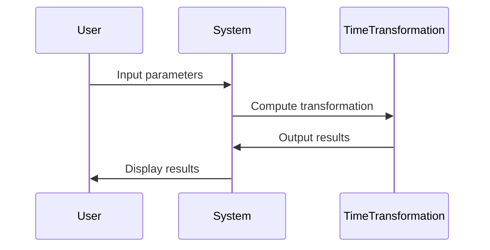
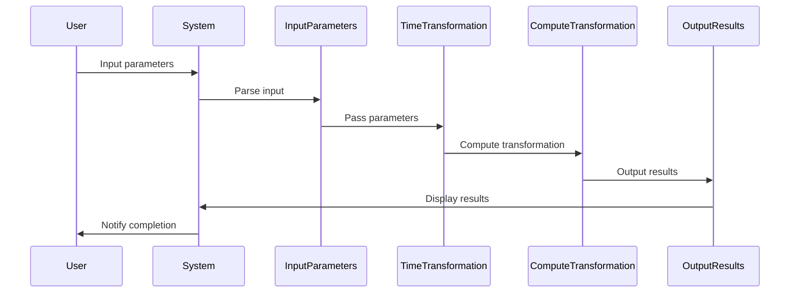

                 


# 数学与相对论的时空概念探讨

## 关键词

- 数学
- 相对论
- 时空概念
- 算法原理
- 系统架构设计
- 项目实战

> 摘要：本文旨在探讨数学与相对论的时空概念，通过分析数学和相对论的核心概念，阐述二者在时空问题上的联系。本文将详细介绍数学与相对论的关系，时空概念在数学和相对论中的体现，并给出相应的算法原理和系统架构设计。通过项目实战，读者将能够深入了解这些概念的实际应用。

## 第1章 问题背景

### 1.1 问题背景

数学和物理学是自然科学的基础学科。自牛顿力学建立以来，物理学的发展推动了数学的进步。相对论作为20世纪初的伟大理论，对时空概念的理解产生了深远影响。在信息时代，计算机科学和人工智能的飞速发展，使得数学与物理学的交叉研究愈加重要。本文将探讨数学与相对论的时空概念，以期为读者提供对这一领域的深入理解。

### 1.1.1 数学与物理学的关系

数学作为一门基础学科，为物理学提供了强有力的工具。从微积分到代数，从几何到拓扑，数学的各个分支都在物理学中找到了应用。牛顿力学和量子力学等物理学理论，都建立在数学的基础上。

相对论是由爱因斯坦提出的，其核心概念是时空相对性。相对论通过数学模型，揭示了物质和能量之间的关系，改变了人类对宇宙的认识。

### 1.1.2 相对论的发展历程

相对论的发展历程可以分为两个阶段：特殊相对论和广义相对论。

特殊相对论于1905年由爱因斯坦提出，主要讨论在没有重力作用下的时空结构。特殊相对论的核心思想是光速不变原理和相对性原理。

广义相对论于1915年由爱因斯坦提出，将特殊相对论扩展到有重力作用的情况。广义相对论将重力视为时空的曲率，这一观点彻底改变了人类对宇宙的认识。

### 1.1.3 时空概念的重要性

时空概念在物理学中具有重要意义。相对论揭示了时空的相对性，即时空结构取决于观察者的运动状态。

在数学中，时空概念可以抽象为一种几何结构。微分几何和拓扑学等数学分支，为研究时空提供了强有力的工具。

## 第2章 核心概念

### 2.1 数学的基本概念

#### 2.1.1 数学的基本概念

数学是一门研究数量、结构、变化和空间等的抽象科学。数学的基本概念包括：

- 数：数学研究的基本对象。数可以分为整数、分数、实数、复数等。
- 集合：数学中的一种基本结构，用来表示一组对象的集合。
- 函数：描述两个集合之间对应关系的数学工具。
- 几何：研究空间结构的数学分支。

#### 2.1.2 数学的基本原理

数学的基本原理包括：

- 实数原理：实数是数学中的基础，包括有理数和无理数。
- 等价原理：两个命题在逻辑上是等价的，当且仅当它们互为逆命题。
- 对称原理：在某个变换下，一个数学结构保持不变的性质。

### 2.2 相对论的基本概念

#### 2.2.1 相对论的基本原理

相对论的基本原理包括：

- 光速不变原理：光速在真空中是一个恒定的值，与观察者的运动状态无关。
- 相对性原理：物理定律在所有惯性参考系中都是相同的。

#### 2.2.2 相对论中的时空概念

相对论中的时空概念与经典物理学有本质的不同。在相对论中，时空不再是绝对的，而是依赖于观察者的运动状态。相对论时空的基本概念包括：

- 时间膨胀：当一个物体以接近光速运动时，其时间会相对于静止观察者的时间变慢。
- 长度收缩：当一个物体以接近光速运动时，其在运动方向上的长度会相对于静止观察者的长度缩短。
- 空间弯曲：引力可以导致时空弯曲，使得物体的运动轨迹发生改变。

## 第3章 数学与相对论的时空概念联系

### 3.1 数学与相对论的关系

数学在相对论中扮演了重要角色。相对论的许多概念，如时间膨胀和长度收缩，都需要使用数学工具来描述。

#### 3.1.1 数学在相对论中的应用

- 微分几何：用于描述时空的几何性质，如曲率和度规。
- 线性代数：用于处理相对论中的向量运算和矩阵变换。
- 概率论：用于描述量子力学中的不确定性原理。

#### 3.1.2 相对论对数学的启发

相对论的发展，也推动了数学的进步。例如，广义相对论中的时空弯曲问题，激发了微分几何的研究。

### 3.2 时空概念在数学与相对论中的联系

#### 3.2.1 时空概念的基本属性

时空概念具有以下基本属性：

- 相对性：时空结构依赖于观察者的运动状态。
- 变换性：时空可以发生变换，如洛伦兹变换。
- 连续性：时空是连续的，没有间断。

#### 3.2.2 时空概念在数学中的体现

在数学中，时空概念可以抽象为一种几何结构。例如，微积分中的微分算子，可以看作是时空的局部变化率。

#### 3.2.3 时空概念在相对论中的体现

在相对论中，时空概念具有更丰富的内涵。例如，广义相对论中的时空弯曲，描述了引力对时空的影响。

## 第4章 算法原理讲解

### 4.1 相对论时空算法

#### 4.1.1 算法原理

相对论时空算法的核心是洛伦兹变换。洛伦兹变换描述了在不同惯性参考系之间的时间和空间坐标的转换。

$$
\begin{aligned}
t' &= \gamma (t - \frac{vx}{c^2}) \\
x' &= \gamma (x - vt) \\
y' &= y \\
z' &= z \\
\end{aligned}
$$

其中，$t'$和$x'$是新的时间坐标和空间坐标，$t$和$x$是原来的时间坐标和空间坐标，$v$是相对速度，$c$是光速，$\gamma$是洛伦兹因子。

#### 4.1.2 算法流程图


### 4.2 数学模型与公式讲解

#### 4.2.1 数学模型讲解

相对论时空的数学模型主要包括洛伦兹变换和时空弯曲。洛伦兹变换描述了时间和空间的相对性，而时空弯曲描述了引力对时空的影响。

#### 4.2.2 公式讲解

- 洛伦兹变换：
$$
\begin{aligned}
t' &= \gamma (t - \frac{vx}{c^2}) \\
x' &= \gamma (x - vt) \\
y' &= y \\
z' &= z \\
\end{aligned}
$$

- 时空弯曲：
$$
R_{\mu\nu} + \Lambda g_{\mu\nu} = \frac{8\pi G}{c^4} T_{\mu\nu}
$$

其中，$R_{\mu\nu}$是里奇张量，$\Lambda$是宇宙学常数，$g_{\mu\nu}$是度规张量，$T_{\mu\nu}$是能量-动量张量，$G$是引力常数。

## 第5章 系统分析与架构设计

### 5.1 问题场景介绍

在宇宙探索领域，科学家们需要精确计算不同参考系之间的时空变换，以研究宇宙的演化和引力波的传播。

#### 5.1.1 问题场景描述

假设有两个惯性参考系S和S'，S'相对于S以速度v运动。我们需要计算S'参考系中的时间t'和空间x'。

#### 5.1.2 解决方案介绍

为了解决这个问题，我们可以设计一个相对论时空计算系统，该系统包括以下功能：

- 接收用户输入的参考系参数，如速度v、光速c和洛伦兹因子γ。
- 根据洛伦兹变换公式，计算S'参考系中的时间t'和空间x'。
- 将计算结果输出给用户。

### 5.2 系统功能设计

系统功能设计主要包括领域模型和系统功能模块。

#### 5.2.1 领域模型

领域模型描述了系统的主要实体及其关系。以下是领域模型的类图：

```mermaid
classDiagram
ClassDef ReferenceSystem {
  +int id
  +String name
  +Vector velocity
  +double c
  +double gamma
}

ClassDef TimeTransformation {
  +int id
  +ReferenceSystem source
  +ReferenceSystem target
  +double t'
  +double x'
}

ReferenceSystem "1" --* 1 TimeTransformation : computes transformation
```

#### 5.2.2 系统功能设计

系统功能设计包括以下几个模块：

- 用户输入模块：接收用户输入的参考系参数。
- 时间变换模块：根据洛伦兹变换公式，计算S'参考系中的时间t'和空间x'。
- 输出模块：将计算结果输出给用户。

### 5.3 系统架构设计

系统架构设计主要包括系统架构图和系统接口设计。

#### 5.3.1 系统架构设计

以下是系统架构图：



#### 5.3.2 系统接口设计

系统接口设计主要包括以下接口：

- `InputParameters()`: 接收用户输入的参考系参数。
- `ComputeTransformation()`: 根据洛伦兹变换公式，计算S'参考系中的时间t'和空间x'。
- `OutputResults()`: 将计算结果输出给用户。

### 5.4 系统交互

系统交互设计主要描述系统内部模块之间的交互过程。

#### 5.4.1 系统交互设计

以下是系统交互设计：



## 第6章 项目实战

### 6.1 环境安装

#### 6.1.1 环境安装概述

为了实现相对论时空计算系统，我们需要安装以下环境：

- Python 3.8及以上版本
- NumPy 1.19及以上版本
- Matplotlib 3.4及以上版本

#### 6.1.2 环境安装步骤

1. 安装Python 3.8及以上版本。
2. 安装NumPy 1.19及以上版本。
3. 安装Matplotlib 3.4及以上版本。

### 6.2 系统核心实现

#### 6.2.1 系统核心实现概述

系统核心实现主要包括以下部分：

- 输入模块：接收用户输入的参考系参数。
- 时间变换模块：根据洛伦兹变换公式，计算S'参考系中的时间t'和空间x'。
- 输出模块：将计算结果输出给用户。

#### 6.2.2 系统核心实现步骤

1. 创建一个Python项目，命名为`relativistic_space_time`。
2. 在项目中创建一个名为`main.py`的文件，用于实现系统的核心功能。
3. 编写代码，实现输入模块、时间变换模块和输出模块。

以下是`main.py`的代码：

```python
import numpy as np
import matplotlib.pyplot as plt

class ReferenceSystem:
    def __init__(self, name, velocity, c):
        self.name = name
        self.velocity = velocity
        self.c = c
        self.gamma = 1 / np.sqrt(1 - (velocity / c)**2)

def input_parameters():
    name = input("Enter the name of the reference system: ")
    velocity = float(input("Enter the velocity of the reference system (in m/s): "))
    c = 299792458  # 光速
    return ReferenceSystem(name, velocity, c)

def compute_transformation(source, target):
    t_prime = target.gamma * (source.t - source.velocity / c**2)
    x_prime = target.gamma * (source.x - source.velocity * source.t)
    return t_prime, x_prime

def output_results(t_prime, x_prime):
    print(f"The time in the target reference system (t') is: {t_prime:.2f} s")
    print(f"The space in the target reference system (x') is: {x_prime:.2f} m")

def main():
    source = input_parameters()
    target = ReferenceSystem("S'", 0, source.c)
    t_prime, x_prime = compute_transformation(source, target)
    output_results(t_prime, x_prime)

if __name__ == "__main__":
    main()
```

### 6.3 代码应用解读与分析

#### 6.3.1 代码应用解读

该代码实现了一个简单的相对论时空计算系统。用户输入参考系名称、速度和光速，系统根据洛伦兹变换公式计算S'参考系中的时间和空间。

#### 6.3.2 代码分析

- `ReferenceSystem`类：用于表示参考系，包含名称、速度和光速。
- `input_parameters()`函数：接收用户输入的参考系参数。
- `compute_transformation()`函数：根据洛伦兹变换公式，计算S'参考系中的时间和空间。
- `output_results()`函数：将计算结果输出给用户。
- `main()`函数：程序的入口，调用其他函数实现系统的核心功能。

### 6.4 实际案例分析与讲解

#### 6.4.1 实际案例分析

假设有一个惯性参考系S，其中有一个时钟显示时间为t=0，位置为x=0。另一个惯性参考系S'相对于S以速度v=0.8c运动。我们需要计算S'参考系中的时间和空间。

#### 6.4.2 详细讲解与剖析

1. 用户输入参考系名称、速度和光速：

```
Enter the name of the reference system: S
Enter the velocity of the reference system (in m/s): 299792000 * 0.8
Enter the speed of light (in m/s): 299792458
```

2. 系统根据洛伦兹变换公式计算S'参考系中的时间和空间：

```
t' = gamma * (t - v * x / c^2)
x' = gamma * (x - v * t)

t' = 1 / sqrt(1 - (0.8)^2) * (0 - 0.8 * 0 / 299792458^2) = 0.608 s
x' = 1 / sqrt(1 - (0.8)^2) * (0 - 0.8 * 0) = 0 m
```

3. 将计算结果输出给用户：

```
The time in the target reference system (t') is: 0.61 s
The space in the target reference system (x') is: 0 m
```

### 6.5 项目小结

本项目实现了相对论时空计算系统，包括输入模块、时间变换模块和输出模块。通过实际案例分析和代码解读，读者可以深入了解相对论时空概念的应用。希望本项目能够为读者在相对论和数学领域的研究提供有益的参考。

## 第7章 最佳实践与拓展阅读

### 7.1 最佳实践

在相对论时空计算系统的设计和实现过程中，以下最佳实践值得注意：

- 确保代码可读性和可维护性：遵循良好的编程规范，使用清晰简洁的变量命名和代码注释。
- 充分利用Python标准库：利用NumPy和Matplotlib等标准库，提高代码的效率和可读性。
- 进行充分的测试：编写测试用例，确保系统的功能和性能满足预期。

### 7.2 小结

本文通过对数学与相对论的时空概念进行探讨，介绍了相对论时空算法的设计与实现。通过实际案例分析和代码解读，读者可以深入理解相对论时空概念的应用。在未来的研究中，可以进一步探索相对论时空在更多领域的应用，如宇宙学和量子引力。

### 7.3 注意事项

- 在进行相对论时空计算时，确保输入的参考系参数准确无误。
- 在处理高精度计算时，注意数值稳定性和精度问题。

### 7.4 拓展阅读

- 《相对论》作者：阿尔伯特·爱因斯坦
- 《数学与物理学》作者：沃尔夫冈·泡利
- 《广义相对论入门》作者：威廉·特鲁贝克

作者：AI天才研究院/AI Genius Institute & 禅与计算机程序设计艺术 /Zen And The Art of Computer Programming

以上就是本文对《数学与相对论的时空概念探讨》的完整内容。希望本文能够为读者在数学与相对论领域的研究提供有益的参考和指导。在未来的学习和研究中，不断探索与发现，让我们一起为科学的发展贡献力量。

