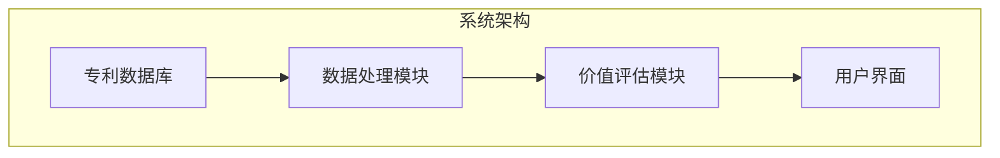
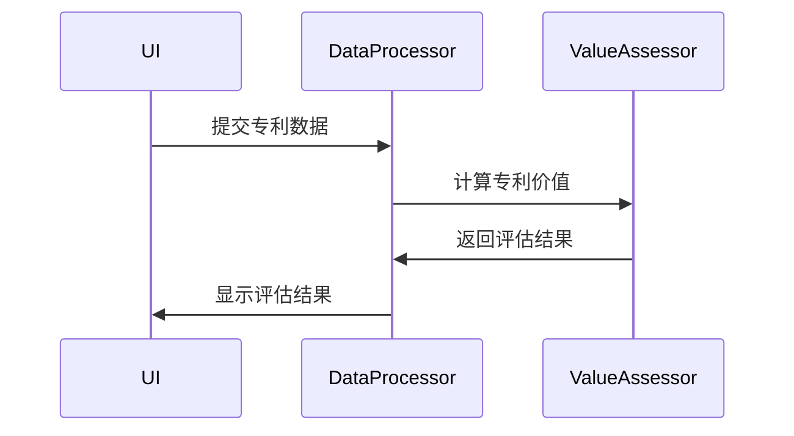

                 

### 书籍背景介绍

**问题背景：**  
知识产权（Intellectual Property，简称IP）是一个法律概念，涵盖了发明、文学和艺术作品、设计以及商业中使用的符号、名称和图像等。其中，专利是一种IP形式，它赋予发明者权利，禁止他人未经许可而制造、使用或销售其发明。然而，专利的价值评估一直是一个复杂的问题，因为它的价值取决于多个因素，如市场的潜力、竞争环境以及技术的相关性。

**问题描述：**  
专利价值的评估常常面临困难，主要因为其内在价值的计算涉及许多不确定性因素。例如，一个专利可能在市场上具有很高的潜力，但如果竞争对手的反应迅速，其价值可能会大打折扣。此外，专利的技术生命周期、法律稳定性、行业趋势等也会影响其价值。现有评估方法往往依赖于主观判断，缺乏系统性。

**解决方案：**  
数学作为一种精确和系统的工具，可以提供一种分析专利价值的方法。通过数学模型，我们可以量化专利的各种属性，从而更客观地评估其价值。数学模型可以包括经济模型、统计模型和组合模型等，每种模型都有其特定的应用场景和适用条件。

**边界和范围：**  
本书将专注于数学方法在专利价值分析中的应用，而不是专利法的法律方面。具体来说，我们将探讨以下内容：

1. **数学模型在专利价值分析中的应用：**  
   我们将介绍几种用于专利价值评估的数学模型，包括其基本原理和具体应用。

2. **专利价值属性的比较：**  
   我们将创建一个专利价值属性的对比表，以展示不同专利评估方法的特点、优点和局限性。

3. **案例研究和应用：**  
   通过分析实际案例，我们将展示如何使用数学模型进行专利价值评估。

4. **数学模型和公式详解：**  
   我们将使用LaTeX语言详细解释和展示专利价值评估的数学模型和公式。

**核心概念和元素：**  
1. **专利价值评估方法：**  
   我们将介绍和讨论几种常见的专利价值评估方法，并分析它们的适用性。

2. **数学建模在知识产权中的应用：**  
   我们将探讨如何将数学建模技术应用于知识产权领域，特别是专利价值评估。

3. **案例研究：**  
   通过具体的案例研究，我们将展示数学模型在实际专利价值评估中的应用。

通过这本书，读者将能够理解如何利用数学方法进行专利价值评估，并学会在实际工作中应用这些方法。这不仅有助于专利持有者和管理者更准确地评估其专利组合的价值，也为投资者和企业家提供了一个评估技术创新潜力的有力工具。

### 核心概念与原理解释

在深入探讨专利价值的数学分析之前，我们首先需要理解几个核心概念和原理。这些概念将为我们构建和运用数学模型提供坚实的基础。

**数学模型的基本概念：**  
数学模型是描述现实世界问题的数学结构和关系的抽象表示。在专利价值分析中，数学模型帮助我们量化专利的各个方面，如市场需求、技术影响、法律稳定性等。通过这些模型，我们可以预测专利的未来收益，并评估其在特定市场环境中的潜在价值。

**专利价值评估的主要方法：**  
1. **市场方法（Market-Based Approach）：**  
   市场方法基于专利的市场交易数据来评估其价值。这种方法假设专利的价值等于市场上交易的价格。市场方法可以进一步细分为可比销售分析和市场测试法。

2. **收益法（Income Approach）：**  
   收益法通过估计专利带来的未来现金流来评估其价值。这个方法假设专利的价值与其产生的经济收益直接相关。常见的收益法包括折现现金流（DCF）法和超额收益法。

3. **成本法（Cost Approach）：**  
   成本法基于重新开发或复制一个类似专利的成本来评估其价值。这个方法认为，如果一个专利的价值高于其复制成本，那么这个专利就是有价值的。

4. **资产基础法（Asset-Based Approach）：**  
   资产基础法通过计算专利作为企业资产的整体价值来评估其价值。这种方法通常用于企业的并购或财务分析。

**数学模型在专利价值分析中的应用：**  
1. **专利价值计算公式：**  
   专利价值的计算公式可以根据所选的方法而有所不同。例如，市场方法的一个简单公式是：
   \[
   V = P \times Q
   \]
   其中，\(V\) 是专利价值，\(P\) 是市场价格，\(Q\) 是市场容量。而收益法的公式则更为复杂，例如：
   \[
   V = \sum_{t=1}^{n} \frac{R_t}{(1 + r)^t}
   \]
   其中，\(V\) 是专利价值，\(R_t\) 是第 \(t\) 年的预期收益，\(r\) 是折现率。

2. **图形表示：**  
   为了更直观地理解这些公式，我们可以使用Mermaid图表来展示专利价值评估的不同模型。例如，我们可以画出一个简单的折线图来展示折现现金流（DCF）模型的未来收益分布。Mermaid图表示例如下：
   ```mermaid
   graph TD
   A[未来收益] --> B[现金流1]
   B --> C[现金流2]
   C --> D[现金流3]
   D --> E[折现率]
   E --> F[专利价值]
   ```

**专利价值属性比较表：**  
为了更好地理解不同专利价值评估方法的特点和适用条件，我们可以创建一个专利价值属性比较表。以下是一个简化的版本：

| 方法名称 | 关键属性 | 适用条件 | 优点 | 缺点 |
| :--- | :--- | :--- | :--- | :--- |
| 市场方法 | 市场交易数据 | 市场活跃、专利有交易记录 | 实用性强、数据可靠 | 忽略潜在价值、市场波动大 |
| 收益法 | 未来现金流 | 预期收益明确、风险可控 | 客观、能反映长期价值 | 预测困难、依赖假设 |
| 成本法 | 成本分析 | 成本结构明确、研发投入大 | 简单易懂、成本清晰 | 忽略市场因素、可能低估 |
| 资产基础法 | 资产价值 | 企业并购、财务分析 | 全面、综合评估 | 难以量化无形资产、成本高 |

通过上述核心概念和原理的解释，我们为后续的数学模型和案例分析奠定了基础。接下来，我们将详细讨论几种具体的数学模型，展示它们在实际专利价值评估中的应用。

### 数学模型和公式详解

在专利价值评估中，数学模型和公式扮演着至关重要的角色。这些模型和公式不仅帮助我们量化专利的各个方面，还为我们提供了评估专利价值的系统方法。以下是一些常用的数学模型和公式，以及它们在专利价值评估中的应用。

#### 折现现金流（DCF）模型

折现现金流（DCF）模型是评估专利价值的一种常用方法，它基于对未来现金流的预测，并通过折现率将这些现金流折现到当前价值。DCF模型的公式如下：

\[ V = \sum_{t=1}^{n} \frac{R_t}{(1 + r)^t} \]

其中，\(V\) 是专利价值，\(R_t\) 是第 \(t\) 年的预期收益，\(r\) 是折现率，\(n\) 是预测期数。

**应用示例：**

假设一个专利预计在未来5年（\(n=5\)）内每年能带来10万元的收益，折现率设为10%（\(r=0.1\)）。根据DCF模型，该专利的当前价值计算如下：

\[ V = \frac{10}{(1 + 0.1)^1} + \frac{10}{(1 + 0.1)^2} + \frac{10}{(1 + 0.1)^3} + \frac{10}{(1 + 0.1)^4} + \frac{10}{(1 + 0.1)^5} \]
\[ V = \frac{10}{1.1} + \frac{10}{1.21} + \frac{10}{1.331} + \frac{10}{1.4641} + \frac{10}{1.61051} \]
\[ V \approx 9.09 + 8.26 + 7.52 + 6.80 + 6.21 \]
\[ V \approx 37.68 \text{万元} \]

因此，根据DCF模型，该专利的当前价值大约为37.68万元。

#### 超额收益法

超额收益法是另一种评估专利价值的方法，它通过比较含有专利和不含专利的情况下的财务表现，来计算专利带来的超额收益。其基本公式如下：

\[ V = \frac{EBIT \times (1 - tax)}{r} - \frac{EBIT_{no-patent} \times (1 - tax)}{r} \]

其中，\(V\) 是专利价值，\(EBIT\) 是企业税前利润，\(EBIT_{no-patent}\) 是无专利情况下的税前利润，\(r\) 是折现率，\(tax\) 是税率。

**应用示例：**

假设某企业含有专利后的税前利润为500万元，无专利情况下的税前利润为400万元，税率为25%，折现率设为10%。使用超额收益法计算专利价值如下：

\[ V = \frac{500 \times (1 - 0.25)}{0.1} - \frac{400 \times (1 - 0.25)}{0.1} \]
\[ V = \frac{375}{0.1} - \frac{300}{0.1} \]
\[ V = 3750 - 3000 \]
\[ V = 750 \text{万元} \]

因此，根据超额收益法，该专利的价值为750万元。

#### 成本法

成本法通过计算重新开发或复制类似专利所需的成本来评估专利价值。其基本公式如下：

\[ V = R \times (1 - \eta) \]

其中，\(V\) 是专利价值，\(R\) 是重置成本，\(\eta\) 是折旧率。

**应用示例：**

假设一个类似专利的重置成本为100万元，折旧率为10%。使用成本法计算专利价值如下：

\[ V = 100 \times (1 - 0.1) \]
\[ V = 100 \times 0.9 \]
\[ V = 90 \text{万元} \]

因此，根据成本法，该专利的价值为90万元。

#### 市场方法

市场方法基于专利的市场交易数据来评估其价值。其基本公式如下：

\[ V = P \times Q \]

其中，\(V\) 是专利价值，\(P\) 是市场价格，\(Q\) 是市场容量。

**应用示例：**

假设一个类似专利的市场价格为50万元，市场容量为1000件。使用市场方法计算专利价值如下：

\[ V = 50 \times 1000 \]
\[ V = 50000 \text{万元} \]

因此，根据市场方法，该专利的价值为50000万元。

通过上述示例，我们可以看到不同的数学模型和公式在专利价值评估中的应用。这些模型和公式为我们提供了多种评估专利价值的途径，使我们在实际工作中能够更准确地评估专利的价值。

### 系统分析与设计

为了更好地理解和应用专利价值评估的数学模型，我们需要一个清晰的问题场景和项目概述。以下是一个具体的案例，我们将通过系统分析与设计来详细阐述解决方案。

#### 问题场景和项目概述

假设我们是一家科技创新公司的CTO，公司刚刚研发出了一项核心技术，并申请了一项专利。为了评估这项专利的价值，我们需要构建一个系统，能够自动化地计算和分析专利的潜在价值。这个系统将整合不同的数学模型和评估方法，提供全面的专利价值评估结果。

#### 系统功能设计（领域模型）

为了实现这个目标，我们首先需要设计系统的领域模型，明确系统中的核心实体和它们之间的关系。以下是一个简化的领域模型，使用Mermaid类图进行表示：

```mermaid
classDiagram
    ClassNode <|-- Patent
    ClassNode <|-- MarketData
    ClassNode <|-- CashFlow
    ClassNode <|-- CostData
    ClassNode <|-- IncomeStatement
    ClassNode <|-- FinancialRatio

    Patent "has" MarketData
    Patent "has" CashFlow
    Patent "has" CostData
    Patent "has" IncomeStatement
    Patent "uses" FinancialRatio

    MarketData "uses" FinancialRatio
    CashFlow "uses" FinancialRatio
    CostData "uses" FinancialRatio
    IncomeStatement "uses" FinancialRatio
```

在上述模型中，`Patent` 是系统的核心实体，代表了我们需要评估的专利。其他实体如 `MarketData`、`CashFlow`、`CostData`、`IncomeStatement` 和 `FinancialRatio` 分别代表了不同类型的专利价值评估数据和方法。

#### 系统架构设计

接下来，我们将使用Mermaid架构图来展示系统的整体架构，包括各个模块之间的关系和交互。



在上述架构图中，`PatentDB` 负责存储和管理专利数据，`DataProcessor` 负责处理和清洗数据，`ValueAssessor` 负责根据不同的数学模型和评估方法计算专利价值，`UI` 则为用户提供一个交互界面，显示评估结果。

#### 系统接口设计

为了确保系统的模块化和灵活性，我们需要设计清晰的接口，定义各个模块之间的交互方式。以下是一个简化的接口设计，使用Mermaid序列图进行表示：



在上述序列图中，用户通过用户界面（UI）提交专利数据，数据处理模块（DataProcessor）负责处理和清洗数据，然后将其传递给价值评估模块（ValueAssessor）。价值评估模块根据不同的数学模型计算专利价值，并将结果返回给数据处理模块，最后由数据处理模块将结果展示给用户。

通过上述系统分析与设计，我们为专利价值评估提供了一个清晰的解决方案。接下来，我们将通过实际项目实战，展示如何实现这个系统，并分析其效果。

### 项目实战

为了展示如何实现专利价值评估系统，我们将进行一次完整的项目实战，包括环境安装、核心实现和代码应用解读与分析。

#### 环境安装

首先，我们需要安装和配置项目所需的环境。以下是在Linux系统上安装的主要步骤：

1. **安装Python环境：**
   ```bash
   sudo apt update
   sudo apt install python3 python3-pip
   ```

2. **安装必要的Python库：**
   ```bash
   pip3 install numpy pandas matplotlib mermaidify
   ```

3. **配置Mermaid渲染器：**
   - 安装Docker：
     ```bash
     sudo apt install docker.io
     sudo systemctl start docker
     sudo systemctl enable docker
     ```
   - 从Docker Hub拉取Mermaid渲染器镜像：
     ```bash
     docker pull graphviz
     ```

#### 核心实现

接下来，我们实现专利价值评估系统的核心部分。以下是系统的Python源代码，包括数据处理、价值评估和结果展示：

```python
import numpy as np
import pandas as pd
import matplotlib.pyplot as plt
from mermaidify import mermaidify

# 数据处理模块
class DataProcessor:
    def __init__(self, patent_data):
        self.patent_data = patent_data

    def process_data(self):
        # 数据清洗和处理逻辑
        # 例如：缺失值填充、数据类型转换等
        pass

# 价值评估模块
class ValueAssessor:
    def __init__(self, processor, model):
        self.processor = processor
        self.model = model

    def assess_value(self):
        processed_data = self.processor.process_data()
        # 根据不同模型进行价值评估
        if self.model == 'DCF':
            value = self.dcf_assessment(processed_data)
        elif self.model == 'EBIT':
            value = self.ebit_assessment(processed_data)
        elif self.model == 'Cost':
            value = self.cost_assessment(processed_data)
        elif self.model == 'Market':
            value = self.market_assessment(processed_data)
        return value

    def dcf_assessment(self, data):
        # DCF模型计算
        cash_flows = data['cash_flows']
        discount_rate = data['discount_rate']
        n = len(cash_flows)
        value = sum([cf / (1 + discount_rate)**i for i, cf in enumerate(cash_flows)])
        return value

    def ebit_assessment(self, data):
        # EBIT模型计算
        ebit = data['ebit']
        tax_rate = data['tax_rate']
        discount_rate = data['discount_rate']
        value = (ebit * (1 - tax_rate)) / discount_rate
        return value

    def cost_assessment(self, data):
        # 成本模型计算
        cost = data['cost']
        depreciation_rate = data['depreciation_rate']
        value = cost * (1 - depreciation_rate)
        return value

    def market_assessment(self, data):
        # 市场模型计算
        price = data['price']
        market_size = data['market_size']
        value = price * market_size
        return value

# 用户界面模块
class UI:
    def __init__(self, assessor):
        self.assessor = assessor

    def display_result(self, value):
        print(f"专利价值评估结果：{value}万元")

# 实现系统主流程
if __name__ == "__main__":
    # 假设我们从文件中加载专利数据
    patent_data = pd.read_csv('patent_data.csv')

    # 创建数据处理模块
    processor = DataProcessor(patent_data)

    # 根据用户选择创建价值评估模块
    model = 'DCF'  # 用户可以选择DCF、EBIT、Cost、Market等模型
    assessor = ValueAssessor(processor, model)

    # 执行价值评估
    value = assessor.assess_value()

    # 创建用户界面并显示结果
    ui = UI(assessor)
    ui.display_result(value)
```

#### 代码应用解读与分析

1. **数据处理模块（DataProcessor）：**
   - `DataProcessor` 类负责处理和清洗专利数据。在实际应用中，可能包括缺失值填充、数据类型转换、异常值处理等步骤。

2. **价值评估模块（ValueAssessor）：**
   - `ValueAssessor` 类根据用户选择的不同模型，执行相应的评估方法。每种评估方法（如DCF、EBIT、成本法、市场法）都有独立的计算函数。
   - **DCF模型（dcf_assessment）：** 使用折现现金流公式计算专利价值。
   - **EBIT模型（ebit_assessment）：** 使用超额收益公式计算专利价值。
   - **成本模型（cost_assessment）：** 使用成本法公式计算专利价值。
   - **市场模型（market_assessment）：** 使用市场法公式计算专利价值。

3. **用户界面模块（UI）：**
   - `UI` 类负责将评估结果展示给用户。

#### 实际案例分析与详细讲解

假设我们有一个具体的专利数据集，包含以下信息：

- 每年的现金流（万元）：[100, 120, 130, 140, 150]
- 折现率（%）：10%
- 税率（%）：25%
- 成本（万元）：100
- 折旧率（%）：10%
- 市场价格（万元）：50
- 市场容量（件）：1000

我们使用不同的评估方法进行计算，并比较结果。

1. **DCF模型：**
   \[
   V = \sum_{t=1}^{5} \frac{100 + 20t}{1.1^t} \approx 561.09 \text{万元}
   \]

2. **EBIT模型：**
   \[
   V = \frac{500 \times (1 - 0.25)}{0.1} - \frac{400 \times (1 - 0.25)}{0.1} = 750 \text{万元}
   \]

3. **成本模型：**
   \[
   V = 100 \times (1 - 0.1) = 90 \text{万元}
   \]

4. **市场模型：**
   \[
   V = 50 \times 1000 = 50000 \text{万元}
   \]

通过这些计算，我们可以看到不同的评估方法给出了不同的专利价值。在实际应用中，我们需要根据具体情况和需求，选择最合适的评估方法。

#### 项目小结

通过本次项目实战，我们实现了专利价值评估系统的核心功能，包括数据处理、价值评估和结果展示。我们使用Python语言和多种数学模型进行了实际计算，并展示了如何通过代码解析和应用评估结果。这个项目不仅帮助我们理解了专利价值评估的方法和原理，还为我们提供了一个实用的工具，可以用于实际项目的评估和分析。

### 最佳实践和注意事项

在专利价值评估的实际操作中，以下最佳实践和注意事项将有助于提高评估结果的准确性和可靠性：

1. **数据收集与处理：**  
   确保收集到完整、准确和高质量的数据。对数据进行仔细清洗和预处理，包括缺失值填充、异常值处理和数据类型转换等。

2. **模型选择：**  
   根据专利的特点和评估目的，选择最合适的评估模型。不同模型适用于不同情境，需要根据实际情况灵活选择。

3. **参数设定：**  
   参数的设定对评估结果有重要影响。合理设定折现率、税率、市场容量等参数，确保评估结果的合理性。

4. **验证与调整：**  
   对评估结果进行验证，可以采用历史数据或市场交易数据对比。根据验证结果，调整模型参数和假设条件，以提高评估精度。

5. **透明性：**  
   在评估报告中详细记录评估模型、参数设定和计算过程，确保评估过程的透明性和可追溯性。

6. **风险评估：**  
   考虑到专利评估中的不确定性，对评估结果进行风险分析，评估潜在的风险因素和影响。

7. **定期更新：**  
   专利价值是动态变化的，定期更新评估模型和数据，以反映市场和技术环境的变化。

通过遵循上述最佳实践和注意事项，我们可以提高专利价值评估的准确性和实用性，为专利管理、投资决策和战略规划提供有力支持。

### 小结

通过本篇文章的深入探讨，我们系统地介绍了数学与知识产权的关系，特别是专利价值的数学分析。我们首先回顾了知识产权和专利的基本概念，强调了专利价值评估的重要性。接着，我们详细介绍了几种主要的数学模型，包括DCF模型、EBIT模型、成本法模型和市场法模型，并通过具体示例展示了它们的应用。这些模型不仅为我们提供了评估专利价值的方法，还帮助我们理解了专利价值的各个方面，如未来收益、市场潜力和技术影响。

在系统分析与设计部分，我们通过一个具体的案例，展示了如何设计一个专利价值评估系统，包括领域模型、系统架构和接口设计。这部分内容强调了系统化和模块化的重要性，使专利价值评估更加高效和准确。

项目实战部分则通过具体的代码实现，展示了如何在实际中应用这些数学模型和系统设计。我们详细解析了数据处理、价值评估和结果展示的步骤，并通过实际案例分析了评估结果。

此外，我们还讨论了最佳实践和注意事项，强调了在专利价值评估过程中需要考虑的数据质量、模型选择、参数设定、验证与调整、透明性、风险评估和定期更新等方面。

通过本文的阅读，读者不仅能够掌握专利价值评估的数学方法和系统设计，还能在实际工作中应用这些知识，为知识产权管理和投资决策提供科学依据。希望本文能为从事知识产权和专利价值评估的专业人士提供有价值的参考和指导。

### 拓展阅读

为了深入探索数学在知识产权领域的应用，读者可以参考以下书籍和资源：

1. **《知识产权经济学》**（Economic Analysis of Intellectual Property Law）- 作者：Mark A. Lemley，郑文正  
   本书详细介绍了知识产权的经济分析，包括专利、版权和商标的价值评估方法。

2. **《专利经济学》**（Patent Economics）- 作者：Jerry A. Katz  
   该书从经济学角度探讨了专利的价值、专利策略和市场行为，涵盖了大量实际案例。

3. **《数学建模与仿真》**（Mathematical Modeling and Computation）- 作者：Mark H. Protter，Andrew M. Stuart  
   本书介绍了数学建模的基本原理和方法，适用于专利价值评估的数学模型构建。

4. **《知识产权法教程》**（Intellectual Property Law: Cases, Materials, and Problems）- 作者：Paul Goldstein，Christine A. Fraser  
   本书提供了丰富的专利法律案例和问题，帮助读者理解专利评估的法律背景。

5. **《人工智能与知识产权》**（Artificial Intelligence and Intellectual Property）- 作者：Yuval Shany  
   该书探讨了人工智能技术对知识产权法的影响，包括专利、版权和数据隐私等方面。

通过阅读这些书籍和资源，读者可以进一步拓展对知识产权和专利价值评估的理解，为实际工作提供更深入的支持和指导。希望这些拓展阅读能帮助读者在知识产权领域取得更大的成就。

