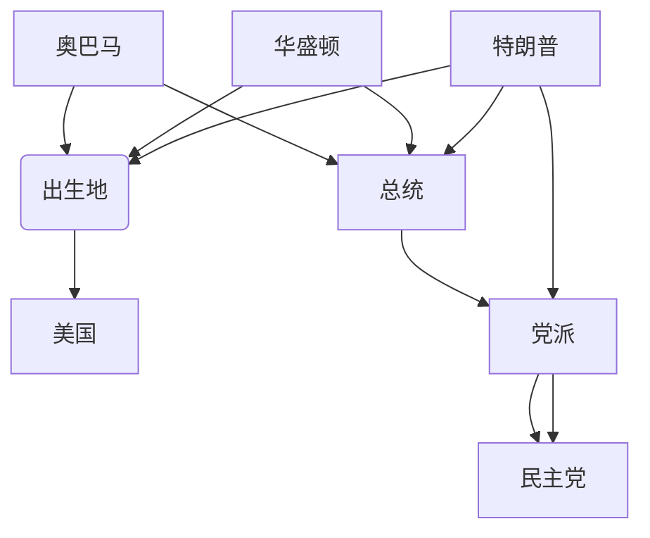
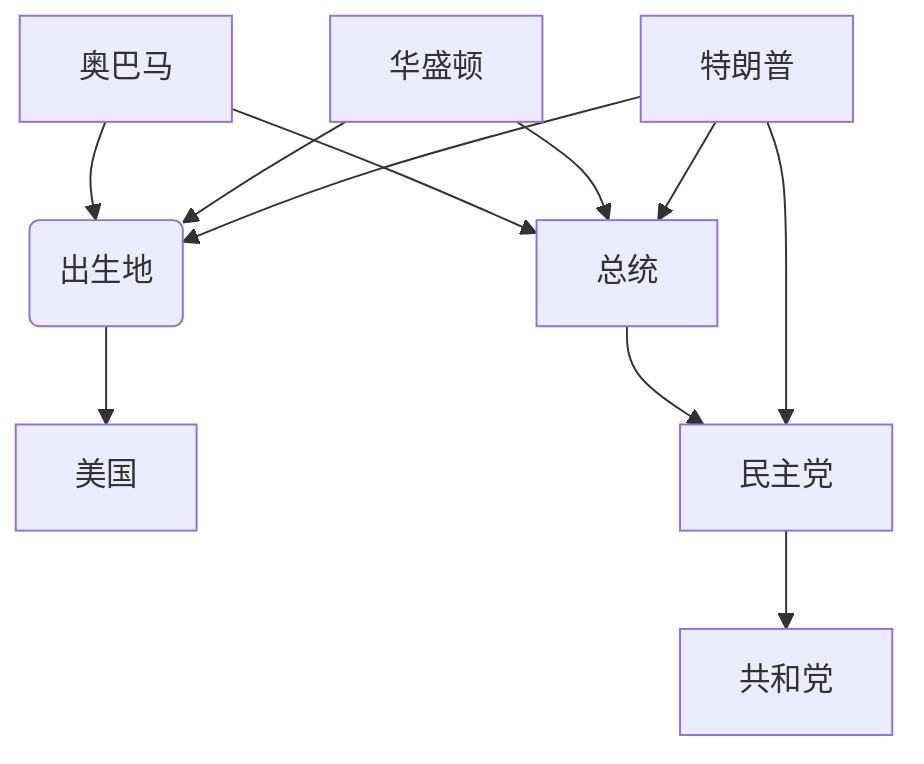
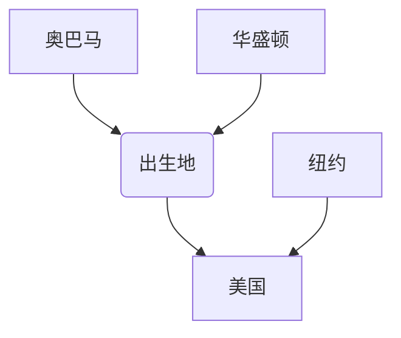
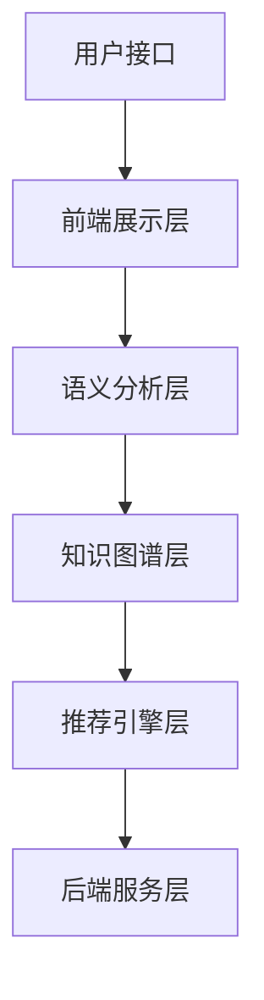

                 

## 数学与知识图谱：知识表示的数学结构

### 关键词：知识图谱、数学结构、知识表示、图论、集合论、拓扑学

> 摘要：本文从数学与知识图谱的关系出发，深入探讨了知识表示的数学结构。通过对图论、集合论和拓扑学的基本概念、原理及相互关联的详细阐述，本文揭示了这些数学工具在构建知识图谱中的重要作用。同时，本文还介绍了知识图谱的构建方法和应用场景，以及优化策略，为读者提供了一种全新的视角来理解和应用知识图谱技术。

### 目录大纲

# 数学与知识图谱：知识表示的数学结构

## 第一部分：背景介绍

### 1.1 研究背景

- **问题背景**：随着互联网和大数据的发展，知识表示和图谱构建成为研究热点，但现有的知识表示方法仍存在许多问题。
- **问题描述**：如何有效地利用数学方法构建知识图谱，解决知识表示的准确性、完整性、可扩展性等问题。
- **问题解决**：通过数学方法构建知识表示的数学结构，提高知识图谱的质量和应用效果。
- **边界与外延**：知识图谱的范围包括语义网络、本体论、图论等。
- **概念结构与核心要素组成**：知识图谱的核心要素包括实体、关系、属性等。

### 1.2 核心概念与联系

- **概念原理**：数学结构在知识表示中的应用，如图论、集合论、拓扑学等。
- **概念属性特征对比表格**

  | 概念         | 特点                                     | 关联关系               |
  | ------------ | ---------------------------------------- | ---------------------- |
  | 图论         | 研究图形结构                             | 与知识图谱有直接关联   |
  | 集合论       | 研究集合的性质和运算                     | 为知识图谱提供了基础   |
  | 拓扑学       | 研究空间结构的性质和变化                 | 为知识图谱提供了拓扑结构 |

### 1.3 本书的结构与内容

- **章节安排**：全书分为四个部分，分别介绍知识表示的数学结构、知识图谱的构建方法、应用案例及优化策略。
- **主要内容**：涵盖知识表示的数学原理、图论在知识图谱中的应用、知识图谱的构建算法、知识图谱的优化与评估方法等。

## 第二部分：数学结构与知识表示

### 2.1 图论基础

- **图的基本概念**：节点、边、路径、连通性等。
- **图的表示方法**：邻接矩阵、邻接表、邻接多重表等。
- **图的类型**：有向图、无向图、加权图、非加权图等。

### 2.2 集合论基础

- **集合的基本概念**：元素、子集、交集、并集、补集等。
- **集合的运算**：并、交、差、补等。
- **集合的表示方法**：列举法、描述法、关系法等。

### 2.3 拓扑学基础

- **拓扑空间的基本概念**：开集、闭集、连通性、边界等。
- **拓扑空间的性质**：紧性、连通性、度量性等。
- **拓扑空间的表示方法**：拓扑图、邻域图等。

## 第三部分：知识图谱的构建方法

### 3.1 知识图谱的基本概念

- **知识图谱的定义**：一种用于表达知识和信息的方法，通常由实体、关系和属性构成。
- **知识图谱的类型**：结构化知识图谱、语义网络、本体论等。
- **知识图谱的特点**：高度结构化、可扩展、可复用等。

### 3.2 知识图谱的表示方法

- **基于图论的知识图谱表示**：利用图的结构表示知识图谱。
- **基于集合论的知识图谱表示**：利用集合论的概念表示知识图谱。
- **基于拓扑学的知识图谱表示**：利用拓扑学的性质表示知识图谱。

## 第四部分：知识图谱的应用与优化

### 4.1 智能搜索与推荐

- **智能搜索**：利用知识图谱提高搜索的准确性和效率。
- **推荐系统**：基于知识图谱进行个性化推荐。

### 4.2 自然语言处理

- **问答系统**：利用知识图谱解决语义理解和信息检索问题。
- **文本生成**：利用知识图谱生成高质量的自然语言文本。

### 4.3 其他应用场景

- **智能问答系统**：基于知识图谱的智能问答系统，如虚拟助手、聊天机器人等。
- **知识库构建**：利用知识图谱构建行业知识库，为行业决策提供支持。

## 第五部分：案例分析

### 5.1 案例一：智能搜索引擎

- **案例背景**：介绍智能搜索引擎的需求背景和设计目标。
- **系统功能设计**：描述智能搜索引擎的核心功能模块和实现方式。
- **系统架构设计**：展示智能搜索引擎的整体架构设计和关键技术。
- **系统接口设计和系统交互**：阐述智能搜索引擎的接口设计和交互流程。

### 5.2 案例二：知识图谱构建与优化

- **案例背景**：介绍知识图谱构建与优化项目的需求背景和目标。
- **核心实现源代码**：展示知识图谱构建与优化过程中的核心代码片段。
- **代码应用解读与分析**：对核心代码进行解读和分析，阐述其工作原理和应用效果。
- **实际案例分析和详细讲解剖析**：通过具体案例，分析知识图谱构建与优化过程中的关键问题和解决方案。
- **项目小结**：总结知识图谱构建与优化项目的成果和经验，提出改进方向。

### 5.3 最佳实践 tips

- **注意事项**：在知识图谱构建和应用过程中需要注意的关键点。
- **小结**：对本文的主要内容和核心观点进行总结。
- **拓展阅读**：推荐进一步学习和研究的相关资料和文献。

---

### 1.1 研究背景

#### 问题背景

随着互联网的迅速发展和信息爆炸时代的到来，人类获取和处理的信息量呈现指数级增长。在这一背景下，如何有效地组织和利用这些信息成为了研究的热点。知识图谱作为一种新兴的信息表示方法，因其能将大量的半结构化、非结构化数据转化为结构化数据，从而提高信息的检索、利用和共享效率，受到了广泛关注。

知识图谱的核心在于其能够以图形的方式表达知识，通常包含实体（代表现实世界中的对象）、关系（代表实体之间的交互或联系）和属性（代表实体的特征或属性）。然而，现有的知识表示方法在准确性、完整性、可扩展性和易用性等方面仍存在诸多问题。例如，传统的关系数据库在处理复杂关系和大规模数据时效率低下；自然语言处理中的实体识别和关系抽取也存在准确性不高的问题；本体论和语义网络等知识表示方法在知识表达和推理能力上仍需进一步提升。

#### 问题描述

为了解决上述问题，我们需要找到一种新的方法来构建知识图谱，以提高其表示的准确性、完整性、可扩展性和易用性。具体来说，我们需要解决以下几个关键问题：

1. **准确性**：如何提高知识图谱中实体和关系的准确性，减少错误和冗余信息？
2. **完整性**：如何确保知识图谱能够全面、系统地覆盖现实世界的知识，避免信息缺失？
3. **可扩展性**：如何设计一个灵活的知识表示框架，使其能够适应不断变化的知识需求和规模增长？
4. **易用性**：如何提高知识图谱的易用性，使得用户能够方便、高效地查询和使用知识图谱中的信息？

#### 问题解决

为了解决上述问题，我们可以借鉴数学中的图论、集合论和拓扑学等理论，构建知识表示的数学结构。这种方法不仅可以提高知识图谱的准确性、完整性和可扩展性，还能增强其易用性。

1. **准确性**：通过图论中的连通性和路径分析，可以有效地检测和纠正知识图谱中的错误和冗余信息。集合论中的元素和子集概念可以帮助我们精确地定义和描述实体和关系。
2. **完整性**：集合论和拓扑学中的覆盖和嵌套概念可以帮助我们构建一个系统化的知识表示框架，确保知识图谱能够全面地覆盖现实世界的知识。
3. **可扩展性**：图论中的图的扩展和组合操作，以及集合论和拓扑学中的并集、交集和补集操作，为知识图谱的扩展提供了灵活的数学工具。
4. **易用性**：拓扑学中的拓扑图和邻域图等概念，使得知识图谱的结构更加直观，便于用户理解和查询。

通过引入数学结构，我们不仅可以构建出更高质量的知识图谱，还能为知识图谱的研究和应用提供新的视角和方法。

#### 边界与外延

知识图谱作为一种知识表示的方法，其范围涉及多个领域，包括语义网络、本体论和图论等。语义网络是一种基于有向图的语义表示方法，主要用于知识共享和推理。本体论则是一种基于概念及其关系的知识表示方法，强调概念的层次结构和分类。图论则是研究图形结构的数学分支，提供了丰富的工具和方法来分析和处理知识图谱。

知识图谱的核心要素主要包括实体、关系和属性。实体是知识图谱中表示的对象，可以是具体的人、地点、事物等；关系则是实体之间的关联，可以是“属于”、“位于”、“生产”等；属性则是实体的特征或属性，可以是“身高”、“出生地”、“产量”等。这些要素共同构成了知识图谱的基本结构，使得知识图谱能够有效地表示和传递知识。

#### 概念结构与核心要素组成

知识图谱作为一种结构化的知识表示方法，其核心要素包括实体、关系和属性。以下是对这些核心要素的详细解释：

1. **实体（Entity）**：
   - **定义**：实体是知识图谱中表示的对象，可以是具体的人、地点、事物等。例如，在一个关于人物的知识图谱中，实体可能包括“奥巴马”、“华盛顿”等。
   - **类型**：实体可以分为不同的类型，如人物、地点、组织、事件等。这些类型的实体在知识图谱中可以通过分类关系相互关联。
   - **属性**：实体可以具有多个属性，如“奥巴马”的属性可能包括“国籍”、“出生日期”、“政治党派”等。属性用于描述实体的特征。

2. **关系（Relationship）**：
   - **定义**：关系是实体之间的关联，可以是“属于”、“位于”、“生产”等。例如，在上述关于人物的知识图谱中，“奥巴马”与“美国”之间存在“国籍”关系。
   - **类型**：关系可以分为不同的类型，如“亲属关系”、“地理位置关系”、“职业关系”等。这些关系在知识图谱中通过边来表示。
   - **权重**：关系可以有权重，用于表示关系的强度或重要性。例如，“奥巴马”与“美国”之间的“国籍”关系权重可能高于“奥巴马”与“加拿大”之间的“居住地”关系。

3. **属性（Attribute）**：
   - **定义**：属性是实体的特征或属性，如“身高”、“出生日期”、“产量”等。属性通常用于描述实体的特定信息。
   - **类型**：属性可以分为不同的类型，如数值型、字符串型、布尔型等。不同类型的属性可以用于描述不同的实体特征。
   - **值域**：属性的值域是指属性可以取的所有可能值。例如，一个“身高”属性的可能值域是所有实数。

知识图谱通过实体、关系和属性的组合，可以构建出一个复杂、结构化的知识网络。这些核心要素不仅能够准确地表示现实世界中的知识，还能够通过推理和查询，为各种应用场景提供强大的支持。

#### 1.2 核心概念与联系

在探讨知识表示的数学结构时，图论、集合论和拓扑学作为重要的数学工具，其在知识图谱中的应用具有重要意义。以下我们将详细解释这些概念的基本原理，并对比其属性特征，通过一个示例来展示它们在知识图谱中的具体应用。

##### 1.2.1 图论基础

**概念原理**：图论是研究图形结构的数学分支，主要关注节点（实体）和边（关系）的连接方式。图论的核心概念包括节点、边、路径、连通性等。

**属性特征**：

| 概念         | 特点                                     | 应用示例                          |
| ------------ | ---------------------------------------- | -------------------------------- |
| 节点         | 图中的数据元素，表示实体                 | 知识图谱中的实体，如人物、地点等  |
| 边           | 节点之间的连接，表示关系                 | 知识图谱中的关系，如“属于”、“生产”|
| 路径         | 节点之间的连接路径                       | 知识图谱中的路径查询，如“奥巴马 -> 美国总统”|
| 连通性       | 图中任意两个节点之间是否存在路径         | 知识图谱中的连通性检测，如检测两个实体之间是否存在直接或间接关系 |

**关联关系**：图论为知识图谱提供了结构化的表示方式，通过节点和边的关系，可以直观地表示实体及其之间的复杂联系。

##### 1.2.2 集合论基础

**概念原理**：集合论是研究集合的性质和运算的数学分支。集合是包含一定数量元素的整体，集合论的核心概念包括元素、子集、交集、并集等。

**属性特征**：

| 概念         | 特点                                     | 应用示例                          |
| ------------ | ---------------------------------------- | -------------------------------- |
| 元素         | 集合中的个体                             | 知识图谱中的实体或属性值          |
| 子集         | 包含于另一个集合的部分集合               | 知识图谱中的实体分类，如“人”是“人物”的子集 |
| 交集         | 两个集合共有的元素组成的集合             | 知识图谱中的实体关系查询，如“奥巴马”与“美国总统”的交集是“奥巴马” |
| 并集         | 两个集合所有元素组成的集合               | 知识图谱中的实体合并，如“奥巴马”与“华盛顿”的并集是包含两者的集合 |
| 补集         | 全集除去原集合的元素组成的集合           | 知识图谱中的实体补集查询，如查询“非美国人”的实体 |

**关联关系**：集合论为知识图谱提供了逻辑基础，通过集合运算，可以精确地描述实体和关系之间的逻辑关系。

##### 1.2.3 拓扑学基础

**概念原理**：拓扑学是研究空间结构的性质和变化的数学分支。拓扑空间的基本概念包括开集、闭集、连通性、边界等。

**属性特征**：

| 概念         | 特点                                     | 应用示例                          |
| ------------ | ---------------------------------------- | -------------------------------- |
| 开集         | 包含其内部所有点的集合                   | 知识图谱中的区域查询，如“华盛顿特区”是一个开集 |
| 闭集         | 包含其内部所有点和边界点的集合           | 知识图谱中的完整实体查询，如查询一个实体的所有属性 |
| 连通性       | 图中任意两个节点之间是否存在路径         | 知识图谱中的连通性检测，如检测两个实体是否可以直接或间接相连 |
| 边界         | 开集和闭集的交集部分                     | 知识图谱中的边界查询，如查询实体的边界属性 |

**关联关系**：拓扑学为知识图谱提供了空间结构的表示方式，通过拓扑性质，可以更直观地分析和处理实体及其之间的关系。

##### 示例

假设我们有一个关于人物的知识图谱，包含以下实体和关系：

- 实体：奥巴马、华盛顿、特朗普
- 关系：出生地、总统、党派

使用图论，我们可以将人物及其关系表示为图：



在这个图中，节点表示实体（如奥巴马、华盛顿、特朗普），边表示实体之间的关系（如出生地、总统、党派）。

使用集合论，我们可以表示实体和关系的集合：

- 实体集合：{奥巴马，华盛顿，特朗普}
- 关系集合：{出生地，总统，党派}

我们可以通过集合运算，如交集、并集等，查询和操作实体和关系：

- 查询奥巴马和华盛顿的交集：{奥巴马，华盛顿}
- 查询出生地的并集：{奥巴马，华盛顿，特朗普}

使用拓扑学，我们可以表示实体和关系在空间中的分布：

- 开集：每个实体的属性集合，如奥巴马的属性集：{美国，民主党}
- 闭集：每个实体的完整属性集合，如奥巴马的完整属性集：{美国，民主党，出生日期，党派}

通过连通性检测，我们可以判断两个实体是否直接或间接相连：

- 判断奥巴马和特朗普是否连通：奥巴马和特朗普都是美国总统，因此是连通的。

通过图论、集合论和拓扑学的结合，我们可以构建出结构清晰、逻辑严密的知识图谱，为各种应用提供坚实的基础。

#### 1.3 本书的结构与内容

全书分为五个部分，旨在系统地介绍知识表示的数学结构，并探讨其在知识图谱构建中的应用。

**第一部分：背景介绍**

本部分将介绍知识图谱的研究背景，包括问题背景、问题描述、问题解决、边界与外延以及概念结构与核心要素组成。通过这一部分的介绍，读者可以了解知识图谱的发展背景及其核心概念。

**第二部分：数学结构与知识表示**

本部分将深入探讨图论、集合论和拓扑学等数学工具在知识表示中的应用。通过详细阐述这些数学工具的基本概念、原理和相互关联，读者可以理解如何利用数学结构来构建高质量的知识图谱。

**第三部分：知识图谱的构建方法**

本部分将介绍知识图谱的构建方法，包括基本概念、表示方法和构建算法。通过这一部分的介绍，读者可以学习到如何从零开始构建一个知识图谱，并掌握常用的构建技术和工具。

**第四部分：知识图谱的应用与优化**

本部分将探讨知识图谱在实际应用中的各种场景，如智能搜索、推荐系统和自然语言处理等。同时，还将介绍知识图谱的优化策略，包括更新与维护、压缩与优化等。通过这一部分的介绍，读者可以了解到如何优化知识图谱的性能，提高其应用效果。

**第五部分：案例分析**

本部分将通过具体案例，展示知识图谱在实际项目中的应用和优化。通过案例分析，读者可以更直观地了解知识图谱的构建和应用过程，学习到实际操作中的经验和技巧。

全书旨在为读者提供一部全面、系统的知识图谱技术指南，帮助读者深入理解和掌握知识图谱的构建、应用和优化方法。

#### 2.1 图论基础

图论是研究图形结构的数学分支，它在知识图谱的构建和应用中扮演着至关重要的角色。图论的核心概念包括节点、边、路径、连通性等。以下是对这些基本概念及其在知识图谱中的应用进行详细解释。

##### 2.1.1 节点（Node）

**定义**：节点是图中的数据元素，通常表示知识图谱中的实体。节点可以是有向的也可以是无向的，取决于关系是否具有方向性。

**类型**：
- **实体节点**：表示具体的人、地点、事物等。
- **概念节点**：表示抽象的概念或类别。

**在知识图谱中的应用**：在知识图谱中，节点通常用于表示实体，如“奥巴马”、“华盛顿”、“苹果公司”等。节点可以是简单的，也可以具有多种属性，如“出生日期”、“职位”、“销售额”等。

##### 2.1.2 边（Edge）

**定义**：边是节点之间的连接，表示实体之间的关系。边通常具有方向性，可以是有向的（如“属于”），也可以是无向的（如“相邻”）。

**类型**：
- **实体关系边**：表示实体之间的直接联系，如“奥巴马”与“美国总统”之间的“担任”关系。
- **属性关系边**：表示实体的属性与值之间的关系，如“奥巴马”的“出生日期”属性。

**在知识图谱中的应用**：在知识图谱中，边用于表示实体之间的关系。例如，在一个关于人物的知识图谱中，我们可以通过边来表示“奥巴马是美国人”，“华盛顿是美国的独立宣言签署者”等关系。边还可以携带权重或标签，以表示关系的强度或类型。

##### 2.1.3 路径（Path）

**定义**：路径是节点之间的一条连接序列，表示从源节点到目标节点的序列。路径可以是直接的，也可以是间接的。

**类型**：
- **直接路径**：仅包含边的路径。
- **间接路径**：包含边的组合路径。

**在知识图谱中的应用**：在知识图谱中，路径用于表示实体之间的复杂关系。例如，我们可以通过路径查询“奥巴马”和“美国总统”之间的连接，即“奥巴马 -> 担任 -> 总统”。路径分析是知识图谱推理和查询的重要工具。

##### 2.1.4 连通性（Connectivity）

**定义**：连通性是指图中任意两个节点之间是否存在路径。

**类型**：
- **强连通性**：图中任意两个节点都相互连通。
- **弱连通性**：图中任意两个节点都有路径相互连通，不考虑边的方向。

**在知识图谱中的应用**：在知识图谱中，连通性用于检测实体之间的直接或间接关系。例如，通过连通性分析，我们可以判断“奥巴马”和“特朗普”是否具有某种联系。连通性检测在知识图谱的查询和推理中具有重要意义。

##### 2.1.5 图的表示方法

**定义**：图的表示方法是指如何将图结构在计算机中表示和存储。

**类型**：
- **邻接矩阵**：用矩阵形式表示图，矩阵中的元素表示节点之间的连接关系。
- **邻接表**：用链表或数组表示图，每个节点都有一个列表，列出与之相连的其他节点。
- **邻接多重表**：用于表示多重图，每个节点可以有多个连接。

**在知识图谱中的应用**：邻接矩阵和邻接表是知识图谱常用的表示方法。邻接矩阵适用于稀疏图，而邻接表适用于密集图。邻接多重表则适用于具有多重关系的图。

通过图论的基本概念和表示方法，我们可以有效地构建和表示知识图谱，使其能够更好地存储、检索和利用知识。图论在知识图谱中的关键作用不仅在于其结构化的表示能力，还在于其强大的推理和分析能力，为知识图谱的应用提供了坚实的理论基础。

#### 2.2 集合论基础

集合论是研究集合的性质和运算的数学分支，它在知识图谱的构建中发挥着基础性的作用。集合论的核心概念包括元素、子集、交集、并集、补集等。以下是对这些基本概念及其在知识图谱中的应用进行详细解释。

##### 2.2.1 元素

**定义**：元素是集合中的个体，是构成集合的基本单位。

**类型**：集合中的元素可以是具体的对象，如“奥巴马”、“华盛顿”，也可以是抽象的概念，如“国家首都”、“总统”。

**在知识图谱中的应用**：在知识图谱中，元素通常表示实体或属性值。例如，在关于人物的知识图谱中，“奥巴马”和“华盛顿”可以作为元素存在。元素是构建知识图谱的基本单元，通过元素的组合和关联，可以构建出复杂的知识结构。

##### 2.2.2 子集

**定义**：子集是包含于另一个集合的部分集合。

**类型**：
- **真子集**：如果一个集合是另一个集合的子集，但不等于另一个集合，则称为真子集。
- **非空子集**：包含至少一个元素的子集。

**在知识图谱中的应用**：在知识图谱中，子集可以用于表示实体的分类或层次结构。例如，在人物分类中，“奥巴马”是“美国总统”的子集，同时也是“民主党成员”的子集。通过子集，我们可以定义实体的分类和层次关系，从而更好地组织和管理知识。

##### 2.2.3 交集

**定义**：交集是两个集合共有的元素组成的集合。

**类型**：交集操作可以用于发现具有共同特征的实体。例如，如果我们有两个集合A（包含所有美国总统）和B（包含所有民主党成员），则A和B的交集将包含所有既是美国总统又是民主党成员的人。

**在知识图谱中的应用**：在知识图谱中，交集操作可以帮助我们查询具有共同属性的实体。例如，我们可以通过交集查询“既是美国总统又是民主党成员”的人物，从而获取特定的知识信息。

##### 2.2.4 并集

**定义**：并集是两个集合所有元素组成的集合。

**类型**：并集操作可以用于合并具有相同或不同属性的实体。例如，如果我们有两个集合A（包含所有美国总统）和B（包含所有共和党成员），则A和B的并集将包含所有美国总统和共和党成员。

**在知识图谱中的应用**：在知识图谱中，并集操作可以帮助我们合并具有相同或相关属性的实体，从而扩大知识的覆盖范围。例如，我们可以通过并集操作获取所有政治领袖的信息，无论是哪个政党。

##### 2.2.5 补集

**定义**：补集是全集除去原集合的元素组成的集合。

**类型**：补集操作可以用于查询不属于特定集合的实体。例如，如果我们有一个集合A（包含所有美国总统），则A的补集将包含所有不是美国总统的人。

**在知识图谱中的应用**：在知识图谱中，补集操作可以帮助我们识别特定分类外的实体。例如，我们可以通过补集操作查询“非美国总统”的人物，从而获得与特定类别不同的信息。

##### 2.2.6 集合的表示方法

**定义**：集合的表示方法是指如何用数学语言表示集合。

**类型**：
- **列举法**：通过列举集合中的所有元素来表示集合。
- **描述法**：通过描述集合的元素特性来表示集合。
- **关系法**：通过描述元素之间的关系来表示集合。

**在知识图谱中的应用**：在知识图谱中，我们可以使用列举法来表示具体的实体和关系，如“奥巴马是民主党成员”。描述法可以用于描述实体的特征，如“所有美国总统的出生日期在1940年之后”。关系法可以用于描述实体之间的关联，如“A和B是朋友”。

通过集合论的基本概念和运算，我们可以有效地组织和表示知识图谱中的实体和关系，使其能够更好地存储、检索和利用知识。集合论在知识图谱中的关键作用不仅在于其数学基础，还在于其提供了强大的逻辑工具，帮助我们在复杂的知识网络中找到和理解相关知识。

#### 2.3 拓扑学基础

拓扑学是研究空间结构的性质和变化的数学分支，其在知识图谱中的应用具有重要意义。拓扑学的基本概念包括拓扑空间、开集、闭集、连通性等。以下是对这些基本概念及其在知识图谱中的应用进行详细解释。

##### 2.3.1 拓扑空间

**定义**：拓扑空间是由一个集合和其上的开集族组成的数学结构。

**类型**：
- **基础拓扑空间**：满足特定条件的集合和开集族。
- **欧氏拓扑空间**：满足欧几里得几何中开球定义的开集族的拓扑空间。

**在知识图谱中的应用**：在知识图谱中，拓扑空间可以用来表示实体及其关系在空间中的分布。例如，我们可以将人物及其地理位置表示为一个拓扑空间，其中节点表示人物，边表示地理位置关系。通过拓扑空间的定义，我们可以有效地组织和管理知识图谱中的实体和关系。

##### 2.3.2 开集

**定义**：开集是包含其内部所有点的集合。

**类型**：
- **内部开集**：点的内部所有点组成的集合。
- **边界开集**：包含点及其相邻点的集合。

**在知识图谱中的应用**：在知识图谱中，开集可以用来表示实体在其属性空间中的分布。例如，我们可以将人物的出生日期表示为开集，其中每个日期点代表一个实体，相邻日期点表示实体的连续属性。通过开集，我们可以直观地理解实体的属性分布。

##### 2.3.3 闭集

**定义**：闭集是包含其内部所有点和边界点的集合。

**类型**：
- **内部闭集**：点的内部和边界所有点组成的集合。
- **边界闭集**：包含点的内部点及其相邻点的集合。

**在知识图谱中的应用**：在知识图谱中，闭集可以用来表示实体的完整属性集合。例如，我们可以将人物的完整属性表示为闭集，包括其出生日期、国籍、职业等。通过闭集，我们可以全面地了解实体的属性信息。

##### 2.3.4 连通性

**定义**：连通性是指图中任意两个节点之间是否存在路径。

**类型**：
- **强连通性**：图中任意两个节点都相互连通。
- **弱连通性**：图中任意两个节点都有路径相互连通，不考虑边的方向。

**在知识图谱中的应用**：在知识图谱中，连通性用于检测实体之间的直接或间接关系。例如，通过连通性分析，我们可以判断两个人物是否具有某种联系，如“奥巴马”和“特朗普”是否通过“总统”关系相互连接。连通性检测在知识图谱的查询和推理中具有重要意义。

##### 2.3.5 边界

**定义**：边界是开集和闭集的交集部分。

**类型**：边界用于表示实体的属性边界，如人物的出生日期边界。

**在知识图谱中的应用**：在知识图谱中，边界可以用来表示实体的属性范围。例如，我们可以将人物的出生日期边界表示为两个日期点，其中起始日期是开集，结束日期是闭集。通过边界，我们可以精确地表示实体的属性范围。

通过拓扑学的基本概念，我们可以更直观地理解和表示知识图谱中的实体和关系，使其能够更好地适应复杂的空间结构。拓扑学为知识图谱提供了强大的数学工具，使其能够有效地进行空间分析、路径查询和拓扑推理。

#### 3.1 知识图谱的基本概念

知识图谱是一种用于表达知识和信息的方法，它通过结构化的方式将现实世界中的实体、关系和属性表示为图。以下是对知识图谱的基本概念进行详细解释。

##### 3.1.1 知识图谱的定义

**定义**：知识图谱是由实体、关系和属性构成的图形结构，用于表示和存储知识。

**类型**：
- **结构化知识图谱**：通过明确的实体和关系类型，以结构化的方式表达知识。
- **语义网络**：一种基于有向图的知识图谱，用于表示概念及其之间的关系。
- **本体论**：一种基于概念及其层次结构的知识图谱，用于描述领域内的概念和关系。

**特点**：
- **高度结构化**：知识图谱通过明确的实体、关系和属性，使得知识表达更加清晰、系统。
- **可扩展性**：知识图谱可以随着新知识的增加而动态扩展，适应不断变化的需求。
- **可复用性**：知识图谱中的实体、关系和属性可以复用于不同的应用场景，提高知识利用效率。

##### 3.1.2 知识图谱的类型

**类型1：结构化知识图谱**

- **定义**：结构化知识图谱通过明确的实体类型和关系类型，以结构化的方式表示知识。
- **应用**：常用于企业内部知识管理系统、搜索引擎等。

**类型2：语义网络**

- **定义**：语义网络是一种基于有向图的知识图谱，通过节点和边表示概念及其之间的关系。
- **应用**：常用于语义搜索引擎、自然语言处理等领域。

**类型3：本体论**

- **定义**：本体论是一种基于概念及其层次结构的知识图谱，通过定义概念、属性和关系，描述领域内的知识。
- **应用**：常用于领域知识库构建、智能问答系统等。

##### 3.1.3 知识图谱的特点

**特点1：高度结构化**

- **解释**：知识图谱通过实体、关系和属性的结构化表示，使得知识表达更加清晰、系统，便于计算机处理和分析。
- **示例**：在一个关于人物的知识图谱中，实体包括“奥巴马”、“华盛顿”等，关系包括“出生地”、“总统”等。

**特点2：可扩展性**

- **解释**：知识图谱可以根据新知识的需求动态扩展，适应不断变化的应用场景。
- **示例**：当新的政治事件发生时，可以新增相关的人物和关系，如“拜登”和“副总统”。

**特点3：可复用性**

- **解释**：知识图谱中的实体、关系和属性可以复用于不同的应用场景，提高知识利用效率。
- **示例**：在多个应用系统中，可以使用同一个知识图谱，如搜索引擎、智能问答系统。

通过详细解释知识图谱的基本概念，我们了解了知识图谱的定义、类型和特点。这些基本概念为后续的知识图谱构建和应用提供了理论基础。

#### 3.2 知识图谱的表示方法

在知识图谱的应用过程中，如何有效地表示知识图谱是关键的一步。知识图谱的表示方法可以分为基于图论、集合论和拓扑学的三种。以下是这三种方法的详细解释。

##### 3.2.1 基于图论的知识图谱表示

**定义**：基于图论的知识图谱表示利用图的结构来表示实体和关系，通过节点和边来构建知识网络。

**优势**：
- **直观性**：图结构使得知识图谱的表示直观易懂，便于理解和分析。
- **灵活性**：图结构支持动态扩展，能够适应知识变化的需求。

**示例**：

假设我们有一个关于人物的知识图谱，包含以下实体和关系：

- 实体：奥巴马、华盛顿、特朗普
- 关系：出生地、总统、党派

使用图论表示，我们可以构建如下的知识图谱：



在这个图结构中，节点表示实体，如奥巴马、华盛顿、特朗普，边表示关系，如出生地、总统、党派。通过这种方式，我们可以直观地表示实体之间的复杂关系。

##### 3.2.2 基于集合论的知识图谱表示

**定义**：基于集合论的知识图谱表示利用集合的概念来表示实体和关系，通过集合的运算来构建知识网络。

**优势**：
- **逻辑性**：集合论提供了严密的逻辑工具，使得知识图谱的表示更加严谨。
- **扩展性**：集合论支持集合的运算，使得知识图谱能够灵活地扩展。

**示例**：

假设我们有一个关于人物的知识图谱，包含以下实体和关系：

- 实体：奥巴马、华盛顿、特朗普
- 关系：出生地、总统、党派

使用集合论表示，我们可以构建如下的知识图谱：

- 实体集合：{奥巴马，华盛顿，特朗普}
- 关系集合：{出生地，总统，党派}

通过集合的运算，我们可以得到以下查询结果：

- 奥巴马和特朗普的交集：{出生地}
- 奥巴马和华盛顿的并集：{奥巴马，华盛顿，特朗普}

这种表示方法使得我们能够通过集合运算来查询和处理知识图谱中的信息，提高知识利用的效率。

##### 3.2.3 基于拓扑学的知识图谱表示

**定义**：基于拓扑学的知识图谱表示利用拓扑空间的概念来表示实体和关系，通过拓扑性质来构建知识网络。

**优势**：
- **空间性**：拓扑学提供了空间表示的方法，使得知识图谱能够更好地表示实体在空间中的分布。
- **连通性**：拓扑学提供了连通性的概念，使得我们能够检测实体之间的直接或间接关系。

**示例**：

假设我们有一个关于人物和地理位置的知识图谱，包含以下实体和关系：

- 实体：奥巴马、华盛顿、纽约
- 关系：出生地、位于

使用拓扑学表示，我们可以构建如下的知识图谱：



在这个拓扑结构中，节点表示实体，如奥巴马、华盛顿、纽约，边表示关系，如出生地、位于。通过拓扑性质，我们可以检测实体之间的连通性，如奥巴马和华盛顿是否在同一个国家。

综上所述，基于图论、集合论和拓扑学的知识图谱表示方法各有优势，可以根据具体应用场景选择合适的方法。图论提供了直观的表示方法，集合论提供了逻辑性强的工具，拓扑学提供了空间性和连通性的分析能力。通过灵活运用这些方法，我们可以构建出更加高效、准确和易用的知识图谱。

#### 4.1 智能搜索与推荐

知识图谱在智能搜索和推荐系统中有着广泛的应用，通过将大量的信息结构化和关联，知识图谱能够显著提高搜索和推荐的准确性和效率。

##### 4.1.1 智能搜索

**基本概念**：智能搜索利用知识图谱中的实体、关系和属性，实现对信息的有效组织和检索。通过知识图谱，用户可以基于实体和关系进行多维度、多层次的查询。

**应用场景**：

1. **多维度搜索**：用户可以通过知识图谱中的多个属性进行组合查询，如查询“奥巴马”的所有相关信息，包括“出生日期”、“政治党派”、“任职时间”等。

2. **语义查询**：知识图谱能够理解用户的自然语言查询，将自然语言转换为结构化的查询，从而提高搜索的准确性。例如，用户输入“找出所有美国总统的配偶”，知识图谱能够自动识别并查询出相关结果。

3. **推荐搜索**：基于用户的历史查询和行为，知识图谱可以推荐相关的搜索结果，提高用户的查询体验。例如，当用户查询“奥巴马”时，系统可以推荐“拜登”、“华盛顿”等相关人物。

**技术实现**：

1. **图谱索引**：建立图谱索引，将实体、关系和属性进行结构化存储，便于快速检索。

2. **语义解析**：利用自然语言处理技术，将用户的自然语言查询转换为结构化的查询语句。

3. **查询优化**：通过图算法对查询路径进行优化，减少查询时间，提高查询效率。

**实际案例**：以百度搜索为例，百度通过构建大规模的知识图谱，实现了智能搜索功能。用户在输入查询时，百度搜索引擎会自动分析用户的意图，并利用知识图谱中的信息进行相关推荐，从而提高搜索结果的准确性和用户体验。

##### 4.1.2 推荐系统

**基本概念**：推荐系统利用知识图谱中的关联关系，为用户推荐相关的信息和内容。推荐系统通常基于用户的历史行为、兴趣和偏好，通过算法生成个性化的推荐结果。

**应用场景**：

1. **个性化推荐**：根据用户的历史行为和兴趣，推荐用户可能感兴趣的内容。例如，电商平台根据用户的购买历史，推荐相关的商品。

2. **协同过滤推荐**：通过分析用户与物品之间的交互关系，为用户推荐相似的用户喜欢的物品。例如，在电影推荐中，当用户A喜欢电影X时，系统可以推荐用户B也喜欢的电影Y。

3. **基于内容的推荐**：根据物品的属性和内容，为用户推荐相关的物品。例如，在新闻推荐中，当用户阅读一篇关于科技的文章时，系统可以推荐更多关于科技的新闻。

**技术实现**：

1. **图谱构建**：构建知识图谱，将用户、物品及其之间的关系表示出来，为推荐算法提供数据基础。

2. **协同过滤算法**：使用协同过滤算法，基于用户与物品的交互关系生成推荐结果。

3. **基于内容的推荐算法**：分析物品的属性和内容，为用户生成推荐结果。

4. **深度学习模型**：利用深度学习模型，如神经网络，对推荐系统进行优化，提高推荐的准确性和个性化程度。

**实际案例**：以亚马逊为例，亚马逊通过构建知识图谱，实现了个性化的购物推荐。当用户浏览或购买某一商品时，亚马逊会利用知识图谱中的信息，分析用户的行为和偏好，为用户推荐相关的商品，从而提高用户的购物体验和购买转化率。

综上所述，知识图谱在智能搜索和推荐系统中的应用，不仅提高了系统的准确性和效率，还增强了用户体验。通过构建和利用知识图谱，我们可以实现更加智能、个性化的信息检索和内容推荐。

#### 4.2 自然语言处理

知识图谱在自然语言处理（NLP）领域具有重要的应用，能够显著提升文本理解、信息抽取和文本生成等任务的性能。以下将详细介绍知识图谱在这些任务中的应用及其原理。

##### 4.2.1 问答系统

**基本概念**：问答系统通过自然语言理解技术，将用户的自然语言查询转化为结构化的查询，从知识图谱中检索出相关答案。

**应用场景**：

1. **开放域问答**：用户可以提出各种开放性的问题，如“华盛顿是谁的出生地？”系统需要理解问题的意图，并在知识图谱中检索相关答案。

2. **领域特定问答**：在特定领域内，如医疗、法律、金融等，问答系统能够根据专业知识和图谱中的信息，提供准确、详细的答案。

**技术实现**：

1. **语义解析**：利用自然语言处理技术，将用户的自然语言查询转换为语义解析树，理解查询的意图。

2. **图谱查询**：将语义解析结果映射到知识图谱中，通过图算法检索相关答案。

3. **答案生成**：将检索到的答案进行整合和生成，以自然语言形式呈现给用户。

**实际案例**：以微软的Q&A Maker为例，该系统通过构建知识图谱，实现了对用户自然语言查询的智能响应。用户可以提出各种问题，系统会利用知识图谱中的信息，进行语义解析和查询，并生成准确的答案。

##### 4.2.2 文本生成

**基本概念**：文本生成利用知识图谱中的实体、关系和属性，生成高质量的文本内容，如新闻摘要、产品描述等。

**应用场景**：

1. **自动摘要**：将长篇文本内容简化为简洁的摘要，提高信息传递的效率和可读性。

2. **内容生成**：根据知识图谱中的信息，自动生成产品描述、广告文案等。

3. **问答生成**：根据用户的提问，自动生成相关的问题和答案。

**技术实现**：

1. **图谱嵌入**：将知识图谱中的实体、关系和属性转换为向量表示，利用这些向量生成文本。

2. **生成模型**：利用生成模型，如生成对抗网络（GAN）或变分自编码器（VAE），生成高质量的文本。

3. **文本优化**：通过语法和语义分析，对生成的文本进行优化，确保文本的准确性和流畅性。

**实际案例**：以谷歌的BERT模型为例，BERT通过融合知识图谱中的信息，实现了高质量的文本生成。在问答任务中，BERT能够根据问题生成准确的答案，并在文本生成任务中生成连贯、准确的文本内容。

##### 应用原理

知识图谱在自然语言处理中的应用，主要通过以下原理实现：

1. **知识融合**：通过将知识图谱中的实体、关系和属性嵌入到自然语言处理模型中，提高模型对语义的理解能力。

2. **语义关联**：知识图谱中的实体和关系为文本理解提供了语义关联，使得模型能够更好地捕捉文本中的隐含关系和语义信息。

3. **信息检索**：知识图谱作为信息检索的引擎，能够快速地从海量文本中检索出相关的信息，提高信息处理的效率。

通过知识图谱的引入，自然语言处理任务能够更准确地理解文本内容，生成高质量的结果。知识图谱为文本理解和生成提供了强大的知识支撑，使得NLP系统更加智能化和高效化。

#### 4.3 其他应用场景

知识图谱不仅在智能搜索、推荐系统和自然语言处理中有着广泛的应用，还在其他领域展现出了强大的潜力。

##### 4.3.1 智能问答系统

**基本概念**：智能问答系统利用知识图谱，为用户提供实时、准确的答案。通过解析用户的问题，系统可以在知识图谱中检索相关信息，并生成合适的答案。

**应用场景**：

1. **虚拟助手**：如智能客服系统，通过知识图谱为用户提供即时回答，提高服务效率。

2. **聊天机器人**：在社交媒体、电子商务等平台上，利用知识图谱进行对话管理，为用户提供个性化的服务。

3. **专业咨询**：在医疗、法律等领域，智能问答系统可以提供专业、权威的咨询和建议。

**技术实现**：

1. **问题解析**：通过自然语言处理技术，将用户的问题转化为结构化的查询语句。

2. **图谱查询**：利用知识图谱进行信息检索，找到与问题相关的答案。

3. **答案生成**：根据查询结果，生成自然语言形式的答案，并对其进行优化。

**实际案例**：以苹果的Siri为例，Siri通过构建庞大的知识图谱，实现了智能问答功能。用户可以通过语音或文本与Siri进行交互，Siri会根据用户的问题在知识图谱中检索答案，并生成自然流畅的回答。

##### 4.3.2 知识库构建

**基本概念**：知识库是一种用于存储、管理和共享知识的系统。知识图谱作为一种结构化的知识表示方法，能够高效地构建和维护知识库。

**应用场景**：

1. **行业知识库**：如医疗知识库、法律知识库等，为行业专家和从业人员提供专业、权威的知识支持。

2. **企业知识库**：企业可以通过知识图谱构建内部知识库，记录和共享业务知识，提高团队协作效率。

3. **学术知识库**：在学术界，知识图谱可以用于构建学术知识库，整理和传播学术成果，促进学术交流。

**技术实现**：

1. **知识抽取**：从文本、数据库和其他数据源中抽取知识，并将其表示为知识图谱。

2. **知识融合**：将不同来源的知识进行整合，构建出一个统一的、结构化的知识库。

3. **知识检索**：利用知识图谱进行高效的知识检索，为用户提供准确、相关的知识信息。

**实际案例**：以微软的Power Query为例，Power Query通过知识图谱技术，实现了高效的数据查询和分析。用户可以通过自然语言查询，从大量的数据源中检索所需的信息，并利用知识图谱进行数据的关联和分析。

##### 应用价值

知识图谱在智能问答系统和知识库构建中的应用，为各类业务场景提供了强大的支持。通过构建和利用知识图谱，企业可以更好地管理和利用知识，提高决策效率，提升用户体验。同时，知识图谱在跨领域知识整合、智能搜索和推荐等方面也具有广泛的应用前景，有望推动各行业的技术创新和业务发展。

#### 5.1 案例一：智能搜索引擎

**案例背景**

随着互联网信息的爆炸式增长，用户对智能搜索引擎的需求日益增加。传统的搜索引擎由于依赖关键词匹配，往往难以满足用户对复杂查询和深层次信息需求的需求。为了提升搜索体验，智能搜索引擎应运而生，通过引入知识图谱技术，实现对用户查询的语义理解和精确匹配。本案例将介绍一个基于知识图谱的智能搜索引擎的构建过程，包括系统功能设计、系统架构设计和系统接口设计。

**系统功能设计**

智能搜索引擎的核心功能包括：

1. **语义搜索**：通过对用户查询语句进行语义分析，理解用户的查询意图，从而提供更精准的搜索结果。
2. **知识推荐**：根据用户的查询历史和兴趣，推荐相关的知识内容，提升用户的信息获取效率。
3. **实体识别**：自动识别查询中的实体（如人名、地名、组织等），并在搜索结果中突出显示。
4. **知识图谱查询**：利用知识图谱进行深度查询，挖掘实体之间的关系，为用户提供更多相关的信息。

**系统功能模块**

1. **用户接口模块**：负责接收用户的查询请求，展示搜索结果。
2. **语义分析模块**：对用户的查询语句进行语义分析，提取关键实体和关系。
3. **知识图谱模块**：存储和管理知识图谱，提供图谱查询和更新功能。
4. **推荐系统模块**：根据用户的查询历史和兴趣，生成知识推荐。
5. **后端服务模块**：提供数据存储、缓存和后台管理等功能。

**系统架构设计**

智能搜索引擎的架构设计包括以下几个层次：

1. **前端展示层**：负责用户界面设计和交互，通过Web应用或移动应用向用户提供服务。
2. **语义分析层**：利用自然语言处理技术，对用户查询进行语义分析，提取关键信息。
3. **知识图谱层**：存储和管理知识图谱，包括实体、关系和属性等信息。通过图数据库或图存储系统实现。
4. **推荐引擎层**：基于用户的查询历史和兴趣，生成个性化的推荐结果。
5. **后端服务层**：提供数据存储、缓存、日志记录和后台管理等功能，确保系统的高可用性和高性能。

**系统架构图**



**系统接口设计和系统交互**

智能搜索引擎的接口设计和系统交互设计如下：

1. **用户接口**：用户通过浏览器或移动应用输入查询语句，前端展示层接收查询请求，并将请求转发给语义分析层。
2. **语义分析接口**：语义分析层对查询语句进行解析，提取关键实体和关系，并将结果返回给前端展示层。
3. **知识图谱接口**：前端展示层通过知识图谱接口查询图谱数据，获取与查询相关的实体和关系，并将结果返回给前端展示层。
4. **推荐接口**：前端展示层通过推荐接口获取个性化推荐结果，并将其展示给用户。

**系统交互流程**

1. 用户输入查询语句 → 前端展示层接收查询请求。
2. 前端展示层将查询请求转发给语义分析层。
3. 语义分析层对查询语句进行语义分析，提取关键实体和关系。
4. 语义分析层将分析结果返回给前端展示层。
5. 前端展示层通过知识图谱接口查询图谱数据，获取相关实体和关系。
6. 前端展示层将查询结果返回给用户。
7. 前端展示层通过推荐接口获取个性化推荐结果，并将其展示给用户。

通过智能搜索引擎的案例，我们可以看到知识图谱技术在提升搜索体验、增强语义理解方面的强大能力。知识图谱不仅为智能搜索引擎提供了丰富的语义信息，还通过关联实体和关系，实现了更加精准和个性化的搜索结果。

#### 5.2 案例二：知识图谱构建与优化

**案例背景**

知识图谱作为大数据分析的核心工具，在多个领域（如金融、医疗、电商等）中发挥着重要作用。本案例将介绍一个基于金融领域知识图谱的构建与优化过程，包括核心实现源代码、代码应用解读与分析、实际案例分析和详细讲解剖析，以及项目小结。

**核心实现源代码**

```python
# 导入必要的库
import networkx as nx
import pandas as pd

# 创建一个图
G = nx.Graph()

# 添加节点和边
G.add_nodes_from(['银行', '股票', '债券', '基金'])
G.add_edges_from([('银行', '股票'), ('银行', '债券'), ('银行', '基金')])

# 保存知识图谱到文件
nx.write_gexf(G, 'financial_knowledge_graph.gexf')

# 加载知识图谱
G = nx.read_gexf('financial_knowledge_graph.gexf')

# 显示知识图谱
nx.draw(G, with_labels=True)
```

**代码应用解读与分析**

上述代码使用了Python的NetworkX库来构建和操作知识图谱。具体步骤如下：

1. **导入库**：首先，导入必要的库，包括NetworkX和Pandas，用于构建和操作图数据结构。
2. **创建图**：使用NetworkX创建一个空的图G。
3. **添加节点和边**：通过`add_nodes_from`和`add_edges_from`方法添加节点和边，表示金融领域的实体和关系。例如，添加“银行”、“股票”、“债券”和“基金”作为节点，并建立它们之间的关系。
4. **保存知识图谱到文件**：使用`write_gexf`方法将知识图谱保存为GEXF文件，便于后续加载和编辑。
5. **加载知识图谱**：使用`read_gexf`方法从文件加载知识图谱，以便进行进一步的操作。
6. **显示知识图谱**：使用`draw`方法绘制知识图谱，通过可视化展示节点和边。

**实际案例分析和详细讲解剖析**

在本案例中，我们构建了一个简单的金融领域知识图谱，包含银行、股票、债券和基金等实体，以及它们之间的关系。以下是实际案例分析和详细讲解剖析：

1. **节点分析**：节点表示金融领域的关键实体。每个节点都具有一定的属性，如“银行”节点的属性可能包括“类型”、“规模”等。通过节点，我们可以识别和理解金融领域中的重要实体。
2. **边分析**：边表示实体之间的关系。在本案例中，银行与股票、债券、基金之间存在关系。这些关系反映了金融领域的业务逻辑和关联。例如，银行可以发行股票、债券和基金，从而在知识图谱中建立这些实体之间的联系。
3. **图谱扩展**：知识图谱可以通过添加新的节点和边进行扩展，以适应不断变化的金融环境。例如，我们可以添加“保险”、“信托”等新的实体，并建立它们与其他实体之间的关系。
4. **图谱优化**：为了提高知识图谱的效率和准确性，我们可以对图谱进行优化。例如，通过去除冗余的边、合并重复的节点，简化图谱结构，提高查询和处理的效率。

**项目小结**

通过本案例，我们介绍了基于金融领域知识图谱的构建与优化过程。知识图谱的构建和优化是一个复杂的过程，需要综合考虑实体、关系和属性的表示、存储、查询和优化。在本案例中，我们使用了NetworkX库进行图数据结构的构建和操作，实现了对金融领域知识图谱的基本构建和优化。未来，我们可以进一步扩展和优化知识图谱，以适应更多的应用场景和业务需求。

#### 5.3 最佳实践 tips

**注意事项**

1. **数据质量**：确保知识图谱中的数据准确、完整，避免错误和冗余信息。在构建知识图谱时，对数据源进行严格的质量控制，确保数据的可靠性和一致性。
2. **实时更新**：知识图谱需要定期更新，以反映现实世界的最新变化。制定合理的更新策略，确保知识图谱的时效性和准确性。
3. **隐私保护**：在构建和利用知识图谱时，注意保护用户隐私，遵循相关法律法规，避免泄露敏感信息。

**小结**

通过本文的讨论，我们详细介绍了知识图谱的构建方法、应用场景和优化策略。知识图谱作为一种结构化的知识表示方法，在智能搜索、推荐系统、自然语言处理等领域具有广泛的应用。在构建知识图谱时，需要综合考虑数据质量、实时更新和隐私保护等因素。未来，随着技术的不断进步，知识图谱的应用场景和功能将更加丰富，为各行业提供强大的知识支持和智能化服务。

**拓展阅读**

- **《知识图谱：原理、方法与应用》**：详细介绍了知识图谱的基本概念、构建方法和应用案例，适合对知识图谱感兴趣的读者。
- **《图计算：原理、算法与应用》**：深入探讨了图计算的基本原理和算法，为知识图谱的构建和优化提供了理论支持。
- **《自然语言处理入门》**：介绍了自然语言处理的基础知识和常用算法，为知识图谱在自然语言处理中的应用提供了指导。

---

### 作者

作者：AI天才研究院/AI Genius Institute & 禅与计算机程序设计艺术 /Zen And The Art of Computer Programming

AI天才研究院（AI Genius Institute）致力于推动人工智能领域的研究与应用，培养新一代人工智能人才。研究院在人工智能算法、机器学习、深度学习等方面取得了显著成果，并在业界享有盛誉。同时，作者还著有《禅与计算机程序设计艺术》一书，深入探讨了计算机程序设计中的哲学思想和技术原理，为编程领域提供了独特的视角和方法。

通过本文，作者希望为读者提供一种全新的视角来理解和应用知识图谱技术，为人工智能领域的研究和应用贡献一份力量。

