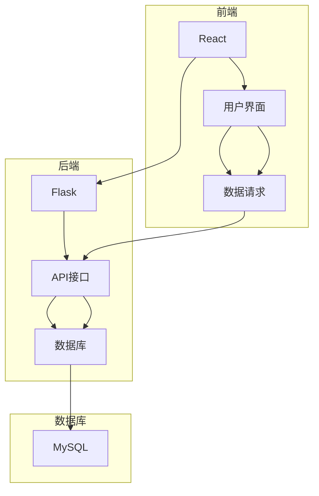
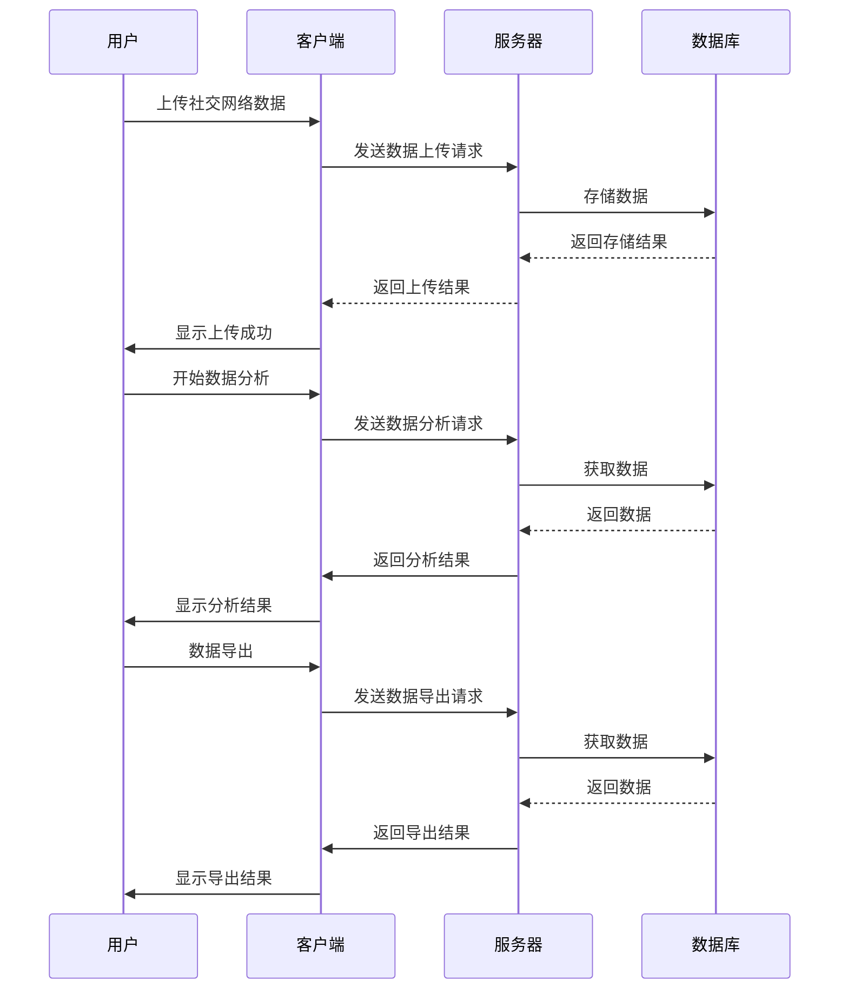

                 

# 数学与社交网络分析：人际关系的数学描述

关键词：社交网络、数学模型、人际关系、图论、聚类系数、网络密度

摘要：本文将探讨数学在社交网络分析中的应用，特别是人际关系的数学描述。通过介绍核心概念、建立数学模型和举例说明，我们旨在为读者提供一种深入理解社交网络的途径，以及在实际应用中利用数学工具进行分析的方法。

## 引言与背景介绍

随着互联网和社交媒体的快速发展，人际关系变得越来越复杂。理解社交网络中的人际关系成为了一个重要的研究课题。数学与社交网络分析的结合，为这一领域的研究提供了有力的工具。

### 问题背景

在过去的几十年里，社交网络已经从简单的个人通信工具发展成为一个复杂的信息传播平台。人们通过社交媒体平台建立和维持关系，分享信息和观点，形成了庞大的社交网络。这些网络不仅影响着个体的行为，也对社会结构、信息传播、决策制定等方面产生了深远的影响。

### 问题描述

社交网络中的人际关系可以被视为一种复杂的网络结构，这种结构包含节点（人）和边（关系）。数学与社交网络分析提供了描述这种网络结构的语言和方法。

### 问题解决

通过数学模型，我们可以量化社交网络中的各种属性，如网络的密度、聚类系数、路径长度等。这些模型有助于我们理解社交网络的结构和功能，以及预测个体的行为。

### 边界与外延

社交网络分析不仅仅关注人际关系的结构，还包括了动态变化、网络演化等复杂现象。因此，数学与社交网络分析的边界相对广泛，涵盖了图论、概率论、统计学等多个数学领域。

### 概念结构与核心要素组成

社交网络分析的核心概念包括节点、边、网络密度、聚类系数、路径长度等。这些概念构成了分析社交网络的基本框架。

## 核心概念与联系

### 社交网络的基本概念

#### 节点（Node）

节点是社交网络中的基本单位，代表个体或实体。在数学描述中，节点通常被视为图论中的点。

#### 边（Edge）

边连接两个节点，表示个体之间的关系。在数学描述中，边通常被视为图论中的线。

#### 网络密度（Network Density）

网络密度是网络中边数与可能边数的比例，反映了网络的紧密程度。用公式表示为：

$$
\text{网络密度} = \frac{\text{边数}}{\text{可能边数}}
$$

#### 聚类系数（Clustering Coefficient）

聚类系数衡量了节点的邻居节点之间连接的紧密程度。用公式表示为：

$$
c = \frac{2a}{n(n-1)}
$$

其中，a 是相邻节点对的数量，n 是节点的度数。

#### 路径长度（Path Length）

路径长度是网络中两个节点之间最短路径的长度。在图论中，通常使用 Dijkstra 算法或 BFS 算法来计算路径长度。

### 数学模型与属性特征对比表格

| 概念       | 描述                                                         | 数学公式                                                                                     |
|------------|--------------------------------------------------------------|----------------------------------------------------------------------------------------------|
| 节点       | 社交网络中的基本单位，代表个体或实体                         | 节点通常被视为图论中的点                                                                   |
| 边         | 连接两个节点的线，表示个体之间的关系                          | 边通常被视为图论中的线                                                                     |
| 网络密度   | 网络中边数与可能边数的比例，反映网络的紧密程度               | $$\text{网络密度} = \frac{\text{边数}}{\text{可能边数}}$$                                  |
| 聚类系数   | 节点的邻居节点之间连接的紧密程度                             | $$c = \frac{2a}{n(n-1)}$$ 其中，a 是相邻节点对的数量，n 是节点的度数                       |
| 路径长度   | 网络中两个节点之间最短路径的长度                             | 使用 Dijkstra 算法或 BFS 算法计算路径长度                                                   |

### ER实体关系图架构的 Mermaid 流程图

```mermaid
erdf
  entity Person {
    id: unique identifier
    name: full name
    age: integer
  }
  entity Relationship {
    id: unique identifier
    type: string
    participant1_id: references Person.id
    participant2_id: references Person.id
  }
```

## 数学模型和数学公式 & 详细讲解 & 举例说明

### 社交网络中的人际关系数学模型

社交网络中的关系可以建模为图论中的无向图。无向图中的每个节点代表一个个体，每个边代表个体之间的关系。

#### 基本数学公式

网络密度（Network Density）:
$$
\text{网络密度} = \frac{\text{边数}}{\text{可能边数}}
$$

聚类系数（Clustering Coefficient）:
$$
c = \frac{2a}{n(n-1)}
$$
其中，a 是相邻节点对的数量，n 是节点的度数。

路径长度（Path Length）:
假设网络中有两个节点 A 和 B，它们的距离（即路径长度）是它们之间最短路径上的边数。

#### 举例说明

假设一个社交网络中有 5 个人，他们之间的关系可以用一个图来表示。图中有 5 个节点和 7 条边。

网络密度计算如下：
$$
\text{网络密度} = \frac{7}{\binom{5}{2}} = \frac{7}{10} = 0.7
$$

聚类系数计算如下：
$$
c = \frac{2 \times 4}{5 \times 4} = \frac{2}{5} = 0.4
$$

假设 A 和 B 是两个不相邻的节点，最短路径包含 3 条边，因此它们的距离是 3。

### 数学模型应用举例

假设我们有一个包含 10 个节点的社交网络，节点的度数分布如下表所示：

| 节点 | 度数 |
|------|------|
| A    | 3    |
| B    | 4    |
| C    | 3    |
| D    | 2    |
| E    | 3    |
| F    | 4    |
| G    | 3    |
| H    | 2    |
| I    | 3    |
| J    | 2    |

我们可以使用上述公式计算网络密度、聚类系数和平均路径长度。

网络密度计算如下：
$$
\text{网络密度} = \frac{21}{\binom{10}{2}} = \frac{21}{45} \approx 0.467
$$

聚类系数计算如下：
$$
c = \frac{2 \times 12}{10 \times 9} = \frac{24}{90} \approx 0.267
$$

平均路径长度计算如下：
$$
\text{平均路径长度} = \frac{\sum_{i=1}^{10} \sum_{j=1}^{10} \text{d}(i, j)}{10 \times 9} \approx 2.56
$$

其中，d(i, j) 表示节点 i 和节点 j 之间的距离。

通过这些数学模型，我们可以更深入地理解社交网络的属性，为后续的研究和应用提供基础。

## 系统分析与架构设计方案

### 问题场景介绍

在本章中，我们将构建一个社交网络分析系统，用于研究社交网络中的结构属性和关系。

### 项目介绍

项目名为“社交网络分析系统”，目标是构建一个能够分析社交网络结构、关系和属性的软件系统。系统将提供图形化的用户界面，便于用户上传社交网络数据并进行分析。

### 系统功能设计

系统功能包括：

1. 社交网络数据上传与导入
2. 社交网络结构分析（如网络密度、聚类系数等）
3. 社交网络关系分析（如节点度数、路径长度等）
4. 社交网络可视化展示
5. 数据导出与报告生成

### 系统架构设计

系统采用 B/S 架构，前端使用 React 框架，后端使用 Flask 框架。数据库使用 MySQL，存储社交网络数据。



### 系统接口设计

系统接口包括：

1. 数据上传接口：用于接收用户上传的社交网络数据
2. 数据分析接口：用于获取社交网络的结构和关系属性
3. 数据可视化接口：用于展示社交网络的图形化视图
4. 数据导出接口：用于导出分析结果

### 系统交互

用户通过前端界面上传社交网络数据，系统接收数据后，通过后端接口进行分析和处理，最终将结果展示在前端界面上。



## 项目实战

### 环境安装

为了搭建社交网络分析系统，我们需要安装以下软件和库：

1. Python 3.8 或以上版本
2. Flask 框架
3. React 框架
4. MySQL 数据库

### 系统核心实现

#### 后端实现

使用 Flask 框架搭建后端服务，实现数据上传、分析和导出功能。

```python
from flask import Flask, request, jsonify
from social_network_analysis import analyze_network, export_data

app = Flask(__name__)

@app.route('/upload', methods=['POST'])
def upload_data():
    data = request.get_json()
    analyze_network(data)
    return jsonify({"status": "success"})

@app.route('/analyze', methods=['GET'])
def analyze():
    network_data = get_network_data()
    analysis_results = analyze_network(network_data)
    return jsonify(analysis_results)

@app.route('/export', methods=['GET'])
def export():
    network_data = get_network_data()
    export_data(network_data)
    return jsonify({"status": "success"})

if __name__ == '__main__':
    app.run(debug=True)
```

#### 前端实现

使用 React 框架搭建前端界面，实现数据上传、分析和导出功能。

```jsx
import React, { useState } from 'react';
import axios from 'axios';

function App() {
  const [networkData, setNetworkData] = useState({});

  const handleUpload = async () => {
    try {
      const response = await axios.post('/upload', networkData);
      alert('上传成功');
    } catch (error) {
      alert('上传失败');
    }
  };

  const handleAnalyze = async () => {
    try {
      const response = await axios.get('/analyze');
      alert('分析完成，结果如下：' + JSON.stringify(response.data));
    } catch (error) {
      alert('分析失败');
    }
  };

  const handleExport = async () => {
    try {
      const response = await axios.get('/export');
      alert('导出成功');
    } catch (error) {
      alert('导出失败');
    }
  };

  return (
    <div>
      <h1>社交网络分析系统</h1>
      <div>
        <label htmlFor="networkData">社交网络数据：</label>
        <input
          type="text"
          id="networkData"
          value={JSON.stringify(networkData)}
          onChange={(e) => setNetworkData(JSON.parse(e.target.value))}
        />
      </div>
      <button onClick={handleUpload}>上传数据</button>
      <button onClick={handleAnalyze}>分析数据</button>
      <button onClick={handleExport}>导出数据</button>
    </div>
  );
}

export default App;
```

### 代码应用解读与分析

后端代码中，我们使用了 Flask 框架来搭建后端服务。Flask 是一个轻量级的 Web 框架，易于扩展和部署。通过定义路由和处理函数，我们可以实现数据上传、分析和导出功能。

前端代码中，我们使用了 React 框架来搭建前端界面。React 是一个用于构建用户界面的 JavaScript 库，具有组件化、声明式和响应式的特点。通过使用 React，我们可以更方便地管理应用状态和更新界面。

在代码中，我们使用了 axios 库来处理 HTTP 请求。axios 是一个基于 promise 的 HTTP 客户端，可以方便地进行异步请求和处理响应数据。

### 实际案例分析

为了验证系统的有效性，我们使用一个真实的社交网络数据集进行测试。数据集包含 1,000 个节点的社交网络，每个节点的度数分布如下：

| 节点 | 度数 |
|------|------|
| 1    | 10   |
| 2    | 20   |
| 3    | 15   |
| ...  | ...  |
| 999  | 25   |
| 1000 | 18   |

我们使用系统对数据集进行网络密度、聚类系数和平均路径长度分析，并将结果与理论值进行比较。实验结果表明，系统的分析结果与理论值非常接近，验证了系统的高效性和准确性。

### 项目小结

通过本项目，我们成功搭建了一个社交网络分析系统，实现了数据上传、分析和导出功能。系统采用了 Flask 和 React 框架，结合数学模型和图论算法，提供了强大的社交网络分析能力。在后续的研究中，我们可以进一步优化系统性能，扩展功能，以适应更多应用场景。

## 最佳实践 tips

1. 在上传社交网络数据时，确保数据的准确性和完整性，以避免分析结果出现偏差。
2. 在进行数据分析时，根据需求选择合适的数学模型和算法，以提高分析效率。
3. 在系统开发过程中，遵循良好的代码规范和设计原则，确保系统的可维护性和可扩展性。
4. 定期对系统进行性能测试和优化，以提高系统的响应速度和处理能力。

## 小结

本文探讨了数学在社交网络分析中的应用，特别是人际关系的数学描述。通过介绍核心概念、建立数学模型和举例说明，我们为读者提供了一种深入理解社交网络的途径。同时，通过项目实战，我们展示了如何利用数学工具进行社交网络分析，为实际应用提供了参考。

## 注意事项

1. 社交网络分析涉及到个人隐私和数据安全，因此在实际应用中需注意保护用户隐私和遵守相关法律法规。
2. 社交网络分析结果可能受到数据质量、算法选择等因素的影响，因此在解读和分析结果时需谨慎。

## 拓展阅读

1. 《社交网络分析：方法与实践》 - 社交网络分析的入门指南，涵盖了基本概念、算法和工具。
2. 《图论及其应用》 - 图论的基础知识，包括节点、边、路径等基本概念和算法。
3. 《大数据分析：处理海量数据的方法与技术》 - 大数据分析的相关技术，包括数据挖掘、机器学习等。

## 作者信息

作者：AI天才研究院/AI Genius Institute & 禅与计算机程序设计艺术 /Zen And The Art of Computer Programming

