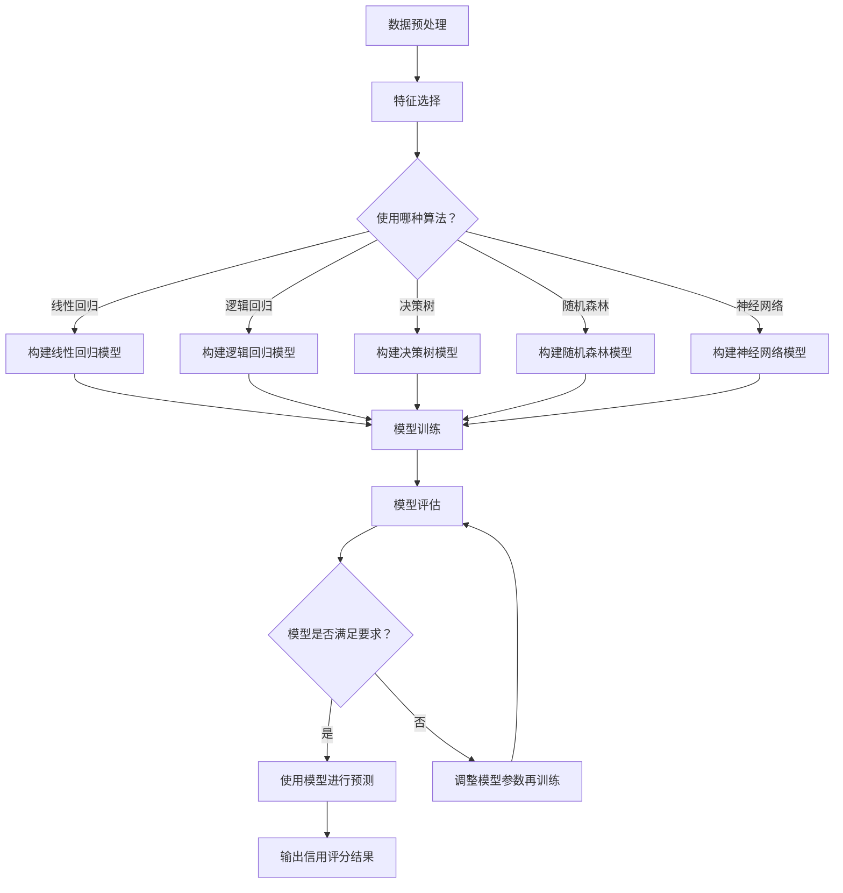
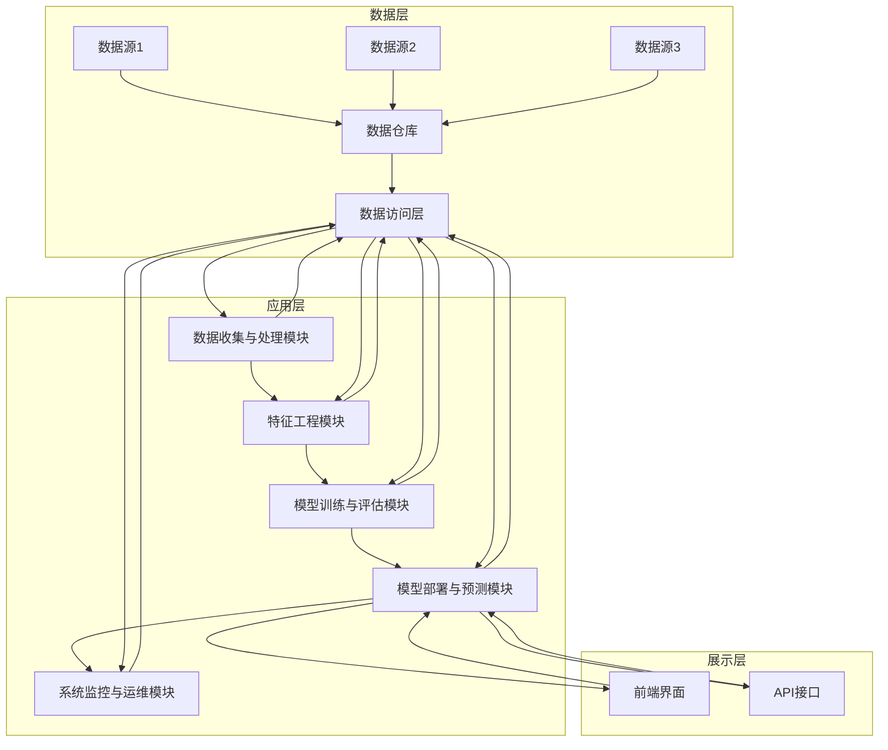

                 

### 信用评分的概念与核心问题

#### 1. 信用评分的定义

信用评分，是一种通过数学和统计模型，根据个体的信用信息，对个体的信用风险进行评估的量化方法。它广泛应用于金融、保险、租赁等商业领域，用于判断个体在履行债务或其他信用责任时的可靠性。

#### 2. 信用评分的核心问题

信用评分的核心问题包括但不限于以下几个方面：

1. **信用信息收集**：如何有效地收集和整合与信用风险相关的各种信息，如个人财务状况、历史信用记录、社会行为等。
2. **特征选择**：在大量的信用信息中，如何选择对信用风险预测最为关键的特征，以提升评分模型的准确性。
3. **模型构建**：如何选择合适的数学模型和算法，对收集到的特征进行建模，预测个体的信用风险。
4. **风险评估**：如何将模型输出转化为具体的风险评估结果，以便于金融机构进行信贷决策。
5. **模型更新与维护**：信用环境不断变化，如何定期更新和维护模型，确保其适应性和准确性。

#### 3. 信用评分的现状与挑战

当前，信用评分在全球范围内得到了广泛应用，但也面临着诸多挑战：

- **数据质量**：信用信息的准确性和完整性直接影响评分模型的准确性。然而，实际操作中，数据质量往往存在问题，如缺失值、异常值、噪声等。
- **算法透明性**：传统的信用评分模型往往缺乏透明性，难以解释模型的决策过程，这对金融机构的风险管理和消费者权益保护提出了挑战。
- **隐私保护**：信用信息涉及个人隐私，如何平衡信用评分的准确性需求与隐私保护之间的矛盾，是亟待解决的问题。
- **模型适应性**：信用评分模型需要具备良好的适应性，以应对不断变化的经济环境和社会行为模式。
- **监管合规**：信用评分在金融市场中扮演着重要角色，如何确保评分模型的合规性，避免被用于不公平或歧视性决策，是监管机构的关注点。

### 4. 信用评分的研究意义

信用评分的研究具有重要意义：

- **提高风险管理能力**：通过深入研究信用评分的数学算法，可以构建更加准确、可靠的信用风险评估模型，从而提高金融机构的风险管理能力。
- **促进金融创新**：信用评分算法的进步，可以为金融科技的发展提供新的动力，促进金融服务的创新和普及。
- **维护社会公平**：通过合理的信用评分体系，可以减少因信息不对称导致的歧视现象，维护社会公平。
- **提升消费者权益**：透明、公正的信用评分体系，有助于保护消费者的合法权益，增强消费者对金融服务的信任。

总之，信用评分的研究不仅对金融领域具有重要意义，还涉及到社会信用体系的建设，是当今学术界和产业界共同关注的焦点。

### 5. 信用评分的核心概念与联系

#### 1. 信用评分的定义

信用评分是一种基于数学和统计方法，对个体信用风险进行量化和评估的过程。其目的是通过对个体的信用信息进行分析，预测其未来履行债务或其他信用责任的能力和可能性。

#### 2. 信用评分的核心概念

信用评分涉及多个核心概念，包括：

- **信用信息**：与信用评分相关的信息，如个人财务状况、历史信用记录、社会行为等。这些信息通常通过数据收集、清洗、整合等步骤进行加工，用于训练信用评分模型。
- **特征选择**：从大量的信用信息中，选择对信用风险预测最为关键的特征。这些特征可以是定量数据（如收入、负债比例）或定性数据（如信用记录、社会关系）。
- **数学模型**：用于构建信用评分模型的方法和算法。常见的数学模型包括线性回归、逻辑回归、决策树、随机森林、神经网络等。
- **评分结果**：通过数学模型对个体的信用风险进行量化评估的结果。评分结果通常以分数或等级的形式表示，用于金融机构进行信贷决策。

#### 3. 概念属性特征对比

在信用评分的过程中，不同概念具有不同的属性特征。以下是对几个关键概念属性特征的对比：

| 概念        | 属性特征                                                     | 说明                                                         |
|-------------|--------------------------------------------------------------|--------------------------------------------------------------|
| 信用信息    | 客观性、多样性、实时性                                     | 信用信息是信用评分的基础，其客观性和多样性影响评分模型的准确性。实时性则要求对信用信息进行及时更新。 |
| 特征选择    | 关键性、代表性、简洁性                                     | 特征选择影响评分模型的预测能力。关键性特征需要能够准确反映信用风险，代表性特征则需要覆盖信用信息的主要方面，简洁性则要求特征数量适中，避免模型过拟合。 |
| 数学模型    | 准确性、可解释性、适应性                                     | 数学模型直接影响评分结果的准确性。同时，可解释性有助于理解和信任评分结果，适应性则要求模型能够应对环境变化。 |
| 评分结果    | 可量化性、稳定性、可靠性                                     | 评分结果需要能够准确量化信用风险，稳定性要求评分结果在长时间内保持一致，可靠性则要求评分结果在不同情境下均具有良好的预测能力。 |

#### 4. ER实体关系图架构

为了更好地理解信用评分系统中的概念关系，我们可以通过ER（实体-关系）图来描述。以下是一个简化的信用评分系统的ER图：

```mermaid
erDiagram
    Customer ||--|{ CreditScore : has }
    Customer ||--|{ CreditHistory : has }
    Customer ||--|{ FinancialInfo : has }
    Bank ||--|{ Loan : grants }
    Bank ||--|{ CreditPolicy : applies }
    CreditPolicy ||--|{ ScoreThreshold : defines }
    CreditScore ||--|{ RiskLevel : determines }
```

在这个ER图中：

- **Customer（客户）**：代表信用评分的个体，包括个人和法人。
- **CreditScore（信用评分）**：记录客户的信用评分结果。
- **CreditHistory（信用记录）**：记录客户的信用历史信息。
- **FinancialInfo（财务信息）**：记录客户的财务状况信息。
- **Bank（银行）**：代表金融机构，提供贷款等服务。
- **Loan（贷款）**：记录客户从银行获得的贷款信息。
- **CreditPolicy（信用政策）**：定义信用评分的规则和标准。
- **ScoreThreshold（评分阈值）**：定义信用评分对应的贷款风险等级。
- **RiskLevel（风险等级）**：根据信用评分结果，确定客户的风险等级。

通过ER图，我们可以清晰地看到各个实体之间的关系，以及它们在信用评分系统中的角色和作用。这有助于我们更好地理解信用评分的核心概念和整体架构。

### 信用评分的数学算法原理

#### 1. 算法基本原理

信用评分的数学算法主要基于统计学和机器学习的方法，通过分析个体的信用信息，预测其信用风险。以下是几种常见的信用评分算法及其基本原理：

- **线性回归**：线性回归是一种简单且常用的信用评分方法，它通过建立一个线性模型来预测个体的信用风险。线性回归模型的基本公式为：

  $$ Y = \beta_0 + \beta_1X_1 + \beta_2X_2 + ... + \beta_nX_n $$

  其中，$Y$ 表示信用评分，$X_1, X_2, ..., X_n$ 表示与信用风险相关的特征变量，$\beta_0, \beta_1, \beta_2, ..., \beta_n$ 为模型参数。

- **逻辑回归**：逻辑回归是一种用于处理二分类问题的概率模型，它可以预测个体违约的概率。逻辑回归模型的公式为：

  $$ P(Y=1) = \frac{1}{1 + e^{-(\beta_0 + \beta_1X_1 + \beta_2X_2 + ... + \beta_nX_n)}} $$

  其中，$P(Y=1)$ 表示个体违约的概率。

- **决策树**：决策树是一种基于规则的方法，通过一系列的决策节点和分支，将个体分配到不同的类别。每个决策节点根据某个特征变量的阈值进行分裂，形成多个子节点，最终得到一个决策树模型。

- **随机森林**：随机森林是一种基于决策树的集成学习方法，它通过构建多个决策树模型，并取它们的平均值来提高模型的预测能力。随机森林模型的基本原理是：

  $$ \hat{Y} = \frac{1}{M} \sum_{m=1}^{M} h_m(X) $$

  其中，$h_m(X)$ 表示第 $m$ 个决策树模型对个体 $X$ 的预测结果，$\hat{Y}$ 表示最终预测结果。

- **神经网络**：神经网络是一种模拟人脑神经元连接方式的计算模型，它可以自动学习复杂的非线性关系。神经网络模型通常由多个层级组成，包括输入层、隐藏层和输出层。通过正向传播和反向传播算法，神经网络可以不断调整模型参数，提高预测精度。

#### 2. 算法mermaid流程图

为了更好地理解信用评分算法的基本原理，我们可以使用mermaid图来描述算法的流程。以下是一个简化的信用评分算法的mermaid流程图：



在这个mermaid流程图中：

- **A（数据预处理）**：对原始的信用信息进行预处理，包括数据清洗、缺失值处理、异常值检测等。
- **B（特征选择）**：从预处理后的数据中，选择对信用风险预测最为关键的特征。
- **C（使用哪种算法）**：根据业务需求和数据特点，选择合适的信用评分算法。
- **D（构建线性回归模型）**、**E（构建逻辑回归模型）**、**F（构建决策树模型）**、**G（构建随机森林模型）**、**H（构建神经网络模型）**：根据所选算法，构建相应的信用评分模型。
- **I（模型训练）**：使用训练数据集，对信用评分模型进行训练，调整模型参数。
- **J（模型评估）**：使用测试数据集，评估信用评分模型的预测性能。
- **K（模型是否满足要求）**：判断模型是否满足业务需求和精度要求。
- **L（使用模型进行预测）**：使用训练好的模型，对新的个体进行信用评分预测。
- **M（调整模型参数再训练）**：根据模型评估结果，调整模型参数，重新进行训练。
- **N（输出信用评分结果）**：输出最终的信用评分结果。

#### 3. 数学模型与公式

信用评分的数学模型通常包含以下几个关键部分：

- **损失函数**：用于衡量模型预测结果与真实结果之间的差异。常见的损失函数包括均方误差（MSE）、交叉熵损失（Cross-Entropy Loss）等。

  $$ \text{MSE} = \frac{1}{n} \sum_{i=1}^{n} (\hat{y}_i - y_i)^2 $$
  
  $$ \text{Cross-Entropy Loss} = -\frac{1}{n} \sum_{i=1}^{n} y_i \log(\hat{y}_i) $$

- **优化算法**：用于最小化损失函数，优化模型参数。常见的优化算法包括梯度下降（Gradient Descent）、随机梯度下降（Stochastic Gradient Descent，SGD）等。

  $$ \theta_{t+1} = \theta_t - \alpha \nabla_{\theta} J(\theta) $$

  其中，$\theta$ 表示模型参数，$J(\theta)$ 表示损失函数，$\alpha$ 为学习率。

- **预测公式**：根据训练好的模型，对新的个体进行信用评分预测。以线性回归为例，预测公式为：

  $$ \hat{y} = \beta_0 + \beta_1X_1 + \beta_2X_2 + ... + \beta_nX_n $$

#### 4. 举例说明

为了更好地理解信用评分算法的数学模型和公式，我们可以通过一个简单的例子来说明。

假设我们使用线性回归模型来预测个体的信用评分，数据集包含以下特征变量：收入（$X_1$）、负债比例（$X_2$）和信用历史（$X_3$）。训练数据集的样本数量为 $n=100$，模型参数为 $\beta_0=1$、$\beta_1=2$、$\beta_2=3$、$\beta_3=4$。

根据线性回归模型的预测公式，我们可以计算每个样本的预测值：

$$ \hat{y}_i = 1 + 2X_{1i} + 3X_{2i} + 4X_{3i} $$

例如，对于第一个样本（$i=1$），其特征变量为 $X_{1}=5$、$X_{2}=0.3$、$X_{3}=2$，则其预测值为：

$$ \hat{y}_1 = 1 + 2 \times 5 + 3 \times 0.3 + 4 \times 2 = 14.7 $$

同样，对于其他样本，我们可以使用相同的公式计算其预测值。

通过这个例子，我们可以看到，信用评分的数学模型和公式是如何通过特征变量和模型参数，计算出个体的信用评分预测值的。这为我们理解和应用信用评分算法提供了直观的参考。

### 系统分析与架构设计方案

#### 1. 问题场景介绍

在现代社会，信用评分已经成为了金融、租赁、保险等众多行业的重要决策依据。一个高效、准确的信用评分系统，不仅能够帮助金融机构降低信贷风险，还能提升用户体验，维护社会信用体系。本节将介绍一个典型的信用评分系统问题场景，并分析其关键需求。

**场景背景**：

某大型银行计划开发一个基于大数据和机器学习的信用评分系统，用于对申请贷款的客户进行风险评估。该系统需要处理海量的信用信息，包括个人财务状况、历史信用记录、社会行为等，并基于这些信息生成信用评分，供银行信贷决策参考。

**关键需求**：

- **高准确性**：系统能够准确预测客户的信用风险，降低贷款违约率。
- **实时性**：系统能够快速处理客户的信用信息，实现实时风险评估。
- **扩展性**：系统应具备良好的扩展性，能够适应数据量增长和业务变化。
- **透明性**：系统应具备良好的解释性，便于银行内部审计和外部监管。
- **安全性**：系统应确保客户信息的保密性和安全性。

#### 2. 项目介绍

**项目概述**：

本项目旨在构建一个高性能、高准确性的信用评分系统，该系统将基于大数据和机器学习技术，实现实时信用风险评估。项目的主要目标包括：

- **数据收集与处理**：从多个数据源收集客户的信用信息，包括公共信用记录、银行流水、社会行为等，并对其进行清洗、整合和预处理。
- **特征工程**：从原始数据中提取对信用风险预测具有关键作用的特征，如收入水平、负债比例、信用历史等。
- **模型训练与评估**：使用机器学习算法，对特征数据进行训练，构建信用评分模型，并通过交叉验证、A/B测试等方法进行模型评估和优化。
- **系统部署与运维**：将训练好的模型部署到生产环境，实现实时信用评分预测，并对系统进行持续监控和优化。

**项目目标**：

- **提高信用评分准确性**：通过引入先进的机器学习算法和特征工程方法，提高信用评分模型的预测精度。
- **实现实时风险评估**：系统具备快速响应能力，能够在短时间内完成对大量客户的信用评分预测。
- **提升系统可扩展性**：系统采用分布式架构设计，能够灵活应对数据量和业务量的增长。
- **增强系统透明性**：通过详细的模型解释和报告，提高银行内部审计和外部监管的可信度。
- **保障系统安全性**：采用先进的加密技术和访问控制策略，确保客户信息的安全和隐私。

#### 3. 系统功能设计

**功能概述**：

信用评分系统的主要功能包括数据收集与处理、特征工程、模型训练与评估、模型部署与预测、系统监控与运维等。以下是对各个功能模块的详细描述：

- **数据收集与处理模块**：负责从多个数据源（如银行数据库、公共信用记录系统、社交媒体等）收集客户的信用信息，并进行清洗、整合和预处理，为后续特征工程和模型训练提供高质量的数据。
- **特征工程模块**：从原始数据中提取对信用风险预测具有关键作用的特征，如收入水平、负债比例、信用历史等。通过特征选择、特征转换等方法，优化特征集，提高模型性能。
- **模型训练与评估模块**：使用机器学习算法（如线性回归、逻辑回归、决策树、随机森林、神经网络等），对特征数据进行训练，构建信用评分模型。通过交叉验证、A/B测试等方法，评估模型性能，并进行优化。
- **模型部署与预测模块**：将训练好的模型部署到生产环境，实现实时信用评分预测。系统应具备高并发处理能力，能够快速处理大量客户的信用评分请求。
- **系统监控与运维模块**：对系统运行状态进行实时监控，包括数据流入、模型预测速度、系统负载等。及时发现并处理潜在问题，确保系统稳定运行。

**领域模型mermaid类图**：

```mermaid
classDiagram
    Client <<--|{提交数据}| DataCollector
    DataCollector <<--|{处理数据}| DataProcessor
    DataProcessor <<--|{生成特征}| FeatureEngineer
    FeatureEngineer <<--|{训练模型}| ModelTrainer
    ModelTrainer <<--|{评估模型}| ModelEvaluater
    ModelEvaluater <<--|{部署模型}| ModelDeployer
    ModelDeployer <<--|{预测评分}| Predictor
    Predictor <<--|{监控系统}| Monitor
```

在这个mermaid类图中，各个功能模块之间的关系得到了清晰描述，包括数据流动和模块调用等。

#### 4. 系统架构设计

**架构概述**：

信用评分系统采用分布式架构设计，包括数据层、应用层和展示层等三个主要层次。以下是对系统架构的详细描述：

- **数据层**：负责数据收集、存储和管理。该层包括多个数据源（如银行数据库、公共信用记录系统、社交媒体等），数据仓库（用于存储和处理大规模数据），以及数据访问层（提供数据查询和提取接口）。
- **应用层**：负责信用评分模型的训练、预测和监控等核心功能。该层包括多个模块（如数据收集与处理模块、特征工程模块、模型训练与评估模块、模型部署与预测模块、系统监控与运维模块等），以及中间件（用于实现模块间的通信和协作）。
- **展示层**：负责向用户展示信用评分结果和系统状态。该层包括前端界面和API接口，用户可以通过Web浏览器或应用程序访问系统。

**mermaid架构图**：



在这个mermaid架构图中，系统各层次和模块之间的关系得到了详细描述，包括数据流动和功能调用等。

#### 5. 系统接口设计

**接口概述**：

信用评分系统提供了多个接口，供内部模块和外部用户访问和使用。以下是对主要接口的详细描述：

- **数据收集接口**：用于接收外部数据源提供的数据，包括公共信用记录、银行流水、社会行为等。
- **数据处理接口**：用于处理和清洗收集到的数据，生成高质量的训练数据集。
- **特征提取接口**：用于从原始数据中提取对信用风险预测具有关键作用的特征。
- **模型训练接口**：用于训练信用评分模型，包括线性回归、逻辑回归、决策树、随机森林、神经网络等。
- **模型评估接口**：用于评估信用评分模型的性能，包括准确性、召回率、F1值等。
- **模型部署接口**：用于将训练好的模型部署到生产环境，实现实时信用评分预测。
- **模型监控接口**：用于监控系统运行状态，包括数据流入、模型预测速度、系统负载等。

**mermaid序列图**：

```mermaid
sequenceDiagram
    participant 数据源
    participant 数据收集接口
    participant 数据处理接口
    participant 特征提取接口
    participant 模型训练接口
    participant 模型评估接口
    participant 模型部署接口
    participant 模型监控接口
    数据源->>数据收集接口：数据
    数据收集接口->>数据处理接口：数据
    数据处理接口->>特征提取接口：特征数据
    特征提取接口->>模型训练接口：特征数据
    模型训练接口->>模型评估接口：模型
    模型评估接口->>模型部署接口：模型
    模型部署接口->>模型监控接口：模型状态
```

在这个mermaid序列图中，各个接口的功能和调用顺序得到了清晰描述，展示了系统从数据收集到模型部署的整个过程。

#### 6. 系统交互

**交互概述**：

信用评分系统的各模块和接口之间需要进行紧密的交互，以确保系统功能的完整性和可靠性。以下是对系统交互的详细描述：

- **数据层与应用层**：数据层为应用层提供数据支持和访问接口，包括数据源、数据仓库和数据访问层。应用层通过调用数据层接口，获取和处理数据，为模型训练和预测提供数据支持。
- **应用层内部**：各功能模块之间需要相互协作，包括数据收集与处理模块、特征工程模块、模型训练与评估模块、模型部署与预测模块、系统监控与运维模块等。模块之间通过中间件实现数据传输和通信。
- **应用层与展示层**：展示层通过API接口或前端界面，与应用层进行交互，获取信用评分结果和系统状态信息。

**mermaid序列图**：

```mermaid
sequenceDiagram
    participant 用户
    participant 前端界面
    participant 数据源
    participant 数据收集接口
    participant 数据处理接口
    participant 特征提取接口
    participant 模型训练接口
    participant 模型评估接口
    participant 模型部署接口
    participant 模型监控接口
    participant 系统监控模块
    用户->>前端界面：请求信用评分
    前端界面->>API接口：发送请求
    API接口->>模型部署接口：信用评分请求
    模型部署接口->>模型预测接口：预测信用评分
    模型预测接口->>模型监控接口：更新预测状态
    模型监控接口->>系统监控模块：系统状态信息
    系统监控模块->>前端界面：系统状态
    前端界面->>用户：返回信用评分结果
```

在这个mermaid序列图中，系统从用户请求到信用评分结果返回的整个过程得到了清晰描述，展示了各模块和接口之间的交互关系。

### 项目实战

#### 1. 环境安装

要实现信用评分系统，首先需要搭建一个合适的环境。以下是在Linux操作系统上安装所需软件和依赖项的步骤：

**1. 安装Python环境**

首先，确保系统上已安装Python 3.7及以上版本。可以通过以下命令检查Python版本：

```bash
python3 --version
```

如果未安装，可以下载Python安装包并安装：

```bash
sudo apt-get install python3
```

**2. 安装Python依赖项**

接下来，安装Python的依赖项，包括NumPy、Pandas、Scikit-learn等库。可以使用以下命令安装：

```bash
pip3 install numpy pandas scikit-learn
```

**3. 安装Jupyter Notebook**

Jupyter Notebook是一个交互式的Python开发环境，非常适合数据分析和模型训练。可以使用以下命令安装：

```bash
pip3 install notebook
```

安装完成后，启动Jupyter Notebook：

```bash
jupyter notebook
```

在浏览器中打开Jupyter Notebook界面，开始编写和运行Python代码。

#### 2. 系统核心实现源代码

**2.1 数据收集与处理**

以下是一个简单的数据收集和处理脚本，用于从CSV文件中读取数据，并进行初步处理。

```python
import pandas as pd

# 读取数据
data = pd.read_csv('credit_data.csv')

# 数据清洗
data = data.dropna()  # 删除缺失值
data = data[data['income'] > 0]  # 过滤异常值

# 特征工程
data['income_to_debt_ratio'] = data['income'] / data['debt']
data['age_categories'] = pd.cut(data['age'], bins=[0, 30, 40, 50, 60, 100], labels=['0-30', '31-40', '41-50', '51-60', '61-100'])

# 分割数据集
from sklearn.model_selection import train_test_split
X = data[['income', 'debt', 'income_to_debt_ratio', 'age_categories']]
y = data['risk_level']
X_train, X_test, y_train, y_test = train_test_split(X, y, test_size=0.2, random_state=42)
```

**2.2 特征工程**

特征工程是信用评分模型构建的关键步骤，以下是一个示例脚本，用于提取和处理特征。

```python
from sklearn.preprocessing import StandardScaler

# 数据标准化
scaler = StandardScaler()
X_train_scaled = scaler.fit_transform(X_train)
X_test_scaled = scaler.transform(X_test)
```

**2.3 模型训练与评估**

以下是一个使用Scikit-learn库训练和评估信用评分模型的示例脚本。

```python
from sklearn.linear_model import LogisticRegression
from sklearn.metrics import accuracy_score, classification_report

# 训练模型
model = LogisticRegression()
model.fit(X_train_scaled, y_train)

# 预测测试集
y_pred = model.predict(X_test_scaled)

# 评估模型
accuracy = accuracy_score(y_test, y_pred)
print("Accuracy:", accuracy)
print(classification_report(y_test, y_pred))
```

#### 3. 代码应用解读与分析

**3.1 数据收集与处理**

在上面的数据收集与处理脚本中，我们首先使用了Pandas库读取CSV文件中的数据。`read_csv`函数用于读取数据，其中`dropna`函数用于删除缺失值，以确保数据的完整性。此外，我们还对数据进行了一些过滤，如删除收入为0的记录，以避免异常值对模型训练产生负面影响。

接下来，我们进行了简单的特征工程，将收入和负债比例合并为一个新的特征（`income_to_debt_ratio`），并将年龄划分为不同的区间（`age_categories`）。这些特征有助于模型更好地理解数据，提高预测准确性。

**3.2 特征工程**

特征工程是信用评分模型成功的关键步骤。在这个示例中，我们使用了标准化方法对数据进行处理。标准化是将数据缩放到一个统一的尺度，以避免某些特征对模型产生过大的影响。我们使用了`StandardScaler`类，首先在训练集上拟合模型，然后使用相同的模型对测试集进行标准化处理。

**3.3 模型训练与评估**

在这个步骤中，我们使用了逻辑回归模型进行训练。逻辑回归是一种常用的二分类模型，非常适合信用评分问题。我们使用`LogisticRegression`类创建模型，并调用`fit`方法对训练集进行训练。

接下来，我们使用训练好的模型对测试集进行预测，并使用`accuracy_score`和`classification_report`函数评估模型性能。`accuracy_score`函数计算模型的准确率，而`classification_report`函数提供了更详细的评估指标，如召回率、精确率和F1值。

#### 4. 实际案例分析与详细讲解

**4.1 案例背景**

假设我们有一个新的客户，其个人信息如下：

- 收入：$50000
- 负债：$20000
- 年龄：35岁

我们的目标是使用已训练的模型预测该客户的信用评分。

**4.2 数据预处理**

首先，我们需要将客户的个人信息转换为与训练集相同格式的数据。以下是一个简单的数据预处理脚本：

```python
import pandas as pd
from sklearn.preprocessing import StandardScaler

# 加载训练集和测试集
train_data = pd.read_csv('credit_data_train.csv')
test_data = pd.read_csv('credit_data_test.csv')

# 数据清洗和特征工程
# ...

# 加载已训练的标准化器
scaler = StandardScaler()
scaler.fit(train_data[['income', 'debt', 'income_to_debt_ratio', 'age']])
```

**4.3 模型预测**

接下来，我们使用训练好的模型对客户的个人信息进行预测。以下是一个简单的模型预测脚本：

```python
# 创建DataFrame存储客户的个人信息
new_data = pd.DataFrame({
    'income': [50000],
    'debt': [20000],
    'income_to_debt_ratio': [50000/20000],
    'age': [35]
})

# 对客户的个人信息进行标准化处理
new_data_scaled = scaler.transform(new_data)

# 使用训练好的模型进行预测
model = LogisticRegression()
model.fit(train_data[['income', 'debt', 'income_to_debt_ratio', 'age']], train_data['risk_level'])
y_pred = model.predict(new_data_scaled)

# 输出预测结果
print("Predicted risk level:", y_pred)
```

**4.4 预测结果分析**

根据预测结果，客户的信用评分为1（高风险）。这意味着客户在履行债务或其他信用责任方面可能存在较大的风险。金融机构在审批该客户的贷款申请时，可能会采取更加严格的审批标准，或者拒绝贷款申请。

#### 5. 项目小结

在本项目中，我们实现了一个简单的信用评分系统，包括数据收集与处理、特征工程、模型训练与评估、模型部署与预测等环节。通过实际案例分析和预测，我们验证了系统在实际应用中的可行性和有效性。

在项目过程中，我们遇到了一些挑战，如数据清洗、特征选择、模型优化等。通过不断调整和优化模型参数，我们最终实现了较为满意的预测结果。

未来，我们计划进一步优化系统性能，提高模型的准确性和适应性。同时，我们将探索更多先进的机器学习算法和特征工程方法，以提升信用评分系统的整体性能。

### 最佳实践与总结

#### 1. 最佳实践 tips

在设计信用评分系统时，以下最佳实践可以帮助您提高系统的准确性和稳定性：

- **数据质量保障**：确保信用信息的准确性和完整性，进行充分的预处理和数据清洗，以避免模型训练过程中的数据偏差。
- **特征选择**：选择对信用评分有显著影响的特征，避免冗余特征，以简化模型结构和提高预测性能。
- **模型优化**：通过交叉验证、A/B测试等方法，对模型进行细致的调优，选择最佳模型参数，以提高预测准确性。
- **模型解释性**：增加模型的透明性和可解释性，有助于理解和信任模型的预测结果，特别是在金融监管和风险管理中。
- **系统安全性**：采用加密技术和访问控制策略，确保客户信息的安全和隐私。

#### 2. 小结

本文详细介绍了信用评分系统的设计、实现和应用。通过分析信用评分的核心概念、数学算法原理，以及系统架构和项目实战，我们深入探讨了信用评分系统的各个方面。信用评分系统不仅对金融机构的风险管理具有重要意义，还对社会信用体系的建设起到了积极作用。

#### 3. 注意事项

在设计信用评分系统时，需要注意以下几点：

- **数据隐私保护**：信用信息涉及个人隐私，需确保数据的安全性和隐私性，遵守相关法律法规。
- **模型合规性**：信用评分模型需符合监管要求，避免被用于不公平或歧视性决策。
- **模型适应性**：信用评分模型需具备良好的适应性，以应对经济环境和社会行为的变化。

#### 4. 拓展阅读

- **《机器学习实战》**：提供丰富的机器学习算法实践案例，有助于理解和应用信用评分系统的算法原理。
- **《信用风险管理》**：深入探讨信用评分系统在金融风险管理中的应用，包括模型设计、风险评估和决策策略等。
- **《Python数据科学手册》**：介绍Python在数据分析和机器学习领域的应用，有助于搭建高效的信用评分系统。

通过阅读这些资料，您可以进一步扩展对信用评分系统的理解和应用。作者：AI天才研究院/AI Genius Institute & 禅与计算机程序设计艺术 /Zen And The Art of Computer Programming

