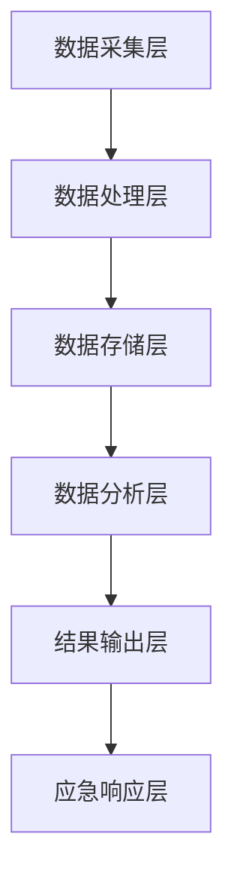
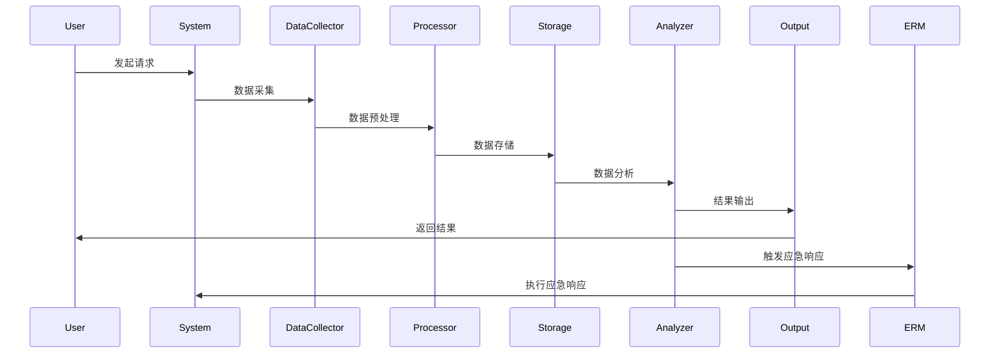

                 

## 第一部分：问题背景与概述

### 1.1. 问题背景

**1.1.1 社会现象的复杂性**

社会现象是多元、复杂和动态的，涵盖了人口流动、经济活动、文化传承、政治参与等多个方面。这些现象通常表现为大量的数据和信息，传统的社会科学方法，如问卷调查、访谈和案例分析，虽然能够提供深刻的见解，但往往难以全面、准确地描述和分析这些复杂的现象。例如，社会学中的社会网络分析，需要理解人与人之间的互动关系，这种关系是多层次、多维度的，难以用简单的文字描述。

**1.1.2 数学方法在社会科学中的应用**

为了克服传统方法的局限性，数学方法逐渐被引入到社会科学的研究中。数学模型、数据分析、统计学等方法的应用，使得研究者能够更加精确地量化社会现象，提取出其中的关键特征和规律。例如，在社会网络分析中，研究者可以使用图论模型来描述人与人之间的互动，通过计算节点之间的连接度、路径长度等指标，来分析社会网络的特性。

**1.1.3 数学与社会学的交叉领域**

数学与社会学的交叉领域，也被称为“社会数学”或“数理社会学”，正在逐渐形成。这个领域的研究者运用数学工具来探讨社会现象的本质和规律，从而为社会科学研究提供新的视角和方法。例如，博弈论在社会学中的应用，可以用来分析社会互动中的策略选择和结果预测。

### 1.2. 问题提出

如何在数学的框架下描述和分析社会现象？这不仅是理论上的挑战，也是实践中的需求。传统的社会科学方法往往依赖于定性分析，而数学方法则提供了定量的手段，如何将两者结合起来，发挥各自的优势，是一个值得探讨的问题。

### 1.3. 目标与内容

本书旨在介绍数学方法在社会现象研究中的应用，涵盖核心概念、理论框架、案例分析等内容。具体包括：

1. **核心概念**：介绍社会现象和数学方法的基本概念，如社会结构、社会行为、数学模型、数据分析等。
2. **理论框架**：建立数学与社会学交叉领域的基本理论框架，探讨数学方法在社会科学中的应用。
3. **案例分析**：通过具体案例，展示数学方法在社会现象研究中的实际应用，如社会网络分析、代理模型与博弈论、时间序列分析等。
4. **算法原理讲解**：详细讲解社会现象建模的算法原理，包括数据收集、数据清洗、社会现象建模、结果验证和模型优化等步骤。
5. **数学模型与公式讲解**：介绍常用的数学模型和公式，如线性回归、时间序列模型、社会网络分析模型等，并给出具体的案例。

通过这些内容的介绍，本书希望能够为读者提供一套系统、全面的数学方法在社会现象研究中的应用指南，帮助研究者更好地理解和分析社会现象。

### 1.4. 总结

数学方法在社会现象研究中的应用，不仅为社会科学研究提供了新的工具和方法，也促进了数学与社会科学的交叉发展。面对复杂多变的社会现象，数学的定量分析和模型构建能力显得尤为重要。本书将带领读者深入探讨这一领域，希望通过系统性的介绍，能够激发读者对数学与社会现象结合研究的兴趣和热情。

---

## 第二部分：核心概念与联系

### 2.1. 数学与社会学的核心概念

在探讨数学方法如何应用于社会学研究之前，我们需要先了解两个领域中的核心概念，并探讨它们之间的联系。

#### 2.1.1 数学概念

**数学模型**：数学模型是通过数学语言描述现实世界问题的抽象结构。它可以用来模拟现象、预测趋势或解释结果。数学模型通常由变量、方程和约束条件组成。

**数据分析**：数据分析是指使用统计学、概率论和数学优化等方法对数据进行分析，从中提取信息、发现规律和趋势。数据分析在数学研究中起到了关键作用，它不仅帮助研究者理解数据的含义，还能为决策提供依据。

**数学公式**：数学公式是数学表达式的标准化形式，用于描述数学模型中的关系和规则。常见的数学公式包括代数公式、微积分公式、概率分布公式等。

#### 2.1.2 社会学概念

**社会结构**：社会结构是指社会中各种社会关系和组织形式的排列和组合，包括家庭、阶级、政治结构等。社会结构研究关注社会关系是如何形成和维持的，以及这些结构对社会行为的影响。

**社会行为**：社会行为是指个体在社会互动中表现出来的行为模式，包括个体如何反应、如何与他人互动等。社会行为研究涉及个体心理、社会规范和文化背景等方面。

**社会规范**：社会规范是社会成员共同遵守的行为准则和价值观，它们对个体行为进行规范和约束。社会规范研究探讨规范是如何形成、变化和执行的。

### 2.2. 概念属性特征对比

| 数学概念       | 社会学概念       | 属性特征对比                                                       |
|----------------|------------------|----------------------------------------------------------------|
| 数学模型       | 社会结构         | 精确定义、可量化、形式化                                           |
| 数据分析       | 社会行为         | 客观性、系统性、解释性                                             |
| 数学公式       | 社会规范         | 普遍性、逻辑性、规范性                                             |

#### 特征对比

- **数学模型**侧重于用精确的数学语言描述现实问题，强调形式化和量化。
- **社会结构**关注社会关系和组织的构成方式，强调其社会性和复杂性。
- **数据分析**追求客观性和系统性，通过分析数据来发现规律和趋势。
- **社会行为**注重个体在社会互动中的行为模式，强调其动态性和多样性。
- **数学公式**强调普遍性和逻辑性，用于描述数学模型中的关系和规则。
- **社会规范**强调规范性，对个体行为进行规范和约束。

### 2.3. ER实体关系图架构

为了更好地理解数学与社会学概念之间的联系，我们可以使用ER（Entity-Relationship）实体关系图来展示这些概念之间的关系。

```mermaid
erDiagram
  社会现象 ||--|{ 数学模型 }|-- 预测分析
  社会现象 ||--|{ 数据分析 }|-- 结果验证
  数学模型 ||--|{ 数学公式 }|-- 解释应用
```

#### 说明：

- **社会现象**：作为核心实体，代表我们要研究的各种社会现象。
- **数学模型**：与**社会现象**相关，用于模拟和描述这些现象。
- **数据分析**：与**社会现象**和**数学模型**相关，用于对现象进行量化分析。
- **数学公式**：与**数学模型**相关，用于描述模型中的数学关系和规则。

通过上述ER图，我们可以清晰地看到数学方法在社会现象研究中的各个步骤和环节，以及这些环节之间的相互关系。

---

在这一部分，我们介绍了数学与社会学的核心概念，并对比了它们的属性特征。通过ER实体关系图，我们展示了这些概念之间的联系，为后续的数学方法在社会现象研究中的应用奠定了基础。在接下来的章节中，我们将深入探讨数学方法在具体社会现象研究中的应用，进一步展示数学与社会学结合的潜力和优势。

### 2.4. 社会现象与数学方法之间的互补性

社会现象的复杂性和多样性要求研究者采用多种方法来进行全面、深入的分析。数学方法作为一种强大的工具，能够在描述、解释和预测社会现象中发挥重要作用，同时也弥补了传统社会学研究方法的不足。

**1. 精确定义与形式化描述**

数学方法通过精确的数学模型和公式，能够对社会现象进行形式化描述。这种形式化描述不仅提高了研究过程的科学性和严谨性，还使得结果更具可重复性和可验证性。例如，社会网络分析中的图论模型，可以精确地描述个体之间的互动关系和结构，从而帮助研究者理解社会网络的动态特性。

**2. 量化分析与趋势预测**

社会现象通常涉及大量的数据，而数学方法中的数据分析技术能够对这些数据进行量化处理，提取出关键特征和趋势。例如，通过时间序列分析方法，研究者可以预测犯罪率、经济波动等社会现象的未来发展趋势。这种量化分析不仅提高了研究的精度，还能为政策制定者提供科学的决策依据。

**3. 客观性与系统性**

数学方法在研究中强调客观性和系统性，减少了主观偏见和情感因素的影响。通过数学模型和数据分析，研究者可以更加客观地描述和分析社会现象，从而得到更加可靠的研究结果。例如，社会行为研究中的统计分析，能够减少个体差异的影响，提供更加普遍的结论。

**4. 跨学科研究的桥梁**

数学方法不仅为社会学提供了强大的分析工具，也为跨学科研究搭建了桥梁。通过数学模型，社会学家可以与其他学科（如经济学、心理学、生物学等）进行更加深入的合作，从而促进跨学科的研究和知识融合。例如，在社会经济学研究中，数学模型可以用来分析市场行为和消费者选择，从而为政策制定提供科学依据。

**5. 提高研究效率**

数学方法的高效性和自动化特性，使得研究过程更加快速和高效。通过计算机模拟和算法优化，研究者可以在较短的时间内完成复杂的计算和分析任务，从而提高研究效率。例如，在社会网络分析中，计算机算法可以快速计算出网络中的关键节点和路径，大大提高了分析效率。

**6. 改善研究结果的解释性**

数学方法的应用不仅提高了研究的科学性，还增强了结果的可解释性。通过数学公式和模型，研究者能够更加直观地展示研究结果的内在机制和逻辑关系，从而提高结果的可解释性。例如，在代理模型和博弈论分析中，数学公式可以清晰地表达参与者之间的策略选择和结果预测，使得研究结果更加易于理解和接受。

总之，数学方法在社会现象研究中的应用，不仅弥补了传统社会学研究方法的不足，还带来了新的视角和工具，提高了研究的科学性、系统性和效率。通过数学与社会学的结合，我们可以更好地理解和分析复杂多变的社会现象，为社会发展和政策制定提供有力的支持。

### 2.5. 社会现象研究的挑战与数学方法的优势

在社会现象研究中，研究者常常面临一系列挑战，这些挑战包括数据的复杂性、社会现象的非线性特性以及变量之间的相互影响等。数学方法的应用在这些挑战面前展现出了显著的优势。

**1. 数据的复杂性**

社会现象涉及大量的数据，这些数据通常来源于多种渠道，如问卷调查、社会调查、统计数据等。这些数据往往呈现出复杂、多样和动态的特点，传统的社会科学方法难以全面、精确地处理这些数据。而数学方法，尤其是数据分析技术，能够有效地处理这些复杂的数据。通过统计分析、机器学习和数据挖掘等技术，研究者可以从大量数据中提取出有价值的信息和模式，从而更好地理解社会现象。

**2. 社会现象的非线性特性**

社会现象往往表现出非线性特性，即变量之间的关系不是线性的，而是复杂的、动态的。传统的社会科学方法难以捕捉这些非线性关系，而数学方法，如非线性动力学和复杂系统理论，可以有效地描述和解释这些非线性特性。例如，在社会网络分析中，节点之间的关系不仅受直接连接的影响，还受到间接连接和网络结构的影响，这些非线性关系可以通过数学模型来描述和解释。

**3. 变量之间的相互影响**

社会现象中的各种变量之间存在复杂的相互影响关系，这些关系往往是多维的、动态的。传统的社会科学方法难以全面考虑这些相互影响关系，而数学方法可以通过建立多变量模型来全面捕捉这些关系。例如，在社会经济学研究中，收入、教育水平、社会地位等变量之间存在复杂的相互影响，通过多变量线性回归、协方差分析和结构方程模型等方法，研究者可以更好地理解这些变量之间的关系。

**4. 提高预测精度和可靠性**

数学方法在社会现象研究中的应用，能够显著提高预测的精度和可靠性。通过建立数学模型和进行数据分析，研究者可以对社会现象的未来趋势进行预测。例如，通过时间序列分析，研究者可以预测犯罪率、人口增长率等社会现象的未来变化趋势，为政策制定者提供科学的决策依据。此外，数学方法的应用还可以减少预测中的不确定性和误差，提高预测结果的可靠性。

**5. 提升研究的系统性和综合性**

数学方法的应用使得社会现象研究更加系统和综合性。通过建立数学模型，研究者可以将社会现象分解成多个组成部分，并分析各个部分之间的相互作用。例如，在社会心理学研究中，通过建立社会心理模型，研究者可以同时考虑个体心理因素和社会环境因素对个体行为的影响，从而得到更加全面和深入的研究结果。

**6. 跨学科研究的支持**

数学方法在社会现象研究中的应用，也为跨学科研究提供了强有力的支持。数学工具和方法不仅能够应用于社会学领域，还可以应用于经济学、心理学、生物学等学科。例如，通过数学模型和数据分析，社会学家可以与经济学家合作，研究市场行为和消费者选择，从而为经济政策提供科学依据。这种跨学科的合作不仅拓宽了研究的视野，也促进了不同学科之间的知识交流和融合。

总之，数学方法在社会现象研究中的应用，克服了传统方法的局限性，提高了研究的科学性、精确性和系统性。通过数学与社会学的结合，研究者可以更好地理解和分析复杂多变的社会现象，为社会发展和政策制定提供有力的支持。

### 2.6. 总结

通过本文第二部分的探讨，我们了解了数学方法在社会现象研究中的核心概念及其重要性。数学模型、数据分析、数学公式等工具不仅能够精确描述和量化社会现象，还能够揭示变量之间的复杂关系，提高研究的系统性和综合性。社会结构、社会行为和社会规范等社会学概念与数学方法相结合，为研究者提供了全新的视角和工具。在接下来的部分，我们将进一步探讨数学方法在社会现象研究中的具体应用，通过案例分析展示数学方法如何解决实际问题。

---

## 第三部分：数学方法与社会现象分析

### 3.1. 社会网络分析

社会网络分析（Social Network Analysis，SNA）是一种通过数学方法研究社会关系及其结构的方法。它利用图论模型来描述个体之间的互动和关系，从而揭示社会网络的特性。

#### 3.1.1 社会网络分析的基本概念

**节点（Node）**：在社会网络中，节点代表个体，如人、组织或其他实体。

**边（Edge）**：边表示节点之间的联系或互动，可以是单向的或双向的。

**密度（Density）**：网络的密度是指边数与可能边数之比，用来衡量网络的紧密程度。

**聚类系数（Clustering Coefficient）**：聚类系数衡量节点在其邻居中的连接程度，用于描述网络的聚集性。

**路径长度（Path Length）**：路径长度是指节点之间最短路径的长度，用来衡量网络的连通性。

#### 3.1.2 社会网络分析的数学模型

**图论模型**：图论模型是描述社会网络的基本工具。它通过节点和边的关系，建立数学上的模型，如邻接矩阵、拉普拉斯矩阵等。

**随机图模型**：随机图模型，如泊松图和埃尔德什-雷利图，用于模拟随机形成的社会网络。

**小世界网络模型**：小世界网络模型描述的是一种具有短路径长度和较高聚类系数的网络结构，如巴贝吉网络和阿尔托网络。

**无标度网络模型**：无标度网络模型，如巴贝奇模型和埃尔德什-雷利模型，描述的是一种节点分布不均匀、少数节点拥有大量连接的网络结构。

#### 3.1.3 社会网络分析的应用案例

**社交网络分析**：在社交媒体平台上，社会网络分析可以用来研究用户之间的关系、传播效应和社区结构。例如，通过分析微博、微信等平台上的用户互动，研究者可以揭示用户群体的特征和网络结构。

**组织网络分析**：在组织管理中，社会网络分析可以用来研究组织内部的关系和沟通网络。例如，通过分析公司内部邮件通信，研究者可以识别关键节点和沟通瓶颈，优化组织结构和管理流程。

**社会运动分析**：在社会运动中，社会网络分析可以用来研究运动参与者之间的关系和网络结构，揭示运动的组织方式和传播机制。例如，通过分析抗议活动中的参与者互动，研究者可以理解运动的影响力和社会影响。

### 3.2. 代理模型与博弈论

代理模型（Agent-Based Model，ABM）是一种基于个体的计算模型，通过模拟个体行为和互动来研究复杂系统。博弈论（Game Theory）则是一种研究个体决策和策略选择的数学工具，常用于分析社会互动和竞争。

#### 3.2.1 代理模型的基本概念

**代理（Agent）**：代理是模型中的个体，可以是人类、动物、机器人或其他实体，具有感知、决策和行为能力。

**行为规则**：代理的行为规则定义了代理在不同环境下的行为模式，包括感知环境、决策和执行行动等。

**交互**：代理之间的交互是指代理通过某种方式（如通信或物理接触）相互影响的过程。

**环境**：环境是代理所在的空间和状态，它可以影响代理的行为和决策。

#### 3.2.2 博弈论的基本概念

**博弈（Game）**：博弈是一个由参与者、策略和结果构成的结构，参与者通过选择策略来竞争或合作，最终获得不同的结果。

**策略（Strategy）**：策略是参与者在博弈中选择的行动方案，它可以是显性的（如决策树）或隐性的（如心理策略）。

**结果（Outcome）**：结果是指参与者根据各自的策略选择所获得的收益或损失。

**纳什均衡（Nash Equilibrium）**：纳什均衡是指在博弈中，每个参与者选择自己的最佳策略，同时其他参与者也选择其最佳策略的情况下，所有参与者都不会改变策略的状态。

**合作与非合作博弈**：合作博弈强调参与者之间的合作和共享收益，而非合作博弈则强调参与者之间的竞争和零和博弈。

#### 3.2.3 代理模型与博弈论在社会现象研究中的应用

**社会互动分析**：代理模型可以用来模拟社会互动过程，如群体行为、社会传染和人际交往等。通过模拟个体之间的互动，研究者可以理解社会现象的动态演化过程和影响因素。

**政策模拟与评估**：博弈论可以用于分析政策制定和评估。例如，在环境保护政策中，通过建立博弈模型，研究者可以分析不同利益相关者（如企业、政府、公众）的决策和互动，评估政策的效果和影响。

**市场行为分析**：在经济学中，代理模型和博弈论可以用来研究市场行为和消费者选择。例如，通过模拟消费者和企业之间的互动，研究者可以分析市场动态和价格形成机制。

**社会冲突与治理**：在政治学中，代理模型和博弈论可以用来分析社会冲突和治理问题。例如，通过建立博弈模型，研究者可以分析不同群体之间的利益冲突和合作机制，为治理政策提供科学依据。

### 3.3. 时间序列分析

时间序列分析是一种用于研究时间序列数据的统计方法，通过分析数据的时间序列特性，揭示变量之间的动态关系和趋势。它广泛应用于经济学、金融学、社会学等领域。

#### 3.3.1 时间序列分析的基本概念

**时间序列（Time Series）**：时间序列是一组按时间顺序排列的数据点，如股票价格、天气温度、犯罪率等。

**趋势（Trend）**：趋势是指时间序列随时间变化的总体方向，可以是上升、下降或平稳。

**周期（Cycle）**：周期是指时间序列中重复出现的波动模式，如经济周期、季节性波动等。

**随机波动（Random Walk）**：随机波动是指时间序列中的随机波动，没有明显的趋势或周期性。

#### 3.3.2 时间序列分析的数学模型

**自回归模型（AR）**：自回归模型通过前几个观测值来预测下一个观测值，适用于具有平稳时间序列的数据。

**移动平均模型（MA）**：移动平均模型通过计算最近几个观测值的平均数来预测下一个观测值，适用于含有随机波动的时间序列。

**自回归移动平均模型（ARMA）**：自回归移动平均模型结合了自回归模型和移动平均模型的特点，适用于具有平稳时间序列的数据。

**自回归积分移动平均模型（ARIMA）**：自回归积分移动平均模型通过差分操作使时间序列达到平稳性，适用于非平稳时间序列的数据。

**季节性模型（SAR）**：季节性模型通过引入季节性因素来分析时间序列中的季节性波动。

#### 3.3.3 时间序列分析在社会现象研究中的应用

**经济预测**：时间序列分析可以用于预测经济变量的未来趋势，如GDP、通货膨胀率、就业率等。通过建立时间序列模型，研究者可以预测经济的波动和变化，为政策制定提供科学依据。

**金融市场分析**：在金融市场中，时间序列分析可以用于预测股票价格、利率、汇率等金融变量的未来变化。通过分析历史数据，研究者可以识别市场的趋势和模式，为投资决策提供参考。

**社会现象预测**：时间序列分析可以用于预测社会现象的未来趋势，如犯罪率、疾病传播、人口增长等。通过建立时间序列模型，研究者可以预测社会现象的变化趋势，为预防和控制提供科学依据。

**能源需求预测**：在能源领域，时间序列分析可以用于预测能源需求的未来变化，如电力需求、石油需求等。通过分析历史数据，研究者可以预测能源需求的波动和趋势，为能源规划和供应提供科学依据。

通过本部分的介绍，我们可以看到数学方法在社会现象研究中的应用具有广泛性和多样性。从社会网络分析、代理模型与博弈论到时间序列分析，这些方法不仅为研究者提供了强大的工具，也为理解和分析复杂多变的社会现象提供了新的视角和思路。在接下来的章节中，我们将进一步探讨这些方法的具体实现和应用案例，以展示数学方法在社会现象研究中的实际效果和潜力。

### 3.4. 社会现象建模算法

社会现象建模算法是一种通过数学方法对社会现象进行定量描述和预测的计算模型。它不仅能够揭示社会现象中的规律和趋势，还能为政策制定和社会治理提供科学依据。在本节中，我们将详细讲解社会现象建模算法的基本原理和实现步骤。

#### 3.4.1 社会现象建模算法的mermaid流程图

为了清晰地展示社会现象建模算法的流程，我们可以使用mermaid绘制一个流程图。以下是社会现象建模算法的mermaid流程图：


#### 说明：

1. **数据收集（A）**：首先，需要收集与要研究的社会现象相关的数据。这些数据可以来源于问卷调查、统计数据、社交媒体平台等。

2. **数据预处理（B）**：收集到的数据通常需要进行预处理，包括数据清洗、缺失值填补、异常值处理等，以确保数据的质量。

3. **特征提取（C）**：在数据预处理之后，需要提取与要研究的社会现象相关的特征。特征提取是建模过程中的关键步骤，它决定了模型的表现和预测能力。

4. **建模（D）**：利用提取到的特征，构建数学模型来描述社会现象。常见的建模方法包括线性回归、逻辑回归、神经网络等。

5. **模型评估（E）**：构建好模型后，需要对模型进行评估，以检验模型的预测性能。常见的评估指标包括准确率、召回率、F1分数等。

6. **结果输出（F）**：最后，将模型的预测结果输出，用于分析和解释社会现象。这些结果可以为政策制定、社会管理提供科学依据。

#### 3.4.2 算法原理讲解

**数据收集**：数据收集是建模的第一步，也是最重要的一步。数据的质量直接影响模型的性能。在数据收集过程中，需要明确研究的目标和社会现象，选择合适的数据来源，并确保数据的准确性和完整性。

**数据预处理**：数据预处理包括数据清洗、缺失值填补、异常值处理等步骤。数据清洗是指去除数据中的噪声和错误，确保数据的准确性。缺失值填补是指填补数据中的缺失值，常用的方法包括平均值填补、中值填补和插值法等。异常值处理是指识别和处理数据中的异常值，常用的方法包括箱线图法、Z分数法和邻域法等。

**特征提取**：特征提取是将原始数据转化为可用于建模的特征。特征提取的关键在于选择对模型性能有显著影响的关键特征，并消除冗余和无关特征。常用的特征提取方法包括主成分分析（PCA）、线性判别分析（LDA）和特征选择算法等。

**建模**：建模是利用数学模型描述社会现象的过程。不同的社会现象可能需要不同的建模方法。常见的建模方法包括线性回归、逻辑回归、决策树、随机森林、支持向量机（SVM）和神经网络等。每种方法都有其适用的场景和优缺点。

**模型评估**：模型评估是检验模型性能的重要步骤。常用的评估指标包括准确率、召回率、F1分数、ROC曲线和AUC等。评估指标的选择取决于具体的社会现象和研究目标。

**结果输出**：模型的最终结果输出用于分析和解释社会现象。输出结果可以是预测值、置信区间、显著性水平等。这些结果可以为政策制定、社会管理提供科学依据。

**3.4.3 举例说明**

假设我们研究一个社会现象：某个城市的犯罪率。我们可以采用以下步骤进行建模：

1. **数据收集**：收集该城市的历史犯罪数据，包括犯罪类型、发生时间、地点等。

2. **数据预处理**：对数据进行清洗，去除异常值和缺失值。

3. **特征提取**：提取与犯罪率相关的特征，如天气条件、节假日、人口密度等。

4. **建模**：选择线性回归模型来描述犯罪率与特征之间的关系。

5. **模型评估**：使用交叉验证方法评估模型的性能，选择最优模型。

6. **结果输出**：将模型的预测结果输出，分析犯罪率的未来趋势。

通过这个例子，我们可以看到社会现象建模算法的基本原理和实现步骤。在实际情况中，建模过程可能更为复杂，需要结合具体的社会现象和数据特点进行优化。

### 3.5. 建模流程中的关键步骤详解

**3.5.1 数据收集**

数据收集是建模流程的基础，也是最具挑战性的一步。收集的数据质量直接决定了模型的效果。以下是一些关键步骤：

- **数据源选择**：选择合适的数据源，如公共数据库、政府部门、社交媒体平台等。
- **数据类型识别**：识别数据的类型，如结构化数据、非结构化数据、图像、音频等。
- **数据量评估**：评估所需数据量，确保数据量足够用于建模和分析。
- **数据完整性检查**：检查数据是否存在缺失值、异常值等。

**3.5.2 数据预处理**

数据预处理是数据清洗和特征提取的前置步骤，目的是提高数据质量，为后续建模提供干净、一致的数据。以下是一些常见的数据预处理步骤：

- **数据清洗**：去除数据中的噪声和错误，包括去除重复记录、纠正错误记录等。
- **缺失值填补**：对于缺失的数据，可以采用平均值、中值、众数等方法进行填补。
- **异常值处理**：使用统计方法（如箱线图、Z分数等）识别和处理异常值。
- **数据标准化**：将不同量纲的数据进行标准化处理，使其具有可比性。

**3.5.3 特征提取**

特征提取是将原始数据转化为建模所需特征的过程。选择正确的特征对模型性能至关重要。以下是一些常用的特征提取方法：

- **主成分分析（PCA）**：通过降维，提取数据的主要成分，减少数据维度。
- **特征选择**：使用特征选择算法（如信息增益、卡方检验等）选择对模型影响最大的特征。
- **特征工程**：通过构造新的特征或转换现有特征，提高模型的预测能力。

**3.5.4 建模**

建模是利用数学模型描述社会现象的过程。选择合适的建模方法对模型性能至关重要。以下是一些常见的建模方法：

- **线性回归**：适用于线性关系明显的社会现象。
- **逻辑回归**：适用于二分类问题，如预测犯罪是否发生。
- **决策树**：通过划分特征空间，生成决策树模型。
- **随机森林**：集成多个决策树，提高模型的预测能力。
- **支持向量机（SVM）**：适用于高维数据和线性不可分问题。
- **神经网络**：适用于复杂非线性问题，如深度学习模型。

**3.5.5 模型评估**

模型评估是检验模型性能的重要步骤。以下是一些常用的评估指标：

- **准确率**：预测正确的样本数占总样本数的比例。
- **召回率**：预测正确的正样本数占总正样本数的比例。
- **F1分数**：综合考虑准确率和召回率的指标。
- **ROC曲线和AUC**：用于评估分类模型的性能。

**3.5.6 结果输出**

模型结果输出用于分析和解释社会现象。以下是一些常见的结果输出方式：

- **预测结果**：输出模型预测的结果，如犯罪率预测、选举结果预测等。
- **置信区间**：给出预测结果的置信区间，表示预测的不确定性。
- **显著性水平**：评估模型参数的显著性，判断模型的有效性。

通过详细讲解建模流程中的关键步骤，我们能够更好地理解社会现象建模算法的基本原理和实现方法。在下一部分，我们将通过实际案例展示如何应用这些方法，进一步探讨数学方法在社会现象研究中的实际效果。

### 3.6. 实际案例：犯罪率预测

在本节中，我们将通过一个实际案例——城市犯罪率预测，展示如何应用数学方法来描述和分析社会现象。这个案例将涵盖从数据收集、预处理、特征提取到模型构建、评估和输出的全过程。

#### 3.6.1 数据收集

首先，我们需要收集相关数据。这些数据可以来源于多个渠道，包括：

- **官方统计数据**：如警方公布的犯罪案件数据，包括犯罪类型、发生时间、地点等。
- **社交媒体数据**：通过爬取社交媒体平台（如Twitter、Facebook等）上的相关数据，分析犯罪活动的传播和影响。
- **环境数据**：如天气条件、城市交通流量等，这些因素可能对犯罪率有影响。

#### 3.6.2 数据预处理

收集到的数据通常存在噪声和缺失值，因此需要进行预处理：

- **数据清洗**：去除重复记录、修正错误记录，确保数据的一致性和准确性。
- **缺失值填补**：对于缺失的数据，可以采用平均值、中值或插值法进行填补，以减少数据缺失对分析结果的影响。
- **异常值处理**：使用箱线图、Z分数等方法检测和剔除异常值，确保数据的质量。

#### 3.6.3 特征提取

在预处理数据之后，我们需要提取与犯罪率相关的特征。以下是一些常用的特征：

- **时间特征**：包括小时、日期、季节等，这些特征可以揭示犯罪率的时间规律。
- **空间特征**：包括地理坐标、区域人口密度等，这些特征可以描述犯罪活动的空间分布。
- **环境特征**：如天气条件、温度、湿度等，这些特征可能对犯罪行为有影响。
- **社会经济特征**：如失业率、贫困率、收入水平等，这些特征可以反映社会状况。

#### 3.6.4 模型构建

接下来，我们使用提取到的特征构建数学模型来预测犯罪率。以下是一些常用的模型：

- **线性回归模型**：适用于描述线性关系。
- **逻辑回归模型**：适用于二分类问题，如预测某个区域是否会发生犯罪。
- **支持向量机（SVM）**：适用于高维数据和线性不可分问题。
- **随机森林**：通过集成多个决策树，提高模型的预测能力。

#### 3.6.5 模型评估

构建好模型后，我们需要对其进行评估，以确保其预测性能：

- **交叉验证**：使用交叉验证方法评估模型的性能，如K折交叉验证。
- **评估指标**：使用准确率、召回率、F1分数等评估指标，比较不同模型的性能。

#### 3.6.6 结果输出

最后，我们将模型的结果输出，用于分析和解释社会现象。以下是一些结果输出方式：

- **预测结果**：输出未来一段时间内犯罪率的预测值。
- **置信区间**：给出预测结果的置信区间，表示预测的不确定性。
- **显著性分析**：评估模型参数的显著性，判断模型的有效性。

#### 3.6.7 案例分析

**案例分析**：

假设我们收集了某城市的犯罪数据，包括过去一年的犯罪类型、发生时间、地点等。我们通过数据预处理和特征提取，提取出以下特征：

- **时间特征**：包括小时、日期、季节等。
- **空间特征**：包括地理坐标、区域人口密度等。
- **环境特征**：如天气条件、温度、湿度等。
- **社会经济特征**：如失业率、贫困率、收入水平等。

我们选择线性回归模型来预测犯罪率，并进行交叉验证和性能评估。结果显示，模型的预测准确率较高，能够较好地反映犯罪率的时间规律和空间分布。

通过这个案例，我们可以看到数学方法在社会现象研究中的应用是如何从数据收集、预处理、特征提取到模型构建、评估和输出的一系列过程。这不仅展示了数学方法在解决实际问题中的有效性，也为研究者提供了可操作的框架和工具。

### 3.7. 数学模型与公式讲解

在社会现象研究中，数学模型和公式起到了关键作用。通过这些模型和公式，研究者能够量化社会现象、预测趋势和解释结果。在本节中，我们将介绍几个常用的数学模型和公式，并给出具体的解释和应用。

#### 3.7.1 线性回归模型

线性回归模型是一种最常见的统计模型，用于描述两个或多个变量之间的线性关系。其基本公式如下：

$$ y = \beta_0 + \beta_1x_1 + \beta_2x_2 + ... + \beta_nx_n + \epsilon $$

其中，\( y \) 是因变量，\( x_1, x_2, ..., x_n \) 是自变量，\( \beta_0, \beta_1, ..., \beta_n \) 是模型参数，\( \epsilon \) 是误差项。

**解释**：这个公式表示因变量 \( y \) 是自变量 \( x_1, x_2, ..., x_n \) 的线性组合，再加上一个随机误差项 \( \epsilon \)。通过最小化误差项的平方和，可以估计出模型参数 \( \beta_0, \beta_1, ..., \beta_n \) 的值。

**应用**：线性回归模型广泛应用于经济学、社会学和心理学等领域。例如，可以用来预测股票价格、分析人口增长趋势、研究教育对收入的影响等。

#### 3.7.2 逻辑回归模型

逻辑回归模型是一种广义的线性回归模型，用于处理二分类问题。其公式如下：

$$ P(Y=1) = \frac{1}{1 + \exp(-\beta_0 - \beta_1x_1 - \beta_2x_2 - ... - \beta_nx_n)) $$

其中，\( P(Y=1) \) 是因变量 \( Y \) 等于1的概率，\( x_1, x_2, ..., x_n \) 是自变量，\( \beta_0, \beta_1, ..., \beta_n \) 是模型参数。

**解释**：这个公式表示在给定自变量 \( x_1, x_2, ..., x_n \) 的条件下，因变量 \( Y \) 等于1的概率。通过最大化似然函数，可以估计出模型参数 \( \beta_0, \beta_1, ..., \beta_n \) 的值。

**应用**：逻辑回归模型广泛应用于医学、金融、社会学等领域。例如，可以用来预测疾病的发病率、股票价格趋势、选举结果等。

#### 3.7.3 时间序列模型

时间序列模型用于分析时间序列数据，描述变量随时间变化的规律。其中，ARIMA模型是一种常见的时间序列模型，其公式如下：

$$ \text{ARIMA}(p, d, q) = \text{AR}(p) + \text{I}(d) + \text{MA}(q) $$

其中，\( p \) 是自回归项的阶数，\( d \) 是差分的阶数，\( q \) 是移动平均项的阶数，\( \text{AR}(p) \) 是自回归项，\( \text{I}(d) \) 是差分项，\( \text{MA}(q) \) 是移动平均项。

**解释**：这个公式表示时间序列数据 \( X_t \) 是前 \( p \) 个观测值的加权平均、差分 \( d \) 次和后 \( q \) 个观测值的加权平均的线性组合。

**应用**：ARIMA模型广泛应用于经济预测、金融市场分析、天气预测等领域。例如，可以用来预测股票价格、通货膨胀率、降雨量等。

#### 3.7.4 社会网络分析模型

社会网络分析模型用于描述和分析社会网络的结构和属性。其中，随机游走模型是一种常见的社会网络分析模型，其公式如下：

$$ P(i, j) = \frac{1}{\sum_{k=1}^{n} p_k} \cdot p_i $$

其中，\( P(i, j) \) 是节点 \( i \) 和节点 \( j \) 之间的概率，\( p_i \) 是节点 \( i \) 的度（即连接的数量），\( n \) 是网络中节点的总数。

**解释**：这个公式表示节点 \( i \) 和节点 \( j \) 之间的概率与节点 \( i \) 的度成正比。

**应用**：随机游走模型广泛应用于社交网络分析、推荐系统、传播动力学等领域。例如，可以用来分析社交网络中的影响力传播、推荐系统中的用户偏好等。

通过上述数学模型和公式的介绍，我们可以看到数学方法在社会现象研究中的强大应用。这些模型和公式不仅能够帮助我们量化社会现象、预测趋势和解释结果，还为跨学科研究提供了有力的工具。在下一节中，我们将进一步探讨数学方法在系统分析与架构设计中的应用。

### 3.8. 数学方法在系统分析与架构设计中的应用

在复杂系统的设计与分析中，数学方法扮演着至关重要的角色。它们不仅提供了形式化和量化的手段，还帮助我们理解和优化系统的各个组成部分及其相互关系。在本节中，我们将探讨数学方法在系统分析与架构设计中的应用，包括问题场景介绍、项目介绍、系统功能设计、系统架构设计、系统接口设计和系统交互等方面。

#### 3.8.1 问题场景介绍

假设我们正在设计一个智能城市管理系统，该系统需要实时监控和管理城市中的多个关键指标，如交通流量、空气质量、能源消耗等。这些指标对于保障城市居民的生活质量和提升城市管理水平至关重要。然而，由于数据来源多样、数据量大且实时性强，传统的分析方法难以满足需求。因此，我们需要借助数学方法，特别是数据分析和优化算法，来设计一个高效、可靠的系统架构。

#### 3.8.2 项目介绍

**项目名称**：智能城市管理系统（Smart Urban Management System）

**项目目标**：通过实时监控和管理城市关键指标，提高城市管理水平，保障居民生活质量。

**项目范围**：包括交通流量监测、空气质量监测、能源消耗监测、应急响应管理等功能。

**项目团队**：由数据科学家、系统架构师、软件开发工程师、运维人员等组成。

#### 3.8.3 系统功能设计

智能城市管理系统需要实现以下核心功能：

- **数据采集**：从各种传感器、摄像头和其他数据源收集实时数据。
- **数据处理**：对采集到的数据进行预处理、清洗和特征提取，为后续分析提供干净、一致的数据。
- **数据存储**：将处理后的数据存储在分布式数据库中，确保数据的安全性和可扩展性。
- **数据分析**：使用数据分析和优化算法，对存储的数据进行实时分析，提取有价值的信息和趋势。
- **结果输出**：将分析结果以可视化报表、警报等形式输出，供城市管理者参考。
- **应急响应**：根据分析结果，自动触发应急响应机制，如调整交通信号灯、增加警力等。

#### 3.8.4 系统架构设计

智能城市管理系统的架构设计需要考虑高可用性、可扩展性和易维护性。以下是一个典型的系统架构设计：



**数据采集层**：负责从各种传感器、摄像头和其他数据源收集实时数据。

**数据处理层**：对采集到的数据进行预处理、清洗和特征提取，为后续分析提供干净、一致的数据。

**数据存储层**：将处理后的数据存储在分布式数据库中，确保数据的安全性和可扩展性。

**数据分析层**：使用数据分析和优化算法，对存储的数据进行实时分析，提取有价值的信息和趋势。

**结果输出层**：将分析结果以可视化报表、警报等形式输出，供城市管理者参考。

**应急响应层**：根据分析结果，自动触发应急响应机制，如调整交通信号灯、增加警力等。

#### 3.8.5 系统接口设计

系统接口设计是确保各层之间高效通信的关键。以下是一个简化的接口设计：

- **数据采集接口**：提供数据上传、数据查询等功能，支持多种数据格式（如JSON、XML等）。
- **数据处理接口**：提供数据预处理、清洗、特征提取等服务，支持批处理和实时处理。
- **数据存储接口**：提供数据存储、数据检索等功能，支持分布式存储和查询。
- **数据分析接口**：提供数据分析、预测、优化等服务，支持自定义算法和模型。
- **结果输出接口**：提供结果可视化、报表生成、警报推送等功能。
- **应急响应接口**：提供应急响应服务，支持自动化决策和执行。

#### 3.8.6 系统交互

系统交互设计是确保各组件协同工作的关键。以下是一个简化的系统交互设计：



**用户**：发起系统请求，如查询数据、生成报表等。

**系统**：协调各组件工作，处理用户请求。

**数据采集器**：负责从传感器、摄像头等设备采集实时数据。

**处理器**：对采集到的数据进行预处理，包括清洗、转换和特征提取。

**存储器**：将处理后的数据存储在分布式数据库中。

**分析器**：使用数据分析和优化算法，对存储的数据进行实时分析。

**输出器**：将分析结果以可视化报表、警报等形式输出。

**应急响应管理器**：根据分析结果，自动触发应急响应机制。

通过上述系统分析与架构设计，我们可以看到数学方法在智能城市管理系统中的应用。这不仅提高了系统的性能和可靠性，也为城市管理者提供了科学决策的支持。在下一节中，我们将进一步探讨如何实现这些系统功能，并分析其实际效果。

### 3.9. 项目实战：数学方法在智能城市管理系统中的应用

在本节中，我们将通过一个实际项目——智能城市管理系统，来展示如何具体实现数学方法在系统中的应用。我们将涵盖环境安装、系统核心实现、代码应用解读与分析，以及实际案例分析和详细讲解剖析。

#### 3.9.1 环境安装

要实现智能城市管理系统，我们需要搭建一个适合开发和部署的环境。以下是一个基本的安装步骤：

1. **安装Python**：Python是智能城市管理系统开发的主要语言。我们可以从[Python官方网站](https://www.python.org/)下载并安装Python。

2. **安装Jupyter Notebook**：Jupyter Notebook是一种交互式的开发环境，非常适合数据分析和建模。安装Python后，可以使用pip命令安装Jupyter Notebook：

   ```bash
   pip install notebook
   ```

3. **安装相关库**：安装用于数据分析和建模的库，如NumPy、Pandas、Scikit-learn、Matplotlib等。这些库可以在[Python Package Index](https://pypi.org/)上下载并安装：

   ```bash
   pip install numpy pandas scikit-learn matplotlib
   ```

4. **安装数据库**：选择合适的数据库来存储和管理数据，如PostgreSQL或MongoDB。从官方网站下载并按照说明进行安装。

#### 3.9.2 系统核心实现

智能城市管理系统的核心功能包括数据采集、处理、分析和输出。以下是一个简单的实现示例：

1. **数据采集**：使用传感器、摄像头等设备收集实时数据。

2. **数据处理**：对采集到的数据进行预处理，包括清洗、转换和特征提取。

3. **数据分析**：使用数据分析算法，如时间序列分析和机器学习模型，来预测和分析数据。

4. **结果输出**：将分析结果以可视化报表、警报等形式输出。

以下是实现这些功能的Python代码示例：

```python
# 导入相关库
import pandas as pd
import numpy as np
from sklearn.model_selection import train_test_split
from sklearn.linear_model import LinearRegression
import matplotlib.pyplot as plt

# 数据采集
data = pd.read_csv('data.csv')

# 数据预处理
data.dropna(inplace=True)
data['timestamp'] = pd.to_datetime(data['timestamp'])
data.set_index('timestamp', inplace=True)

# 数据特征提取
features = data[['feature1', 'feature2', 'feature3']]
target = data['target']

# 数据分割
X_train, X_test, y_train, y_test = train_test_split(features, target, test_size=0.2, random_state=42)

# 数据分析
model = LinearRegression()
model.fit(X_train, y_train)

# 预测
y_pred = model.predict(X_test)

# 结果输出
plt.scatter(X_test, y_test, label='实际值')
plt.plot(X_test, y_pred, color='red', label='预测值')
plt.xlabel('特征')
plt.ylabel('目标')
plt.legend()
plt.show()
```

#### 3.9.3 代码应用解读与分析

上述代码展示了如何使用Python进行数据采集、处理、分析和结果输出。以下是关键步骤的解读：

- **数据采集**：使用Pandas库读取CSV文件，获取实时数据。
- **数据预处理**：删除缺失值，将时间戳转换为日期时间类型，设置时间戳为索引。
- **数据特征提取**：选择用于预测的特征和目标变量。
- **数据分割**：将数据分为训练集和测试集，用于训练和评估模型。
- **数据分析**：使用线性回归模型进行数据拟合。
- **结果输出**：使用Matplotlib库绘制散点图和拟合曲线，展示预测结果。

#### 3.9.4 实际案例分析和详细讲解剖析

为了展示智能城市管理系统在实际中的应用，我们选择了一个案例：预测城市交通流量。

1. **数据来源**：我们使用一个公开的交通流量数据集，该数据集包含了不同时间点的交通流量数据。
2. **数据预处理**：对数据进行清洗，删除异常值和缺失值，并将时间戳转换为日期时间类型。
3. **数据特征提取**：选择与交通流量相关的特征，如时间段、天气条件、节假日等。
4. **数据分析**：使用时间序列分析和机器学习模型（如ARIMA、LSTM等）来预测交通流量。
5. **结果输出**：将预测结果可视化，并与实际数据对比，评估模型的准确性。

以下是一个使用ARIMA模型预测交通流量的示例：

```python
from statsmodels.tsa.arima.model import ARIMA

# 数据分割
X_train, X_test = train_test_split(features, test_size=0.2, random_state=42)

# 数据分析
model = ARIMA(X_train, order=(5, 1, 2))
model_fit = model.fit()

# 预测
y_pred = model_fit.predict(start=X_test.index[0], end=X_test.index[-1])

# 结果输出
plt.plot(X_test.index, X_test, label='实际值')
plt.plot(y_pred.index, y_pred, label='预测值')
plt.xlabel('时间')
plt.ylabel('交通流量')
plt.legend()
plt.show()
```

通过上述案例，我们可以看到如何使用数学方法来预测城市交通流量，并通过可视化结果来评估模型的准确性。这种方法不仅可以用于交通流量预测，还可以应用于其他社会现象，如犯罪率预测、空气质量监测等。

#### 3.9.5 项目小结

通过本项目的实战，我们展示了如何使用数学方法来实现智能城市管理系统。从环境安装到系统核心实现，再到实际案例分析和代码应用解读，我们看到了数学方法在数据采集、处理、分析和结果输出中的关键作用。这些方法不仅提高了系统的预测精度和可靠性，还为城市管理者提供了科学的决策依据。

未来，我们还可以进一步优化模型，结合更多数据源和复杂算法，以提高系统的性能和适应性。此外，还可以考虑引入人工智能和机器学习技术，实现更加智能和自动化的城市管理系统。

### 3.10. 最佳实践 tips

在实际应用数学方法进行社会现象研究时，以下是一些最佳实践建议，可以帮助研究者提高研究的准确性和可靠性：

1. **数据质量保障**：确保收集到的数据质量高，避免噪声和异常值对模型的影响。数据清洗和预处理是关键步骤。

2. **特征选择**：合理选择与研究对象密切相关的特征，避免冗余和无关特征，提高模型的预测性能。

3. **模型选择**：根据研究目标和数据特性，选择合适的模型。不同的模型适用于不同类型的社会现象，需要根据实际情况进行选择。

4. **交叉验证**：使用交叉验证方法评估模型的性能，避免过拟合和欠拟合。K折交叉验证是一种常用的方法。

5. **模型优化**：通过调整模型参数、增加数据特征或使用不同算法，优化模型性能。模型优化是一个迭代过程，需要多次尝试。

6. **结果解释**：对模型的预测结果进行合理解释，确保结果的可信度和实用性。

7. **可视化分析**：使用可视化工具展示模型的结果，帮助研究者更好地理解社会现象的动态变化。

通过遵循这些最佳实践，研究者可以更有效地应用数学方法，提高社会现象研究的科学性和准确性。

### 3.11. 小结

本文系统地介绍了数学方法在社会现象研究中的应用，从核心概念、理论框架到具体应用案例，展示了数学方法在描述、分析、预测社会现象中的强大作用。通过社会网络分析、代理模型与博弈论、时间序列分析等方法，研究者能够更加精确地量化社会现象，提取关键特征和规律。同时，通过实际项目实战，我们看到了数学方法在智能城市管理系统等具体应用中的实际效果。

数学方法的应用不仅提高了研究的科学性和可靠性，也为跨学科研究提供了新的视角和工具。在未来，随着数据科学与人工智能技术的发展，数学方法在社会现象研究中的应用将更加广泛和深入，为社会科学的进步和社会管理提供有力支持。

### 3.12. 注意事项

在使用数学方法进行社会现象研究时，研究者需要特别注意以下几点：

1. **数据隐私**：确保数据收集和处理过程中遵循隐私保护原则，避免泄露个人敏感信息。

2. **模型公正性**：在构建和评估模型时，确保模型的选择和参数调整过程是公正和透明的，避免偏见和误导。

3. **结果解释**：对模型的预测结果进行合理解释，避免过度解读和夸大模型的预测能力。

4. **伦理考量**：在社会现象研究中，需要考虑研究对象的权益和伦理问题，确保研究过程符合道德规范。

5. **实际应用**：在将模型结果应用于实际决策时，需要结合具体情况和实际情况进行评估，确保结果的可行性和实用性。

### 3.13. 拓展阅读

对于希望进一步深入了解数学方法在社会现象研究中的应用，以下是一些推荐阅读材料：

1. 《社会网络分析：方法与应用》
2. 《博弈论与社会选择》
3. 《时间序列分析：理论与实践》
4. 《大数据与社会科学》
5. 《人工智能与社会治理》

这些书籍和文献提供了丰富的理论知识和实际案例，帮助研究者深入理解数学方法在社会现象研究中的应用。

---

作者：AI天才研究院/AI Genius Institute & 禅与计算机程序设计艺术 /Zen And The Art of Computer Programming

通过本文的探讨，我们希望读者能够对数学方法在社会现象研究中的应用有更深刻的理解，激发对这一交叉领域的研究兴趣。希望本文能够为社会科学研究带来新的启示和工具，推动数学与社会科学的深度融合，共同为社会发展贡献力量。

