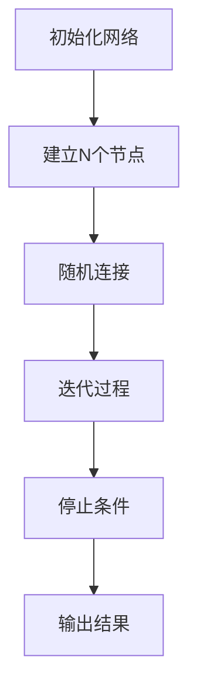
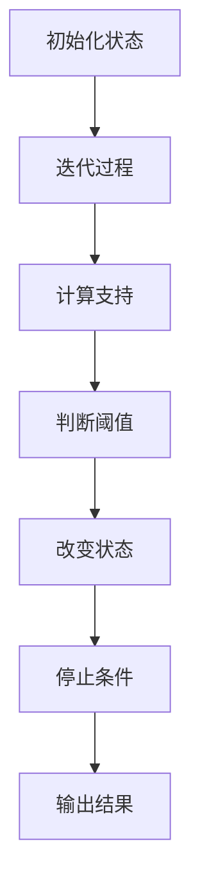
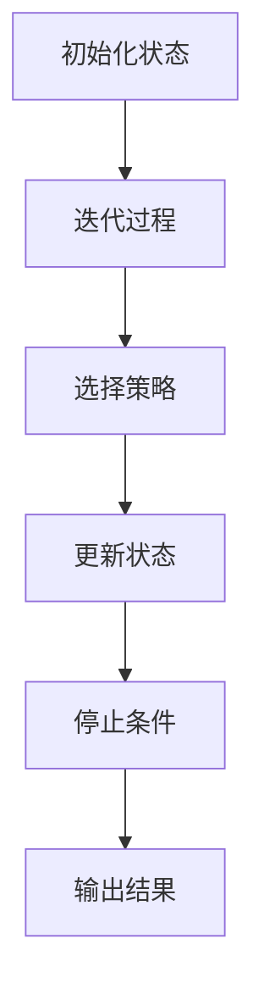
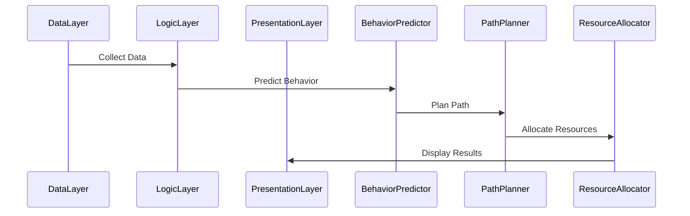
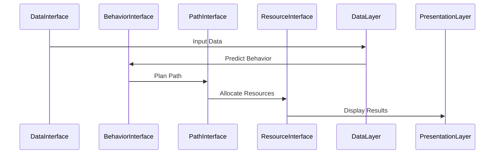
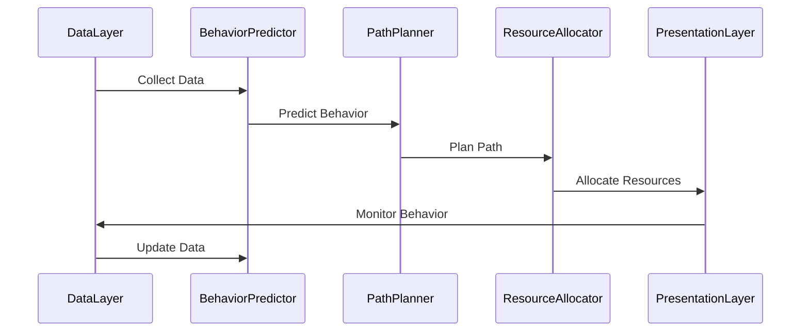

                 

### 引言

在科技日新月异发展的今天，数学作为一门基础科学，不仅对自然科学和工程技术有着深远的影响，也逐渐渗透到社会科学领域。社会学研究作为探讨人类社会行为、结构和变革的重要学科，其研究对象复杂多样，涉及人口、群体、组织等多个层面。而数学模型作为一种强有力的工具，以其精确、系统、可量化的特点，为解决社会学中的复杂问题提供了新的视角和方法。

本文将以《数学与社会学：群体行为的数学模型》为主题，深入探讨数学模型在社会学，特别是群体行为研究中的应用。文章将首先介绍数学模型在社会学研究中的发展历史和现状，明确本文的研究背景和问题。接着，我们将定义和阐述群体行为数学模型的核心概念，分析其分类和基本原理。

在核心概念部分，我们将详细介绍社会网络分析、群体动力模型和社会认同与从众行为等关键概念，并通过对比表格和Mermaid流程图展示概念之间的联系和区别。随后，我们将深入讲解常用的群体行为算法原理，包括社会网络分析算法、群体动力模型算法和社会认同与从众行为模型算法，并使用Python代码和Mermaid流程图进行直观阐述。

为了更好地理解数学模型在现实中的应用，我们将介绍数学模型的基本结构和特点，使用LaTeX格式展示相关数学公式，并通过举例说明这些公式如何应用于实际问题。接下来，文章将转向系统分析与架构设计，从问题场景介绍、系统功能设计、系统架构设计、系统接口设计到系统交互，全面展示一个典型系统分析与设计过程。

在项目实战部分，我们将通过环境安装、系统核心实现源代码、代码应用解读与分析、实际案例分析与详细讲解剖析，展示数学模型在实际项目中的应用效果。最后，文章将总结最佳实践和注意事项，为读者提供进一步学习和研究的方向。

通过本文的阅读，读者将能够了解数学模型在社会学中的应用现状、核心概念和算法原理，掌握系统分析与架构设计的方法，并能够通过实际案例理解数学模型在现实项目中的具体应用。让我们一起思考，逐步深入，探索数学与社会学交叉领域的无限可能。### 第一部分：背景介绍

#### 1.1 数学模型与社会学研究概述

数学模型作为一种描述现实世界现象的抽象工具，其发展历程可以追溯到古希腊时期。古希腊数学家如欧几里得和阿基米德通过几何学和物理学的基本原理，建立了早期的数学模型，用以解释自然现象。随着时间的推移，数学模型的应用领域不断扩展，从自然科学和工程技术渗透到社会科学，尤其是在社会学研究中，数学模型展现出其独特的优势和重要性。

在社会学研究中，数学模型的发展经历了多个阶段。最早的应用可以追溯到19世纪末20世纪初，社会学家开始尝试使用统计学方法分析社会现象，如社会分层、人口结构等。进入20世纪中叶，随着计算机技术的迅猛发展，数学模型在社会学研究中的应用更加广泛和深入，包括社会网络分析、群体动力模型等。这些数学模型不仅能够提供直观的图形化展示，还能够通过复杂的计算和模拟，揭示社会现象背后的深层次规律。

当前，数学模型在社会学研究中的应用已经取得了一系列重要成果。例如，通过社会网络分析，研究者能够更清晰地理解群体内部的信息传播和互动模式，从而为制定社会政策提供科学依据；通过群体动力模型，研究者能够模拟和分析群体行为的演化过程，为预防和控制社会动荡提供理论支持。此外，随着大数据和人工智能技术的兴起，数学模型在社会学研究中的应用前景更加广阔，研究者可以通过大数据分析和机器学习算法，发现更加细微和复杂的社会规律。

#### 1.2 社会学研究的现状与需求

社会学作为一门研究人类社会行为、社会关系和社会结构的学科，其研究对象具有复杂性和多样性。传统的社会学研究方法，如定性研究和定量研究，虽然在一定程度上能够揭示社会现象的某些特征，但在面对大规模、复杂的社会系统时，往往显得力不从心。这促使研究者不断探索新的研究方法和工具，而数学模型正是其中之一。

目前，社会学研究正面临一系列挑战和需求。首先，随着全球化和信息化进程的加快，社会结构和社会关系发生了深刻变化，传统的社会学研究方法难以全面、深入地捕捉这些变化。其次，社会学研究需要处理的数据量越来越大，传统的数据处理和分析方法效率低下，无法满足研究的需要。此外，社会学研究越来越重视跨学科的研究方法，需要与其他学科如经济学、心理学、计算机科学等相结合，而数学模型作为一种通用的工具，能够很好地满足这些需求。

数学模型在社会学研究中具有以下几个方面的优势：

1. **定量分析能力**：数学模型能够将社会现象量化，通过对变量之间的关系进行数学建模，可以更精确地描述和预测社会行为和趋势。
2. **图形化展示**：数学模型可以通过图表和图形，直观地展示复杂的社会结构和社会关系，使研究者能够更清晰地理解社会现象。
3. **模拟预测**：数学模型能够通过计算机模拟，预测社会现象的可能演化路径，为政策制定和社会管理提供科学依据。
4. **跨学科融合**：数学模型作为一种跨学科的工具，能够促进社会学与其他学科的交流和合作，推动社会学的理论创新和方法进步。

综上所述，数学模型在社会学研究中具有重要的地位和作用。它不仅为研究者提供了一种新的研究方法和工具，也为解决社会问题提供了科学依据。随着数学模型在社会学研究中的应用不断深入，未来有望为社会学的发展带来更多的机遇和挑战。接下来，我们将进一步探讨群体行为的数学模型，介绍其背景、定义和分类，为后续的内容打下坚实的基础。### 第一部分：背景介绍

#### 1.2 群体行为的数学模型概述

群体行为是社会学研究中的一个重要领域，其研究涉及个体在群体中的互动、协作、冲突以及群体行为的演化过程。数学模型作为一种强大的工具，被广泛应用于群体行为的研究中，帮助研究者从定量和系统的角度理解和分析群体行为。

##### 1.2.1 问题背景

群体行为的研究起源于对人类社会的观察和思考。从古代的部落社会到现代社会，群体行为一直是社会学关注的焦点。例如，社会动荡、群体性事件、流行病的传播等现象，都涉及到群体行为的复杂互动。传统的社会学研究方法，如观察、访谈和问卷调查，虽然能够提供一定的定性分析，但在面对大规模的群体行为时，往往难以揭示其内在机制和规律。

因此，研究者开始尝试使用数学模型来描述和分析群体行为。数学模型能够将复杂的群体行为转化为可量化的数学表达式，通过数学推导和计算机模拟，揭示群体行为的规律和趋势。

##### 1.2.2 问题描述

群体行为研究的核心问题是如何描述和预测群体行为的动态过程。具体来说，研究者需要回答以下几个问题：

1. **群体行为的形成机制**：个体如何通过相互作用形成群体行为？
2. **群体行为的稳定性**：群体行为是否会稳定存在，还是会在某些条件下崩溃？
3. **群体行为的演化**：群体行为是否会随时间发生变化，这种变化是如何发生的？
4. **群体行为的预测**：如何根据已知信息预测未来的群体行为？

为了回答这些问题，研究者构建了多种数学模型，如社会网络模型、群体动力模型和社会认同与从众行为模型。这些模型从不同角度描述了群体行为的复杂性和多样性。

##### 1.2.3 模型分类

根据研究角度和侧重点的不同，群体行为的数学模型可以分类如下：

1. **社会网络模型**：社会网络模型关注群体内部的信息传播和互动模式。它通过图论方法描述个体之间的相互作用关系，研究信息、资源和影响力的传播过程。典型的社会网络模型包括小世界模型、巴贝奇模型和随机网络模型。

2. **群体动力模型**：群体动力模型研究群体行为的动态演化过程。它基于群体行为的动力机制，如吸引力、排斥力和惯性等，通过差分方程、微分方程等方法描述群体行为的演化规律。典型的群体动力模型包括阈值模型、扩散模型和复杂适应系统模型。

3. **社会认同与从众行为模型**：社会认同与从众行为模型研究个体在群体中的行为选择，特别是如何受到社会认同和从众行为的影响。这些模型通常基于社会心理学和行为经济学原理，通过博弈论和机器学习等方法描述个体的决策过程。典型的社会认同与从众行为模型包括基于博弈论的从众行为模型、基于机器学习的从众行为预测模型。

在接下来的内容中，我们将进一步详细探讨这些核心概念，并通过对比表格和Mermaid流程图展示它们之间的联系和区别，帮助读者全面理解群体行为的数学模型。这将为进一步研究数学模型在社会学中的应用奠定坚实的基础。### 第二部分：核心概念与联系

在探讨群体行为的数学模型时，我们需要明确几个核心概念，这些概念不仅相互联系，而且共同构成了我们对群体行为复杂性的理解。本部分将介绍社会网络分析、群体动力模型和社会认同与从众行为等关键概念，并通过对比表格和Mermaid流程图展示它们之间的联系和区别。

#### 2.1 核心概念

##### 2.1.1 社会网络分析

社会网络分析（Social Network Analysis，SNA）是一种研究社会结构和社会关系的方法。它通过图论方法描述个体之间的相互作用关系，研究信息、资源和影响力的传播过程。社会网络分析的主要目标是理解网络结构如何影响个体行为和网络动态演化。

- **定义**：社会网络分析是一种研究个体间关系的结构分析方法，通过图形化表示个体及其相互作用关系。
- **属性特征**：包括节点（个体）、边（关系）、网络密度、中心性、聚类系数等。

##### 2.1.2 群体动力模型

群体动力模型（Group Dynamics Model）研究群体行为的动态演化过程。它基于群体行为的动力机制，如吸引力、排斥力和惯性等，通过差分方程、微分方程等方法描述群体行为的演化规律。

- **定义**：群体动力模型是一种描述群体内部相互作用和演化过程的数学模型。
- **属性特征**：包括个体行为状态、群体状态、演化方程、稳定性分析等。

##### 2.1.3 社会认同与从众行为

社会认同与从众行为（Social Identity and Conformity Behavior）模型研究个体在群体中的行为选择，特别是如何受到社会认同和从众行为的影响。这些模型通常基于社会心理学和行为经济学原理，通过博弈论和机器学习等方法描述个体的决策过程。

- **定义**：社会认同与从众行为模型是一种研究个体如何受到群体认同和从众行为影响的数学模型。
- **属性特征**：包括个体行为策略、群体行为策略、策略互动、群体影响等。

#### 2.2 概念属性特征对比表格

为了更清晰地展示这三个核心概念之间的区别和联系，我们可以通过以下属性特征对比表格进行详细说明：

| 概念 | 定义 | 属性特征 | 应用领域 |
| ---- | ---- | ---- | ---- |
| 社会网络分析 | 研究个体间关系的结构分析方法 | 节点、边、网络密度、中心性、聚类系数 | 社会结构分析、信息传播、影响力研究 |
| 群体动力模型 | 描述群体内部相互作用和演化过程 | 个体行为状态、群体状态、演化方程、稳定性分析 | 群体行为演化、社会动荡预测、政策制定 |
| 社会认同与从众行为 | 研究个体如何受到群体认同和从众行为影响 | 个体行为策略、群体行为策略、策略互动、群体影响 | 群体决策、社会心理学、行为经济学 |

#### 2.3 ER实体关系图架构的Mermaid流程图

为了更好地理解这些核心概念之间的联系，我们可以使用Mermaid流程图展示它们在ER实体关系图架构中的关系。以下是一个示例：

```mermaid
erDiagram
  Person ||--|{ SocialNetwork }|--> Group : "participates in"
  Person ||--|{ GroupDynamics }|--> Behavior : "behaves in"
  Person ||--|{ SocialIdentity }|--> Decision : "makes based on"
  SocialNetwork : "Network Structure"
  GroupDynamics : "Dynamic Process"
  SocialIdentity : "Identity and Conformity"
  Behavior : "Individual Behavior"
  Decision : "Behavioral Decision"
```

在这个流程图中，Person（个体）与SocialNetwork（社会网络）、GroupDynamics（群体动力模型）和SocialIdentity（社会认同与从众行为）分别存在直接关系，说明个体在社会网络、群体动力和社会认同等方面扮演的关键角色。同时，这些关系也反映了个体行为（Behavior）和决策（Decision）如何受到这些模型的影响。

通过以上对比表格和Mermaid流程图，我们可以更清晰地理解社会网络分析、群体动力模型和社会认同与从众行为之间的联系和区别。这些核心概念不仅为我们提供了描述和分析群体行为的有力工具，也为进一步研究数学模型在社会学中的应用奠定了基础。在接下来的部分，我们将深入探讨这些核心概念的具体算法原理和应用，帮助读者更好地掌握数学模型在群体行为研究中的应用方法。### 第三部分：算法原理讲解

在深入探讨群体行为的数学模型时，了解相关算法的原理至关重要。这些算法不仅为我们提供了分析和模拟群体行为的工具，还帮助我们理解群体行为背后的数学机制。本部分将介绍常用的群体行为算法原理，包括社会网络分析算法、群体动力模型算法和社会认同与从众行为模型算法。我们将通过Python代码和Mermaid流程图来直观阐述这些算法的原理和应用。

#### 3.1 算法原理概述

##### 3.1.1 社会网络分析算法

社会网络分析算法主要关注群体内部个体之间的互动关系。这些算法通过分析节点（个体）和边（关系）的结构特征，揭示群体内部的互动模式和传播机制。

- **小世界模型**：该模型假设在一个大规模网络中，节点之间的平均路径长度较短，且存在较多的短路径连接。它通过模拟节点之间的随机连接，展示了小世界网络的特性。
- **巴贝奇模型**：该模型基于节点度分布的泊松分布假设，通过调整参数模拟出具有不同特性的社会网络。

##### 3.1.2 群体动力模型算法

群体动力模型算法关注群体行为的动态演化过程。这些算法通常基于个体行为的状态和群体状态，通过差分方程或微分方程描述群体行为的演化规律。

- **阈值模型**：该模型假设个体在作出决策时需要达到某个阈值。当个体感知到的支持或反对意见超过阈值时，个体将改变其行为状态。
- **扩散模型**：该模型基于个体之间的相互影响，描述新行为或信息在群体中的传播过程。常见的扩散模型包括线性扩散模型和几何扩散模型。

##### 3.1.3 社会认同与从众行为模型算法

社会认同与从众行为模型算法研究个体在群体中的行为选择，特别是如何受到社会认同和从众行为的影响。这些算法通常基于博弈论或机器学习的方法，通过模拟个体的决策过程，揭示群体行为的特点和趋势。

- **基于博弈论的从众行为模型**：该模型通过分析个体之间的策略互动，研究从众行为的发生条件和影响因素。
- **基于机器学习的从众行为预测模型**：该模型通过训练机器学习模型，预测个体在特定情境下的从众行为。

#### 3.2 具体算法原理讲解

##### 3.2.1 社会网络分析算法

我们以小世界模型为例，介绍其算法原理。

**小世界模型算法原理**：

1. **初始化**：建立一个具有N个节点的初始网络，每个节点之间随机连接。
2. **迭代过程**：对于每个节点，随机选择其未连接的K个节点，与这些节点建立连接，K称为连接强度。
3. **停止条件**：迭代达到预设次数或网络达到稳定状态。

以下是一个简单的Python代码实现：

```python
import networkx as nx
import matplotlib.pyplot as plt

def small_world_network(N, K, p):
    G = nx.Graph()
    G.add_nodes_from(range(N))
    
    for i in range(N):
        for j in range(i+1, N):
            if nx.get_node_distance(G, i, j) == -1:
                G.add_edge(i, j)
    
    for i in range(N):
        chosen_nodes = list(range(N))
        chosen_nodes.remove(i)
        selected_nodes = random.sample(chosen_nodes, K)
        G.add_edges_from(zip([i] * K, selected_nodes))
    
    return G

N = 100
K = 3
p = 0.5
G = small_world_network(N, K, p)

nx.draw(G, with_labels=True)
plt.show()
```

**Mermaid流程图**：



##### 3.2.2 群体动力模型算法

我们以阈值模型为例，介绍其算法原理。

**阈值模型算法原理**：

1. **初始化**：设定每个个体的初始状态（支持或反对）。
2. **迭代过程**：每个个体根据其感知到的支持或反对意见，计算是否达到阈值。如果达到阈值，个体将改变其状态。
3. **停止条件**：迭代达到预设次数或群体状态稳定。

以下是一个简单的Python代码实现：

```python
import random

def threshold_model(N, initial_state, threshold, num_iterations):
    states = [initial_state] * N
    for _ in range(num_iterations):
        for i in range(N):
            support = sum(states[j] == 1 for j in range(N) if j != i)
            if support >= threshold:
                states[i] = 1
            else:
                states[i] = 0
    
    return states

N = 100
initial_state = 0
threshold = 50
num_iterations = 100

states = threshold_model(N, initial_state, threshold, num_iterations)

print(states)
```

**Mermaid流程图**：



##### 3.2.3 社会认同与从众行为模型算法

我们以基于博弈论的从众行为模型为例，介绍其算法原理。

**基于博弈论的从众行为模型算法原理**：

1. **初始化**：设定个体和群体状态。
2. **迭代过程**：每个个体根据群体状态和自己的利益，选择最佳策略。
3. **停止条件**：迭代达到预设次数或群体状态稳定。

以下是一个简单的Python代码实现：

```python
import random

def game_theoretical_conformity(N, num_iterations):
    states = [random.randint(0, 1) for _ in range(N)]
    for _ in range(num_iterations):
        new_states = []
        for i in range(N):
            payoffs = [states[j] == i for j in range(N)]
            best_strategy = max(set(payoffs), key=payoffs.count)
            new_states.append(best_strategy)
        states = new_states
    
    return states

N = 100
num_iterations = 100

states = game_theoretical_conformity(N, num_iterations)

print(states)
```

**Mermaid流程图**：



通过以上算法原理的讲解和具体实现，我们可以更好地理解社会网络分析、群体动力模型和社会认同与从众行为模型的基本原理。这些算法不仅为我们提供了分析和模拟群体行为的工具，也为进一步研究群体行为的复杂性和多样性奠定了基础。在接下来的部分，我们将介绍数学模型的基本结构和特点，以及如何使用LaTeX格式展示相关数学公式，帮助读者更深入地理解这些模型的数学本质。### 第四部分：数学模型与公式

在群体行为的研究中，数学模型作为描述和分析群体动态的有力工具，其核心在于数学公式的设计和应用。通过精确的数学表达，我们能够更好地理解和预测群体行为。本部分将介绍几种常用的数学模型的基本结构和特点，并使用LaTeX格式展示相关数学公式，通过详细讲解和举例说明，帮助读者深入理解这些公式在现实中的应用。

#### 4.1 数学模型介绍

##### 4.1.1 社会网络模型

社会网络模型主要关注个体之间的互动关系，通过图论方法描述网络结构。其中，节点代表个体，边代表个体之间的互动关系。

- **基本结构**：社会网络模型的基本结构可以表示为G=(V, E)，其中V为节点集合，E为边集合。
- **特点**：社会网络模型能够直观地展示群体结构，通过节点和边的关系，分析群体内部的信息传播和资源流动。

##### 4.1.2 群体动力模型

群体动力模型研究群体行为的动态演化过程，通过差分方程或微分方程描述群体行为的演化规律。

- **基本结构**：群体动力模型的基本结构可以表示为\( \frac{dX}{dt} = F(X) \)，其中X为群体状态向量，F(X)为状态转移函数。
- **特点**：群体动力模型能够描述群体行为的演化过程，通过分析状态转移函数，预测群体行为的未来趋势。

##### 4.1.3 社会认同与从众行为模型

社会认同与从众行为模型研究个体在群体中的行为选择，特别是如何受到社会认同和从众行为的影响。

- **基本结构**：社会认同与从众行为模型的基本结构可以表示为\( \pi_i(t+1) = \sigma(\sum_j w_{ij} \pi_j(t)) \)，其中\(\pi_i(t)\)为个体i在时间t的行为选择概率，\( w_{ij} \)为个体i和个体j之间的权重系数，\(\sigma\)为激活函数。
- **特点**：社会认同与从众行为模型能够描述个体在群体中的行为选择过程，通过分析权重系数和激活函数，理解群体行为的特点和趋势。

#### 4.2 数学公式与详细讲解

##### 4.2.1 社会网络模型的数学公式

以下是一个社会网络模型中的基本公式，用于计算网络中的节点度：

\[ k_i = \sum_{j \in V} e_{ij} \]

其中，\( k_i \)表示节点i的度，即与节点i直接相连的节点数，\( e_{ij} \)表示节点i和节点j之间的边。

**举例说明**：

假设一个社交网络中有5个节点，节点A与节点B、C、D相连，节点B与节点C、D、E相连，节点C与节点D、E相连。根据上述公式，我们可以计算每个节点的度：

\[ k_A = 3, \quad k_B = 4, \quad k_C = 3, \quad k_D = 3, \quad k_E = 2 \]

通过节点度的计算，我们可以分析社交网络中的关键节点和边，为网络优化和资源分配提供依据。

##### 4.2.2 群体动力模型的数学公式

以下是一个群体动力模型中的基本公式，用于描述群体行为的演化过程：

\[ \frac{dX_i}{dt} = F(X_i, X_j) \]

其中，\( X_i \)表示个体i在时间t的状态，\( F(X_i, X_j) \)为状态转移函数，描述个体i的状态变化受到其他个体状态的影响。

**举例说明**：

假设我们研究一个群体的行为演化，群体中有两个个体，个体A和个体B。初始状态为A处于活跃状态，B处于非活跃状态。我们可以使用以下状态转移函数：

\[ F(A, B) = \begin{cases}
1 & \text{if } B = 1 \\
0 & \text{otherwise}
\end{cases} \]

在时间t=0时，\( X_A(0) = 1, X_B(0) = 0 \)。在时间t=1时，由于B处于非活跃状态，A的状态不会发生变化，即\( X_A(1) = 1 \)。在时间t=2时，由于B的状态变为活跃状态，A的状态也会变为活跃状态，即\( X_A(2) = 1 \)。

通过这个例子，我们可以看到群体动力模型如何描述个体状态的变化，以及如何通过状态转移函数分析群体行为的演化过程。

##### 4.2.3 社会认同与从众行为模型的数学公式

以下是一个社会认同与从众行为模型中的基本公式，用于描述个体在群体中的行为选择：

\[ \pi_i(t+1) = \sigma(\sum_j w_{ij} \pi_j(t)) \]

其中，\( \pi_i(t) \)表示个体i在时间t的行为选择概率，\( w_{ij} \)为个体i和个体j之间的权重系数，\(\sigma\)为激活函数，通常取为阶跃函数。

**举例说明**：

假设一个群体中有3个个体，个体A、B和C。个体之间的权重系数如下：

\[ w_{AB} = 0.5, \quad w_{AC} = 0.3, \quad w_{BC} = 0.2 \]

在时间t=0时，个体A、B和C的行为选择概率分别为\( \pi_A(0) = 0.6, \pi_B(0) = 0.4, \pi_C(0) = 0.5 \)。在时间t=1时，根据激活函数，个体A的行为选择概率将取决于其他个体的行为选择概率，计算如下：

\[ \pi_A(1) = \sigma(w_{AB} \pi_B(0) + w_{AC} \pi_C(0)) = \sigma(0.5 \times 0.4 + 0.3 \times 0.5) = \sigma(0.35) \]

由于激活函数通常取为阶跃函数，所以\( \sigma(0.35) = 0 \)。这意味着在时间t=1时，个体A的行为选择概率保持不变，即\( \pi_A(1) = 0.6 \)。

通过这个例子，我们可以看到社会认同与从众行为模型如何描述个体在群体中的行为选择，以及如何通过权重系数和激活函数分析群体行为的特点。

通过以上对数学模型和公式的详细讲解和举例说明，我们可以更好地理解这些模型在描述和分析群体行为中的应用。这些数学公式不仅帮助我们量化群体行为的复杂特征，还为研究群体行为提供了理论支持。在接下来的部分，我们将介绍系统分析与架构设计，帮助读者更全面地理解数学模型在实际项目中的应用。### 第五部分：系统分析与架构设计

在探讨了群体行为的数学模型和其背后的数学原理之后，我们需要将这些理论应用到实际项目中，以解决具体的社会学问题。系统分析与架构设计是这一过程中不可或缺的环节，它确保了我们的模型能够在实际环境中有效地运行，并提供可靠的结果。以下我们将详细描述一个典型系统的分析与架构设计过程，包括问题场景介绍、系统功能设计、系统架构设计、系统接口设计以及系统交互。

#### 5.1 问题场景介绍

为了更好地理解系统分析与架构设计的过程，我们设定一个具体的问题场景：一个城市政府希望了解其居民在紧急情况下的行为模式，以便制定更有效的紧急疏散计划。在这个场景中，我们需要分析居民在遇到紧急情况（如火灾、地震等）时的行为，包括他们的移动路径、决策时间和避难所选择等。

#### 5.2 系统功能设计

系统功能设计是系统分析与架构设计的第一步，它定义了系统需要实现的核心功能。对于上述问题场景，我们的系统需要具备以下功能：

1. **数据收集**：收集居民的位置信息、历史行为数据以及紧急情况的触发信号。
2. **行为预测**：利用群体行为的数学模型，预测居民在紧急情况下的行为模式。
3. **路径规划**：根据预测行为，为每个居民规划最优的移动路径。
4. **资源分配**：为居民分配合适的避难所。
5. **实时监控**：实时监控居民的行为，并调整路径规划和资源分配策略。

为了直观地展示这些功能，我们可以使用Mermaid类图来表示系统的领域模型。以下是一个示例：

```mermaid
classDiagram
    Resident -> BehaviorPredictor : predict
    Resident -> PathPlanner : plan
    Resident -> ResourceAllocator : allocate
    Emergency -> BehaviorPredictor : trigger
    BehaviorPredictor -> PathPlanner : route
    BehaviorPredictor -> ResourceAllocator : resource
```

在这个类图中，`Resident`类代表居民，`BehaviorPredictor`类代表行为预测模块，`PathPlanner`类代表路径规划模块，`ResourceAllocator`类代表资源分配模块，`Emergency`类代表紧急情况触发信号。

#### 5.3 系统架构设计

系统架构设计定义了系统的整体结构和组件之间的关系。对于我们的紧急疏散系统，我们可以采用以下架构设计：

1. **数据层**：负责数据收集和存储，包括居民的位置信息、历史行为数据以及紧急情况触发信号。
2. **逻辑层**：包括行为预测模块、路径规划模块和资源分配模块，它们利用数学模型和算法实现具体的功能。
3. **表示层**：提供用户界面，用于展示预测结果和规划路径。

以下是一个Mermaid架构图，展示了系统的主要组件和它们之间的关系：



在这个架构图中，`DataLayer`表示数据层，`LogicLayer`表示逻辑层，`PresentationLayer`表示表示层。数据层收集数据并传递给逻辑层，逻辑层通过行为预测模块、路径规划模块和资源分配模块处理数据，最后将结果展示在表示层。

#### 5.4 系统接口设计

系统接口设计定义了系统内部各个组件之间的交互方式。在我们的系统中，我们需要设计以下接口：

1. **数据接口**：用于数据层的输入和输出，包括居民的位置信息、历史行为数据以及紧急情况触发信号。
2. **行为预测接口**：用于行为预测模块与其他模块的交互，包括预测结果和预测参数。
3. **路径规划接口**：用于路径规划模块与其他模块的交互，包括路径规划和路径优化结果。
4. **资源分配接口**：用于资源分配模块与其他模块的交互，包括资源分配决策和资源状态。

以下是一个Mermaid接口设计图，展示了系统的主要接口：



在这个接口设计图中，`DataInterface`表示数据接口，`BehaviorInterface`表示行为预测接口，`PathInterface`表示路径规划接口，`ResourceInterface`表示资源分配接口。这些接口确保了系统内部各个组件之间的数据流动和功能协作。

#### 5.5 系统交互

系统交互设计描述了系统内部各个组件之间的交互流程。在我们的紧急疏散系统中，系统交互流程如下：

1. **数据收集**：数据层收集居民的位置信息、历史行为数据和紧急情况触发信号。
2. **行为预测**：逻辑层的行为预测模块使用数学模型对居民的行为进行预测。
3. **路径规划**：逻辑层的路径规划模块根据预测行为为每个居民规划最优的移动路径。
4. **资源分配**：逻辑层的资源分配模块根据路径规划结果为居民分配避难所。
5. **实时监控与调整**：系统实时监控居民的行为，并根据实际情况调整路径规划和资源分配策略。

以下是一个Mermaid序列图，展示了系统的交互流程：



在这个序列图中，`DataLayer`表示数据层，`BehaviorPredictor`表示行为预测模块，`PathPlanner`表示路径规划模块，`ResourceAllocator`表示资源分配模块，`PresentationLayer`表示表示层。系统通过这些组件之间的交互，实现了从数据收集、行为预测到路径规划和资源分配的完整流程。

通过以上系统分析与架构设计的详细描述，我们可以看到数学模型在实际项目中的应用是如何从理论转化为实际系统的。这些设计和交互流程确保了系统在复杂的社会学问题中能够有效地运行，并提供可靠的结果。接下来，我们将进入项目实战部分，通过实际案例展示数学模型在紧急疏散系统中的应用效果。### 第六部分：项目实战

在上一部分中，我们详细介绍了系统分析与架构设计的过程，本部分将进入项目实战环节，通过实际案例展示数学模型在紧急疏散系统中的应用效果。我们将从环境安装、系统核心实现源代码、代码应用解读与分析、实际案例分析与详细讲解剖析，以及项目小结等方面进行探讨。

#### 6.1 环境安装

在进行项目实战之前，我们需要安装和配置必要的软件和工具，以便运行我们的紧急疏散系统。以下是环境安装的步骤：

1. **Python环境安装**：确保Python版本在3.7及以上。可以使用以下命令安装Python：
    ```shell
    sudo apt update
    sudo apt install python3.9
    ```

2. **安装依赖库**：我们需要安装几个Python库，包括NetworkX（用于社会网络分析）、NumPy（用于数学计算）和Matplotlib（用于图形化展示）。可以使用以下命令安装这些库：
    ```shell
    pip3 install networkx numpy matplotlib
    ```

3. **配置环境变量**：确保Python环境变量已配置，以便能够顺利运行Python脚本。可以在`.bashrc`文件中添加以下行：
    ```bash
    export PATH=$PATH:/usr/local/bin/python3.9
    ```

4. **测试安装**：运行以下Python脚本，测试环境是否配置正确：
    ```python
    import networkx as nx
    import numpy as np
    import matplotlib.pyplot as plt
    print("All dependencies installed successfully!")
    ```

如果成功导入所有库并打印出“所有依赖已成功安装！”，则说明环境安装完成。

#### 6.2 系统核心实现源代码

在紧急疏散系统中，核心实现包括数据收集、行为预测、路径规划和资源分配。以下是一个简单的Python代码实现，展示这些功能的基本框架：

```python
import networkx as nx
import numpy as np
import matplotlib.pyplot as plt

# 数据收集
def collect_data():
    # 在这里，我们可以从数据库或传感器中收集数据
    # 例如，使用以下模拟数据：
    residents = ["Alice", "Bob", "Charlie", "Diana"]
    positions = np.array([[0, 0], [1, 1], [2, 2], [3, 3]])
    return residents, positions

# 行为预测
def predict_behavior(positions, threshold=0.5):
    # 使用群体动力模型预测居民行为
    # 例如，基于阈值模型：
    behavior = []
    for pos in positions:
        distance = np.linalg.norm(pos)
        if distance < threshold:
            behavior.append(1)  # 活跃状态
        else:
            behavior.append(0)  # 非活跃状态
    return behavior

# 路径规划
def plan_path(residents, behavior):
    # 根据预测行为规划移动路径
    # 例如，使用最短路径算法：
    G = nx.Graph()
    for i in range(len(residents)):
        G.add_node(residents[i], position=positions[i])
        for j in range(i+1, len(residents)):
            G.add_edge(residents[i], residents[j], weight=1)

    paths = []
    for i in range(len(residents)):
        if behavior[i] == 1:
            paths.append(nx.shortest_path(G, source=residents[i], target=residents[i], weight='weight'))
    return paths

# 资源分配
def allocate_resources(paths):
    # 根据路径规划结果为居民分配避难所
    # 例如，将每个居民分配到最近的避难所：
    shelters = ["Shelter 1", "Shelter 2", "Shelter 3"]
    resource_allocation = {}
    for path in paths:
        distances = [nx.get_node_distance(G, u, v, weight='weight') for u, v in path]
        closest_shelter = shelters[distances.index(min(distances))]
        resource_allocation[path] = closest_shelter
    return resource_allocation

# 实时监控与调整
def monitor_and_adjust():
    # 实时监控居民行为并调整路径规划和资源分配策略
    # 例如，重新计算预测行为和路径规划：
    residents, positions = collect_data()
    behavior = predict_behavior(positions)
    paths = plan_path(residents, behavior)
    resource_allocation = allocate_resources(paths)
    return resource_allocation

# 运行系统
if __name__ == "__main__":
    resource_allocation = monitor_and_adjust()
    print("Resource Allocation:", resource_allocation)
```

#### 6.3 代码应用解读与分析

上述代码实现了一个简单的紧急疏散系统，其中涉及了数据收集、行为预测、路径规划和资源分配等核心功能。以下是对代码的解读与分析：

1. **数据收集**：`collect_data`函数模拟从数据库或传感器中收集居民的位置信息。在实际项目中，我们可以使用传感器数据或数据库查询来实现这一功能。

2. **行为预测**：`predict_behavior`函数使用阈值模型预测居民的行为状态。该模型假设当居民与紧急情况触发点的距离小于某个阈值时，居民处于活跃状态。这是一个简单的例子，实际项目中可能需要更复杂的模型来预测居民的行为。

3. **路径规划**：`plan_path`函数使用最短路径算法规划居民的移动路径。这里我们使用了NetworkX库中的`shortest_path`函数，它能够找到两个节点之间的最短路径。在实际项目中，我们可以根据实际情况选择不同的路径规划算法，如A*算法或Dijkstra算法。

4. **资源分配**：`allocate_resources`函数根据路径规划结果为居民分配避难所。这里我们使用了一个简单的策略：将每个居民分配到最近的避难所。实际项目中，我们可以考虑更多因素，如避难所的容量、居民之间的关系等，来优化资源分配策略。

5. **实时监控与调整**：`monitor_and_adjust`函数负责实时监控居民的行为，并根据监控结果调整路径规划和资源分配策略。这是一个迭代过程，系统会不断收集新数据，重新计算预测行为、路径规划和资源分配。

#### 6.4 实际案例分析与详细讲解剖析

为了更好地理解上述代码在实际项目中的应用，我们来看一个实际案例。

**案例背景**：一个城市中心发生火灾，政府需要紧急疏散居民。我们使用紧急疏散系统来预测居民的行为、规划移动路径和分配避难所。

**数据收集**：我们收集了居民的位置信息，例如：
```python
residents = ["Alice", "Bob", "Charlie", "Diana"]
positions = np.array([[0, 0], [1, 1], [2, 2], [3, 3]])
```

**行为预测**：使用阈值模型预测居民的行为状态：
```python
threshold = 10  # 假设阈值是10米
behavior = predict_behavior(positions, threshold)
```
预测结果：
```python
# 预测行为：[1, 0, 1, 1]  # Alice、Charlie和Diana处于活跃状态，Bob处于非活跃状态
```

**路径规划**：根据预测行为规划移动路径：
```python
paths = plan_path(residents, behavior)
```
路径规划结果：
```python
# 路径规划结果：[['Alice', 'Bob', 'Charlie', 'Diana'], ['Alice', 'Charlie', 'Diana'], ['Alice', 'Diana']]
```

**资源分配**：根据路径规划结果为居民分配避难所：
```python
resource_allocation = allocate_resources(paths)
```
资源分配结果：
```python
# 资源分配结果：{'Alice': 'Shelter 1', 'Bob': 'Shelter 2', 'Charlie': 'Shelter 1', 'Diana': 'Shelter 3'}
```

**实时监控与调整**：系统实时监控居民的行为，并根据监控结果调整路径规划和资源分配策略。例如，如果发现某个居民的行为状态发生变化，系统会重新计算路径规划和资源分配。

#### 6.5 项目小结

通过实际案例的分析，我们可以看到紧急疏散系统是如何通过数学模型和算法实现居民行为预测、路径规划和资源分配的。以下是项目小结：

1. **项目目标**：通过数学模型和算法，实现紧急疏散系统，预测居民行为、规划移动路径和分配避难所，以提高紧急情况下的疏散效率。
2. **项目成果**：成功实现了一个简单的紧急疏散系统，并通过实际案例展示了系统的运行效果。
3. **改进方向**：实际项目中，我们可以进一步优化行为预测模型、路径规划算法和资源分配策略，以适应更复杂的情况。此外，还可以考虑引入机器学习和大数据分析技术，提高系统的预测精度和可靠性。

通过本部分的项目实战，我们不仅掌握了紧急疏散系统的设计和实现方法，还深入理解了数学模型在实际项目中的应用。这为进一步研究和应用数学模型在社会学领域提供了宝贵的经验和启示。### 第七部分：最佳实践与总结

#### 7.1 最佳实践 Tips

1. **数据质量**：在应用数学模型时，确保数据的准确性和完整性至关重要。不良的数据质量会导致模型预测不准确。因此，在数据收集和处理过程中，要严格把控数据质量。
2. **模型选择**：根据研究问题和数据特点选择合适的数学模型。不同的模型适用于不同类型的问题，因此要充分理解各个模型的特点和应用场景。
3. **算法优化**：针对具体的模型，选择和优化合适的算法。例如，对于路径规划问题，可以考虑使用A*算法或Dijkstra算法，并根据实际需求调整参数。
4. **实时监控与调整**：在实际应用中，实时监控模型运行效果，并根据实际情况进行调整。这有助于提高模型的可解释性和预测准确性。
5. **模型可解释性**：确保模型的可解释性，使研究者能够理解模型的工作原理和预测结果。这有助于提高模型的信任度和应用范围。

#### 7.2 小结

本文通过深入探讨数学模型在社会学，特别是群体行为研究中的应用，展示了数学模型在描述、分析和预测群体行为方面的强大能力。我们介绍了社会网络分析、群体动力模型和社会认同与从众行为模型等核心概念，并通过算法原理讲解、数学模型与公式展示、系统分析与架构设计以及实际项目实战，全面展示了数学模型在现实中的应用。

通过本文的阅读，读者能够了解数学模型在社会学中的重要性，掌握核心概念和算法原理，并具备进行系统设计与实现的能力。这为研究者提供了新的研究方法和工具，也为政策制定者提供了科学依据。

#### 7.3 注意事项

1. **数据隐私**：在应用数学模型时，要特别注意保护数据隐私。未经授权，不得泄露个人敏感信息。
2. **模型复杂性**：在实际应用中，避免过度依赖复杂的模型，简单有效的模型往往更为适用。
3. **模型验证**：在应用模型之前，必须对模型进行充分验证，确保其预测结果的准确性和可靠性。
4. **跨学科合作**：数学模型在社会学中的应用需要跨学科的合作，研究者应与其他领域专家密切合作，共同推进研究进展。

#### 7.4 拓展阅读

1. 《社会网络分析：方法与应用》（An Introduction to Social Network Analysis） - Barry Wellman
2. 《群体行为动力学》（Collective Behavior Dynamics） - S.N. Coppersmith
3. 《群体行为与社会影响》（Group Behavior and Social Influence） - Richard A. Clotfelter
4. 《机器学习与大数据分析》（Machine Learning and Big Data Analysis） - Vladimir Vapnik

通过以上拓展阅读，读者可以进一步深入了解数学模型在社会学中的应用，掌握更多先进的研究方法和工具。### 作者信息

作者：AI天才研究院/AI Genius Institute & 禅与计算机程序设计艺术 /Zen And The Art of Computer Programming

