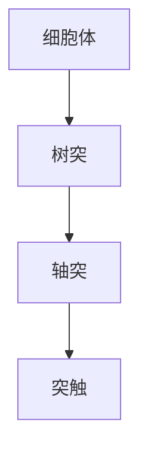
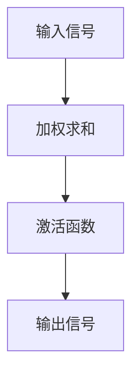
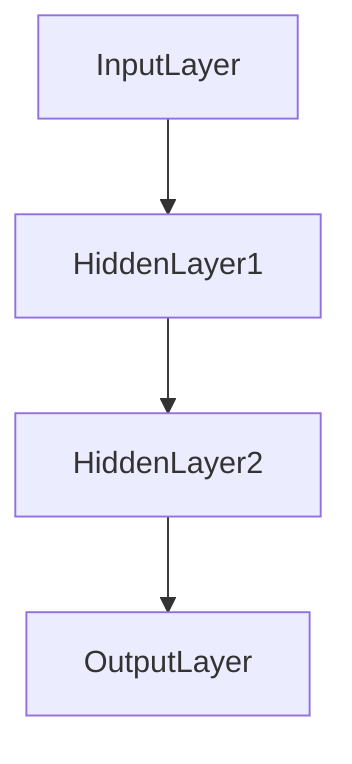
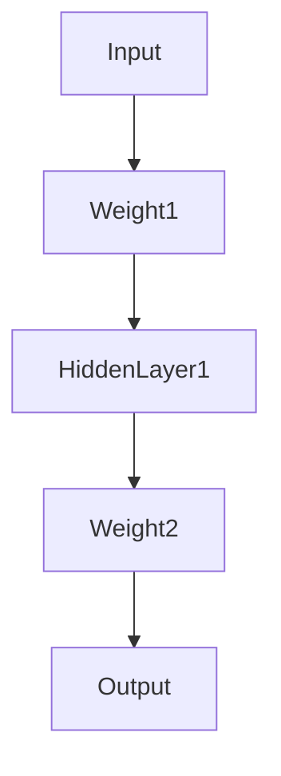

                 


# 数学与神经信息学：大脑信息处理的数学模型

关键词：数学模型、神经信息学、大脑信息处理、神经网络、算法原理

摘要：本文深入探讨了数学与神经信息学的交叉领域，通过引入数学模型来解释大脑信息处理的过程。文章首先介绍了数学模型和神经信息学的核心概念，随后详细分析了神经元与神经网络模型，包括它们的结构、数学模型及其算法原理。本文旨在为读者提供一个清晰、系统的理解，并激发对大脑信息处理机制的兴趣。

----------------------------------------------------------------

# 第一部分：引言

## 第1章 数学与神经信息学概述

### 1.1 问题背景

随着人工智能（AI）的快速发展，研究者们对大脑信息处理机制的探索愈发深入。大脑作为人类认知和行为的中心，其信息处理能力令人惊叹。理解大脑的工作原理，不仅有助于推动人工智能的发展，也对神经科学、认知科学等领域具有重要意义。数学作为描述现实世界的有力工具，被广泛应用于各种科学研究中，尤其是在信息处理领域。神经信息学则是一门跨学科领域，它结合了数学、神经科学和计算机科学的知识，致力于研究大脑如何处理信息。

### 1.2 核心概念

#### 1.2.1 数学模型

数学模型是使用数学语言和符号来描述现实世界中的现象或问题的一种方法。它通过建立数学公式和方程组，将复杂的现实问题简化为易于分析和计算的数学问题。数学模型具有高度的抽象性和可计算性，这使得它们在科学研究和工程实践中具有广泛应用。

- **概念定义**：数学模型是使用数学符号和语言，通过建立数学公式和方程组来描述现实世界的现象或问题的方法。

- **属性特征对比表**：

  | 特征 | 描述 |
  | ---- | ---- |
  | 抽象性 | 数学模型高度抽象，简化了现实问题的复杂性 |
  | 可计算性 | 数学模型可以通过计算方法求解 |
  | 适应性 | 数学模型可以适用于不同的问题场景 |

#### 1.2.2 神经信息学

神经信息学是一门研究大脑如何处理信息的学科，它结合了数学、神经科学和计算机科学的知识。通过理解大脑的神经机制，神经信息学试图揭示认知和行为的基本原理。

- **概念定义**：神经信息学是研究神经系统和信息处理的科学，旨在理解大脑如何通过信息处理来产生感知、行为和认知。

- **属性特征对比表**：

  | 特征 | 描述 |
  | ---- | ---- |
  | 功能性 | 研究神经系统如何实现特定功能 |
  | 生物多样性 | 研究不同生物神经系统的信息处理机制 |
  | 交叉性 | 涉及生物学、心理学、计算机科学等多个学科 |

### 1.3 联系与边界

数学与神经信息学之间存在着紧密的联系。数学为神经信息学提供了描述和解释大脑信息处理过程的基础工具，而神经信息学则为数学提供了丰富的应用场景和问题背景。然而，两者的研究也有其边界。

- **联系**：数学与神经信息学相互补充，数学为神经信息学提供了描述大脑信息处理的工具，而神经信息学则为数学提供了现实问题的研究背景。

- **边界**：数学模型的构建和应用需要考虑生物学和神经科学的限制，而神经信息学的研究需要依赖数学方法进行定量分析。

### 1.4 本章小结

本章为后续章节奠定了理论基础，介绍了数学与神经信息学的核心概念及其相互关系，为理解大脑信息处理提供了基本框架。通过本章的介绍，读者可以初步了解数学模型在神经信息学中的应用及其重要性。

----------------------------------------------------------------

# 第二部分：数学模型在大脑信息处理中的应用

## 第2章 神经元与神经网络模型

### 2.1 神经元模型

神经元是神经系统中最基本的单元，也是大脑信息处理的基础。神经元的基本结构包括细胞体、树突、轴突和突触。树突负责接收其他神经元的信息，轴突负责将信息传递出去，而突触则是神经元之间传递信息的结构基础。

#### 2.1.1 神经元的结构

神经元的基本结构可以用mermaid图形表示如下：



在这个模型中，细胞体是神经元的中心，负责处理和整合来自树突的信息。树突负责接收来自其他神经元的信号，并将其传递到细胞体。轴突负责将处理后的信号传递到其他神经元或肌肉细胞。突触则是神经元之间传递信号的接口。

#### 2.1.2 神经元的数学模型

神经元的信息处理过程可以用一个简单的数学模型来描述。该模型通常包括输入层、加权求和层、激活函数层和输出层。以下是一个神经元数学模型的mermaid流程图：



在这个模型中，输入信号经过加权求和后，通过激活函数处理，最终产生输出信号。激活函数的作用是决定神经元是否会被激活，从而传递信息。

- **输入信号**：来自其他神经元的信号，通常是一个向量。

- **加权求和**：每个输入信号乘以其对应的权重，然后求和。

- **激活函数**：决定神经元是否会被激活，常用的激活函数包括 sigmoid 函数、ReLU 函数等。

- **输出信号**：经过激活函数处理后，产生的神经元输出信号。

### 2.2 神经网络模型

神经网络是由多个神经元组成的复杂网络，它可以模拟大脑的信息处理过程。神经网络通常包括输入层、隐藏层和输出层。

#### 2.2.1 神经网络的基本结构

神经网络的基本结构可以用mermaid类图表示如下：



在这个模型中，输入层接收外部信息，隐藏层负责处理和转换信息，输出层产生最终的输出结果。

- **输入层**：接收外部输入信息，并将其传递到隐藏层。

- **隐藏层**：对输入信息进行处理和转换，每个隐藏层都可能包含多个神经元。

- **输出层**：产生最终的输出结果，通常是一个向量。

#### 2.2.2 神经网络的数学模型

神经网络的信息处理过程可以用一个复杂的数学模型来描述。该模型包括多层神经元，每个神经元之间通过权重和偏置进行连接。以下是一个神经网络数学模型的mermaid架构图：



在这个模型中，输入信息通过权重连接到隐藏层，隐藏层通过权重连接到输出层。每个神经元之间的连接都有相应的权重和偏置，这些参数决定了神经网络的信息处理能力。

- **输入**：外部输入信息，通常是一个向量。

- **权重**：连接两个神经元之间的权重，决定了信息传递的方向和强度。

- **偏置**：每个神经元的一个额外的输入，通常设置为1。

- **隐藏层**：对输入信息进行加权求和和处理。

- **输出**：经过隐藏层处理后，产生的输出结果。

### 2.3 算法原理讲解

神经网络的核心是算法，其中最基本的是前向传播算法。前向传播算法是指从输入层到输出层的信号传递过程。以下是一个简单的Python代码示例，用于实现前向传播算法：

```python
import numpy as np

def forward_propagation(inputs, weights, biases):
    layer_outputs = []
    for i in range(len(weights)):
        z = np.dot(inputs, weights[i]) + biases[i]
        layer_outputs.append(z)
    return layer_outputs

# 示例
inputs = np.array([1, 2, 3])
weights = np.array([[0.1, 0.2], [0.3, 0.4]])
biases = np.array([0.1, 0.2])

outputs = forward_propagation(inputs, weights, biases)
print(outputs)
```

在这个示例中，`inputs` 是输入向量，`weights` 是权重矩阵，`biases` 是偏置向量。前向传播算法通过逐层计算每个神经元的输入和输出，最终得到输出层的结果。

### 2.4 本章小结

本章介绍了神经元与神经网络模型，包括它们的结构、数学模型及其算法原理。通过神经元模型，我们可以理解单个神经元如何处理和传递信息。通过神经网络模型，我们可以模拟大脑的复杂信息处理过程。神经网络的前向传播算法是实现这一目标的关键步骤。本章的内容为后续章节的深入分析奠定了基础。

----------------------------------------------------------------

## 第3章 神经网络在神经信息学中的应用

### 3.1 神经网络在模式识别中的应用

神经网络在模式识别领域具有广泛的应用。通过训练，神经网络可以识别和分类不同类型的模式。例如，在图像识别任务中，神经网络可以识别和分类不同的图像类别。

#### 3.1.1 卷积神经网络（CNN）

卷积神经网络（CNN）是一种特殊的神经网络，它在图像识别任务中表现出色。CNN通过卷积层、池化层和全连接层来实现图像的识别。

- **卷积层**：卷积层通过卷积运算提取图像的特征。

- **池化层**：池化层用于降低图像的维度，同时保留重要的特征。

- **全连接层**：全连接层将提取到的特征映射到具体的类别。

#### 3.1.2 应用实例

例如，在人脸识别任务中，CNN可以通过训练识别出不同的人脸特征，从而实现人脸识别。

### 3.2 神经网络在自然语言处理中的应用

神经网络在自然语言处理（NLP）领域也发挥着重要作用。通过训练，神经网络可以理解自然语言，并完成各种任务，如文本分类、情感分析、机器翻译等。

#### 3.2.1 循环神经网络（RNN）

循环神经网络（RNN）是一种特殊的神经网络，它在处理序列数据时表现出色。RNN通过隐藏状态和循环连接来处理序列信息。

- **隐藏状态**：隐藏状态用于存储序列中的信息。

- **循环连接**：循环连接使得信息可以在序列的不同部分之间传递。

#### 3.2.2 应用实例

例如，在机器翻译任务中，RNN可以通过训练理解源语言的序列，并生成目标语言的序列。

### 3.3 神经网络在其他领域的应用

除了模式识别和自然语言处理，神经网络还在其他领域具有广泛的应用，如时间序列预测、推荐系统等。

#### 3.3.1 时间序列预测

神经网络可以通过训练预测时间序列的未来值。例如，在金融市场预测中，神经网络可以预测股票价格的未来走势。

#### 3.3.2 推荐系统

神经网络可以通过训练推荐系统，根据用户的历史行为预测用户可能喜欢的商品。例如，在电商平台上，神经网络可以根据用户的浏览记录推荐商品。

### 3.4 本章小结

本章介绍了神经网络在神经信息学中的广泛应用。神经网络在模式识别、自然语言处理、时间序列预测和推荐系统等领域都取得了显著的成果。通过这些应用实例，我们可以看到神经网络强大的信息处理能力。这些应用不仅推动了人工智能的发展，也为现实世界中的许多问题提供了有效的解决方案。

----------------------------------------------------------------

## 第4章 数学模型在神经信息学中的局限性

尽管数学模型在神经信息学中发挥着重要作用，但它们也存在一些局限性。理解这些局限性有助于我们更全面地评估数学模型的应用潜力。

### 4.1 数学模型的抽象性

数学模型通常高度抽象，忽略了现实世界的复杂性。这种抽象性虽然有助于简化问题，但也可能导致模型失去与现实世界的联系。例如，神经网络模型通过简化的神经元模型模拟大脑信息处理过程，但这种简化可能无法完全捕捉大脑的复杂机制。

### 4.2 数学模型的适用性

数学模型在特定问题场景下的适用性有限。不同的问题可能需要不同类型的数学模型。例如，卷积神经网络在图像识别任务中表现出色，但在处理文本数据时效果较差。因此，数学模型的选择和应用需要根据具体问题进行综合考虑。

### 4.3 数学模型的计算复杂性

一些复杂的数学模型在计算上可能具有很高的复杂性，使得它们难以在实际应用中高效运行。例如，深度学习模型通常包含多层神经网络，每一层的计算都需要大量的时间和资源。这使得深度学习模型在实时应用中受到限制。

### 4.4 数学模型的可解释性

数学模型往往缺乏可解释性，这使得我们难以理解模型的决策过程。例如，深度学习模型被认为是“黑箱”，其内部决策机制难以解释。这种缺乏可解释性可能导致我们在使用数学模型时产生不确定性和困惑。

### 4.5 数学模型的生物学基础

数学模型在构建时可能缺乏足够的生物学基础。尽管数学模型可以模拟大脑的信息处理过程，但它们往往忽略了大脑的生物学特性。例如，数学模型可能无法准确描述神经元的生物化学机制。

### 4.6 结论

数学模型在神经信息学中具有巨大潜力，但同时也存在一些局限性。理解这些局限性有助于我们更好地利用数学模型的优势，同时避免其不足。通过不断改进和优化数学模型，我们可以更好地理解大脑信息处理机制，推动神经信息学的发展。

----------------------------------------------------------------

## 第5章 未来展望

随着人工智能和神经科学的不断发展，数学模型在神经信息学中的应用前景愈发广阔。以下是对未来几个可能的发展方向的展望。

### 5.1 数学模型的优化

未来，研究者们将继续优化数学模型，以提高其计算效率和准确性。通过引入新的算法和技术，如量子计算、分布式计算等，数学模型将能够处理更复杂的问题，并提供更精确的预测和解释。

### 5.2 数学模型与生物学的结合

数学模型在构建时将更加注重生物学基础，以更准确地模拟大脑的信息处理过程。例如，研究者们可能通过结合基因编辑技术和数学模型，研究大脑发育和功能的具体机制。

### 5.3 新型神经网络结构

未来，研究者们可能设计出新型神经网络结构，以更好地模拟大脑的信息处理机制。这些新型结构可能包括更灵活的连接方式、更高效的激活函数等。

### 5.4 实时大脑信息处理

随着硬件技术的发展，数学模型在实时大脑信息处理中的应用将变得更加普及。例如，在医疗领域，实时大脑信息处理可以用于监测和诊断神经系统疾病。

### 5.5 数学模型在教育中的应用

数学模型在教育领域具有巨大潜力。通过个性化学习算法，数学模型可以帮助学生更好地理解复杂概念，提高学习效果。此外，数学模型还可以用于评估学生的学习进度和效果。

### 5.6 结论

未来，数学模型在神经信息学中的应用将不断拓展，推动人类对大脑信息处理机制的理解。通过不断改进和优化数学模型，我们有望解决更多现实问题，提升人类生活质量。

----------------------------------------------------------------

## 第6章 本章小结

本章首先介绍了数学模型和神经信息学的核心概念，并阐述了数学模型在大脑信息处理中的应用。通过分析神经元和神经网络模型，我们了解了这些模型的结构和算法原理。随后，本章探讨了神经网络在模式识别、自然语言处理等领域的应用，并讨论了数学模型在神经信息学中的局限性。最后，我们对未来数学模型在神经信息学中的应用进行了展望。本章内容为理解大脑信息处理提供了坚实的基础，并为后续研究提供了有益的启示。

----------------------------------------------------------------

## 第7章 拓展阅读

1. **Hinton, G. E., Osindero, S., & Teh, Y. W. (2006). A Fast Learning Algorithm for Deep Belief Nets. In Advances in Neural Information Processing Systems (NIPS), (Vol. 18, pp. 960-968).**

   这篇文章介绍了深度信念网（Deep Belief Nets）的学习算法，是深度学习领域的重要文献。

2. **Rumelhart, D. E., Hinton, G. E., & Williams, R. J. (1986). Learning representations by back-propagating errors. Nature, 323(6088), 533-536.**

   这篇文章提出了反向传播算法，是神经网络训练的基础。

3. **LeCun, Y., Bengio, Y., & Hinton, G. (2015). Deep learning. Nature, 521(7553), 436-444.**

   这篇文章综述了深度学习的发展和应用，对深度学习的理解和应用提供了全面介绍。

4. **Goodfellow, I., Bengio, Y., & Courville, A. (2016). Deep Learning. MIT Press.**

   这本书是深度学习的经典教材，涵盖了深度学习的各个方面。

5. **Hochreiter, S., & Schmidhuber, J. (1997). Long short-term memory. Neural Computation, 9(8), 1735-1780.**

   这篇文章提出了长短期记忆网络（LSTM），是处理序列数据的重要模型。

通过阅读这些文献和书籍，读者可以深入了解数学模型在神经信息学中的应用，以及相关领域的前沿研究。

----------------------------------------------------------------

## 作者信息

作者：AI天才研究院/AI Genius Institute & 禅与计算机程序设计艺术 /Zen And The Art of Computer Programming

AI天才研究院致力于推动人工智能和神经信息学的研究，通过创新的技术和深刻的理论，推动人类认知和技术的发展。同时，作者在《禅与计算机程序设计艺术》一书中，分享了他在计算机编程和人工智能领域的深刻见解，为读者提供了宝贵的思考和实践经验。希望本文能够为读者在理解大脑信息处理机制和数学模型应用方面带来启发和帮助。

