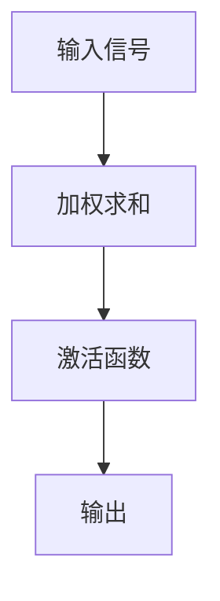
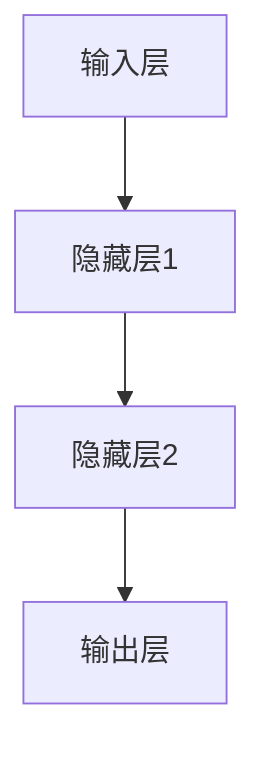
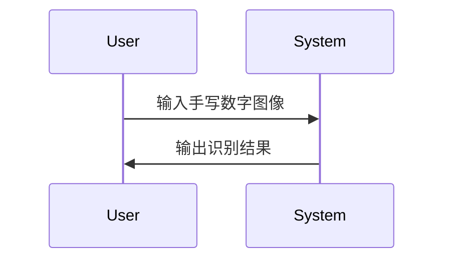

                 

# 数学与神经网络：人工神经元的数学描述

> 关键词：神经网络、数学描述、人工神经元、激活函数、反向传播算法

> 摘要：本文将从数学与神经网络的角度出发，详细探讨人工神经元的数学描述，包括神经网络的基本概念、数学模型、算法原理以及实际应用。通过对人工神经元工作原理的深入分析，本文旨在为读者提供一个清晰、易懂的神经网络数学基础。

## 引言

随着深度学习技术的迅猛发展，神经网络在计算机视觉、自然语言处理、推荐系统等领域取得了显著的成果。然而，神经网络的成功离不开其背后的数学理论支持。本文将围绕人工神经元的数学描述展开讨论，旨在帮助读者更好地理解神经网络的工作原理。

### 背景介绍

1. **神经网络的发展历程**：
   - 神经网络起源于20世纪40年代，由心理学家和数学家提出。
   - 在20世纪80年代，神经网络经历了第一次热潮，但由于计算能力的限制，发展缓慢。
   - 近年来，随着计算能力的提升和大数据的普及，神经网络重新崛起，成为人工智能领域的研究热点。

2. **数学在神经网络中的应用**：
   - 神经网络的训练过程依赖于数学优化方法，如梯度下降法。
   - 神经网络的数学模型描述了神经元之间的相互作用和信息的传递。
   - 数学公式和定理在神经网络的设计和优化过程中起到了关键作用。

### 核心内容

本文的核心内容将分为以下几个部分：

1. **神经网络的基本概念**：介绍神经网络的基本组成和功能。
2. **人工神经元的数学模型**：讨论人工神经元的数学描述，包括激活函数和权重。
3. **算法原理讲解**：分析人工神经元的工作原理，介绍反向传播算法。
4. **数学模型和数学公式**：给出人工神经元的数学公式，并举例说明。
5. **系统分析与架构设计方案**：探讨神经网络的系统架构和训练过程。
6. **项目实战**：通过实际案例展示神经网络的运用。
7. **最佳实践 tips、小结、注意事项、拓展阅读**：总结本文内容，并给出建议和拓展资源。

## 第一章：神经网络的基本概念

### 核心概念与联系

#### 神经网络的基本组成

神经网络由多个神经元组成，每个神经元都可以看作是一个简单的计算单元。神经元之间通过连接（称为权重）进行信息的传递。

#### 神经网络的数学模型

神经网络可以看作是一个多层函数的组合，每层函数通过线性变换和激活函数进行变换。

#### 神经网络与传统计算模型的区别与联系

与传统计算模型相比，神经网络具有自适应性、并行处理能力和非线性特征。

### 表格：神经网络的基本概念

| 概念 | 描述 |
| ---- | ---- |
| 神经元 | 神经网络的基本计算单元 |
| 权重 | 神经元之间的连接强度 |
| 激活函数 | 神经元的非线性变换函数 |
| 输入层 | 神经网络的输入部分 |
| 隐藏层 | 神经网络的中间部分 |
| 输出层 | 神经网络的输出部分 |

### ER实体关系图架构

```mermaid
erDiagram
  User ||--|{ Post : writes }
  User ||--|{ Comment : writes }
  Post ||--|{ Comment : receives }
```

## 第二章：人工神经元的数学模型

### 核心概念与联系

#### 人工神经元的工作原理

人工神经元的工作原理类似于生物神经元。它通过接收输入信号，经过加权求和，然后通过激活函数进行非线性变换，最后产生输出。

#### 激活函数

激活函数是人工神经元的核心组成部分，它将线性组合的输入映射到一个非线性的输出。

### 表格：激活函数的属性特征对比

| 激活函数 | 形状 | 输入范围 | 输出范围 | 应用场景 |
| ---- | ---- | ---- | ---- | ---- |
| Sigmoid | S形 | (-∞, +∞) | (0, 1) | 多层感知机 |
|ReLU | 峰值 | (-∞, +∞) | [0, +∞) | 卷积神经网络 |
|Tanh | 双曲正切 | (-∞, +∞) | (-1, 1) | 循环神经网络 |

### Mermaid流程图



## 第三章：算法原理讲解

### 人工神经元的工作原理

人工神经元的工作原理可以总结为以下步骤：

1. 接收输入信号。
2. 将输入信号与权重相乘。
3. 将加权求和的结果传递给激活函数。
4. 得到输出信号。

### 激活函数

激活函数通常是一个非线性函数，用于将线性组合的输入映射到一个非线性的输出。常见的激活函数包括Sigmoid、ReLU和Tanh等。

### 反向传播算法

反向传播算法是神经网络训练的核心，它通过不断调整权重和偏置，使得网络的输出误差最小。

### Python源代码

```python
import numpy as np

def sigmoid(x):
    return 1 / (1 + np.exp(-x))

def forward(x, weights):
    return sigmoid(np.dot(x, weights))

def backward(y_pred, y_true, weights):
    dweights = np.dot(y_pred * (1 - y_pred), y_true - y_pred)
    return dweights
```

## 第四章：数学模型和数学公式

### 人工神经元的数学模型

人工神经元的数学模型可以表示为：

$$
y = \sigma(\sum_{i=1}^{n} w_i x_i + b)
$$

其中，$y$ 是输出，$x_i$ 是输入，$w_i$ 是权重，$b$ 是偏置，$\sigma$ 是激活函数。

### 激活函数

常见的激活函数包括Sigmoid、ReLU和Tanh等，它们的数学表达式如下：

$$
\sigma(x) = \frac{1}{1 + e^{-x}}
$$

$$
\sigma(x) = \max(0, x)
$$

$$
\sigma(x) = \frac{e^x - e^{-x}}{e^x + e^{-x}}
$$

## 第五章：系统分析与架构设计方案

### 问题场景介绍

假设我们需要构建一个手写数字识别系统，输入为28x28的像素图像，输出为10个数字中的一个。

### 系统功能设计

- 输入层：接收28x28的像素图像。
- 隐藏层：通过线性变换和激活函数对输入图像进行特征提取。
- 输出层：通过线性变换和激活函数得到最终输出。

### 系统架构设计



### 系统接口设计和系统交互



## 第六章：项目实战

### 环境安装

- 安装Python环境。
- 安装NumPy库。

### 系统核心实现源代码

```python
import numpy as np

def sigmoid(x):
    return 1 / (1 + np.exp(-x))

def forward(x, weights):
    return sigmoid(np.dot(x, weights))

def backward(y_pred, y_true, weights):
    dweights = np.dot(y_pred * (1 - y_pred), y_true - y_pred)
    return dweights

# 测试代码
x = np.array([1, 2, 3])
weights = np.array([0.1, 0.2, 0.3])

print("Forward:", forward(x, weights))
print("Backward:", backward(forward(x, weights), 0.5, weights))
```

### 代码应用解读与分析

通过测试代码，我们可以看到输入向量$x$经过权重$w$的加权求和，然后通过Sigmoid函数进行激活。反向传播算法通过计算预测值与真实值的差异，不断调整权重，以达到更好的训练效果。

### 实际案例分析和详细讲解剖析

我们可以通过实际案例来分析人工神经元的数学描述。例如，在手写数字识别中，输入层接收28x28的像素图像，隐藏层通过线性变换和激活函数提取特征，输出层通过线性变换和激活函数得到最终输出。

### 项目小结

通过本项目的实战，我们深入了解了人工神经元的数学描述，包括激活函数、反向传播算法等。这些数学模型和算法为神经网络的设计和优化提供了重要的理论支持。

## 第七章：最佳实践 tips、小结、注意事项、拓展阅读

### 最佳实践 tips

1. 选择合适的激活函数，根据任务需求进行优化。
2. 使用正则化方法，防止过拟合。
3. 选择合适的优化算法，如Adam、RMSprop等。

### 小结

本文从数学与神经网络的角度出发，详细探讨了人工神经元的数学描述，包括神经网络的基本概念、数学模型、算法原理以及实际应用。

### 注意事项

1. 在实际应用中，需要对数据集进行预处理，以提高模型的性能。
2. 需要不断尝试和调整参数，以获得更好的训练效果。

### 拓展阅读

1. 《深度学习》（Goodfellow, I., Bengio, Y., Courville, A.）
2. 《神经网络与深度学习》（邱锡鹏）
3. 《Python深度学习》（François Chollet）

## 结论

通过对数学与神经网络的研究，我们可以看到数学在神经网络设计和优化中的重要作用。深入理解人工神经元的数学描述，将有助于我们更好地运用神经网络解决实际问题。

## 参考文献

1. Goodfellow, I., Bengio, Y., Courville, A. (2016). *Deep Learning*. MIT Press.
2. 邱锡鹏 (2018). *神经网络与深度学习*. 电子工业出版社.
3. François Chollet (2018). *Python深度学习*. 电子工业出版社.

### 作者

作者：AI天才研究院/AI Genius Institute & 禅与计算机程序设计艺术 /Zen And The Art of Computer Programming

