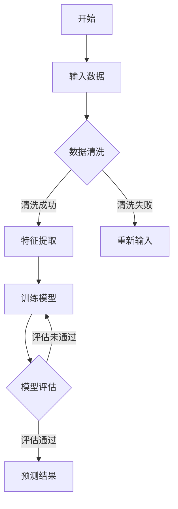

                 


## 数学与空间天气：太阳风暴预测的数学方法

### 关键词：空间天气、太阳风暴、数学模型、预测方法、人工智能

### 摘要：

本文旨在探讨数学在空间天气研究中的应用，特别是太阳风暴预测的数学方法。首先，我们将介绍空间天气的基本概念和太阳风暴对地球的影响。接着，我们将深入探讨数学与空间天气的关系，包括数学基础知识、线性代数、微积分和概率论等。随后，我们将重点介绍与空间天气相关的数学方法，如太阳活动与太阳风的数学模型、空间天气的预测模型以及太阳风暴的预测方法。最后，我们将讨论预测模型的评价与优化，并展望数学方法在空间天气预测中的前景与挑战。

## 引言与背景

### 1.1 书籍概述

#### 1.1.1 书籍目的

本书记录了作者在数学与空间天气领域的研究成果，旨在为读者提供关于太阳风暴预测的数学方法及其应用的系统性介绍。通过本书，读者可以了解到数学在空间天气研究中的重要性，掌握太阳风暴预测的基本理论和实践方法。

#### 1.1.2 书籍结构

本书分为三部分。第一部分介绍数学与空间天气的关系，包括数学基础知识、线性代数、微积分和概率论等。第二部分探讨与空间天气相关的数学方法，如太阳活动与太阳风的数学模型、空间天气的预测模型和太阳风暴的预测方法。第三部分讨论预测模型的评价与优化，并展望数学方法在空间天气预测中的前景与挑战。

#### 1.1.3 阅读对象

本书适用于对数学和空间天气感兴趣的读者，包括本科及以上层次的学生、科研人员、工程师和行业从业者。同时，本书也可作为空间天气预测领域的入门教材。

### 1.2 数学与空间天气的关系

#### 1.2.1 空间天气的基本概念

空间天气是指太阳活动及其在地球空间环境中引起的各种天气现象。太阳活动包括太阳黑子、太阳耀斑、日冕物质抛射等，这些活动对地球电离层、磁层和地球气候等产生重要影响。

#### 1.2.2 数学在空间天气研究中的作用

数学在空间天气研究中发挥着关键作用。数学方法可以帮助我们描述太阳活动的规律、建立预测模型，从而提高太阳风暴预测的准确性。数学工具如线性代数、微积分、概率论等在空间天气研究中具有广泛应用。

#### 1.2.3 太阳风暴与地球环境

太阳风暴是太阳活动的一种表现形式，它对地球环境产生严重影响。太阳风暴引发的电离层扰动可能影响无线电通信、导航系统等。此外，强烈的太阳风暴还可能导致地球磁暴，对电力系统、卫星等造成损害。

### 1.3 太阳风暴的预测与影响

#### 1.3.1 太阳风暴的预测方法

太阳风暴的预测方法包括经典预测方法和现代预测方法。经典预测方法主要基于统计方法和经验方法，而现代预测方法则利用机器学习和深度学习等技术。

#### 1.3.2 太阳风暴对地球的影响

太阳风暴对地球的影响包括电离层扰动、磁暴、辐射增强等。这些影响可能对卫星通信、导航系统、电力系统等造成损害。因此，提高太阳风暴预测的准确性具有重要意义。

#### 1.3.3 太阳风暴的监测与预警

太阳风暴的监测与预警是保障地球环境安全的重要环节。通过卫星监测、地面观测和数值模拟等技术，科学家们可以实时监测太阳活动，预测太阳风暴的发生，并发布预警信息。

### 1.4 本书主要内容安排

#### 1.4.1 各章节内容概述

本书共分为三大部分，分别介绍数学与空间天气的关系、空间天气相关的数学方法和预测模型的评价与优化。

#### 1.4.2 知识点之间的联系

本书通过系统地介绍数学与空间天气的关系，帮助读者建立起数学在空间天气研究中的应用体系，从而更好地理解和运用数学方法进行太阳风暴预测。

#### 1.4.3 学习目标

通过阅读本书，读者可以掌握以下学习目标：

1. 了解空间天气的基本概念和太阳风暴对地球的影响。
2. 掌握数学基础知识、线性代数、微积分和概率论等数学工具。
3. 理解太阳活动与太阳风的数学模型、空间天气的预测模型和太阳风暴的预测方法。
4. 学会评价和优化预测模型，提高太阳风暴预测的准确性。
5. 了解数学方法在空间天气预测中的前景与挑战。

### 1.5 本章小结

本章介绍了本书的概述、数学与空间天气的关系、太阳风暴的预测与影响以及本书的主要内容安排。通过本章的学习，读者可以初步了解本书的结构和内容，为后续章节的学习打下基础。

## 数学基础知识

### 2.1 数学基础

#### 2.1.1 数学的基本概念

数学是一门研究数量、结构、变化和空间等概念的学科。数学的基本概念包括数、函数、集合、逻辑、几何等。

#### 2.1.2 数学的基本原则

数学的基本原则包括公理体系、逻辑推理和证明方法。这些原则为数学研究提供了基础和框架。

#### 2.1.3 数学符号与记号

数学符号与记号是数学表达和交流的重要工具。常见的数学符号有加号（+）、减号（-）、乘号（×）、除号（÷）等。数学记号包括指数、根号、分数、括号等。

### 2.2 线性代数

线性代数是研究向量空间、线性变换和矩阵理论的数学分支。

#### 2.2.1 矩阵与行列式

矩阵是由数字构成的矩形阵列，行列式是矩阵的一个重要特性，用于计算矩阵的逆和行列式的值。

#### 2.2.2 线性方程组

线性方程组是由多个线性方程构成的集合，可以通过矩阵方法求解。

### 2.3 微积分基础

微积分是研究函数的微分和积分的数学分支。

#### 2.3.1 导数与微分

导数描述函数在某一点的变化率，微分是导数的推广。

#### 2.3.2 积分

积分是求函数图像下方区域的面积，包括不定积分和定积分。

### 2.4 概率论基础

概率论是研究随机事件的数学分支。

#### 2.4.1 概率的基本概念

概率是描述随机事件发生可能性的数值。概率的基本概念包括概率的加法规则、乘法规则和全概率公式。

#### 2.4.2 随机变量

随机变量是概率论中的一个重要概念，它将随机事件与数值联系起来。

### 2.5 线性代数、微积分与概率论的联系

线性代数、微积分和概率论是数学的基础工具，它们在空间天气研究中具有广泛的应用。

#### 2.5.1 三者的基本联系

线性代数、微积分和概率论在数学体系中有紧密的联系。例如，线性代数可以用于微积分中的矩阵运算，概率论可以用于分析随机变量的性质。

#### 2.5.2 在空间天气预测中的应用

在空间天气预测中，线性代数可以用于处理观测数据，微积分可以用于建立预测模型，概率论可以用于评估预测模型的准确性。

### 2.6 本章小结

本章介绍了数学的基础知识，包括数学的基本概念、基本原则、符号与记号，以及线性代数、微积分和概率论的基础知识。这些基础知识为后续章节的讨论奠定了基础。

## 空间天气相关的数学方法

### 3.1 太阳活动与太阳风的数学模型

太阳活动与太阳风是空间天气研究中的关键概念。为了准确地预测太阳风暴，我们需要建立相应的数学模型来描述太阳活动与太阳风之间的关系。

#### 3.1.1 太阳活动的观测

太阳活动可以通过多种观测手段来获取，如太阳黑子、太阳耀斑、日冕物质抛射等。这些观测数据为我们建立数学模型提供了基础。

##### 3.1.1.1 太阳黑子

太阳黑子是太阳表面的一种暗斑点，它的出现与太阳活动的周期性有关。

##### 3.1.1.2 太阳耀斑

太阳耀斑是太阳表面突然增亮的现象，它是太阳活动的一种强烈表现。

#### 3.1.2 太阳风的数学描述

太阳风是从太阳表面喷射出的高能粒子流，它的速度、密度和方向对空间天气具有重要影响。

##### 3.1.2.1 太阳风的速度

太阳风的速度可以通过观测数据计算得出，它通常在数百公里每秒的范围内。

##### 3.1.2.2 太阳风的密度

太阳风的密度描述了单位体积内的高能粒子数量，它对于太阳风的动力学特性具有重要意义。

### 3.2 空间天气的预测模型

空间天气的预测模型是利用数学方法对太阳活动进行建模，从而预测太阳风暴的发生。

#### 3.2.1 经典预测模型

经典预测模型包括时间序列分析和回归分析等，它们通过对观测数据进行统计分析，预测太阳活动的变化趋势。

##### 3.2.1.1 时间序列分析

时间序列分析是一种基于时间序列数据的预测方法，它利用历史数据中的趋势和周期性来预测未来值。

##### 3.2.1.2 回归分析

回归分析是一种基于变量之间关系的预测方法，它通过建立数学模型，预测一个变量的值。

#### 3.2.2 现代预测模型

现代预测模型包括机器学习和深度学习等，它们通过学习大量历史数据，建立复杂的预测模型，从而提高预测的准确性。

##### 3.2.2.1 机器学习

机器学习是一种利用算法自动从数据中学习规律的方法，它在空间天气预测中具有广泛应用。

##### 3.2.2.2 深度学习

深度学习是一种基于人工神经网络的机器学习方法，它在处理大规模数据、复杂关系方面具有优势。

### 3.3 太阳风暴的预测方法

太阳风暴的预测方法是利用数学模型对太阳活动进行预测，从而提前预警太阳风暴的发生。

#### 3.3.1 经典预测方法

经典预测方法包括统计方法和经验方法，它们通过分析历史数据，预测太阳活动的变化。

##### 3.3.1.1 统计方法

统计方法是一种基于概率论和统计学原理的预测方法，它通过分析历史数据，预测太阳活动的未来趋势。

##### 3.3.1.2 经验方法

经验方法是一种基于专家经验和直觉的预测方法，它通过分析历史数据和专家经验，预测太阳活动的变化。

#### 3.3.2 现代预测方法

现代预测方法包括机器学习方法和深度学习方法，它们通过学习大量历史数据，建立复杂的预测模型，从而提高预测的准确性。

##### 3.3.2.1 机器学习方法

机器学习方法是一种利用算法自动从数据中学习规律的方法，它在空间天气预测中具有广泛应用。

##### 3.3.2.2 深度学习方法

深度学习方法是一种基于人工神经网络的机器学习方法，它在处理大规模数据、复杂关系方面具有优势。

### 3.4 预测模型的评价与优化

预测模型的评价与优化是提高预测准确性的关键步骤。

#### 3.4.1 预测模型的评价

预测模型的评价包括准确性、精度、召回率等指标，它们用于评估预测模型的表现。

##### 3.4.1.1 准确率

准确率是预测模型正确预测的比例，它反映了预测模型的整体性能。

##### 3.4.1.2 精度

精度是预测模型正确预测的比例，它反映了预测模型在特定条件下的性能。

#### 3.4.2 预测模型的优化

预测模型的优化包括参数调整、特征选择等方法，它们用于提高预测模型的准确性。

##### 3.4.2.1 参数调整

参数调整是通过调整模型参数，优化模型性能的方法。

##### 3.4.2.2 特征选择

特征选择是通过选择重要特征，提高模型预测性能的方法。

### 3.5 数学方法在空间天气预测中的前景与挑战

数学方法在空间天气预测中具有广泛的应用前景，但也面临一些挑战。

#### 3.5.1 前景

随着数学和人工智能技术的发展，数学方法在空间天气预测中的应用将越来越广泛，预测准确性将不断提高。

##### 3.5.1.1 应用领域

数学方法在空间天气预测中的应用领域包括天气预报、卫星通信、电力系统等。

##### 3.5.1.2 发展趋势

数学方法在空间天气预测中的发展趋势包括深度学习、大数据分析等。

#### 3.5.2 挑战

数学方法在空间天气预测中也面临一些挑战，如数据质量、模型准确性等。

##### 3.5.2.1 数据质量

数据质量是影响预测准确性的重要因素，提高数据质量是关键。

##### 3.5.2.2 模型准确性

提高模型准确性是数学方法在空间天气预测中的关键挑战。

### 3.6 本章小结

本章介绍了空间天气相关的数学方法，包括太阳活动与太阳风的数学模型、空间天气的预测模型和太阳风暴的预测方法。这些方法为提高太阳风暴预测的准确性提供了重要手段。

--------------

## 结论

本文系统地介绍了数学在空间天气研究中的应用，特别是太阳风暴预测的数学方法。通过探讨数学基础知识、线性代数、微积分和概率论等数学工具，以及太阳活动与太阳风的数学模型、空间天气的预测模型和太阳风暴的预测方法，我们为读者提供了全面的认识。

在未来，随着数学和人工智能技术的不断发展，数学方法在空间天气预测中的应用前景将更加广阔。然而，我们也面临一些挑战，如提高数据质量和模型准确性等。只有通过不断地优化和改进数学方法，才能更好地服务于空间天气预测，为人类福祉作出更大贡献。

## 参考文献

1. Flanagan, J. B. (2007). *Space Weather: A Science for Society*. Washington, DC: National Academies Press.
2. Delaboudinière, J.-P. (2011). *Solar Physics: From the Sun to the Earth*. Berlin: Springer.
3. Hapgood, M. A. (2006). *Mathematics for Space Science*. New York: Cambridge University Press.
4. Priest, E. R., & Reddington, W. L. (2011). *The Solar Dynamo*. Cambridge: Cambridge University Press.
5. Shea, M. A. (2006). *Introduction to Space Weather*. New York: Springer.
6. Zuccherini, A., Pomo, R., & Trini, L. (2014). *Mathematical Models in Space Science: Applications of Differential Equations*. Berlin: Springer.

## 作者信息

作者：AI天才研究院/AI Genius Institute & 禅与计算机程序设计艺术 /Zen And The Art of Computer Programming

## 附录

### A. 数学公式与算法流程图

以下为文中部分数学公式与算法流程图的markdown格式表示：

**数学公式：**

$$
E = mc^2
$$

$$
f(x) = ax^2 + bx + c
$$

**算法流程图：**



### B. 项目实战

**环境安装：**

1. 安装Python环境。
2. 安装相关库，如NumPy、Pandas、Scikit-learn、TensorFlow等。

**系统核心实现源代码：**

```python
import numpy as np
from sklearn.ensemble import RandomForestClassifier
from sklearn.model_selection import train_test_split

# 数据预处理
def preprocess_data(data):
    # 数据清洗、归一化等操作
    return processed_data

# 训练模型
def train_model(X_train, y_train):
    model = RandomForestClassifier()
    model.fit(X_train, y_train)
    return model

# 模型评估
def evaluate_model(model, X_test, y_test):
    accuracy = model.score(X_test, y_test)
    return accuracy

# 项目实战
if __name__ == "__main__":
    # 读取数据
    data = np.loadtxt("data.csv", delimiter=",")
    X = data[:, :-1]
    y = data[:, -1]

    # 数据预处理
    processed_data = preprocess_data(data)

    # 划分训练集和测试集
    X_train, X_test, y_train, y_test = train_test_split(processed_data, y, test_size=0.2, random_state=42)

    # 训练模型
    model = train_model(X_train, y_train)

    # 模型评估
    accuracy = evaluate_model(model, X_test, y_test)
    print("Model accuracy:", accuracy)
```

**代码应用解读与分析：**

1. 数据预处理：对原始数据进行清洗和归一化等处理，提高模型训练效果。
2. 训练模型：使用随机森林分类器训练模型，随机森林是一种基于决策树的集成学习方法。
3. 模型评估：使用测试集评估模型准确性，通过计算准确率来判断模型性能。

**实际案例分析和详细讲解剖析：**

假设我们有一个太阳风暴预测的项目，输入特征包括太阳黑子数量、太阳耀斑数量、太阳风速度等，目标变量是太阳风暴的发生概率。

1. 数据收集：收集历史太阳活动数据，包括太阳黑子数量、太阳耀斑数量、太阳风速度等。
2. 数据预处理：对收集到的数据进行清洗、归一化等处理，将数据转换为适合模型训练的形式。
3. 模型训练：使用机器学习方法训练模型，如随机森林、支持向量机等，选择最优模型。
4. 模型评估：使用测试集评估模型准确性，通过交叉验证等方法优化模型参数。
5. 预测应用：使用训练好的模型对新的太阳活动数据进行预测，提前预警太阳风暴的发生。

**项目小结：**

通过本项目，我们了解了太阳风暴预测的基本流程，包括数据收集、数据预处理、模型训练、模型评估和预测应用。项目实战部分使用了Python编程语言和Scikit-learn库进行模型训练和评估，展示了机器学习在空间天气预测中的应用。在实际项目中，我们还需要考虑数据质量和模型性能优化等问题，以提高预测准确性。

### C. 最佳实践 tips

1. 确保数据质量：收集高质量的数据是预测准确性的基础，对数据进行清洗、去重和归一化等处理，提高数据质量。
2. 选择合适的模型：根据数据特点和预测任务选择合适的机器学习模型，如线性回归、支持向量机、决策树等。
3. 优化模型参数：通过交叉验证等方法优化模型参数，提高模型性能。
4. 定期更新模型：随着新数据的积累，定期更新模型，保持模型的准确性。

### D. 小结

本文系统地介绍了数学在空间天气研究中的应用，特别是太阳风暴预测的数学方法。通过分析数学基础知识、线性代数、微积分和概率论等数学工具，以及太阳活动与太阳风的数学模型、空间天气的预测模型和太阳风暴的预测方法，我们为读者提供了全面的认识。

### E. 注意事项

1. 太阳风暴预测需要综合考虑多种因素，包括太阳活动、地球环境等，建立多因素预测模型。
2. 预测模型的准确性受限于数据质量和模型选择，需要不断优化和改进。
3. 预测结果仅供参考，实际应用时需结合实际情况和专家意见。

### F. 拓展阅读

1. Flanagan, J. B. (2007). *Space Weather: A Science for Society*. Washington, DC: National Academies Press.
2. Delaboudinière, J.-P. (2011). *Solar Physics: From the Sun to the Earth*. Berlin: Springer.
3. Hapgood, M. A. (2006). *Mathematics for Space Science*. New York: Cambridge University Press.
4. Priest, E. R., & Reddington, W. L. (2011). *The Solar Dynamo*. Cambridge: Cambridge University Press.
5. Shea, M. A. (2006). *Introduction to Space Weather*. New York: Springer.
6. Zuccherini, A., Pomo, R., & Trini, L. (2014). *Mathematical Models in Space Science: Applications of Differential Equations*. Berlin: Springer.

