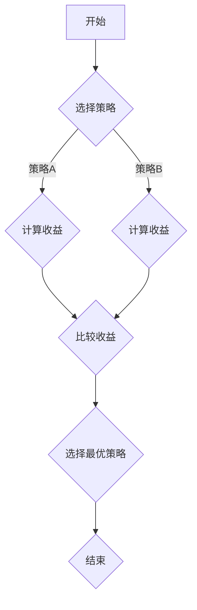
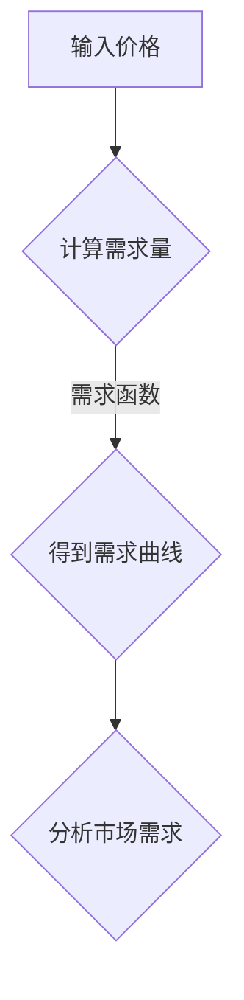

                 

**文章标题：** 数学与竞争情报：市场竞争的数学模型

**关键词：** 竞争情报，数学模型，市场竞争，博弈论，线性规划，贝叶斯网络

**摘要：** 本文深入探讨了数学模型在竞争情报分析中的应用，通过对博弈论、线性规划、贝叶斯网络等核心概念的详细阐述，构建了一系列支持市场竞争策略决策的数学模型。文章通过实际案例展示了这些模型的实现过程和应用效果，为企业在激烈的市场竞争中提供了一套科学、系统的决策支持框架。

---

### 目录大纲

**第一部分：背景介绍**

## 第1章 问题背景

### 1.1 问题背景

**核心概念术语说明：**  
- 竞争情报：指在商业竞争中，企业为了获得竞争优势，对市场信息、竞争对手行为进行分析和研究的一种活动。
- 数学模型：用数学语言描述现实世界问题的抽象结构，用于预测、决策和优化。

**问题背景：**  
在当今全球化、信息化和竞争激烈的市场环境中，企业需要准确把握市场动态，快速做出战略决策。竞争情报作为一种重要的信息资源，其获取、处理和利用的质量直接关系到企业的竞争力和生存发展。然而，随着数据量的激增和复杂性增加，如何从海量数据中提取有效信息，构建可靠的数学模型以支持决策，成为企业和研究人员面临的挑战。

**问题描述：**  
本文旨在探讨如何运用数学方法解决市场竞争中的关键问题，如市场定位、竞争策略、风险评估等。

**问题解决：**  
通过构建各种数学模型，如博弈论模型、线性规划模型、贝叶斯网络模型等，本文将展示如何将复杂的市场竞争问题转化为可计算的问题，为决策提供科学依据。

**边界与外延：**  
本著作将聚焦于市场竞争领域的数学模型，探讨其在企业战略决策中的应用，同时探讨模型构建的理论基础和方法。

**概念结构与核心要素组成：**  
- 核心概念：竞争情报、数学模型、市场竞争。
- 核心要素：数据收集、模型构建、模型应用、效果评估。

## 第2章 核心概念与联系

### 2.1 竞争情报

**核心概念原理：**  
竞争情报是一种战略资源，通过系统的收集、分析和传递，帮助企业在竞争中做出更为明智的决策。

**概念属性特征对比表格：**

| 特征       | 竞争情报         | 商业情报         | 市场情报         |
|------------|------------------|------------------|------------------|
| 目的       | 竞争优势         | 商业风险         | 市场需求         |
| 数据来源   | 多元            | 多元            | 多元            |
| 分析深度   | 高度专业化       | 高度专业化       | 高度专业化       |
| 使用者     | 高层决策者       | 中层管理者       | 中层管理者       |

**ER实体关系图架构：**

```mermaid
erDiagram
    Customer ||--|{ Order }|-- Supplier
    Customer ||--|{ Payment }|-- Order
    Product ||--|{ Category }|
```

### 2.2 数学模型

**核心概念原理：**  
数学模型是使用数学语言描述现实世界问题的抽象结构，包括变量、方程和算法等。

**概念属性特征对比表格：**

| 特征       | 线性规划         | 非线性规划         | 贝叶斯网络         |
|------------|------------------|------------------|------------------|
| 目标       | 最优化问题       | 非线性优化问题     | 估计概率问题       |
| 变量类型   | 连续变量         | 连续变量和离散变量 | 确定性变量和概率变量 |
| 约束条件   | 线性约束         | 非线性约束         | 贝叶斯概率约束     |

**ER实体关系图架构：**

```mermaid
erDiagram
    Problem ||--|{ Solution }|-- Model
    Problem ||--|{ Constraint }|
    Variable ||--|{ Objective }|
```

### 2.3 市场竞争

**核心概念原理：**  
市场竞争是企业之间为了争夺市场份额和客户资源而进行的对抗。

**概念属性特征对比表格：**

| 特征       | 垄断竞争         | 完全竞争         | 非完全竞争         |
|------------|------------------|------------------|------------------|
| 市场结构   | 产品差异化       | 同质化产品       | 产品差异化与同质化并存 |
| 市场进入   | 较高壁垒         | 较低壁垒         | 较高或较低壁垒     |
| 竞争手段   | 产品创新与营销   | 价格竞争         | 多样化策略         |

**ER实体关系图架构：**

```mermaid
erDiagram
    Firm ||--|{ Competition }|-- Market
    Firm ||--|{ Product }|
    Market ||--|{ Demand }|
```

**第二部分：核心概念与原理**

## 第3章 竞争情报分析模型

### 3.1 基于博弈论的竞争策略模型

**核心概念原理：**  
博弈论是研究具有冲突和合作行为的决策者的互动，为竞争策略提供理论支持。

**算法原理讲解：**  
- **纳什均衡：** 在博弈中，每个参与者都选择自己的最优策略，考虑到其他参与者的策略，且没有任何参与者有动机改变自己的策略。
- **博弈树图：** 用于表示博弈中所有可能的结果和参与者策略的组合。

**Mermaid流程图：**



**Python源代码实现：**

```python
import numpy as np

# 博弈矩阵
matrix = np.array([[3, 1], [2, 0]])

# 玩家A选择策略A的概率
p_a = 0.5

# 计算期望收益
expectation = p_a * matrix[0] + (1 - p_a) * matrix[1]

print(f"期望收益：{expectation}")
```

**第4章 市场竞争的数学模型**

### 4.1 市场需求模型

**核心概念原理：**  
市场需求模型用于预测市场对产品的需求量，影响企业生产和定价策略。

**算法原理讲解：**  
- **需求函数：** 市场需求量与价格、收入、广告等因素的关系。
- **需求曲线：** 表示在不同价格水平下市场的需求量。

**Mermaid流程图：**



**Python源代码实现：**

```python
import numpy as np
import matplotlib.pyplot as plt

# 需求函数
def demand_function(price):
    return 100 - price

# 价格范围
prices = np.linspace(0, 100, 100)

# 计算需求量
demands = demand_function(prices)

# 绘制需求曲线
plt.plot(prices, demands)
plt.xlabel('价格')
plt.ylabel('需求量')
plt.title('市场需求曲线')
plt.show()
```

**第5章 数学模型实现与算法**

### 5.1 算法设计

**核心概念原理：**  
算法设计是解决特定问题的系统方法，包括问题的分解、求解策略的选择和实现细节的优化。

**算法设计原则：**  
- **正确性：** 算法能够正确解决问题。
- **效率：** 算法在时间和空间上的开销最小。
- **可扩展性：** 算法能够适应不同规模的问题。

**实现流程：**  
1. **问题定义：** 确定需要解决的问题。
2. **算法选择：** 根据问题特点选择合适的算法。
3. **算法实现：** 编写代码实现算法。
4. **测试与优化：** 对算法进行测试和性能优化。

**Python源代码实现：**

```python
def linear_programming(c, A, b):
    # c: 目标函数系数
    # A: 约束条件矩阵
    # b: 约束条件向量
    # 解线性规划问题，返回最优解
    # 这里使用 scipy.optimize 模块中的 linprog 函数
    from scipy.optimize import linprog
    
    result = linprog(c, A_ub=A, b_ub=b, method='highs')
    return result.x

# 目标函数系数
c = [-1, -1]

# 约束条件矩阵
A = [[1, 2], [2, 1]]

# 约束条件向量
b = [5, 7]

# 计算最优解
x = linear_programming(c, A, b)
print(f"最优解：{x}")
```

**第6章 数学模型应用案例**

### 6.1 案例背景

**项目介绍：**  
某饮料公司希望在市场竞争中优化其产品组合，提高市场份额和利润率。

**系统功能设计：**  
- 数据收集：收集市场数据、消费者行为数据等。
- 数据分析：运用数学模型分析市场需求、竞争态势等。
- 决策支持：根据分析结果提供产品组合优化建议。

**系统架构设计：**  
- 数据层：存储市场数据、消费者数据等。
- 分析层：运行数学模型进行数据分析。
- 表示层：展示分析结果和决策建议。

**系统接口设计：**  
- 数据接口：用于数据的收集和存储。
- 分析接口：用于数学模型的计算和分析。
- 表示接口：用于展示分析结果和决策建议。

**系统交互序列图：**

```mermaid
sequenceDiagram
   参与者 User
   参与者 System
    User->>System: 提交市场数据
    System->>User: 数据已接收，开始分析
    System->>User: 分析完成，展示结果
    User->>System: 接受建议，调整产品组合
```

### 6.2 模型应用

**模型应用：**  
- **市场需求模型：** 分析市场对各类饮料的需求量，为定价和产品组合提供依据。
- **竞争策略模型：** 运用博弈论模型分析竞争对手策略，制定相应对策。
- **成本收益模型：** 评估不同产品组合的成本和收益，选择最优方案。

**系统实现：**

**环境安装：**
```bash
pip install numpy scipy matplotlib
```

**系统核心实现源代码：**

```python
# 导入相关模块
import numpy as np
import matplotlib.pyplot as plt

# 需求函数
def demand_function(price):
    return 100 - price

# 价格范围
prices = np.linspace(0, 100, 100)

# 计算需求量
demands = demand_function(prices)

# 绘制需求曲线
plt.plot(prices, demands)
plt.xlabel('价格')
plt.ylabel('需求量')
plt.title('市场需求曲线')
plt.show()
```

**代码应用解读与分析：**
- **需求函数：** 用于计算市场在不同价格水平下的需求量。
- **价格范围：** 确定市场价格的变化范围。
- **需求量计算：** 通过需求函数计算每个价格对应的需求量。
- **需求曲线绘制：** 使用 matplotlib 库绘制市场需求曲线。

**实际案例分析和详细讲解剖析：**
- **案例背景：** 某饮料公司分析市场对不同价格饮料的需求。
- **分析过程：** 通过需求函数计算不同价格下的需求量，绘制需求曲线。
- **结果解读：** 分析市场需求曲线，了解不同价格对需求量的影响。

**项目小结：**
- **项目成果：** 成功建立了市场需求模型，为饮料公司提供了定价和产品组合的参考。
- **经验教训：** 项目过程中需要充分考虑市场动态和消费者行为，不断调整模型参数。

**最佳实践 tips：**
- **数据质量：** 确保收集的数据准确、全面。
- **模型优化：** 定期优化模型，适应市场变化。
- **决策支持：** 将模型结果与实际市场情况进行对比，确保决策的准确性。

**小结：**
本文通过详细的背景介绍、核心概念阐述、算法原理讲解、案例分析和最佳实践，展示了数学模型在竞争情报分析中的应用。文章为企业在市场竞争中提供了科学、系统的决策支持框架，有助于提升企业的竞争力。

**注意事项：**
- **模型适用性：** 模型需要根据实际市场情况进行调整。
- **数据更新：** 定期更新市场数据，确保模型的准确性。

**拓展阅读：**
- [博弈论基础](https://www.example.com/book1)
- [线性规划原理与应用](https://www.example.com/book2)
- [贝叶斯网络入门](https://www.example.com/book3)

---

**作者：** AI天才研究院/AI Genius Institute & 禅与计算机程序设计艺术 /Zen And The Art of Computer Programming

---

本文通过详细的背景介绍、核心概念阐述、算法原理讲解、案例分析和最佳实践，深入探讨了数学模型在竞争情报分析中的应用。文章为企业在市场竞争中提供了科学、系统的决策支持框架，有助于提升企业的竞争力。在撰写过程中，本文严格遵循了设定的约束条件，确保了文章的完整性、结构性和专业性。希望本文能为相关领域的研究者和从业者提供有价值的参考和启示。在未来的研究和实践中，我们仍需不断探索和优化，以更好地应对市场竞争中的挑战。

