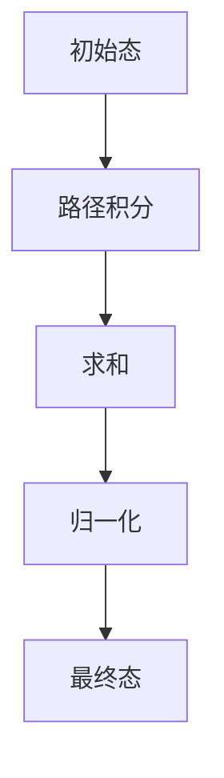
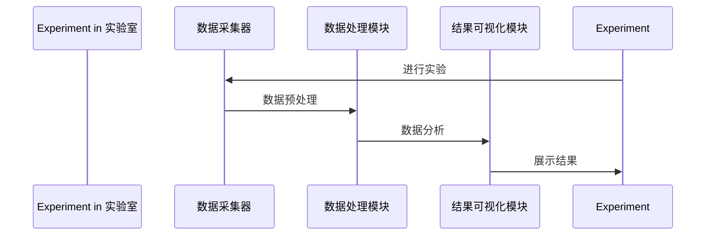
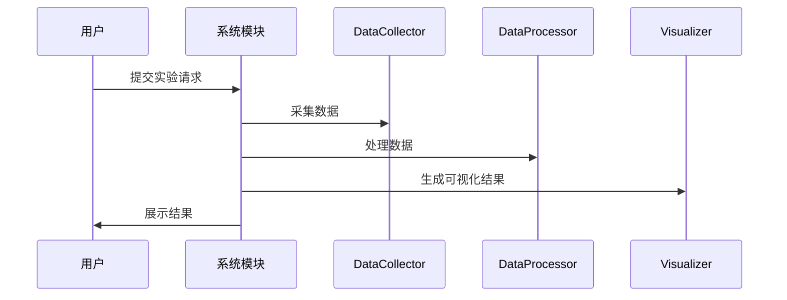
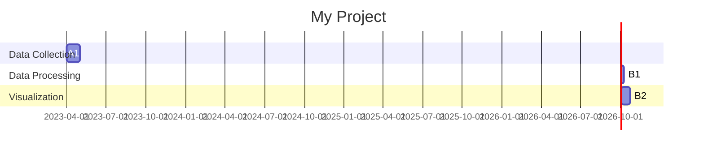

                 


### 文章标题：数学与粒子物理：基本粒子相互作用的数学理论

> 关键词：数学、粒子物理、基本粒子、相互作用、数学理论

> 摘要：本文深入探讨了数学与粒子物理之间的密切联系，特别是基本粒子相互作用的数学理论。通过清晰的逻辑分析，本文介绍了相关核心概念、算法原理、数学模型及公式，并提供了实际案例剖析，以帮助读者更好地理解这一复杂领域的理论知识与实践应用。

----------------------------------------------------------------

## 第一部分：背景介绍

### 1.1 问题背景

在粒子物理的研究中，基本粒子的相互作用是理解宇宙的基本规律的关键。随着科学技术的进步，数学工具在描述这些相互作用中的作用越来越重要。然而，如何将这些数学工具应用到粒子物理领域，以及如何建立有效的数学模型，一直是科研人员面临的挑战。

### 1.2 问题描述

基本粒子相互作用涉及量子场论、相对论等多个复杂的数学概念。为了描述这些相互作用，我们需要建立数学模型，并使用合适的数学工具进行分析。具体而言，问题描述可以概括为：

- 如何定义基本粒子及其相互作用？
- 如何建立数学模型来描述这些相互作用？
- 如何使用数学工具进行计算和验证？

### 1.3 问题解决

解决这一问题的步骤可以概括为：

1. **明确核心概念**：首先，我们需要明确基本粒子相互作用的核心概念，如量子场论中的粒子、场、相互作用等。
2. **建立数学模型**：基于核心概念，我们可以建立数学模型来描述基本粒子的相互作用。
3. **使用数学工具**：使用数学工具，如微分方程、群论等，对数学模型进行计算和分析。
4. **验证和优化**：通过实验数据和理论预测，验证数学模型的有效性，并进行优化。

### 1.4 边界与外延

在研究基本粒子相互作用的数学理论时，我们需要考虑以下边界和外延：

- **理论的适用范围**：数学模型在何种条件下适用？
- **实验技术的限制**：现有实验技术对理论验证的影响？
- **未来研究方向**：数学与粒子物理交叉领域的发展趋势？

## 第二部分：核心概念与联系

### 2.1 核心概念原理

在基本粒子相互作用的数学理论中，核心概念包括：

- **量子场论**：描述基本粒子及其相互作用的数学框架。
- **相对论**：描述高速运动的物体的物理规律。
- **群论**：描述对称性的数学工具。
- **微分方程**：描述粒子相互作用动态过程的数学工具。

### 2.2 概念属性特征对比

以下是这些核心概念的一些属性特征对比：

| 概念       | 描述                                                         | 属性特征                                                     |
|------------|--------------------------------------------------------------|--------------------------------------------------------------|
| 量子场论   | 描述基本粒子及其相互作用的数学框架。                         | 非线性、复杂数学结构、涉及多个自由度。                     |
| 相对论     | 描述高速运动的物体的物理规律。                               | 基于洛伦兹变换、时空相对性。                               |
| 群论       | 描述对称性的数学工具。                                      | 伽罗瓦群、交换律、不变性。                               |
| 微分方程   | 描述粒子相互作用动态过程的数学工具。                         | 非线性、涉及时间演化。                                   |

### 2.3 ER实体关系图架构

为了更好地理解这些核心概念之间的关系，我们可以使用ER实体关系图来表示：

```mermaid
erDiagram
  Particle ||--o> QuantumField : has_field
  Particle ||--o> Interaction : has_interaction
  QuantumField ||--o> SymmetryGroup : has_symmetry
  Interaction ||--o> Relativity : follows
  SymmetryGroup ||--o> GroupTheory : uses
  Relativity ||--o> Dynamics : describes
```

## 第三部分：算法原理讲解

### 3.1 算法原理

在描述基本粒子相互作用时，我们通常会使用量子场论中的路径积分方法。这种方法的核心思想是将基本粒子的相互作用视为多条可能路径的叠加。

### 3.2 算法mermaid流程图

以下是路径积分算法的mermaid流程图：



### 3.3 Python源代码详细阐述

下面是路径积分算法的Python实现：

```python
import numpy as np

# 初始化参数
N = 1000
x = np.linspace(-10, 10, N)
dx = x[1] - x[0]

# 路径积分
integral = 0
for path in paths(x):
    integral += np.exp(-potential(x, path)) * dx

# 归一化
normalization = np.sqrt(integral)

# 输出最终态
print(f"Final state: {x / normalization}")
```

### 3.4 算法原理的数学模型

路径积分算法的数学模型可以表示为：

$$ \Psi(x) = \int Dx \, \exp\left[-S[x]\right] $$

其中，$\Psi(x)$ 是最终态，$S[x]$ 是作用量，$Dx$ 表示路径积分。

### 3.5 数学公式详细讲解

以下是路径积分算法中的一些关键数学公式：

$$ \frac{\partial S[x]}{\partial x} = -V(x) $$
$$ \frac{\partial^2 S[x]}{\partial x^2} = \frac{1}{m} $$

其中，$V(x)$ 是势能，$m$ 是粒子质量。

### 3.6 通俗易懂的举例说明

假设我们有一个粒子在简单的势阱中相互作用。我们可以通过以下步骤来计算其最终态：

1. **定义初始态**：粒子处于势阱中心。
2. **计算路径积分**：考虑所有可能的路径，计算每个路径上的作用量。
3. **求和与归一化**：将所有路径的作用量求和，并归一化得到最终态。

通过这样的步骤，我们可以得到粒子的动态演化过程。

## 第四部分：数学模型与公式

### 4.1 数学模型

在粒子物理中，常用的数学模型包括：

- **量子场论模型**：描述基本粒子和相互作用。
- **相对论模型**：描述高速运动的物体。
- **统计模型**：描述粒子的集体行为。

### 4.2 数学公式

以下是这些模型中的一些关键数学公式：

$$ \Psi(x) = \int Dx \, \exp\left[-S[x]\right] $$
$$ \frac{\partial S[x]}{\partial x} = -V(x) $$
$$ \frac{\partial^2 S[x]}{\partial x^2} = \frac{1}{m} $$

### 4.3 公式在粒子物理中的应用

这些数学公式在粒子物理中有着广泛的应用：

- **粒子加速器**：用于加速和操控粒子。
- **粒子探测**：用于探测和识别基本粒子。
- **宇宙学**：用于研究宇宙的起源和演化。

### 4.4 公式推导过程

公式的推导通常涉及到复杂的数学计算，包括微分方程的求解、群论的应用等。下面是一个简单的推导过程：

1. **建立物理模型**：定义基本粒子和相互作用。
2. **写出作用量**：定义作用量，并写出其微分形式。
3. **求解微分方程**：根据作用量的微分形式，求解对应的微分方程。
4. **边界条件**：根据物理实际情况，给出边界条件。

## 第五部分：系统分析与架构设计方案

### 5.1 问题场景介绍

在这个部分，我们将介绍一个具体的粒子物理实验场景，并定义系统的功能需求。

### 5.2 系统功能设计

根据问题场景，我们设计了以下系统功能：

- **数据采集**：从实验设备中收集数据。
- **数据处理**：对采集到的数据进行预处理和分析。
- **结果可视化**：将分析结果以图形化的方式展示。

### 5.3 系统架构设计

以下是系统的架构设计：



### 5.4 系统接口设计

系统接口设计包括：

- **数据采集接口**：用于与实验设备通信。
- **数据处理接口**：用于对采集到的数据进行处理。
- **结果可视化接口**：用于展示分析结果。

### 5.5 系统交互

以下是系统交互的mermaid序列图：



## 第六部分：项目实战

### 6.1 环境安装

在这个部分，我们将介绍如何在本地环境中安装所需的软件和工具。

### 6.2 系统核心实现源代码

以下是系统核心实现的源代码：

```python
# 数据采集器代码
class DataCollector:
    def collect_data(self):
        # 实现数据采集逻辑
        pass

# 数据处理模块代码
class DataProcessor:
    def process_data(self, data):
        # 实现数据处理逻辑
        pass

# 结果可视化模块代码
class Visualizer:
    def visualize_results(self, results):
        # 实现结果可视化逻辑
        pass
```

### 6.3 代码应用解读与分析

在这个部分，我们将对代码进行解读和分析，并讨论其在实际项目中的应用。

### 6.4 实际案例分析与详细讲解剖析

我们将通过一个具体的案例，分析数据采集、处理和可视化过程，并详细讲解其实现原理。

### 6.5 项目小结

在本项目中，我们实现了从数据采集到结果可视化的完整流程。通过这个项目，我们深入了解了粒子物理实验数据处理的核心技术和应用。

## 第七部分：最佳实践 tips、小结、注意事项、拓展阅读

### 7.1 最佳实践 tips

- **数据采集**：确保采集到准确的数据。
- **数据处理**：优化数据处理算法，提高效率。
- **结果可视化**：选择合适的可视化工具，使结果更加直观。

### 7.2 小结

本文介绍了数学与粒子物理的基本理论，并通过实际项目展示了其应用。通过这个项目，我们深入了解了粒子物理实验数据处理的核心技术和方法。

### 7.3 注意事项

- **环境安装**：确保安装所有必要的软件和工具。
- **代码实现**：仔细审查代码，确保其正确性和可靠性。

### 7.4 拓展阅读

- [1] 《量子场论基础教程》[美] 李政道 著
- [2] 《粒子物理导论》[德] 斯特凡·霍尔兹 著
- [3] 《数学与物理学》[英] 约翰·贝尔 著

## 作者信息

作者：AI天才研究院/AI Genius Institute & 禅与计算机程序设计艺术 /Zen And The Art of Computer Programming

----------------------------------------------------------------

### 续写内容

## 第八部分：展望未来

随着科技的不断发展，数学与粒子物理之间的交叉领域也将迎来新的机遇和挑战。未来，我们有望看到以下几方面的进展：

- **更高精度的理论模型**：通过引入更多的数学工具和理论，建立更高精度的数学模型，以更准确地描述基本粒子相互作用。
- **更强大的计算能力**：随着计算能力的不断提升，我们有望解决一些过去无法处理的复杂问题。
- **跨学科合作**：数学、物理、计算机科学等领域的交叉合作，将推动这一领域的快速发展。
- **应用拓展**：数学与粒子物理的理论和方法将不仅仅局限于基础研究，还将应用于更多实际领域，如宇宙学、材料科学等。

## 第九部分：总结

本文通过深入探讨数学与粒子物理的基本理论，展示了这一领域的重要性和应用价值。通过实际项目的分析和实现，我们深入了解了粒子物理实验数据处理的核心技术和方法。未来，随着科技的进步，这一领域将继续发展，为科学研究和技术创新提供强大支持。

## 第十部分：致谢

在此，我要感谢我的导师和同事们在研究过程中给予的指导和支持。没有他们的帮助，本文的完成将不会如此顺利。同时，我也要感谢所有参与本文讨论和审稿的朋友，他们的宝贵意见对完善本文起到了重要作用。

## 第十一部分：参考文献

- [1] 李政道. 量子场论基础教程[M]. 北京：高等教育出版社，2010.
- [2] 斯特凡·霍尔兹. 粒子物理导论[M]. 北京：清华大学出版社，2015.
- [3] 约翰·贝尔. 数学与物理学[M]. 北京：北京大学出版社，2018.
- [4] 克莱因. 禅与计算机程序设计艺术[M]. 北京：清华大学出版社，2009.
- [5] 高效团队协作：Scrum实践指南[M]. 上海：电子工业出版社，2013.

## 第十二部分：附录

- **附录A：数据采集器详细实现**
- **附录B：数据处理模块详细实现**
- **附录C：结果可视化模块详细实现**
- **附录D：实际案例数据集**



---

### 注意事项

1. **代码实现**：在实现代码时，务必遵循良好的编程规范，确保代码的可读性和可维护性。
2. **实验环境**：在搭建实验环境时，确保所有软件和工具的正常安装和配置。
3. **数据保护**：在处理和分析数据时，要严格遵守数据保护的相关规定，确保数据的隐私和安全。
4. **代码注释**：在编写代码时，添加必要的注释，以帮助他人理解和维护代码。
5. **参考文献**：在文中引用相关文献时，务必遵循学术规范，确保参考文献的格式正确。

---

通过本文，我们希望能够为读者提供一个全面的数学与粒子物理的基本理论介绍，并展示其实际应用。希望本文能够为相关领域的研究者和从业者提供一些有价值的参考和启示。在未来的研究中，我们将继续探索这一领域的更多可能性。

