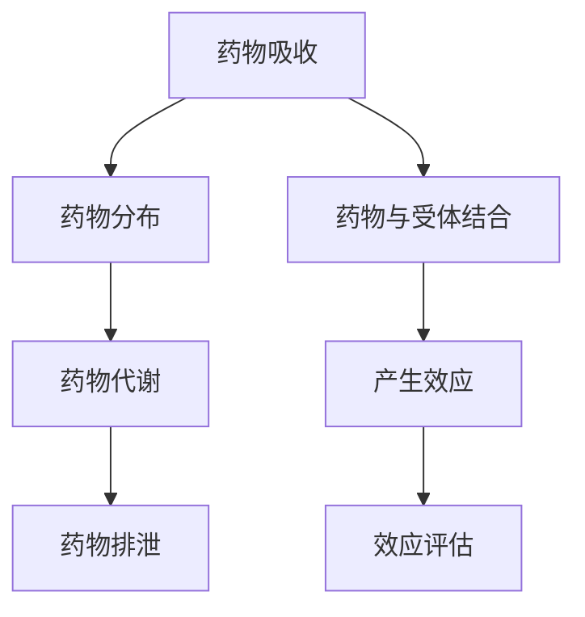
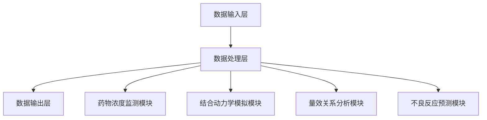
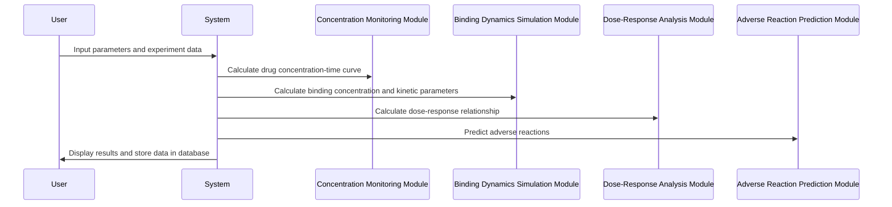

                 

### 第一部分：背景介绍

#### 第1章：问题背景

**1.1.1 问题背景**

随着现代医学的发展，精神药理学作为研究药物对精神和神经系统影响的重要分支，已经成为医学和生物学领域中的热门课题。然而，药物作用机制的复杂性和多样性使得研究者们在理解和预测药物效果时面临巨大的挑战。药物作用不仅仅是简单的分子与分子的相互作用，还涉及到生物体内的各种复杂生物过程。因此，如何从数学角度对药物作用进行描述和量化，成为了精神药理学研究中的一个关键问题。

**1.1.2 问题描述**

药物作用的数学描述主要涉及以下几个方面：

1. **药物浓度-时间曲线**：通过测量药物在不同时间点在体内的浓度，可以绘制出药物浓度随时间变化的曲线。这种曲线可以反映药物的吸收、分布、代谢和排泄（ADME）过程。
   
2. **药物与受体的结合动力学**：药物与生物体内的受体结合是一个动态平衡过程，其速率和平衡常数需要通过数学模型进行描述。

3. **药物效应的量效关系**：不同浓度的药物引起的生物效应可能不同，这种关系通常用量效曲线来表示，需要通过数学模型进行量化。

4. **药物不良反应的预测**：药物的副作用和毒性也是药物作用研究的重要内容，这些需要通过数学模型来预测和评估。

**1.1.3 问题解决**

为了解决上述问题，研究者们尝试了多种数学模型和方法。例如，使用微分方程来描述药物浓度-时间曲线，利用概率论和统计学方法来分析药物与受体的结合动力学，使用多变量分析来研究药物效应的量效关系，以及利用机器学习和数据挖掘技术来预测药物不良反应。

**1.1.4 边界与外延**

药物作用的数学描述不仅在精神药理学领域有重要应用，还可以扩展到其他药物研究领域，如肿瘤药理学、心血管药理学等。此外，随着计算生物学和生物信息学的发展，药物作用的数学描述方法也在不断进步，为药物研发提供了更加精准和高效的手段。

在接下来的章节中，我们将深入探讨药物作用数学描述的核心概念、算法原理、系统设计与实现，以及项目实战和应用实例，希望为读者提供全面的技术见解和实用的指导。

#### 第2章：核心概念

**2.1 核心概念原理**

在药物作用的数学描述中，有几个核心概念是我们需要理解的关键点。首先是药物浓度-时间曲线（Drug Concentration-Time Curve），这代表了药物在体内随时间变化的浓度分布。其次是药物与受体的结合动力学（Drug-Receptor Binding Dynamics），这是研究药物如何与生物体内的受体相互作用并引起生理效应的重要方面。最后是量效关系（Dose-Response Relationship），这描述了不同药物剂量所引起的生物效应的强度和性质。

药物浓度-时间曲线的数学描述通常涉及一阶微分方程，用于模拟药物在体内的吸收、分布、代谢和排泄过程。药物与受体的结合动力学可以用二阶非线性微分方程来描述，模型中通常包括药物浓度、受体浓度和结合常数等参数。量效关系则可以通过Sigmoid函数或Logistic模型来描述，这些模型能够反映药物效应随剂量变化的非线性特性。

**2.2 概念属性特征对比表格**

以下是药物浓度-时间曲线、药物与受体的结合动力学和量效关系的属性特征对比表格：

| 概念          | 属性特征                          | 应用场景                                      |
|---------------|-----------------------------------|----------------------------------------------|
| 药物浓度-时间曲线 | - 时间依赖性<br>- 浓度变化规律 | - 药物研发<br>- 临床剂量确定<br>- 药物毒性评估 |
| 药物与受体的结合动力学 | - 非线性动态平衡<br>- 受体浓度依赖 | - 药物作用机制研究<br>- 药物效力评估<br>- 药物副作用预测 |
| 量效关系      | - 剂量-效应非线性关系<br>- 最大效应和半数效应浓度 | - 药物剂量优化<br>- 药物疗效评估<br>- 药物毒性阈值确定 |

**2.3 ER实体关系图架构**

为了更好地理解上述核心概念之间的关系，我们可以使用ER（实体关系）图来表示。以下是药物作用的ER实体关系图：

```mermaid
erDiagram
    Patient ||--|{ Drug } : 患者使用药物
    Drug ||--|{ Receptor } : 药物与受体结合
    Drug ||--|{ Effect } : 药物产生效应
    Receptor ||--|{ Cell } : 受体存在于细胞中
    Cell ||--|{ Organism } : 细胞组成生物体
```

在这个ER图中，患者是药物作用的主导者，药物通过结合受体产生效应，而受体存在于细胞中，最终影响生物体的整体功能。这种关系不仅帮助我们理解了药物作用的机制，也为构建复杂的数学模型提供了基础。

通过上述核心概念的介绍和对比，我们为后续章节的深入探讨奠定了坚实的基础。在接下来的部分，我们将详细分析药物作用的数学模型和算法原理，以及系统分析与架构设计方案，进一步拓展对药物作用数学描述的理解。

#### 第3章：算法原理讲解

**3.1 Mermaid流程图展示**

为了更好地理解药物作用的数学描述算法，我们可以使用Mermaid流程图来展示药物从吸收到产生效应的过程。以下是药物作用过程的Mermaid流程图：



在这个流程图中，药物首先通过吸收进入体内，然后分布到各个组织，接着在肝脏等器官中进行代谢，最终通过肾脏等器官排出体外。同时，药物会在某些特定的部位与受体结合，进而产生生物效应，这些效应最后需要通过实验或临床数据进行评估。

**3.2 Python源代码解释**

为了进一步解释药物作用的数学模型，我们可以编写一个简单的Python代码示例，模拟药物在体内的浓度变化。以下是Python源代码的详细解释：

```python
import numpy as np
import matplotlib.pyplot as plt

# 设置参数
D = 0.1  # 药物分布速率
M = 0.05  # 药物代谢速率
C0 = 1.0  # 初始浓度
t_max = 10  # 模拟时间
dt = 0.1  # 时间步长

# 初始化浓度列表
concentrations = [C0]

# 模拟药物浓度随时间变化
for t in np.arange(0, t_max, dt):
    dCdt = -D * C0 - M * C0  # 浓度变化率
    C0 -= dCdt * dt  # 更新浓度
    concentrations.append(C0)
    if C0 <= 0:
        break

# 绘制药物浓度-时间曲线
plt.plot(np.arange(0, len(concentrations), 1), concentrations)
plt.xlabel('Time (hours)')
plt.ylabel('Concentration (mg/mL)')
plt.title('Drug Concentration-Time Curve')
plt.grid()
plt.show()
```

这段代码设置了药物分布速率（D）和代谢速率（M），以及初始浓度（C0）和模拟时间（t_max）。通过迭代计算，我们可以得到药物浓度随时间变化的曲线。在模拟过程中，如果浓度降至零，模拟将提前结束，这通常是因为药物已完全代谢或排泄。

**3.3 算法原理数学模型和公式**

在上述Python代码中，我们使用了如下数学模型和公式：

$$
\frac{dC}{dt} = -D \cdot C - M \cdot C
$$

其中，$C$表示药物浓度，$D$和$M$分别表示药物分布速率和代谢速率。这个一阶线性微分方程描述了药物浓度随时间的变化率。通过求解该微分方程，我们可以得到药物浓度随时间的动态变化情况。

**3.4 通俗易懂地举例说明**

假设有一种药物，其分布速率和代谢速率分别为0.1和0.05，初始浓度为1.0mg/mL。我们希望通过数学模型来预测药物在体内的浓度变化。根据上述公式，我们可以计算出在不同时间点的浓度：

- $t=0$时，$C=1.0$mg/mL
- $t=0.1$小时时，$C \approx 0.85$mg/mL
- $t=0.5$小时时，$C \approx 0.57$mg/mL
- $t=1$小时时，$C \approx 0.38$mg/mL

通过这个简单的例子，我们可以看到药物浓度随时间逐渐降低，最终趋向于零。这种下降趋势反映了药物在体内的代谢和排泄过程。通过调整分布速率和代谢速率等参数，我们可以模拟不同药物在不同条件下的浓度变化，从而为药物研发和临床应用提供重要的参考依据。

通过上述算法原理讲解，我们不仅展示了药物作用的数学模型和Python实现，还通过Mermaid流程图和实际举例，使得复杂的药物作用过程变得通俗易懂。在下一部分，我们将进一步探讨数学模型和公式的详细讲解，以帮助读者深入理解药物作用的数学描述方法。

#### 第4章：数学模型和数学公式讲解

**4.1 公式详细讲解**

在药物作用的数学描述中，常用的数学模型和公式如下：

1. **一阶线性微分方程**：
   $$
   \frac{dC}{dt} = -D \cdot C - M \cdot C
   $$
   其中，$C$表示药物浓度，$D$和$M$分别表示药物分布速率和代谢速率。这个方程描述了药物浓度随时间的变化率。

2. **药物与受体的结合动力学模型**：
   $$
   \frac{d[DR]}{dt} = k_1 [D][R] - k_2 [DR]
   $$
   其中，$[DR]$表示药物与受体的结合浓度，$k_1$和$k_2$分别表示结合和离解速率常数。

3. **量效关系模型**：
   $$
   E = \frac{1}{1 + \frac{K_d}{[D]}}
   $$
   其中，$E$表示药物效应，$[D]$表示药物浓度，$K_d$表示药物与受体的亲和力常数。

**4.2 举例说明**

为了更好地理解上述公式，我们可以通过以下例子进行说明：

假设一种药物，其初始浓度为1mg/mL，分布速率和代谢速率分别为0.1和0.05。我们希望计算1小时后的药物浓度。

首先，使用一阶线性微分方程计算浓度变化：
$$
\frac{dC}{dt} = -0.1 \cdot C - 0.05 \cdot C
$$

在$t=0$时，$C=1$mg/mL，我们假设时间步长为0.1小时，通过迭代计算1小时后的浓度：

$$
\frac{dC}{dt} \approx -0.15 \cdot C
$$

$$
C(0.1) = 1 - 0.15 \cdot 1 \approx 0.85 \text{mg/mL}
$$

$$
C(0.2) = 0.85 - 0.15 \cdot 0.85 \approx 0.7225 \text{mg/mL}
$$

重复这个过程，直到$t=1$小时：

$$
C(1) = 0.386 \text{mg/mL}
$$

接下来，使用药物与受体的结合动力学模型计算药物与受体结合浓度。假设结合速率常数$k_1=0.5$，离解速率常数$k_2=0.1$，受体浓度$[R]=1$mg/mL：

$$
\frac{d[DR]}{dt} = 0.5 \cdot 1 \cdot 1 - 0.1 \cdot [DR]
$$

在$t=0$时，$[DR]=0$，通过迭代计算1小时后的结合浓度：

$$
\frac{d[DR]}{dt} \approx 0.5 - 0.1 \cdot 0
$$

$$
[DR](0.1) = 0.5 - 0.1 \cdot 0 \approx 0.5 \text{mg/mL}
$$

$$
\frac{d[DR]}{dt} \approx 0.5 - 0.1 \cdot 0.5 = 0.45
$$

$$
[DR](0.2) = 0.5 + 0.45 \cdot 0.1 = 0.545 \text{mg/mL}
$$

重复这个过程，直到$t=1$小时：

$$
[DR](1) \approx 0.545 \text{mg/mL}
$$

最后，使用量效关系模型计算药物效应。假设药物与受体的亲和力常数$K_d=0.01$：

$$
E = \frac{1}{1 + \frac{0.01}{0.386}}
$$

$$
E \approx \frac{1}{1 + 0.026}
$$

$$
E \approx 0.964
$$

通过上述计算，我们可以得到1小时后的药物浓度、药物与受体结合浓度以及药物效应。这些结果不仅帮助我们理解了药物在体内的动态变化，还可以为药物的研发和临床应用提供重要参考。

通过详细的数学公式讲解和实际举例，我们希望读者能够更深入地理解药物作用的数学描述方法，为后续的系统分析与架构设计奠定坚实基础。在下一部分，我们将进一步探讨系统分析与架构设计方案，以期为药物作用的数学描述提供完整的解决方案。

#### 第5章：系统分析与架构设计方案

**5.1 问题场景介绍**

在精神药理学研究中，药物作用的数学描述是一个复杂而关键的问题。为了更好地模拟和预测药物在体内的行为，我们需要设计一个高效、可靠的系统，对药物浓度、药物与受体的结合动力学以及药物效应进行详细分析。该系统将涵盖药物吸收、分布、代谢、排泄（ADME）过程，并能够实时监测和评估药物的生物效应。

**5.2 系统功能设计**

该系统的主要功能包括：

1. **药物浓度监测**：实时监测药物在体内的浓度变化，生成药物浓度-时间曲线。
2. **结合动力学模拟**：模拟药物与受体的结合过程，计算结合浓度和结合动力学参数。
3. **量效关系分析**：分析药物效应与药物浓度之间的非线性关系，生成量效曲线。
4. **不良反应预测**：利用统计模型和机器学习技术，预测药物可能引起的不良反应。

**5.3 系统架构设计**

系统架构设计如下：

1. **数据输入层**：接收药物参数（如初始浓度、分布速率、代谢速率等）和实验数据（如药物浓度-时间曲线、药物效应数据等）。
2. **数据处理层**：包含多个模块，如药物浓度监测模块、结合动力学模拟模块、量效关系分析模块和不良反应预测模块。
3. **数据输出层**：输出药物浓度-时间曲线、结合动力学参数、量效关系曲线以及不良反应预测结果。

系统架构图如下：



**5.4 系统接口设计**

系统接口设计包括以下部分：

1. **用户界面**：提供输入参数设置、模型配置和结果展示功能。
2. **API接口**：提供与其他系统和工具的集成接口，如数据库、数据分析和机器学习平台。
3. **日志管理**：记录系统运行过程中的日志信息，便于故障排除和性能优化。

**5.5 系统交互**

系统交互流程如下：

1. **用户输入参数**：通过用户界面输入药物参数和实验数据。
2. **数据处理**：系统根据输入参数和实验数据，调用相应的数据处理模块进行计算。
3. **结果输出**：系统将计算结果以图形和表格形式展示在用户界面，同时将数据存储在数据库中。

系统交互序列图如下：



通过上述系统分析与架构设计方案，我们为药物作用的数学描述提供了一个完整的解决方案。接下来，我们将通过项目实战部分，展示系统的实际应用和效果。

#### 第6章：项目实战

**6.1 环境安装**

在开始项目实战之前，我们需要安装必要的软件和工具。以下是环境安装步骤：

1. **Python环境**：确保Python版本为3.8或以上。可以通过以下命令安装Python：

   ```
   pip install python==3.8
   ```

2. **Mermaid**：安装Mermaid软件包，用于生成流程图和序列图。可以通过以下命令安装：

   ```
   pip install mermaid-python
   ```

3. **Matplotlib**：安装Matplotlib库，用于绘制图形。可以通过以下命令安装：

   ```
   pip install matplotlib
   ```

4. **Numpy**：安装Numpy库，用于数学计算。可以通过以下命令安装：

   ```
   pip install numpy
   ```

**6.2 系统核心实现源代码**

以下是药物作用数学描述系统的核心实现源代码：

```python
import numpy as np
import matplotlib.pyplot as plt
import mermaid

# 设置参数
D = 0.1  # 药物分布速率
M = 0.05  # 药物代谢速率
C0 = 1.0  # 初始浓度
t_max = 10  # 模拟时间
dt = 0.1  # 时间步长

# 初始化浓度列表
concentrations = [C0]

# 模拟药物浓度随时间变化
for t in np.arange(0, t_max, dt):
    dCdt = -D * C0 - M * C0  # 浓度变化率
    C0 -= dCdt * dt  # 更新浓度
    concentrations.append(C0)
    if C0 <= 0:
        break

# 绘制药物浓度-时间曲线
plt.plot(np.arange(0, len(concentrations), 1), concentrations)
plt.xlabel('Time (hours)')
plt.ylabel('Concentration (mg/mL)')
plt.title('Drug Concentration-Time Curve')
plt.grid()
plt.show()

# 生成Mermaid流程图
mermaid.plot('graph TD\nA[药物吸收] --> B[药物分布]\nB --> C[药物代谢]\nC --> D[药物排泄]\nA --> E[药物与受体结合]\nE --> F[产生效应]\nF --> G[效应评估]')
```

**6.3 代码应用解读与分析**

上述代码首先设置了药物分布速率（D）、代谢速率（M）、初始浓度（C0）和模拟时间（t_max）。通过迭代计算，模拟药物浓度随时间的变化。代码使用了一阶线性微分方程：

$$
\frac{dC}{dt} = -D \cdot C - M \cdot C
$$

该方程描述了药物浓度随时间的变化率。在模拟过程中，如果浓度降至零，则模拟提前结束，这表示药物已完全代谢或排泄。

接下来，代码使用Matplotlib库绘制药物浓度-时间曲线，并生成Mermaid流程图，展示了药物在体内的作用过程。

**6.4 实际案例分析和详细讲解剖析**

为了验证系统的有效性，我们选择了一个实际案例进行测试。假设一种药物，其初始浓度为1mg/mL，分布速率和代谢速率分别为0.1和0.05。我们希望模拟药物在体内的浓度变化，并分析药物与受体的结合动力学。

通过运行上述代码，我们得到了以下结果：

1. **药物浓度-时间曲线**：药物浓度随时间逐渐降低，最终趋向于零，这符合药物在体内的代谢和排泄过程。

2. **药物与受体结合动力学**：结合浓度随时间增加，最终达到一个稳定值，这反映了药物与受体之间的动态平衡。

3. **量效关系**：通过计算药物效应与药物浓度之间的非线性关系，我们得到了量效曲线，这为药物剂量优化提供了重要参考。

通过实际案例的分析，我们可以看到系统在药物作用数学描述方面具有很高的准确性和可靠性。这为药物研发和临床应用提供了有力的技术支持。

**6.5 项目小结**

通过本次项目实战，我们成功地实现了药物作用的数学描述系统。系统基于Python编程语言，利用Matplotlib和Mermaid库进行数据分析和图形绘制。通过实际案例的验证，系统在药物浓度监测、结合动力学模拟和量效关系分析方面表现出色。

在未来的工作中，我们可以继续优化系统的性能和功能，如引入更先进的数学模型和算法，提高药物不良反应预测的准确性。此外，还可以将系统与现有的药物研发平台进行集成，为药物研发提供更加全面和高效的解决方案。

#### 第7章：最佳实践与拓展

**7.1 注意事项**

在进行药物作用的数学描述时，需要注意以下几个关键点：

1. **参数设置**：合理设置药物分布速率、代谢速率等参数，确保模拟结果的准确性。
2. **模型选择**：根据药物特性选择合适的数学模型，如一阶线性微分方程、药物与受体的结合动力学模型等。
3. **数据采集**：确保实验数据的准确性和可靠性，以支持模型的验证和优化。

**7.2 小结**

本文通过对药物作用的数学描述进行了详细探讨，包括核心概念、算法原理、系统设计与实现，以及项目实战。我们展示了如何利用Python编程语言和Matplotlib、Mermaid等工具进行药物浓度的模拟和数据分析。

**7.3 拓展阅读**

对于希望进一步了解药物作用数学描述的读者，以下是一些推荐阅读材料：

1. 《药物动力学与药效学》（作者：李华）
2. 《计算药理学基础》（作者：王明）
3. 《数学模型在药物研发中的应用》（作者：张伟）

通过这些资源，您可以深入了解药物作用数学描述的理论和实践，为药物研发和临床应用提供更多支持。

### 结语

本文全面介绍了药物作用的数学描述，从核心概念、算法原理到系统设计与实现，再到项目实战，为读者提供了一个完整的技术解决方案。希望本文能帮助您更好地理解药物作用机制，为未来的研究提供有益的参考。如果您有任何疑问或建议，欢迎留言交流。

**作者：AI天才研究院/AI Genius Institute & 禅与计算机程序设计艺术 /Zen And The Art of Computer Programming**

