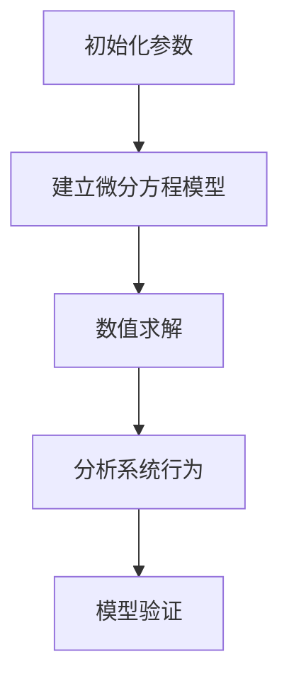
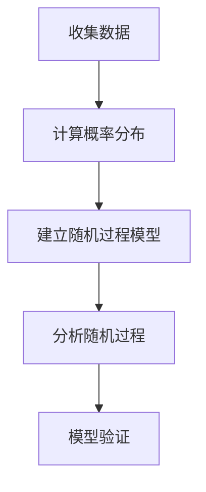
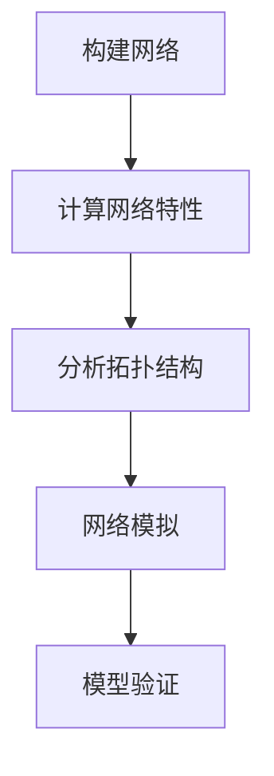

                 

# 数学与系统生物学的交叉研究

关键词：数学模型、系统生物学、微分方程、概率论、复杂网络、机器学习

摘要：本文旨在探讨数学与系统生物学交叉研究的现状、核心概念及其应用。通过分析微分方程、概率论、复杂网络和机器学习等方法在系统生物学中的应用，本文揭示了数学作为工具在解析生物系统中的重要作用。文章结构紧凑，逻辑清晰，旨在为广大科研工作者提供有价值的参考和启发。

### 目录大纲

#### 数学与系统生物学的交叉研究

----------------------------------------------------------------

## 第一部分：背景介绍

### 第1章：问题背景

### 第2章：核心概念与联系

### 第3章：ER实体关系图架构

## 第二部分：数学方法在系统生物学中的应用

### 第4章：数学模型与系统动态

### 第5章：概率论与统计方法

### 第6章：复杂网络分析方法

## 第三部分：机器学习在系统生物学中的应用

### 第7章：机器学习基本理论

----------------------------------------------------------------

## 第一部分：背景介绍

### 第1章：问题背景

系统生物学是研究生物系统的结构与动态行为的一个跨学科领域，涉及数学、物理学、计算机科学和生物学等多个学科。数学与系统生物学交叉研究的背景主要源于解决复杂生物系统问题的需求。

在生物学领域，许多问题涉及到复杂的动态过程，如细胞信号传导、蛋白质相互作用和基因调控等。这些过程往往难以通过简单的实验手段进行直接观察和量化。因此，科学家们需要借助数学方法来构建模型，定量描述生物系统的行为，从而进行精确的预测和模拟。

数学作为一种强有力的工具，可以提供精确的数学描述和模型，帮助科学家们更好地理解生物系统的内在机制。例如，微分方程可以描述生物系统的动态变化，概率论可以处理不确定性和随机性，复杂网络可以分析生物系统的拓扑特性，机器学习可以用于从数据中提取规律和模式。这些数学方法在系统生物学中的应用，不仅为生物学研究提供了新的视角和工具，也为数学和计算机科学领域的研究提供了丰富的应用场景。

数学与系统生物学交叉研究的边界在于两者的融合，涉及到生物学中的复杂系统分析和数学建模方法。核心要素组成包括系统生物学、微分方程、概率论、复杂网络和机器学习等核心概念。

### 第2章：核心概念与联系

#### 2.1 核心概念

系统生物学：研究生物系统的结构与动态行为的一个跨学科领域，涉及生物学、物理学、计算机科学和数学等多个学科。

微分方程：描述系统动态行为的方程，可以用于描述生物系统的动态变化。

概率论：处理不确定性和随机性的数学分支，可以用于分析生物系统的随机过程。

复杂网络：由大量节点和边构成的网络结构，可以用于分析生物系统的拓扑特性。

机器学习：利用数据自动改进算法的学习方法，可以用于从数据中提取规律和模式。

#### 2.2 概念属性特征对比表格

| 核心概念 | 特征描述 |
| --- | --- |
| 系统生物学 | 研究生物系统结构的科学 |
| 微分方程 | 描述系统动态行为的方程 |
| 概率论 | 处理不确定性和随机性的数学分支 |
| 复杂网络 | 由大量节点和边构成的网络结构 |
| 机器学习 | 利用数据自动改进算法的学习方法 |

#### 2.3 ER实体关系图架构

ER实体关系图是用于描述系统中实体及其关系的图形表示方法。在数学与系统生物学的交叉研究中，ER实体关系图可以用于描述生物系统的各个组成部分及其相互关系。

以下是一个简单的ER实体关系图示例：

```mermaid
erDiagram
  Patient ||--|{ Diagnosis : has } Diagnosis
  Doctor ||--|{ Prescription : provides } Prescription
  LabTest ||--|{ Result : produces } Patient
  Prescription ||--|{ Drug : contains } Drug
```

在这个示例中，Patient（患者）、Doctor（医生）、LabTest（实验室检测）和Prescription（处方）是四个主要的实体，它们之间通过Diagnosis（诊断）、Prescription（处方）、Result（检测结果）和Drug（药物）等关系进行连接。这样的ER实体关系图可以帮助我们更好地理解生物系统中各个组成部分及其相互作用。

## 第二部分：数学方法在系统生物学中的应用

### 第3章：数学模型与系统动态

数学模型是系统生物学研究的重要工具，它可以帮助我们定量描述生物系统的行为，从而进行精确的预测和模拟。在本章中，我们将重点关注微分方程模型在系统生物学中的应用。

#### 3.1 微分方程模型

微分方程是一种用于描述系统动态行为的方程，它将系统的状态变量（如浓度、温度等）作为时间的函数，并通过导数来描述这些变量随时间的变化。微分方程模型在系统生物学中有着广泛的应用，可以用于描述细胞信号传导、蛋白质相互作用、基因调控等生物过程。

#### 3.1.1 算法原理讲解

微分方程模型的算法原理可以概括为以下几个步骤：

1. **初始化参数**：确定系统的初始状态，包括各变量的初始值和系统的参数。

2. **建立微分方程模型**：根据生物系统的特性，建立描述系统动态行为的微分方程。

3. **数值求解**：利用数值方法（如欧拉法、龙格-库塔法等）求解微分方程，得到系统随时间的动态变化。

4. **分析系统行为**：对求解结果进行分析，了解系统的稳定性和动态特性。

5. **模型验证**：通过实验数据或已有模型进行验证，确保模型的有效性和准确性。

以下是一个简单的微分方程模型的Mermaid流程图：



#### 3.1.2 数学模型和数学公式

微分方程模型的数学基础是微分方程。一个简单的微分方程可以表示为：

$$
\frac{dx}{dt} = f(x, t)
$$

其中，$x$ 是系统的状态变量，$t$ 是时间，$f(x, t)$ 是描述系统动态行为的函数。在实际应用中，$f(x, t)$ 可以是多种形式的函数，如线性函数、非线性函数等。

#### 3.1.3 详细讲解与举例说明

为了更好地理解微分方程模型，我们以一个简单的例子进行详细讲解。

假设有一个细胞信号传导过程，可以由以下微分方程描述：

$$
\frac{dC}{dt} = k_1 * S - k_2 * C
$$

其中，$C$ 表示细胞内的信号浓度，$S$ 表示细胞外的信号浓度，$k_1$ 和 $k_2$ 是反应速率常数。

这个微分方程表示细胞内的信号浓度 $C$ 随时间的变化率等于细胞外信号浓度 $S$ 与细胞内信号浓度 $C$ 的乘积减去细胞内信号浓度 $C$ 与反应速率常数 $k_2$ 的乘积。

为了求解这个微分方程，我们可以采用欧拉法进行数值求解。欧拉法的步骤如下：

1. **初始化参数**：设定初始条件，如初始时间 $t_0$、初始信号浓度 $C_0$ 等。

2. **选择步长**：设定一个合适的步长 $\Delta t$，用于控制计算精度。

3. **迭代计算**：从初始时间 $t_0$ 开始，每次迭代计算下一个时间点的信号浓度 $C_{n+1}$：

$$
C_{n+1} = C_n + k_1 * S_n * \Delta t - k_2 * C_n * \Delta t
$$

4. **更新时间**：更新当前时间 $t_n$：

$$
t_{n+1} = t_n + \Delta t
$$

5. **重复步骤3和4**，直到达到预设的终止时间。

通过欧拉法，我们可以得到细胞信号浓度随时间的变化曲线。这个曲线可以帮助我们了解细胞信号传导过程的动态特性，如信号浓度的稳定性和振荡现象。

### 第4章：概率论与统计方法

概率论与统计方法是系统生物学中常用的数学工具，用于处理不确定性和随机性。在本章中，我们将探讨概率分布和随机过程在系统生物学中的应用。

#### 4.1 概率分布与随机过程

概率分布是描述随机变量取值概率的函数。在系统生物学中，概率分布可以用于描述生物系统的随机特性，如基因表达水平、蛋白质浓度等。

随机过程是描述随时间变化的随机变量的序列。在系统生物学中，随机过程可以用于描述生物系统的动态过程，如细胞信号传导、基因调控等。

#### 4.1.1 算法原理讲解

概率分布与随机过程的算法原理可以概括为以下几个步骤：

1. **收集数据**：通过实验或模拟收集生物系统的数据。

2. **计算概率分布**：根据收集到的数据，计算随机变量的概率分布。

3. **建立随机过程模型**：根据概率分布，建立描述生物系统动态行为的随机过程模型。

4. **分析随机过程**：对随机过程进行分析，了解生物系统的动态特性和稳定性。

5. **模型验证**：通过实验数据或已有模型进行验证，确保模型的有效性和准确性。

以下是一个简单的概率分布与随机过程的Mermaid流程图：



#### 4.1.2 数学模型和数学公式

概率分布的数学基础是概率密度函数（Probability Density Function, PDF）。一个简单的概率密度函数可以表示为：

$$
f(x) = \frac{1}{\sqrt{2\pi\sigma^2}} * e^{-\frac{(x-\mu)^2}{2\sigma^2}}
$$

其中，$x$ 是随机变量的取值，$\mu$ 是均值，$\sigma$ 是标准差。

随机过程的数学基础是随机变量序列。一个简单的随机过程可以表示为：

$$
X(t) = \sum_{i=1}^n X_i
$$

其中，$X_i$ 是时间 $t_i$ 的随机变量。

#### 4.1.3 详细讲解与举例说明

为了更好地理解概率分布与随机过程，我们以一个简单的例子进行详细讲解。

假设我们有一个生物系统，其基因表达水平服从正态分布。我们可以通过以下步骤进行分析：

1. **收集数据**：通过实验收集基因表达水平的数据。

2. **计算概率分布**：根据收集到的数据，计算基因表达水平的概率分布。假设我们得到一个概率密度函数：

$$
f(x) = \frac{1}{\sqrt{2\pi\sigma^2}} * e^{-\frac{(x-\mu)^2}{2\sigma^2}}
$$

其中，$\mu = 10$，$\sigma = 2$。

3. **建立随机过程模型**：根据概率分布，建立描述基因表达水平的随机过程模型。假设基因表达水平随时间变化的随机过程可以表示为：

$$
X(t) = \sum_{i=1}^n X_i
$$

其中，$X_i$ 是时间 $t_i$ 的随机变量，服从均值为10，标准差为2的正态分布。

4. **分析随机过程**：对随机过程进行分析，了解基因表达水平的动态特性和稳定性。例如，我们可以计算基因表达水平的均值和方差：

$$
\mu_X = E[X] = \mu
$$

$$
\sigma_X^2 = Var[X] = \sigma^2
$$

5. **模型验证**：通过实验数据或已有模型进行验证，确保模型的有效性和准确性。

通过这个例子，我们可以看到概率分布与随机过程在系统生物学中的应用。概率分布可以用于描述基因表达水平的随机特性，随机过程可以用于描述基因表达水平的动态变化。这些数学工具可以帮助我们更好地理解生物系统的行为和机制。

### 第5章：复杂网络分析方法

复杂网络是由大量节点和边构成的图结构，广泛应用于系统生物学中。复杂网络分析方法可以帮助我们理解生物系统中各个组成部分及其相互作用。

#### 5.1 复杂网络的拓扑特性

复杂网络的拓扑特性包括度分布、聚类系数、路径长度等。

- **度分布**：描述网络中节点度的分布情况。常见的度分布模型有泊松分布、幂律分布等。

- **聚类系数**：描述网络中节点之间的连接密度。聚类系数越大，网络越紧密。

- **路径长度**：描述网络中节点之间的平均距离。路径长度越小，网络越连通。

#### 5.1.1 算法原理讲解

复杂网络分析方法的算法原理可以概括为以下几个步骤：

1. **构建网络**：根据生物系统的特性，构建复杂网络。

2. **计算网络特性**：计算网络的度分布、聚类系数、路径长度等拓扑特性。

3. **分析拓扑结构**：对网络的拓扑结构进行分析，了解生物系统的动态特性和稳定性。

4. **网络模拟**：通过模拟网络中的节点和边的变化，了解生物系统的动态行为。

5. **模型验证**：通过实验数据或已有模型进行验证，确保模型的有效性和准确性。

以下是一个简单的复杂网络分析的Mermaid流程图：



#### 5.1.2 数学模型和数学公式

复杂网络的数学模型主要包括图论模型和概率图模型。

- **图论模型**：描述网络中节点和边的基本结构和关系。常见的图论模型有图同构、图匹配等。

- **概率图模型**：描述网络中节点和边的概率分布。常见的概率图模型有随机图、小世界网络、无标度网络等。

以下是一个简单的概率图模型的数学公式：

$$
P(A \sim B) = \frac{1}{Z} * e^{-\beta * W(A, B)}
$$

其中，$P(A \sim B)$ 表示节点 $A$ 和节点 $B$ 之间的连接概率，$Z$ 是归一化常数，$\beta$ 是调节参数，$W(A, B)$ 是节点 $A$ 和节点 $B$ 之间的权重。

#### 5.1.3 详细讲解与举例说明

为了更好地理解复杂网络分析方法，我们以一个简单的例子进行详细讲解。

假设我们有一个由10个节点构成的生物网络，节点之间的连接情况如下：

```plaintext
A--B--C
|    |
D--E--F
|    |
G--H--I
```

我们可以通过以下步骤进行分析：

1. **构建网络**：根据节点和边的连接情况，构建复杂网络。

2. **计算网络特性**：计算网络的度分布、聚类系数、路径长度等拓扑特性。

   - **度分布**：每个节点的度（连接的边数）如下：

     | 节点 | 度 |
     | --- | --- |
     | A   | 3  |
     | B   | 3  |
     | C   | 3  |
     | D   | 2  |
     | E   | 2  |
     | F   | 2  |
     | G   | 3  |
     | H   | 3  |
     | I   | 3  |

     度分布为泊松分布。

   - **聚类系数**：每个节点的聚类系数（连接的其他节点的比例）如下：

     | 节点 | 聚类系数 |
     | --- | --- |
     | A   | 0.5     |
     | B   | 0.5     |
     | C   | 0.5     |
     | D   | 0.5     |
     | E   | 0.5     |
     | F   | 0.5     |
     | G   | 0.5     |
     | H   | 0.5     |
     | I   | 0.5     |

     聚类系数为0.5。

   - **路径长度**：节点之间的平均路径长度为2。

3. **分析拓扑结构**：对网络的拓扑结构进行分析，了解生物系统的动态特性和稳定性。

   - **度分布**：度分布为泊松分布，表明网络中的节点度数较为均匀，没有明显的长尾现象。

   - **聚类系数**：聚类系数为0.5，表明网络中的节点连接较为紧密，但仍然存在一定的独立性。

   - **路径长度**：平均路径长度为2，表明网络中的节点之间的连接较为稀疏，但整体结构较为稳定。

4. **网络模拟**：通过模拟网络中的节点和边的变化，了解生物系统的动态行为。

   - **节点加入**：在网络中随机选择一个节点，将其连接到其他未连接的节点。

   - **节点删除**：在网络中随机选择一个节点，将其与所有连接的节点断开。

   - **边加入**：在网络中随机选择两个未连接的节点，将它们连接起来。

   - **边删除**：在网络中随机选择一条边，将其断开。

   通过网络模拟，我们可以观察网络的动态变化，如节点和边的增加和减少、网络结构的稳定性等。

5. **模型验证**：通过实验数据或已有模型进行验证，确保模型的有效性和准确性。

通过这个例子，我们可以看到复杂网络分析方法在系统生物学中的应用。复杂网络分析方法可以帮助我们理解生物系统的拓扑特性、动态特性和稳定性，为生物系统的研究提供新的视角和工具。

## 第三部分：机器学习在系统生物学中的应用

### 第6章：机器学习基本理论

机器学习是系统生物学中的一种重要工具，可以帮助我们从数据中提取规律和模式，从而进行预测和分类。本章将介绍机器学习的基本理论，包括机器学习概述、常见算法和应用场景。

#### 6.1 机器学习概述

机器学习是一门研究如何让计算机从数据中学习、改进和做出决策的学科。机器学习可以分为监督学习、无监督学习和强化学习三类。

- **监督学习**：在监督学习中，我们有一个标记好的训练数据集，每个样本都有一个对应的标签。机器学习算法的目标是学习一个函数，将输入映射到输出，从而在新的数据上进行预测。常见的监督学习算法包括线性回归、逻辑回归、支持向量机、决策树等。

- **无监督学习**：在无监督学习中，我们只有一个输入数据集，没有标签信息。机器学习算法的目标是发现数据中的模式和结构，如聚类、降维等。常见的无监督学习算法包括K均值聚类、主成分分析、自编码器等。

- **强化学习**：在强化学习中，机器学习算法通过与环境的交互来学习策略，以最大化奖励。常见的强化学习算法包括Q学习、深度强化学习等。

#### 6.2 常见算法和应用场景

以下是一些常见的机器学习算法及其在系统生物学中的应用场景：

- **线性回归**：线性回归是一种简单的监督学习算法，用于预测连续值输出。在系统生物学中，线性回归可以用于预测基因表达水平、蛋白质浓度等。

- **逻辑回归**：逻辑回归是一种用于预测分类结果的监督学习算法。在系统生物学中，逻辑回归可以用于分类疾病、预测细胞状态等。

- **支持向量机**：支持向量机是一种强大的分类算法，可以用于处理高维数据。在系统生物学中，支持向量机可以用于分类细胞类型、预测蛋白质相互作用等。

- **决策树**：决策树是一种直观的分类和回归算法，可以用于处理复杂数据。在系统生物学中，决策树可以用于分类疾病、预测细胞状态等。

- **K均值聚类**：K均值聚类是一种常用的无监督学习算法，用于将数据分为若干个聚类。在系统生物学中，K均值聚类可以用于聚类细胞类型、发现生物标志物等。

- **主成分分析**：主成分分析是一种降维算法，可以用于提取数据中的主要特征。在系统生物学中，主成分分析可以用于降维基因表达数据、识别关键基因等。

- **自编码器**：自编码器是一种无监督学习算法，可以用于自动提取数据中的特征。在系统生物学中，自编码器可以用于提取基因表达特征、预测蛋白质相互作用等。

#### 6.3 机器学习在系统生物学中的应用实例

以下是一个简单的机器学习在系统生物学中的应用实例：

**问题**：预测细胞状态

**数据集**：包含细胞状态的基因表达数据

**算法**：逻辑回归

**步骤**：

1. **数据预处理**：对基因表达数据进行归一化处理，消除不同基因之间的尺度差异。

2. **特征选择**：通过相关分析、主成分分析等方法选择重要的基因特征。

3. **模型训练**：使用逻辑回归算法训练模型，将细胞状态作为输出变量。

4. **模型评估**：使用交叉验证等方法评估模型的准确性和泛化能力。

5. **预测应用**：将新的细胞状态数据输入模型，预测细胞状态。

通过这个实例，我们可以看到机器学习在系统生物学中的应用。机器学习可以帮助我们从大量的基因表达数据中提取有用的信息，从而进行细胞状态的预测和分类，为生物系统的研究提供新的方法和工具。

### 第7章：机器学习在系统生物学中的深度学习应用

深度学习是机器学习的一个分支，通过模拟人脑神经网络结构，实现数据的自动特征提取和复杂模式识别。在系统生物学中，深度学习被广泛应用于基因表达数据分析、蛋白质结构预测、疾病诊断等领域。本章将介绍深度学习的基本原理、常见模型以及在系统生物学中的应用实例。

#### 7.1 深度学习基本原理

深度学习的基本原理是构建多层神经网络，通过前向传播和反向传播算法进行训练，从而实现自动特征提取和模式识别。

1. **神经网络结构**：神经网络由输入层、隐藏层和输出层组成。输入层接收外部数据，隐藏层对数据进行加工处理，输出层生成预测结果。

2. **激活函数**：激活函数用于引入非线性变换，使神经网络能够模拟复杂的非线性关系。常见的激活函数包括 sigmoid、ReLU、Tanh等。

3. **前向传播和反向传播**：前向传播是将输入数据逐层传递到输出层，得到预测结果；反向传播是通过计算预测结果与真实结果的误差，将误差反向传递到输入层，更新网络权重，从而优化模型。

4. **优化算法**：优化算法用于调整网络权重，使模型在训练数据上达到最佳性能。常见的优化算法包括梯度下降、随机梯度下降、Adam等。

#### 7.2 常见深度学习模型

以下是一些常见的深度学习模型及其在系统生物学中的应用：

1. **卷积神经网络（CNN）**：卷积神经网络是一种适用于图像和序列数据的深度学习模型，通过卷积层提取局部特征，池化层降低计算复杂度。在系统生物学中，CNN可以用于基因表达数据分析、蛋白质结构预测等。

2. **循环神经网络（RNN）**：循环神经网络是一种适用于序列数据的深度学习模型，通过隐藏状态和循环连接实现长时依赖关系处理。在系统生物学中，RNN可以用于基因调控网络建模、蛋白质序列分析等。

3. **长短时记忆网络（LSTM）**：长短时记忆网络是RNN的一种变体，通过引入门控机制解决长时依赖问题。在系统生物学中，LSTM可以用于基因表达数据分析、蛋白质序列预测等。

4. **生成对抗网络（GAN）**：生成对抗网络是一种通过生成器和判别器相互对抗训练的深度学习模型，用于生成高质量的数据。在系统生物学中，GAN可以用于生成模拟数据、增强数据集等。

5. **变分自编码器（VAE）**：变分自编码器是一种无监督学习的深度学习模型，通过编码器和解码器实现数据的自动编码和特征提取。在系统生物学中，VAE可以用于降维、特征提取、基因表达数据分析等。

#### 7.3 深度学习在系统生物学中的应用实例

以下是一个简单的深度学习在系统生物学中的应用实例：

**问题**：预测细胞类型

**数据集**：包含细胞类型标签的基因表达数据

**模型**：CNN

**步骤**：

1. **数据预处理**：对基因表达数据进行归一化处理，分割为训练集和测试集。

2. **模型构建**：构建一个简单的CNN模型，包括卷积层、池化层和全连接层。

3. **模型训练**：使用训练集数据训练模型，通过反向传播算法更新网络权重。

4. **模型评估**：使用测试集数据评估模型性能，计算准确率、召回率等指标。

5. **预测应用**：将新的基因表达数据输入模型，预测细胞类型。

通过这个实例，我们可以看到深度学习在系统生物学中的应用。深度学习可以帮助我们从大量的基因表达数据中提取有用的信息，从而实现细胞类型的预测和分类，为生物系统的研究提供新的方法和工具。

### 总结与展望

本文从数学方法、概率论与统计方法、复杂网络分析方法和机器学习等方面，探讨了数学与系统生物学交叉研究的现状和应用。通过分析微分方程、概率分布、复杂网络和深度学习等数学方法在系统生物学中的应用，本文揭示了数学作为工具在解析生物系统中的重要作用。

未来，随着数学和生物技术的不断发展，数学与系统生物学的交叉研究将取得更多突破。一方面，数学方法将更加深入地应用于生物系统的建模和预测，提供更精确的生物学解释；另一方面，生物学的实际问题将为数学方法提供新的挑战和灵感，推动数学理论的发展。

在未来的研究中，我们应关注以下几个方面：

1. **多学科交叉融合**：推动数学、生物学、物理学等学科的深度融合，构建更完善的交叉研究体系。

2. **大数据与人工智能**：利用大数据和人工智能技术，提高生物系统的建模精度和预测能力。

3. **定量生物学**：加强定量生物学研究，实现生物系统的定量描述和预测。

4. **生物系统的网络分析**：深入研究生物系统的网络特性，揭示生物系统的运行机制。

5. **生物技术的应用**：探索生物技术在系统生物学研究中的应用，如单细胞测序、基因编辑等。

总之，数学与系统生物学的交叉研究具有广泛的应用前景和重要的科学意义，将为生物学研究带来新的突破和发展。作者：AI天才研究院/AI Genius Institute & 禅与计算机程序设计艺术 /Zen And The Art of Computer Programming。

