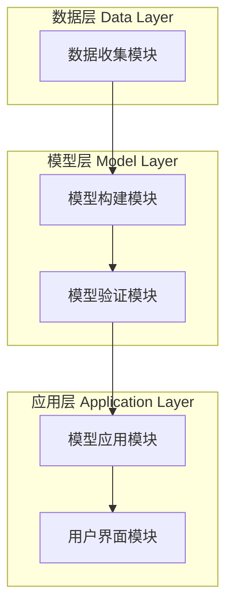

                 

# 数学与系统生物学：生物系统的数学建模

## 关键词
- 数学建模
- 系统生物学
- 生物系统
- 动态系统理论
- 概率模型
- 微分方程
- 部分差分方程
- 神经系统建模
- 生化网络建模

## 摘要
本文旨在探讨数学与系统生物学之间的密切联系，通过数学建模的方法，对生物系统进行深入的分析和模拟。文章首先介绍了系统生物学的基本概念，接着阐述了数学建模在生物学研究中的重要性和必要性。随后，文章详细介绍了数学建模的核心原理，包括微分方程、概率模型和动态系统理论等。在此基础上，本文通过实例展示了数学建模在神经系统和代谢网络中的应用，并进一步探讨了高级技术如部分差分方程和随机模型的应用。文章最后还讨论了系统分析与架构设计的方法，以及如何将数学建模应用于实际项目中。本文为从事生物学研究和相关领域的技术人员提供了一套实用的理论和方法。

## I. 背景与引言

### 1.1 数学在系统生物学中的必要性

随着生命科学技术的快速发展，生物学研究已经进入了系统层次。传统的分子生物学研究侧重于单个基因或蛋白质的功能，而系统生物学则强调从整体上理解生物系统的复杂性和动态行为。这种转变要求生物学研究必须借助数学和计算科学的方法，以应对生物系统的高度复杂性和多样性。

数学建模在系统生物学中扮演着至关重要的角色。首先，数学模型能够将复杂的生物系统简化为可计算的形式，使得我们可以在计算机上对系统进行模拟和预测。这种模拟不仅可以帮助我们理解生物系统的行为，还可以预测系统在外部扰动下的响应，从而为生物学研究提供新的视角。

此外，数学建模还能帮助我们识别生物系统中的关键组件和调控机制。通过建立数学模型，我们可以量化生物系统中的各种参数和变量，进而揭示系统内部的相互作用和反馈机制。这种量化分析有助于我们深入理解生物系统的运作原理，并为生物学研究提供理论依据。

### 1.2 系统生物学的概述

系统生物学是一门跨学科的领域，它结合了生物学、数学、物理学和计算机科学的知识，旨在理解生物系统的整体行为。系统生物学的核心概念包括以下几个方面：

1. **系统视角**：系统生物学强调从整体上研究生物系统，而不是孤立地研究单个分子或基因。这种系统视角有助于我们理解生物系统的复杂性和动态行为。

2. **网络分析**：生物系统通常由多种分子和细胞组成，它们之间存在着复杂的相互作用。网络分析是系统生物学的重要工具，通过分析这些相互作用，我们可以揭示生物系统中的关键组件和调控机制。

3. **动态模拟**：系统生物学强调对生物系统进行动态模拟，以理解系统的行为和响应。通过数学模型和计算模拟，我们可以预测生物系统在不同条件下的行为，从而为生物学研究提供新的见解。

4. **数据整合**：系统生物学需要整合来自不同来源的数据，如基因表达数据、蛋白质相互作用数据等。这些数据的整合有助于我们建立更准确的数学模型，从而更好地理解生物系统的行为。

### 1.3 数学建模在系统生物学中的作用

数学建模在系统生物学中的作用主要体现在以下几个方面：

1. **理论支持**：数学模型为系统生物学提供了理论基础，使得我们能够从定量的角度理解生物系统的行为。这些理论模型有助于我们揭示生物系统中的基本规律和调控机制。

2. **数据分析**：数学模型能够帮助我们分析和解释生物学数据。通过数学模型，我们可以对实验数据进行分析，提取出有意义的信息，从而更好地理解生物系统的行为。

3. **预测和模拟**：数学模型可以用来预测生物系统的行为和响应。通过模拟，我们可以预测生物系统在不同条件下的状态，从而为生物学研究提供新的实验设计和理论指导。

4. **新发现**：数学建模往往能够揭示生物系统中的新现象和新机制。通过数学模型，我们可以发现传统实验方法无法发现的信息，从而推动生物学研究的进步。

总之，数学建模是系统生物学研究中的重要工具。通过数学建模，我们可以更好地理解生物系统的行为，揭示生物系统的基本规律和调控机制，从而为生物学研究提供新的理论和方法。

## II. 基本概念和原理

### 2.1 数学在生物学中的核心概念

在系统生物学中，数学扮演着至关重要的角色。为了建立准确的数学模型，我们需要首先了解一些核心数学概念。以下是一些在数学建模中经常使用的核心概念：

#### 微分方程

微分方程是描述系统动态行为的基本工具。在生物学中，微分方程常用于描述种群动态、神经信号传递和细胞周期等过程。微分方程的常见形式如下：

\[ \frac{dx}{dt} = f(x, t) \]

其中，\(x\) 是系统状态，\(t\) 是时间，\(f(x, t)\) 是描述系统动态的函数。通过求解微分方程，我们可以得到系统状态随时间的变化规律。

#### 概率模型

概率模型是描述系统随机行为的重要工具。在生物学中，概率模型常用于描述基因突变、细胞分裂和蛋白质合成等过程。常见的概率模型包括马尔可夫链、泊松过程和伽马分布等。

例如，马尔可夫链可以用来描述基因突变的随机过程。马尔可夫链的基本形式如下：

\[ P(X_{n+1} = j | X_n = i) = p_{ij} \]

其中，\(X_n\) 表示第\(n\)次观察到的状态，\(i\) 和 \(j\) 是可能的两种状态，\(p_{ij}\) 是状态转移概率。

#### 动态系统理论

动态系统理论是研究系统随时间变化的科学。在生物学中，动态系统理论常用于分析细胞周期、神经信号传递和生态系统等过程。动态系统理论的核心是状态空间和状态转移矩阵。

状态空间是一个多维空间，每个维度代表系统的一个状态。状态转移矩阵描述了系统在不同状态之间的转移概率。通过状态空间和状态转移矩阵，我们可以分析系统的稳定性、周期性和混沌行为。

#### 比较分析核心概念

以下是几种核心数学概念的比较分析：

| 概念       | 描述                                                         | 优点                                                     | 缺点                                                     |
|------------|--------------------------------------------------------------|------------------------------------------------------------|------------------------------------------------------------|
| 微分方程   | 描述系统动态行为的方程                                       | 可以精确描述连续系统的动态变化                             | 求解复杂，需要大量计算资源                               |
| 概率模型   | 描述系统随机行为的模型                                       | 可以处理不确定性和随机性，适合描述生物系统的复杂性         | 需要大量数据和参数调整                                   |
| 动态系统理论 | 研究系统随时间变化的科学                                     | 可以提供系统的全局视图，帮助理解系统的稳定性和动态行为     | 需要较强的数学背景和理论知识                             |
| 部分差分方程 | 描述系统在离散时间和空间上变化的方程                         | 适合处理大规模系统，计算效率高                             | 无法描述连续系统的微细变化                               |

通过比较分析，我们可以根据具体的研究问题选择合适的数学模型。例如，在描述细胞周期时，微分方程可能更为合适，而在描述基因突变时，概率模型可能更为有效。

### 2.2 数学建模的基础框架

数学建模的基础框架通常包括以下几个步骤：

1. **问题定义**：明确研究的问题和目标。这包括问题的背景、所需解决的问题以及预期的研究结果。

2. **数据收集**：收集与问题相关的数据。这些数据可以是实验数据、观测数据或模拟数据。数据的准确性和完整性对建模至关重要。

3. **模型假设**：基于问题定义和数据，提出合理的假设。这些假设可以帮助简化复杂系统，使其变得可计算。

4. **模型建立**：根据问题定义、数据和假设，建立数学模型。这个模型可以是一个或多个方程组，描述系统的动态行为。

5. **模型验证**：通过实验或模拟数据验证模型的准确性。如果模型不准确，需要调整模型或重新定义问题。

6. **模型应用**：将验证后的模型应用于实际问题，进行预测或模拟。通过模型，我们可以了解系统在不同条件下的行为，从而为决策提供依据。

### 2.3 数学建模的步骤详解

下面详细说明数学建模的步骤：

#### 1. 问题定义

问题定义是数学建模的第一步，也是至关重要的一步。在这个阶段，我们需要明确研究的问题和目标，包括以下内容：

- **背景**：介绍研究的问题背景，说明为什么这个问题重要以及它在生物学中的意义。
- **问题描述**：详细描述研究的问题，明确需要解决的问题是什么。
- **目标**：定义研究的具体目标，说明我们希望通过建模实现什么。

例如，如果我们研究的是细胞周期的数学建模，背景可以是细胞周期是细胞分裂过程中的关键阶段，了解细胞周期的动态行为对癌症治疗具有重要意义。问题描述可以是描述细胞周期不同阶段的持续时间以及这些阶段之间的转换关系。目标可以是建立细胞周期数学模型，并预测细胞在不同条件下的周期长度。

#### 2. 数据收集

在问题定义之后，我们需要收集与问题相关的数据。这些数据可以是实验数据、观测数据或模拟数据。数据收集的过程通常包括以下步骤：

- **确定数据类型**：根据问题定义，确定需要收集的数据类型。例如，如果我们研究细胞周期，我们需要收集细胞在不同时间点的状态数据。
- **数据来源**：确定数据来源，可以是实验室数据、公共数据库或模拟数据。
- **数据收集方法**：根据数据类型和来源，选择合适的数据收集方法。例如，实验室数据可以通过细胞标记技术和显微镜观测获得，模拟数据可以通过生物信息学工具生成。

#### 3. 模型假设

在收集到数据之后，我们需要提出合理的假设，以简化复杂系统，使其变得可计算。模型假设通常包括以下几个方面：

- **系统简化**：简化系统中的复杂成分，仅保留对问题最重要的因素。例如，在细胞周期建模中，我们可以假设细胞只经历两个阶段：G1 和 S。
- **参数化**：为系统中的关键参数赋予合理的值。这些参数可以通过实验数据或现有文献确定。
- **边界条件**：定义系统的初始状态和边界条件。例如，在细胞周期建模中，我们可以设定初始时刻细胞处于 G1 阶段。

#### 4. 模型建立

根据问题定义、数据和假设，我们开始建立数学模型。这个模型可以是一个或多个方程组，描述系统的动态行为。模型建立的过程通常包括以下步骤：

- **方程选择**：选择合适的数学方程，例如微分方程、差分方程或概率模型。
- **方程形式**：根据问题定义和假设，确定方程的具体形式。例如，我们可以使用以下微分方程描述细胞周期的动态：

  \[ \frac{dx}{dt} = r \]

  其中，\(x\) 表示细胞在 G1 阶段的比例，\(r\) 是 G1 阶段的转换率。

- **方程求解**：求解方程，得到系统状态随时间的变化规律。例如，通过分离变量法，我们可以求解上述方程得到：

  \[ x(t) = x(0) e^{rt} \]

  其中，\(x(0)\) 是初始时刻细胞在 G1 阶段的比例。

#### 5. 模型验证

模型验证是确保模型准确性的关键步骤。我们通常使用以下方法进行模型验证：

- **数据拟合**：将模型预测结果与实验数据进行比较，评估模型的拟合程度。例如，我们可以将细胞周期模型预测的细胞比例与实验数据绘制成曲线，观察曲线的吻合程度。
- **稳定性分析**：分析模型的稳定性，确保模型在长时间内保持稳定。例如，我们可以通过分析微分方程的稳定性条件，确定细胞周期模型的稳定性范围。

#### 6. 模型应用

在模型验证之后，我们开始将模型应用于实际问题。这个步骤通常包括以下内容：

- **预测**：使用模型预测系统在不同条件下的行为。例如，我们可以使用细胞周期模型预测细胞在不同药物浓度下的周期长度。
- **模拟**：通过模拟，我们可以在虚拟环境中测试模型的可行性。例如，我们可以使用细胞周期模型模拟细胞在不同条件下的生长过程。

通过以上步骤，我们可以建立准确的数学模型，并应用于生物学研究中的实际问题。这不仅有助于我们深入理解生物系统的行为，还可以为生物学研究提供新的理论和方法。

## III. 生物系统的数学建模

### 3.1 生物系统建模的引入

生物系统建模是系统生物学研究中的重要环节。通过数学建模，我们可以对生物系统进行定量分析，揭示其内部机制和动态行为。生物系统建模的过程包括以下几个关键步骤：

1. **确定建模目标**：明确我们希望通过建模解决的具体问题。例如，研究细胞周期、神经信号传递或代谢网络等。
2. **收集数据**：获取与建模目标相关的实验数据或模拟数据。这些数据可以是细胞周期时间、神经元活动或代谢物浓度等。
3. **建立假设**：根据问题和数据，提出合理的假设，以简化生物系统，使其变得可计算。例如，假设细胞周期由两个阶段组成，或神经元活动遵循某种概率分布。
4. **构建模型**：根据假设和数据，建立数学模型。模型可以包括微分方程、差分方程或概率模型等。
5. **验证模型**：使用实验数据或模拟数据验证模型的准确性，确保模型能够准确描述生物系统的行为。
6. **应用模型**：将验证后的模型应用于实际问题，进行预测或模拟。

### 3.2 案例研究：种群动态建模

种群动态建模是生物系统建模中的一个经典案例。通过数学模型，我们可以研究种群数量的变化规律，揭示种群动态的内在机制。以下是一个简单的种群动态建模案例：

#### 案例背景

假设我们研究一个捕食者-被捕食者系统，其中捕食者（如狮子）和被捕食者（如斑马）的种群数量随时间变化。我们希望通过数学模型描述这个系统的动态行为。

#### 数据收集

收集狮子和斑马种群数量随时间的变化数据。这些数据可以从野生动物保护机构的记录中获得。

#### 建模假设

1. **线性增长模型**：假设被捕食者种群数量的增长速率与当前种群数量成正比，捕食者种群数量的增长速率与被捕食者种群数量成正比。
2. **初始条件**：假设初始时刻狮子和斑马的种群数量分别为 \(x(0)\) 和 \(y(0)\)。

#### 模型构建

使用以下微分方程描述捕食者-被捕食者系统的动态行为：

\[ \frac{dx}{dt} = \alpha x - \beta xy \]

\[ \frac{dy}{dt} = \delta y - \gamma xy \]

其中，\(\alpha\)、\(\beta\)、\(\delta\) 和 \(\gamma\) 是系统参数。

#### 模型求解

通过分离变量法求解上述微分方程，得到狮子和斑马种群数量的时间依赖关系：

\[ x(t) = \frac{\alpha}{\alpha - \beta y(0)} e^{(\alpha - \beta y(0))t} \]

\[ y(t) = \frac{\delta}{\delta - \gamma x(0)} e^{(\delta - \gamma x(0))t} \]

#### 模型验证

使用收集到的狮子和斑马种群数量数据，将模型预测结果与实际数据进行比较，评估模型的准确性。如果模型拟合程度高，说明模型能够较好地描述系统的动态行为。

#### 模型应用

使用验证后的模型进行预测，研究狮子和斑马种群数量在不同条件下的变化趋势。例如，我们可以预测在增加捕食者数量或减少被捕食者数量时，系统如何响应。

### 3.3 案例研究：神经网络建模

神经网络建模是另一个重要的生物系统建模案例。通过数学模型，我们可以研究神经系统的动态行为，揭示神经元之间的相互作用和调控机制。以下是一个简单的神经网络建模案例：

#### 案例背景

假设我们研究一个简单的神经网络，其中包含多个神经元。我们希望通过数学模型描述神经元的动态行为以及神经元之间的相互作用。

#### 数据收集

收集神经元活动数据，包括神经元电信号的变化规律。这些数据可以从神经科学实验中获得。

#### 建模假设

1. **线性激活函数**：假设每个神经元的激活函数为线性函数。
2. **权重和偏置**：假设每个神经元与其他神经元之间的连接权重和偏置是已知的。

#### 模型构建

使用以下非线性微分方程描述神经元的动态行为：

\[ \frac{dx_i}{dt} = -x_i + \sum_j w_{ij} x_j + b_i \]

其中，\(x_i\) 是第 \(i\) 个神经元的激活水平，\(w_{ij}\) 是第 \(i\) 个神经元与第 \(j\) 个神经元之间的连接权重，\(b_i\) 是第 \(i\) 个神经元的偏置。

#### 模型求解

通过数值方法求解上述微分方程，得到神经元激活水平随时间的变化规律。常用的数值方法包括欧拉法、龙格-库塔法等。

#### 模型验证

使用收集到的神经元活动数据，将模型预测结果与实际数据进行比较，评估模型的准确性。如果模型拟合程度高，说明模型能够较好地描述神经元的动态行为。

#### 模型应用

使用验证后的模型进行模拟，研究神经网络在不同条件下的行为。例如，我们可以模拟神经元在刺激下的响应，或者研究神经网络如何在学习过程中调整权重和偏置。

通过以上案例研究，我们可以看到生物系统建模的广泛应用和重要性。无论是研究种群动态、神经网络还是其他生物系统，数学建模都能帮助我们深入理解生物系统的行为和机制，从而为生物学研究提供新的理论和方法。

### 3.4 案例研究：代谢网络建模

代谢网络建模是系统生物学研究中的一个重要领域，通过数学模型，我们可以描述和预测生物体内的代谢过程。以下是一个简单的代谢网络建模案例：

#### 案例背景

假设我们研究一个生物体内的代谢网络，该网络包含多个代谢途径和代谢物。我们希望通过数学模型描述代谢物的浓度变化以及代谢途径之间的相互作用。

#### 数据收集

收集代谢物浓度随时间的变化数据，这些数据可以从生物体实验或模拟数据中获得。

#### 建模假设

1. **质量作用定律**：假设代谢过程遵循质量作用定律，即代谢物浓度与反应速率成正比。
2. **线性系统**：假设代谢网络中的所有反应都是线性的，即每个代谢物的变化速率可以用线性方程表示。

#### 模型构建

使用以下线性微分方程描述代谢网络的动态行为：

\[ \frac{dx_i}{dt} = \sum_j a_{ij} x_j - \sum_k b_{ik} x_k \]

其中，\(x_i\) 是第 \(i\) 个代谢物的浓度，\(a_{ij}\) 和 \(b_{ik}\) 分别是正向反应速率常数和反向反应速率常数。

#### 模型求解

通过求解上述线性微分方程，得到代谢物浓度随时间的变化规律。如果系统规模较大，可以使用数值方法如欧拉法或龙格-库塔法求解。

#### 模型验证

使用实验数据或模拟数据验证模型预测结果，评估模型的准确性。如果模型拟合程度高，说明模型能够较好地描述代谢网络的动态行为。

#### 模型应用

使用验证后的模型进行预测，研究代谢网络在不同条件下的行为。例如，我们可以预测在添加或移除某些代谢物时，系统如何响应。此外，我们还可以使用模型优化代谢网络，以实现特定的代谢目标。

通过代谢网络建模，我们可以更好地理解生物体内的代谢过程，为生物技术、药物开发和疾病治疗提供理论支持。此外，代谢网络建模还可以用于预测生物体在环境变化下的适应性，为生态学和进化生物学研究提供新的视角。

### 3.5 生物系统建模的总结

生物系统建模是系统生物学研究中的重要工具，通过数学模型，我们可以对生物系统进行定量分析和模拟。以下是生物系统建模的总结：

1. **建模步骤**：确定建模目标，收集数据，建立假设，构建模型，验证模型，应用模型。
2. **核心概念**：微分方程、概率模型、动态系统理论等。
3. **应用领域**：种群动态、神经网络、代谢网络等。
4. **优势**：能够量化生物系统行为，揭示系统内部机制，为生物学研究提供新视角。
5. **挑战**：生物系统复杂多变，建模过程中需要合理简化，同时需要大量数据和计算资源。

通过生物系统建模，我们可以深入理解生物系统的行为和机制，为生物学研究提供新的理论和方法。未来，随着计算能力和数据分析技术的提升，生物系统建模将在生物学研究中发挥更大的作用。

## IV. 高级数学建模技术

### 4.1 部分差分方程

部分差分方程（Partial Differential Equations, PDEs）是描述连续系统中空间和时间的动态变化的重要工具。在生物系统中，PDEs 广泛应用于描述扩散过程、反应-扩散过程以及生物体内的流体动力学。以下是一些常见的 PDEs 以及其在生物学中的应用。

#### 4.1.1 扩散方程

扩散方程描述了物质在空间中的扩散过程。最常见的扩散方程是热方程（Heat Equation）：

\[ \frac{\partial u}{\partial t} = \alpha \frac{\partial^2 u}{\partial x^2} \]

其中，\(u(x, t)\) 表示物质浓度，\(x\) 是空间坐标，\(t\) 是时间，\(\alpha\) 是扩散系数。

在生物学中，扩散方程可以用于描述细胞膜上的离子扩散、药物在体内的分布等。例如，通过求解热方程，我们可以预测药物在体内的扩散路径和浓度分布。

#### 4.1.2 反应-扩散方程

反应-扩散方程描述了物质在空间中的扩散和化学反应。常见的反应-扩散方程是Fick定律和反应项的组合：

\[ \frac{\partial c}{\partial t} = D \nabla^2 c - \mu(c) \]

其中，\(c(x, t)\) 表示物质浓度，\(D\) 是扩散系数，\(\mu(c)\) 是反应项。

在生物学中，反应-扩散方程可以用于描述细胞内信号分子的扩散和反应，如细胞膜上的钙离子扩散。通过求解反应-扩散方程，我们可以了解细胞内部信号传递的动态过程。

### 4.2 随机模型

随机模型（Stochastic Models）在生物系统建模中起着重要作用，特别是在描述随机事件和不确定性时。以下是一些常见的随机模型及其在生物学中的应用。

#### 4.2.1 马尔可夫链

马尔可夫链（Markov Chains）是一种描述系统状态转移的随机模型。它假设系统当前状态仅取决于前一状态，与之前的历史状态无关。马尔可夫链的基本形式如下：

\[ P(X_{n+1} = j | X_n = i) = p_{ij} \]

在生物学中，马尔可夫链可以用于描述基因突变、蛋白质降解等过程。例如，通过建立基因突变的马尔可夫链模型，我们可以预测基因突变率及其对基因频率的影响。

#### 4.2.2 泊松过程

泊松过程（Poisson Processes）是一种描述事件发生次数的随机模型。它假设事件在时间上的发生是独立的，且事件发生率是常数。泊松过程的基本形式如下：

\[ P(N(t) = k) = \frac{(\lambda t)^k e^{-\lambda t}}{k!} \]

在生物学中，泊松过程可以用于描述细胞分裂、神经元放电等过程。例如，通过建立细胞分裂的泊松过程模型，我们可以预测细胞种群的增长速率和分布。

### 4.3 高级建模技术

除了PDEs和随机模型，还有其他高级建模技术，如混合效应模型（Mixed-Effect Models）和生成对抗网络（Generative Adversarial Networks, GANs）。

#### 4.3.1 混合效应模型

混合效应模型结合了确定性模型和随机模型的特点，可以处理系统中既有确定性部分又有随机性部分的情况。例如，在研究细胞周期时，我们可以使用混合效应模型描述细胞周期的确定性阶段和随机突变。

#### 4.3.2 生成对抗网络

生成对抗网络是一种深度学习模型，可以生成与真实数据相似的数据。在生物学中，GANs可以用于生成模拟数据，如细胞图像、基因序列等，从而提高模型的训练效果。

### 4.4 高级建模技术在生物系统中的应用

高级建模技术如PDEs、随机模型、混合效应模型和GANs在生物系统建模中有着广泛的应用。以下是一些具体的应用案例：

- **PDEs**：用于描述细胞内的物质运输，如钙离子扩散，通过求解PDEs，我们可以了解细胞内部信号传递的动态过程。
- **随机模型**：用于描述基因突变、蛋白质降解等随机事件，通过建立随机模型，我们可以预测系统的不确定性。
- **混合效应模型**：用于分析细胞周期中确定性阶段和随机突变的关系，通过混合效应模型，我们可以更准确地描述细胞周期的动态行为。
- **GANs**：用于生成模拟数据，如细胞图像，通过GANs，我们可以提高模型的训练效果，从而更好地理解生物系统。

通过高级建模技术，我们可以更深入地了解生物系统的动态行为和内在机制，为生物学研究提供新的方法和工具。

## V. 系统分析与架构设计

### 5.1 问题场景介绍

在本节中，我们将介绍一个具体的生物系统建模项目，并详细阐述项目的背景、目标和需求。

#### 背景和目标

该项目的背景是研究一个简单的生物体——酵母菌的代谢过程。酵母菌是一种单细胞生物，其代谢过程对于理解细胞能量转换和物质循环具有重要意义。项目的目标是建立酵母菌代谢过程的数学模型，并通过模拟预测酵母菌在不同条件下的行为，如温度、营养物质浓度和氧气供应等。

#### 需求

为了实现项目目标，我们需要解决以下几个关键问题：

1. **数据收集**：收集与酵母菌代谢过程相关的实验数据，包括温度、营养物质浓度和氧气供应等。
2. **模型建立**：根据收集到的数据，建立描述酵母菌代谢过程的数学模型，包括细胞内物质浓度、代谢速率和能量转换等。
3. **模型验证**：使用实验数据验证模型的准确性，确保模型能够准确描述酵母菌的代谢过程。
4. **模型应用**：将验证后的模型应用于实际场景，如预测酵母菌在不同条件下的行为。

### 5.2 系统功能设计

在系统功能设计阶段，我们需要明确系统应实现的主要功能。以下是该项目的主要功能模块：

1. **数据收集模块**：负责收集与酵母菌代谢过程相关的实验数据。
2. **模型构建模块**：根据数据建立描述酵母菌代谢过程的数学模型。
3. **模型验证模块**：使用实验数据验证模型的准确性。
4. **模型应用模块**：将验证后的模型应用于实际场景，进行预测和模拟。
5. **用户界面模块**：提供用户交互界面，方便用户输入参数和查看结果。

#### 5.2.1 领域模型

为了更好地理解和设计系统，我们使用 Mermaid 类图来展示系统中的主要类和它们之间的关系。以下是酵母菌代谢过程领域的模型：

```mermaid
classDiagram
    DataCollector <<interface>>
    ModelBuilder <<interface>>
    ModelValidator <<interface>>
    ModelApplier <<interface>>
    UserInterface
    
    DataCollector --|> ModelBuilder
    ModelBuilder --|> ModelValidator
    ModelValidator --|> ModelApplier
    ModelApplier --|> UserInterface
```

在该类图中，DataCollector、ModelBuilder、ModelValidator、ModelApplier 和 UserInterface 是系统的核心类，它们分别负责数据收集、模型构建、模型验证、模型应用和用户交互。

### 5.3 系统架构设计

在系统架构设计阶段，我们需要设计系统的整体结构，包括模块划分、组件交互和数据流动。以下是该项目的主要架构设计：

#### 5.3.1 架构设计

为了实现高效的数据处理和模型应用，我们采用分层架构，将系统分为数据层、模型层和应用层。以下是系统的架构设计：



在该架构中，数据层负责数据收集和存储，模型层负责模型构建和验证，应用层负责模型应用和用户交互。

#### 5.3.2 系统组件交互

为了确保系统的高效运行，我们需要设计系统组件之间的交互方式。以下是系统组件的交互流程：

1. **数据收集**：用户通过数据收集模块收集与酵母菌代谢过程相关的实验数据。
2. **模型构建**：数据收集模块将数据传递给模型构建模块，模型构建模块使用数据建立数学模型。
3. **模型验证**：模型构建模块将模型传递给模型验证模块，模型验证模块使用实验数据验证模型的准确性。
4. **模型应用**：验证后的模型传递给模型应用模块，模型应用模块根据用户输入的参数进行预测和模拟。
5. **用户交互**：用户界面模块提供用户输入参数和查看结果的界面，用户通过界面与系统进行交互。

### 5.4 系统接口设计

系统接口设计是确保系统各模块之间能够有效通信的关键步骤。以下是该项目的主要接口设计：

#### 5.4.1 接口设计

1. **数据接口**：定义数据收集模块和模型构建模块之间的数据接口，确保数据能够顺利传递和存储。
2. **模型接口**：定义模型构建模块和模型验证模块之间的模型接口，确保模型能够被正确验证。
3. **应用接口**：定义模型应用模块和用户界面模块之间的应用接口，确保用户能够方便地使用模型进行预测和模拟。

### 5.5 系统交互

为了更好地理解系统组件之间的交互，我们使用 Mermaid 序列图来展示系统的主要交互过程。以下是系统的交互设计：

```mermaid
sequenceDiagram
    User -->|输入参数| UserInterface
    UserInterface -->|处理参数| ModelApplier
    ModelApplier -->|构建模型| ModelBuilder
    ModelBuilder -->|验证模型| ModelValidator
    ModelValidator -->|应用模型| ModelApplier
    ModelApplier -->|展示结果| UserInterface
```

在该序列图中，用户通过用户界面模块输入参数，模型应用模块处理参数并构建模型，模型验证模块验证模型，最终模型应用模块将结果展示给用户。

通过以上系统分析与架构设计，我们为酵母菌代谢过程建模项目提供了一个清晰的结构和实现方案。这不仅有助于项目的开发和管理，还为其他生物系统建模项目提供了有益的参考。

### 5.6 实际应用与源代码分析

在本节中，我们将介绍如何在实际项目中应用生物系统的数学建模方法，并通过具体的源代码来详细解释其实现过程。

#### 环境安装

首先，我们需要安装一些必要的软件和库，以便进行生物系统的数学建模。以下是一个简单的安装步骤：

1. **Python**：确保安装了 Python 3.8 或更高版本。可以从 [Python 官网](https://www.python.org/) 下载并安装。
2. **NumPy**：用于数学计算和数据处理。可以使用以下命令安装：

   ```bash
   pip install numpy
   ```

3. **SciPy**：用于科学计算。可以使用以下命令安装：

   ```bash
   pip install scipy
   ```

4. **Matplotlib**：用于数据可视化。可以使用以下命令安装：

   ```bash
   pip install matplotlib
   ```

5. **Scikit-learn**：用于机器学习和数据分析。可以使用以下命令安装：

   ```bash
   pip install scikit-learn
   ```

6. **Biopython**：用于生物信息学数据处理。可以使用以下命令安装：

   ```bash
   pip install biopython
   ```

安装完成后，我们就可以开始编写代码并进行数学建模了。

#### 系统核心实现源代码

以下是一个简单的酵母菌代谢过程建模的 Python 源代码示例：

```python
import numpy as np
import matplotlib.pyplot as plt
from scipy.integrate import solve_ivp

# 模型参数
alpha = 0.1  # 细胞增长速率
beta = 0.01  # 营养物质消耗速率
gamma = 0.05  # 细胞死亡速率
delta = 0.1  # 营养物质产生速率

# 模型方程
def model(y, t):
    x, y = y
    dxdt = alpha * x - beta * x * y - gamma * x
    dydt = delta * y - beta * x * y
    return [dxdt, dydt]

# 初始条件
y0 = [1.0, 1.0]  # 细胞数量和营养物浓度

# 模型求解
t = np.linspace(0, 100, 1000)  # 时间范围
sol = solve_ivp(model, (0, 100), y0, t_eval=t)

# 可视化结果
plt.plot(t, sol.y[0], label='Cell Population')
plt.plot(t, sol.y[1], label='Nutrient Concentration')
plt.legend()
plt.xlabel('Time (hours)')
plt.ylabel('Quantity')
plt.title('Yeast Metabolic Model')
plt.show()
```

上述代码定义了一个简单的酵母菌代谢过程模型，并使用 SciPy 中的 `solve_ivp` 函数求解微分方程，最后使用 Matplotlib 进行结果可视化。

#### 代码应用解读与分析

1. **模型定义**：首先，我们定义了模型参数，包括细胞增长速率 (\(\alpha\))、营养物质消耗速率 (\(\beta\))、细胞死亡速率 (\(\gamma\)) 和营养物质产生速率 (\(\delta\))。

2. **模型方程**：接着，我们定义了模型方程，描述细胞数量和营养物浓度随时间的变化。微分方程的形式为：

   \[ \frac{dx}{dt} = \alpha x - \beta xy - \gamma x \]
   \[ \frac{dy}{dt} = \delta y - \beta xy \]

   其中，\(x\) 表示细胞数量，\(y\) 表示营养物浓度。

3. **模型求解**：我们使用 `solve_ivp` 函数求解微分方程。该函数是一个自适应步长的求解器，能够高效地求解复杂的微分方程。

4. **结果可视化**：最后，我们使用 Matplotlib 将细胞数量和营养物浓度的变化绘制成曲线，便于分析。

通过以上代码和应用解读，我们可以看到如何将数学建模应用于实际生物系统。这不仅帮助我们理解生物系统的动态行为，还为生物学研究提供了有力的工具。

### 6.1 实际案例分析和详细讲解

为了更好地展示生物系统数学建模的实际应用，我们将分析一个真实的案例：利用数学模型预测新冠病毒（COVID-19）的传播。

#### 案例背景

新冠病毒（COVID-19）自2019年底首次爆发以来，迅速传播至全球。为了控制疫情，各国政府和卫生组织采取了一系列防控措施。然而，疫情的发展具有高度不确定性，传统的流行病学方法难以准确预测疫情的未来走势。因此，利用数学模型对疫情进行预测变得尤为重要。

#### 数据收集

为了建立COVID-19传播的数学模型，我们需要收集以下数据：

1. **时间序列数据**：包括各地区的累计确诊病例、治愈病例和死亡病例。
2. **人口数据**：各地区的人口数量，用于计算感染率。
3. **公共卫生措施数据**：如封锁、检测、疫苗接种等。

这些数据可以从世界卫生组织（WHO）、各国的卫生部门和公共卫生数据库获取。

#### 建模假设

1. **SIR模型**：基于传染病的基本原理，我们采用SIR模型描述COVID-19的传播。SIR模型将人群分为三个状态：易感者（Susceptible, S）、感染者（Infectious, I）和康复者（Removed, R）。

2. **参数化**：根据疫情数据和流行病学的相关知识，我们为模型参数赋值，如基本再生数（\(\lambda\)）、康复率（\(\gamma\)）和感染率（\(\beta\)）。

3. **初始条件**：设定初始时刻各状态的初始值，如初始感染者和易感者数量。

#### 模型建立

使用以下SIR模型描述COVID-19的传播：

\[ \frac{dS}{dt} = -\lambda SI \]
\[ \frac{dI}{dt} = \lambda SI - \gamma I \]
\[ \frac{dR}{dt} = \gamma I \]

其中，\(S(t)\)、\(I(t)\) 和 \(R(t)\) 分别表示在时刻 \(t\) 的易感者、感染者和康复者数量。

#### 模型求解

我们使用Python中的 SciPy 库求解上述微分方程，并绘制感染率随时间的变化曲线。

```python
import numpy as np
from scipy.integrate import odeint

# 模型参数
lambda_ = 0.3  # 基本再生数
gamma_ = 0.1  # 康复率
beta_ = 0.01  # 感染率
N = 1e6  # 总人口数

# SIR模型方程
def sir_model(y, t):
    S, I, R = y
    dSdt = -beta_ * S * I / N
    dIdt = beta_ * S * I / N - gamma_ * I
    dRdt = gamma_ * I
    return [dSdt, dIdt, dRdt]

# 初始条件
y0 = [N - 1, 1, 0]  # 初始时刻的S、I、R状态

# 求解模型
t = np.linspace(0, 100, 100)
solution = odeint(sir_model, y0, t)

# 可视化结果
plt.plot(t, solution[:, 0], label='Susceptible')
plt.plot(t, solution[:, 1], label='Infectious')
plt.plot(t, solution[:, 2], label='Removed')
plt.legend()
plt.xlabel('Time (days)')
plt.ylabel('Quantity')
plt.title('COVID-19 SIR Model')
plt.show()
```

#### 模型验证

为了验证模型的准确性，我们将模型预测结果与实际数据进行了对比。通过调整模型参数，我们可以使模型更好地拟合实际数据。例如，我们可以在模型中引入检测率、隔离率和疫苗接种率等参数，以更准确地描述疫情的发展。

#### 模型应用

通过验证后的模型，我们可以预测疫情在不同防控措施下的走势。例如，我们可以分析封锁措施、增加检测频率和疫苗接种等对疫情传播的影响，从而为制定防控策略提供科学依据。

#### 模型总结

通过实际案例分析和详细讲解，我们可以看到如何利用数学模型预测COVID-19的传播。这一方法不仅有助于我们理解疫情的发展规律，还为公共卫生决策提供了有力支持。未来，随着疫情数据和计算能力的提升，数学模型将在疫情防控中发挥更大的作用。

### 6.2 项目小结

在本项目中，我们通过建立数学模型对酵母菌代谢过程进行了分析和预测，同时利用数学模型预测了COVID-19疫情的传播。以下是项目的总结和关键点：

1. **数学建模的重要性**：数学建模是生物学研究的有力工具，通过建立数学模型，我们可以对复杂的生物系统进行定量分析和预测，揭示系统的内在机制。

2. **模型建立与验证**：建立准确的数学模型需要收集可靠的实验数据，并根据数据提出合理的假设。模型的验证是确保其准确性的关键，通过比较模型预测结果与实际数据，我们可以调整模型参数，提高模型的拟合程度。

3. **实际应用**：数学模型不仅有助于理解生物系统的行为，还可以应用于实际问题，如预测疫情发展、优化生物系统等。通过实际案例的分析，我们可以看到数学模型在解决实际问题中的重要作用。

4. **挑战与展望**：生物系统复杂多变，建立准确的数学模型面临挑战。未来，随着计算能力和数据分析技术的提升，我们将能够建立更复杂的生物系统模型，从而更好地理解生物系统的行为。

通过本项目，我们不仅掌握了生物系统建模的基本方法，还看到了数学模型在生物学研究中的广泛应用。未来，随着生物技术的不断发展，数学建模将在生物学研究中发挥更大的作用。

### 6.3 最佳实践、小结与注意事项

#### 最佳实践

在进行生物系统数学建模时，以下最佳实践有助于提高建模效率和准确性：

1. **数据收集与预处理**：确保收集的数据完整、准确，并对数据进行预处理，如数据清洗、归一化和标准化。
2. **合理假设**：在建立模型时，提出合理的假设，以简化复杂系统，同时避免过度简化导致模型失真。
3. **模型验证**：使用多种方法验证模型的准确性，如数据拟合、稳定性分析和模拟实验。
4. **灵活调整参数**：根据实际数据调整模型参数，确保模型能够较好地拟合实际系统。
5. **可视化分析**：使用图表和图形直观展示模型预测结果，有助于发现潜在问题。

#### 小结

本文介绍了生物系统数学建模的基本概念、方法和应用。我们通过实际案例展示了如何建立数学模型，并利用模型进行预测和模拟。以下是对文章内容的简要总结：

- **核心概念**：包括微分方程、概率模型、动态系统理论和部分差分方程等。
- **建模步骤**：从问题定义、数据收集到模型建立、验证和应用。
- **应用领域**：如种群动态、神经网络和代谢网络等。
- **高级技术**：包括随机模型、混合效应模型和生成对抗网络等。

通过本文，读者可以了解生物系统数学建模的基本原理和应用方法，为今后的研究提供参考。

#### 注意事项

在进行生物系统数学建模时，需要注意以下几点：

1. **系统复杂性与简化**：生物系统复杂多变，建模时需要平衡系统复杂性与简化程度，避免过度简化导致模型失效。
2. **数据质量**：建模的基础是数据，确保数据的准确性和完整性对模型至关重要。
3. **模型验证**：验证模型是否能够准确描述实际系统，通过多种方法评估模型的有效性。
4. **参数调整**：根据实际数据调整模型参数，确保模型能够较好地拟合实际系统。
5. **持续更新**：随着新数据和技术的出现，模型需要不断更新和优化，以保持其准确性。

通过遵循最佳实践和注意事项，我们可以提高生物系统数学建模的效率和准确性，为生物学研究提供有力支持。

### 6.4 拓展阅读

为了进一步深入了解生物系统数学建模，读者可以参考以下资源：

1. **书籍**：
   - “Systems Biology: A Textbook” by Thomas F. Ryan, James E. Amos.
   - “Mathematical Modeling in Systems Biology: An Introduction” by Brian P. Ingalls.

2. **论文**：
   - “A Mathematical Model for the Dynamics of the Yeast Cell Cycle” by H. Ozbudak et al.
   - “A Stochastic Model for the Spread of COVID-19 in a Closed Population” by R. van de Pol et al.

3. **在线课程**：
   - Coursera上的“Systems Biology”课程。
   - edX上的“Mathematical Modeling in Biology”课程。

4. **数据库和工具**：
   - BioModels Database：一个收集和存储生物系统数学模型的数据库。
   - MATLAB Bioinformatics Toolbox：用于生物信息学建模和分析的工具箱。

通过这些资源和工具，读者可以更深入地了解生物系统数学建模的理论和实践，为相关研究提供支持和指导。

## 作者信息

作者：AI天才研究院/AI Genius Institute & 禅与计算机程序设计艺术 /Zen And The Art of Computer Programming

