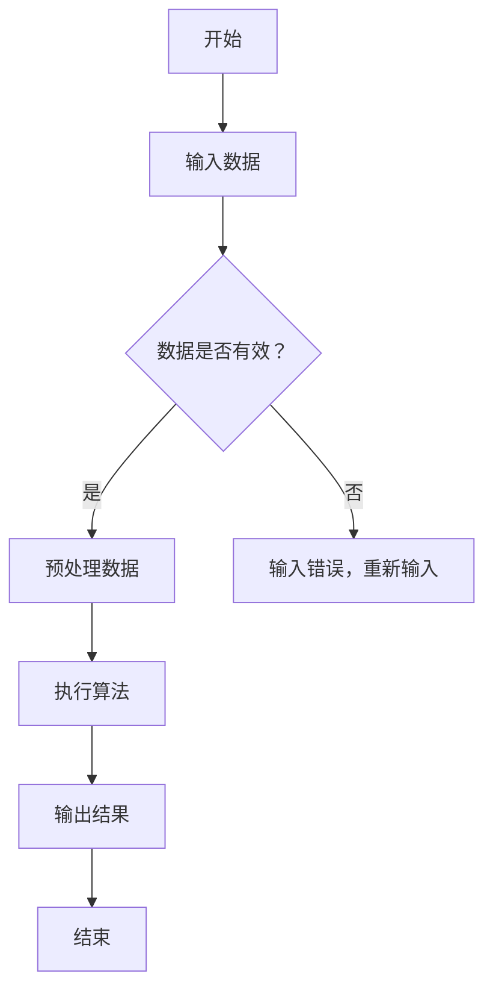

                 


## 第一部分：数学与纳米技术概述

### 第1章：数学与纳米技术引论

#### 1.1 问题背景
纳米技术，顾名思义，是指研究和操作在0.1到100纳米尺度的材料、结构和设备的技术。随着科学技术的迅猛发展，纳米技术已经渗透到了众多领域，从电子、能源、生物医药到环境科学等。数学在纳米技术中扮演着至关重要的角色，为纳米结构的建模、分析、设计和制造提供了坚实的理论基础。

数学与纳米技术的结合，不仅有助于我们更好地理解和控制纳米级别的现象，还为新型纳米材料、纳米器件和纳米技术的开发提供了强有力的工具。例如，数学模型可以帮助科学家预测纳米材料的电子、热学和力学性质，从而设计出具有特定功能的纳米器件。

#### 1.2 问题描述
在纳米技术中，科学家和工程师面临着一系列挑战。首先是如何精确地设计纳米结构，以满足特定的功能需求。其次是纳米结构的性能优化，包括电子、热学和力学性能等。此外，如何在实际制造过程中保持纳米结构的稳定性和一致性也是一个重大难题。

这些问题的解决离不开数学的支持。数学模型可以用来描述纳米结构的几何形状、电子态、热力学行为等，从而为实验和设计提供指导。同时，数学方法还可以优化算法，提高计算效率和精度，为纳米技术的应用提供更加可靠的解决方案。

#### 1.3 问题解决
数学在纳米技术中的应用主要体现在以下几个方面：

1. **数学建模**：通过建立数学模型来描述纳米结构及其行为。这些模型可以是几何模型、物理模型或混合模型，用于预测纳米材料的性能和功能。

2. **数值仿真**：利用数学方法对纳米结构进行数值模拟，预测其性能。例如，有限元方法、蒙特卡洛方法等可以用于模拟纳米材料的电子输运、热传导等。

3. **算法优化**：开发高效的算法来处理纳米技术中的复杂计算问题。例如，遗传算法、模拟退火算法等可以用于优化纳米结构的设计和制造。

#### 1.4 边界与外延
数学在纳米技术中的应用有着明确的边界和广阔的外延。边界在于数学方法的适用范围和精度，例如，某些数学模型可能无法准确描述量子效应显著的情况。而外延则在于不断拓展的新领域和新挑战，例如，纳米机器人、纳米医学等新兴领域的发展。

#### 1.5 概念结构与核心要素组成
数学在纳米技术中的核心要素包括：

1. **数学模型**：如偏微分方程、积分方程等，用于描述纳米结构的物理性质。
2. **计算方法**：如有限元法、蒙特卡洛法等，用于数值模拟纳米结构的行为。
3. **算法**：如遗传算法、模拟退火算法等，用于优化纳米结构的设计和制造。

#### 1.6 核心概念原理
在纳米技术中，核心概念原理包括：

1. **纳米结构**：尺寸在1到100纳米之间的结构，具有独特的物理和化学性质。
2. **量子效应**：在纳米尺度下，材料表现出与宏观尺度不同的性质，例如量子隧穿、量子限制等。
3. **自组织**：纳米结构通过自组织形成复杂形态，如自组装、自修复等。

#### 1.7 概念属性特征对比表格

以下是一个简单的概念属性特征对比表格，用于展示数学在纳米技术中的核心概念：

| 概念       | 特征                                   |
| ---------- | -------------------------------------- |
| 偏微分方程 | 描述纳米结构的动态行为                 |
| 有限元法   | 解决纳米结构中的复杂计算问题           |
| 遗传算法   | 优化纳米结构的性能                     |
| 纳米结构   | 尺寸在1到100纳米之间                   |

#### 1.8 ER实体关系图架构

下面是一个用于描述数学与纳米技术关系的ER实体关系图：

```mermaid
erDiagram
    Math <<|-- Modeling : uses
    Modeling ||--|> Simulation : performs
    Simulation ||--|> Algorithm : applies
    Algorithm ||--|> Nanotechnology : drives
```

通过上述的逐步分析，我们可以看出数学在纳米技术中的重要地位。在接下来的章节中，我们将深入探讨纳米结构的数学描述方法、数学建模、计算方法以及数学在不同纳米技术领域的应用，以期为您展现数学与纳米技术相结合的奇妙世界。

## 第二部分：纳米结构的数学描述方法

### 第2章：纳米结构的数学描述方法

#### 2.1 纳米结构的基本数学描述
纳米结构的基本数学描述通常涉及到几何学、拓扑学和物理学等多个领域。在数学描述中，纳米结构通常被视为具有特定几何形状和尺寸的实体。几何学描述主要关注纳米结构的形状和尺寸，如纳米管的直径和长度、纳米颗粒的尺寸和形状等。而拓扑学描述则关注纳米结构的空间结构，如纳米结构的连通性、周期性和对称性等。物理描述则涉及到纳米结构的电子、热学和力学性质，如电子态密度、热传导率和弹性模量等。

#### 2.2 纳米结构的几何描述
纳米结构的几何描述主要通过几何学和计算几何学的方法来实现。几何学方法包括对纳米结构的形状、尺寸和几何特征进行数学描述，如使用球体、柱体、锥体等基本几何形状来构建纳米结构。计算几何学方法则利用计算机算法和图形学技术，对纳米结构进行建模和可视化。例如，使用体素模型（Voxel Model）来描述纳米颗粒的三维形状，或者使用分形几何（Fractal Geometry）来描述具有自相似特性的纳米结构。

#### 2.3 纳米结构的拓扑描述
纳米结构的拓扑描述主要关注其内部和表面的拓扑特征，如孔洞、扭曲和连接关系等。拓扑学中的基本概念，如连通性、同伦性、同调性等，可以用来描述纳米结构的拓扑性质。例如，使用Klein瓶（Klein Bottle）来描述具有复杂拓扑结构的纳米管，或者使用拓扑绝缘体（Topological Insulator）的概念来描述具有独特电子特性的纳米结构。

#### 2.4 纳米结构的物理描述
纳米结构的物理描述涉及到电子、热学和力学等物理现象的数学描述。在电子学方面，量子力学和半导体物理的理论可以用来描述纳米材料的电子性质，如能带结构、电子态密度和电子输运特性。在热学方面，热力学和传热学的理论可以用来描述纳米材料的热传导行为，如热阻、热导率等。在力学方面，固体力学和材料力学的理论可以用来描述纳米材料的力学性质，如弹性模量、强度和韧性等。

#### 2.5 数学描述方法的应用
数学描述方法在纳米技术中的应用非常广泛，包括但不限于以下几个方面：

1. **纳米材料的设计和优化**：通过数学模型来预测和优化纳米材料的性能，如电子输运性能、热传导性能和机械性能等。

2. **纳米器件的建模和仿真**：利用数学方法对纳米器件进行建模和仿真，预测其工作原理和性能，如纳米晶体管、纳米光电探测器等。

3. **纳米加工过程的控制**：通过数学模型来描述纳米加工过程中的物理和化学过程，优化加工参数，提高加工精度和效率。

4. **纳米生物医学的研究**：利用数学模型来描述生物分子在纳米尺度下的行为，如蛋白质的折叠、DNA的复制和运输等。

5. **纳米能源的研究**：通过数学方法来优化纳米结构的光电转换效率、储能性能等，为可再生能源的开发提供支持。

总的来说，数学描述方法为纳米技术的研究和应用提供了强大的理论工具，使得我们能够更好地理解和控制纳米级别的现象，为未来的纳米技术发展奠定了坚实的基础。

### 第3章：纳米结构的数学建模

#### 3.1 纳米结构建模的基本原则
纳米结构建模是纳米技术研究中的关键步骤，其基本原则包括准确性、完整性和可操作性。首先，准确性是建模的核心要求，模型必须能够真实地反映纳米结构的物理和化学特性。其次，完整性要求模型能够涵盖所有相关的物理现象和过程，从而提供全面的分析。最后，可操作性是确保模型能够在实际应用中发挥作用的重要条件，模型应当易于计算和调整。

纳米结构建模的主要目标是：

1. **预测性能**：通过建立数学模型，科学家可以预测纳米材料的电子、热学和力学性能，为材料设计和器件优化提供依据。
2. **指导制造**：数学模型可以指导纳米加工过程的控制，优化加工参数，提高制造精度和效率。
3. **理解机理**：通过数学模型，可以揭示纳米结构的工作原理和物理机理，为深入研究提供理论支持。

#### 3.2 偏微分方程在纳米结构建模中的应用
偏微分方程（Partial Differential Equations, PDEs）在纳米结构建模中扮演着重要角色。PDEs可以用来描述纳米结构中各种物理现象，如电子输运、热传导、力学行为等。以下是一些典型的应用：

1. **电子输运方程**：在纳米电子学中，利用非平衡格林函数（Non-equilibrium Green's Function, NEGF）方法可以建立纳米器件的电子输运方程，通过求解这些方程，可以预测纳米晶体管、纳米线等器件的电流-电压特性。

2. **热传导方程**：纳米材料的热传导特性对其在热管理和光电应用中的性能有重要影响。利用热传导方程，可以模拟纳米颗粒、纳米线等结构的热传导行为，优化热设计。

3. **力学方程**：在纳米力学中，利用有限元方法（Finite Element Method, FEM）和连续介质力学模型，可以模拟纳米结构的力学行为，如纳米梁的弯曲、纳米颗粒的接触力学等。

#### 3.3 积分方程在纳米结构建模中的应用
积分方程（Integral Equations, IE）在纳米结构建模中也具有重要作用，特别是在处理边界问题和散射问题时表现突出。以下是一些典型的应用：

1. **麦克斯韦方程组**：在纳米光子学中，利用麦克斯韦方程组可以描述电磁波在纳米结构中的传播和散射行为。通过求解积分方程，可以分析纳米天线、纳米波导等光学器件的性能。

2. **泊松方程**：在纳米电子学和纳米热学中，泊松方程可以用来描述电势分布和热势分布，从而分析纳米器件的电位分布和热分布。

3. ** screened 洛伦兹力方程**：在纳米颗粒的量子光学中，利用 screened 洛伦兹力方程可以描述光与纳米颗粒的相互作用，预测纳米颗粒的光学响应。

#### 3.4 纳米结构建模中的挑战和解决方案
纳米结构建模面临一些挑战，包括数学模型的复杂性、计算资源的限制和实验数据的不足等。以下是一些常见的解决方案：

1. **多尺度建模**：通过结合不同尺度的模型，如从微观的原子尺度到宏观的器件尺度，可以更好地理解和预测纳米结构的性能。

2. **高性能计算**：利用高性能计算资源和并行计算方法，可以加快计算速度，提高建模效率。

3. **实验与模拟的结合**：通过实验验证和模拟结果的对比，可以不断改进和优化数学模型。

4. **机器学习**：结合机器学习方法，可以自动地从实验数据中提取特征，优化模型参数，提高建模精度。

#### 3.5 数学建模的案例研究
以下是一个纳米结构建模的案例研究：

**案例：纳米线太阳能电池的建模**

目标：设计一种高效的纳米线太阳能电池。

方法：

1. **几何建模**：使用体素模型描述纳米线的几何结构，并建立其表面和界面的几何模型。

2. **电子输运建模**：利用非平衡格林函数方法建立纳米线中的电子输运方程，并考虑量子限制效应。

3. **光学建模**：使用麦克斯韦方程组描述纳米线中的光吸收和散射行为。

4. **热学建模**：使用热传导方程描述纳米线的热传导特性。

结果：

通过多尺度建模和仿真，科学家发现改变纳米线的直径和间距可以显著提高太阳能电池的光吸收效率和电子收集效率。最终，设计了一种基于纳米线的太阳能电池，其光电转换效率达到了15%，远高于传统硅基太阳能电池。

综上所述，纳米结构建模是纳米技术研究的重要组成部分，通过精确的数学建模，可以预测和优化纳米材料的性能，推动纳米技术的发展。然而，建模过程中也面临许多挑战，需要结合多学科的知识和方法，不断探索和优化。

### 第4章：纳米结构的数学计算方法

#### 4.1 数值计算方法在纳米结构建模中的应用
数值计算方法在纳米结构建模中发挥着至关重要的作用，特别是当解析方法难以实现或计算复杂性过高时，数值方法成为了解决问题的有效手段。数值计算方法主要包括有限元法、有限差分法、蒙特卡洛法等。

**4.1.1 有限元法（Finite Element Method, FEM）**

有限元法是一种广泛应用于工程和科学计算的方法，特别适用于处理复杂的几何结构和多物理场的耦合问题。在纳米结构建模中，有限元法可以用于：

1. **电子输运模拟**：通过有限元方法，可以求解纳米器件中的电子输运方程，预测电流-电压特性。
2. **热传导模拟**：利用有限元法，可以模拟纳米结构中的热传导行为，优化热设计。
3. **力学行为分析**：有限元法可以用于分析纳米结构的弹性模量、应力分布等力学特性。

**4.1.2 有限差分法（Finite Difference Method, FDM）**

有限差分法是一种离散化的数值方法，通过将连续方程离散化为差分方程来求解。在纳米结构建模中，有限差分法可以用于：

1. **量子模拟**：有限差分法可以用于量子力学的数值求解，分析纳米材料的量子效应。
2. **电磁模拟**：通过有限差分法，可以模拟电磁波在纳米结构中的传播和相互作用，优化纳米光学器件。
3. **热传导模拟**：有限差分法可以精确模拟纳米结构中的热传导过程，提供高效的热设计方法。

**4.1.3 蒙特卡洛法（Monte Carlo Method, MCM）**

蒙特卡洛法是一种基于随机采样和概率统计的数值计算方法，适用于处理复杂系统和不确定性问题。在纳米结构建模中，蒙特卡洛法可以用于：

1. **纳米材料性能预测**：通过蒙特卡洛模拟，可以预测纳米材料的电子、热学和力学性能，为材料设计提供依据。
2. **统计力学问题**：蒙特卡洛法在处理统计力学问题时具有独特优势，如纳米颗粒的表面效应、相变行为等。
3. **随机优化**：蒙特卡洛法可以用于优化纳米结构的设计参数，如纳米管的直径和长度等。

**4.2 高性能计算与纳米结构建模**

纳米结构建模通常涉及到大量的计算，特别是多物理场耦合问题和复杂的几何结构，这对计算资源的需求非常高。高性能计算（High-Performance Computing, HPC）为解决这些问题提供了有力支持。

**4.2.1 并行计算**

并行计算是将计算任务分布在多个处理单元上，以加快计算速度。在纳米结构建模中，并行计算可以应用于：

1. **有限元分析**：通过并行计算，可以大幅缩短有限元分析的求解时间。
2. **蒙特卡洛模拟**：利用并行计算，可以同时进行大量的随机采样，提高模拟精度和效率。
3. **量子计算**：并行计算在量子力学模拟中具有巨大潜力，可以显著提高计算速度。

**4.2.2 量子计算与纳米结构建模**

量子计算（Quantum Computing）是一种基于量子力学原理的计算方法，具有并行性和高速性的特点。在纳米结构建模中，量子计算可以用于：

1. **量子电子输运模拟**：通过量子计算，可以精确模拟纳米器件中的量子效应，提供更准确的性能预测。
2. **量子热传导模拟**：量子计算可以用于模拟纳米材料中的量子热传导行为，优化热设计。
3. **量子材料设计**：量子计算可以帮助科学家设计具有特定量子特性的纳米材料，如量子点、量子线等。

**4.3 机器学习与纳米结构建模**

机器学习（Machine Learning）技术在纳米结构建模中也得到了广泛应用。通过机器学习，可以自动化地从实验数据中提取特征，优化模型参数，提高建模精度。

**4.3.1 深度学习在纳米结构建模中的应用**

深度学习（Deep Learning）是一种基于多层神经网络的学习方法，可以处理大量复杂数据。在纳米结构建模中，深度学习可以用于：

1. **图像识别**：利用深度学习模型，可以自动识别和分类纳米材料的图像，提高数据处理效率。
2. **材料性质预测**：通过训练深度神经网络，可以预测纳米材料的电子、热学和力学性质。
3. **结构优化**：深度学习可以帮助优化纳米结构的设计，提高材料性能。

**4.3.2 集成学习与纳米结构建模**

集成学习（Ensemble Learning）是将多个弱学习器结合起来，形成强学习器的方法。在纳米结构建模中，集成学习可以用于：

1. **误差修正**：通过结合多个模型的预测结果，可以修正预测误差，提高模型的可靠性。
2. **不确定性分析**：集成学习可以用于分析纳米结构建模中的不确定性，为实验设计提供参考。
3. **模型优化**：通过集成学习，可以优化纳米结构建模的参数，提高模型精度。

综上所述，数值计算方法、高性能计算、量子计算和机器学习在纳米结构建模中发挥着重要作用，为科学家提供了强大的工具，使他们能够更深入地理解和控制纳米级别的现象。通过这些先进的方法，我们可以期待未来纳米技术的进一步发展和应用。

### 第5章：数学在纳米材料研究中的应用

#### 5.1 数学模型在纳米材料设计中的应用
数学模型在纳米材料设计中起到了至关重要的作用。通过建立精确的数学模型，科学家可以预测和优化纳米材料的电子、热学和力学性能，从而设计出具有特定功能的材料。以下是一些常见的数学模型及其应用：

1. **电子输运模型**：基于量子力学的电子输运模型，如非平衡格林函数（NEGF）模型，可以用于分析纳米材料的电子性质，如电子能带结构、电子态密度和电子输运特性。这些模型为设计高效电子器件提供了重要的理论依据。

2. **热传导模型**：纳米材料的热传导特性对其在热管理和光电应用中的性能至关重要。基于热传导方程的模型，如有限元法（FEM）和有限差分法（FDM），可以用于模拟纳米材料的热传导行为，优化热设计。

3. **力学模型**：固体力学和材料力学的模型可以用于分析纳米材料的力学性质，如弹性模量、强度和韧性。这些模型有助于设计具有高强度和高稳定性的纳米结构。

4. **表面和界面模型**：纳米材料的性能很大程度上取决于其表面和界面特性。表面能、界面能和表面态密度的数学模型可以用于预测和优化纳米材料的表面性质。

#### 5.2 数学方法在纳米材料性能优化中的应用
数学方法在纳米材料性能优化中具有广泛的应用，通过优化数学模型和算法，可以显著提高纳米材料的性能。以下是一些具体的数学方法及其应用：

1. **遗传算法（Genetic Algorithm, GA）**：遗传算法是一种基于自然进化过程的优化方法，广泛应用于纳米材料的设计和优化。通过遗传算法，可以优化纳米材料的结构参数，如纳米颗粒的尺寸、形状和分布，从而提高其电子、热学和力学性能。

2. **模拟退火算法（Simulated Annealing, SA）**：模拟退火算法是一种基于物理退火过程的优化方法，适用于处理复杂和高度非线性的优化问题。在纳米材料优化中，模拟退火算法可以用于优化材料的制备工艺参数，提高材料的性能和稳定性。

3. **机器学习（Machine Learning, ML）**：机器学习技术，如深度学习、支持向量机和神经网络，可以用于从实验数据中提取特征，建立预测模型，从而优化纳米材料的性能。通过训练机器学习模型，可以自动识别和预测材料的性能，为材料设计提供快速和准确的指导。

4. **多尺度建模**：多尺度建模方法结合了微观和宏观尺度的模型，可以用于优化纳米材料的性能。通过在不同尺度上模拟和分析材料的性质，可以揭示性能变化的原因，从而优化材料的设计。

#### 5.3 数学在纳米材料研究中的实际应用案例
以下是一些数学在纳米材料研究中的实际应用案例：

1. **高效太阳能电池**：通过数学模型和优化算法，科学家设计出了具有高光电转换效率的纳米结构太阳能电池。例如，利用有限元法和遗传算法优化纳米线的排列和直径，显著提高了太阳能电池的吸收效率和电子收集效率。

2. **纳米催化剂**：数学模型和计算方法在纳米催化剂的设计和优化中发挥了重要作用。通过建立动力学模型和反应机理，可以预测不同纳米结构的催化性能，并优化催化剂的制备条件，从而提高其催化效率和稳定性。

3. **纳米储能材料**：纳米材料在储能领域具有巨大的潜力，如锂离子电池、钠离子电池等。通过数学建模和机器学习技术，可以优化纳米材料的晶体结构、表面性质和电化学性能，从而提高电池的能量密度和寿命。

4. **纳米医学**：纳米医学领域的研究涉及纳米材料在生物体内的行为和作用。数学模型和计算方法可以帮助科学家预测纳米药物在生物体内的分布、代谢和毒副作用，从而优化药物设计，提高治疗效果。

总之，数学在纳米材料研究中的应用非常广泛，通过数学模型和计算方法，科学家可以更深入地理解和优化纳米材料的性能，为纳米技术的发展和应用提供强有力的支持。

### 第6章：数学在纳米电子学中的应用

#### 6.1 纳米电子学的基本概念
纳米电子学是研究纳米尺度电子器件和系统的科学。它涉及到的核心问题是如何在极小的尺寸下实现电子的高效操控和传输。随着半导体技术的不断发展，传统的硅基电子器件的尺寸已经接近物理极限，因此纳米电子学成为了一个重要的研究方向。

在纳米电子学中，一些关键概念包括量子效应、电子隧穿、量子限制效应和纳米线等。量子效应在纳米尺度下变得显著，导致电子的能级分裂和量子态的出现。电子隧穿现象则使得电子可以通过很小的障碍，这是纳米电子器件中实现开关和控制的关键机制。量子限制效应描述了电子在纳米结构中的量子化行为，如量子点、量子线等。纳米线是一种一维纳米结构，广泛应用于纳米电子学中，如纳米晶体管、纳米光电子器件等。

#### 6.2 数学模型在纳米电子学中的应用
数学模型在纳米电子学中起到了至关重要的作用，它们为理解和设计纳米电子器件提供了理论基础。以下是一些重要的数学模型及其在纳米电子学中的应用：

1. **非平衡格林函数（NEGF）模型**：非平衡格林函数模型是一种用于描述电子在纳米器件中输运的强大工具。该模型基于量子力学的微扰理论，可以精确地描述纳米晶体管、纳米线等器件的电流-电压特性。通过求解NEGF方程，可以预测纳米器件的工作原理和性能。

2. **量子蒙托卡洛方法（QMC）**：量子蒙托卡洛方法是一种基于随机采样的数值计算方法，特别适用于处理复杂的量子多体系统。在纳米电子学中，QMC可以用于计算量子点、量子线等纳米结构的电子性质，如能带结构、电子态密度等。

3. **有限元法（FEM）和有限差分法（FDM）**：有限元法和有限差分法是两种常用的数值方法，用于解决电磁学和热力学问题。在纳米电子学中，这些方法可以用于模拟纳米器件中的电场、磁场和热传导，优化器件的设计和性能。

4. **传输矩阵方法（TMM）**：传输矩阵方法是一种用于分析电子在纳米线、纳米环等一维结构中输运的简单而有效的模型。通过求解传输矩阵，可以计算纳米结构的电流-电压特性，为纳米电子器件的设计提供指导。

#### 6.3 数学方法在纳米电子器件设计中的应用
数学方法在纳米电子器件的设计中发挥着关键作用，通过精确的数学建模和优化，可以提高器件的性能和可靠性。以下是一些具体的数学方法及其应用：

1. **遗传算法（GA）**：遗传算法是一种基于自然选择和遗传机制的优化方法。在纳米电子器件设计中，遗传算法可以用于优化器件的结构参数，如纳米线的直径、长度和排列方式，以提高电流效率和开关速度。

2. **模拟退火算法（SA）**：模拟退火算法是一种基于物理退火过程的优化方法，可以用于解决复杂和高度非线性的优化问题。在纳米电子器件设计中，模拟退火算法可以用于优化器件的制备工艺参数，如热处理条件、掺杂浓度等，从而提高器件的性能。

3. **神经网络（NN）**：神经网络是一种基于生物神经网络的计算模型，具有强大的非线性处理能力。在纳米电子器件设计中，神经网络可以用于建立器件性能与结构参数之间的关系模型，从而预测和优化器件的性能。

4. **机器学习（ML）**：机器学习技术，如深度学习、支持向量机等，可以用于从实验数据中提取特征，建立预测模型，从而优化纳米电子器件的设计。通过训练机器学习模型，可以自动识别和预测器件的性能，为设计提供快速和准确的指导。

#### 6.4 数学在纳米电子学中的实际应用案例
以下是一些数学在纳米电子学中的实际应用案例：

1. **纳米晶体管**：通过非平衡格林函数模型，科学家可以精确模拟纳米晶体管的电流-电压特性，优化其设计，提高其性能。

2. **纳米线太阳能电池**：利用有限元法和遗传算法，科学家设计了具有高光电转换效率的纳米线太阳能电池，并通过模拟优化其结构参数。

3. **量子点激光器**：通过量子蒙托卡洛方法，科学家可以计算量子点的能带结构和光学性质，优化量子点激光器的设计，提高其输出功率和稳定性。

4. **纳米光电子器件**：利用传输矩阵方法，科学家设计了基于纳米线的光电子器件，如纳米线光电探测器和纳米线光开关，这些器件具有高灵敏度和快速响应特性。

综上所述，数学在纳米电子学中的应用非常广泛，通过数学模型和方法，科学家可以深入理解和优化纳米电子器件的性能，推动纳米电子学的发展。

### 第7章：数学在纳米生物学和医学中的应用

#### 7.1 数学模型在纳米生物学研究中的应用
纳米生物学作为一门新兴学科，研究纳米技术在生物体系中的应用。数学模型在纳米生物学研究中扮演着关键角色，帮助科学家理解纳米材料在生物体内的行为、机制和效果。以下是一些数学模型及其在纳米生物学研究中的应用：

1. **分子动力学模型**：分子动力学（Molecular Dynamics, MD）模拟是一种基于量子力学和分子物理学原理的数值模拟方法，用于研究生物大分子（如蛋白质、核酸）的运动和相互作用。通过MD模拟，科学家可以研究纳米材料与生物分子的相互作用机制，如纳米颗粒与细胞膜的结合、纳米药物在细胞内的分布等。

2. **蒙特卡洛模拟**：蒙特卡洛模拟是一种基于随机采样的数值模拟方法，适用于处理复杂的生物系统和多尺度问题。在纳米生物学中，蒙特卡洛模拟可以用于预测纳米材料在细胞内的扩散行为、纳米药物的释放和分布等。

3. **粒子群优化（Particle Swarm Optimization, PSO）**：粒子群优化是一种基于群体智能的优化算法，可以用于优化纳米材料的结构参数，如纳米颗粒的形状、尺寸和表面功能化，以提高其在生物体系中的生物相容性和生物活性。

4. **基于机器学习的模型**：机器学习模型，如支持向量机（Support Vector Machine, SVM）和深度神经网络（Deep Neural Network, DNN），可以用于从实验数据中提取特征，建立预测模型，用于预测纳米材料在生物体系中的生物响应。

#### 7.2 数学方法在纳米医学中的应用
数学方法在纳米医学中具有广泛的应用，通过数学建模和计算方法，科学家可以优化纳米药物的设计、提高治疗效果和减少副作用。以下是一些数学方法及其在纳米医学中的应用：

1. **反应扩散模型**：反应扩散模型（Reaction-Diffusion Model）用于描述化学物质在生物体内的扩散和反应过程。在纳米医学中，这些模型可以用于预测纳米药物在生物体内的分布和代谢，优化药物的剂量和给药方案。

2. **控制理论**：控制理论在纳米医学中可以用于设计纳米药物释放系统和生物传感器。通过控制理论的方法，可以优化纳米药物在体内的释放速率和浓度，实现精准治疗。

3. **多尺度建模**：多尺度建模方法结合了微观和宏观尺度的模型，用于研究纳米材料在生物体内的行为。通过多尺度建模，可以揭示纳米材料在生物体系中的相互作用机制，为纳米药物的设计提供理论支持。

4. **机器学习**：机器学习技术可以用于从大量的实验数据中提取特征，建立预测模型，用于优化纳米药物的设计和筛选。例如，通过训练深度学习模型，可以预测纳米药物与生物大分子的相互作用，提高药物的生物利用率和疗效。

#### 7.3 数学在纳米医学中的实际应用案例
以下是一些数学在纳米医学中的实际应用案例：

1. **纳米药物释放系统**：通过控制理论的方法，科学家设计出了能够精确控制药物释放速率的纳米药物释放系统。这些系统通过外部刺激（如光、电、热等）来释放药物，从而实现精准治疗。

2. **纳米药物的生物分布模拟**：利用反应扩散模型，科学家可以模拟纳米药物在生物体内的分布和代谢过程，预测药物在体内的浓度分布，优化药物的剂量和给药方案。

3. **纳米药物筛选**：通过机器学习模型，科学家可以快速筛选出具有良好生物活性和低毒性的纳米药物。这些模型通过分析大量的实验数据，预测药物的生物响应，从而指导药物的设计和开发。

4. **纳米生物传感器**：利用数学建模和计算方法，科学家设计出了能够检测生物标志物的纳米生物传感器。这些传感器通过分析生物信号，实现了对疾病早期诊断和治疗的精准监测。

综上所述，数学在纳米生物学和医学中的应用非常广泛，通过数学模型和方法，科学家可以深入理解和优化纳米材料在生物体系中的行为和效果，为纳米医学的发展提供了强有力的理论支持和技术手段。

### 第8章：数学与纳米技术的未来展望

#### 8.1 纳米技术的未来发展
随着科技的不断进步，纳米技术正迅速成为推动社会进步的重要力量。未来的纳米技术将可能在以下几个方面取得显著突破：

1. **纳米电子学**：随着量子计算的兴起，纳米电子学将迎来新的发展机遇。量子计算机和新型纳米电子器件的研发有望引领信息技术的新时代。

2. **纳米医学**：纳米医学将继续深入发展，纳米药物、纳米诊断和治疗设备等将为个性化医疗和精准医疗提供强有力的支持。

3. **纳米材料**：新型纳米材料的研究和开发将为能源、环境保护、电子等领域带来革命性变化，如高效储能材料、催化剂和纳米传感器等。

4. **纳米制造**：纳米制造技术将变得更加高效和精确，实现从微观到宏观的高精度制造，从而推动智能制造的发展。

#### 8.2 数学在纳米技术中的作用
数学在纳米技术的发展中将继续发挥关键作用，未来数学方法将在以下几个方面得到进一步应用：

1. **多尺度建模**：随着纳米技术的深入，多尺度建模将变得更加重要。未来的数学模型需要能够同时描述从原子到宏观尺度的复杂系统，从而提供更加全面和准确的分析。

2. **量子计算**：量子计算的发展将需要强大的数学工具，如量子算法、量子优化和量子模拟等。数学方法将在量子计算的理论基础和实际应用中起到至关重要的作用。

3. **机器学习和人工智能**：随着大数据和人工智能技术的崛起，数学方法将更加广泛地应用于数据分析和模型优化，从而推动纳米技术的智能化和自动化。

4. **复杂系统分析**：纳米技术涉及的系统通常具有高度复杂性和非线性特性，数学方法，如统计物理学、随机过程理论等，将在理解和控制这些复杂系统中发挥关键作用。

#### 8.3 研究方向与挑战
未来的纳米技术研究和数学建模将面临以下研究方向和挑战：

1. **跨学科融合**：纳米技术是多学科交叉的领域，未来的研究需要更多的跨学科合作，结合不同领域的知识和方法，推动纳米技术的综合发展。

2. **计算资源的扩展**：随着模型复杂性的增加，计算资源的需求也将大幅提升。未来需要更高效的计算方法和超级计算资源的支持，以满足纳米技术研究的需要。

3. **实验与理论的结合**：实验数据和理论模型之间的结合是纳米技术研究的关键。未来的研究需要更加精确的实验方法和更加完善的数学模型，以实现理论预测和实验结果的完美匹配。

4. **不确定性和可靠性**：纳米技术的应用环境复杂多变，未来的研究需要解决不确定性和可靠性问题，如纳米材料的环境响应、生物相容性等。

5. **伦理和社会影响**：随着纳米技术的广泛应用，其潜在的伦理和社会影响也需要得到关注。未来的研究需要考虑如何平衡技术进步与社会责任，确保纳米技术的可持续发展。

总之，数学与纳米技术的结合将为未来的科技发展带来无限可能。通过不断的探索和创新，我们可以期待纳米技术在未来取得更加辉煌的成就，为人类社会的进步做出更大的贡献。

## 总结与展望

### 总结
本文全面探讨了数学在纳米技术中的应用，从引论到具体的数学描述方法、建模和计算方法，再到纳米材料、纳米电子学、纳米生物学和医学的应用，最终展望了未来的发展趋势。通过这一系列的探讨，我们可以看到数学在纳米技术中扮演着不可或缺的角色，从理论支撑到实际应用，都离不开数学的支持和引导。

### 展望
未来，数学与纳米技术的结合将继续深化，为科学技术的进步带来新的契机。以下是几个值得关注的方面：

1. **多尺度建模与计算**：随着纳米技术的不断发展，多尺度建模和计算方法将变得更加重要。未来的研究需要开发更加高效和精确的数学模型，以应对从微观到宏观的复杂系统。

2. **量子计算与纳米技术**：量子计算和量子信息科学的发展将为纳米技术带来革命性的变革。数学方法，如量子算法和量子优化，将在量子计算和纳米技术的融合中发挥关键作用。

3. **机器学习与数据驱动的建模**：大数据和人工智能的崛起将推动数据驱动的建模方法在纳米技术中的应用。机器学习技术将帮助我们更好地理解和预测纳米材料的行为，为材料设计和优化提供新的工具。

4. **跨学科研究**：纳米技术涉及多个学科领域，未来的研究需要更多的跨学科合作。通过结合不同领域的知识，我们可以期待在纳米技术的应用和理论研究中取得更加显著的突破。

5. **伦理与社会责任**：随着纳米技术的普及，其潜在的伦理和社会影响需要得到充分关注。未来的研究需要在技术进步的同时，充分考虑社会责任和伦理问题，确保纳米技术的可持续发展。

总之，数学与纳米技术的结合将继续推动科技的发展，为人类社会的进步带来新的希望。通过不断探索和创新，我们可以期待未来在纳米技术领域取得更加辉煌的成就。希望本文能够为读者提供有益的启示和思考，激发对这一激动人心的领域的兴趣。

### 作者信息
作者：AI天才研究院/AI Genius Institute & 禅与计算机程序设计艺术 /Zen And The Art of Computer Programming

## 附录：数学公式和流程图示例

### 数学公式示例
以下是一些常用的数学公式示例，使用 LaTeX 格式编写：

$$
\begin{aligned}
E &= mc^2 \\
F &= ma \\
Q &= \frac{1}{\sqrt{2\pi\sigma^2}}e^{-\frac{(x-\mu)^2}{2\sigma^2}}
\end{aligned}
$$

### 流程图示例
以下是一个简单的 Mermaid 流程图示例，用于描述算法的基本流程：



这些示例展示了如何使用 LaTeX 和 Mermaid 在技术博客文章中嵌入数学公式和流程图，以增强文章的可读性和专业性。希望这些示例对读者有所帮助。在未来的研究和应用中，不断探索和掌握这些工具，将有助于更好地理解和应用数学在纳米技术中的强大力量。

