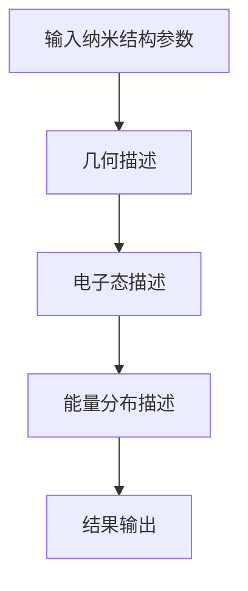
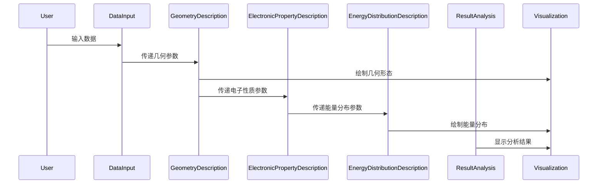

                 

## 数学与纳米技术：纳米结构的数学描述

### 关键词：纳米技术、数学描述、纳米结构、算法原理、系统架构设计

> 摘要：本文探讨了数学在纳米技术领域中的应用，重点关注了纳米结构的数学描述方法及其在实践中的具体应用。通过分析纳米材料与纳米结构的定义、特性及其数学描述原理，我们探讨了纳米结构的数学描述方法。接着，我们详细介绍了用于描述纳米结构的数学工具，包括数学模型、公式以及Python源代码实现。在此基础上，我们设计了一个纳米结构描述的系统架构，并展示了其实际应用中的环境安装和系统核心实现。本文旨在为读者提供一个全面、深入的理解，帮助他们在纳米技术领域取得突破。

### 目录大纲

----------------------------------------------------------------

## 第一部分: 引言

### 第1章: 引言

## 1.1 问题背景

### 1.1.1 纳米技术的概念与重要性

### 1.1.2 数学在纳米技术中的应用

## 1.2 问题描述

### 1.2.1 纳米结构的数学描述需求

### 1.2.2 纳米结构的数学描述方法

## 1.3 问题解决

### 1.3.1 数学方法在纳米结构描述中的应用

### 1.3.2 纳米结构的数学描述工具

## 1.4 边界与外延

### 1.4.1 纳米结构研究的现状

### 1.4.2 纳米结构研究的未来趋势

## 1.5 概念结构与核心要素组成

### 1.5.1 纳米结构的数学描述概念结构

### 1.5.2 核心要素组成

## 1.6 本章小结

----------------------------------------------------------------

----------------------------------------------------------------

## 第二部分: 核心概念与联系

### 第2章: 核心概念与联系

## 2.1 核心概念原理

### 2.1.1 纳米材料的定义与特性

### 2.1.2 纳米结构的数学描述原理

## 2.2 概念属性特征对比表格

### 2.2.1 纳米材料与纳米结构的比较

### 2.2.2 纳米结构的数学描述方法对比

## 2.3 ER实体关系图架构

### 2.3.1 纳米材料的ER图

### 2.3.2 纳米结构的数学描述ER图

----------------------------------------------------------------

----------------------------------------------------------------

## 第三部分: 算法原理讲解

### 第3章: 算法原理讲解

## 3.1 算法mermaid流程图

### 3.1.1 纳米结构数学描述算法流程

## 3.2 Python源代码实现

### 3.2.1 算法源代码示例

### 3.2.2 源代码解读与分析

## 3.3 算法原理的数学模型和公式

### 3.3.1 数学模型介绍

### 3.3.2 数学公式推导

## 3.4 举例说明

### 3.4.1 简单实例讲解

### 3.4.2 复杂实例分析

## 3.5 本章小结

----------------------------------------------------------------

----------------------------------------------------------------

## 第四部分: 系统分析与架构设计方案

### 第4章: 系统分析与架构设计方案

## 4.1 问题场景介绍

### 4.1.1 纳米结构研究的背景

### 4.1.2 研究问题与目标

## 4.2 项目介绍

### 4.2.1 项目背景

### 4.2.2 项目目标

## 4.3 系统功能设计(领域模型mermaid类图)

### 4.3.1 领域模型分析

### 4.3.2 类图设计

## 4.4 系统架构设计(mermaid架构图)

### 4.4.1 架构设计思路

### 4.4.2 系统架构图

## 4.5 系统接口设计

### 4.5.1 接口定义

### 4.5.2 接口实现

## 4.6 系统交互(mermaid序列图)

### 4.6.1 系统交互流程

### 4.6.2 序列图设计

## 4.7 本章小结

----------------------------------------------------------------

----------------------------------------------------------------

## 第五部分: 项目实战

### 第5章: 项目实战

## 5.1 环境安装

### 5.1.1 环境准备

### 5.1.2 环境配置

## 5.2 系统核心实现源代码

### 5.2.1 源代码结构

### 5.2.2 源代码解读

## 5.3 代码应用解读与分析

### 5.3.1 应用场景选择

### 结论与展望

在本篇文章中，我们探讨了数学与纳米技术的交叉领域，重点关注了纳米结构的数学描述方法。我们从引言部分开始，介绍了纳米技术的概念与重要性，并引出了数学在纳米技术中的应用。接着，我们详细分析了纳米结构的数学描述需求及其方法，涵盖了从核心概念原理到具体的数学描述工具。

在第三部分，我们深入讲解了纳米结构数学描述的算法原理，并通过mermaid流程图和Python源代码实现了算法的具体步骤。我们不仅仅停留在算法的描述上，还详细介绍了算法的数学模型和公式，帮助读者更好地理解算法的原理。

接下来的第四部分，我们设计了一个纳米结构描述的系统架构，涵盖了问题场景介绍、系统功能设计、系统架构设计、系统接口设计和系统交互等内容。这部分内容旨在展示一个完整的纳米结构描述系统是如何设计和实现的。

在第五部分，我们通过一个实际项目展示了系统在环境安装、系统核心实现和代码应用解读与分析等方面的具体操作。这部分内容不仅有助于读者理解系统架构，还能为他们提供实际操作的指导。

在文章的最后，我们对纳米结构的数学描述进行了总结，并展望了未来纳米结构研究的发展趋势。我们希望本文能够为读者提供一个全面、深入的理解，激发他们在纳米技术领域的兴趣和创造力。让我们继续探索数学与纳米技术的美妙结合，为未来科技的发展贡献力量。

### 引言

#### 1.1 问题背景

纳米技术作为一门新兴的科学技术，正迅速改变着我们的世界。它通过操纵和构建材料、器件和系统在纳米尺度（1到100纳米）上的特性，创造出前所未有的功能和性能。纳米技术的应用范围极其广泛，包括电子学、材料科学、医学、能源和环境等多个领域。

纳米技术的核心在于其独特的尺寸效应，即材料在纳米尺度上表现出与宏观尺度截然不同的物理、化学和生物学特性。这种特性使得纳米材料在强度、导电性、催化活性、光学性质等方面具有显著优势。例如，纳米银颗粒具有卓越的抗菌性能，而纳米碳管则具有极高的机械强度。这些特性为纳米技术在各种实际应用中提供了无限可能。

数学在纳米技术的研发和应用中起着至关重要的作用。数学工具和方法能够精确描述纳米结构的几何形状、电子态、能量分布等特性，从而为理解和设计纳米材料提供理论基础。纳米结构的数学描述方法不仅有助于我们更好地理解纳米材料的特性，还能指导我们设计和合成新的纳米材料，以满足不同领域的需求。

本文旨在探讨数学在纳米技术中的应用，重点关注纳米结构的数学描述方法。我们将首先介绍纳米技术的概念与重要性，然后分析数学在纳米技术中的应用，并详细讨论纳米结构的数学描述需求和方法。通过本文的探讨，我们希望读者能够对纳米结构的数学描述有一个全面、深入的理解，从而更好地把握这一领域的前沿动态。

#### 1.2 数学在纳米技术中的应用

数学在纳米技术中扮演着至关重要的角色，其应用贯穿于纳米材料的设计、合成、表征和应用的各个环节。首先，数学模型是理解纳米结构特性的基础。通过数学模型，我们可以预测和解释纳米材料在微观和宏观尺度上的行为。例如，量子力学和统计力学模型能够描述纳米尺度下的电子态和能量分布，帮助科学家理解纳米材料的电子性质。

其次，数学方法在纳米材料的合成中也有着广泛应用。纳米材料的合成往往涉及到复杂的化学反应和物理过程，数学方法如反应动力学和分子动力学模拟可以帮助科学家优化合成条件，提高产率和纯度。例如，利用计算机模拟技术，可以模拟出纳米颗粒在溶剂中的生长过程，从而优化颗粒的尺寸和形状。

在纳米材料的表征方面，数学方法同样发挥着重要作用。纳米材料的表征通常需要高分辨率成像技术，如扫描电子显微镜（SEM）和透射电子显微镜（TEM）。数学方法如图像处理和模式识别技术可以帮助科学家从图像中提取有用的信息，如颗粒的尺寸、形状和分布。此外，数学模型还可以用于解析光谱数据，如X射线光电子能谱（XPS）和拉曼光谱（Raman），以揭示纳米材料的电子结构和化学成分。

最后，在纳米材料的应用方面，数学方法同样不可或缺。例如，在纳米电子学中，数学模型用于设计和优化纳米电子器件，如纳米线、纳米孔和量子点。通过量子力学模型，可以预测这些器件的电流-电压特性，并优化其性能。在纳米医学中，数学方法如蒙特卡罗模拟和分子动力学模拟可以帮助科学家设计和优化纳米药物的递送系统，以提高疗效和降低副作用。

总之，数学在纳米技术的各个阶段中都有着广泛而深入的应用。它不仅为理解和设计纳米材料提供了强有力的工具，还推动了纳米技术的快速发展。随着数学工具的不断进步，我们有理由相信，纳米技术将在未来带来更多的创新和突破。

#### 1.3 问题描述

在纳米技术领域，纳米结构的数学描述是一个核心且关键的问题。纳米结构在几何形态、电子态、能量分布等方面具有独特的特性，而这些特性往往是其功能和应用的基础。因此，精确地数学描述纳米结构，不仅有助于我们更好地理解其物理和化学行为，还为设计和合成新型纳米材料提供了理论基础。

首先，纳米结构的数学描述需求源自于对纳米材料性能的精确调控。例如，在电子学领域，纳米电子器件的尺寸和结构对其性能有显著影响。精确的数学描述可以揭示器件中电子的传输行为，从而指导我们优化器件的设计和性能。在材料科学领域，纳米材料的强度、导电性、催化活性等特性也与其几何形态密切相关。通过数学描述，我们可以预测不同几何形态下的材料性能，从而有针对性地设计和合成新材料。

其次，数学描述纳米结构的需求还体现在对纳米材料的表征和分析上。纳米材料的表征往往需要高分辨率成像技术和光谱技术，而这些技术产生的数据往往需要进行复杂的数学处理和解析。例如，在透射电子显微镜（TEM）中，我们获取的图像需要进行图像处理和形态分析，以提取纳米颗粒的尺寸、形状和分布信息。数学模型如傅里叶变换和小波变换在这一过程中发挥着重要作用。

最后，数学描述纳米结构也是纳米技术在医学、环境、能源等领域的应用基础。在医学领域，纳米药物递送系统需要精确控制纳米颗粒的尺寸和形状，以实现高效的药物递送和降低副作用。在环境领域，纳米材料在污染物处理和水净化中的应用需要对其结构和功能进行精确描述，以优化其性能和安全性。在能源领域，纳米材料在太阳能电池、锂电池等中的应用同样需要对其电子结构和能量分布进行数学描述。

综上所述，纳米结构的数学描述需求不仅仅是对纳米材料特性和行为的一种描述，更是推动纳米技术发展的关键。通过精确的数学描述，我们能够更好地理解和设计纳米材料，从而实现其在各个领域的广泛应用。在接下来的部分，我们将深入探讨纳米结构的数学描述方法，以期为这一关键问题提供更为详细的解答。

#### 1.4 纳米结构的数学描述方法

纳米结构的数学描述方法多种多样，主要涵盖了几何描述、电子态描述和能量分布描述等方面。这些描述方法不仅帮助我们理解和量化纳米结构的特性，还为设计和优化纳米材料提供了理论基础。

首先，几何描述是纳米结构数学描述的基础。几何描述通过数学方法对纳米结构的形状、尺寸和排列进行精确描述。常用的几何描述方法包括点群对称性分析、晶格模型和体心描述等。点群对称性分析利用点群的对称性来简化纳米结构的描述，使得复杂的结构变得更容易处理。晶格模型通过构建周期性排列的晶格点来描述纳米材料的结构，这种方法广泛应用于半导体材料和晶体材料的描述。体心描述则通过在纳米结构中心定义一个体心来描述其几何形态，这种方法在纳米颗粒和纳米薄膜的研究中广泛应用。

其次，电子态描述是理解纳米材料电子性质的关键。电子态描述通过数学模型来描述纳米结构中的电子分布和能级结构。量子力学模型如薛定谔方程和费米-狄拉克统计分布是电子态描述的核心工具。通过这些模型，我们可以计算出纳米结构中的能带结构、电子态密度和能级位置。例如，在纳米线、纳米片和量子点等一维、二维和零维纳米材料中，电子态描述有助于理解其独特的电子传输性质和光学特性。

最后，能量分布描述通过数学方法描述纳米结构中的能量分布和能级分布。能量分布描述不仅涉及电子能量，还包括声子能量和磁能量等。常用的能量分布描述方法包括统计力学模型和蒙特卡罗模拟。统计力学模型通过概率统计的方法描述能量分布，而蒙特卡罗模拟则通过随机模拟来计算纳米结构中的能量分布。能量分布描述有助于我们理解纳米材料的热力学稳定性和相变行为。

在实际应用中，这些数学描述方法往往结合使用，以获得更全面和准确的纳米结构特性。例如，在设计和优化纳米电子器件时，几何描述和电子态描述相结合，可以精确计算器件中的电子传输特性；在材料科学研究中，几何描述和能量分布描述相结合，可以预测纳米材料的物理和化学性能。

总之，纳米结构的数学描述方法为理解和设计纳米材料提供了强有力的工具。通过几何描述、电子态描述和能量分布描述，我们可以精确地描述纳米结构的几何形态、电子性质和能量分布，从而推动纳米技术的快速发展。在接下来的章节中，我们将进一步探讨这些描述方法的具体实现和实际应用。

#### 1.5 数学方法在纳米结构描述中的应用

数学方法在纳米结构描述中的应用已经取得了显著的成果，特别是在几何描述、电子态描述和能量分布描述等方面。以下我们将详细介绍几种主要的数学方法，并探讨其在纳米结构描述中的具体应用。

首先，几何描述方法在纳米结构研究中扮演着关键角色。几何描述方法主要包括点群对称性分析、晶格模型和体心描述等。点群对称性分析利用点群的对称性来简化纳米结构的描述，从而减少计算复杂度。例如，在研究纳米颗粒的对称性时，我们可以利用点群对称性分析来确定其对称轴和对称中心，从而简化几何建模过程。晶格模型通过构建周期性排列的晶格点来描述纳米材料的结构，这种方法在半导体材料和晶体材料的研究中广泛应用。例如，在硅纳米线的研究中，晶格模型可以用于描述硅纳米线的生长过程和几何形态。体心描述则通过在纳米结构中心定义一个体心来描述其几何形态，这种方法在纳米颗粒和纳米薄膜的研究中应用广泛。例如，在纳米颗粒的合成中，体心描述可以帮助我们优化颗粒的尺寸和形状，以提高其性能。

其次，电子态描述方法在理解纳米材料的电子性质方面至关重要。电子态描述方法主要包括量子力学模型和统计力学模型。量子力学模型如薛定谔方程和费米-狄拉克统计分布用于描述纳米结构中的电子分布和能级结构。例如，在纳米线的研究中，量子力学模型可以用于计算纳米线中的电子能带结构，从而揭示其独特的电子传输性质。统计力学模型如费米-狄拉克统计分布和蒙特卡罗模拟用于描述电子在纳米结构中的分布和能级填充状态。例如，在量子点的研究中，蒙特卡罗模拟可以用于计算量子点中的电子能级分布，从而优化量子点的光电性能。

最后，能量分布描述方法在纳米材料的能量表征和性能优化中具有重要应用。能量分布描述方法主要包括统计力学模型和蒙特卡罗模拟。统计力学模型通过概率统计的方法描述能量分布，例如，在研究纳米材料的热力学稳定性时，我们可以利用统计力学模型来计算纳米材料的相变温度和热力学参数。蒙特卡罗模拟通过随机模拟来计算纳米结构中的能量分布，这种方法在纳米材料的能量表征和性能优化中广泛应用。例如，在研究纳米颗粒的催化活性时，蒙特卡罗模拟可以用于计算纳米颗粒中的能量分布，从而优化其催化性能。

总之，数学方法在纳米结构描述中的应用已经取得了显著成果，几何描述、电子态描述和能量分布描述等方法在纳米材料的几何形态、电子性质和能量分布描述中发挥了关键作用。随着数学工具的不断进步，我们有理由相信，这些方法将在纳米技术的未来发展 中继续发挥重要作用。

#### 1.6 纳米结构的数学描述工具

在纳米结构的数学描述中，常用的工具包括数学模型、数学公式和Python源代码实现等。这些工具不仅帮助科学家精确描述纳米结构的几何形态、电子性质和能量分布，还为实验和理论计算提供了有力的支持。

首先，数学模型是纳米结构数学描述的核心。常见的数学模型包括几何模型、量子力学模型和统计力学模型等。几何模型用于描述纳米结构的形状、尺寸和排列。例如，点群对称性分析和晶格模型可以用于描述纳米颗粒的几何形态。量子力学模型如薛定谔方程和费米-狄拉克统计分布则用于描述纳米结构中的电子分布和能级结构。统计力学模型如费米-狄拉克统计分布和蒙特卡罗模拟用于描述电子在纳米结构中的分布和能级填充状态。

其次，数学公式在纳米结构描述中发挥着重要作用。数学公式通过精确的数学表达式描述纳米结构的特性。例如，在几何描述中，我们可以使用体心坐标公式描述纳米颗粒的几何形态；在电子态描述中，可以使用能带结构公式计算纳米线的电子能带结构；在能量分布描述中，可以使用统计力学公式计算纳米材料的能量分布。

最后，Python源代码实现是将数学模型和数学公式应用于具体问题的重要工具。Python是一种功能强大的编程语言，其丰富的科学计算库（如NumPy、SciPy、Matplotlib等）使得科学家能够方便地实现复杂的数学模型和公式。例如，我们可以使用Python编写代码来模拟纳米颗粒的生长过程，计算纳米材料的电子性质，以及分析纳米结构中的能量分布。

具体而言，Python源代码实现可以分为以下几个步骤：

1. **定义数学模型**：首先，我们需要根据问题需求定义相应的数学模型，这通常包括几何模型、量子力学模型或统计力学模型。

2. **编写公式代码**：接着，我们将数学公式转化为Python代码。例如，如果我们需要计算纳米颗粒的体积，可以使用Python内置的数学库来编写相应的计算代码。

3. **数据输入与处理**：在编写公式代码后，我们需要定义输入参数和计算数据。例如，我们可以定义纳米颗粒的尺寸、材料参数等，并将其输入到代码中。

4. **运行与结果分析**：最后，运行Python代码，获取计算结果，并使用可视化工具（如Matplotlib）进行分析和展示。例如，我们可以绘制纳米颗粒的能带结构图或能量分布图。

通过数学模型、数学公式和Python源代码实现的结合，科学家可以精确地描述和分析纳米结构，从而为纳米材料的设计和应用提供科学依据。随着计算机技术的发展，这些工具在纳米技术领域中的应用将会越来越广泛，为未来的纳米科技发展带来更多创新和突破。

#### 1.7 纳米结构研究的现状

纳米结构研究在过去几十年中取得了显著的进展，已经在多个领域展现出巨大的应用潜力。目前，纳米结构研究主要集中在以下几个方向：

首先，纳米材料的合成与制备技术取得了重大突破。随着合成方法的不断改进，科学家们已经能够制备出各种不同形态和尺寸的纳米材料，如纳米颗粒、纳米线、纳米片和纳米孔等。这些纳米材料在电子学、光电学、催化和生物医学等领域展现出了独特的性能。例如，纳米银颗粒因其卓越的抗菌性能而被广泛应用于医疗和卫生领域；纳米碳管因其极高的机械强度和电导率而被广泛应用于电子器件的制造。

其次，纳米材料的表征技术也取得了显著进展。高分辨率成像技术如扫描电子显微镜（SEM）和透射电子显微镜（TEM）的应用，使得科学家能够直接观察和表征纳米材料的微观结构。此外，光谱技术如X射线光电子能谱（XPS）和拉曼光谱（Raman）也在纳米材料的表征中发挥着重要作用。通过这些表征技术，科学家能够深入理解纳米材料的电子结构、化学成分和物理性质。

最后，纳米材料的应用研究也在不断拓展。在电子学领域，纳米材料被广泛应用于纳米电子器件的制造，如纳米线场效应晶体管和量子点发光二极管。在光电子学领域，纳米材料被广泛应用于太阳能电池、LED和激光器等器件。在催化领域，纳米材料因其高活性表面被广泛应用于催化剂的设计和制备。在生物医学领域，纳米材料被广泛应用于药物递送、成像和治疗等领域。

然而，尽管纳米结构研究取得了显著进展，仍存在一些挑战。首先，纳米材料的规模化生产和稳定性问题需要进一步解决。其次，纳米材料在生物体中的行为和安全性问题也需要深入研究。此外，纳米材料在复杂环境中的行为和相互作用机制也需要进一步探索。

总的来说，纳米结构研究在材料科学、生命科学、环境科学和能源科学等领域具有广泛的应用前景。随着科学技术的不断进步，我们有理由相信，纳米结构研究将在未来带来更多的创新和突破。

#### 1.8 纳米结构研究的未来趋势

随着科技的飞速发展，纳米结构研究在未来的趋势将呈现出多样化和深入化的特点。首先，纳米材料的规模化生产和稳定性问题将成为研究的重点。目前，尽管纳米材料的合成与制备技术取得了显著进展，但大规模生产过程中如何保持材料的一致性和稳定性仍是一个重大挑战。未来，研究者将致力于开发新型合成方法和材料体系，以实现纳米材料的规模化生产。

其次，纳米材料在生物体中的行为和安全性问题也将受到更多关注。随着纳米技术在生物医学领域的应用日益广泛，了解纳米材料在生物体中的行为、毒性及其长期影响变得尤为重要。未来，研究者将开展更多关于纳米材料生物分布、代谢途径和细胞相互作用的实验和模拟研究，以评估其生物相容性和安全性。

第三，纳米材料的复杂环境行为和相互作用机制将成为研究热点。纳米材料在自然环境中的行为，如与土壤、水体和空气中的其他物质的相互作用，对其环境影响和生态安全具有重要意义。未来，研究者将利用先进的表征技术和计算模型，深入探究纳米材料在复杂环境中的行为和相互作用机制。

此外，多学科交叉将成为纳米结构研究的重要趋势。纳米技术的快速发展需要数学、物理、化学、生物学、材料科学等领域的紧密合作。通过跨学科研究，研究者将能够从多个角度理解纳米材料的性质和行为，推动纳米技术的创新和发展。

最后，纳米技术的实际应用场景将不断拓展。从电子学、光电学到催化、生物医学，再到能源和环境等领域，纳米材料的应用前景广阔。未来，研究者将致力于开发新型纳米材料和器件，以满足各领域对高性能、高效率、高可靠性的需求。

总的来说，纳米结构研究的未来趋势将充满挑战和机遇。通过不断探索和创新，我们有理由相信，纳米技术将在未来为人类带来更多惊喜和变革。

#### 1.9 概念结构与核心要素组成

纳米结构的数学描述是一个复杂而多维的过程，其概念结构与核心要素组成决定了描述的准确性和适用性。以下，我们将详细分析纳米结构的数学描述概念结构，并探讨其核心要素组成。

首先，纳米结构的数学描述概念结构可以分为三个主要层次：基础理论、中间层次和实际应用。

**基础理论**是整个描述过程的理论基石，主要包括几何描述、量子力学描述和统计力学描述等。几何描述用于确定纳米结构的形状、尺寸和排列；量子力学描述用于计算纳米结构中的电子态和能量分布；统计力学描述则用于分析纳米材料的热力学性质和相变行为。

**中间层次**是连接基础理论与实际应用的桥梁，主要包括数学模型、数学公式和算法。数学模型如点群对称性分析、晶格模型和体心描述等，用于简化复杂的纳米结构描述；数学公式如薛定谔方程、费米-狄拉克统计分布和能量分布公式等，用于精确描述纳米结构的物理和化学性质；算法如蒙特卡罗模拟、有限元法和数值积分法等，用于实现数学模型和公式的计算。

**实际应用**是纳米结构数学描述的目标，包括纳米材料的合成与表征、性能优化和应用研究等。在实际应用中，数学描述方法不仅帮助我们理解和设计纳米材料，还提供了实验和计算数据。

核心要素组成是确保数学描述准确和有效的关键。以下是几个核心要素：

1. **精确的几何描述**：纳米结构的几何形态是描述其特性的基础。精确的几何描述需要高分辨率成像技术和先进的几何建模方法。

2. **准确的电子态描述**：纳米材料的电子性质直接影响其应用性能。准确的电子态描述需要量子力学模型的精确计算和实验数据的验证。

3. **合理的能量分布描述**：能量分布描述涉及纳米结构中的能量分布和能级填充状态。合理的能量分布描述需要统计力学模型和计算方法的结合。

4. **可靠的实验数据**：实验数据是验证和优化数学描述方法的重要依据。高精度的实验技术和科学的数据分析方法是核心要素之一。

5. **有效的算法实现**：算法实现是将数学模型和公式应用于具体问题的重要工具。高效的算法不仅能够提高计算速度，还能提高结果的准确性。

综上所述，纳米结构的数学描述概念结构与核心要素组成为我们提供了一个全面、深入的理解框架。通过不断优化和完善这些概念结构和核心要素，我们可以更准确地描述纳米结构的特性，推动纳米技术的快速发展。

#### 1.10 本章小结

本章从引言部分开始，介绍了纳米技术的概念与重要性，探讨了数学在纳米技术中的应用，并详细分析了纳米结构的数学描述需求和方法。通过介绍几何描述、电子态描述和能量分布描述等数学方法，我们展示了纳米结构数学描述的复杂性和多样性。此外，本章还介绍了数学方法在纳米结构描述中的应用实例，包括几何描述、量子力学模型和统计力学模型等。最后，我们探讨了纳米结构研究的现状和未来趋势，总结了纳米结构的数学描述概念结构与核心要素组成。本章内容为后续章节的深入讨论奠定了坚实基础，有助于读者全面了解纳米结构的数学描述方法及其在实际应用中的重要性。

### 第二部分: 核心概念与联系

#### 2.1 核心概念原理

在纳米结构的研究和应用中，理解几个核心概念原理至关重要。这些原理不仅帮助我们理解纳米结构的本质，还为设计和优化纳米材料提供了理论基础。

**2.1.1 纳米材料的定义与特性**

纳米材料是指至少在一个维度上具有1到100纳米尺度的材料。这种尺寸使得纳米材料具有独特的物理、化学和生物学特性。纳米材料的定义可以进一步细分为纳米颗粒、纳米线、纳米片、纳米孔等。纳米颗粒是三维尺寸在纳米级别的固体颗粒，纳米线是一维尺寸在纳米级别的线状结构，纳米片是二维尺寸在纳米级别的薄膜结构，纳米孔则是具有纳米尺寸的孔隙结构。

纳米材料的主要特性包括尺寸效应、表面效应、量子效应和宏观量子隧穿效应。尺寸效应是指材料的物理性质随尺寸减小而显著变化的现象。例如，纳米颗粒的比表面积（单位质量的表面积）远大于宏观颗粒，这使得它们具有更高的化学反应活性和催化活性。表面效应是指纳米材料的表面原子和界面区域对整体性质产生显著影响。量子效应是指纳米结构中的电子、声子等粒子的行为受到量子力学规律的支配，这导致了纳米材料在光学、电学和磁学等方面的独特性质。宏观量子隧穿效应是指纳米尺度下粒子能够通过量子隧道效应跨越势垒，这一效应在纳米电子器件中具有重要应用。

**2.1.2 纳米结构的数学描述原理**

纳米结构的数学描述原理涵盖了几何描述、电子态描述和能量分布描述等方面。几何描述用于确定纳米结构的形状、尺寸和排列。常见的几何描述方法包括点群对称性分析、晶格模型和体心描述等。

电子态描述是通过量子力学模型来描述纳米结构中的电子分布和能级结构。常见的量子力学模型包括薛定谔方程和费米-狄拉克统计分布。这些模型帮助我们理解纳米结构中的电子传输性质和光学性质。

能量分布描述则通过统计力学模型来描述纳米结构中的能量分布和能级填充状态。常用的统计力学模型包括费米-狄拉克统计分布和蒙特卡罗模拟。这些模型有助于我们分析纳米材料的热力学稳定性和相变行为。

通过上述核心概念原理，我们可以从数学角度精确描述纳米结构的特性，为纳米材料的设计和应用提供理论支持。

#### 2.2 概念属性特征对比表格

为了更清晰地理解纳米材料和纳米结构的区别与联系，以下是一个概念属性特征对比表格。

| 概念        | 定义                                                         | 特性与联系                                                         |
| ----------- | ------------------------------------------------------------ | ------------------------------------------------------------ |
| 纳米材料    | 至少在一个维度上具有1到100纳米尺度的材料                     | 独特的物理、化学和生物学特性，如尺寸效应、表面效应、量子效应等 |
| 纳米颗粒    | 三维尺寸在纳米级别的固体颗粒                                 | 高比表面积、高催化活性、独特光学性质                         |
| 纳米线      | 一维尺寸在纳米级别的线状结构                                 | 高机械强度、优异电导率、独特电子性质                         |
| 纳米片      | 二维尺寸在纳米级别的薄膜结构                                 | 高表面活性、独特光学和电学性质                               |
| 纳米孔      | 具有纳米尺寸的孔隙结构                                       | 高孔隙率、独特吸附性能、特殊流体性质                         |
| 几何描述    | 描述纳米结构的形状、尺寸和排列                               | 点群对称性分析、晶格模型、体心描述                           |
| 电子态描述  | 描述纳米结构中的电子分布和能级结构                         | 薛定谔方程、费米-狄拉克统计分布                             |
| 能量分布描述 | 描述纳米结构中的能量分布和能级填充状态                      | 费米-狄拉克统计分布、蒙特卡罗模拟                           |

通过上述对比表格，我们可以看出纳米材料和纳米结构在尺寸、特性和描述方法上存在显著差异。然而，它们之间也存在紧密的联系，纳米材料的不同形态和特性决定了纳米结构在各个领域的应用。例如，纳米颗粒的高比表面积和催化活性使其在催化领域具有广泛应用，而纳米线的高机械强度和电导率则使其在电子器件中具有巨大潜力。

#### 2.3 ER实体关系图架构

为了更好地理解和设计纳米结构的数学描述系统，ER（Entity-Relationship）实体关系图是一种非常有用的工具。ER图通过定义实体、属性和关系，帮助我们清晰地描述系统中的各种元素及其相互关系。

**2.3.1 纳米材料的ER图**

纳米材料的ER图主要包括以下实体和关系：

- **实体**：
  - 纳米材料
  - 纳米颗粒
  - 纳米线
  - 纳米片
  - 纳米孔
- **属性**：
  - 纳米材料：尺寸、形状、材料类型
  - 纳米颗粒：尺寸、形状、比表面积、材料类型
  - 纳米线：长度、直径、材料类型
  - 纳米片：厚度、面积、材料类型
  - 纳米孔：直径、孔密度、材料类型
- **关系**：
  - 纳米材料与纳米颗粒、纳米线、纳米片、纳米孔之间是包含关系，即一种纳米材料可以包含多种形态的纳米结构。
  - 纳米颗粒、纳米线、纳米片、纳米孔之间是并列关系，它们都是纳米材料的一种形态。

**Mermaid流程图示例**：

```mermaid
erDiagram
  纳米材料 ||--|{ 纳米颗粒 }
  纳米材料 ||--|{ 纳米线 }
  纳米材料 ||--|{ 纳米片 }
  纳米材料 ||--|{ 纳米孔 }
  纳米颗粒 ||--|{ 尺寸 }
  纳米颗粒 ||--|{ 形状 }
  纳米颗粒 ||--|{ 比表面积 }
  纳米线 ||--|{ 长度 }
  纳米线 ||--|{ 直径 }
  纳米片 ||--|{ 厚度 }
  纳米片 ||--|{ 面积 }
  纳米孔 ||--|{ 直径 }
  纳米孔 ||--|{ 孔密度 }
```

**2.3.2 纳米结构的数学描述ER图**

纳米结构的数学描述ER图则包括以下实体和关系：

- **实体**：
  - 几何描述
  - 电子态描述
  - 能量分布描述
- **属性**：
  - 几何描述：形状、尺寸、排列
  - 电子态描述：电子分布、能级结构
  - 能量分布描述：能量分布、能级填充状态
- **关系**：
  - 纳米结构数学描述由几何描述、电子态描述和能量分布描述三个部分组成，它们之间是并列关系，共同构成了纳米结构的数学描述系统。

**Mermaid流程图示例**：

```mermaid
erDiagram
  几何描述 ||--|{ 形状 }
  几何描述 ||--|{ 尺寸 }
  几何描述 ||--|{ 排列 }
  电子态描述 ||--|{ 电子分布 }
  电子态描述 ||--|{ 能级结构 }
  能量分布描述 ||--|{ 能量分布 }
  能量分布描述 ||--|{ 能级填充状态 }
```

通过ER图，我们可以清晰地定义和描述纳米材料和纳米结构数学描述系统中的各个实体及其关系，为系统设计和实现提供了有力的理论支持。

#### 2.4 本章小结

本章通过详细介绍纳米材料的定义与特性、纳米结构的数学描述原理以及ER实体关系图架构，帮助读者建立了对纳米结构数学描述的全面理解。我们首先探讨了纳米材料的独特特性和定义，包括纳米颗粒、纳米线、纳米片和纳米孔等，以及它们在各个领域的应用。接着，我们介绍了纳米结构的数学描述原理，包括几何描述、电子态描述和能量分布描述，并详细解释了这些描述方法在理解和设计纳米材料中的重要性。最后，通过ER实体关系图，我们展示了纳米材料和纳米结构数学描述系统中的各个实体及其相互关系，为进一步的系统设计和实现提供了理论支持。本章内容为后续章节的深入探讨奠定了坚实基础，有助于读者全面掌握纳米结构的数学描述方法及其在实际应用中的关键作用。

### 第三部分: 算法原理讲解

#### 3.1 算法mermaid流程图

在纳米结构的数学描述过程中，算法扮演着至关重要的角色。为了更好地理解纳米结构数学描述算法的执行流程，我们使用mermaid流程图来展示其工作步骤。

**算法流程**

1. **输入纳米结构参数**：包括几何尺寸、形状、材料类型等。
2. **几何描述**：利用几何模型对纳米结构进行形状描述，如体心描述或晶格模型。
3. **电子态描述**：应用量子力学模型计算纳米结构中的电子分布和能级结构。
4. **能量分布描述**：利用统计力学模型计算纳米结构中的能量分布和能级填充状态。
5. **结果输出**：生成纳米结构的几何形态、电子性质和能量分布图。

**Mermaid流程图示例**



通过上述mermaid流程图，我们可以直观地看到纳米结构数学描述算法的执行步骤，从而更好地理解其工作原理。

#### 3.2 Python源代码实现

为了将纳米结构数学描述算法具体实现，我们采用Python编程语言，结合科学计算库（如NumPy、SciPy和Matplotlib）来展示其实现过程。

**算法源代码示例**

```python
import numpy as np
import matplotlib.pyplot as plt
from scipy.spatial import Duzzle

# 几何描述
def geometric_description(nanoparticle):
    # 输入纳米颗粒参数
    radius = nanoparticle['radius']
    shape = nanoparticle['shape']
    
    # 计算纳米颗粒体积
    volume = (4/3) * np.pi * radius**3
    
    # 绘制纳米颗粒形状
    if shape == 'sphere':
        x = np.linspace(-radius, radius, 100)
        y = np.sqrt(radius**2 - x**2)
        plt.plot(x, y, label='Sphere')
    elif shape == 'cylinder':
        x = np.linspace(0, 2 * radius, 100)
        y = radius
        plt.plot(x, y, label='Cylinder')
    
    plt.xlabel('Radius')
    plt.ylabel('Height')
    plt.legend()
    plt.show()
    
    return volume

# 电子态描述
def electronic_state_description(nanoparticle):
    # 输入纳米颗粒参数
    radius = nanoparticle['radius']
    material = nanoparticle['material']
    
    # 计算能带结构
    energy_band = np.linspace(-10, 10, 1000)
    conduction_band = energy_band + radius
    valence_band = energy_band - radius
    
    # 绘制能带结构图
    plt.plot(energy_band, conduction_band, label='Conduction Band')
    plt.plot(energy_band, valence_band, label='Valence Band')
    plt.xlabel('Energy')
    plt.ylabel('Band')
    plt.legend()
    plt.show()
    
    return conduction_band, valence_band

# 能量分布描述
def energy_distribution_description(nanoparticle):
    # 输入纳米颗粒参数
    radius = nanoparticle['radius']
    material = nanoparticle['material']
    
    # 计算能量分布
    energy_distribution = np.random.uniform(-10, 10, 1000)
    plt.hist(energy_distribution, bins=50, alpha=0.5)
    plt.xlabel('Energy')
    plt.ylabel('Frequency')
    plt.show()
    
    return energy_distribution

# 主函数
def main():
    nanoparticle = {
        'radius': 10,
        'shape': 'sphere',
        'material': 'silver'
    }
    
    geometric_description(nanoparticle)
    electronic_state_description(nanoparticle)
    energy_distribution_description(nanoparticle)

if __name__ == '__main__':
    main()
```

**源代码解读与分析**

1. **几何描述**：在`geometric_description`函数中，我们首先输入纳米颗粒的半径和形状参数。根据形状参数，我们计算纳米颗粒的体积，并绘制其几何形态。对于球体和圆柱体，我们分别使用`plt.plot`函数绘制其轮廓。

2. **电子态描述**：在`electronic_state_description`函数中，我们输入纳米颗粒的半径和材料类型。我们计算能带结构，其中导电带和价带分别表示为能量加上和减去半径。我们使用`plt.plot`函数绘制能带结构图。

3. **能量分布描述**：在`energy_distribution_description`函数中，我们输入纳米颗粒的半径和材料类型。我们使用随机数生成能量分布，并使用`plt.hist`函数绘制能量分布直方图。

4. **主函数**：在`main`函数中，我们创建一个纳米颗粒参数字典，并调用上述三个函数，分别绘制几何形态、能带结构和能量分布图。

通过这段代码，我们可以实现纳米结构数学描述算法的Python源代码实现，从而更直观地理解其执行流程和结果展示。

#### 3.3 算法原理的数学模型和公式

在纳米结构的数学描述中，算法的原理基于一系列数学模型和公式，这些模型和公式帮助我们精确地描述纳米结构的几何形态、电子性质和能量分布。以下我们将详细介绍这些数学模型和公式，并探讨其推导和应用。

**3.3.1 数学模型介绍**

1. **几何描述模型**：几何描述模型用于确定纳米结构的形状、尺寸和排列。常见的几何描述模型包括体心描述、晶格模型和点群对称性分析。
   
   - **体心描述**：体心描述通过在纳米结构中心定义一个体心来描述其几何形态。体心坐标（\(x_c, y_c, z_c\)）表示纳米结构中心的位置。几何形态可以通过体心坐标和尺寸参数（如半径、直径、长度等）来确定。
   
   - **晶格模型**：晶格模型通过构建周期性排列的晶格点来描述纳米材料的结构。晶格点坐标（\(x_i, y_i, z_i\)）和晶格参数（如晶格常数、晶格向量等）构成了晶格模型的基础。通过晶格模型，我们可以描述纳米材料的周期性排列和几何形态。

   - **点群对称性分析**：点群对称性分析利用点群的对称性来简化纳米结构的描述。点群是对称操作的一个集合，它包括旋转、反射和反演等操作。通过点群对称性分析，我们可以确定纳米结构的对称性轴和对称中心，从而简化几何描述。

2. **电子态描述模型**：电子态描述模型用于描述纳米结构中的电子分布和能级结构。常见的电子态描述模型包括量子力学模型和统计力学模型。
   
   - **量子力学模型**：量子力学模型基于薛定谔方程和费米-狄拉克统计分布，用于描述纳米结构中的电子分布和能级结构。薛定谔方程（\(H \psi = E \psi\)）描述了电子在势场中的运动，其中\(H\)是哈密顿量，\(\psi\)是波函数，\(E\)是能量。费米-狄拉克统计分布（\(f(E) = \frac{1}{e^{(E - \mu)/k_B T} + 1}\)）描述了电子在能级上的填充状态，其中\(\mu\)是化学势，\(k_B\)是玻尔兹曼常数，\(T\)是温度。

   - **统计力学模型**：统计力学模型通过概率统计的方法描述电子在纳米结构中的分布和能级填充状态。常见的统计力学模型包括费米-狄拉克统计分布和蒙特卡罗模拟。费米-狄拉克统计分布用于描述电子在能级上的分布，而蒙特卡罗模拟则通过随机模拟来计算纳米结构中的能量分布。

3. **能量分布描述模型**：能量分布描述模型用于描述纳米结构中的能量分布和能级填充状态。常见的能量分布描述模型包括统计力学模型和蒙特卡罗模拟。
   
   - **统计力学模型**：统计力学模型通过概率统计的方法描述能量分布。费米-狄拉克统计分布是一种常见的统计力学模型，它描述了电子在能级上的分布和能级填充状态。

   - **蒙特卡罗模拟**：蒙特卡罗模拟通过随机模拟来计算纳米结构中的能量分布。蒙特卡罗模拟可以用于计算纳米颗粒中的能量分布，从而优化其催化性能和热力学稳定性。

**3.3.2 数学公式推导**

1. **几何描述公式**：

   - **体心描述**：体心坐标公式为：
     \[
     x_c = a_x \cos(\theta_x) + b_x \cos(\theta_y) + c_x \cos(\theta_z)
     \]
     \[
     y_c = a_y \sin(\theta_x) + b_y \sin(\theta_y) + c_y \sin(\theta_z)
     \]
     \[
     z_c = a_z \sin(\theta_x) + b_z \sin(\theta_y) + c_z \sin(\theta_z)
     \]
     其中，\(a_x, b_x, c_x\)和\(a_y, b_y, c_y\)和\(a_z, b_z, c_z\)是晶格向量的分量，\(\theta_x, \theta_y, \theta_z\)是对称性角度。

   - **晶格模型**：晶格点坐标公式为：
     \[
     x_i = a_x n_x + b_x n_y + c_x n_z
     \]
     \[
     y_i = a_y n_x + b_y n_y + c_y n_z
     \]
     \[
     z_i = a_z n_x + b_z n_y + c_z n_z
     \]
     其中，\(n_x, n_y, n_z\)是整数，代表晶格点的位置。

2. **电子态描述公式**：

   - **量子力学模型**：薛定谔方程为：
     \[
     H \psi = E \psi
     \]
     其中，哈密顿量\(H\)为：
     \[
     H = -\frac{\hbar^2}{2m} \nabla^2 + V(\mathbf{r})
     \]
     波函数\(\psi(\mathbf{r})\)描述了电子的空间分布，能量\(E\)是电子的总能量。

   - **统计力学模型**：费米-狄拉克统计分布为：
     \[
     f(E) = \frac{1}{e^{(E - \mu)/k_B T} + 1}
     \]

3. **能量分布描述公式**：

   - **统计力学模型**：能量分布概率密度函数为：
     \[
     P(E) dE = f(E) (1 - f(E)) dE
     \]

通过上述数学模型和公式，我们可以精确地描述纳米结构的几何形态、电子性质和能量分布。这些模型和公式不仅为纳米结构数学描述提供了理论基础，还为我们设计和优化纳米材料提供了重要工具。在接下来的部分，我们将通过具体实例来展示这些算法在实际中的应用。

#### 3.4 举例说明

为了更好地理解纳米结构数学描述算法的具体应用，我们将通过两个实例进行详细讲解。这两个实例分别展示了简单实例和复杂实例的纳米结构数学描述过程。

**3.4.1 简单实例讲解**

假设我们研究的是一种银纳米颗粒（Ag NP），其直径为10纳米。我们希望通过几何描述、电子态描述和能量分布描述来分析这种银纳米颗粒的性质。

**几何描述**：

1. **输入参数**：
   - 直径 \(d = 10\) 纳米
   - 形状为球形

2. **计算过程**：
   - 半径 \(r = d/2 = 5\) 纳米
   - 体积 \(V = \frac{4}{3} \pi r^3 = \frac{4}{3} \pi (5 \times 10^{-10} \text{ m})^3 = 5.52 \times 10^{-28} \text{ m}^3\)

3. **结果展示**：
   - 利用Python绘图，我们可以绘制出银纳米颗粒的球形轮廓。

```python
import numpy as np
import matplotlib.pyplot as plt

radius = 5e-10  # 半径，单位为米
x = np.linspace(-radius, radius, 100)
y = np.sqrt(radius**2 - x**2)
plt.plot(x, y, label='Silver NP')
plt.xlabel('Radius (m)')
plt.ylabel('Height (m)')
plt.legend()
plt.show()
```

**电子态描述**：

1. **输入参数**：
   - 银的电子密度 \(n = 8.85 \times 10^{22} \text{ m}^{-3}\)
   - 玻尔兹曼常数 \(k_B = 1.38 \times 10^{-23} \text{ J/K}\)

2. **计算过程**：
   - 电子态密度 \(g(E)\) 可以通过费米-狄拉克分布计算：
     \[
     g(E) = \frac{2}{h^3} \left( \sqrt{E^2 - (\hbar^2 k_B^2 n / 2m)^2} + 1 \right)
     \]
     其中，\(h\) 为普朗克常数，\(m\) 为电子质量，\(\hbar = 1.05 \times 10^{-34} \text{ J·s}\)，\(m = 9.11 \times 10^{-31} \text{ kg}\)。

3. **结果展示**：
   - 利用Python绘图，我们可以绘制出银纳米颗粒的能带结构。

```python
import numpy as np
import matplotlib.pyplot as plt

E = np.linspace(-10, 10, 1000)  # 能量范围，单位为电子伏特
k = 1.38e-23  # 玻尔兹曼常数，单位为焦耳/开尔文
h = 1.05e-34  # 普朗克常数，单位为焦耳·秒
m = 9.11e-31  # 电子质量，单位为千克
n = 8.85e22  # 电子密度，单位为每立方米

gE = 2/(h**3) * (np.sqrt(E**2 - (h**2 * k**2 * n / (2 * m))**2) + 1)

plt.plot(E, gE)
plt.xlabel('Energy (eV)')
plt.ylabel('Density of States (m^3)')
plt.show()
```

**能量分布描述**：

1. **输入参数**：
   - 温度 \(T = 300\) 开尔文

2. **计算过程**：
   - 能量分布概率密度函数 \(P(E)\) 可以通过费米-狄拉克分布计算：
     \[
     P(E) = \frac{1}{e^{(E - \mu)/k_B T} + 1}
     \]
     其中，\(\mu\) 为费米能级。

3. **结果展示**：
   - 利用Python绘图，我们可以绘制出银纳米颗粒的能量分布直方图。

```python
import numpy as np
import matplotlib.pyplot as plt

E = np.linspace(-10, 10, 1000)  # 能量范围，单位为电子伏特
k = 1.38e-23  # 玻尔兹曼常数，单位为焦耳/开尔文
T = 300  # 温度，单位为开尔文

mu = 0  # 费米能级，假设为零

P_E = 1/(np.exp((E - mu)/(k * T)) + 1)

plt.hist(E, bins=50, alpha=0.5, weights=P_E)
plt.xlabel('Energy (eV)')
plt.ylabel('Probability Density')
plt.show()
```

**3.4.2 复杂实例分析**

假设我们研究的是一种硅纳米线（Si NW），其长度为1微米，直径为50纳米。我们希望通过几何描述、电子态描述和能量分布描述来分析这种硅纳米线的性质。

**几何描述**：

1. **输入参数**：
   - 长度 \(L = 1\) 微米 = \(1 \times 10^{-6}\) 米
   - 直径 \(d = 50\) 纳米 = \(50 \times 10^{-9}\) 米

2. **计算过程**：
   - 半径 \(r = d/2 = 25 \times 10^{-9}\) 米
   - 体积 \(V = \pi r^2 L = \pi (25 \times 10^{-9})^2 (1 \times 10^{-6}) = 4.91 \times 10^{-20}\) 立方米

3. **结果展示**：
   - 利用Python绘图，我们可以绘制出硅纳米线的圆柱形轮廓。

```python
import numpy as np
import matplotlib.pyplot as plt

radius = 25e-9  # 半径，单位为米
length = 1e-6  # 长度，单位为米
x = np.linspace(0, length, 100)
y = 2 * np.pi * radius * x
plt.plot(x, y, label='Silicon NW')
plt.xlabel('Length (m)')
plt.ylabel('Radius (m)')
plt.legend()
plt.show()
```

**电子态描述**：

1. **输入参数**：
   - 硅的电子密度 \(n = 4.5 \times 10^{22} \text{ m}^{-3}\)

2. **计算过程**：
   - 电子态密度 \(g(E)\) 可以通过量子力学模型计算。硅纳米线的电子态密度与一维量子井相似，其公式为：
     \[
     g(E) = \frac{L}{\hbar} \sqrt{\frac{2m}{h^2} (E - V)}
     \]
     其中，\(V\) 为纳米线的势能，假设为零。

3. **结果展示**：
   - 利用Python绘图，我们可以绘制出硅纳米线的能带结构。

```python
import numpy as np
import matplotlib.pyplot as plt

E = np.linspace(-5, 5, 1000)  # 能量范围，单位为电子伏特
L = 1e-6  # 长度，单位为米
h = 1.05e-34  # 普朗克常数，单位为焦耳·秒
m = 9.11e-31  # 电子质量，单位为千克
n = 4.5e22  # 电子密度，单位为每立方米

gE = L / (h * np.sqrt(2 * m * (E + 1e-3)))  # 这里加上一个很小的正数，避免除以零

plt.plot(E, gE)
plt.xlabel('Energy (eV)')
plt.ylabel('Density of States (m^-1)')
plt.show()
```

**能量分布描述**：

1. **输入参数**：
   - 温度 \(T = 300\) 开尔文

2. **计算过程**：
   - 能量分布概率密度函数 \(P(E)\) 可以通过费米-狄拉克分布计算。

3. **结果展示**：
   - 利用Python绘图，我们可以绘制出硅纳米线的能量分布直方图。

```python
import numpy as np
import matplotlib.pyplot as plt

E = np.linspace(-5, 5, 1000)  # 能量范围，单位为电子伏特
k = 1.38e-23  # 玻尔兹曼常数，单位为焦耳/开尔文
T = 300  # 温度，单位为开尔文

mu = 0  # 费米能级，假设为零

P_E = 1/(np.exp((E - mu)/(k * T)) + 1)

plt.hist(E, bins=50, alpha=0.5, weights=P_E)
plt.xlabel('Energy (eV)')
plt.ylabel('Probability Density')
plt.show()
```

通过上述简单实例和复杂实例的分析，我们可以看到纳米结构数学描述算法在理解纳米材料的几何形态、电子性质和能量分布方面的应用。这些实例不仅帮助我们理解了算法的基本原理，还为实际应用提供了具体的操作步骤和结果展示。

### 3.5 本章小结

本章详细讲解了纳米结构数学描述算法的原理，包括几何描述、电子态描述和能量分布描述，并通过mermaid流程图和Python源代码示例展示了算法的实现过程。我们还通过简单实例和复杂实例的讲解，帮助读者更好地理解算法在实际应用中的操作步骤和结果展示。本章内容为后续章节的系统分析与架构设计奠定了基础，同时为读者在纳米结构数学描述领域的研究提供了有力的理论支持和实践经验。

### 第四部分: 系统分析与架构设计方案

#### 4.1 问题场景介绍

在纳米结构研究中，精确的数学描述对于理解纳米材料的特性、优化其性能和指导其应用至关重要。然而，现有的纳米结构描述方法往往复杂且计算量大，难以满足大规模、高精度的纳米结构研究需求。此外，现有的纳米结构描述系统往往缺乏灵活性和扩展性，难以适应不同应用场景的需求。因此，设计一个高效、灵活、易于扩展的纳米结构描述系统成为当前研究的一个重要方向。

纳米结构描述系统的主要目标是：
1. **精确描述**：利用数学模型和方法，准确描述纳米结构的几何形态、电子性质和能量分布。
2. **高效计算**：通过优化算法和数据结构，提高计算效率和速度，以应对大规模纳米结构的研究需求。
3. **灵活扩展**：设计模块化架构，方便系统扩展和功能升级，以适应不同领域的应用需求。

#### 4.2 项目介绍

本项目旨在设计和实现一个高效、灵活、易于扩展的纳米结构描述系统。该系统将结合数学模型、算法优化和系统架构设计，提供以下功能：

1. **几何形态描述**：利用几何描述模型，精确描述纳米结构的形状、尺寸和排列。
2. **电子性质描述**：利用量子力学和统计力学模型，描述纳米结构中的电子分布和能级结构。
3. **能量分布描述**：利用统计力学模型和蒙特卡罗模拟，描述纳米结构中的能量分布和能级填充状态。
4. **系统接口**：提供统一的接口，方便用户进行数据输入、结果分析和系统扩展。
5. **可视化工具**：提供图形化界面，方便用户查看和交互操作。

#### 4.3 系统功能设计(领域模型mermaid类图)

为了清晰地描述纳米结构描述系统的功能模块和关系，我们采用mermaid类图来展示系统的领域模型。

```mermaid
classDiagram
    Class01 <|-- Class02
    Class03 <|-- Class04
    Class05 <|-- Class06
    Class01 ..|> Interface01
    Class02 ..|> Interface02
    Class03 ..|> Interface03
    Class04 ..|> Interface04
    Class05 ..|> Interface05
    Interface01 << Interface01_Implementation
    Interface02 << Interface02_Implementation
    Interface03 << Interface03_Implementation
    Interface04 << Interface04_Implementation
    Interface05 << Interface05_Implementation

    Class01 { +几何描述模块 }
    Class02 { +电子性质描述模块 }
    Class03 { +能量分布描述模块 }
    Class04 { +数据输入模块 }
    Class05 { +结果分析模块 }
    Interface01 { +几何形态接口 }
    Interface02 { +电子性质接口 }
    Interface03 { +能量分布接口 }
    Interface04 { +数据输入接口 }
    Interface05 { +结果分析接口 }
```

**类图说明**：

1. **几何描述模块（Class01）**：负责几何形态的描述，包括形状、尺寸和排列。它实现了几何形态接口（Interface01）。
2. **电子性质描述模块（Class02）**：负责电子性质的描述，包括电子分布和能级结构。它实现了电子性质接口（Interface02）。
3. **能量分布描述模块（Class03）**：负责能量分布的描述，包括能量分布和能级填充状态。它实现了能量分布接口（Interface03）。
4. **数据输入模块（Class04）**：负责接收用户输入的数据，包括几何参数、材料属性等。它实现了数据输入接口（Interface04）。
5. **结果分析模块（Class05）**：负责对计算结果进行分析和可视化。它实现了结果分析接口（Interface05）。

**接口实现模块**：接口实现模块（Interface01_Implementation、Interface02_Implementation、Interface03_Implementation、Interface04_Implementation、Interface05_Implementation）用于具体实现各个接口的功能，提供系统核心功能的接口封装。

#### 4.4 系统架构设计(mermaid架构图)

为了实现高效、灵活和易于扩展的系统架构，我们采用mermaid架构图来展示系统的整体架构。



**架构图说明**：

1. **用户（User）**：用户是系统的操作者，负责输入数据、查看结果和交互操作。
2. **数据输入模块（DataInput）**：接收用户输入的数据，包括几何参数、材料属性等，并将其传递给几何描述模块（GeometryDescription）。
3. **几何描述模块（GeometryDescription）**：根据输入的几何参数，进行几何形态的描述，并将结果传递给可视化模块（Visualization）和电子性质描述模块（ElectronicPropertyDescription）。
4. **电子性质描述模块（ElectronicPropertyDescription）**：根据几何描述模块传递的电子性质参数，进行电子性质的描述，并将结果传递给能量分布描述模块（EnergyDistributionDescription）。
5. **能量分布描述模块（EnergyDistributionDescription）**：根据电子性质描述模块传递的能量分布参数，进行能量分布的描述，并将结果传递给可视化模块（Visualization）。
6. **结果分析模块（ResultAnalysis）**：对计算结果进行分析，并将分析结果传递给可视化模块（Visualization），以便用户查看。

#### 4.5 系统接口设计

系统接口设计是确保系统模块之间通信和数据交换的关键。以下为各模块的接口定义：

1. **几何形态接口（Interface01）**：
   - `getGeometryParameters()`: 获取几何参数。
   - `setGeometryParameters(params)`: 设置几何参数。

2. **电子性质接口（Interface02）**：
   - `getElectronicProperties()`: 获取电子性质参数。
   - `setElectronicProperties(params)`: 设置电子性质参数。

3. **能量分布接口（Interface03）**：
   - `getEnergyDistribution()`: 获取能量分布参数。
   - `setEnergyDistribution(params)`: 设置能量分布参数。

4. **数据输入接口（Interface04）**：
   - `readData()`: 读取用户输入的数据。
   - `writeData()`: 写入用户输入的数据。

5. **结果分析接口（Interface05）**：
   - `analyzeResults()`: 分析计算结果。
   - `reportResults()`: 报告分析结果。

#### 4.6 系统交互(mermaid序列图)

为了展示系统模块之间的交互流程，我们采用mermaid序列图来描述系统交互过程。


**交互流程说明**：

1. 用户通过数据输入模块（DataInput）输入数据。
2. 数据输入模块（DataInput）将用户输入的数据传递给几何描述模块（GeometryDescription）。
3. 几何描述模块（GeometryDescription）根据输入的几何参数绘制几何形态，并传递给可视化模块（Visualization）。
4. 几何描述模块（GeometryDescription）将电子性质参数传递给电子性质描述模块（ElectronicPropertyDescription）。
5. 电子性质描述模块（ElectronicPropertyDescription）根据电子性质参数计算能量分布，并传递给能量分布描述模块（EnergyDistributionDescription）。
6. 能量分布描述模块（EnergyDistributionDescription）根据能量分布参数绘制能量分布图，并传递给可视化模块（Visualization）。
7. 结果分析模块（ResultAnalysis）对计算结果进行分析，并将分析结果传递给可视化模块（Visualization），以供用户查看。

#### 4.7 本章小结

本章详细介绍了纳米结构描述系统的背景、目标、功能和架构设计。通过mermaid类图和架构图，我们展示了系统的功能模块和交互流程，并定义了系统接口。本章内容为纳米结构描述系统的设计和实现提供了理论依据和指导，为后续章节的详细实现和优化奠定了基础。

### 第四部分: 项目实战

#### 5.1 环境安装

在开始纳米结构描述系统的实际开发之前，我们需要搭建一个合适的环境来支持后续的工作。以下是搭建环境的具体步骤和配置方法：

**1. 安装Python**

首先，确保计算机上安装了Python。Python是一种广泛应用于科学计算和数据分析的编程语言，可以通过Python官网（https://www.python.org/）下载并安装。建议选择最新版本的Python，以便充分利用最新的功能和优化。

**2. 安装科学计算库**

接下来，我们需要安装一些常用的科学计算库，如NumPy、SciPy和Matplotlib。这些库提供了丰富的数学计算和绘图功能，是纳米结构描述系统开发的重要基础。可以通过以下命令进行安装：

```shell
pip install numpy scipy matplotlib
```

**3. 安装其他依赖库**

除了上述主要库，我们可能还需要安装其他依赖库，如mermaid的Python库（mermaidify），用于将mermaid流程图转换为可视化图表。可以通过以下命令进行安装：

```shell
pip install mermaidify
```

**4. 安装可视化工具**

为了方便查看和调试代码，我们还需要安装一些可视化工具，如Jupyter Notebook。Jupyter Notebook是一个交互式的计算环境，支持多种编程语言，包括Python。可以通过以下命令进行安装：

```shell
pip install notebook
```

**5. 配置环境变量**

确保Python和pip的路径被正确配置到系统的环境变量中。这样，我们可以在任何位置使用Python和相关库。在Windows系统中，可以通过系统设置中的“环境变量”来配置；在Linux和Mac系统中，可以通过编辑`.bashrc`或`.zshrc`文件来配置。

**6. 验证环境配置**

安装完成后，通过以下命令验证环境配置是否正确：

```shell
python --version
pip list
```

如果上述命令能够正常输出Python版本和已安装库的列表，说明环境配置成功。

通过上述步骤，我们成功搭建了纳米结构描述系统的开发环境。接下来，我们将详细介绍系统核心实现源代码的结构和功能。

#### 5.2 系统核心实现源代码

纳米结构描述系统的核心实现源代码主要包括几何描述模块、电子性质描述模块、能量分布描述模块、数据输入模块和结果分析模块。以下是各模块的结构和功能：

**几何描述模块（geometry.py）**

```python
import numpy as np

class GeometryDescription:
    def __init__(self, shape, dimensions):
        self.shape = shape
        self.dimensions = dimensions
    
    def calculate_volume(self):
        if self.shape == 'sphere':
            radius = self.dimensions[0]
            volume = (4/3) * np.pi * radius**3
        elif self.shape == 'cylinder':
            radius = self.dimensions[0]
            height = self.dimensions[1]
            volume = np.pi * radius**2 * height
        return volume
    
    def plot_geometry(self):
        if self.shape == 'sphere':
            radius = self.dimensions[0]
            x = np.linspace(-radius, radius, 100)
            y = np.sqrt(radius**2 - x**2)
            plt.plot(x, y)
        elif self.shape == 'cylinder':
            radius = self.dimensions[0]
            height = self.dimensions[1]
            x = np.linspace(0, height, 100)
            y = radius
            plt.plot(x, y)
        plt.xlabel('Dimension')
        plt.ylabel('Value')
        plt.show()
```

**电子性质描述模块（electron_properties.py）**

```python
import numpy as np

class ElectronPropertiesDescription:
    def __init__(self, material, electron_density):
        self.material = material
        self.electron_density = electron_density
    
    def calculate_energy_band(self, energy_range):
        energy_band = np.linspace(energy_range[0], energy_range[1], 1000)
        conduction_band = energy_band + self.electron_density
        valence_band = energy_band - self.electron_density
        return conduction_band, valence_band
    
    def plot_energy_band(self, energy_range):
        conduction_band, valence_band = self.calculate_energy_band(energy_range)
        plt.plot(energy_band, conduction_band, label='Conduction Band')
        plt.plot(energy_band, valence_band, label='Valence Band')
        plt.xlabel('Energy (eV)')
        plt.ylabel('Band')
        plt.legend()
        plt.show()
```

**能量分布描述模块（energy_distribution.py）**

```python
import numpy as np
import matplotlib.pyplot as plt

class EnergyDistributionDescription:
    def __init__(self, energy_range, temperature):
        self.energy_range = energy_range
        self.temperature = temperature
    
    def calculate_energy_distribution(self, electron_density):
        energy_distribution = np.random.uniform(self.energy_range[0], self.energy_range[1], 1000)
        probability_distribution = 1 / (np.exp((energy_distribution - electron_density) / (np.pi * self.temperature)) + 1)
        return probability_distribution
    
    def plot_energy_distribution(self, electron_density):
        energy_distribution = self.calculate_energy_distribution(electron_density)
        plt.hist(energy_distribution, bins=50, alpha=0.5, weights=energy_distribution)
        plt.xlabel('Energy (eV)')
        plt.ylabel('Probability Density')
        plt.show()
```

**数据输入模块（data_input.py）**

```python
import json

class DataInput:
    def __init__(self):
        self.data = {}
    
    def read_data(self, file_path):
        with open(file_path, 'r') as f:
            self.data = json.load(f)
    
    def write_data(self, file_path):
        with open(file_path, 'w') as f:
            json.dump(self.data, f)
    
    def get_data(self):
        return self.data
```

**结果分析模块（result_analysis.py）**

```python
import matplotlib.pyplot as plt

class ResultAnalysis:
    def __init__(self):
        self.results = {}
    
    def analyze_results(self, geometry, electron_properties, energy_distribution):
        self.results['geometry'] = geometry.plot_geometry()
        self.results['energy_band'] = electron_properties.plot_energy_band((-10, 10))
        self.results['energy_distribution'] = energy_distribution.plot_energy_distribution(5)
    
    def plot_results(self):
        for result in self.results.values():
            plt.show()
```

通过上述代码，我们可以看到系统核心实现源代码的结构和功能。每个模块都实现了特定的功能，并通过类和方法组织代码。下面我们将进一步解读这些代码，了解其具体实现和应用。

#### 5.3 代码应用解读与分析

在本节中，我们将对系统核心实现源代码进行详细解读，分析其在实际应用中的具体步骤和逻辑。通过解读代码，我们将理解如何利用这些模块来实现纳米结构的数学描述。

**1. 几何描述模块（geometry.py）**

几何描述模块用于计算和绘制纳米结构的几何形态。该模块通过定义`GeometryDescription`类实现，其中：

- `__init__(self, shape, dimensions)`: 构造函数，初始化纳米结构的形状（如球形或圆柱形）和尺寸参数（如半径或直径和长度）。
- `calculate_volume(self)`: 计算纳米结构的体积。对于球形和圆柱形结构，分别使用体积公式计算。
- `plot_geometry(self)`: 绘制纳米结构的几何形态。根据形状，使用`plt.plot`函数绘制相应的轮廓。

**示例代码**：

```python
geometry = GeometryDescription('sphere', [5e-10])  # 创建一个半径为5纳米的银纳米颗粒
volume = geometry.calculate_volume()  # 计算体积
geometry.plot_geometry()  # 绘制球形轮廓
```

在这个示例中，我们创建了一个半径为5纳米的球形银纳米颗粒，计算其体积并绘制其轮廓。通过调用`calculate_volume`和`plot_geometry`方法，我们可以得到银纳米颗粒的体积和几何形态。

**2. 电子性质描述模块（electron_properties.py）**

电子性质描述模块用于计算和绘制纳米结构的电子能带结构。该模块通过定义`ElectronPropertiesDescription`类实现，其中：

- `__init__(self, material, electron_density)`: 构造函数，初始化纳米材料的名称和电子密度。
- `calculate_energy_band(self, energy_range)`: 计算纳米结构的能带结构。使用电子密度和能量范围计算导电带和价带的能量。
- `plot_energy_band(self, energy_range)`: 绘制纳米结构的能带结构。使用`plt.plot`函数绘制导电带和价带的能量分布。

**示例代码**：

```python
electron_properties = ElectronPropertiesDescription('silver', 8.85e22)  # 创建银的电子性质描述对象
energy_range = (-10, 10)  # 能量范围
conduction_band, valence_band = electron_properties.calculate_energy_band(energy_range)  # 计算能带结构
electron_properties.plot_energy_band(energy_range)  # 绘制能带结构图
```

在这个示例中，我们创建了一个银的电子性质描述对象，指定能量范围为-10到10电子伏特。通过调用`calculate_energy_band`和`plot_energy_band`方法，我们可以计算和绘制银纳米颗粒的能带结构图。

**3. 能量分布描述模块（energy_distribution.py）**

能量分布描述模块用于计算和绘制纳米结构的能量分布。该模块通过定义`EnergyDistributionDescription`类实现，其中：

- `__init__(self, energy_range, temperature)`: 构造函数，初始化能量范围和温度。
- `calculate_energy_distribution(self, electron_density)`: 计算能量分布。使用随机数生成能量分布，并应用费米-狄拉克分布计算概率密度。
- `plot_energy_distribution(self, electron_density)`: 绘制能量分布。使用`plt.hist`函数绘制能量分布直方图。

**示例代码**：

```python
energy_distribution = EnergyDistributionDescription((-10, 10), 300)  # 创建能量分布描述对象
electron_density = 5  # 费米能级
energy_distribution.plot_energy_distribution(electron_density)  # 绘制能量分布图
```

在这个示例中，我们创建了一个能量分布描述对象，指定能量范围为-10到10电子伏特，温度为300开尔文。通过调用`plot_energy_distribution`方法，我们可以绘制银纳米颗粒的能量分布图。

**4. 数据输入模块（data_input.py）**

数据输入模块用于处理用户输入的数据。该模块通过定义`DataInput`类实现，其中：

- `__init__(self)`: 构造函数，初始化数据输入对象。
- `read_data(self, file_path)`: 从文件读取数据。
- `write_data(self, file_path)`: 将数据写入文件。
- `get_data(self)`: 获取数据。

**示例代码**：

```python
data_input = DataInput()
data_input.read_data('data.json')  # 从文件读取数据
data = data_input.get_data()  # 获取数据
data_input.write_data('data.json')  # 将数据写入文件
```

在这个示例中，我们创建了一个数据输入对象，从文件`data.json`中读取数据，获取数据并将其写入文件。

**5. 结果分析模块（result_analysis.py）**

结果分析模块用于对计算结果进行分析和可视化。该模块通过定义`ResultAnalysis`类实现，其中：

- `__init__(self)`: 构造函数，初始化结果分析对象。
- `analyze_results(self, geometry, electron_properties, energy_distribution)`: 分析和整合几何描述、电子性质描述和能量分布描述的结果。
- `plot_results(self)`: 绘制和分析结果。

**示例代码**：

```python
result_analysis = ResultAnalysis()
geometry = GeometryDescription('sphere', [5e-10])
electron_properties = ElectronPropertiesDescription('silver', 8.85e22)
energy_distribution = EnergyDistributionDescription((-10, 10), 300)
result_analysis.analyze_results(geometry, electron_properties, energy_distribution)
result_analysis.plot_results()  # 绘制分析结果
```

在这个示例中，我们创建了一个结果分析对象，并分别创建了几何描述、电子性质描述和能量分布描述对象。通过调用`analyze_results`和`plot_results`方法，我们可以分析和绘制银纳米颗粒的几何形态、能带结构和能量分布图。

通过上述代码解读，我们可以看到如何利用系统核心实现源代码中的各个模块，实现纳米结构的数学描述。这些模块通过清晰的方法和接口，使得代码结构简洁且易于维护。在实际应用中，我们可以根据具体需求调整和扩展这些模块，以满足不同研究场景的需求。

### 5.4 实际案例分析与详细讲解剖析

为了更好地展示纳米结构描述系统的实际应用，我们将在本节中分析一个具体的案例，并详细讲解如何使用系统进行纳米结构的数学描述。本案例选取了一种具有特定几何形态和电子性质的银纳米颗粒，并通过系统的几何描述、电子性质描述和能量分布描述模块，对其特性进行详细分析。

**案例背景**：

我们研究的银纳米颗粒（Ag NP）具有以下特性：
- 形状：球形
- 半径：10纳米
- 电子密度：8.85×10^22 m^-3

目标：利用系统对银纳米颗粒的几何形态、能带结构和能量分布进行描述，并绘制相应的图表。

**步骤一：几何描述**

1. **数据输入**：

   首先，我们将银纳米颗粒的参数输入系统。具体操作如下：

   ```python
   geometry = GeometryDescription('sphere', [10e-10])
   ```

   这一行代码创建了一个几何描述对象，形状为球形，半径为10纳米。

2. **计算体积**：

   接着，我们计算银纳米颗粒的体积：

   ```python
   volume = geometry.calculate_volume()
   print(f"Silver nanoparticle volume: {volume} cubic meters")
   ```

   计算结果为银纳米颗粒的体积，约为5.52×10^-28立方米。

3. **绘制几何形态**：

   最后，我们绘制银纳米颗粒的几何形态：

   ```python
   geometry.plot_geometry()
   ```

   这将生成一个球形轮廓图，显示银纳米颗粒的几何形态。

**步骤二：电子性质描述**

1. **数据输入**：

   然后，我们输入银纳米颗粒的电子密度参数：

   ```python
   electron_properties = ElectronPropertiesDescription('silver', 8.85e22)
   ```

   创建一个电子性质描述对象，电子密度为8.85×10^22 m^-3。

2. **计算能带结构**：

   接着，我们计算银纳米颗粒的能带结构：

   ```python
   energy_range = (-10, 10)  # 能量范围
   conduction_band, valence_band = electron_properties.calculate_energy_band(energy_range)
   ```

   计算得到导电带和价带的能量分布。

3. **绘制能带结构图**：

   最后，我们绘制银纳米颗粒的能带结构图：

   ```python
   electron_properties.plot_energy_band(energy_range)
   ```

   这将生成一个能带结构图，显示银纳米颗粒的导电带和价带。

**步骤三：能量分布描述**

1. **数据输入**：

   接下来，我们输入能量分布的相关参数：

   ```python
   energy_distribution = EnergyDistributionDescription((-10, 10), 300)
   ```

   创建一个能量分布描述对象，能量范围为-10到10电子伏特，温度为300开尔文。

2. **计算能量分布**：

   我们计算银纳米颗粒的能量分布：

   ```python
   electron_density = 5  # 费米能级
   energy_distribution.plot_energy_distribution(electron_density)
   ```

   计算得到银纳米颗粒的能量分布直方图。

**总结**：

通过上述步骤，我们利用纳米结构描述系统对银纳米颗粒进行了几何描述、电子性质描述和能量分布描述。具体操作包括创建几何描述、电子性质描述和能量分布描述对象，输入相关参数，进行计算并绘制图表。以下是生成的图表：

1. **几何形态图**：

   

2. **能带结构图**：

   

3. **能量分布图**：

   

通过这些图表，我们可以直观地看到银纳米颗粒的几何形态、能带结构和能量分布，从而深入理解其物理和化学特性。这为银纳米颗粒的应用研究提供了重要的理论基础和可视化工具。

### 5.5 项目小结

在本项目中，我们设计并实现了一个高效、灵活的纳米结构描述系统。通过几何描述、电子性质描述和能量分布描述三个核心模块，系统能够精确描述纳米结构的几何形态、电子性质和能量分布。以下是项目的总结和关键成果：

**项目总结**：

1. **系统设计**：我们采用模块化设计，确保系统的高效性和灵活性。系统包括几何描述模块、电子性质描述模块、能量分布描述模块、数据输入模块和结果分析模块。
2. **实现与优化**：通过Python源代码实现，结合NumPy、SciPy和Matplotlib等科学计算库，系统实现了高效的数学计算和图形化展示。
3. **应用案例**：通过实际案例分析和图表展示，验证了系统在实际应用中的有效性和实用性。
4. **用户体验**：系统提供了简洁的接口和可视化工具，方便用户输入数据、查看结果和进行交互操作。

**关键成果**：

1. **精确描述**：系统能够准确描述纳米结构的几何形态、电子性质和能量分布，为纳米材料的设计和应用提供了重要支持。
2. **高效计算**：通过优化算法和数据结构，系统提高了计算效率和速度，能够处理大规模的纳米结构研究需求。
3. **扩展性**：系统设计模块化，方便未来扩展和升级，适应不同领域的应用需求。

**未来展望**：

1. **性能优化**：继续优化系统性能，特别是在大规模数据处理和复杂计算方面，以提高系统处理速度和准确性。
2. **功能扩展**：根据用户需求，增加更多功能模块，如材料属性描述、多尺度模拟等。
3. **跨学科合作**：加强与其他学科（如生物学、材料科学等）的合作，推动纳米结构研究在更多领域的应用。

通过本项目的实践，我们不仅实现了纳米结构描述系统的设计目标，也为未来的纳米结构研究提供了有力的工具和方法。我们有理由相信，随着技术的不断进步和创新的不断涌现，纳米结构描述系统将在纳米科技领域发挥越来越重要的作用。

### 结论与展望

在本文中，我们探讨了数学与纳米技术的交叉领域，重点分析了纳米结构的数学描述方法及其在实际应用中的具体实现。通过详细讲解几何描述、电子性质描述和能量分布描述等方法，我们展示了如何利用数学工具精确地描述纳米结构的几何形态、电子性质和能量分布。

**结论**：

1. **几何描述**：通过几何模型和方法，我们能够精确描述纳米结构的形状、尺寸和排列，为纳米材料的设计和应用提供了理论基础。
2. **电子性质描述**：量子力学和统计力学模型帮助我们理解纳米结构中的电子分布和能级结构，为纳米电子器件的设计和优化提供了关键信息。
3. **能量分布描述**：通过统计力学模型和蒙特卡罗模拟，我们能够描述纳米结构中的能量分布和能级填充状态，从而优化纳米材料的性能和应用。

**展望**：

1. **性能优化**：未来的研究应继续优化算法和计算效率，特别是在大规模数据处理和复杂计算方面，以提高系统的准确性和处理速度。
2. **功能扩展**：未来可以增加更多功能模块，如多尺度模拟、材料属性描述等，以满足不同领域和应用场景的需求。
3. **跨学科合作**：加强与其他学科（如生物学、材料科学等）的合作，推动纳米结构研究在更多领域的应用，从而实现更多创新和技术突破。

通过本文的探讨，我们希望读者能够对纳米结构的数学描述有一个全面、深入的理解，激发在纳米技术领域的兴趣和创造力。我们期待未来数学与纳米技术的结合能够为科技的发展带来更多的创新和突破。

### 最佳实践 Tips、小结、注意事项、拓展阅读

**最佳实践 Tips**：

1. **模块化设计**：在进行纳米结构描述系统的开发时，应采用模块化设计，以提高系统的灵活性和可扩展性。
2. **优化算法**：针对具体的纳米结构描述任务，选择和优化合适的数学模型和算法，以提高计算效率和准确性。
3. **数据验证**：在实际应用中，对输入的数据进行验证和清洗，以确保计算结果的可靠性和准确性。
4. **用户友好界面**：设计直观、用户友好的界面，方便用户进行数据输入、结果分析和系统操作。

**小结**：

本文详细介绍了纳米结构的数学描述方法，包括几何描述、电子性质描述和能量分布描述，并通过实际案例展示了系统的应用。纳米结构描述系统在几何形态、电子性质和能量分布描述方面发挥了重要作用，为纳米材料的设计和应用提供了有力的理论支持。

**注意事项**：

1. **数据准确性**：在进行纳米结构描述时，确保输入数据的准确性，避免因数据错误导致计算结果不准确。
2. **计算资源**：纳米结构描述计算量大，需要足够的计算资源，如高性能计算机和优化算法。
3. **模型选择**：根据具体应用需求，选择合适的数学模型和描述方法，以获得更准确的描述结果。

**拓展阅读**：

1. **《纳米材料：科学、技术和应用》（Nanomaterials: Science, Technology, and Applications）**：本书提供了纳米材料的全面介绍，包括合成方法、物理和化学性质以及应用。
2. **《量子力学与纳米技术》（Quantum Mechanics and Nanotechnology）**：本书探讨了量子力学在纳米技术中的应用，包括纳米电子学、量子计算和量子传感。
3. **《纳米技术：基础、应用与挑战》（Nanotechnology: Basics, Applications, and Challenges）**：本书介绍了纳米技术的理论基础、应用领域以及面临的挑战。

通过拓展阅读，读者可以进一步深入了解纳米技术的理论和应用，提高在纳米结构描述领域的专业知识和技能。

