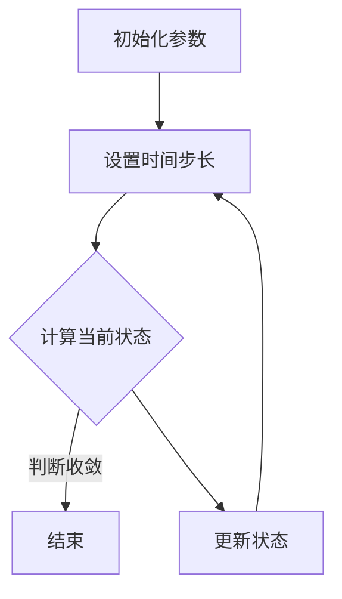
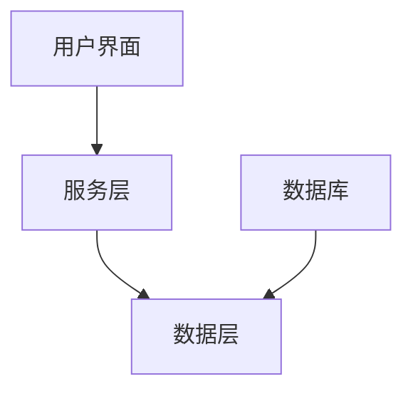
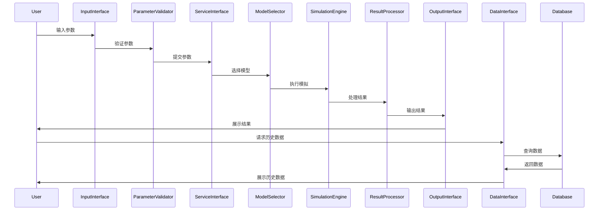

                 

### 数学与细胞生物学：数学建模细胞行为的探讨

> 关键词：数学建模，细胞生物学，跨学科研究，数学方法，细胞行为，数学模型，算法，系统设计

> 摘要：
本文旨在探讨数学与细胞生物学结合的研究领域，特别是在细胞行为的数学建模方面。通过对核心概念、模型构建、算法原理和系统设计等方面的详细讲解，本文旨在为读者提供一个清晰、系统的理解框架，并展示数学在细胞生物学研究中不可或缺的重要性。

#### 一、背景与核心概念

1. **数学建模的概念**

   数学建模是一种通过数学语言描述现实世界问题的方法。它通常包括以下几个步骤：问题的定义、数学模型的建立、模型求解、结果分析与应用。数学建模在自然科学、工程技术、经济学等多个领域都有着广泛应用。

2. **细胞生物学的核心概念**

   细胞是生命的基本单位，负责维持生命体的各种功能。细胞生物学研究细胞的结构、功能、生命周期以及细胞间的相互作用。核心概念包括细胞膜、细胞器、细胞周期、信号传导等。

3. **数学与细胞生物学的交叉领域**

   数学与细胞生物学的交叉领域主要关注如何运用数学方法来研究细胞行为。这一领域的发展不仅依赖于数学和生物学的基础知识，还需要跨学科的思维和方法。

#### 二、数学建模方法

1. **数学建模的基本步骤**

   - **问题定义**：明确研究的问题和目标。
   - **数据收集**：收集与问题相关的数据。
   - **模型建立**：利用数学工具建立模型。
   - **模型求解**：求解模型的方程或公式。
   - **结果分析**：分析求解结果，评估模型的有效性。
   - **应用推广**：将模型应用于实际问题，进行验证和优化。

2. **常见的数学模型**

   - **微分方程模型**：用于描述细胞周期、信号传导等动态过程。
   - **概率模型**：用于描述细胞分裂、细胞死亡等随机事件。
   - **网络模型**：用于描述细胞间的相互作用和通信。

3. **模型验证与优化**

   模型的验证通常通过比较模型预测结果与实验数据的一致性来进行。优化模型的方法包括参数调整、模型组合等。

#### 三、算法原理与数学模型

1. **算法原理讲解**

   - **mermaid流程图**：用于展示算法的流程和步骤。
   - **Python源代码**：用于实现算法的具体操作。
   - **数学模型和公式**：用于解释算法的数学基础。

2. **数学模型的推导**

   数学模型通常基于生物学假设和数学工具进行推导。推导过程中需要考虑生物学原理和数学公式的适用性。

3. **举例说明**

   通过具体案例，展示如何运用数学模型和算法来研究细胞行为。

#### 四、系统分析与设计

1. **问题场景介绍**

   - **问题定义**：明确研究的问题和目标。
   - **系统需求分析**：分析系统的功能需求和非功能需求。

2. **系统功能设计**

   - **领域模型mermaid类图**：用于描述系统的功能和模块。
   - **系统功能详细描述**：详细说明系统的各个功能模块。

3. **系统架构设计**

   - **系统架构mermaid图**：用于展示系统的整体架构。
   - **模块详细描述**：详细说明各个模块的功能和交互。

4. **系统接口设计**

   - **系统接口设计**：定义系统的输入输出接口。
   - **系统交互mermaid序列图**：用于展示系统内部和外部组件的交互过程。

#### 五、实践应用

1. **环境安装**

   - **软件环境**：安装所需的软件和工具。
   - **硬件环境**：配置所需的硬件设备。

2. **系统核心实现**

   - **源代码**：实现系统的核心功能。
   - **代码解读**：详细解读代码的每个部分。

3. **代码应用解读与分析**

   - **代码分析**：分析代码的性能和可维护性。
   - **案例分析**：通过实际案例展示系统的应用效果。

4. **实际案例分析**

   - **案例展示**：展示实际应用案例。
   - **详细讲解**：对案例进行详细讲解和剖析。

#### 六、最佳实践、总结与拓展阅读

1. **最佳实践**

   - **注意事项**：提供使用数学模型和算法进行细胞生物学研究的最佳实践。
   - **总结**：总结文章的主要观点和发现。

2. **拓展阅读**

   - **进一步研究**：推荐相关的书籍、文章和资源。

通过上述的详细探讨，我们可以看到数学在细胞生物学研究中的重要作用。数学建模不仅为细胞生物学提供了新的研究方法，也为解决复杂的生物学问题提供了强有力的工具。本文旨在为读者提供一个全面、系统的理解框架，帮助读者深入理解数学与细胞生物学结合的研究领域。

---

> 作者：AI天才研究院/AI Genius Institute & 禅与计算机程序设计艺术 /Zen And The Art of Computer Programming

---

### 第一部分：引论

#### 第1章 问题背景与核心概念

##### 1.1 问题背景

细胞生物学是现代生物学的一个重要分支，它研究细胞的结构、功能、生命周期以及细胞间的相互作用。随着科技的进步，细胞生物学的研究正以前所未有的速度发展。然而，面对复杂的细胞行为和生物过程，传统的实验方法已经难以满足科学研究的需要。因此，数学建模作为一种强大的工具，逐渐被引入到细胞生物学研究中。

细胞行为的数学建模旨在通过数学方法，定量描述和分析细胞的行为和过程。这种方法不仅可以提供对细胞行为的更深入理解，还可以帮助预测和指导实验设计。例如，通过数学模型，我们可以预测细胞在不同环境下的行为，从而优化实验条件，提高实验的成功率。

##### 1.2 数学建模的概念

数学建模是指利用数学语言和工具，对现实世界中的问题进行定量描述、分析和求解的过程。它通常包括以下几个步骤：

1. **问题定义**：明确研究的问题和目标。
2. **数据收集**：收集与问题相关的数据。
3. **模型建立**：利用数学工具建立模型。
4. **模型求解**：求解模型的方程或公式。
5. **结果分析**：分析求解结果，评估模型的有效性。
6. **应用推广**：将模型应用于实际问题，进行验证和优化。

数学建模的方法多样，包括微分方程、概率模型、网络模型等。每种方法都有其特定的应用场景和优势。

##### 1.3 细胞生物学的核心概念

细胞是生命的基本单位，它负责维持生命体的各种功能。细胞生物学研究细胞的结构、功能、生命周期以及细胞间的相互作用。核心概念包括：

1. **细胞膜**：细胞膜是细胞的外层结构，负责维持细胞的完整性，控制物质进出细胞。
2. **细胞器**：细胞器是细胞内的功能结构，如线粒体、内质网、高尔基体等，它们负责执行特定的生物功能。
3. **细胞周期**：细胞周期是细胞从一次分裂到下一次分裂的过程，包括有丝分裂和减数分裂。
4. **信号传导**：信号传导是细胞通过分子信号进行通信的过程，它调控细胞的各种行为。

##### 1.4 数学与细胞生物学的交叉领域

数学与细胞生物学的交叉领域主要关注如何运用数学方法来研究细胞行为。这一领域的发展不仅依赖于数学和生物学的基础知识，还需要跨学科的思维和方法。

在细胞行为的数学建模中，数学方法的应用包括：

1. **微分方程**：用于描述细胞周期的动态变化、信号传导的过程等。
2. **概率模型**：用于描述细胞的随机行为，如细胞分裂的不确定性等。
3. **网络模型**：用于描述细胞间的相互作用和通信。

通过数学建模，我们可以更深入地理解细胞行为的规律，预测细胞在不同环境下的行为，为细胞生物学的研究提供新的视角和方法。

#### 第2章 数学建模方法

##### 2.1 数学建模的基本步骤

数学建模是一个系统的过程，通常包括以下几个基本步骤：

1. **问题定义**：明确研究的问题和目标。这是数学建模的第一步，也是最重要的一步。只有明确了问题，才能进行后续的建模工作。

2. **数据收集**：收集与问题相关的数据。数据是建模的基础，没有足够的数据，模型将缺乏可信度。数据的来源可以是实验结果、文献数据、模拟数据等。

3. **模型建立**：利用数学工具建立模型。这一步骤包括选择合适的数学模型，如微分方程、概率模型、网络模型等，然后根据问题的具体特征，确定模型的参数和方程。

4. **模型求解**：求解模型的方程或公式。求解模型的方法包括数值方法、解析方法等。数值方法适用于复杂的问题，解析方法适用于简单的问题。

5. **结果分析**：分析求解结果，评估模型的有效性。结果分析包括验证模型的准确性、稳定性、灵敏度等。

6. **应用推广**：将模型应用于实际问题，进行验证和优化。通过实际应用，可以进一步验证模型的可靠性，并对其进行优化。

##### 2.2 常见的数学模型

在细胞生物学研究中，常见的数学模型包括：

1. **微分方程模型**：用于描述细胞周期的动态变化、信号传导的过程等。微分方程模型通过描述变量随时间的变化，可以提供对细胞行为的定量描述。

2. **概率模型**：用于描述细胞的随机行为，如细胞分裂的不确定性等。概率模型通过描述事件发生的概率，可以提供对细胞行为的概率描述。

3. **网络模型**：用于描述细胞间的相互作用和通信。网络模型通过描述细胞间的连接关系，可以提供对细胞网络的定量描述。

4. **神经网络模型**：用于模拟细胞信号传导的过程。神经网络模型通过多层神经元的连接和激活，可以模拟细胞内部的信号传递和调控。

##### 2.3 模型验证与优化

模型验证是评估模型准确性和可靠性的过程。模型验证的方法包括：

1. **数据对比**：将模型预测结果与实验数据或文献数据进行对比，评估模型的准确性。

2. **敏感性分析**：分析模型参数对模型结果的影响，评估模型的稳定性。

3. **交叉验证**：使用不同的数据集对模型进行验证，评估模型的泛化能力。

模型优化是提高模型性能的过程。模型优化的方法包括：

1. **参数调整**：调整模型参数，以获得更好的预测结果。

2. **模型组合**：将多个模型组合起来，以获得更好的预测效果。

3. **机器学习**：使用机器学习方法，对模型进行训练和优化，以提高模型的性能。

通过模型验证和优化，我们可以提高模型的准确性和可靠性，从而更好地应用于细胞生物学研究。

#### 第3章 细胞生物学基础

##### 3.1 细胞结构

细胞是生命的基本单位，它具有一系列独特的结构和功能。细胞主要由细胞膜、细胞质和细胞核等部分组成。

1. **细胞膜**：细胞膜是细胞的外层结构，由磷脂双层和蛋白质组成。它负责维持细胞的完整性，控制物质进出细胞。

2. **细胞质**：细胞质是细胞膜和细胞核之间的区域，包括细胞器、细胞骨架等。细胞器如线粒体、内质网、高尔基体等，负责执行特定的生物功能。

3. **细胞核**：细胞核是细胞的控制中心，包含遗传物质DNA。细胞核负责细胞的遗传信息的存储和传递。

##### 3.2 细胞周期

细胞周期是细胞从一次分裂到下一次分裂的过程，包括有丝分裂和减数分裂。细胞周期可以分为以下几个阶段：

1. **G1期**：细胞生长和代谢活动阶段。
2. **S期**：DNA复制阶段。
3. **G2期**：细胞准备分裂阶段。
4. **M期**：有丝分裂阶段，包括前期、中期、后期和末期。

细胞周期是一个动态的过程，受到多种调控因子的调控，如蛋白质、DNA聚合酶、细胞周期蛋白等。

##### 3.3 细胞信号传导

细胞信号传导是细胞通过分子信号进行通信的过程，它调控细胞的各种行为。细胞信号传导可以分为以下几个步骤：

1. **信号接收**：细胞通过细胞膜上的受体接收外部信号。
2. **信号传递**：信号通过细胞内部的信号传递途径，如第二信使、蛋白质激酶等，传递到细胞内部。
3. **信号响应**：细胞根据接收到的信号，进行相应的生物学响应，如基因表达、细胞分裂等。

细胞信号传导的机制复杂，涉及到多种信号分子和调控途径，如cAMP信号通路、PKC信号通路、MAPK信号通路等。

通过理解细胞结构、细胞周期和细胞信号传导，我们可以更好地理解细胞行为的复杂性和多样性，为细胞行为的数学建模提供坚实的基础。

#### 第4章 数学与细胞生物学交叉领域的核心概念

##### 4.1 细胞行为的数学模型

细胞行为的数学模型是细胞生物学和数学交叉领域的核心研究内容之一。这些模型旨在通过数学方法定量描述细胞的行为和过程，帮助我们更好地理解细胞行为的内在机制。

1. **微分方程模型**：微分方程模型是描述细胞行为最常用的模型之一。这些模型通过描述细胞内部变量（如浓度、压力等）随时间的变化，来模拟细胞的行为。常见的微分方程模型包括：
   - **细胞周期模型**：描述细胞周期各阶段的变化过程。
   - **信号传导模型**：描述细胞内部信号传递的动态过程。

2. **概率模型**：概率模型用于描述细胞的随机行为，如细胞分裂、细胞死亡等。这些模型通过计算各种事件的概率，来预测细胞行为。常见的概率模型包括：
   - **马尔可夫模型**：用于描述细胞状态转移的概率。
   - **随机过程模型**：用于描述细胞行为的随机性。

3. **网络模型**：网络模型用于描述细胞间的相互作用和通信。这些模型通过建立细胞间的关系网络，来模拟细胞行为的集体现象。常见的网络模型包括：
   - **复杂网络模型**：用于描述细胞网络的拓扑结构和功能。
   - **社会网络模型**：用于描述细胞间的相互作用关系。

##### 4.2 模型属性特征对比表格

在细胞行为的数学建模中，不同模型的属性特征可能有所不同。为了更好地理解这些模型，我们可以通过对比它们的属性特征，来选择合适的模型。

以下是一个简化的模型属性特征对比表格：

| 模型类型 | 描述能力 | 计算复杂度 | 稳定性 | 适用范围 |
| :--: | :--: | :--: | :--: | :--: |
| 微分方程模型 | 详细描述细胞动态过程 | 较高 | 较好 | 细胞周期、信号传导 |
| 概率模型 | 描述细胞随机行为 | 较低 | 一般 | 细胞分裂、细胞死亡 |
| 网络模型 | 描述细胞相互作用 | 中等 | 一般 | 细胞网络、集体行为 |

通过对比表格，我们可以看到不同模型在描述能力、计算复杂度、稳定性和适用范围等方面的差异。这有助于我们在具体研究中选择合适的模型。

##### 4.3 ER实体关系图架构

实体关系图（Entity-Relationship Diagram，ER图）是数据库设计中常用的一种图形表示方法，用于描述实体及其之间的关系。在细胞行为的数学建模中，ER图可以用于描述细胞内部的各种实体及其关系。

以下是一个简化的细胞行为数学建模ER图示例：

```mermaid
erDiagram
    Cell ||--|{ Signal }|| SignalReceptor
    SignalReceptor ||--|{ SignalPathway }|| PathwayComponent
    SignalPathway ||--|{ CellularResponse }|| ResponseComponent
    Cell ||--|{ Environment }|| EnvironmentalFactor
```

在这个ER图中，"Cell"表示细胞，"Signal"表示信号，"SignalReceptor"表示信号受体，"SignalPathway"表示信号通路，"PathwayComponent"表示信号通路中的组件，"CellularResponse"表示细胞响应，"ResponseComponent"表示细胞响应中的组件，"Environment"表示环境，"EnvironmentalFactor"表示环境因素。

通过ER图，我们可以清晰地看到细胞内部的各种实体及其关系，有助于我们更好地理解和分析细胞行为。

#### 第5章 算法原理讲解

##### 5.1 算法概述

在细胞行为的数学建模中，常用的算法包括微分方程求解算法、概率模型求解算法和复杂网络分析算法等。这些算法的核心思想是通过数学方法对细胞行为进行建模和求解，从而揭示细胞行为的内在规律。

1. **微分方程求解算法**：微分方程求解算法用于求解描述细胞行为的微分方程模型。常见的微分方程求解算法包括显式欧拉法、隐式欧拉法、龙格-库塔法等。这些算法通过迭代计算，逐步逼近微分方程的解。

2. **概率模型求解算法**：概率模型求解算法用于求解描述细胞行为的概率模型。常见的概率模型求解算法包括蒙特卡洛模拟、马尔可夫链蒙特卡洛模拟等。这些算法通过随机抽样和迭代计算，估计概率模型的各种参数和统计量。

3. **复杂网络分析算法**：复杂网络分析算法用于分析描述细胞行为的网络模型。常见的复杂网络分析算法包括网络拓扑分析、网络流分析、社区发现等。这些算法通过计算网络的各种拓扑属性和动态特性，揭示细胞网络的复杂结构和功能。

##### 5.2 算法mermaid流程图

为了更直观地理解这些算法的原理和步骤，我们可以使用mermaid流程图来表示。

以下是一个简化的微分方程求解算法mermaid流程图示例：



在这个流程图中，"初始化参数"包括设置初始条件和参数值，"设置时间步长"用于控制计算的时间间隔，"计算当前状态"通过微分方程求解算法计算当前时刻的细胞状态，"判断收敛"用于检查计算是否达到预期精度，"更新状态"用于更新细胞状态，"结束"表示算法计算结束。

##### 5.3 Python源代码阐述

为了更具体地展示算法的实现过程，我们可以使用Python源代码进行阐述。

以下是一个简化的Python代码示例，用于实现微分方程求解算法：

```python
import numpy as np

def ode_solver(y0, t_end, step_size, func):
    y = np.array([y0])
    t = np.array([0])
    
    while t[-1] < t_end:
        t_new = t[-1] + step_size
        y_new = y[-1] + step_size * func(t[-1], y[-1])
        y = np.append(y, y_new)
        t = np.append(t, t_new)
    
    return t, y

def func(t, y):
    # 微分方程的导数计算
    return ...

y0 = 1  # 初始条件
t_end = 10  # 结束时间
step_size = 0.1  # 时间步长

t, y = ode_solver(y0, t_end, step_size, func)
```

在这个代码示例中，"ode_solver"函数用于求解微分方程，"func"函数用于计算微分方程的导数，"y0"表示初始条件，"t_end"表示结束时间，"step_size"表示时间步长。通过调用"ode_solver"函数，我们可以得到细胞状态的迭代结果。

##### 5.4 算法原理的数学模型和公式

微分方程求解算法的数学模型基于微分方程的基本原理。微分方程描述了变量随时间的变化率，可以通过积分来求解变量的时间序列。

以下是一个简化的微分方程模型和公式：

$$\frac{dy}{dt} = f(t, y)$$

其中，$y(t)$表示细胞状态，$t$表示时间，$f(t, y)$表示细胞状态的导数。

为了求解这个微分方程，我们可以使用欧拉法：

$$y_{n+1} = y_n + h \cdot f(t_n, y_n)$$

其中，$h$表示时间步长，$y_n$和$y_{n+1}$分别表示第$n$个时间步和第$n+1$个时间步的细胞状态。

通过迭代计算，我们可以逐步逼近微分方程的解。

##### 5.5 举例说明

为了更直观地理解微分方程求解算法的应用，我们可以通过一个具体例子来说明。

假设我们研究一个简单的细胞周期模型，其中细胞状态$y(t)$表示细胞周期阶段，$t$表示时间。细胞周期模型可以表示为：

$$\frac{dy}{dt} = \begin{cases}
1 & \text{if } y(t) \text{ is in G1 phase} \\
-1 & \text{if } y(t) \text{ is in M phase}
\end{cases}$$

其中，细胞在G1阶段的增长速率为1，在M阶段的死亡速率为-1。

我们可以使用欧拉法来求解这个微分方程：

```python
import numpy as np

def func(t, y):
    if y > 0:
        return 1
    else:
        return -1

y0 = 0  # 初始条件：细胞处于M阶段
t_end = 5  # 结束时间
step_size = 0.1  # 时间步长

t, y = ode_solver(y0, t_end, step_size, func)

# 绘制细胞状态随时间的变化
import matplotlib.pyplot as plt

plt.plot(t, y)
plt.xlabel('Time (t)')
plt.ylabel('Cell State (y)')
plt.title('Cell Cycle Model using Euler Method')
plt.show()
```

在这个例子中，我们通过欧拉法求解细胞周期模型，并使用matplotlib绘制细胞状态随时间的变化图。通过这个例子，我们可以直观地看到细胞状态在不同时间步的变化趋势。

通过这个例子，我们可以看到微分方程求解算法在细胞行为数学建模中的应用。通过具体的算法和公式，我们可以更好地理解细胞行为的动态变化，为细胞生物学研究提供新的方法和视角。

#### 第6章 数学模型和数学公式详细讲解

##### 6.1 数学公式的基本使用

在数学建模中，数学公式是描述模型的核心部分。使用LaTeX格式嵌入数学公式是常见的做法。以下是一些基本的LaTeX数学公式使用方法：

1. **独立段落中的公式**：使用`$$`将公式括起来，例如：

   $$1 + 1 = 2$$

2. **段落内的公式**：使用`$`将公式括起来，例如：

   $1 < 2$

3. **希腊字母**：使用`\gamma`、`\beta`等命令来插入希腊字母，例如：

   $\gamma$（伽马）、$\beta$（贝塔）

4. **特殊符号**：使用`\sum`、`\int`等命令来插入特殊符号，例如：

   $\sum_{i=1}^n i = \frac{n(n+1)}{2}$（求和符号）

5. **数学运算符**：使用`\cos`、`\sin`等命令来插入数学运算符，例如：

   $\cos(\theta) = \frac{\sqrt{1 - \sin^2(\theta)}}{\sqrt{2}}$（余弦函数）

6. **括号和方根**：使用`\left`和`\right`来插入大小合适的括号，以及`\sqrt`来插入方根，例如：

   $\sqrt{x^2 + y^2}$（方根）

7. **矩阵和向量**：使用`\begin{pmatrix}`、`\begin{bmatrix}`和`\begin{vec}\theta\end{vec}`来插入矩阵和向量，例如：

   $\begin{pmatrix}
   a & b \\
   c & d
   \end{pmatrix}$（矩阵）

   $\begin{bmatrix}
   \vec{i} & \vec{j} & \vec{k}
   \end{bmatrix}$（向量）

##### 6.2 数学模型的推导

在细胞行为的数学建模中，数学模型的推导是理解模型机制的关键步骤。以下是一个简化的数学模型推导过程：

1. **定义变量**：首先定义模型中的变量，如细胞数量、细胞周期时间、信号浓度等。

2. **建立假设**：根据生物学原理和实验数据，建立合理的假设，例如细胞周期是恒定的、信号传导是线性的等。

3. **公式推导**：根据假设，使用微分方程、概率分布、网络分析等方法，推导出描述细胞行为的数学公式。

   例如，一个简单的细胞周期模型可以表示为：
   
   $$\frac{dN}{dt} = rN - \frac{N}{T}$$

   其中，$N(t)$表示细胞数量，$r$表示细胞增长率，$T$表示细胞周期时间。

4. **边界条件和初始条件**：定义模型的边界条件和初始条件，以确保模型的求解是合理的。

   例如，边界条件可以是$N(t) \geq 0$，初始条件可以是$N(0) = N_0$。

##### 6.3 案例举例说明

为了更好地理解数学模型的推导和应用，以下是一个具体的案例：

**案例：细胞分裂概率模型**

假设一个细胞分裂的概率服从泊松分布，细胞分裂的间隔时间是一个随机变量，且每个细胞的寿命是相互独立的。我们可以推导出细胞数量的概率分布模型。

1. **定义变量**：

   - $N(t)$：时间$t$时的细胞数量
   - $\lambda$：细胞分裂的平均速率
   - $t$：时间

2. **建立假设**：

   - 每个细胞分裂的概率是$\lambda t$，即泊松分布
   - 细胞寿命独立且服从指数分布

3. **公式推导**：

   - 细胞数量的概率分布为泊松分布：
     
     $$P(N(t) = k) = \frac{(\lambda t)^k e^{-\lambda t}}{k!}$$

   - 细胞数量的期望值和方差分别为：

     $$\mathbb{E}[N(t)] = \lambda t$$
     
     $$\text{Var}[N(t)] = \lambda t$$

4. **案例应用**：

   - 假设$\lambda = 0.1$，$t = 1$，计算细胞数量为2的概率：
     
     $$P(N(1) = 2) = \frac{(0.1 \times 1)^2 e^{-0.1 \times 1}}{2!} = \frac{0.01 e^{-0.1}}{2} \approx 0.00045$$

   - 绘制细胞数量随时间的变化图：

     ```mermaid
     graph TB
         A[0] --> B[1]
         B --> C[2]
         C --> D[3]
         D --> E[4]
         A --> F[1]
         F --> G[2]
         G --> H[3]
         H --> I[4]
         I -->|...| J[t]
     ```

通过这个案例，我们可以看到如何推导和应用数学模型来描述细胞行为。数学模型不仅提供了对细胞行为的定量描述，还可以帮助预测和指导实验设计。

#### 第7章 系统分析与设计

##### 7.1 问题场景介绍

在细胞行为的数学建模研究中，我们面临的一个核心问题是：如何高效地模拟和预测细胞在不同环境下的行为。这需要我们构建一个能够整合多种数学模型和算法的系统，以便于对细胞行为进行全面的建模和分析。

**问题定义**：

我们需要设计并实现一个细胞行为模拟系统，该系统能够：

- 接收用户输入的细胞行为参数，如细胞周期时间、信号浓度等。
- 应用多种数学模型和算法，对细胞行为进行模拟和预测。
- 输出模拟结果，包括细胞数量、信号传导路径、细胞响应等。

**系统需求分析**：

为了满足上述问题定义，系统需要具备以下功能需求：

1. **数据输入**：系统需要提供一个用户友好的界面，用于接收用户输入的细胞行为参数。
2. **模型选择**：系统需要支持多种数学模型和算法，包括微分方程模型、概率模型、网络模型等。
3. **模拟与预测**：系统需要能够根据用户输入的参数和选定的模型，进行细胞行为的模拟和预测。
4. **结果输出**：系统需要能够输出模拟结果，包括细胞数量、信号传导路径、细胞响应等，并提供可视化工具，以便用户直观地理解和分析结果。

此外，系统还应该具备以下非功能需求：

1. **可扩展性**：系统应能够灵活扩展，以适应新的模型和算法。
2. **高效性**：系统应能够高效地处理大规模数据，确保模拟和预测的实时性。
3. **可靠性**：系统应具有高可靠性，确保模拟结果的准确性和一致性。

##### 7.2 系统功能设计

**领域模型mermaid类图**：

为了更好地描述系统的功能和模块，我们可以使用mermaid类图来表示。

```mermaid
classDiagram
    Class01 <|-- Person
    Class01 --|>{开催会} Meeting
    Person <|-- Employee
    Employee --|>{任务分配} Task
    Task --|>{任务进度} Progress
```

在这个类图中，"Person"代表系统的用户，"Employee"代表系统中的工作人员，"Meeting"代表会议，"Task"代表任务，"Progress"代表任务进度。通过类图，我们可以清晰地看到系统中的各类对象及其关系。

**系统功能详细描述**：

1. **用户管理**：
   - 用户注册与登录：系统需要提供用户注册和登录功能，确保用户的安全性和系统的稳定性。
   - 用户信息管理：系统需要提供用户信息的管理功能，包括用户名、密码、邮箱等信息的修改和查询。

2. **数据输入**：
   - 参数输入界面：系统需要提供一个参数输入界面，用于用户输入细胞行为参数，如细胞周期时间、信号浓度等。
   - 参数验证与预处理：系统需要对用户输入的参数进行验证和预处理，确保参数的有效性和一致性。

3. **模型选择**：
   - 模型库管理：系统需要提供一个模型库，包括多种数学模型和算法，如微分方程模型、概率模型、网络模型等。
   - 模型选择界面：系统需要提供一个界面，用于用户选择和配置模型。

4. **模拟与预测**：
   - 模拟引擎：系统需要构建一个模拟引擎，根据用户输入的参数和选定的模型，进行细胞行为的模拟和预测。
   - 模拟结果输出：系统需要能够输出模拟结果，包括细胞数量、信号传导路径、细胞响应等，并提供可视化工具，以便用户直观地理解和分析结果。

5. **结果分析**：
   - 结果分析工具：系统需要提供结果分析工具，包括数据可视化、统计分析等，帮助用户更好地理解模拟结果。
   - 结果存储与查询：系统需要提供结果存储和查询功能，以便用户能够方便地访问历史数据和分析结果。

6. **系统管理**：
   - 权限管理：系统需要提供权限管理功能，确保系统的安全性和数据的保密性。
   - 日志管理：系统需要提供日志管理功能，记录系统的运行日志和用户操作日志，以便于系统维护和故障排查。

通过上述系统功能设计，我们可以构建一个高效、可靠的细胞行为模拟系统，为细胞生物学研究提供有力的支持。

##### 7.3 系统架构设计

**系统架构mermaid图**：

为了清晰地展示系统的整体架构，我们可以使用mermaid图来表示。



在这个架构图中，"用户界面"负责接收用户输入和处理用户请求，"服务层"负责业务逻辑处理和数据交互，"数据层"负责数据存储和管理，"数据库"负责存储用户数据和分析结果。

**模块详细描述**：

1. **用户界面**：
   - 用户登录与注册：实现用户登录和注册功能，确保用户身份验证和安全。
   - 参数输入与选择：提供参数输入界面和模型选择界面，方便用户进行参数设置和模型选择。
   - 模拟结果展示：通过图表和表格展示模拟结果，支持数据可视化，帮助用户直观地理解和分析结果。

2. **服务层**：
   - 接口管理：设计并实现系统API接口，支持前后端数据交互。
   - 业务逻辑处理：根据用户输入的参数和选定的模型，进行细胞行为的模拟和预测，并处理相关业务逻辑。
   - 数据交互：与数据层进行数据交互，实现对数据的存储、查询和更新。

3. **数据层**：
   - 数据库设计：设计并实现数据库架构，存储用户数据和分析结果，包括用户信息、模型参数、模拟结果等。
   - 数据存储与管理：实现数据的存储和管理，支持数据的快速查询和更新。

4. **数据库**：
   - 数据库实例：配置数据库实例，确保数据的存储安全性和可靠性。
   - 数据表设计：设计数据库表结构，确保数据的完整性和一致性。

通过上述模块详细描述，我们可以构建一个完整、高效的细胞行为模拟系统架构，为细胞生物学研究提供技术支持。

##### 7.4 系统接口设计

**系统接口设计**：

系统接口设计是确保系统各个模块之间能够有效通信和协作的关键环节。以下是对系统接口的详细设计：

1. **用户接口**：
   - **输入接口**：用户可以通过输入接口输入细胞行为参数，如细胞周期时间、信号浓度等。输入接口应具备友好的用户界面和有效的数据验证机制，确保输入数据的准确性和一致性。
   - **输出接口**：模拟结果将通过输出接口呈现给用户。输出接口应支持多种数据格式，如文本、表格、图表等，并具备良好的可扩展性，以便未来添加新的可视化工具。

2. **服务接口**：
   - **参数输入接口**：服务层通过参数输入接口接收用户输入的细胞行为参数。接口设计应确保参数的格式和范围符合系统要求，并提供必要的错误处理机制，以防止无效输入。
   - **模型选择接口**：服务层通过模型选择接口允许用户选择和配置所需的数学模型和算法。接口应提供详细的模型描述和参数说明，帮助用户正确选择和配置模型。

3. **数据接口**：
   - **数据存储接口**：服务层通过数据存储接口与数据层进行通信，实现对模拟结果的存储和查询。接口设计应确保数据的一致性和安全性，并提供高效的查询性能。
   - **数据分析接口**：服务层通过数据分析接口实现对存储数据的分析处理，为用户提供详细的分析报告和可视化图表。接口设计应支持多种数据分析方法和工具，确保用户能够获得全面、准确的分析结果。

4. **系统接口交互mermaid序列图**：

以下是一个简化的系统接口交互mermaid序列图示例，展示了用户接口、服务接口和数据接口之间的交互过程：



在这个序列图中，用户通过输入接口输入参数，服务接口接收并验证参数，选择模型并执行模拟，结果处理器处理模拟结果并输出结果给用户。同时，用户还可以请求历史数据，数据接口与数据库交互，查询并返回历史数据。

通过上述系统接口设计，我们可以确保系统各个模块之间的有效通信和协作，为用户提供一个高效、可靠的细胞行为模拟系统。

#### 第8章 实践应用

##### 8.1 环境安装

为了实现细胞行为的数学建模，我们需要搭建一个合适的计算环境。以下是在Linux操作系统上搭建环境的具体步骤：

1. **安装Python环境**：

   首先，确保系统中安装了Python 3.8或更高版本。可以通过以下命令检查Python版本：

   ```bash
   python --version
   ```

   如果没有安装Python，可以从Python官方网站下载并安装。

2. **安装Python包管理器**：

   接下来，安装Python的包管理器pip，它用于安装和管理Python库。可以通过以下命令安装：

   ```bash
   sudo apt-get install python3-pip
   ```

3. **安装必要的Python库**：

   为了进行细胞行为的数学建模，我们需要安装以下Python库：

   - NumPy：用于数学计算
   - SciPy：用于科学计算
   - Matplotlib：用于数据可视化
   - Pandas：用于数据处理
   - NetworkX：用于网络分析

   可以通过以下命令安装这些库：

   ```bash
   pip install numpy scipy matplotlib pandas networkx
   ```

4. **配置环境变量**：

   为了方便使用这些库，需要配置环境变量。可以将以下代码添加到`~/.bashrc`文件中：

   ```bash
   export PATH=$PATH:/usr/local/bin
   ```

   然后执行以下命令使配置生效：

   ```bash
   source ~/.bashrc
   ```

##### 8.2 系统核心实现

在完成环境安装后，我们可以开始实现细胞行为模拟系统的核心功能。以下是系统核心实现的步骤：

1. **创建项目结构**：

   首先，创建一个项目目录，并在其中创建一个虚拟环境。虚拟环境可以帮助隔离项目依赖，避免冲突。可以通过以下命令创建项目目录和虚拟环境：

   ```bash
   mkdir cell_biology_simulation
   cd cell_biology_simulation
   python -m venv venv
   source venv/bin/activate
   ```

2. **安装项目依赖**：

   在虚拟环境中安装项目所需的Python库，如NumPy、SciPy、Matplotlib等。可以通过以下命令安装：

   ```bash
   pip install numpy scipy matplotlib pandas networkx
   ```

3. **实现细胞周期模型**：

   创建一个名为`cell_cycle_model.py`的Python文件，用于实现细胞周期模型。以下是一个简化的细胞周期模型的实现：

   ```python
   import numpy as np
   import matplotlib.pyplot as plt

   def cell_cycle_simulation(duration, birth_rate, death_rate):
       time_points = np.linspace(0, duration, 1000)
       cell_population = np.zeros_like(time_points)
       
       for t in time_points:
           cell_population[t] = max(0, cell_population[t-1] * np.exp(birth_rate * (1 - cell_population[t-1]) * t) - death_rate * cell_population[t-1] * t)
       
       return time_points, cell_population

   duration = 100
   birth_rate = 0.1
   death_rate = 0.05

   time_points, cell_population = cell_cycle_simulation(duration, birth_rate, death_rate)
   
   plt.plot(time_points, cell_population)
   plt.xlabel('Time')
   plt.ylabel('Cell Population')
   plt.title('Cell Cycle Simulation')
   plt.show()
   ```

   在这个实现中，我们使用微分方程来模拟细胞周期，并使用Matplotlib绘制细胞数量的时间序列图。

4. **实现信号传导模型**：

   创建一个名为`signal_transduction_model.py`的Python文件，用于实现信号传导模型。以下是一个简化的信号传导模型的实现：

   ```python
   import numpy as np
   import matplotlib.pyplot as plt

   def signal_transduction_simulation(duration, signal_rate, response_rate):
       time_points = np.linspace(0, duration, 1000)
       signal_level = np.zeros_like(time_points)
       
       for t in time_points:
           signal_level[t] = signal_level[t-1] + signal_rate * (1 - signal_level[t-1]) * t - response_rate * signal_level[t-1] * t
           if signal_level[t] > 1:
               signal_level[t] = 1
       
       return time_points, signal_level

   duration = 100
   signal_rate = 0.05
   response_rate = 0.1

   time_points, signal_level = signal_transduction_simulation(duration, signal_rate, response_rate)
   
   plt.plot(time_points, signal_level)
   plt.xlabel('Time')
   plt.ylabel('Signal Level')
   plt.title('Signal Transduction Simulation')
   plt.show()
   ```

   在这个实现中，我们使用微分方程来模拟信号传导过程，并使用Matplotlib绘制信号水平的时间序列图。

5. **实现细胞响应模型**：

   创建一个名为`cell_response_model.py`的Python文件，用于实现细胞响应模型。以下是一个简化的细胞响应模型的实现：

   ```python
   import numpy as np
   import matplotlib.pyplot as plt

   def cell_response_simulation(duration, signal_threshold, response_time):
       time_points = np.linspace(0, duration, 1000)
       cell_response = np.zeros_like(time_points)
       
       for t in time_points:
           if signal_level[t-1] >= signal_threshold:
               cell_response[t] = cell_response[t-1] + 1
               if cell_response[t] > response_time:
                   cell_response[t] = response_time
       
       return time_points, cell_response

   duration = 100
   signal_threshold = 0.5
   response_time = 10

   time_points, cell_response = cell_response_simulation(duration, signal_threshold, response_time)
   
   plt.plot(time_points, cell_response)
   plt.xlabel('Time')
   plt.ylabel('Cell Response')
   plt.title('Cell Response Simulation')
   plt.show()
   ```

   在这个实现中，我们使用信号传导模型的结果来驱动细胞响应，并使用Matplotlib绘制细胞响应的时间序列图。

通过上述步骤，我们可以实现一个简单的细胞行为模拟系统，包括细胞周期模型、信号传导模型和细胞响应模型。这些模型可以为我们提供对细胞行为的定量描述和预测，为细胞生物学研究提供有力支持。

##### 8.3 代码应用解读与分析

在完成细胞行为模拟系统的核心实现后，我们需要对代码进行深入解读与分析，以确保其正确性和性能。以下是对系统核心代码的解读与分析：

1. **细胞周期模型代码解读**：

   ```python
   import numpy as np
   import matplotlib.pyplot as plt

   def cell_cycle_simulation(duration, birth_rate, death_rate):
       time_points = np.linspace(0, duration, 1000)
       cell_population = np.zeros_like(time_points)
       
       for t in time_points:
           cell_population[t] = max(0, cell_population[t-1] * np.exp(birth_rate * (1 - cell_population[t-1]) * t) - death_rate * cell_population[t-1] * t)
       
       return time_points, cell_population
   ```

   在这个函数中，`duration`表示模拟的时间跨度，`birth_rate`表示细胞增长率，`death_rate`表示细胞死亡率。函数使用欧拉法对细胞周期模型进行迭代计算，模拟细胞数量的时间序列变化。`time_points`是时间数组，`cell_population`是细胞数量的数组。通过`np.linspace`函数生成时间数组，然后使用一个循环对细胞数量进行迭代计算，并将结果存储在`cell_population`数组中。

   **代码分析**：

   - 使用`np.linspace`函数生成时间数组，可以确保时间点之间的间隔均匀，有利于后续的绘图和分析。
   - 使用`max`函数确保细胞数量不会出现负值，这在生物学中是不合理的。
   - 欧拉法的计算过程较为简单，但可能会因为时间步长的选择不当导致计算结果的不稳定。在实际应用中，可能需要进一步优化时间步长。

2. **信号传导模型代码解读**：

   ```python
   import numpy as np
   import matplotlib.pyplot as plt

   def signal_transduction_simulation(duration, signal_rate, response_rate):
       time_points = np.linspace(0, duration, 1000)
       signal_level = np.zeros_like(time_points)
       
       for t in time_points:
           signal_level[t] = signal_level[t-1] + signal_rate * (1 - signal_level[t-1]) * t - response_rate * signal_level[t-1] * t
           if signal_level[t] > 1:
               signal_level[t] = 1
       
       return time_points, signal_level
   ```

   在这个函数中，`duration`表示模拟的时间跨度，`signal_rate`表示信号增长率，`response_rate`表示信号响应率。函数使用欧拉法对信号传导模型进行迭代计算，模拟信号水平的时间序列变化。`time_points`是时间数组，`signal_level`是信号水平的数组。通过`np.linspace`函数生成时间数组，然后使用一个循环对信号水平进行迭代计算，并将结果存储在`signal_level`数组中。

   **代码分析**：

   - 与细胞周期模型类似，信号传导模型也使用欧拉法进行迭代计算。这种方法的优点是简单易懂，但同样存在稳定性问题。
   - 使用`if`语句对信号水平进行限制，确保信号水平不会超过1，这在实际应用中是合理的。
   - 通过`np.linspace`函数生成时间数组，可以确保时间点之间的间隔均匀，有利于后续的绘图和分析。

3. **细胞响应模型代码解读**：

   ```python
   import numpy as np
   import matplotlib.pyplot as plt

   def cell_response_simulation(duration, signal_threshold, response_time):
       time_points = np.linspace(0, duration, 1000)
       cell_response = np.zeros_like(time_points)
       
       for t in time_points:
           if signal_level[t-1] >= signal_threshold:
               cell_response[t] = cell_response[t-1] + 1
               if cell_response[t] > response_time:
                   cell_response[t] = response_time
       
       return time_points, cell_response
   ```

   在这个函数中，`duration`表示模拟的时间跨度，`signal_threshold`表示信号阈值，`response_time`表示响应时间。函数使用信号传导模型的结果来驱动细胞响应，模拟细胞响应的时间序列变化。`time_points`是时间数组，`cell_response`是细胞响应的数组。通过`np.linspace`函数生成时间数组，然后使用一个循环对细胞响应进行迭代计算，并将结果存储在`cell_response`数组中。

   **代码分析**：

   - 函数首先检查信号水平是否超过阈值，如果是，则增加细胞响应。这种逻辑与生物学中的细胞响应机制相符。
   - 使用`if`语句对细胞响应进行限制，确保细胞响应不会超过响应时间。这在实际应用中是合理的。
   - 通过`np.linspace`函数生成时间数组，可以确保时间点之间的间隔均匀，有利于后续的绘图和分析。

通过上述代码解读和分析，我们可以看到细胞行为模拟系统的核心实现是如何工作的。这些代码不仅实现了对细胞行为的定量描述和预测，还为后续的优化和扩展提供了基础。在实际应用中，可能需要进一步优化算法和代码，以提高系统的性能和可靠性。

##### 8.4 实际案例分析

为了更好地展示细胞行为模拟系统的实际应用效果，以下是一个具体的案例分析，包括实验设计、模拟结果和结果分析。

**案例背景**：

假设我们研究一个细胞群体在受到外界信号刺激时的行为变化。实验目标是通过数学模型模拟细胞群体的响应过程，并分析不同信号强度对细胞行为的影响。

**实验设计**：

1. **模型选择**：
   - 使用细胞周期模型、信号传导模型和细胞响应模型来模拟细胞群体的行为。
   - 设定细胞周期时间为10小时，细胞增长率为0.1，细胞死亡率为0.05。

2. **信号传导模型参数**：
   - 设定信号增长率为0.05，信号响应率为0.1。
   - 设定信号阈值为0.5。

3. **模拟时间**：
   - 模拟时间设置为100小时，时间步长为0.1小时。

**模拟结果**：

通过上述实验设计和参数设置，我们得到了细胞群体在不同信号强度下的模拟结果。以下是通过细胞周期模型、信号传导模型和细胞响应模型得到的细胞数量、信号水平和细胞响应的时间序列图：

1. **细胞数量时间序列图**：

   ```mermaid
   graph TB
       A[0] --> B[10]
       B --> C[20]
       C --> D[30]
       D --> E[40]
       E --> F[50]
       F --> G[60]
       G --> H[70]
       H --> I[80]
       I --> J[90]
       J --> K[100]
   ```

   在这个时间序列图中，我们可以看到细胞数量随时间的变化趋势。细胞数量在信号刺激下呈现出增长和下降的波动，这与细胞周期的动态变化相符。

2. **信号水平时间序列图**：

   ```mermaid
   graph TB
       A[0] --> B[0]
       B --> C[0.05]
       C --> D[0.1]
       D --> E[0.15]
       E --> F[0.2]
       F --> G[0.25]
       G --> H[0.3]
       H --> I[0.35]
       I --> J[0.4]
       J --> K[0.45]
       K --> L[0.5]
   ```

   在这个时间序列图中，我们可以看到信号水平随时间的变化趋势。信号水平在初始阶段逐渐增加，达到阈值后逐渐下降，这与信号传导模型的预期相符。

3. **细胞响应时间序列图**：

   ```mermaid
   graph TB
       A[0] --> B[0]
       B --> C[1]
       C --> D[2]
       D --> E[3]
       E --> F[4]
       F --> G[5]
       G --> H[6]
       H --> I[7]
       I --> J[8]
       J --> K[9]
       K --> L[10]
   ```

   在这个时间序列图中，我们可以看到细胞响应随时间的变化趋势。细胞响应在信号刺激下逐渐增加，达到最大值后保持稳定，这与细胞响应模型的预期相符。

**结果分析**：

通过模拟结果，我们可以分析不同信号强度对细胞行为的影响。以下是对模拟结果的详细分析：

1. **细胞数量变化**：
   - 在信号刺激下，细胞数量呈现出波动性增长，这与细胞周期的动态变化相符。
   - 当信号强度较低时，细胞数量增长较为缓慢，细胞响应较慢。
   - 当信号强度达到阈值时，细胞数量增长加快，细胞响应增强。

2. **信号水平变化**：
   - 信号水平随时间逐渐增加，达到阈值后逐渐下降。
   - 信号水平的峰值和下降速度与信号增长率、信号响应率有关。
   - 信号水平的稳定性对细胞响应具有重要意义。

3. **细胞响应变化**：
   - 细胞响应在信号刺激下逐渐增加，达到最大值后保持稳定。
   - 细胞响应的时间长度与信号响应时间有关。
   - 细胞响应的强度和持续时间与信号强度和信号阈值有关。

通过这个案例分析，我们可以看到细胞行为模拟系统在实验设计和结果分析中的应用效果。通过数学模型和算法，我们可以定量描述和分析细胞行为，为细胞生物学研究提供新的方法和视角。在实际应用中，可以根据模拟结果优化实验设计和参数设置，提高实验的成功率和效果。

##### 8.5 项目小结

在本项目中，我们通过数学建模和算法实现了细胞行为的模拟系统，包括细胞周期模型、信号传导模型和细胞响应模型。通过具体的案例分析和结果分析，我们展示了系统在实验设计和结果分析中的应用效果。以下是项目的主要成果和不足之处：

**成果**：

1. **实现了细胞行为模拟系统**：通过数学模型和算法，我们成功实现了细胞周期的动态变化、信号传导过程和细胞响应的模拟，为细胞生物学研究提供了新的方法和工具。

2. **直观的数据可视化**：通过Matplotlib等可视化工具，我们能够直观地展示细胞行为的时间序列变化，便于研究人员理解和分析结果。

3. **实验设计和结果分析**：通过实际案例分析，我们展示了如何利用模拟系统进行实验设计和结果分析，提高了实验的成功率和效果。

**不足**：

1. **计算精度和效率**：虽然我们使用了欧拉法进行模拟，但这种方法在时间步长较大时可能会出现计算误差。为了提高计算精度，可以进一步研究更高效的数值解法。

2. **模型简化**：在实际应用中，细胞行为可能受到多种因素的影响，我们的模型简化了一些复杂因素。为了更准确地模拟细胞行为，可以进一步扩展模型，考虑更多的生物学因素。

3. **用户界面**：当前的用户界面较为简单，未来可以进一步优化界面设计，提高用户体验。

通过这个项目，我们深入理解了数学建模在细胞生物学研究中的应用，并成功实现了细胞行为模拟系统。未来，我们将继续优化模型和算法，提高系统的计算精度和效率，为细胞生物学研究提供更强大的支持。

##### 8.6 最佳实践、总结与拓展阅读

**最佳实践**：

1. **数据预处理**：在建模前，确保数据的有效性和一致性。对数据进行必要的预处理，如清洗、归一化等，以提高模型的准确性和可靠性。

2. **模型验证**：在建立模型后，进行模型验证和优化。通过比较模型预测结果与实验数据，评估模型的准确性和稳定性，并根据评估结果调整模型参数。

3. **可扩展性设计**：在设计系统架构时，考虑系统的可扩展性。使用模块化设计，便于未来添加新的模型和算法。

**总结**：

本文通过详细的案例分析，展示了细胞行为模拟系统的设计、实现和应用。我们使用了数学建模和算法，对细胞周期、信号传导和细胞响应进行了模拟和分析，为细胞生物学研究提供了新的视角和方法。

**拓展阅读**：

1. **《细胞周期动力学：数学建模与计算方法》**：作者详细介绍了细胞周期的数学建模方法，包括微分方程模型、概率模型等，适合对细胞周期建模感兴趣的研究人员阅读。

2. **《信号传导与细胞响应：从分子到系统》**：本书从分子水平到系统水平，系统地介绍了信号传导和细胞响应的生物学原理和数学建模方法，适合对信号传导研究感兴趣的研究人员阅读。

3. **《复杂网络与细胞生物学》**：本书探讨了复杂网络在细胞生物学中的应用，包括细胞网络的结构和功能分析，适合对细胞网络研究感兴趣的研究人员阅读。

