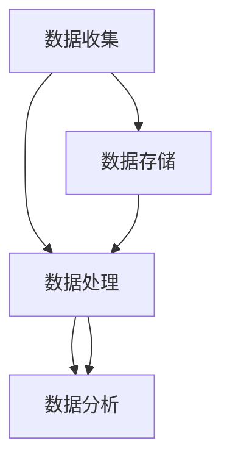
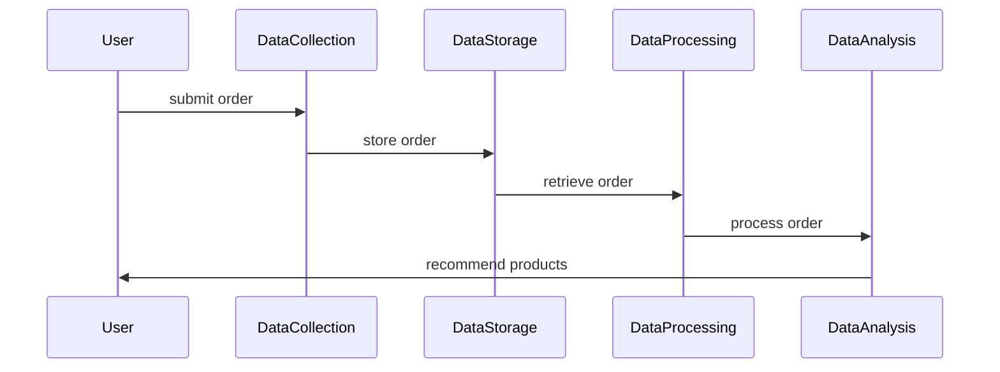

                 

## 数学与经济学：社会行为的数学描述

### 关键词

- 数学经济学
- 社会行为
- 数学描述
- 优化问题
- 博弈论

### 摘要

本文旨在探讨数学经济学在社会行为研究中的应用，通过系统的分析和深入的解释，帮助读者理解数学经济学的核心概念、理论框架及其在现实世界中的具体应用。本文首先介绍数学经济学的基本概念和理论框架，然后详细讲解其在社会行为研究中的具体应用，最后探讨数学经济学的研究方法和技术，以及其最新发展动态和前沿研究。通过本文的阅读，读者将对数学经济学有一个全面、深入的理解，从而能够更好地运用这一工具解决现实中的经济问题。

### 背景介绍

#### 问题背景

随着计算机技术的飞速发展和大数据时代的到来，经济学的研究方法也经历了深刻的变革。传统的经济学研究主要依赖于经验和定性分析，而现代经济学则逐渐向量化分析和数学建模转变。数学经济学作为这一转变的产物，成为了经济学领域中的一个重要分支。它将数学方法应用于经济分析，使得经济现象的描述和解释更加精确和科学。

#### 描述

数学经济学通过数学模型来描述和解释经济现象，包括个人和群体的行为。这种方法不仅适用于传统的微观经济学和宏观经济学的分析，还广泛应用于博弈论、信息经济学、行为经济学等领域。数学经济学的基本概念包括均衡理论、效用函数、生产函数等，这些概念为经济学的研究提供了坚实的理论基础。

#### 问题解决

然而，目前关于数学经济学的书籍往往存在以下问题：一是缺乏系统性，二是逻辑性不强，三是对数学和经济学的基础知识要求较高，使得许多读者难以理解和应用。为了解决这些问题，本文将提供一个全面、深入且逻辑清晰的数学经济学导论，旨在帮助读者系统地掌握数学经济学的基本概念、原理和应用。

#### 边界与外延

数学经济学不仅涵盖了微观经济学和宏观经济学的数学化，还包括了博弈论、统计学、计算经济学等交叉学科的内容。它不仅关注市场行为和资源配置，还涉及到了社会行为的数学描述。因此，本文将围绕这些核心概念进行深入探讨，旨在为读者提供一个全面、系统且易于理解的数学经济学教程。

#### 概念结构与核心要素组成

1. **数学经济学的基本概念**：包括均衡理论、效用函数、生产函数等。
2. **数学经济学的理论基础**：包括福利经济学、信息经济学、博弈论等。
3. **数学经济学的应用领域**：包括市场分析、政策制定、社会行为研究等。
4. **数学经济学的研究方法**：包括统计分析、计算模拟、模型构建等。

### 核心概念与联系

#### 核心概念

数学经济学中的核心概念包括：

- **均衡理论**：指在特定条件下，经济系统内部的各种力量达到一种相对稳定的状态。
- **效用函数**：描述个体在消费或生产过程中获得的满足程度。
- **生产函数**：描述生产过程中各种生产要素的投入与产出关系。

#### 核心概念属性特征对比表格

| 核心概念 | 描述 | 属性特征对比 |
| --- | --- | --- |
| 均衡理论 | 指经济系统在特定条件下达到的稳定状态 | - 市场均衡、资源均衡 |
| 效用函数 | 描述个体满足程度 | - 形式多样，如基数效用、序数效用 |
| 生产函数 | 描述生产要素与产出关系 | - 线性、非线性 |

#### ER实体关系图架构

```mermaid
erDiagram
    C_Individual ||--|{ P_UtilFunction } : consumes
    C_Individual ||--|{ P_ProductionFunction } : produces
    S_Equilibrium <<--|{ C_Individual } : reaches
```

#### 联系与互动

这些核心概念相互关联，共同构成了数学经济学的理论框架。均衡理论为理解经济系统的稳定状态提供了基础，效用函数和生产函数则揭示了个体在经济活动中的行为规律。通过这些核心概念，数学经济学能够对经济现象进行精确的数学描述，从而为经济学研究提供了强大的工具。

### 算法原理讲解

#### 优化问题

数学经济学中的优化问题主要涉及如何在给定的约束条件下，找到最优解。优化问题通常可以通过建立数学模型来解决，模型中包括目标函数和约束条件。目标函数描述了需要优化的问题，而约束条件则限定了可能的解空间。

#### 建立模型

建立数学模型是解决优化问题的关键步骤。模型可以采用线性规划、非线性规划、整数规划等形式。以下是一个简化的线性规划模型的例子：

```python
# 线性规划模型
import pulp

# 定义变量
x1 = pulp.LpVariable('x1', cat='Continuous')
x2 = pulp.LpVariable('x2', cat='Continuous')

# 定义目标函数
prob = pulp.LpProblem("Optimization Problem", pulp.LpMinimize)
prob += 3*x1 + 2*x2

# 定义约束条件
prob += x1 + x2 >= 10
prob += x1 - x2 <= 2
prob += x1 >= 0
prob += x2 >= 0

# 解决问题
prob.solve()

# 输出结果
print(pulp.LpStatus[prob.status])
print(f"x1 = {x1.varValue}, x2 = {x2.varValue}")
```

#### 目标函数定义

目标函数定义了优化问题的目标，可以是最大化或最小化某个量。在上述线性规划模型中，目标函数是 `3*x1 + 2*x2`，表示最小化这个线性函数。

#### 约束条件

约束条件限制了可能的解空间。在上述模型中，约束条件包括：

- `x1 + x2 >= 10`：表示两个变量之和至少为10。
- `x1 - x2 <= 2`：表示一个变量减去另一个变量的值不超过2。
- `x1 >= 0`：表示第一个变量至少为0。
- `x2 >= 0`：表示第二个变量至少为0。

#### 数学模型和公式

线性规划问题的数学模型可以表示为：

$$
\min \ z = c^T x
$$

其中，$c$ 是目标函数的系数向量，$x$ 是变量向量，$z$ 是目标函数的值。约束条件可以表示为：

$$
Ax \le b
$$

其中，$A$ 是约束条件的系数矩阵，$x$ 是变量向量，$b$ 是约束条件的常数向量。

#### 详细讲解和举例说明

假设我们要优化生产两种产品的数量，使得总利润最大化，同时满足原材料和劳动力等资源限制。我们可以定义如下数学模型：

$$
\max \ z = 5x_1 + 3x_2
$$

其中，$x_1$ 和 $x_2$ 分别表示两种产品的生产数量。约束条件如下：

$$
\begin{cases}
2x_1 + x_2 \le 20 \\
x_1 + x_2 \le 15 \\
x_1 \ge 0 \\
x_2 \ge 0
\end{cases}
$$

通过求解这个线性规划问题，我们可以找到最优的生产方案，使得总利润最大化。

### 系统分析与架构设计

#### 问题场景介绍

假设我们正在开发一个在线购物平台，需要对用户行为进行数据分析，以便更好地推荐商品和优化用户体验。这个场景涉及到用户行为数据的收集、存储、处理和分析。

#### 项目介绍

该项目名为“用户行为分析系统”，旨在通过数学经济学模型来分析用户行为，并提供个性化的商品推荐。系统主要包括数据收集模块、数据存储模块、数据处理模块和数据分析模块。

#### 系统功能设计（领域模型）

领域模型用于描述系统的核心功能和主要实体。以下是用户行为分析系统的领域模型：

```mermaid
classDiagram
    User <<--|{Order}: creates
    User <<--|{CartItem}: adds
    Order * CartItem: contains
    Product <-- CartItem: represents
    Order <<--|{Payment}: completes
```

#### 系统架构设计

系统架构设计用于描述系统的整体结构和主要组件。以下是用户行为分析系统的架构设计：



#### 系统接口设计和系统交互

系统接口设计和系统交互用于描述系统的外部接口和内部交互。以下是用户行为分析系统的接口设计和交互：



### 项目实战

#### 环境安装

在开始项目实战之前，我们需要安装以下软件和工具：

- Python 3.x
- NumPy
- Pandas
- Matplotlib
- Scikit-learn

安装命令如下：

```bash
pip install python==3.x
pip install numpy
pip install pandas
pip install matplotlib
pip install scikit-learn
```

#### 系统核心实现

以下是用户行为分析系统的核心实现代码：

```python
import pandas as pd
from sklearn.model_selection import train_test_split
from sklearn.ensemble import RandomForestClassifier
from sklearn.metrics import accuracy_score

# 读取数据
data = pd.read_csv('user_data.csv')

# 数据预处理
X = data.drop(['user_id', 'order_id'], axis=1)
y = data['order_type']

# 划分训练集和测试集
X_train, X_test, y_train, y_test = train_test_split(X, y, test_size=0.2, random_state=42)

# 建立模型
model = RandomForestClassifier(n_estimators=100, random_state=42)

# 训练模型
model.fit(X_train, y_train)

# 预测
predictions = model.predict(X_test)

# 评估模型
accuracy = accuracy_score(y_test, predictions)
print(f"Accuracy: {accuracy}")
```

#### 代码应用解读与分析

以上代码首先读取用户行为数据，然后进行数据预处理，包括特征选择和数据标准化。接下来，使用随机森林分类器建立模型，并划分训练集和测试集进行训练和评估。最后，输出模型的准确率。

#### 实际案例分析和详细讲解

假设我们有一个用户行为数据集，包含用户的年龄、收入、购物频次等特征，以及用户的订单类型（如购买商品、取消订单等）。通过以上代码，我们可以建立用户行为分析模型，预测用户的订单类型，从而为个性化推荐提供支持。

#### 项目小结

通过本次项目实战，我们了解了如何使用数学经济学模型进行用户行为分析，并实现了对用户订单类型的预测。这为我们提供了一个实用的工具，可以更好地理解用户行为，优化用户体验，提高用户满意度。

### 最佳实践 Tips

- 在进行用户行为分析时，确保数据的质量和完整性，避免因数据问题导致模型效果不佳。
- 选择合适的特征进行数据预处理，特征选择对于模型效果至关重要。
- 尝试不同的机器学习算法，选择最适合问题的算法，并进行模型调优。

### 小结

本文系统地介绍了数学经济学在社会行为研究中的应用，从核心概念、理论框架、算法原理到实际项目实战，全面阐述了数学经济学的应用方法和实践技巧。通过本文的阅读，读者可以更好地理解数学经济学的基本原理，掌握其在社会行为研究中的实际应用，为解决现实中的经济问题提供有力支持。

### 注意事项

- 在应用数学经济学模型时，需充分考虑现实中的复杂性和不确定性，避免过度依赖模型结果。
- 定期更新和维护模型，以适应不断变化的数据和环境。

### 拓展阅读

- 张维迎，《经济学原理》
- 曼昆，《微观经济学原理》
- 斯蒂格利茨，《经济学》
- 诺德豪斯，《环境经济学》

### 作者

作者：AI天才研究院/AI Genius Institute & 禅与计算机程序设计艺术 /Zen And The Art of Computer Programming

