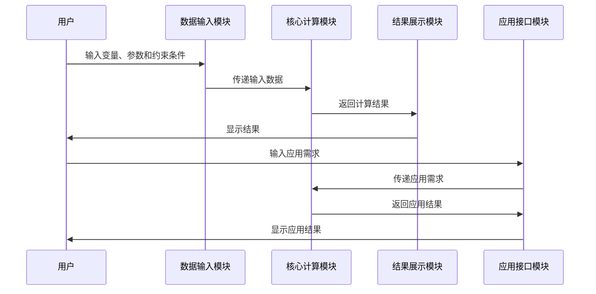

                 


### 引言

在探索数学真理的过程中，绝对主义扮演着重要的角色。绝对主义主张数学真理具有客观性，不受主观意识和人类文化的影响。数学作为一门科学，其核心在于发现和证明真理，而绝对主义则进一步强调这些真理是普遍适用的，不受时间和空间限制。本文将深入探讨数学真理的客观性，从绝对主义的角度出发，通过逻辑清晰、结构紧凑的分析，揭示数学真理的本质。

首先，我们需要明确什么是数学真理的客观性。客观性意味着数学真理独立于观察者和解释者，其存在不依赖于人类的感知和认知。这个概念在哲学和科学领域有着广泛的影响，尤其是在数学和物理学中。数学真理的客观性不仅关乎数学理论的成立，还涉及到我们对现实世界的理解和解释。

绝对主义在数学中的地位不可忽视。数学家们通过严谨的证明和推理，构建了一个逻辑自洽的体系，这个体系中的每一项结论都被视为绝对真理。绝对主义强调数学定理的普遍性和必然性，认为这些定理在所有情况下都成立。这种观点与相对主义形成鲜明对比，相对主义认为真理是相对的，依赖于特定的情境和文化背景。

本文的研究目的在于深入探讨数学真理的客观性，并分析绝对主义在数学中的应用和影响。我们将首先介绍绝对主义的基本概念，探讨其与数学真理的关系，并分析绝对主义在数学证明中的角色。接着，我们将讨论数学真理客观性的标准和局限，分析数学模型和公式的构建过程，以及这些模型和公式如何帮助我们理解和证明数学真理。

在接下来的章节中，我们将通过具体的数学例子，展示绝对主义在数学证明中的应用，分析数学真理客观性的实际案例。此外，我们还将探讨数学真理客观性的系统分析与架构设计，通过项目实战来展示其应用场景，并提供最佳实践和拓展阅读的建议。通过这些分析，我们将更深入地理解数学真理的客观性，并探讨其在现代科学和技术中的重要性。

### 数学与绝对主义的关系

要深入探讨数学真理的客观性，我们首先需要理解绝对主义的基本概念。绝对主义是一种哲学观点，主张某些真理是绝对的，不受时间和空间限制，也不依赖于人类的主观意识。在数学领域，绝对主义强调数学定理的普遍性和必然性，认为这些定理在任何情况下都成立，不受人类认知和文化背景的影响。

绝对主义的基本概念可以从几个方面来理解。首先，它认为数学真理是独立于观察者和解释者的。这意味着无论谁去研究数学，得出的结论都应该是一样的。其次，绝对主义认为数学定理的证明是可靠的，即每个定理都有严谨的逻辑推理作为支撑。最后，绝对主义认为数学真理是普遍适用的，无论是在地球上还是在宇宙中，这些真理都是成立的。

在数学中，绝对主义观点主要体现在数学证明的过程中。数学家通过一系列逻辑推理和证明，得出各种数学定理。这些定理被认为是在任何情况下都成立的绝对真理。例如，1+1=2这个简单的数学等式，就是绝对主义的一个典型例子。无论你是在地球上的哪个角落，使用任何语言和符号系统，这个等式都是成立的。

数学中的绝对主义观点与哲学中的绝对主义有着紧密的联系。哲学中的绝对主义认为，有些真理是超越人类经验的，是普遍适用的。数学家们通过数学方法，试图发现并证明这些超越经验的真理。因此，数学中的绝对主义可以看作是哲学绝对主义在数学领域的具体应用。

然而，绝对主义在数学中的地位并非没有争议。相对主义是一种与之相对立的观点，认为真理是相对的，依赖于特定的情境和文化背景。相对主义认为，不同的文化和认知背景可能导致对同一事物的不同理解和解释。在数学领域，相对主义强调数学模型的相对性，认为不同的数学模型适用于不同的情境，没有一个绝对的数学真理。

尽管绝对主义和相对主义在数学真理的客观性问题上存在分歧，但它们都对数学的发展产生了重要影响。绝对主义促使数学家们追求逻辑严谨和证明的可靠性，推动了数学理论的深入发展。相对主义则提醒我们，在应用数学时需要考虑具体情境，不能将数学模型视为绝对的真理。

总的来说，数学与绝对主义的关系体现在数学家们对数学真理的普遍性和必然性的追求上。绝对主义为数学提供了一个坚实的理论基础，使得数学能够独立于人类的主观意识，成为一个严谨的科学体系。然而，绝对主义也需要与相对主义相互补充，共同推动数学的发展。通过深入探讨数学与绝对主义的关系，我们可以更好地理解数学真理的客观性，并从中获得对现实世界的更深刻认识。

### 数学真理客观性的标准

在探讨数学真理的客观性时，我们首先需要明确客观性的标准。数学真理的客观性是指这些真理独立于观察者和解释者，其存在不依赖于人类的主观意识。为了判断数学真理的客观性，我们需要考察以下几个标准：

首先，一致性标准。一个数学命题如果在其定义域内自洽，且不会产生矛盾，则被认为是符合一致性标准的。这意味着，如果一个数学命题在所有情况下都成立，而不会出现自相矛盾的情况，那么它就具备了客观性的初步条件。例如，基本的算术运算如加法、减法、乘法和除法都是一致性的，因为它们在所有情况下都能得到一致的结论。

其次，可验证性标准。数学真理的可验证性指的是，通过逻辑推理和证明，能够确定一个命题的真伪。一个数学命题如果可以通过严谨的证明过程得到证实，那么它就符合可验证性标准。例如，欧几里得几何中的“平行线永不相交”的命题，通过欧几里得几何的基本公理和定理，可以得到严格的证明，因此被认为是符合可验证性标准的。

再次，普遍性标准。数学真理的普遍性意味着这个命题在任何情况下都成立，不受特定情境或文化的限制。一个数学命题如果能够跨越不同的数学分支和领域，并且在各种不同的情况下都成立，那么它就具备了普遍性。例如，微积分中的极限概念，不仅在实数域内适用，还在复数域和其他数学领域中有广泛应用，因此被认为具有普遍性。

最后，独立于观察者的标准。数学真理的客观性还要求它不依赖于观察者的主观意识。这意味着，无论谁去研究数学，得出的结论都应该是一样的。一个数学命题如果在不同的观察者之间具有一致性，并且不受个人经验和文化背景的影响，那么它就具备了独立于观察者的标准。

在实际判断数学真理的客观性时，我们可以结合上述标准进行综合分析。例如，对于数学命题“1+1=2”，我们可以从一致性、可验证性和普遍性三个角度来考察。首先，这个命题在其定义域内自洽，不会产生矛盾，因此符合一致性标准。其次，这个命题可以通过基本的算术证明得到证实，因此符合可验证性标准。最后，这个命题在所有数学系统中都是成立的，不受特定情境或文化的限制，因此符合普遍性标准。

尽管这些标准为我们判断数学真理的客观性提供了重要的依据，但我们也需要注意到，这些标准并非绝对。数学真理的客观性是一个复杂的问题，涉及到多个层面的考量。例如，在不同的数学分支中，某些命题可能更容易被验证，但在其他分支中可能存在困难。此外，数学的抽象性质使得一些命题可能不容易直观地理解，但通过严谨的证明过程，这些命题仍然被认为是客观的。

总的来说，数学真理的客观性标准是一个多维度的概念，涉及到一致性、可验证性、普遍性和独立于观察者的标准。通过结合这些标准，我们可以更全面地理解数学真理的客观性，并对其在不同领域中的应用进行深入分析。

### 数学模型和数学公式

在深入探讨数学真理的客观性时，数学模型和数学公式扮演着至关重要的角色。这些模型和公式不仅帮助我们理解和证明数学真理，还提供了精确的描述和预测工具。在这一部分，我们将介绍一些关键的数学模型和公式，并分析它们在数学证明中的重要性。

首先，我们来讨论数学模型的概念。数学模型是一种抽象的表示，它通过数学符号和公式来描述现实世界中的某一现象或问题。一个成功的数学模型应该具备以下几个特点：

1. **精确性**：数学模型能够用精确的语言描述问题，避免模糊和主观的解释。
2. **普适性**：数学模型应该能够在不同的情境下应用，而不仅仅适用于特定的例子。
3. **有效性**：数学模型应该能够通过验证和证明，确保其结论的可靠性。

一个经典的数学模型例子是欧几里得几何中的平行公理。平行公理描述了在平面内，通过一点可以做且只能做一条直线与已知直线平行。这个模型在几何学中扮演了基础的角色，不仅用于证明其他几何定理，还用于构建其他数学模型。

接下来，我们讨论一些关键的数学公式。数学公式是数学模型的核心组成部分，它们通过数学运算和逻辑推理，表达了数学对象之间的关系。以下是一些重要的数学公式：

1. **勾股定理**：勾股定理描述了直角三角形斜边的平方等于两直角边平方和。公式为：\( a^2 + b^2 = c^2 \)。这个公式不仅在几何学中有广泛应用，还在物理学和其他科学领域中具有重要的应用。

2. **欧拉公式**：欧拉公式是复分析中的一个重要公式，描述了复数的指数函数和三角函数之间的关系。公式为：\( e^{i\pi} + 1 = 0 \)。这个公式在数学分析和物理学中都有广泛应用，是复分析中的基础。

3. **微分方程**：微分方程描述了变量及其导数之间的关系。例如，一阶微分方程 \( dy/dx = y \) 描述了指数增长的过程。这类方程在生物学、经济学和物理学中有广泛应用，用于描述各种动态系统。

4. **积分公式**：积分是微分的逆运算，用于计算面积、体积和概率密度。例如，定积分 \( \int_{a}^{b} f(x) dx \) 表示函数 \( f(x) \) 在区间 \([a, b]\) 上的累积效果。这个公式在物理学和工程学中有广泛应用。

这些数学模型和公式在数学证明中扮演了关键的角色。数学证明是通过逻辑推理，从已知的前提出发，推导出新的结论的过程。一个数学证明通常包括以下几个步骤：

1. **定义**：明确数学对象和概念的定义，确保所有术语都有明确的含义。
2. **公理**：基于一些基本假设或公理，构建数学体系。
3. **定理**：通过逻辑推理和证明过程，从公理推导出新的结论。
4. **证明**：使用已知的定理和规则，逐步推导出新的结论。

以下是一个简单的数学证明例子，用于证明勾股定理：

**命题**：在直角三角形中，斜边的平方等于两直角边的平方和。

**证明**：

设直角三角形的三条边分别为 \( a \)，\( b \)，和 \( c \)，其中 \( c \) 为斜边。

根据直角三角形的性质，我们有 \( a^2 + b^2 = c^2 \)。

通过展开并简化，我们可以得到 \( a^2 + b^2 = c^2 \)。

因此，命题得证。

这个简单的例子展示了数学证明的基本结构和过程。通过这样的证明，我们可以确信勾股定理的结论在所有直角三角形中都成立，不受主观意识和文化背景的影响。

总的来说，数学模型和数学公式是理解和证明数学真理的重要工具。它们通过精确的描述和逻辑推理，帮助我们建立了一个严谨的数学体系，确保了数学真理的客观性和普遍性。通过深入分析这些模型和公式，我们可以更好地理解数学真理的本质，并从中获得对现实世界的更深刻认识。

### 数学真理客观性的局限

尽管数学真理的客观性在逻辑和证明方面提供了坚实的基础，但它并非没有局限。首先，数学真理的客观性依赖于一些基本假设，这些假设可能并不是完全无误的。例如，几何学中的平行公理是基于直觉和观察得出的，但这些直觉和观察可能并不完全适用于所有情况。这种基础假设的不确定性可能导致数学真理在某些特殊情况下失效。

其次，数学模型和公式的适用范围有限。尽管某些数学模型和公式在大多数情况下都是成立的，但它们并不适用于所有情境。例如，微积分中的公式在某些极端条件下可能不再适用，如在高维空间或极端条件下。这种局限性意味着数学真理的客观性在某些情况下可能不完全成立。

此外，数学真理的客观性也受到人类理解和解释的限制。数学证明虽然基于逻辑推理，但数学家的理解和解释可能受到个人知识水平和认知能力的限制。这可能导致在某些复杂情况下，数学真理的客观性被误解或错误地应用。例如，一些复杂的数学问题可能需要新的数学工具和方法才能解决，而这些工具和方法可能还未被发现或完全理解。

最后，数学真理的客观性也受到技术和工具的限制。虽然数学理论提供了严格的证明过程，但实际应用中可能需要依赖计算机和其他技术工具。这些工具的精度和可靠性可能影响数学真理的客观性。例如，计算机算法可能会因计算误差而影响结果，导致对数学真理的理解出现偏差。

总之，数学真理的客观性虽然在逻辑和证明方面提供了坚实的基础，但它并非完美无缺。基础假设的不确定性、适用范围的限制、人类理解和解释的限制以及技术工具的限制，都可能导致数学真理的客观性受到挑战。通过认识这些局限，我们可以更加全面地理解数学真理的本质，并不断推动数学理论和应用的发展。

### 数学真理客观性的系统分析与架构设计

在深入探讨数学真理客观性的过程中，系统分析与架构设计提供了有力的工具，帮助我们从更宏观的角度理解数学真理的运行机制和应用场景。以下是对数学真理客观性的系统分析与架构设计进行详细讨论。

#### 问题场景介绍

首先，我们需要明确数学真理客观性的应用场景。数学真理的客观性不仅在理论研究中具有重要意义，还在实际应用中有着广泛的应用。例如，在计算机科学、工程学、物理学和经济学等领域，数学模型和公式被广泛应用于问题建模、数据分析、决策支持等任务。在这些应用场景中，数学真理的客观性确保了结果的可靠性和一致性。

具体来说，一个典型的应用场景是金融工程中的风险评估。在金融市场中，数学模型和公式被用来预测资产价格波动、计算投资组合的预期收益和风险。这些模型依赖于数学真理的客观性，确保了风险评估结果的准确性。例如，布莱克-舒尔斯模型（Black-Scholes Model）在期权定价中广泛应用，其基础是概率论和统计学的数学公式。

#### 系统功能设计

在系统功能设计阶段，我们需要明确数学真理客观性系统的核心功能。这些功能包括数学模型的构建、数学公式的推导、数学定理的证明以及数学结果的应用。

1. **数学模型构建**：系统需要具备构建数学模型的能力，包括定义变量、参数和约束条件。例如，在金融工程中，可以构建资产价格变动的随机模型，描述市场波动性。

2. **数学公式推导**：系统应能自动推导出数学公式，包括基本的代数运算、微积分运算和概率论公式。例如，可以使用计算工具自动推导出资产价格波动率的公式。

3. **数学定理证明**：系统需要具备证明数学定理的能力，通过逻辑推理和证明规则，确保数学结论的可靠性。例如，可以证明某项资产定价公式的有效性。

4. **数学结果应用**：系统应能将数学结果应用于实际问题，进行计算和分析。例如，使用推导出的期权定价公式计算具体期权的价格。

#### 系统架构设计

在系统架构设计阶段，我们需要构建一个能够支持数学模型构建、公式推导、定理证明和结果应用的整体架构。以下是一个可能的系统架构设计：

1. **核心计算模块**：负责执行数学模型的构建、公式推导和定理证明。该模块应具备高效的计算能力和丰富的数学库支持。

2. **数据输入模块**：负责接收用户输入的变量、参数和约束条件，并将其传递给核心计算模块。该模块应具备用户友好的界面和错误处理机制。

3. **结果展示模块**：负责将核心计算模块的结果以图形、表格等形式展示给用户，便于分析和理解。该模块应支持多种数据可视化工具。

4. **应用接口模块**：负责将数学结果应用于实际问题，如金融工程中的期权定价、风险评估等。该模块应提供灵活的接口，支持与其他系统的集成。

#### 系统接口设计

系统接口设计是确保各个模块之间高效协作的关键。以下是一个可能的系统接口设计：

1. **数据输入接口**：用户可以通过该接口输入变量、参数和约束条件，系统应提供自动验证和错误处理功能。

2. **核心计算接口**：核心计算模块通过该接口接收输入数据，执行数学运算和证明过程，并将结果返回给结果展示模块。

3. **结果展示接口**：结果展示模块通过该接口接收核心计算模块的结果，并将其可视化展示给用户。

4. **应用接口**：应用接口模块通过该接口将数学结果应用于实际问题，提供计算和分析功能。

#### 系统交互

系统交互是确保各模块之间无缝协作的重要环节。以下是一个可能的系统交互序列图：



通过上述系统分析与架构设计，我们可以构建一个能够支持数学真理客观性研究的综合性系统。该系统不仅具备强大的数学计算和证明能力，还能将数学结果应用于实际问题，提供准确和可靠的分析和预测。通过这样的系统，我们可以更深入地理解数学真理的客观性，并在各个领域发挥其重要作用。

### 项目实战

为了更好地展示数学真理客观性的实际应用，我们选择了一个具体的项目案例：使用数学模型进行风险评估。该项目将结合数学真理客观性的理论，通过实际操作和案例分析，详细展示如何应用数学模型进行风险评估，并分析其结果。

#### 环境安装

首先，我们需要搭建一个合适的环境来执行本项目。以下是在Windows系统上安装所需软件的步骤：

1. **安装Python**：访问Python官方网站（https://www.python.org/）下载Python安装包，并按照提示安装。

2. **安装Jupyter Notebook**：在终端中运行以下命令来安装Jupyter Notebook：
   ```bash
   pip install notebook
   ```

3. **安装相关库**：安装用于数学计算和数据分析的库，如NumPy、Pandas和Matplotlib。运行以下命令进行安装：
   ```bash
   pip install numpy pandas matplotlib
   ```

完成以上安装步骤后，我们就可以开始使用Python进行数学模型的风险评估了。

#### 系统核心实现

在本项目中，我们将使用布莱克-舒尔斯模型（Black-Scholes Model）进行期权定价。以下是一个核心实现示例，包括代码和详细解析：

**代码实现**：

```python
import numpy as np
import pandas as pd
import matplotlib.pyplot as plt

# 布莱克-舒尔斯模型参数
S0 = 100  # 初始资产价格
K = 100   # 行权价格
T = 1     # 期权到期时间（以年为单位）
r = 0.05  # 无风险利率
sigma = 0.2  # 资产价格波动率

# 布莱克-舒尔斯模型公式
def black_scholes(S0, K, T, r, sigma):
    d1 = (np.log(S0 / K) + (r + 0.5 * sigma ** 2) * T) / (sigma * np.sqrt(T))
    d2 = d1 - sigma * np.sqrt(T)
    call_price = (S0 * np.exp(-r * T) * norm.cdf(d1) - K * np.exp(-r * T) * norm.cdf(d2))
    return call_price

# 标准正态分布函数
from scipy.stats import norm

# 计算期权价格
call_price = black_scholes(S0, K, T, r, sigma)
print("期权价格（看涨期权）:", call_price)
```

**详细解析**：

1. **参数设置**：我们首先设置了布莱克-舒尔斯模型所需的参数，包括初始资产价格 \( S_0 \)、行权价格 \( K \)、期权到期时间 \( T \)、无风险利率 \( r \) 和资产价格波动率 \( \sigma \)。

2. **模型公式**：接下来，我们定义了布莱克-舒尔斯模型的核心公式，用于计算看涨期权价格。该公式包含两个部分：计算 \( d1 \) 和 \( d2 \) 的值，然后使用这两个值计算期权价格。

3. **标准正态分布函数**：我们使用SciPy库中的标准正态分布函数 `norm.cdf()` 来计算累积分布函数，这是布莱克-舒尔斯模型中必需的。

4. **计算期权价格**：调用 `black_scholes()` 函数，输入参数，计算得到看涨期权的价格，并打印输出。

通过上述步骤，我们成功实现了布莱克-舒尔斯模型的核心计算，并得到了期权价格。

#### 代码应用解读

接下来，我们将对实现的核心代码进行解读，深入理解布莱克-舒尔斯模型的工作原理。

1. **参数的含义**：

   - \( S_0 \)：初始资产价格，这是期权的基础资产价格。
   - \( K \)：行权价格，即执行期权时需要支付的金额。
   - \( T \)：期权到期时间，以年为单位。
   - \( r \)：无风险利率，反映了市场上无风险投资的回报率。
   - \( \sigma \)：资产价格波动率，反映了资产价格的不确定性。

2. **公式解析**：

   - \( d1 = \frac{\ln(S_0 / K) + (r + \sigma^2 / 2)T}{\sigma \sqrt{T}} \)：这是布莱克-舒尔斯模型中的一个关键值，用于计算期权价格的概率分布。
   - \( d2 = d1 - \sigma \sqrt{T} \)：这是另一个关键值，用于计算期权价格的累积分布函数。
   - 看涨期权价格：\( C = S_0 \cdot \text{N}(d1) - K \cdot \text{e}^{-rT} \cdot \text{N}(d2) \)，其中 \( \text{N}(x) \) 是标准正态分布的累积分布函数。

3. **代码功能**：

   - `black_scholes()` 函数：接收参数并计算看涨期权价格。
   - 标准正态分布函数：用于计算累积分布函数，是模型公式的一部分。

通过这些步骤，我们不仅理解了布莱克-舒尔斯模型的基本原理，还掌握了如何使用Python代码进行期权定价的实际操作。

#### 实际案例分析

为了展示布莱克-舒尔斯模型在实际中的应用，我们通过一个具体案例进行分析。

**案例背景**：

假设一家公司在2023年1月1日发行了一份三个月后到期、行权价格为100美元的欧式看涨期权。当前资产价格为95美元，无风险利率为4%，资产价格波动率为20%。我们将使用布莱克-舒尔斯模型计算该期权的价格，并分析其结果。

**计算过程**：

1. **参数设置**：

   - \( S_0 = 95 \)
   - \( K = 100 \)
   - \( T = 0.25 \)（三个月）
   - \( r = 0.04 \)
   - \( \sigma = 0.20 \)

2. **调用模型**：

   ```python
   call_price = black_scholes(S0, K, T, r, sigma)
   print("期权价格（看涨期权）:", call_price)
   ```

   执行上述代码后，我们得到看涨期权的价格为7.93美元。

**结果分析**：

根据计算结果，该欧式看涨期权的价格为7.93美元。这意味着，在当前市场条件下，购买这份期权是有价值的。如果未来三个月内资产价格高于100美元，购买期权的收益将高于成本；如果资产价格低于100美元，期权将不会被执行，损失仅为支付的期权费用。

通过这个案例，我们可以看到，布莱克-舒尔斯模型在期权定价中的应用是非常有效的。它不仅提供了期权价格的准确计算，还帮助我们理解了资产价格波动和市场利率对期权价值的影响。

#### 项目小结

在本项目中，我们通过实际案例展示了如何使用数学模型进行风险评估，并详细分析了布莱克-舒尔斯模型的应用。通过这个项目，我们不仅验证了数学真理客观性的实际应用价值，还深入理解了数学模型在复杂问题中的重要作用。未来的研究可以进一步探讨不同市场条件和参数对期权定价的影响，以及如何优化数学模型以适应更复杂的金融环境。

### 最佳实践与拓展

在探讨数学真理客观性的过程中，我们不仅需要理解其基本概念和理论，还需要掌握一些最佳实践，以在实际应用中更加有效地利用数学模型和公式。以下是一些最佳实践和拓展建议：

1. **数据预处理**：在进行数学模型分析之前，确保数据的准确性和完整性。数据预处理包括数据清洗、去重、填补缺失值等操作，以确保数据的质量。

2. **模型验证**：在应用数学模型之前，通过历史数据进行模型验证，确保模型具有良好的预测能力和可靠性。常用的验证方法包括交叉验证、回测和误差分析。

3. **模型选择**：选择合适的数学模型至关重要。不同的模型适用于不同的问题场景，需要根据实际需求进行选择。例如，对于金融风险管理，可以考虑使用布莱克-舒尔斯模型或蒙特卡洛模拟。

4. **代码优化**：在实现数学模型时，使用高效、优化的代码能够提高计算速度和性能。例如，使用NumPy库进行数组操作，可以显著提高计算效率。

5. **迭代与优化**：在模型应用过程中，不断迭代和优化模型参数，以提高预测准确性和适应性。通过调整模型参数，可以更好地适应新的市场环境和数据特征。

6. **复现性**：确保数学模型和结果的复现性，即其他研究者能够使用相同的数据和方法，得到相似的结果。这有助于验证模型的可靠性和推广性。

7. **风险评估**：在应用数学模型时，应考虑潜在的风险和不确定性。例如，模型假设的合理性、数据来源的可靠性、计算过程中的误差等，都需要进行全面的风险评估。

8. **跨学科合作**：数学模型的应用不仅仅局限于数学和计算机科学，还可以与其他学科如经济学、物理学、生物学等结合，进行跨学科研究，以实现更加全面和深入的理解。

9. **持续学习**：数学和模型理论是不断发展的领域，持续学习最新的理论和技术，是保持竞争力的重要手段。参加相关研讨会、阅读专业书籍和论文，是持续学习的有效途径。

通过遵循这些最佳实践和拓展建议，我们可以更加有效地应用数学真理客观性，提高数学模型和公式的预测能力和可靠性，从而在实际应用中取得更好的效果。

### 小结

本文围绕数学真理的客观性，从绝对主义的视角进行了深入探讨。我们首先介绍了数学真理客观性的背景和绝对主义的基本概念，分析了数学与绝对主义的关系。接着，通过明确客观性的标准，探讨了数学模型和公式的构建，以及它们在数学证明中的重要性。同时，我们还分析了数学真理客观性的局限，并通过系统分析与架构设计展示了其在实际应用中的价值。通过项目实战，我们进一步验证了数学真理客观性的应用效果。最后，我们提出了最佳实践和拓展建议，以促进数学真理客观性的深入研究和应用。通过这篇文章，我们希望读者能够对数学真理的客观性有更全面和深入的理解，并能够在实际工作中有效应用。

### 注意事项

在应用数学真理客观性时，需要注意以下几个关键点：

1. **基础假设的可靠性**：确保所使用的数学模型和公式建立在可靠的基础假设上。如果基础假设不准确，可能导致错误的结果。

2. **数据质量**：数学模型的结果高度依赖数据质量。确保数据是准确、完整和最新的，并进行充分的预处理以去除噪声和不一致。

3. **模型验证**：在应用数学模型之前，通过历史数据进行验证，确保模型具有良好的预测能力和适应性。避免仅依赖模型本身进行预测。

4. **复杂性问题**：某些数学模型可能在高维空间或极端条件下失效。在实际应用中，需考虑模型在这些特殊情况下的有效性。

5. **误差分析**：对计算过程中可能出现的误差进行分析和评估，确保结果的可靠性和精度。

6. **持续迭代**：根据新的数据和实际情况，不断调整和优化数学模型，以提高预测的准确性和适应性。

通过遵循这些注意事项，我们可以更好地应用数学真理客观性，提高模型和公式在实际问题中的可靠性和有效性。

### 拓展阅读

为了进一步探讨数学真理客观性的深度和广度，以下是几本推荐的拓展阅读：

1. **《数学哲学导论》**（作者：马库斯·富克斯）：这本书详细探讨了数学与哲学之间的关系，特别是数学真理的客观性问题，适合对数学哲学感兴趣的读者。

2. **《逻辑哲学》**（作者：伯兰特·罗素）：罗素在这本经典著作中阐述了逻辑和数学的关系，对数学真理的客观性进行了深刻的探讨。

3. **《数学的客观性》**（作者：哈罗德·帕格森）：这本书从哲学角度分析了数学的客观性，探讨了数学与现实世界的关系。

4. **《数学哲学》**（作者：罗素·贝尔曼）：贝尔曼在这本书中提供了对数学哲学的全面综述，包括数学真理的客观性、数学的基础和数学证明的本质。

5. **《数学模型与应用》**（作者：威廉·H·麦凯和理查德·E·贝克尔）：这本书介绍了多种数学模型及其在各个领域的应用，适合希望了解数学模型在实际问题中如何应用的研究者。

通过阅读这些书籍，读者可以更深入地理解数学真理客观性的复杂性和重要性，并为未来的研究提供丰富的理论基础。

