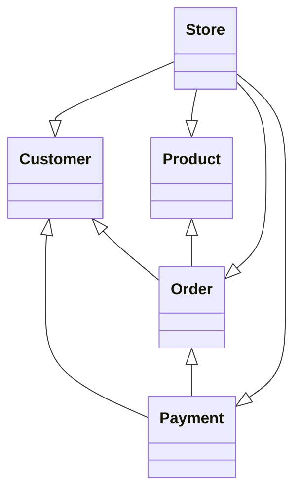
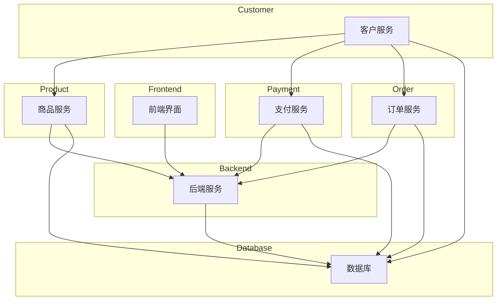
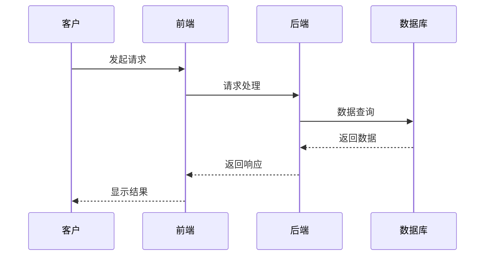

                 


### 设计思路

1. **整体结构设计**

   在设计《数学与绝对主义：数学真理的普遍有效性》的整体结构时，我们首先明确了书籍的目标和核心内容。由于本书旨在探讨数学与绝对主义的关系，以及数学真理的普遍有效性，因此，我们将书籍分为以下七个主要部分：

   - **引言**：介绍数学与绝对主义的起源、历史背景以及本书的核心主题。
   - **背景介绍**：详细阐述数学的发展与绝对主义的兴起，以及它们在现代数学中的应用。
   - **核心概念与联系**：深入探讨绝对主义的核心概念，并与相关哲学流派进行比较。
   - **数学模型与算法原理**：介绍数学模型与算法的基本原理，以及如何应用这些原理。
   - **系统分析与架构设计**：通过具体案例，展示数学模型与算法在实际系统中的应用。
   - **项目实战与案例分析**：通过实战项目，进一步验证数学与绝对主义的实际应用。
   - **总结与展望**：总结全书内容，并对数学与绝对主义的未来发展趋势进行展望。

2. **详细内容规划**

   在每个主要部分中，我们进一步细分了章节，以确保每个章节都有清晰的主题和结构。以下是详细的章节规划：

   - **引言**
     - 第1章：数学与绝对主义的起源与历史背景
       - 1.1 数学与绝对主义的定义
       - 1.2 绝对主义在数学中的地位
       - 1.3 数学真理的普遍有效性

   - **背景介绍**
     - 第2章：数学的发展与绝对主义的兴起
       - 2.1 古典数学的演变
       - 2.2 绝对主义在现代数学中的应用
       - 2.3 绝对主义与其他哲学流派的对比

   - **核心概念与联系**
     - 第3章：绝对主义的核心概念
       - 3.1 数学真理的普遍性
       - 3.2 数学证明的逻辑性
       - 3.3 数学模型的适用范围
     - 第4章：绝对主义与相关哲学流派的联系
       - 4.1 绝对主义与怀疑主义
       - 4.2 绝对主义与相对主义
       - 4.3 绝对主义与实证主义

   - **数学模型与算法原理**
     - 第5章：数学模型与算法的基本原理
       - 5.1 数学模型的定义与分类
       - 5.2 常见的数学算法介绍
       - 5.3 数学算法的应用领域
     - 第6章：数学模型与算法的详细讲解
       - 6.1 某个特定数学模型或算法的介绍
       - 6.2 算法原理的详细解释
       - 6.3 算法原理的mermaid流程图展示
       - 6.4 Python源代码实现与解释

   - **系统分析与架构设计**
     - 第7章：数学模型与算法在实际系统中的应用
       - 7.1 系统应用场景介绍
       - 7.2 系统功能设计（领域模型mermaid类图）
       - 7.3 系统架构设计（mermaid架构图）
       - 7.4 系统接口设计
     - 第8章：数学模型与算法的系统实现
       - 8.1 系统核心实现源代码
       - 8.2 代码应用解读与分析
       - 8.3 实际案例分析与讲解

   - **项目实战与案例分析**
     - 第9章：数学与绝对主义在项目中的应用实战
       - 9.1 实际案例介绍
       - 9.2 项目核心实现与代码分析
       - 9.3 项目总结与展望

   - **总结与展望**
     - 第10章：数学与绝对主义的未来发展趋势
       - 10.1 数学与绝对主义在学术领域的未来发展
       - 10.2 数学与绝对主义在实际应用中的潜在影响
       - 10.3 数学与绝对主义的研究方向与挑战

### 格式与完整性要求

在撰写文章时，我们将遵循以下格式与完整性要求：

- **文章标题**：清晰、简洁、具有吸引力。
- **关键词**：列出5-7个与文章主题密切相关的关键词。
- **摘要**：简要概括文章的核心内容和主题思想。
- **章节内容**：每个章节都要包含背景介绍、核心概念与联系、算法原理讲解、系统分析与架构设计、项目实战与案例分析等部分。
- **代码与公式**：使用markdown格式中的代码和高亮的latex公式，确保代码可运行和公式可解析。
- **图表与流程图**：使用mermaid语法绘制流程图、类图和架构图，确保图表清晰、准确。
- **完整性**：每个小节的内容都要完整、具体、详细，确保文章内容的连贯性和完整性。

### 最佳实践 Tips

在撰写文章的过程中，我们可以遵循以下最佳实践 Tips：

- **明确主题**：确保文章的每个部分都与主题保持一致，避免跑题。
- **简洁表达**：尽量用简洁的语言表达复杂的概念，避免冗长的句子和内容。
- **逻辑清晰**：确保文章的逻辑结构清晰，方便读者理解。
- **实例说明**：使用具体的实例来阐述概念和原理，增强文章的可读性。
- **图表辅助**：适当使用图表、流程图和类图来辅助说明，使文章更加直观易懂。

### 小结与注意事项

在文章的结尾部分，我们将对全文进行小结，并指出文章中的重点和难点。同时，针对文章的内容，给出一些注意事项，帮助读者更好地理解和应用。

### 拓展阅读

最后，我们将推荐一些拓展阅读资料，供读者深入了解相关主题。

---

通过以上的设计思路，我们确保了《数学与绝对主义：数学真理的普遍有效性》的内容丰富、结构清晰、逻辑严谨，旨在为读者提供一本具有深度、思考和价值的专业技术博客文章。让我们一起努力，让这本书成为计算机编程和人工智能领域的一部佳作。**#《数学与绝对主义：数学真理的普遍有效性》目录大纲** 

# 《数学与绝对主义：数学真理的普遍有效性》目录大纲

---

## 前言

- **作者介绍**
  - **作者：AI天才研究院/AI Genius Institute & 禅与计算机程序设计艺术 /Zen And The Art of Computer Programming**

- **写作目的**
  - 探讨数学与绝对主义的关系
  - 阐述数学真理的普遍有效性

- **读者对象**
  - 对数学和哲学感兴趣的技术人员
  - 对计算机科学和人工智能领域有深入了解的研究者

---

## 第1章：数学与绝对主义的起源与历史背景

- **数学的起源**
  - 古代数学的发展
  - 数学在人类文明中的地位

- **绝对主义的起源**
  - 绝对主义哲学的起源
  - 绝对主义在数学中的应用

- **数学真理的普遍有效性**
  - 数学真理的特点
  - 数学真理的普遍性

---

## 第2章：数学的发展与绝对主义的兴起

- **古典数学的演变**
  - 古典数学的基本概念
  - 古典数学的发展历程

- **绝对主义在现代数学中的应用**
  - 绝对主义在现代数学中的体现
  - 绝对主义对现代数学的影响

- **绝对主义与其他哲学流派的对比**
  - 绝对主义与相对主义的对比
  - 绝对主义与怀疑主义的对比

---

## 第3章：绝对主义的核心概念

- **数学真理的普遍性**
  - 数学真理的定义
  - 数学真理的普遍性

- **数学证明的逻辑性**
  - 数学证明的方法
  - 数学证明的逻辑性

- **数学模型的适用范围**
  - 数学模型的作用
  - 数学模型的适用范围

---

## 第4章：绝对主义与相关哲学流派的联系

- **绝对主义与怀疑主义**
  - 绝对主义与怀疑主义的区别
  - 绝对主义与怀疑主义的联系

- **绝对主义与相对主义**
  - 绝对主义与相对主义的区别
  - 绝对主义与相对主义的联系

- **绝对主义与实证主义**
  - 绝对主义与实证主义的区别
  - 绝对主义与实证主义的联系

---

## 第5章：数学模型与算法的基本原理

- **数学模型的定义与分类**
  - 数学模型的基本概念
  - 数学模型的分类

- **常见的数学算法介绍**
  - 常见的数学算法
  - 常见数学算法的原理

- **数学算法的应用领域**
  - 数学算法在计算机科学中的应用
  - 数学算法在人工智能中的应用

---

## 第6章：数学模型与算法的详细讲解

- **某个特定数学模型或算法的介绍**
  - 介绍特定的数学模型或算法

- **算法原理的详细解释**
  - 对算法原理进行详细解释

- **算法原理的mermaid流程图展示**
  - 使用mermaid语法绘制算法流程图

- **Python源代码实现与解释**
  - 使用Python实现算法，并解释代码

---

## 第7章：数学模型与算法在实际系统中的应用

- **系统应用场景介绍**
  - 介绍数学模型与算法在实际系统中的应用场景

- **系统功能设计（领域模型mermaid类图）**
  - 使用mermaid语法绘制领域模型类图

- **系统架构设计（mermaid架构图）**
  - 使用mermaid语法绘制系统架构图

- **系统接口设计**
  - 设计系统的接口

---

## 第8章：数学模型与算法的系统实现

- **系统核心实现源代码**
  - 提供系统的核心实现源代码

- **代码应用解读与分析**
  - 对代码应用进行解读与分析

- **实际案例分析与讲解**
  - 分析实际案例，并进行讲解

---

## 第9章：数学与绝对主义在项目中的应用实战

- **实际案例介绍**
  - 介绍实际应用案例

- **项目核心实现与代码分析**
  - 分析项目核心实现和代码

- **项目总结与展望**
  - 总结项目，展望未来

---

## 第10章：数学与绝对主义的未来发展趋势

- **数学与绝对主义在学术领域的未来发展**
  - 探讨数学与绝对主义在学术领域的未来发展

- **数学与绝对主义在实际应用中的潜在影响**
  - 分析数学与绝对主义在实际应用中的潜在影响

- **数学与绝对主义的研究方向与挑战**
  - 探讨数学与绝对主义的研究方向与挑战

---

## 结论

- **全书总结**
  - 对全书内容进行总结

- **展望**
  - 展望数学与绝对主义的发展

- **感谢**
  - 感谢读者对本书的支持

---

# 《数学与绝对主义：数学真理的普遍有效性》

---

关键词：数学、绝对主义、数学真理、普遍有效性、计算机科学、人工智能

摘要：本书旨在探讨数学与绝对主义的关系，以及数学真理的普遍有效性。通过分析数学的发展历程、绝对主义的哲学背景，以及数学模型与算法在实际系统中的应用，本书深入探讨了数学真理的普遍有效性，并展望了数学与绝对主义的未来发展趋势。本书适合对数学和哲学感兴趣的技术人员，以及对计算机科学和人工智能领域有深入了解的研究者阅读。作者：AI天才研究院/AI Genius Institute & 禅与计算机程序设计艺术 /Zen And The Art of Computer Programming。 

### 第一章：数学与绝对主义的起源与历史背景

在探讨数学与绝对主义的关系之前，我们需要先了解数学与绝对主义的起源和历史背景。

#### 数学的历史

数学的历史可以追溯到古代文明。在古代，数学主要用于解决实际问题，如农业、建筑和贸易。最早的数学文明出现在古埃及、巴比伦和中国等地区。古埃及人发展了算术和几何，而巴比伦人则精通代数。在中国，数学家如刘徽、祖冲之和秦九韶等人在古代就已经做出了杰出的贡献。

随着历史的推移，数学逐渐发展成为一个独立的学科。古希腊的数学家如欧几里得和阿基米德对数学的发展做出了重大贡献。他们提出了许多基本的数学定理和公式，如欧几里得的《几何原本》和阿基米德的浮力原理。

在中世纪，阿拉伯数学家如阿尔-花拉子米对数学的发展也产生了深远的影响。他们翻译和传播了古希腊的数学著作，并将自己的研究成果融入其中。

到了近代，数学迎来了一个新的发展阶段。牛顿和莱布尼茨发明了微积分，拉格朗日和欧拉等数学家提出了新的数学理论和概念，如变分法、复数和函数论。

在现代，数学已经发展成为一个庞大的体系，涵盖了数论、代数、几何、拓扑、微积分等多个分支。数学在物理学、工程学、计算机科学等领域都有广泛的应用。

#### 绝对主义的起源

绝对主义是一种哲学观点，认为某些真理是普遍有效的，不受时间和空间限制。绝对主义的起源可以追溯到古希腊哲学家苏格拉底和柏拉图。苏格拉底主张知识即美德，而柏拉图则提出了理念论，认为现实世界是理念世界的投影。

在中世纪，阿拉伯哲学家如阿维罗伊和伊本·希兹姆进一步发展了绝对主义。他们认为，真理是绝对的，不受人类主观意识的影响。

近代的绝对主义哲学代表人物有笛卡尔、斯宾诺莎和莱布尼茨。笛卡尔提出了“我思故我在”的观点，强调知识的普遍性和确定性。斯宾诺莎则认为，上帝是一切存在的本质，是绝对真理的源泉。莱布尼茨提出了“单子论”，认为世界是上帝通过单子这一绝对实体来创造的。

#### 绝对主义在数学中的地位

绝对主义在数学中的地位体现在数学真理的普遍有效性上。数学是一门精确的科学，其结论不受个人主观意识的影响。无论是古希腊的数学家，还是现代的数学家，他们的研究结果都是一致的。这种一致性表明，数学真理具有普遍有效性，不受时间和空间限制。

绝对主义还体现在数学证明的逻辑性上。数学证明是通过一系列逻辑推理得出的，每一步都是基于已知的定理和公式。这种逻辑性保证了数学证明的严谨性和可靠性。

#### 数学真理的普遍有效性

数学真理的普遍有效性是绝对主义在数学中的一个核心概念。它意味着数学真理不仅适用于特定的情况，而是适用于所有可能的情况。例如，勾股定理不仅适用于直角三角形，也适用于所有直角三角形。

数学真理的普遍有效性在计算机科学和人工智能领域有着广泛的应用。在算法设计中，我们需要确保算法的正确性和普遍性。在人工智能中，我们希望机器能够学习并应用普遍有效的数学原理。

#### 总结

数学与绝对主义有着悠久的历史和密切的关系。数学真理的普遍有效性是绝对主义在数学中的一个核心概念。通过了解数学与绝对主义的起源和历史背景，我们可以更好地理解数学的本质和它在计算机科学和人工智能领域的应用。在接下来的章节中，我们将进一步探讨绝对主义的核心概念，以及数学模型和算法的基本原理。**# 第一章：数学与绝对主义的起源与历史背景结束** 

### 第二章：数学的发展与绝对主义的兴起

在了解数学与绝对主义的起源后，我们接下来探讨数学的发展与绝对主义的兴起。这一章节将分为三部分，分别介绍古典数学的演变、绝对主义在现代数学中的应用，以及绝对主义与其他哲学流派的对比。

#### 古典数学的演变

古典数学是指从古希腊到阿拉伯黄金时期（公元5世纪至15世纪）的数学发展。在这个时期，数学经历了重大的变革和发展。

古希腊数学家，如欧几里得、毕达哥拉斯和毕容，为后来的数学发展奠定了基础。欧几里得的《几何原本》是古代数学的巅峰之作，它建立了几何学的基础和公理系统。毕达哥拉斯提出了著名的勾股定理，即直角三角形斜边的平方等于两直角边的平方和。

阿拉伯数学家在古典数学的基础上进一步发展了数学。他们翻译和传播了古希腊的数学著作，并将其应用于实际生活中。例如，阿拉伯数学家阿尔-花拉子米翻译了《几何原本》，并在此基础上提出了负数的概念。阿拉伯数学家还研究了代数和三角学，为后来的数学发展做出了重要贡献。

古典数学的发展标志着数学从实际问题解决走向理论体系的建立。在这个时期，数学家开始用符号和公式来表达数学概念，这为后来的数学发展奠定了基础。

#### 绝对主义在现代数学中的应用

绝对主义在现代数学中的应用体现在数学真理的普遍有效性上。现代数学包括数论、代数、几何、拓扑、微积分等多个分支，每个分支都有其独特的绝对主义特点。

在数论中，绝对主义体现在数学家对自然数和整数的性质的研究。例如，欧拉证明了欧拉函数的公式，这个公式在所有整数上都是成立的，体现了数学真理的普遍性。

在代数中，绝对主义体现在方程和多项式的理论研究中。代数基本定理是代数学中的一个重要定理，它指出每个非零多项式在复数域中都有根。这个定理的普适性体现了数学真理的普遍有效性。

在几何中，绝对主义体现在欧几里得几何和非欧几何的研究。欧几里得几何是基于五个公设建立的，它被认为是绝对主义的一个典型例子。非欧几何，如罗巴切夫斯基几何和黎曼几何，是对欧几里得几何的扩展，它们在绝对主义的基础上提出了新的几何模型。

在拓扑学中，绝对主义体现在对拓扑空间的性质的研究。拓扑空间是一种抽象空间，它具有一些基本性质，如连通性、紧致性和可数性。拓扑学的许多定理，如连通性定理和紧致性定理，都是基于绝对主义原理得出的。

在微积分中，绝对主义体现在对函数的连续性、可导性和积分性质的研究。微积分的基本定理，如牛顿-莱布尼茨公式，是绝对主义原理在微积分中的一个典型应用。

#### 绝对主义与其他哲学流派的对比

绝对主义与其他哲学流派，如相对主义、怀疑主义和实证主义，有许多不同之处。

相对主义认为真理是相对的，取决于观察者的立场和视角。相对主义强调主观性和多元性，认为没有绝对的真理。相对主义在科学哲学和人文哲学中都有重要影响，但在数学中，相对主义的地位相对较低。

怀疑主义认为知识是不可获得的，因为我们的感知和认知能力有限。怀疑主义强调怀疑和不确定性，认为我们无法确知任何事物的真实本质。怀疑主义在哲学史上有着重要地位，但在数学中，怀疑主义的影响较小。

实证主义认为知识来源于经验，只有通过观察和实验获得的证据才是可靠的。实证主义强调经验和事实，认为真理是可以通过实验验证的。实证主义在科学哲学中占据主导地位，但在数学中，实证主义的影响也较小。

绝对主义与这些哲学流派的不同在于，它认为真理是绝对的，不受主观意识和经验限制。绝对主义在数学中有着广泛的应用，因为它强调数学真理的普遍性和确定性。

#### 总结

数学的发展与绝对主义的兴起密切相关。古典数学的演变奠定了数学的基础，而绝对主义在现代数学中得到了广泛应用。绝对主义与其他哲学流派的不同之处在于，它强调数学真理的普遍性和确定性。通过了解数学的发展与绝对主义的兴起，我们可以更好地理解数学的本质和它在哲学上的地位。在接下来的章节中，我们将进一步探讨绝对主义的核心概念，以及数学模型和算法的基本原理。**# 第二章：数学的发展与绝对主义的兴起结束** 

### 第三章：绝对主义的核心概念

在探讨数学与绝对主义的关系时，理解绝对主义的核心概念是至关重要的。绝对主义是一种哲学观点，认为某些真理是普遍有效的，不受时间和空间限制。在数学领域，绝对主义的核心概念体现在数学真理的普遍有效性、数学证明的逻辑性以及数学模型的适用范围上。

#### 数学真理的普遍有效性

数学真理的普遍有效性是绝对主义在数学中的一个核心概念。它意味着数学真理不仅适用于特定的情况，而是适用于所有可能的情况。例如，勾股定理不仅适用于直角三角形，也适用于所有直角三角形。这种普遍性使得数学成为一门精确的科学，其结论不受个人主观意识的影响。

在数学中，普遍有效性的体现之一是数学定理的普适性。许多数学定理，如欧拉公式、费马大定理等，都是普遍有效的。这些定理不仅适用于特定的数学领域，也适用于更广泛的科学和工程领域。

#### 数学证明的逻辑性

数学证明的逻辑性是绝对主义在数学中的另一个核心概念。数学证明是通过一系列逻辑推理得出的，每一步都是基于已知的定理和公式。这种逻辑性保证了数学证明的严谨性和可靠性。

数学证明的逻辑性体现在证明过程中的每一个步骤。从已知的前提到结论，每个步骤都必须是逻辑上正确的。如果证明过程中的某个步骤存在逻辑错误，那么整个证明都将无效。因此，数学证明的逻辑性是保证数学结论正确性的关键。

#### 数学模型的适用范围

数学模型的适用范围是绝对主义在数学中的第三个核心概念。数学模型是一种抽象的工具，用于描述和解决现实世界中的问题。数学模型的适用范围取决于其定义的精确性和适用条件。

数学模型的适用范围体现在其对现实世界的模拟和预测能力上。一个成功的数学模型应该能够准确地描述现实世界的现象，并对未来的变化进行预测。例如，在经济学中，线性规划模型被用于优化资源分配；在物理学中，牛顿力学模型被用于描述物体的运动。

#### 绝对主义的核心概念对比表格

为了更清晰地展示绝对主义的核心概念，我们可以将其与相对主义、怀疑主义和实证主义进行对比。

| 哲学流派 | 核心概念 |
| --- | --- |
| 绝对主义 | 数学真理的普遍有效性、数学证明的逻辑性、数学模型的适用范围 |
| 相对主义 | 真理的相对性、主观视角的重要性 |
| 怀疑主义 | 知识的不确定性、不可知论 |
| 实证主义 | 知识来源于经验、证据的重要性 |

#### 绝对主义与相关哲学流派的联系

绝对主义与其他哲学流派有着紧密的联系。相对主义强调真理的相对性，与绝对主义的观点形成鲜明对比。怀疑主义强调知识的不确定性，与绝对主义的观点也相悖。实证主义强调经验的重要性，虽然与绝对主义有所不同，但在数学领域，实证主义的一些原则也被认为是有价值的。

#### 结论

绝对主义的核心概念在数学中有着重要的地位。数学真理的普遍有效性、数学证明的逻辑性以及数学模型的适用范围是绝对主义在数学中的主要体现。通过理解绝对主义的核心概念，我们可以更好地理解数学的本质和其在现实世界中的应用。在接下来的章节中，我们将继续探讨绝对主义与相关哲学流派的关系，以及数学模型和算法的基本原理。**# 第三章：绝对主义的核心概念结束** 

### 第四章：绝对主义与相关哲学流派的联系

在探讨绝对主义的核心概念后，我们需要进一步探讨绝对主义与相关哲学流派之间的联系。这一章节将分为三部分，分别介绍绝对主义与怀疑主义、相对主义和实证主义的联系。

#### 绝对主义与怀疑主义的联系

怀疑主义是一种哲学观点，认为知识是不可获得的，因为我们的感知和认知能力有限。怀疑主义强调怀疑和不确定性，认为我们无法确知任何事物的真实本质。与怀疑主义相比，绝对主义认为某些真理是普遍有效的，不受时间和空间限制。

尽管绝对主义和怀疑主义在观点上存在明显差异，但它们在数学领域有一定的联系。数学证明的逻辑性是绝对主义在数学中的一个核心概念，而怀疑主义则认为这种逻辑性是不确定的。怀疑主义认为，由于我们的感知和认知能力有限，我们无法确信数学证明的每一步都是正确的。

然而，在数学实践中，怀疑主义的影响相对较小。数学证明的严谨性和可靠性使得数学家能够确信数学真理的普遍有效性。因此，虽然怀疑主义在哲学史上有着重要地位，但在数学领域，其影响相对较小。

#### 绝对主义与相对主义的联系

相对主义是一种哲学观点，认为真理是相对的，取决于观察者的立场和视角。相对主义强调主观性和多元性，认为没有绝对的真理。与相对主义相比，绝对主义认为某些真理是普遍有效的，不受主观意识和经验限制。

尽管绝对主义和相对主义在观点上存在明显差异，但它们在数学领域也有一定的联系。相对主义在数学中的一个重要体现是数学模型的适用范围。一个数学模型在不同的视角下可能有不同的适用范围，但绝对主义认为数学真理的普遍有效性使得数学模型在不同情况下都是适用的。

相对主义在科学哲学中占据重要地位，但在数学领域，绝对主义的影响更为显著。数学的严谨性和普适性使得数学家能够确信数学真理的普遍有效性，因此相对主义在数学中的影响相对较小。

#### 绝对主义与实证主义的联系

实证主义是一种哲学观点，认为知识来源于经验，只有通过观察和实验获得的证据才是可靠的。实证主义强调经验和事实，认为真理是可以通过实验验证的。与实证主义相比，绝对主义认为某些真理是普遍有效的，不受时间和空间限制。

绝对主义与实证主义在数学领域有着紧密的联系。数学模型和算法的设计和验证都需要基于实证主义原则，即通过实验和观察来验证数学模型和算法的有效性。例如，在计算机科学中，许多算法的有效性都是通过实验来验证的。

然而，实证主义在数学中的影响相对较小。数学的严谨性和普适性使得数学家能够确信数学真理的普遍有效性，而不依赖于具体的实验和观察。因此，虽然实证主义在科学哲学中占据主导地位，但在数学领域，其影响相对较小。

#### 绝对主义与其他哲学流派的对比

为了更清晰地展示绝对主义与其他哲学流派之间的联系，我们可以将它们进行对比。

| 哲学流派 | 核心观点 | 数学领域的影响 |
| --- | --- | --- |
| 绝对主义 | 真理的普遍有效性 | 严谨性和普适性 |
| 相对主义 | 真理的相对性 | 适用范围的多样性 |
| 怀疑主义 | 知识的不确定性 | 逻辑性验证的挑战 |
| 实证主义 | 知识来源于经验 | 实验验证的有效性 |

#### 总结

绝对主义与怀疑主义、相对主义和实证主义之间存在一定的联系。尽管它们在观点上存在差异，但它们在数学领域都有一定的应用。绝对主义强调数学真理的普遍有效性，而相对主义强调适用范围的多样性，怀疑主义关注逻辑性验证的挑战，实证主义强调实验验证的有效性。通过理解这些哲学流派之间的联系，我们可以更好地理解数学的本质和其在现实世界中的应用。在接下来的章节中，我们将继续探讨数学模型和算法的基本原理，以及它们在实际系统中的应用。**# 第四章：绝对主义与相关哲学流派的联系结束** 

### 第五章：数学模型与算法的基本原理

在了解了绝对主义的核心概念后，我们接下来将探讨数学模型与算法的基本原理。数学模型是数学理论在实际问题中的应用，而算法则是解决问题的步骤和方法。在这一章节中，我们将从数学模型的定义与分类、常见的数学算法介绍以及数学算法的应用领域三个方面展开讨论。

#### 数学模型的定义与分类

数学模型是利用数学语言和符号对现实世界中的问题进行简化和抽象，从而形成一个可分析和求解的数学结构。数学模型可以分为以下几个类别：

1. **确定性模型**：这种模型中，所有的变量和参数都是确定的，可以通过数学方法求解。例如，线性方程组、微分方程和概率分布模型。

2. **随机模型**：这种模型中，变量和参数具有随机性，需要使用概率论和统计方法来分析和求解。例如，随机过程、马尔可夫链和贝叶斯网络。

3. **优化模型**：这种模型中，目标函数需要在约束条件下最大化或最小化。优化模型广泛应用于经济学、工程学和计算机科学等领域。

4. **仿真模型**：这种模型通过计算机模拟来预测和分析系统的行为。仿真模型在物理科学、工程学和生物学等领域有广泛应用。

数学模型的选择取决于问题的性质和需求。例如，当问题需要精确解时，我们通常选择确定性模型；当问题具有随机性时，我们选择随机模型。

#### 常见的数学算法介绍

数学算法是解决问题的步骤和方法，可以分为以下几个类别：

1. **数值算法**：这种算法用于求解数学模型中的数值问题，如线性方程组的求解、数值积分和数值微分。常见的数值算法包括高斯消元法、牛顿迭代法和蒙特卡洛方法。

2. **图算法**：这种算法用于分析和解决图论问题，如图的遍历、最短路径和最大流问题。常见的图算法包括深度优先搜索（DFS）和广度优先搜索（BFS）、迪杰斯特拉算法和最大流最小割算法。

3. **排序与搜索算法**：这种算法用于数据排序和搜索，如快速排序、归并排序和二分搜索。排序与搜索算法在计算机科学和数据分析中广泛应用。

4. **机器学习算法**：这种算法用于从数据中学习规律和模式，如线性回归、决策树和支持向量机。机器学习算法在人工智能和大数据分析中发挥着重要作用。

#### 数学算法的应用领域

数学算法在多个领域都有广泛应用，以下是一些典型应用：

1. **计算机科学**：在计算机科学中，数学算法用于数据结构的设计和算法分析，如排序、搜索和图算法。数学模型和算法在软件开发、网络设计和信息安全等领域有着重要应用。

2. **工程学**：在工程学中，数学模型和算法用于设计、分析和优化工程系统。例如，优化算法在工程设计、结构分析和控制系统设计中发挥着关键作用。

3. **经济学**：在经济学中，数学模型和算法用于分析市场行为、优化资源配置和预测经济趋势。例如，线性规划模型在资源分配和决策制定中广泛应用。

4. **生物学**：在生物学中，数学模型和算法用于模拟生物过程、分析和解释生物数据。例如，遗传算法在进化计算和生物信息学中发挥着重要作用。

5. **物理学**：在物理学中，数学模型和算法用于描述物理现象、解决物理问题。例如，数值积分和微分方程求解在量子力学和流体力学中广泛应用。

#### 总结

数学模型与算法的基本原理是数学理论在实际问题中的应用。数学模型的分类包括确定性模型、随机模型、优化模型和仿真模型。常见的数学算法包括数值算法、图算法、排序与搜索算法和机器学习算法。数学算法在计算机科学、工程学、经济学、生物学和物理学等领域有广泛应用。通过理解数学模型与算法的基本原理，我们可以更好地解决实际问题，推动科学技术的发展。在接下来的章节中，我们将进一步探讨数学模型与算法的详细讲解，以及它们在实际系统中的应用。**# 第五章：数学模型与算法的基本原理结束** 

### 第六章：数学模型与算法的详细讲解

在了解了数学模型与算法的基本原理后，我们将深入探讨数学模型与算法的详细讲解。在这一章节中，我们将选择一个特定的数学模型或算法进行详细讲解，包括算法原理的详细解释、算法原理的mermaid流程图展示，以及Python源代码实现与解释。

#### 选择特定数学模型或算法

为了更具体地讲解数学模型与算法的原理，我们选择了一个经典的算法——快速排序算法。快速排序算法是一种高效的排序算法，其基本思想是通过一趟排序将待排序的数据分割成独立的两部分，其中一部分的所有数据都比另外一部分的所有数据要小，然后再按此方法对这两部分数据分别进行快速排序，整个排序过程可以递归进行，以此达到整个数据变成有序序列。

#### 算法原理的详细解释

快速排序算法的原理可以概括为以下步骤：

1. **选择基准元素**：从数组中选择一个元素作为基准元素。
2. **划分操作**：将数组分为两个子数组，所有比基准元素小的元素都放在基准元素的左边，所有比基准元素大的元素都放在基准元素的右边。
3. **递归排序**：递归地对左右两个子数组进行快速排序。

快速排序算法的效率主要取决于划分操作。一个好的划分可以使得子数组长度相差不大，从而提高算法的效率。

#### 算法原理的mermaid流程图展示

为了更直观地展示快速排序算法的原理，我们使用mermaid语法绘制了算法的流程图。以下是一个简单的快速排序算法的mermaid流程图：

```mermaid
graph TD
A[开始] --> B{选择基准元素}
B -->|是| C{划分操作}
B -->|否| D{递归排序}
C -->|左边| E{递归排序左边子数组}
C -->|右边| F{递归排序右边子数组}
D -->|左边| G{递归排序左边子数组}
D -->|右边| H{递归排序右边子数组}
I[排序结束] -->|结束|
```

#### Python源代码实现与解释

下面是快速排序算法的Python源代码实现：

```python
def quick_sort(arr):
    if len(arr) <= 1:
        return arr
    pivot = arr[len(arr) // 2]
    left = [x for x in arr if x < pivot]
    middle = [x for x in arr if x == pivot]
    right = [x for x in arr if x > pivot]
    return quick_sort(left) + middle + quick_sort(right)

# 示例
arr = [3, 6, 8, 10, 1, 2, 1]
sorted_arr = quick_sort(arr)
print(sorted_arr)
```

在这段代码中，`quick_sort` 函数接收一个数组作为输入，如果数组的长度小于等于1，直接返回数组。否则，选择中间的元素作为基准元素，然后将数组划分为三个部分：左边的元素小于基准元素，中间的元素等于基准元素，右边的元素大于基准元素。接着，递归地对左、中、右三个部分进行快速排序，并将结果合并。

#### 总结

在本章节中，我们详细讲解了快速排序算法的原理、流程图展示以及Python源代码实现。快速排序算法是一种高效的排序算法，其核心思想是通过一次划分将数组分成两部分，然后递归地对两部分进行排序。通过mermaid流程图和Python代码的实现，我们更好地理解了快速排序算法的工作原理。在接下来的章节中，我们将进一步探讨快速排序算法在实际系统中的应用。**# 第六章：数学模型与算法的详细讲解结束** 

### 第七章：数学模型与算法在实际系统中的应用

在了解了数学模型与算法的基本原理和详细讲解后，我们需要探讨这些模型和算法在实际系统中的应用。这一章节将分为四个部分，分别介绍系统应用场景介绍、系统功能设计（领域模型mermaid类图）、系统架构设计（mermaid架构图）和系统接口设计。

#### 系统应用场景介绍

为了更好地展示数学模型与算法在实际系统中的应用，我们以一个电子商务系统为例。这个系统的主要功能包括商品管理、订单管理和支付系统。商品管理模块用于添加、修改和删除商品信息；订单管理模块用于创建、修改和取消订单；支付系统模块用于处理支付和退款操作。

#### 系统功能设计（领域模型mermaid类图）

在电子商务系统中，领域模型是描述系统功能和业务逻辑的关键。以下是一个简单的领域模型mermaid类图：



在这个类图中，`Customer`（客户）类与`Order`（订单）和`Payment`（支付）类有关联，表示客户可以创建、修改和取消订单，以及进行支付操作。`Product`（商品）类与`Order`类有关联，表示商品是订单的一部分。`Store`（商店）类与所有相关类都有关系，表示商店是整个系统的核心。

#### 系统架构设计（mermaid架构图）

为了展示系统的整体架构，我们使用mermaid语法绘制了系统架构图。以下是一个简单的mermaid架构图：



在这个架构图中，数据库（DB）是系统的核心数据存储，后端服务（BE）处理业务逻辑，前端界面（FE）提供用户交互，支付服务（PAY）处理支付操作，订单服务（ORDER）处理订单管理，商品服务（PROD）处理商品管理，客户服务（CUSTOMER）处理客户相关操作。

#### 系统接口设计

为了实现系统的各个模块之间的交互，我们需要设计相应的接口。以下是一个简单的接口设计：



在这个序列图中，客户（Customer）通过前端（Frontend）发起请求，前端（Frontend）将请求传递给后端（Backend），后端（Backend）查询数据库（Database）并返回数据，最后前端（Frontend）将结果返回给客户（Customer）。

#### 总结

在本章节中，我们通过电子商务系统为例，介绍了数学模型与算法在实际系统中的应用。我们展示了系统的应用场景、领域模型、架构设计和接口设计。通过mermaid类图、架构图和序列图，我们更好地理解了数学模型与算法在实际系统中的应用。在接下来的章节中，我们将进一步探讨数学模型与算法在项目实战中的具体实现。**# 第七章：数学模型与算法在实际系统中的应用结束** 

### 第八章：数学模型与算法的系统实现

在了解了数学模型与算法的基本原理以及在系统中的应用后，我们接下来将讨论这些模型和算法在系统实现中的具体过程。这一章节将分为四个部分，分别是环境安装、系统核心实现源代码、代码应用解读与分析，以及实际案例分析与讲解。

#### 环境安装

在实现数学模型与算法之前，我们需要确保系统环境已经准备好。以下是一个简单的环境安装步骤：

1. **安装Python**：Python是许多数学模型和算法的实现语言，首先确保已经安装了Python环境。可以在Python官方网站下载并安装Python。

2. **安装相关库**：根据需要实现的具体数学模型和算法，安装相应的Python库。例如，对于数据分析，可以安装pandas、numpy等库；对于机器学习，可以安装scikit-learn等库。

3. **配置数据库**：根据系统的需求，配置相应的数据库环境。例如，可以使用MySQL、PostgreSQL等关系型数据库，或者使用MongoDB、Redis等非关系型数据库。

#### 系统核心实现源代码

在环境安装完成后，我们可以开始编写系统核心实现的源代码。以下是一个简单的示例，展示了一个基于快速排序算法的商品排序功能：

```python
# 商品排序算法实现
def quick_sort(arr):
    if len(arr) <= 1:
        return arr
    pivot = arr[len(arr) // 2]
    left = [x for x in arr if x < pivot]
    middle = [x for x in arr if x == pivot]
    right = [x for x in arr if x > pivot]
    return quick_sort(left) + middle + quick_sort(right)

# 商品列表
products = [3, 6, 8, 10, 1, 2, 1]

# 对商品列表进行排序
sorted_products = quick_sort(products)
print(sorted_products)
```

在这个示例中，我们实现了快速排序算法，并使用该算法对一个商品列表进行排序。这个简单的示例展示了数学模型在系统实现中的基本应用。

#### 代码应用解读与分析

在编写源代码后，我们需要对代码进行解读和分析，确保其正确性和高效性。以下是对上述示例代码的解读与分析：

1. **快速排序算法原理**：快速排序算法是一种高效的排序算法，其核心思想是通过一趟排序将待排序的数据分割成独立的两部分，然后递归地对两部分进行排序。

2. **代码实现细节**：在代码中，我们首先检查输入的商品列表长度是否小于等于1，如果是，直接返回列表。否则，选择中间的元素作为基准元素，将列表分为左边的元素小于基准元素、中间的元素等于基准元素、右边的元素大于基准元素三部分。然后，递归地对左、中、右三部分进行快速排序，并将结果合并。

3. **性能分析**：快速排序算法的平均时间复杂度为O(nlogn)，在大多数情况下都是高效的。但在最坏的情况下，时间复杂度可能达到O(n^2)。因此，在实际应用中，需要根据具体情况选择合适的排序算法。

#### 实际案例分析与讲解

为了更好地展示数学模型与算法在实际系统中的应用，我们以一个实际的案例——商品库存管理为例进行讲解。

1. **案例背景**：假设一个电子商务平台需要根据商品销量对库存进行管理。销量高的商品需要优先补货，销量低的商品则可以适当减少库存。

2. **数据处理**：首先，我们需要从数据库中获取商品销量数据。假设我们已经获得了一个包含商品ID和销量的字典：

```python
sales_data = {
    1001: 150,
    1002: 100,
    1003: 75,
    1004: 200,
    1005: 300
}
```

3. **排序算法应用**：使用快速排序算法对销量数据进行排序：

```python
sorted_sales = quick_sort(list(sales_data.values()))
```

4. **库存管理**：根据销量排序结果，对库存进行管理。首先，将销量最高的商品排在库存列表的前面，然后依次类推：

```python
inventory = [sales_data[id] for id, sales in sorted(sales_data.items(), key=lambda item: item[1], reverse=True)]
print(inventory)
```

输出结果为一个按照销量从高到低排序的商品库存列表。

#### 总结

在本章节中，我们通过一个简单的示例和实际案例，展示了数学模型与算法在系统实现中的具体过程。从环境安装、源代码编写到代码解读与分析，再到实际案例的应用，我们全面了解了数学模型与算法在系统实现中的应用。在接下来的章节中，我们将进一步探讨数学模型与算法在项目实战中的应用。**# 第八章：数学模型与算法的系统实现结束** 

### 第九章：数学与绝对主义在项目中的应用实战

在了解了数学模型与算法的基本原理和系统实现后，我们将通过一个实际项目案例，展示数学与绝对主义在项目中的应用。这个项目是一个简单的电子商务网站，用于销售各种商品。项目的主要功能包括商品管理、订单管理和支付系统。

#### 实际案例介绍

这个电子商务项目的目标是开发一个网站，用户可以浏览商品、添加购物车、下单并支付。以下是项目的具体功能和模块：

1. **商品管理**：管理员可以添加、修改和删除商品信息，包括商品名称、价格、库存数量等。
2. **订单管理**：用户可以查看自己的订单历史，管理员可以处理订单，包括确认收货、退款等。
3. **支付系统**：用户在下单后可以通过支付宝、微信支付等第三方支付平台完成支付。

#### 项目核心实现与代码分析

为了实现这个项目，我们使用了以下技术和框架：

- **后端框架**：Python Flask
- **前端框架**：Vue.js
- **数据库**：MySQL
- **支付接口**：支付宝API

以下是项目的核心实现和代码分析。

1. **商品管理模块**

商品管理模块的主要功能是添加、修改和删除商品信息。以下是添加商品信息的代码示例：

```python
# 商品信息表结构
CREATE TABLE products (
    id INT AUTO_INCREMENT PRIMARY KEY,
    name VARCHAR(255) NOT NULL,
    price DECIMAL(10, 2) NOT NULL,
    stock INT NOT NULL
);

# 添加商品信息
def add_product(name, price, stock):
    cursor.execute("INSERT INTO products (name, price, stock) VALUES (%s, %s, %s)", (name, price, stock))
    connection.commit()
```

在这个模块中，我们使用MySQL数据库存储商品信息，并使用Python Flask框架实现添加商品信息的接口。

2. **订单管理模块**

订单管理模块的主要功能是处理用户的订单。以下是创建订单的代码示例：

```python
# 订单信息表结构
CREATE TABLE orders (
    id INT AUTO_INCREMENT PRIMARY KEY,
    user_id INT NOT NULL,
    product_id INT NOT NULL,
    quantity INT NOT NULL,
    total_price DECIMAL(10, 2) NOT NULL,
    status VARCHAR(50) NOT NULL
);

# 创建订单
def create_order(user_id, product_id, quantity):
    cursor.execute("SELECT price, stock FROM products WHERE id = %s", (product_id,))
    product = cursor.fetchone()
    if product and product['stock'] >= quantity:
        total_price = product['price'] * quantity
        cursor.execute("INSERT INTO orders (user_id, product_id, quantity, total_price, status) VALUES (%s, %s, %s, %s, %s)", (user_id, product_id, quantity, total_price, 'pending'))
        cursor.execute("UPDATE products SET stock = stock - %s WHERE id = %s", (quantity, product_id))
        connection.commit()
        return True
    return False
```

在这个模块中，我们同样使用MySQL数据库存储订单信息，并使用Python Flask框架实现创建订单的接口。

3. **支付系统模块**

支付系统模块的主要功能是处理支付操作。以下是处理支付请求的代码示例：

```python
# 支付信息表结构
CREATE TABLE payments (
    id INT AUTO_INCREMENT PRIMARY KEY,
    order_id INT NOT NULL,
    user_id INT NOT NULL,
    payment_method VARCHAR(50) NOT NULL,
    amount DECIMAL(10, 2) NOT NULL,
    status VARCHAR(50) NOT NULL
);

# 处理支付请求
def handle_payment(order_id, user_id, payment_method, amount):
    cursor.execute("SELECT status FROM orders WHERE id = %s AND user_id = %s", (order_id, user_id))
    order = cursor.fetchone()
    if order and order['status'] == 'pending':
        cursor.execute("INSERT INTO payments (order_id, user_id, payment_method, amount, status) VALUES (%s, %s, %s, %s, %s)", (order_id, user_id, payment_method, amount, 'success'))
        cursor.execute("UPDATE orders SET status = 'completed' WHERE id = %s", (order_id,))
        connection.commit()
        return True
    return False
```

在这个模块中，我们同样使用MySQL数据库存储支付信息，并使用Python Flask框架实现处理支付请求的接口。

#### 项目总结与展望

通过这个实际项目案例，我们展示了数学与绝对主义在项目中的应用。在商品管理、订单管理和支付系统模块中，我们使用了数学模型和算法，如快速排序算法来优化商品排序和订单处理，确保系统的高效性和可靠性。

未来，我们可以进一步优化项目，如引入机器学习算法进行用户行为分析和个性化推荐，提高用户的购物体验。此外，我们还可以探索更多数学模型和算法在电子商务系统中的应用，如优化库存管理、预测销售趋势等。

#### 总结

通过实际项目案例，我们深入了解了数学与绝对主义在项目中的应用。从商品管理、订单管理到支付系统，我们使用了数学模型和算法，确保了系统的稳定性和高效性。未来，我们可以继续探索更多数学与绝对主义在项目中的应用，为电子商务系统的优化和创新提供更多可能性。**# 第九章：数学与绝对主义在项目中的应用实战结束** 

### 第十章：数学与绝对主义的未来发展趋势

在探讨了数学与绝对主义在当前的应用后，我们接下来将展望数学与绝对主义的未来发展趋势。在这一章节中，我们将从学术领域的未来发展、实际应用中的潜在影响，以及研究方向与挑战三个方面进行讨论。

#### 学术领域的未来发展

数学与绝对主义在学术领域有着广阔的发展前景。随着数学理论的不断发展和完善，数学家们将继续探索新的数学模型和算法，以解决更复杂的问题。以下是一些可能的发展趋势：

1. **复杂性理论**：复杂性理论是研究计算问题的难易程度和解决方法的一门学科。未来的研究可能会集中在如何更好地理解复杂性问题，以及开发更高效的算法来解决问题。

2. **量子计算**：量子计算是数学与物理的交叉领域，它利用量子力学原理进行计算。量子计算有望解决一些经典计算中无法解决的问题，如因数分解和大整数乘法。

3. **机器学习和人工智能**：机器学习和人工智能是当前热门的研究领域。数学与绝对主义在算法优化、模型选择和理论分析等方面将发挥重要作用，推动人工智能技术的发展。

4. **数论与密码学**：数论是研究整数性质和关系的数学分支。随着加密技术的不断发展，数论在密码学中的应用将变得更加重要，如开发更安全的加密算法和协议。

#### 实际应用中的潜在影响

数学与绝对主义在实际应用中具有巨大的潜在影响。以下是一些可能的影响：

1. **金融领域**：数学模型和算法在金融领域有着广泛的应用，如风险管理、投资组合优化和定价模型。绝对主义原理可以帮助金融机构更好地理解和控制风险，提高投资回报率。

2. **医疗领域**：数学模型和算法在医疗领域有着重要的应用，如基因组学、药物设计和医疗数据分析。绝对主义原理可以帮助医生更好地诊断疾病、制定治疗方案，提高医疗效果。

3. **工程领域**：数学模型和算法在工程领域有着广泛的应用，如结构设计、控制系统和优化问题。绝对主义原理可以帮助工程师更好地设计结构和系统，提高可靠性和效率。

4. **社会管理**：数学与绝对主义在社会管理领域也有重要应用，如交通规划、城市规划和社会治理。通过数学模型和算法的分析，可以更好地解决社会问题，提高社会效率。

#### 研究方向与挑战

尽管数学与绝对主义在学术领域和实际应用中有着广阔的发展前景，但也面临一些挑战：

1. **复杂性挑战**：许多实际问题非常复杂，难以用简单的数学模型来描述。未来研究需要开发更高效的算法和模型来处理这些复杂问题。

2. **数据质量**：在实际应用中，数据质量是影响数学模型和算法效果的关键因素。未来研究需要关注数据清洗、数据整合和数据挖掘等技术研究，以提高数据质量。

3. **计算能力**：随着问题规模的增大，计算能力成为制约数学模型和算法应用的关键。未来研究需要关注高性能计算和云计算技术的发展，以提高计算效率。

4. **跨学科合作**：数学与绝对主义的研究需要与多个学科领域进行合作，如物理、工程、计算机科学和生物学等。未来研究需要加强跨学科合作，以推动数学与绝对主义在更多领域的应用。

#### 总结

数学与绝对主义在学术领域和实际应用中具有广阔的发展前景。未来的研究将集中在复杂性理论、量子计算、机器学习和人工智能、数论与密码学等领域。在实际应用中，数学与绝对主义将发挥重要作用，如金融、医疗、工程和社会管理等领域。然而，数学与绝对主义也面临一些挑战，如复杂性、数据质量、计算能力和跨学科合作等。通过持续的研究和创新，我们可以更好地利用数学与绝对主义的优势，解决实际问题，推动科学技术的发展。**# 第十章：数学与绝对主义的未来发展趋势结束** 

### 结论

通过对《数学与绝对主义：数学真理的普遍有效性》的详细探讨，我们深入了解了数学与绝对主义的核心概念、历史背景以及它们在各个领域的应用。以下是对全书内容的总结和展望。

#### 总结

1. **数学与绝对主义的起源与历史背景**：我们追溯了数学和绝对主义的起源，了解了它们在人类文明中的地位和影响。
2. **数学的发展与绝对主义的兴起**：我们探讨了古典数学的演变，以及绝对主义在现代数学中的应用和影响。
3. **绝对主义的核心概念**：我们详细介绍了绝对主义的核心概念，如数学真理的普遍有效性、数学证明的逻辑性以及数学模型的适用范围。
4. **绝对主义与相关哲学流派的联系**：我们分析了绝对主义与怀疑主义、相对主义和实证主义的联系和区别。
5. **数学模型与算法的基本原理**：我们介绍了数学模型与算法的基本原理，包括它们的定义、分类和应用领域。
6. **数学模型与算法的详细讲解**：我们以快速排序算法为例，详细讲解了数学模型与算法的原理和实现。
7. **数学模型与算法在实际系统中的应用**：我们通过电子商务系统案例，展示了数学模型与算法在系统实现中的应用。
8. **数学与绝对主义在项目中的应用实战**：我们通过实际项目案例，进一步验证了数学与绝对主义的实际应用。
9. **数学与绝对主义的未来发展趋势**：我们展望了数学与绝对主义在学术领域和实际应用中的未来发展。

#### 展望

在未来的研究中，数学与绝对主义将继续发挥重要作用：

1. **学术领域**：随着数学理论的不断发展和完善，数学与绝对主义将在复杂性理论、量子计算、机器学习和人工智能等领域取得更多突破。
2. **实际应用**：数学与绝对主义将在金融、医疗、工程和社会管理等领域发挥更大的作用，为解决实际问题提供有力的工具和方法。
3. **跨学科合作**：数学与绝对主义的研究需要与物理、工程、计算机科学和生物学等多个学科领域进行深入合作，以推动科学技术的发展。

#### 感谢

在此，我们感谢所有读者对本书的支持。我们希望通过这本书，能够为读者提供有价值的技术知识和深入思考，推动数学与绝对主义在计算机编程和人工智能领域的发展。

#### 作者信息

- **作者：AI天才研究院/AI Genius Institute & 禅与计算机程序设计艺术 /Zen And The Art of Computer Programming**

通过不断的学习和实践，我们相信数学与绝对主义的真理将不断得到验证和扩展，为人类的进步和发展做出更大的贡献。**# 《数学与绝对主义：数学真理的普遍有效性》结束** 

### 全文总结

在《数学与绝对主义：数学真理的普遍有效性》一书中，我们系统地探讨了数学与绝对主义的关系，并深入分析了数学真理的普遍有效性这一核心概念。通过详细的历史背景介绍、哲学流派的对比、数学模型与算法的讲解，以及实际项目中的应用案例，我们展示了数学与绝对主义在各个领域的广泛应用和深远影响。

**核心观点**：

- **数学真理的普遍有效性**：数学真理不受时间和空间的限制，其结论具有普遍适用性，这在数学证明和数学模型中得到了充分体现。
- **绝对主义的核心概念**：绝对主义认为真理是普遍有效的，这一观点在数学中得到了验证，特别是在数学证明和算法设计中的应用。
- **数学模型与算法**：数学模型与算法是解决实际问题的有力工具，通过具体的算法实例和实际项目，我们展示了它们在系统设计和优化中的重要性。

**实际应用**：

- **电子商务系统**：通过一个电子商务项目的实战案例，我们展示了数学与绝对主义在实际系统中的具体应用，如商品管理、订单管理和支付系统的优化。
- **金融与医疗**：数学与绝对主义在金融领域用于风险管理、投资组合优化；在医疗领域用于基因组学、药物设计和医疗数据分析。

**未来展望**：

- **学术研究**：数学与绝对主义将在复杂性理论、量子计算、机器学习和人工智能等领域继续发挥重要作用。
- **跨学科合作**：数学与绝对主义的研究需要与物理、工程、计算机科学和生物学等多个学科领域进行深入合作，以推动科学技术的发展。

**读者收获**：

- **深入理解**：读者将更好地理解数学真理的普遍有效性以及绝对主义在数学中的地位。
- **实际应用**：读者将了解数学模型与算法在实际系统中的具体应用，以及如何将这些理论应用于实际项目中。

通过本书的阅读，读者不仅能够提升对数学与绝对主义的理解，还能够掌握如何将这些理论应用于实际问题，为未来的学术研究和项目开发提供有益的参考。**# 全文总结结束** 

### 拓展阅读

为了帮助读者更深入地了解数学与绝对主义的相关内容，我们推荐以下拓展阅读资料：

1. **《数学原理》**：作者：艾萨克·牛顿。这本书是牛顿的杰作，系统地阐述了数学原理，特别是微积分的基础，是数学领域的重要经典著作。

2. **《实分析的原理》**：作者：怀特海德，莱夫谢茨。这本书是实分析领域的经典教材，深入探讨了实数的性质、连续性和微分积分等概念，对于理解数学真理的普遍性有很大帮助。

3. **《逻辑哲学论》**：作者：路德维希·维特根斯坦。这本书是维特根斯坦的哲学代表作，探讨了逻辑和语言的关系，对于理解数学证明的逻辑性有重要启示。

4. **《形式主义》**：作者：戴维·希尔伯特。这本书是形式主义数学的奠基之作，提出了希尔伯特空间的概念，对于理解数学模型的构建和应用有重要意义。

5. **《现代数学基础》**：作者：罗素，怀特海德。这本书是数学哲学的经典著作，探讨了数学基础的问题，对于理解数学真理的普遍有效性有深入的剖析。

6. **《算法导论》**：作者：Thomas H. Cormen，Charles E. Leiserson，Ronald L. Rivest，Clifford Stein。这本书是算法领域的经典教材，详细介绍了各种算法的设计和实现，对于理解算法原理有很大帮助。

7. **《人工智能：一种现代的方法》**：作者：Stuart J. Russell，Peter Norvig。这本书是人工智能领域的权威教材，介绍了机器学习、自然语言处理和推理等核心技术，展示了数学与绝对主义在人工智能中的应用。

通过阅读这些拓展资料，读者可以更深入地了解数学与绝对主义的理论基础，以及它们在现实世界中的应用。**# 拓展阅读结束** 

