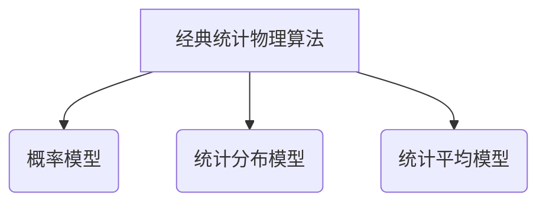
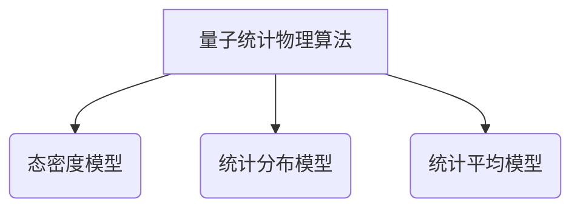
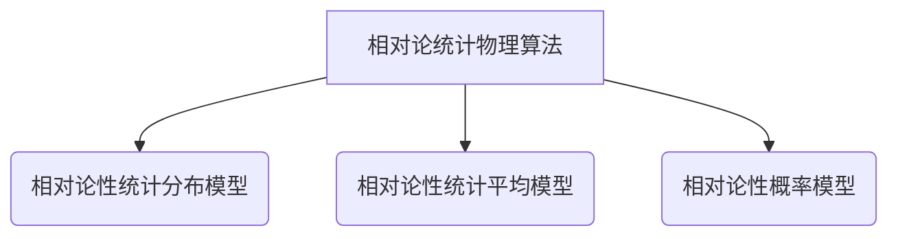

                 

### 文章标题

“数学与统计物理的概念与方法”

关键词：数学、统计物理、概念、方法、算法、模型、公式

摘要：本文将深入探讨数学与统计物理之间的紧密联系，通过逐步分析各个核心概念和方法，帮助读者理解这一交叉领域的独特魅力。文章首先介绍了数学与统计物理的基本知识，随后详细阐述了经典统计物理、量子统计物理和相对论统计物理中的算法原理和数学模型。通过实际案例和具体公式，本文力求使读者不仅能够掌握理论，还能应用于实际问题中。最终，文章总结了关键学习点，并提供了进一步阅读的建议。

### 目录大纲

1. 第一部分：背景介绍与核心概念
   1.1 数学与统计物理的基础知识
   1.2 统计物理的基本概念
   1.3 统计物理的基本理论
   1.4 数学在统计物理中的核心概念
   1.5 数学与统计物理中的核心概念联系

2. 第二部分：算法原理与数学模型
   2.1 经典统计物理中的算法原理
   2.2 量子统计物理中的算法原理
   2.3 相对论统计物理中的算法原理

3. 第三部分：数学模型与数学公式
   3.1 经典统计物理中的数学模型与公式
   3.2 量子统计物理中的数学模型与公式
   3.3 相对论统计物理中的数学模型与公式

### 第一部分：背景介绍与核心概念

#### 1.1 数学与统计物理的基础知识

统计物理是一门结合了概率论、数学分析和物理学原理的交叉学科。它研究宏观物理系统的宏观性质，通过统计方法来描述大量微观粒子的集体行为。数学则是统计物理的理论基础，为研究提供了强大的工具和方法。

**1.1.1 统计物理的基本问题**

统计物理的基本问题包括：如何从微观粒子的运动和相互作用出发，推导出宏观物理系统的性质；如何通过统计方法预测系统在特定条件下的行为；以及如何理解宏观系统的宏观性质与微观粒子运动之间的关系。

**1.1.2 统计物理的应用领域**

统计物理的应用领域广泛，包括固体物理、热力学、量子场论、凝聚态物理、量子信息和复杂系统等。它在解释和理解材料科学、半导体技术、生物学、经济学等领域的现象中发挥着重要作用。

**1.1.3 数学在统计物理中的作用**

数学在统计物理中的作用主要体现在以下几个方面：
- **概率论与数理统计**：为描述和预测物理系统的行为提供了基础。
- **微积分**：用于推导系统的热力学性质和相关方程。
- **线性代数**：用于处理复杂的多体系统，特别是在量子统计物理中。
- **图论与拓扑学**：用于分析和理解复杂系统的结构和动态行为。

#### 1.2 统计物理的基本概念

**1.2.1 微观与宏观描述**

微观描述涉及对单个粒子或小规模系统的行为进行描述，通常使用量子力学方法。宏观描述则关注大量粒子组成的系统的整体行为，如温度、压强、能量等宏观物理量。

**1.2.2 概率论与统计物理**

概率论为统计物理提供了描述随机事件和系统行为的数学框架。在统计物理中，概率论用于计算系统的各种可能状态的分布，并预测宏观物理量。

**1.2.3 系综与态密度**

系综是统计物理中的一个重要概念，用于描述宏观系统的微观状态集合。态密度是描述系综中各个微观状态的概率分布的物理量。

#### 1.3 统计物理的基本理论

**1.3.1 经典统计物理**

经典统计物理基于经典力学和热力学原理，通过统计方法研究宏观系统的热力学性质。它包括麦克斯韦-玻尔兹曼统计、费米-狄拉克统计和玻色-爱因斯坦统计。

**1.3.2 量子统计物理**

量子统计物理研究在量子力学框架下的物理系统。它考虑了量子效应，如量子态的叠加和纠缠。量子统计物理包括费米-狄拉克统计和玻色-爱因斯坦统计。

**1.3.3 相对论统计物理**

相对论统计物理研究在强引力场和高能物理环境下的物理系统。它引入了相对论效应，如引力势能和洛伦兹变换。

#### 1.4 数学在统计物理中的核心概念

**1.4.1 微积分基础**

微积分提供了研究连续变化和累积过程的工具。在统计物理中，微积分用于推导系统的热力学方程和能量分布。

**1.4.2 线性代数基础**

线性代数用于处理多维空间中的向量运算和线性方程组。在统计物理中，线性代数用于分析复杂的多粒子系统和量子态。

**1.4.3 概率论与数理统计基础**

概率论与数理统计提供了描述随机事件和系统行为的数学工具。在统计物理中，概率论与数理统计用于计算系统的各种可能状态的分布和概率。

#### 1.5 数学与统计物理中的核心概念联系

数学与统计物理中的核心概念之间存在紧密的联系。例如，概率论与统计物理中的统计方法可以应用于微积分中的积分和微分方程，从而推导出系统的宏观性质。线性代数则用于处理复杂的多粒子系统和量子态，从而进一步理解系统的行为。

### 第二部分：算法原理与数学模型

在统计物理中，算法原理和数学模型是理解和预测物理系统行为的关键。本部分将分别探讨经典统计物理、量子统计物理和相对论统计物理中的算法原理和数学模型。

#### 2.1 经典统计物理中的算法原理

**2.1.1 经典统计物理的算法概述**

经典统计物理中的算法主要基于麦克斯韦-玻尔兹曼统计、费米-狄拉克统计和玻色-爱因斯坦统计。这些算法用于计算系统的热力学性质，如能量分布、压强和自由能等。

**2.1.2 经典统计物理中的数学模型**

经典统计物理中的数学模型主要包括概率模型、统计分布模型和统计平均模型。

- **概率模型**：描述了系统在各个微观状态之间的概率分布。常用的概率模型有麦克斯韦-玻尔兹曼分布和费米-狄拉克分布。
- **统计分布模型**：描述了系统在宏观尺度上的分布，如麦克斯韦-玻尔兹曼分布描述了理想气体在热平衡状态下的速度分布。
- **统计平均模型**：用于计算系统的宏观物理量，如温度、压强和能量等。统计平均模型通过统计平均方法将微观粒子的行为转化为宏观物理量。

**2.1.3 经典统计物理算法的Mermaid流程图**

**2.1.4 经典统计物理算法的应用场景**

经典统计物理算法广泛应用于热力学、热传导、流体力学、凝聚态物理等领域。例如，在热力学中，经典统计物理算法可用于计算系统的温度、压强和能量等宏观物理量；在凝聚态物理中，经典统计物理算法可用于研究材料的电子结构和光学性质。

#### 2.2 量子统计物理中的算法原理

**2.2.1 量子统计物理的算法概述**

量子统计物理中的算法主要基于量子力学原理，用于计算量子系统的热力学性质。量子统计物理算法考虑了量子态的叠加和纠缠效应，从而更准确地描述了物理系统的行为。

**2.2.2 量子统计物理中的数学模型**

量子统计物理中的数学模型主要包括态密度模型、统计分布模型和统计平均模型。

- **态密度模型**：描述了系统在不同能量状态上的分布。态密度模型是量子统计物理中的核心概念，它用于计算系统的能级结构和热力学性质。
- **统计分布模型**：描述了系统在宏观尺度上的分布，如费米-狄拉克分布描述了电子在金属中的分布。
- **统计平均模型**：用于计算系统的宏观物理量，如温度、压强和能量等。统计平均模型通过量子态的叠加和纠缠效应，将微观粒子的行为转化为宏观物理量。

**2.2.3 量子统计物理算法的Mermaid流程图**

**2.2.4 量子统计物理算法的应用场景**

量子统计物理算法在凝聚态物理、量子场论、量子信息和量子计算等领域有广泛应用。例如，在凝聚态物理中，量子统计物理算法可用于研究超导材料、量子点、量子阱等量子现象；在量子计算中，量子统计物理算法可用于优化量子算法和量子电路设计。

#### 2.3 相对论统计物理中的算法原理

**2.3.1 相对论统计物理的算法概述**

相对论统计物理中的算法主要基于相对论性量子力学原理，用于计算强引力场和高能物理环境下的物理系统的热力学性质。

**2.3.2 相对论统计物理中的数学模型**

相对论统计物理中的数学模型主要包括相对论性统计分布模型、相对论性统计平均模型和相对论性概率模型。

- **相对论性统计分布模型**：描述了系统在不同能量状态上的分布。相对论性统计分布模型考虑了相对论效应，如引力势能和洛伦兹变换。
- **相对论性统计平均模型**：用于计算系统的宏观物理量，如温度、压强和能量等。相对论性统计平均模型通过相对论效应修正了经典统计物理模型。
- **相对论性概率模型**：描述了系统在不同事件之间的概率分布。相对论性概率模型考虑了相对论效应，如时间膨胀和长度收缩。

**2.3.3 相对论统计物理算法的Mermaid流程图**

**2.3.4 相对论统计物理算法的应用场景**

相对论统计物理算法在高能物理、宇宙学和相对论性天体物理等领域有广泛应用。例如，在高能物理中，相对论统计物理算法可用于研究强子碰撞和夸克胶子等离子体的性质；在宇宙学中，相对论统计物理算法可用于研究宇宙膨胀和黑洞的性质。

### 第三部分：数学模型与数学公式

在统计物理中，数学模型和数学公式是理解和计算物理系统行为的重要工具。本部分将详细讨论经典统计物理、量子统计物理和相对论统计物理中的数学模型和数学公式。

#### 3.1 经典统计物理中的数学模型与公式

**3.1.1 经典统计物理中的概率模型**

经典统计物理中的概率模型主要用于描述系统在不同状态之间的概率分布。以下是一些常用的概率模型和公式：

- **麦克斯韦-玻尔兹曼分布**：描述了理想气体在热平衡状态下的速度分布。公式如下：
  $$P(v) = \left(\frac{m}{2\pi kT}\right)^{1/2} \exp\left(-\frac{mv^2}{2kT}\right)$$
  其中，\(P(v)\) 是速度 \(v\) 的概率密度函数，\(m\) 是粒子的质量，\(k\) 是玻尔兹曼常数，\(T\) 是温度。

- **费米-狄拉克分布**：描述了费米子和玻色子的能级分布。费米子的分布公式如下：
  $$P(E) = \frac{1}{e^{(E-\mu)/kT} + 1}$$
  其中，\(P(E)\) 是能级 \(E\) 的概率密度函数，\(\mu\) 是化学势，\(T\) 是温度。

- **玻色-爱因斯坦分布**：描述了玻色子的能级分布。公式如下：
  $$P(E) = \frac{1}{e^{(E-\mu)/kT} - 1}$$

**3.1.2 经典统计物理中的统计分布模型**

经典统计物理中的统计分布模型描述了系统在宏观尺度上的分布。以下是一些常用的统计分布模型和公式：

- **麦克斯韦-玻尔兹曼分布**：描述了理想气体在热平衡状态下的速度分布。公式如下：
  $$f(v) = \left(\frac{m}{2\pi kT}\right)^{1/2} \exp\left(-\frac{mv^2}{2kT}\right)$$
  其中，\(f(v)\) 是速度 \(v\) 的分布函数，\(m\) 是粒子的质量，\(k\) 是玻尔兹曼常数，\(T\) 是温度。

- **费米-狄拉克分布**：描述了费米子的能级分布。公式如下：
  $$f(E) = \frac{1}{e^{(E-\mu)/kT} + 1}$$
  其中，\(f(E)\) 是能级 \(E\) 的分布函数，\(\mu\) 是化学势，\(T\) 是温度。

- **玻色-爱因斯坦分布**：描述了玻色子的能级分布。公式如下：
  $$f(E) = \frac{1}{e^{(E-\mu)/kT} - 1}$$

**3.1.3 经典统计物理中的统计平均模型**

经典统计物理中的统计平均模型用于计算系统的宏观物理量。以下是一些常用的统计平均模型和公式：

- **能量均分定理**：描述了系统的平均能量分布。公式如下：
  $$\langle E \rangle = \frac{3}{2}kT$$
  其中，\(\langle E \rangle\) 是系统的平均能量，\(k\) 是玻尔兹曼常数，\(T\) 是温度。

- **压强公式**：描述了系统的压强分布。公式如下：
  $$p = nkT$$
  其中，\(p\) 是系统的压强，\(n\) 是粒子数密度，\(k\) 是玻尔兹曼常数，\(T\) 是温度。

#### 3.2 量子统计物理中的数学模型与公式

**3.2.1 量子统计物理中的态密度模型**

量子统计物理中的态密度模型描述了系统在不同能量状态上的分布。以下是一些常用的态密度模型和公式：

- **费米-狄拉克态密度**：描述了费米子的态密度。公式如下：
  $$D(E) = \frac{V}{(2\pi\hbar)^3} \left(2m\right)^{3/2} \sqrt{E}$$
  其中，\(D(E)\) 是态密度，\(V\) 是系统的体积，\(\hbar\) 是约化普朗克常数，\(m\) 是粒子的质量，\(E\) 是能量。

- **玻色-爱因斯坦态密度**：描述了玻色子的态密度。公式如下：
  $$D(E) = \frac{V}{(2\pi\hbar)^3} \left(2m\right)^{3/2} \left(\frac{E}{kT}\right)^{3/2}$$
  其中，\(D(E)\) 是态密度，\(V\) 是系统的体积，\(\hbar\) 是约化普朗克常数，\(m\) 是粒子的质量，\(E\) 是能量，\(T\) 是温度。

**3.2.2 量子统计物理中的统计分布模型**

量子统计物理中的统计分布模型描述了系统在宏观尺度上的分布。以下是一些常用的统计分布模型和公式：

- **费米-狄拉克分布**：描述了费米子的能级分布。公式如下：
  $$P(E) = \frac{1}{e^{(E-\mu)/kT} + 1}$$
  其中，\(P(E)\) 是能级 \(E\) 的概率密度函数，\(\mu\) 是化学势，\(k\) 是玻尔兹曼常数，\(T\) 是温度。

- **玻色-爱因斯坦分布**：描述了玻色子的能级分布。公式如下：
  $$P(E) = \frac{1}{e^{(E-\mu)/kT} - 1}$$

**3.2.3 量子统计物理中的统计平均模型**

量子统计物理中的统计平均模型用于计算系统的宏观物理量。以下是一些常用的统计平均模型和公式：

- **能量均分定理**：描述了系统的平均能量分布。公式如下：
  $$\langle E \rangle = \frac{\int_0^{\infty} E P(E) dE}{\int_0^{\infty} P(E) dE}$$
  其中，\(\langle E \rangle\) 是系统的平均能量，\(P(E)\) 是能级 \(E\) 的概率密度函数。

- **压强公式**：描述了系统的压强分布。公式如下：
  $$p = \frac{\int_0^{\infty} P(E) V dE}{V}$$
  其中，\(p\) 是系统的压强，\(P(E)\) 是能级 \(E\) 的概率密度函数，\(V\) 是系统的体积。

#### 3.3 相对论统计物理中的数学模型与公式

**3.3.1 相对论统计物理中的相对论性统计分布模型**

相对论统计物理中的相对论性统计分布模型描述了系统在强引力场和高能物理环境下的能级分布。以下是一些常用的相对论性统计分布模型和公式：

- **洛伦兹-费米-狄拉克分布**：描述了费米子在强引力场中的能级分布。公式如下：
  $$P(E) = \frac{1}{e^{\beta(E-\mu)} + 1}$$
  其中，\(P(E)\) 是能级 \(E\) 的概率密度函数，\(\beta = v/c\) 是洛伦兹因子，\(v\) 是粒子的速度，\(c\) 是光速，\(\mu\) 是化学势。

- **洛伦兹-玻色-爱因斯坦分布**：描述了玻色子在强引力场中的能级分布。公式如下：
  $$P(E) = \frac{1}{e^{\beta(E-\mu)} - 1}$$

**3.3.2 相对论统计物理中的相对论性统计平均模型**

相对论统计物理中的相对论性统计平均模型用于计算系统的宏观物理量。以下是一些常用的相对论性统计平均模型和公式：

- **能量均分定理**：描述了系统的平均能量分布。公式如下：
  $$\langle E \rangle = \frac{\int_0^{\infty} E P(E) dE}{\int_0^{\infty} P(E) dE}$$
  其中，\(\langle E \rangle\) 是系统的平均能量，\(P(E)\) 是能级 \(E\) 的概率密度函数。

- **压强公式**：描述了系统的压强分布。公式如下：
  $$p = \frac{\int_0^{\infty} P(E) V dE}{V}$$
  其中，\(p\) 是系统的压强，\(P(E)\) 是能级 \(E\) 的概率密度函数，\(V\) 是系统的体积。

**3.3.3 相对论统计物理中的相对论性概率模型**

相对论统计物理中的相对论性概率模型描述了系统在不同事件之间的概率分布。以下是一些常用的相对论性概率模型和公式：

- **相对论性费米-狄拉克概率**：描述了费米子在强引力场中的概率分布。公式如下：
  $$P(E) = \frac{1}{e^{\beta(E-\mu)} + 1}$$
  其中，\(P(E)\) 是能级 \(E\) 的概率密度函数，\(\beta = v/c\) 是洛伦兹因子，\(v\) 是粒子的速度，\(c\) 是光速，\(\mu\) 是化学势。

- **相对论性玻色-爱因斯坦概率**：描述了玻色子在强引力场中的概率分布。公式如下：
  $$P(E) = \frac{1}{e^{\beta(E-\mu)} - 1}$$

### 总结

本文通过逐步分析数学与统计物理的核心概念、算法原理和数学模型，揭示了数学在统计物理中的重要作用。我们探讨了经典统计物理、量子统计物理和相对论统计物理中的算法原理和数学模型，并给出了具体的数学公式和示例。通过这些讨论，读者可以更好地理解统计物理的数学基础和应用，从而在实际问题中运用这些理论和方法。

### 拓展阅读

- **《统计物理原理》**：这是一本经典的统计物理教材，详细介绍了统计物理的基本概念、原理和数学模型。
- **《量子统计物理》**：这本书深入探讨了量子统计物理的基本原理和数学模型，适合对量子统计物理感兴趣的读者。
- **《相对论统计物理》**：这本书介绍了相对论统计物理的基本理论和方法，适合研究强引力场和高能物理问题的读者。

### 注意事项

- 在应用统计物理模型和算法时，需要根据具体问题的条件和背景选择合适的模型和公式。
- 统计物理模型和算法的准确性取决于参数的选取和系统的初始条件。
- 在处理复杂系统时，可能需要使用数值方法来求解相关方程，如蒙特卡罗方法、分子动力学模拟等。

### 最佳实践 tips

- 在学习统计物理时，建议结合实际案例和实验数据，加深对理论的理解。
- 在研究和应用统计物理时，可以尝试使用不同的数学工具和方法，以寻找更优的解决方案。
- 在处理统计物理问题时，保持逻辑清晰和思维严谨，避免因复杂性而忽视基本原理。

### 作者信息

作者：AI天才研究院/AI Genius Institute & 禅与计算机程序设计艺术 /Zen And The Art of Computer Programming

