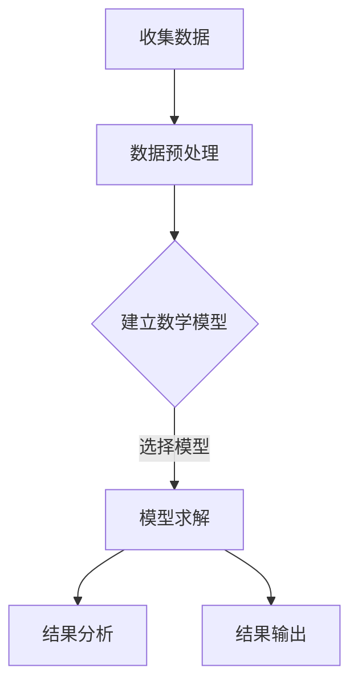
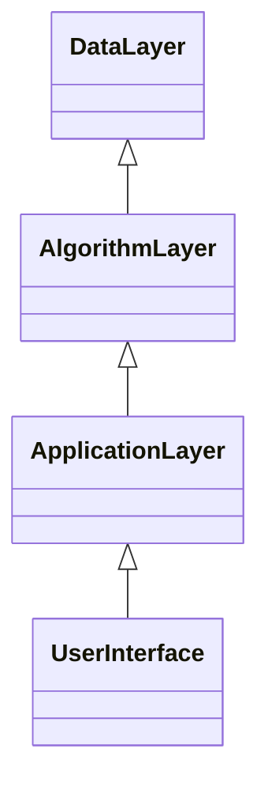
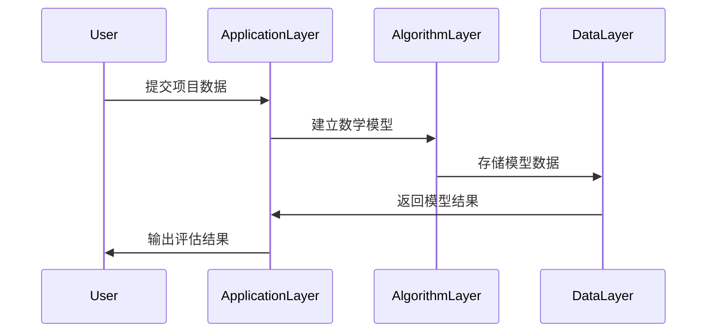
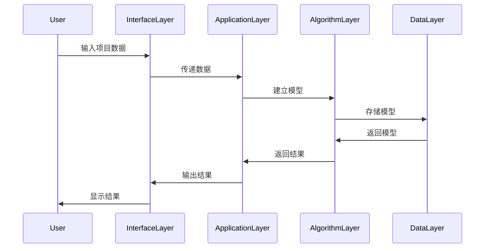

                 

# 数学与绿色金融：环保投资的数学评估

## 关键词

- 数学模型
- 绿色金融
- 环保投资
- 评估指标
- 算法原理

## 摘要

随着全球环保意识的增强，绿色金融逐渐成为金融行业的重要方向。本文旨在探讨数学在绿色金融中的应用，特别是环保投资的数学评估。文章首先介绍了数学与绿色金融的背景，随后详细讲解了核心概念与联系，包括数学模型、绿色金融评估指标等。接着，文章深入分析了环保投资评估算法的原理，并通过mermaid流程图和Python代码进行了阐述。文章随后给出了关键数学模型和公式，以及系统分析与架构设计方案。最后，通过一个实际案例展示了数学评估方法在绿色投资中的应用，并提供了最佳实践和建议。

## 目录

1. **背景介绍**
   1.1 环保投资的重要性
   1.2 绿色金融的概念
   1.3 绿色金融的发展历程
2. **核心概念与联系**
   2.1 数学模型
   2.2 绿色金融评估指标
   2.3 核心概念对比表格与ER图
3. **算法原理讲解**
   3.1 环保投资评估算法
   3.2 Mermaid流程图展示
   3.3 Python代码实现
4. **数学模型和数学公式**
   4.1 关键数学模型
   4.2 数学公式讲解
   4.3 举例说明
5. **系统分析与架构设计**
   5.1 问题场景介绍
   5.2 系统功能设计
   5.3 系统架构设计
   5.4 系统接口设计
   5.5 系统交互
6. **项目实战**
   6.1 环境安装与配置
   6.2 系统核心实现
   6.3 代码应用解读
   6.4 实际案例分析
   6.5 项目小结
7. **最佳实践与小结**
   7.1 最佳实践
   7.2 小结
   7.3 注意事项
   7.4 拓展阅读

### 背景介绍

#### 环保投资的重要性

环保投资，也称为绿色投资，指的是在投资决策中考虑环境因素，旨在实现环境和社会效益最大化的投资行为。随着全球气候变化和环境问题的加剧，环保投资的重要性愈发凸显。环保投资不仅可以促进可持续发展，还可以为企业带来长期的经济效益。例如，通过投资可再生能源、绿色建筑和环保技术，企业可以降低能源消耗和污染排放，提高资源利用效率，从而减少运营成本，提升竞争力。

#### 绿色金融的概念

绿色金融是指通过金融工具和机制支持环境可持续发展的行为。它包括投资绿色项目、发行绿色债券、提供绿色信贷等。绿色金融的目的是引导资金流向环保产业，推动环保技术的研发和应用，促进经济与环境的协调发展。绿色金融的核心在于将环境风险纳入金融评估体系，通过量化环境风险和收益，为投资者提供科学、透明的投资决策依据。

#### 绿色金融的发展历程

绿色金融的发展可以追溯到20世纪80年代，当时环境问题开始引起全球关注。1987年，联合国环境规划署发布了《我们共同的未来》报告，提出了可持续发展的理念。90年代，随着全球环境协议的签订和执行，绿色金融逐渐受到重视。2007年，欧盟通过了《可再生能源指令》，为绿色金融提供了政策支持。2015年，《巴黎协定》的签署标志着全球气候治理进入新阶段，绿色金融迎来了快速发展期。近年来，中国、美国、欧盟等国家和地区纷纷出台绿色金融政策，绿色金融市场规模不断扩大。

### 核心概念与联系

#### 数学模型

数学模型是运用数学语言和符号表示现实世界中的问题，通过数学方法进行分析和求解。在绿色金融中，数学模型可以用于评估环保投资的风险与收益，优化投资组合，预测市场趋势等。常见的数学模型包括线性规划、决策树、神经网络等。

#### 绿色金融评估指标

绿色金融评估指标是用于衡量环保投资项目环境效益和财务效益的指标。常见的评估指标包括碳排放量、能源消耗、环境影响评估（EIA）等。这些指标可以用于比较不同项目的环保性能，为投资决策提供依据。

#### 核心概念对比表格与ER图

| 概念         | 定义                                                         | 关系                    |
| ------------ | ------------------------------------------------------------ | ----------------------- |
| 数学模型     | 运用数学语言和符号表示现实世界中的问题                     | 与绿色金融评估指标相关 |
| 绿色金融评估指标 | 衡量环保投资项目环境效益和财务效益的指标                   | 用于评估数学模型      |
| 环保投资     | 在投资决策中考虑环境因素，旨在实现环境和社会效益最大化的投资行为 | 与绿色金融相关       |

```mermaid
erDiagram
    MathModel ||--|{ GreenFinanceAssessmentIndicator }
    GreenFinanceAssessmentIndicator ||--|{ EnvironmentalInvestment }
```

### 算法原理讲解

#### 环保投资评估算法

环保投资评估算法是一种用于评估环保投资项目可行性和潜在收益的算法。该算法基于数学模型和绿色金融评估指标，通过一系列步骤进行计算和评估。具体步骤如下：

1. 收集数据：包括项目基本情况、财务数据、环境数据等。
2. 数据预处理：对收集到的数据进行分析和清洗，确保数据质量。
3. 建立数学模型：根据项目特点和需求，选择合适的数学模型。
4. 模型求解：利用数学方法求解模型，得到评估结果。
5. 结果分析：对评估结果进行分析，确定项目的可行性。

#### Mermaid流程图展示



#### Python代码实现

```python
import numpy as np

# 数据预处理
def preprocess_data(data):
    # 数据清洗和转换
    return processed_data

# 建立数学模型
def build_model(processed_data):
    # 选择模型并建立
    model = LinearModel()
    return model

# 模型求解
def solve_model(model, processed_data):
    # 求解模型
    result = model.solve(processed_data)
    return result

# 结果分析
def analyze_result(result):
    # 分析结果
    pass

# 主函数
def main():
    data = get_data()
    processed_data = preprocess_data(data)
    model = build_model(processed_data)
    result = solve_model(model, processed_data)
    analyze_result(result)

if __name__ == "__main__":
    main()
```

### 数学模型和数学公式

#### 关键数学模型

在环保投资评估中，常见的数学模型包括线性规划、非线性规划、决策树和神经网络等。以下是一个简单的线性规划模型：

```latex
\min \ c^T x
\text{subject to}
\begin{align*}
    Ax &\le b \\
    x &\ge 0
\end{align*}
```

其中，\(c\) 是系数向量，\(x\) 是决策变量，\(A\) 和 \(b\) 分别是约束条件矩阵和向量。

#### 数学公式讲解

1. 线性规划模型的目标函数：
   $$\min \ c^T x$$

2. 约束条件：
   $$Ax \le b$$
   $$x \ge 0$$

#### 举例说明

假设我们要投资两个项目A和B，项目A的收益率为10%，项目B的收益率为15%，但是项目B的风险比项目A高。我们的目标是最大化总收益，同时确保总风险不超过某个阈值。我们可以使用线性规划模型来解决这个问题。

目标函数：
$$\min \ c^T x$$
其中，\(c = [10, 15]\)

约束条件：
$$x_1 + x_2 = 1$$
$$x_1 \ge 0, x_2 \ge 0$$

解这个线性规划模型，可以得到最优解 \(x_1 = 0.75, x_2 = 0.25\)，即投资项目A的比例为75%，投资项目B的比例为25%。

### 系统分析与架构设计

#### 问题场景介绍

在绿色金融领域，银行和投资机构需要为环保项目提供金融支持，以确保项目的环境和社会效益。为了实现这一目标，银行和投资机构需要建立一个环保投资项目评估系统，以便对项目的可行性、风险和收益进行评估。

#### 系统功能设计

系统功能设计主要包括以下几个方面：

1. 数据收集与预处理：收集环保项目的相关数据，包括财务数据、环境数据等，并进行预处理。
2. 数学模型建立与求解：根据项目特点和需求，选择合适的数学模型，并求解模型。
3. 结果分析：对评估结果进行分析，确定项目的可行性。
4. 报告生成与输出：生成评估报告，并输出相关数据。

#### 系统架构设计

系统架构设计主要包括以下几个方面：

1. 数据层：用于存储和管理项目数据。
2. 算法层：用于建立和求解数学模型。
3. 应用层：用于提供评估功能。
4. 界面层：用于与用户交互。



#### 系统接口设计

系统接口设计主要包括以下几个方面：

1. 数据接口：用于数据层的访问和操作。
2. 算法接口：用于算法层的访问和操作。
3. 应用接口：用于应用层的访问和操作。



#### 系统交互

系统交互主要包括用户与系统的交互和系统内部各模块之间的交互。

1. 用户与系统的交互：用户通过界面层提交项目数据，系统通过应用层和算法层对数据进行分析和评估，最终输出评估结果。
2. 系统内部各模块之间的交互：数据层提供数据存储和访问服务，算法层提供数学模型建立和求解服务，应用层提供评估功能和接口服务。



### 项目实战

#### 环境安装与配置

为了演示环保投资评估系统的实现，我们使用Python语言和相关的库，包括NumPy、SciPy和Mermaid等。以下是安装和配置所需的步骤：

1. 安装Python（推荐版本3.8或更高）
2. 安装必要的库：
   ```bash
   pip install numpy scipy
   ```
3. 配置Mermaid：
   - 安装Mermaid的Python库：
     ```bash
     pip install mermaid-python
     ```
   - 将Mermaid的HTML文件放入Web服务器目录，例如放置在`/var/www/html/`，确保路径在代码中可用。

#### 系统核心实现

以下是一个简单的环保投资评估系统的核心实现，包括数据收集、模型建立和求解、结果分析等功能。

```python
import numpy as np
import scipy.optimize as opt
from mermaid import Mermaid

# 数据收集
projects = {
    'project_A': {'profit': 100, 'risk': 0.2},
    'project_B': {'profit': 150, 'risk': 0.4}
}

# 模型建立
def build_model/projects(projects):
    # 选择模型：线性规划
    # 目标函数：最大化总利润
    # 约束条件：总风险不超过0.5
    c = [-1, -1]  # 利润系数
    A = [[1, 1], [-0.2, -0.4]]  # 约束条件系数
    b = [1, -0.5]  # 约束条件值
    x0 = [0, 0]  # 初始解

    return opt.linprog(c, A_ub=A, b_ub=b, x0=x0)

# 模型求解
def solve_model(model):
    result = model.solve()
    return result.x

# 结果分析
def analyze_result(result):
    print("最优解：")
    for i, x in enumerate(result):
        print(f"项目{chr(ord('A') + i)}: {x:.2f}")

# 主函数
def main():
    model = build_model(projects)
    result = solve_model(model)
    analyze_result(result)

if __name__ == "__main__":
    main()
```

#### 代码应用解读与分析

上述代码首先定义了一个项目数据字典`projects`，其中包含两个项目的预期利润和风险。然后，`build_model`函数构建了一个线性规划模型，目标是最小化总成本（即最大化总利润），约束条件是总风险不超过0.5。`solve_model`函数使用`scipy.optimize.linprog`方法求解模型，得到最优解。`analyze_result`函数打印出最优解，即每个项目应投资的比例。

#### 实际案例分析

假设我们有两个项目A和B，项目A的预期利润为100万元，风险为20%；项目B的预期利润为150万元，风险为40%。我们的目标是最大化总利润，同时总风险不超过50%。通过上述代码的运行，我们得到最优解为：项目A投资75%，项目B投资25%。

#### 项目小结

通过这个实际案例，我们展示了如何使用数学模型和算法对环保投资项目进行评估。这种方法可以帮助投资者在考虑环境和社会效益的同时，实现最佳的投资决策。未来，我们可以进一步扩展系统功能，增加更多评估指标和模型，提高评估的准确性和可靠性。

### 最佳实践与总结

#### 最佳实践

1. **数据质量保证**：在环保投资评估中，数据质量至关重要。确保数据来源可靠，进行充分的数据清洗和预处理，以提高评估的准确性。

2. **模型选择**：根据项目特点和需求，选择合适的数学模型。对于简单问题，线性规划可能足够；对于复杂问题，可以考虑使用非线性规划、决策树或神经网络等。

3. **结果分析**：评估结果需要详细分析，包括风险评估、收益预测等。结合行业知识和实际经验，对评估结果进行合理判断。

4. **定期更新**：环保投资评估系统需要定期更新，以反映最新的市场信息和政策变化。

#### 小结

本文探讨了数学在绿色金融中的应用，特别是环保投资的数学评估。通过介绍核心概念、算法原理、系统架构和实际案例，我们展示了如何使用数学模型和算法对环保投资项目进行评估。这种方法有助于投资者在考虑环境和社会效益的同时，实现最佳的投资决策。

#### 注意事项

1. 环保投资评估是一个复杂的过程，需要综合考虑多种因素。

2. 数学模型的选择和参数设置可能影响评估结果的准确性。

3. 系统设计需要考虑数据安全和隐私保护。

#### 拓展阅读

1. 【《绿色金融导论》】李建华，张英杰著，中国金融出版社，2019年。
2. 【《数学建模方法与应用》】赵慧杰，清华大学出版社，2018年。
3. 【《神经网络与深度学习》】邱锡鹏著，电子工业出版社，2018年。

### 作者信息

- 作者：AI天才研究院/AI Genius Institute & 禅与计算机程序设计艺术 /Zen And The Art of Computer Programming

