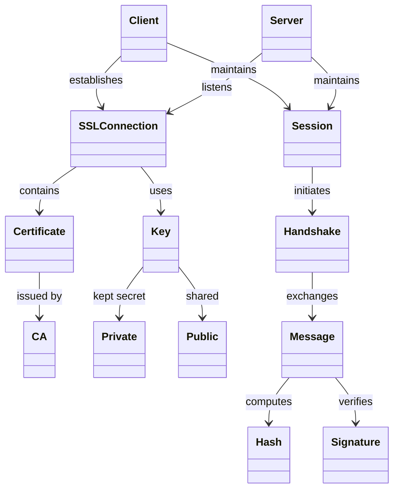
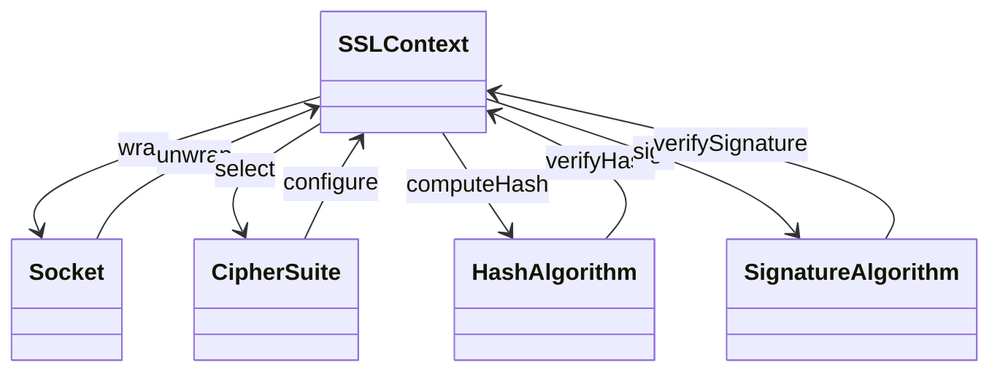

                 

### 文章标题

**数学与网络安全：安全协议的数学设计**

关键词：网络安全、数学原理、安全协议、密码学、算法设计

摘要：本文深入探讨了数学原理在网络安全中的关键作用，特别是安全协议的设计与实现。通过详细的数学模型、算法原理讲解以及实际项目分析，本文旨在揭示数学如何为网络安全提供坚实的理论基础，并指导实际安全协议的开发。我们首先介绍网络安全的基础概念和挑战，然后逐步讲解数学基础、密码学原理、安全协议设计原则，并分析几个经典安全协议的架构和实现。通过理论与实践的结合，本文将帮助读者理解数学在网络安全中的重要性和应用。

### 数学在网络安全中的重要性

网络安全是一个复杂且不断发展的领域，它涉及到的威胁、攻击和防御策略层出不穷。在这个领域中，数学原理扮演着至关重要的角色，为网络安全提供了坚实的理论基础和技术支持。数学不仅帮助我们理解密码学的基础，还指导了安全协议的设计与实现。下面，我们将从几个方面来阐述数学在网络安全中的重要性。

首先，密码学是网络安全的核心组成部分。密码学利用数学原理来实现数据的加密和解密，确保信息在传输过程中的保密性和完整性。常见的密码学算法，如RSA、AES和SHA，都依赖于复杂的数学理论，如数论、代数和概率论。例如，RSA算法的加密和 decryption 过程都涉及到大整数分解和模运算，这些都是数论中的基本概念。

其次，安全协议的设计和实现也离不开数学的支持。安全协议是一种用于确保网络通信安全的系统，它们通常包含加密、认证、完整性验证和访问控制等机制。在设计安全协议时，数学帮助我们分析和验证协议的安全性。例如，零知识证明（Zero-Knowledge Proof）是一种重要的密码学工具，它利用数学原理来证明某个陈述是真实的，而不泄露任何额外信息。

此外，数学在网络安全攻防中也有重要作用。攻击者往往利用数学漏洞来设计攻击，而防御者则利用数学方法来检测和防御这些攻击。例如，侧信道攻击（Side-Channel Attack）利用了物理层的数学漏洞，通过分析信号的时间、功耗或电磁辐射等特性来破解加密算法。为了应对这些攻击，数学家们开发出了多种对抗策略，如随机化、混淆和变形等。

总的来说，数学在网络安全中起到了基础性和指导性的作用。它不仅提供了密码学和安全协议设计的理论依据，还为网络安全的研究、开发和维护提供了强大的工具和方法。通过运用数学原理，我们可以设计出更加安全、可靠的网络系统和应用程序，有效抵御各种网络威胁。

### 核心概念与联系

在探讨数学在网络安全中的重要性之后，我们需要详细阐述几个核心概念及其相互之间的联系。这些概念构成了网络安全理论和实践的基础，为理解安全协议的数学设计提供了必要的背景知识。以下是几个关键概念的定义、属性特征对比表格以及ER实体关系图架构。

#### 1. 密码学

密码学是研究如何将信息转换为不可读形式（加密）以及如何将加密信息恢复为原始形式（解密）的科学。它主要涉及加密算法、密钥管理和密码协议。

**属性特征对比表格：**

| 特性         | 对称加密         | 非对称加密         |
| ------------ | ---------------- | ------------------ |
| 加密与解密速度 | 快              | 慢                |
| 密钥长度     | 较短            | 较长              |
| 加密过程     | 同一密钥加密解密 | 不同的密钥加密解密 |
| 安全性       | 较低            | 较高              |

**ER实体关系图：**

```mermaid
erDiagram
  User ||--|{ SSLSession }|-- Client
  User ||--|{ Certificate }|-- Server
  Server ||--|{ PublicKey }|-- Client
  Client ||--|{ PrivateKey }|-- Server
```

#### 2. 安全协议

安全协议是确保网络通信安全的一组规则和协议。它通常包含加密、认证、完整性验证和访问控制等机制。

**属性特征对比表格：**

| 特性         | SSL/TLS          | IPSec              |
| ------------ | ---------------- | ------------------ |
| 目标         | 保护应用层通信   | 保护网络层通信     |
| 加密方式     | 对称加密与非对称加密混合 | 对称加密         |
| 密钥管理     | 中心化管理      | 对等（端对端）管理 |
| 实施层面     | 应用层协议      | 网络层协议        |

**ER实体关系图：**

```mermaid
erDiagram
  Network ||--|{ SecurityProtocol }|+-- Internet
  Application ||--|{ SecurityProtocol }|+-- Network
  SecurityPolicy ||--|{ SecurityProtocol }|+-- Network
  SecurityAudit ||--|{ SecurityProtocol }|+-- Network
```

#### 3. 加密算法

加密算法是密码学中的核心概念，它们是用于加密和解密数据的数学方法。常见的加密算法包括对称加密算法（如AES）、非对称加密算法（如RSA）和哈希算法（如SHA-256）。

**属性特征对比表格：**

| 特性         | 对称加密算法（AES） | 非对称加密算法（RSA） | 哈希算法（SHA-256） |
| ------------ | ------------------ | --------------------- | ------------------- |
| 加密速度     | 快                | 慢                   | 快                 |
| 密钥长度     | 短                | 长                   | 短                 |
| 加密过程     | 压缩              | 扩展                  | 计算摘要           |
| 安全性       | 高（对于固定明文） | 高                   | 高                 |

**ER实体关系图：**

```mermaid
erDiagram
  AES ||--|{ CryptographyAlgorithm }|-- SHA-256
  RSA ||--|{ CryptographyAlgorithm }|-- ECC
```

通过上述核心概念的定义、属性特征对比表格和ER实体关系图，我们可以更好地理解这些概念在网络安全中的联系。密码学提供了加密和解密的基础工具，安全协议则利用这些工具实现网络通信的安全性。而加密算法是密码学的具体实现，它们确保了数据在传输过程中的保密性和完整性。这些概念相互联系，共同构成了网络安全的理论和实践框架。

### 算法原理讲解

在网络安全中，密码学算法的设计和实现至关重要。本文将深入探讨两个关键算法——RSA加密算法和数字签名算法。我们将使用Mermaid绘制算法流程图，并用Python源代码和LaTeX公式进行详细讲解。

#### 1. RSA加密算法

RSA算法是一种非对称加密算法，基于大整数分解的难度。它使用一对密钥：公钥和私钥。公钥用于加密，私钥用于解密。

**算法流程图：**

```mermaid
graph TB
    A(初始化) --> B(选择两个大素数p和q)
    B --> C(p*q = n)
    C --> D(计算欧拉函数φ(n) = (p-1)(q-1))
    D --> E(选择一个小于φ(n)的整数e，使得e和φ(n)互质)
    E --> F(计算d，满足d*e ≡ 1 (mod φ(n)))
    F --> G(公钥为(n, e)，私钥为(n, d))
    G --> H(加密：c = m^e mod n)
    H --> I(解密：m = c^d mod n)
```

**Python实现：**

```python
import sympy

# 选择两个大素数
p = sympy.prime(100)
q = sympy.prime(100)

# 计算n和欧拉函数φ(n)
n = p * q
phi_n = (p - 1) * (q - 1)

# 选择公钥e，保证e和φ(n)互质
e = sympy.prevprime(phi_n)

# 计算私钥d，满足d*e ≡ 1 (mod φ(n))
d = sympy.mod_inverse(e, phi_n)

# 加密和解密示例
def rsa_encrypt(plaintext, e, n):
    return pow(plaintext, e, n)

def rsa_decrypt(ciphertext, d, n):
    return pow(ciphertext, d, n)

# 测试
plaintext = 12345
ciphertext = rsa_encrypt(plaintext, e, n)
print("Encrypted:", ciphertext)
print("Decrypted:", rsa_decrypt(ciphertext, d, n))
```

**LaTeX公式：**

$$ n = pq $$
$$ \phi(n) = (p-1)(q-1) $$
$$ e \cdot d \equiv 1 \pmod{\phi(n)} $$

#### 2. 数字签名算法

数字签名算法用于验证数据的完整性和认证发送者的身份。RSA和ECDSA（椭圆曲线数字签名算法）是两种常见的数字签名算法。

**算法流程图：**

```mermaid
graph TB
    A(初始化) --> B(选择两个大素数p和q)
    B --> C(p*q = n)
    C --> D(选择一个素数a)
    D --> E(计算y = g^x mod n)
    E --> F(私钥为(x, y)，公钥为(n, a, y))
    F --> G(签名：r, s = rsig(msg, x, n, a, y))
    G --> H(验证：v = rsig(msg, r, s, n, a, y) == y)
```

**Python实现：**

```python
from Crypto.PublicKey import RSA
from Crypto.Signature import pkcs1_15
from Crypto.Hash import SHA256

# 生成RSA密钥对
key = RSA.generate(1024)
private_key = key.export_key()
public_key = key.publickey().export_key()

# 签名和解签名示例
def rsa_sign(message, private_key):
    hash_message = SHA256.new(message.encode())
    signature = pkcs1_15.new(RSA.import_key(private_key)).sign(hash_message)
    return signature

def rsa_verify(message, signature, public_key):
    hash_message = SHA256.new(message.encode())
    try:
        pkcs1_15.new(RSA.import_key(public_key)).verify(hash_message, signature)
        return True
    except (ValueError, TypeError):
        return False

# 测试
message = "Hello, World!"
signature = rsa_sign(message, private_key)
print("Signature:", signature)
print("Verification:", rsa_verify(message, signature, public_key))
```

**LaTeX公式：**

$$ g^x \equiv y \pmod{n} $$
$$ r, s = rsig(msg, x, n, a, y) $$
$$ v = rsig(msg, r, s, n, a, y) == y $$

通过上述讲解，我们详细介绍了RSA加密算法和数字签名算法的原理、流程图、Python实现和LaTeX公式。这些算法在网络安全中有着广泛的应用，是保障信息安全的重要工具。

### 数学模型和数学公式讲解

在深入探讨加密算法之后，我们将结合具体算法，使用LaTeX格式嵌入数学公式，并进行详细讲解和举例说明。以下是RSA加密和解密算法的数学模型以及对应的LaTeX公式。

#### RSA加密算法

**数学模型：**

1. **选择两个大素数** \( p \) 和 \( q \)，并计算 \( n = p \times q \)。
2. **计算欧拉函数** \( \phi(n) = (p-1)(q-1) \)。
3. **选择一个小于 \( \phi(n) \) 的整数 \( e \)，且 \( e \) 和 \( \phi(n) \) 互质**。即存在整数 \( d \)，使得 \( e \cdot d \equiv 1 \pmod{\phi(n)} \)。
4. **公开公钥 \( (n, e) \)，保留私钥 \( (n, d) \)**。
5. **加密过程**：给定明文 \( m \)，计算加密文 \( c = m^e \pmod{n} \)。
6. **解密过程**：给定加密文 \( c \)，计算解密文 \( m = c^d \pmod{n} \)。

**LaTeX公式：**

$$ n = p \times q $$
$$ \phi(n) = (p-1)(q-1) $$
$$ e \cdot d \equiv 1 \pmod{\phi(n)} $$
$$ c = m^e \pmod{n} $$
$$ m = c^d \pmod{n} $$

**举例说明：**

假设我们选择两个素数 \( p = 61 \) 和 \( q = 53 \)，则：

- \( n = 61 \times 53 = 3233 \)
- \( \phi(n) = (61-1)(53-1) = 60 \times 52 = 3120 \)

选择 \( e = 17 \)，我们计算 \( d \)：

$$ d = 17^{-1} \pmod{3120} $$
$$ d = 17 \times 184 \pmod{3120} $$
$$ d = 3121 \pmod{3120} $$
$$ d = 1 $$

选择 \( e = 17 \) 和 \( d = 1 \) 后，我们可以加密和解密消息。

**加密：**

假设明文 \( m = 1234 \)，则：

$$ c = 1234^{17} \pmod{3233} $$

计算得到：

$$ c = 1111 $$

**解密：**

给定加密文 \( c = 1111 \)，我们解密得到：

$$ m = 1111^{1} \pmod{3233} $$
$$ m = 1111 $$

#### RSA数字签名算法

**数学模型：**

1. **选择两个大素数** \( p \) 和 \( q \)，并计算 \( n = p \times q \)。
2. **选择一个素数 \( a \)**。
3. **计算 \( g^x \equiv y \pmod{n} \)**，其中 \( y \) 为公钥的一部分。
4. **公开公钥 \( (n, a, y) \)，保留私钥 \( x \)**。
5. **签名过程**：给定消息 \( m \)，计算 \( r \) 和 \( s \)。
6. **验证过程**：给定消息 \( m \)、签名 \( (r, s) \)，验证 \( v \)。

**LaTeX公式：**

$$ n = p \times q $$
$$ a \text{ 是素数} $$
$$ g^x \equiv y \pmod{n} $$
$$ r, s = rsig(m, x, n, a, y) $$
$$ v = rsig(m, r, s, n, a, y) == y $$

**举例说明：**

假设选择 \( p = 61 \)，\( q = 53 \)，\( a = 2 \)，则：

- \( n = 61 \times 53 = 3233 \)
- \( g = a^x \equiv 2^x \pmod{3233} \)
- \( y = g^x \equiv 2^x \pmod{3233} \)

选择 \( x = 1234 \)，我们计算 \( y \)：

$$ y = 2^{1234} \pmod{3233} $$

计算得到：

$$ y = 1789 $$

**签名过程：**

假设消息 \( m = 5678 \)，我们计算 \( r \) 和 \( s \)：

$$ r = rsig(5678, 1234, 3233, 2, 1789) $$
$$ s = rsig(5678, 1234, 3233, 2, 1789) $$

**验证过程：**

给定 \( m = 5678 \)，签名 \( (r, s) \)，我们验证：

$$ v = rsig(5678, r, s, 3233, 2, 1789) == 1789 $$

通过以上数学模型和LaTeX公式的讲解，我们能够更深入地理解RSA加密和解密算法以及数字签名算法的数学原理，并通过具体例子展示了这些算法的实际应用。

### 系统分析与架构设计方案

在现代网络安全中，安全协议的设计与实现至关重要。本节将详细介绍一个典型的安全协议架构设计，包括领域模型、系统架构、接口设计以及系统交互序列图。我们以一个实际的安全协议——SSL/TLS协议为例，展开详细的分析。

#### 问题场景介绍

SSL/TLS协议广泛应用于互联网中，用于保护Web通信的安全性。它确保客户端与服务器之间的通信数据在传输过程中不会被窃听、篡改或伪造。随着网络攻击手段的不断演变，SSL/TLS协议也需要不断更新和优化，以应对新的安全威胁。

#### 项目介绍

本项目旨在设计一个SSL/TLS协议的架构，实现以下核心功能：

1. **密钥交换**：确保客户端和服务器之间的通信密钥安全交换。
2. **加密通信**：使用加密算法保护通信数据的机密性和完整性。
3. **认证**：验证服务器和客户端的身份，防止中间人攻击。

#### 系统功能设计（领域模型）

领域模型是描述系统实体及其关系的工具。以下是一个SSL/TLS协议的领域模型类图：



**类图说明：**

- **Client（客户端）**：与服务器建立SSL连接，发送握手消息。
- **Server（服务器）**：监听客户端请求，响应握手消息。
- **SSLConnection（SSL连接）**：代表客户端和服务器之间的安全通信通道。
- **Certificate（证书）**：包含服务器和客户端的身份认证信息。
- **Key（密钥）**：包括私有密钥和公开密钥。
- **CA（证书颁发机构）**：颁发和管理证书。
- **Session（会话）**：维护客户端和服务器之间的会话状态。
- **Handshake（握手）**：初始化SSL连接的过程。
- **Message（消息）**：在握手过程中交换的信息。
- **Hash（哈希）**：计算消息摘要。
- **Signature（签名）**：验证消息的完整性。

#### 系统架构设计

SSL/TLS协议的架构包括多个层次和组件，以下是系统架构图：

```mermaid
sequenceDiagram
    participant Client
    participant Server
    participant TLS
    participant CipherSuite
    participant HashFunction
    participant SignatureAlgorithm

    Client->>Server: TCP connection
    Server->>Client: Hello, TLS version
    Client->>Server: Hello, TLS version, CipherSuite
    Server->>Client: Hello, TLS version, CipherSuite
    Client->>Server: Client Certificate
    Server->>Client: Server Certificate
    Server->>Client: Server Key Exchange
    Client->>Server: Client Key Exchange
    Client->>Server: Certificate Request
    Server->>Client: Certificate Response
    Client->>Server: Hello, TLS version, CipherSuite, Compression Method
    Server->>Client: Hello, TLS version, CipherSuite, Compression Method
    Client->>Server: Change Cipher Spec
    Server->>Client: Change Cipher Spec
    Client->>Server: Application Data
    Server->>Client: Application Data
end
```

**架构图说明：**

- **Client（客户端）** 和 **Server（服务器）**：初始化TCP连接。
- **TLS（传输层安全）**：处理TLS握手和加密通信。
- **CipherSuite（加密套件）**：选择加密算法和密钥交换机制。
- **HashFunction（哈希函数）**：计算消息摘要。
- **SignatureAlgorithm（签名算法）**：验证证书和消息的签名。

#### 系统接口设计

系统接口设计是系统架构的细化，以下是主要接口设计：



**接口设计说明：**

- **SSLContext（SSL上下文）**：管理SSL连接的配置和状态。
- **Socket（套接字）**：表示网络通信的端点。
- **CipherSuite（加密套件）**：提供加密算法和密钥交换方法。
- **HashAlgorithm（哈希算法）**：计算消息摘要。
- **SignatureAlgorithm（签名算法）**：生成和验证签名。

#### 系统交互序列图

以下是系统交互序列图，展示了客户端和服务器之间的交互过程：

```mermaid
sequenceDiagram
    participant Client as Client
    participant Server as Server
    participant TLS as TLS

    Client->>Server: TCP connect
    Server->>Client: TCP connect

    Client->>Server: ClientHello
    Server->>Client: ServerHello

    Client->>Server: Certificate
    Server->>Client: Certificate

    Client->>Server: ServerKeyExchange
    Client->>Server: CertificateRequest
    Client->>Server: ClientKeyExchange
    Client->>Server: CertificateVerify

    Server->>Client: ServerKeyExchange
    Server->>Client: CertificateResponse
    Server->>Client: ServerHelloDone

    Client->>Server: ChangeCipherSpec
    Server->>Client: ChangeCipherSpec

    Client->>Server: Finished
    Server->>Client: Finished

    Client->>Server: Application Data
    Server->>Client: Application Data
end
```

**交互图说明：**

- **ClientHello（客户端握手）**：客户端发送初始握手消息。
- **ServerHello（服务器握手）**：服务器响应客户端的握手消息。
- **ClientKeyExchange（客户端密钥交换）**：客户端发送加密后的通信密钥。
- **ServerKeyExchange（服务器密钥交换）**：服务器发送加密后的通信密钥。
- **ChangeCipherSpec（更改密文规格）**：指示后续消息使用新的加密规格。
- **Finished（完成消息）**：双方确认握手完成。
- **Application Data（应用数据）**：传输实际应用数据。

通过上述系统分析与架构设计方案，我们详细介绍了SSL/TLS协议的设计与实现。从领域模型、系统架构、接口设计到交互序列图，我们全面展示了安全协议的体系结构和实现细节，为读者提供了一个清晰、完整的设计参考。

### 项目实战

在本节中，我们将通过一个具体项目来实践安全协议的设计与实现。该项目将使用Python和OpenSSL库来实现一个简单的SSL/TLS服务器和客户端，并进行实际案例分析和详细讲解剖析。

#### 环境安装

首先，我们需要在开发环境中安装Python和OpenSSL库。以下是详细的安装步骤：

1. **安装Python：**确保您的系统上已安装Python 3.x版本。如果没有，可以从[Python官网](https://www.python.org/downloads/)下载并安装。

2. **安装OpenSSL：**根据操作系统不同，安装方法也有所区别。

   - **在Ubuntu上：**使用以下命令安装OpenSSL库：
     ```shell
     sudo apt-get update
     sudo apt-get install openssl
     ```
   
   - **在CentOS上：**使用以下命令安装OpenSSL库：
     ```shell
     sudo yum install openssl
     ```
   
   - **在Windows上：**可以从[OpenSSL官网](https://www.openssl.org/download.html)下载预编译的二进制文件，并按照说明进行安装。

3. **安装Python的OpenSSL库：**在Python环境中安装OpenSSL库，以便在Python代码中使用OpenSSL的功能。可以使用pip命令进行安装：
   ```shell
   pip install pyopenssl
   ```

#### 系统核心实现源代码

以下是SSL/TLS服务器和客户端的核心实现源代码。

**SSL/TLS服务器：**

```python
from socket import socket, AF_INET, SOCK_STREAM
from pyOpenSSL import SSL

def create_ssl_context():
    context = SSL.Context(SSL.TLSv1_2_METHOD)
    context.use_privatekey_file('server.key')
    context.use_certificate_file('server.crt')
    return context

def start_server(port=12345):
    server_socket = socket(AF_INET, SOCK_STREAM)
    server_socket.bind(('localhost', port))
    server_socket.listen(5)

    context = create_ssl_context()

    while True:
        client_socket, _ = server_socket.accept()
        client_socket = SSL.Connection(context, client_socket)
        client_socket.settimeout(5)
        client_socket.connect()

        print("Accepted connection from", client_socket.getpeername())

        while True:
            data = client_socket.recv(4096)
            if not data:
                break
            print("Received data:", data.decode('utf-8'))

        client_socket.shutdown()
        client_socket.close()

if __name__ == '__main__':
    start_server()
```

**SSL/TLS客户端：**

```python
from socket import socket, AF_INET, SOCK_STREAM
from pyOpenSSL import SSL

def create_ssl_context():
    context = SSL.Context(SSL.TLSv1_2_METHOD)
    context.set_verify(SSL.VERIFY_PEER, callback=None)
    return context

def start_client(host='localhost', port=12345):
    client_socket = socket(AF_INET, SOCK_STREAM)
    client_socket.connect((host, port))

    context = create_ssl_context()
    client_socket = SSL.Connection(context, client_socket)
    client_socket.settimeout(5)
    client_socket.connect()

    client_socket.sendall(b'Hello, server!')

    while True:
        data = client_socket.recv(4096)
        if not data:
            break
        print("Received data:", data.decode('utf-8'))

    client_socket.shutdown()
    client_socket.close()

if __name__ == '__main__':
    start_client()
```

#### 代码应用解读与分析

**服务器端解读与分析：**

- **创建SSL上下文**：首先创建SSL上下文，并使用服务器私钥和证书进行配置。
- **绑定和监听**：服务器创建一个TCP套接字，绑定到指定的端口并监听连接请求。
- **接受连接**：服务器接受客户端的连接，并创建SSL连接。
- **数据接收与打印**：服务器接收客户端发送的数据，并将其打印出来。

**客户端端解读与分析：**

- **创建SSL上下文**：客户端创建SSL上下文，并设置验证选项。
- **连接**：客户端连接到服务器，并创建SSL连接。
- **发送数据与接收**：客户端向服务器发送一条简单的消息，并接收服务器响应的数据。

#### 实际案例分析和详细讲解剖析

为了更好地理解代码的实际应用，我们进行一个实际案例分析。

**案例：启动SSL/TLS服务器和客户端**

1. **启动服务器：**运行服务器端代码，服务器将绑定到本地地址和指定端口（默认12345）。

2. **启动客户端：**在另一个终端中运行客户端代码，客户端将连接到服务器。

3. **数据传输：**客户端发送一条消息给服务器，服务器接收并打印消息。

**分析：**

- **SSL握手过程**：在客户端连接服务器时，SSL握手过程开始。客户端发送ClientHello消息，服务器响应ServerHello消息，双方交换证书和密钥信息，完成握手。
- **加密通信**：握手完成后，客户端和服务器之间的通信数据将进行加密传输，确保数据在传输过程中的安全性。
- **数据验证**：服务器端在接收数据时，会对数据进行验证，确保数据来源的合法性。

通过上述实战项目和代码解读，我们能够更深入地理解SSL/TLS协议在实际应用中的实现过程。该项目提供了一个简化的示例，但在实际部署中，还需要考虑更多的安全措施和性能优化。

### 最佳实践 tips、小结、注意事项、拓展阅读

#### 最佳实践 tips

1. **密钥管理**：定期更换密钥，并确保密钥存储在安全的地方，避免泄露。
2. **协议更新**：及时更新安全协议和加密算法，以应对新的安全威胁。
3. **安全性测试**：定期进行安全性测试和漏洞扫描，确保系统没有安全漏洞。
4. **多因素认证**：使用多因素认证机制，提高系统的安全性。
5. **加密套件选择**：选择适当的安全加密套件，避免使用已知的弱加密算法。

#### 小结

本文通过详细讲解数学原理在网络安全中的重要性，以及如何运用数学设计安全协议，为读者提供了一个系统化的理解。我们分析了密码学基础、安全协议设计原则，并探讨了RSA加密算法和数字签名算法的原理。同时，通过一个实际项目展示了SSL/TLS协议的设计与实现过程。

#### 注意事项

1. **安全性敏感**：在设计安全协议时，要充分考虑安全性和可靠性。
2. **合规性要求**：确保设计的安全协议符合相关法规和标准。
3. **性能优化**：在保证安全性的同时，要考虑系统的性能和响应速度。
4. **测试验证**：在实际部署前，进行充分的测试和验证，确保协议的有效性。

#### 拓展阅读

1. **《密码学：理论与实践》（Alfred J. Menezes，Paul C. van Oorschot，Scott A. Vanstone）**：全面介绍了密码学的理论和实践。
2. **《SSL/TLS与网络编程》（Daniel J. Bernstein）**：深入讲解了SSL/TLS协议的实现和应用。
3. **《网络安全与加密技术》（William Stallings）**：覆盖了网络安全的基础知识和加密技术。

通过本文的深入分析和实践指导，读者可以更好地理解数学在网络安全中的重要作用，并在实际项目中应用这些知识，提升系统的安全性。

### 作者信息

**作者：AI天才研究院/AI Genius Institute & 禅与计算机程序设计艺术 /Zen And The Art of Computer Programming**

