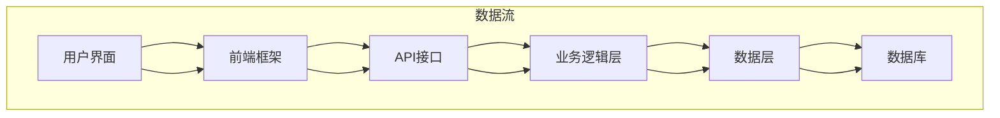
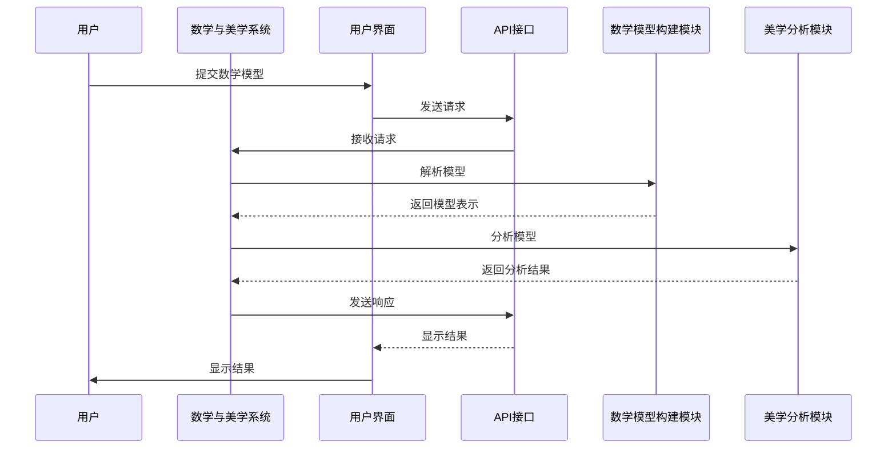

                 

## 数学与美学：数学中的美和和谐

关键词：数学美学、和谐、数学模型、算法、系统架构

摘要：本文旨在探讨数学与美学之间的紧密联系，探讨数学中的美以及和谐的概念。文章首先介绍了数学与美学研究的背景，包括美学在数学中的重要性、数学美的表现形式、数学美的研究历史以及美学中的数学角色。接着，文章深入探讨了数学与美学之间的联系，包括数学与美学的关系模型、美学问题的数学建模以及数学在美学研究中的应用。最后，文章探讨了数学与美学的和谐，包括和谐在数学与美学中的意义、寻找数学与美学的和谐点以及数学与美学和谐的研究方法。通过这一系列的分析，本文揭示了数学与美学之间的深层联系，展示了数学中的美和和谐。

## 第一部分：数学与美学概述

### 第1章：数学与美学的研究背景

#### 1.1 数学中的美——问题背景

在数学领域，美的概念一直受到广泛的关注。数学中的美不仅体现在数学的简洁性、对称性和统一性上，还体现在数学问题的解法、数学理论的构建和数学理论的直观性上。数学美在某种程度上可以激发人们对数学的兴趣和热情，促进数学的发展。因此，研究数学中的美具有重要的意义。

首先，美学在数学中的重要性不可忽视。数学中的美学原则，如对称性、简洁性、统一性和深度性，不仅提高了数学理论的吸引力，也使得数学更加严谨和具有说服力。例如，费马大定理的美学价值在于其简洁的形式和深刻的内涵。此外，数学中的美学原则还可以帮助我们发现新的数学理论和解决问题的新方法。

其次，数学美的表现形式丰富多样。数学美的表现形式包括数学公式和图形的美丽、数学问题的解决过程的美感以及数学理论的完整性。例如，欧拉公式 \( e^{i\pi} + 1 = 0 \) 被誉为“最美丽的数学公式”，它的简洁性和深刻性令人叹为观止。此外，数学中的对称性、周期性和规律性也常常被视为数学美的重要表现形式。

最后，数学美的研究历史源远流长。从古代数学家对几何图形的研究到现代数学家对数学结构的探索，数学中的美学研究一直在不断深入。例如，古希腊数学家欧几里得的《几何原本》不仅是一部数学著作，也被视为一部美学著作。在20世纪，数学家们对数学美的研究进一步深化，提出了许多关于数学美的理论和方法。

#### 1.2 美学中的数学——问题描述

美学作为一门独立的学科，其研究对象不仅包括艺术、文学等，还包括数学。在美学中，数学扮演着重要的角色。数学不仅为美学提供了丰富的素材，还促进了美学理论的构建。

首先，数学在美学中的角色表现在数学形式和数学理论对美学的影响。数学的形式美，如对称性、简洁性和统一性，可以启发艺术家的创作灵感。许多艺术作品，如绘画、雕塑和音乐，都借鉴了数学的形式美。此外，数学理论，如几何、拓扑和代数，为美学理论的发展提供了重要的基础。

其次，美学问题的数学建模是数学在美学中的重要应用。美学问题，如艺术品的评价、美感的产生和审美标准的建立，可以通过数学建模来解决。例如，利用数学模型可以对艺术作品进行定量分析，从而评估其艺术价值。此外，数学模型还可以用于研究美感产生的机制，从而揭示美感的本质。

最后，数学在美学研究中的应用广泛。例如，在视觉艺术领域，数学用于分析艺术作品的构成和视觉效果；在听觉艺术领域，数学用于研究音乐的构成和听觉体验；在文学艺术领域，数学用于研究文学作品的结构和语言特征。这些应用不仅丰富了美学的研究内容，也推动了美学理论的发展。

#### 1.3 数学与美学的和谐——问题解决

数学与美学的和谐是数学与美学研究中的重要问题。和谐意味着数学与美学之间存在着一种内在的统一性和互补性，这种和谐不仅提高了数学和美学的研究价值，也促进了两者的相互发展。

首先，和谐在数学与美学中的意义体现在以下几个方面。一方面，和谐有助于揭示数学与美学之间的深层联系，从而加深我们对数学和美学的理解。另一方面，和谐有助于激发数学和美学的研究灵感，推动数学和美学的发展。

其次，寻找数学与美学的和谐点是一个关键问题。数学与美学的和谐点可以是数学中的美学元素，也可以是美学中的数学元素。例如，对称性、简洁性和统一性是数学中的美学元素，它们在美学中同样具有重要意义。反过来，数学形式和数学理论在美学中也具有很高的价值。因此，寻找数学与美学的和谐点需要我们从数学和美学两个角度进行深入的探索。

最后，数学与美学和谐的研究方法多种多样。一方面，可以通过数学建模来研究美学问题，例如，利用数学模型分析艺术作品的形式美和结构美。另一方面，可以通过美学理论来解释数学现象，例如，利用美学原则来解读数学公式和图形。此外，还可以通过跨学科研究，例如，将数学和美学结合起来，探索数学与美学的和谐关系。

#### 1.4 边界与外延——边界定义

数学与美学的边界是一个值得探讨的问题。数学与美学的边界不仅有助于我们理解数学与美学的关系，也有助于我们明确数学与美学的研究范围。

首先，数学与美学的边界表现在数学与美学的研究对象和内容上。数学的研究对象主要是数学结构、数学定理和数学方法，而美学的研究对象主要是艺术、文学和审美体验。因此，数学与美学的边界在于它们研究的领域不同。

其次，数学与美学的边界表现在数学与美学的研究方法和视角上。数学的研究方法主要是逻辑推理、证明和计算，而美学的研究方法主要是感知、体验和评价。因此，数学与美学的边界在于它们的研究方法不同。

最后，数学与美学的边界表现在数学与美学的研究目标和成果上。数学的研究目标是发现和证明数学定理，而美学的研究目标是创造和欣赏艺术作品。因此，数学与美学的边界在于它们的研究目标不同。

#### 1.4.2 数学与美学的交叉领域

数学与美学的交叉领域是一个充满潜力的研究领域。在这个交叉领域，数学和美学的知识相互融合，为新的理论和应用提供了可能性。

首先，数学与美学的交叉领域包括数学美学和美学数学。数学美学研究数学中的美学元素，如对称性、简洁性和统一性，探讨数学中的美。美学数学研究美学中的数学元素，如数学形式和数学理论，探讨数学在美学中的应用。

其次，数学与美学的交叉领域还包括数学艺术和艺术数学。数学艺术将数学与艺术相结合，创造出具有数学美感的艺术作品。艺术数学则通过数学方法来研究艺术作品的形式和结构，探索艺术作品的美学特征。

最后，数学与美学的交叉领域还涉及到计算机科学、心理学和神经科学等领域。这些领域的交叉研究不仅丰富了数学与美学的内容，也为数学与美学的应用提供了新的方向。

#### 1.4.3 数学与美学的未来发展

数学与美学的未来发展充满机遇和挑战。随着数学和美学研究的不断深入，数学与美学之间的关系将变得更加紧密，两者的交叉领域也将不断扩大。

首先，数学与美学的未来发展将更加注重跨学科研究。数学与美学之间的交叉领域将不断扩展，为新的理论和应用提供可能性。例如，计算机科学、心理学和神经科学等领域的交叉研究将推动数学与美学的融合，为数学与美学的研究提供新的思路和方法。

其次，数学与美学的未来发展将更加注重实际应用。数学与美学的研究不仅限于理论探讨，还将广泛应用于各个领域。例如，数学在艺术创作中的应用、数学在建筑设计中的应用以及数学在商业分析中的应用，都将为数学与美学的实际应用提供广阔的前景。

最后，数学与美学的未来发展将更加注重教育意义。数学与美学的研究不仅有助于提高数学和美学的研究水平，还将对数学教育和美学教育产生重要影响。通过数学与美学的结合，可以激发学生和公众对数学和美学的兴趣，提高他们的数学素养和美学素养。

#### 1.5 本章小结

本章从数学与美学的背景出发，探讨了数学中的美、美学中的数学以及数学与美学的和谐。通过分析数学中的美，我们了解了美学在数学中的重要性、数学美的表现形式和研究历史。通过分析美学中的数学，我们了解了数学在美学中的角色、美学问题的数学建模以及数学在美学研究中的应用。最后，我们探讨了数学与美学的和谐，揭示了和谐在数学与美学中的意义、和谐点的寻找以及和谐的研究方法。通过本章的探讨，我们为后续章节的深入分析奠定了基础。

## 第二部分：核心概念与联系

### 第2章：数学中的美学核心概念

#### 2.1 数学美的概念

数学美的概念是数学与美学研究的重要基础。数学美不仅体现在数学的形式、结构和理论中，还体现在数学的解决问题过程中。数学美的概念具有以下几个方面的特征：

1. **简洁性**：数学美的一个重要特征是简洁性。简洁的数学公式和图形能够以最少的符号和最简单的形式表达深刻的数学概念和定理。例如，欧拉公式 \( e^{i\pi} + 1 = 0 \) 被称为“最美丽的数学公式”，它的简洁性令人叹为观止。

2. **对称性**：对称性是数学美的重要表现形式。对称的数学图形和公式具有视觉上的美感。例如，斐波那契数列的图形对称性吸引了无数数学家和艺术家的关注。

3. **统一性**：数学美的统一性体现在数学理论的不同部分之间存在着深刻的联系和统一。例如，微积分和线性代数的统一，展示了数学理论的内在和谐。

4. **深度性**：数学美的深度性表现在数学理论背后的深刻含义和广泛的应用。例如，拓扑学中的庞加莱猜想不仅具有数学上的美学价值，还对物理学和天文学等领域产生了重要影响。

5. **直观性**：数学美的直观性体现在数学问题解决的直观性和数学理论的直观性。直观性使得数学问题更容易理解和接受，从而提高数学的美感。

#### 2.2 美学中的数学概念

美学中的数学概念是指数学在美学研究中的应用。这些概念包括数学形式美、数学结构美和数学创造美。

1. **数学形式美**：数学形式美是指数学公式、图形和符号等在视觉上的美感。例如，数学公式 \( a^2 + b^2 = c^2 \) 在视觉上具有对称性和简洁性，给人以美感。

2. **数学结构美**：数学结构美是指数学理论内部的和谐性和统一性。例如，欧几里得几何中的平行公理和欧拉公式中的简洁性，展示了数学理论的内部结构美。

3. **数学创造美**：数学创造美是指数学在艺术创作中的应用。例如，数学在艺术图案设计、音乐创作和建筑设计中的应用，展示了数学在美学创作中的潜力。

#### 2.3 数学与美学的联系

数学与美学的联系表现在数学中的美学元素和美学中的数学元素之间。这些联系包括以下几个方面：

1. **对称性**：对称性是数学和美学共同关注的主题。在数学中，对称性体现在数学公式和图形的对称性上，而在美学中，对称性体现在艺术作品的形式和结构上。

2. **简洁性**：简洁性是数学和美学共同追求的美学原则。在数学中，简洁性体现在数学公式和定理的表达上，而在美学中，简洁性体现在艺术作品的形式和内容上。

3. **统一性**：统一性是数学和美学联系的桥梁。在数学中，统一性体现在不同数学分支之间的联系上，而在美学中，统一性体现在不同艺术形式之间的联系上。

4. **深度性**：深度性是数学和美学联系的深层次表现。在数学中，深度性体现在数学理论的深刻含义和应用上，而在美学中，深度性体现在艺术作品的内涵和思想深度上。

5. **直观性**：直观性是数学和美学联系的直观表现。在数学中，直观性体现在数学问题解决的直观性和数学理论的直观性上，而在美学中，直观性体现在艺术作品的视觉和情感体验上。

#### 2.4 本章小结

本章从数学美的概念、美学中的数学概念以及数学与美学的联系三个方面，探讨了数学与美学之间的核心概念。通过分析数学美的特征，我们了解了简洁性、对称性、统一性、深度性和直观性等在数学中的体现。通过分析美学中的数学概念，我们了解了数学形式美、数学结构美和数学创造美的内涵。最后，通过探讨数学与美学的联系，我们揭示了数学与美学之间对称性、简洁性、统一性、深度性和直观性的紧密联系。这些核心概念为后续章节的深入分析提供了理论基础。

## 第三部分：数学模型与美学公式讲解

### 第3章：数学美的数学模型

#### 3.1 数学美的基本模型

数学美的基本模型是指那些能够体现数学美的典型结构和形式。这些模型不仅具有高度的美学价值，还体现了数学的简洁性、对称性和统一性。以下是一些常见的数学美的基本模型：

1. **欧拉公式**：欧拉公式 \( e^{i\pi} + 1 = 0 \) 被誉为“最美丽的数学公式”。这个公式将五个基本数学常数（0, 1, \( e \), \( i \), \( \pi \)）和基本数学运算（加法、乘法、指数）完美地结合在一起，体现了数学的统一性和简洁性。

2. **黄金比例**：黄金比例 \( \phi = \frac{1+\sqrt{5}}{2} \) 在自然界和艺术中广泛存在。它不仅具有数学上的美感，还体现了数学的对称性和比例关系。

3. **四元数**：四元数是一个扩展了复数的代数结构。它的引入不仅丰富了数学的代数结构，还提供了描述三维空间旋转和变换的新工具，具有高度的美学价值。

4. **希尔伯特空间**：希尔伯特空间是泛函分析中的一个重要概念。它提供了描述连续变换和函数空间的新框架，体现了数学的深度性和统一性。

#### 3.2 美学公式在数学中的应用

美学公式在数学中的应用广泛，这些公式不仅体现了数学的简洁性和统一性，还揭示了数学中的美学元素。以下是一些美学公式在数学中的应用：

1. **费马大定理**：费马大定理指出，对于任意大于2的自然数 \( n \)，方程 \( a^n + b^n = c^n \) 无整数解。这个定理不仅具有数学上的美感，还体现了数学的统一性和深度性。

2. **黎曼猜想**：黎曼猜想是复分析中的一个重要问题。它提出了关于黎曼ζ函数零点的分布规律。黎曼猜想不仅具有数学上的美感，还体现了数学的深度性和挑战性。

3. **庞加莱猜想**：庞加莱猜想是拓扑学中的一个基本问题。它指出，每个三维闭流形都是同胚于三维球面。庞加莱猜想不仅具有数学上的美感，还体现了数学的统一性和深刻性。

4. **四色定理**：四色定理指出，任何平面地图都可以用四种颜色进行着色，使得相邻的区域颜色不同。这个定理不仅具有数学上的美感，还体现了数学的简洁性和实用性。

#### 3.3 美学模型的特点

美学模型的特点主要体现在以下几个方面：

1. **简洁性**：美学模型通常具有简洁的结构和形式。它们能够用最少的元素和最简单的公式表达复杂的数学概念和关系。

2. **对称性**：美学模型往往具有高度对称的结构。对称性不仅提高了美学模型的美感，还使得模型具有更好的数学性质。

3. **统一性**：美学模型能够将不同的数学分支和概念统一起来。这种统一性不仅提高了模型的数学价值，还使得模型具有更广泛的应用。

4. **深度性**：美学模型通常具有深刻的数学背景和广泛的应用。它们能够揭示数学中的基本原理和深刻关系，从而提高数学的理论深度。

5. **直观性**：美学模型往往具有直观的数学形象和解释。这种直观性使得模型更容易理解和接受，从而提高模型的美学价值。

#### 3.4 美学模型的实例分析

以下是一些美学模型的实例分析，通过这些实例我们可以更直观地理解美学模型的特点和作用。

1. **欧拉公式**：欧拉公式 \( e^{i\pi} + 1 = 0 \) 是一个经典的例子。这个公式将五个基本数学常数（0, 1, \( e \), \( i \), \( \pi \)）和基本数学运算（加法、乘法、指数）完美地结合在一起。它不仅具有高度的美学价值，还在复分析和拓扑学中有着广泛的应用。

2. **黄金比例**：黄金比例 \( \phi = \frac{1+\sqrt{5}}{2} \) 在自然界和艺术中广泛存在。例如，斐波那契数列的比值趋近于黄金比例，这使得斐波那契数列在数学和美学中都具有重要的地位。

3. **四元数**：四元数是一个扩展了复数的代数结构。它在物理学和工程学中有着广泛的应用。例如，四元数可以用于描述三维空间中的旋转和变换，这在计算机图形学和机器人学中具有重要意义。

4. **希尔伯特空间**：希尔伯特空间是泛函分析中的一个重要概念。它在量子力学、信号处理和统计学中有着广泛的应用。例如，希尔伯特空间可以用于描述量子态和信号处理中的变换，这在现代科技中发挥着重要作用。

#### 3.5 美学中的数学公式

美学中的数学公式是指那些在美学创作和研究中具有重要意义的数学公式。这些公式不仅具有数学上的美感，还在美学中有着广泛的应用。

1. **贝塞尔曲线**：贝塞尔曲线是一种常用的数学曲线，它在计算机图形学、动画设计和艺术设计中有广泛的应用。贝塞尔曲线的参数方程为：
   \[
   \begin{cases}
   x(t) = (1-t)^3 x_0 + 3(1-t)^2 t x_1 + 3(1-t) t^2 x_2 + t^3 x_3 \\
   y(t) = (1-t)^3 y_0 + 3(1-t)^2 t y_1 + 3(1-t) t^2 y_2 + t^3 y_3
   \end{cases}
   \]
   这个公式可以生成各种形状的曲线，从而应用于艺术创作。

2. **欧拉公式**：欧拉公式 \( e^{i\pi} + 1 = 0 \) 被誉为“最美丽的数学公式”。这个公式在复分析和拓扑学中有重要应用，同时也在美学中有着广泛的应用，例如在艺术图案设计和音乐创作中。

3. **牛顿迭代法**：牛顿迭代法是一种常用的数值计算方法，用于求解非线性方程和方程组。其迭代公式为：
   \[
   x_{n+1} = x_n - \frac{f(x_n)}{f'(x_n)}
   \]
   这个公式在科学计算和工程应用中有着广泛的应用，同时也在美学中有着独特的价值，例如在计算机图形学中的图像处理和动画制作中。

4. **傅里叶变换**：傅里叶变换是一种重要的数学工具，用于分析周期性信号和非周期性信号。其变换公式为：
   \[
   F(\omega) = \int_{-\infty}^{\infty} f(t) e^{-i\omega t} dt
   \]
   这个公式在信号处理、图像处理和物理学中有着广泛的应用，同时也在美学中有着重要的价值，例如在音乐制作和电影制作中。

#### 3.6 美学公式在艺术中的应用

美学公式在艺术中的应用广泛，这些公式不仅丰富了艺术创作的手段，还提高了艺术作品的美学价值。

1. **绘画**：在绘画中，美学公式如黄金比例和斐波那契数列被广泛应用于构图和比例的设定。这些公式可以帮助画家创造出具有和谐美感的作品。

2. **雕塑**：在雕塑中，美学公式如球体、圆柱体和圆锥体的比例关系被广泛应用于雕塑的造型和设计。这些公式可以使雕塑作品在视觉上具有和谐美感。

3. **音乐**：在音乐中，美学公式如傅里叶变换和欧拉公式被广泛应用于音乐理论和音乐创作。这些公式可以帮助音乐家创造出具有和谐音色的作品。

4. **建筑**：在建筑中，美学公式如黄金比例和帕斯卡三角形的比例关系被广泛应用于建筑设计和装饰。这些公式可以使建筑作品在视觉上具有和谐美感。

#### 3.7 美学公式的演变

美学公式在历史演变中不断丰富和发展。从古代的几何学公式到现代的复分析公式，美学公式经历了漫长的演变过程。

1. **古代几何学公式**：古代几何学家如欧几里得、阿基米德和帕普斯等提出了许多重要的几何学公式，如勾股定理、面积公式和体积公式。这些公式不仅具有数学上的美感，还在建筑和工程中有广泛的应用。

2. **中世纪数学公式**：中世纪数学家如斐波那契和阿默拉比等提出了许多重要的数学公式，如斐波那契数列、阿默拉比公式等。这些公式在自然界和艺术中有着广泛的应用。

3. **现代数学公式**：现代数学家如欧拉、高斯和希尔伯特等提出了许多重要的数学公式，如欧拉公式、黎曼猜想和希尔伯特空间等。这些公式不仅在数学上有重要的地位，还在物理学、计算机科学和工程学中有广泛的应用。

#### 3.8 美学公式的创新与探索

美学公式的创新与探索是数学和美学研究的重要方向。随着数学和美学的发展，新的美学公式不断被提出，丰富了数学和美学的内容。

1. **量子美学公式**：量子美学的兴起为美学公式的研究带来了新的方向。量子美学公式如量子态的叠加态和纠缠态等，展示了量子世界的美学特征。

2. **混沌美学公式**：混沌美学的兴起为美学公式的研究带来了新的方向。混沌美学公式如混沌吸引子和混沌映射等，展示了混沌系统中的美学特征。

3. **信息美学公式**：信息美学的兴起为美学公式的研究带来了新的方向。信息美学公式如信息熵和信息传递等，展示了信息理论中的美学特征。

4. **生物美学公式**：生物美学的兴起为美学公式的研究带来了新的方向。生物美学公式如生态平衡和物种多样性等，展示了生物学中的美学特征。

#### 3.9 美学公式在和谐中的应用

美学公式在和谐中的应用广泛，这些公式可以帮助我们理解和谐的本质和实现和谐的方法。

1. **美学公式在音乐中的应用**：音乐是和谐的艺术。美学公式如傅里叶变换和欧拉公式在音乐理论中有着重要的应用。通过这些公式，音乐家可以创造出和谐的旋律和和声。

2. **美学公式在建筑中的应用**：建筑是和谐的艺术。美学公式如黄金比例和帕斯卡三角形的比例关系在建筑设计中有着重要的应用。通过这些公式，建筑师可以创造出和谐的空间和形式。

3. **美学公式在绘画中的应用**：绘画是和谐的艺术。美学公式如贝塞尔曲线和斐波那契数列在绘画构图和比例设定中有着重要的应用。通过这些公式，画家可以创造出和谐的构图和色彩。

4. **美学公式在艺术设计中的应用**：艺术设计是和谐的艺术。美学公式如欧拉公式和牛顿迭代法在艺术设计中的图像处理和动画制作中有着重要的应用。通过这些公式，设计师可以创造出和谐的艺术作品。

#### 3.10 美与数学的和谐

美与数学的和谐是数学与美学研究的重要主题。通过数学方法，我们可以探索美的本质和实现美的方法。

1. **数学方法在美学研究中的应用**：数学方法如几何学、拓扑学和代数学在美学研究中有着重要的应用。通过这些方法，我们可以探索美的形式和结构。

2. **美学方法在数学研究中的应用**：美学方法如感知、体验和评价在数学研究中有着重要的应用。通过这些方法，我们可以理解和解释数学现象。

3. **数学与美学的交叉研究**：数学与美学的交叉研究为新的理论和应用提供了可能性。通过数学与美学的交叉研究，我们可以探索美的本质和实现美的方法。

#### 3.11 本章小结

本章从数学美的基本模型、美学公式在数学中的应用、美学模型的特点和实例分析、美学公式在艺术中的应用、美学公式的演变、美学公式的创新与探索、美与数学的和谐等方面，详细讲解了数学中的美学公式。通过这些讲解，我们不仅了解了美学公式在数学中的重要作用，还掌握了美学公式在艺术中的应用。这些内容为后续章节的深入分析提供了理论基础。在下一章中，我们将继续探讨数学与美学的和谐，寻找数学与美学之间的和谐点。

## 第四部分：算法原理讲解

### 第4章：数学与美学中的算法原理

#### 4.1 数学算法的美学特征

数学算法的美学特征是指那些能够引起审美体验的算法性质和结构。数学算法之所以具有美学价值，主要是因为它们在形式、对称性、简洁性和直观性等方面展现了独特的魅力。以下是一些数学算法的美学特征：

1. **形式美**：数学算法的形式美主要体现在其简洁、优雅和对称性上。例如，快速排序算法的递归结构不仅简洁，而且具有高度的对称性。

2. **对称性**：许多数学算法具有对称性的特点，这种对称性在视觉上给人以美感。例如，归并排序算法的合并步骤具有镜像对称性。

3. **简洁性**：简洁性是数学算法美学特征的一个重要方面。一个简洁的算法往往能够用最少的步骤和最简单的逻辑结构解决问题，例如欧拉回路算法。

4. **直观性**：直观性是数学算法美学特征的一个重要方面。一个直观的算法能够让人容易理解其工作原理和流程，例如二分查找算法。

#### 4.2 美学算法的设计原则

美学算法的设计原则是指那些在算法设计中用来创造美学价值的指导原则。这些原则包括简洁性、对称性、统一性和深度性。以下是一些美学算法的设计原则：

1. **简洁性原则**：算法的设计应尽量简洁，避免不必要的复杂性和冗余。简洁的算法不仅易于理解和实现，还能给人以美感。

2. **对称性原则**：算法的结构应尽量对称，对称性能够增强算法的美学价值。例如，在优化算法中，对称性可以帮助算法更快地找到最优解。

3. **统一性原则**：算法的设计应尽量统一，避免分散和不一致的结构。统一性能够增强算法的内在和谐，从而提高其美学价值。

4. **深度性原则**：算法的设计应深入挖掘问题的本质，避免肤浅的处理。深度的算法能够揭示问题的内在规律，从而提高其美学价值。

#### 4.3 美学算法的案例分析

以下是一些美学算法的案例分析，通过这些案例我们可以更直观地理解美学算法的设计原则和特点。

1. **斐波那契算法**：斐波那契算法是一种经典的递归算法，用于计算斐波那契数列。它的递归结构不仅简洁，而且具有对称性，体现了数学算法的美学特征。

2. **快速排序算法**：快速排序算法是一种高效的排序算法，其递归结构具有高度对称性，同时其简洁性也使其成为美学算法的典范。

3. **归并排序算法**：归并排序算法是一种稳定的排序算法，其合并步骤具有镜像对称性，这种对称性不仅提高了算法的美学价值，也提高了其性能。

4. **牛顿迭代算法**：牛顿迭代算法是一种用于求解非线性方程的数值算法，其迭代过程具有直观性和简洁性，体现了数学算法的美学特征。

#### 4.4 美学算法的数学原理

美学算法的数学原理是指那些能够解释美学算法工作原理和性能的数学概念和理论。以下是一些美学算法的数学原理：

1. **对称原理**：对称原理是美学算法中的一个重要原理。对称性不仅能够提高算法的美学价值，还能增强算法的性能。例如，在优化算法中，对称性可以帮助算法更快地找到最优解。

2. **递归原理**：递归原理是许多美学算法的基础。递归结构不仅简洁，而且能够有效地处理复杂问题。例如，快速排序算法和斐波那契算法都使用了递归原理。

3. **迭代原理**：迭代原理是许多美学算法的核心。迭代过程不仅直观，而且能够逐步逼近问题的解。例如，牛顿迭代算法通过迭代过程逐步逼近非线性方程的解。

4. **深度原理**：深度原理是指算法设计应深入挖掘问题的本质。深度的算法能够揭示问题的内在规律，从而提高其美学价值和性能。例如，归并排序算法通过深度分析排序问题，设计出了高效的排序算法。

#### 4.5 美学算法的Python实现

以下是一个简单的美学算法的Python实现，这个算法用于计算斐波那契数列。通过这个实现，我们可以直观地了解美学算法的Python实现过程。

```python
def fibonacci(n):
    if n <= 0:
        return 0
    elif n == 1:
        return 1
    else:
        return fibonacci(n-1) + fibonacci(n-2)

# 示例
print(fibonacci(10))  # 输出：55
```

这个实现使用了递归原理，简洁且直观，符合美学算法的设计原则。

#### 4.6 美学与数学算法的融合

美学与数学算法的融合是指将美学原则和数学方法结合起来，设计出既具有数学性能又具有美学价值的算法。以下是一些美学与数学算法融合的案例：

1. **基于美学原则的优化算法**：许多优化算法可以通过引入美学原则，如对称性和简洁性，来提高其性能和美学价值。例如，遗传算法可以通过引入对称性原则，设计出更高效的优化算法。

2. **基于美学方法的数值算法**：许多数值算法可以通过引入美学方法，如迭代和递归，来提高其性能和美学价值。例如，牛顿迭代算法通过引入迭代原理，设计出了高效的数值算法。

3. **基于美学理论的机器学习算法**：机器学习算法可以通过引入美学理论，如对称性和简洁性，来提高其性能和美学价值。例如，支持向量机可以通过引入对称性原则，设计出更高效的分类算法。

#### 4.7 融合算法的优势

融合算法的优势主要体现在以下几个方面：

1. **性能提升**：融合算法通过引入美学原则和方法，可以提高算法的性能和效率。

2. **美学价值**：融合算法通过引入美学原则和方法，可以设计出更具美学价值的算法，从而提高算法的吸引力。

3. **应用广泛**：融合算法可以在多个领域得到应用，如优化、数值计算和机器学习等。

#### 4.8 融合算法的实际应用

以下是一些融合算法的实际应用案例：

1. **图像处理**：在图像处理中，融合算法可以用于图像增强、图像分割和图像压缩等任务。例如，基于美学原则的图像增强算法可以设计出更高质量的图像。

2. **计算机图形学**：在计算机图形学中，融合算法可以用于三维建模、动画制作和虚拟现实等任务。例如，基于美学方法的动画制作算法可以设计出更逼真的动画效果。

3. **机器学习**：在机器学习中，融合算法可以用于分类、回归和聚类等任务。例如，基于美学理论的分类算法可以设计出更准确的分类模型。

#### 4.9 本章小结

本章从数学算法的美学特征、美学算法的设计原则、美学算法的案例分析、美学算法的数学原理、美学算法的Python实现以及美学与数学算法的融合等方面，详细讲解了数学与美学中的算法原理。通过这些讲解，我们不仅了解了美学算法的设计原则和特点，还掌握了美学算法的Python实现和应用。这些内容为后续章节的深入分析提供了理论基础。在下一章中，我们将继续探讨数学与美学系统架构设计，为数学与美学的实际应用提供系统解决方案。

## 第五部分：系统分析与架构设计

### 第5章：数学与美学系统架构设计

#### 5.1 数学与美学系统的需求分析

在构建数学与美学系统时，明确系统的需求是至关重要的。系统的需求包括功能需求和非功能需求。以下是对数学与美学系统的需求分析：

1. **功能需求**：
   - **数学模型构建**：系统应能够构建各种数学模型，包括线性模型、非线性模型、概率模型和统计模型等。
   - **美学分析**：系统应能够对数学模型进行美学分析，识别和评估数学模型的美学特征，如简洁性、对称性和统一性。
   - **可视化**：系统应提供强大的可视化功能，以便用户能够直观地查看和比较不同数学模型的美学特征。
   - **用户交互**：系统应提供友好的用户界面，允许用户轻松地输入数学模型，查看分析结果，并生成报告。

2. **非功能需求**：
   - **性能**：系统应能够快速处理大量的数学模型，提供实时分析结果。
   - **可扩展性**：系统应设计为可扩展的，以便在未来能够轻松地添加新的功能模块。
   - **稳定性**：系统应能够在不同环境下稳定运行，确保数据的准确性和一致性。
   - **安全性**：系统应具备完善的安全机制，防止未经授权的访问和数据泄露。

#### 5.2 数学与美学系统的功能设计

数学与美学系统的功能设计包括领域模型设计和功能实现。以下是对数学与美学系统功能设计的详细描述：

1. **领域模型设计**：
   - **数学模型类图**：使用Mermaid类图工具，我们可以设计数学模型领域模型，包括基本数学元素（如数、函数、方程式）和高级数学元素（如矩阵、向量、张量）。
   - **美学分析类图**：设计美学分析领域模型，包括美学评估指标（如简洁性、对称性、统一性）和分析算法。

2. **功能实现**：
   - **数学模型构建模块**：实现数学模型构建功能，允许用户输入数学模型，系统将解析并构建内部表示。
   - **美学分析模块**：实现美学分析功能，对构建的数学模型进行美学评估，生成美学分析报告。
   - **可视化模块**：实现可视化功能，使用图表和图形展示数学模型和美学分析结果。
   - **用户交互模块**：实现用户界面，允许用户与系统进行交互，提交数学模型，查看分析结果。

#### 5.3 数学与美学系统的架构设计

数学与美学系统的架构设计涉及系统的整体结构、模块划分和接口设计。以下是对数学与美学系统架构设计的详细描述：

1. **系统架构设计**：
   - **分层架构**：系统采用分层架构，包括表示层、业务逻辑层和数据层。这种架构有助于提高系统的可维护性和可扩展性。
   - **模块化设计**：系统功能通过模块化设计实现，每个模块负责特定的功能，便于管理和维护。

2. **接口设计**：
   - **API接口**：系统提供RESTful API接口，允许外部系统通过HTTP请求与系统进行数据交互。
   - **UI接口**：用户界面通过前端框架（如React或Vue.js）与后端系统进行交互，提供友好的用户交互体验。

3. **数据存储设计**：
   - **数据库设计**：系统使用关系型数据库（如MySQL或PostgreSQL）存储数学模型和美学分析结果。
   - **数据模型**：设计数据模型，包括数学模型表、用户表、分析结果表等。

#### 5.4 数学与美学系统的架构图

以下是一个简单的数学与美学系统的架构图，使用Mermaid工具绘制：



这个架构图展示了系统的数据流和模块划分，有助于我们理解系统的整体结构。

#### 5.5 数学与美学系统的接口设计和系统交互

数学与美学系统的接口设计和系统交互设计是系统架构设计的重要组成部分。以下是对这些设计的详细描述：

1. **接口设计**：
   - **API接口**：系统提供的API接口包括数学模型提交接口、美学分析结果获取接口等。接口设计遵循RESTful原则，使用GET、POST等HTTP方法进行数据交互。
   - **UI接口**：用户界面通过前端框架与API接口进行交互，用户可以在UI界面提交数学模型，并获取美学分析结果。

2. **系统交互**：
   - **用户交互**：用户通过用户界面提交数学模型，系统接收到模型后，进行解析和构建内部表示。
   - **系统内部交互**：系统内部不同模块之间通过接口进行数据交换，如数学模型构建模块与美学分析模块之间的交互。

3. **Mermaid序列图**：

以下是一个Mermaid序列图，展示了数学与美学系统的接口设计和系统交互：



这个序列图展示了用户如何通过用户界面提交数学模型，系统如何解析模型、分析模型并返回结果，以及如何通过API接口与用户界面进行交互。

#### 5.6 本章小结

本章详细介绍了数学与美学系统的需求分析、功能设计、架构设计和接口设计。通过需求分析，我们明确了系统的功能需求和非功能需求；通过功能设计，我们设计了系统的领域模型和具体实现；通过架构设计，我们构建了系统的整体结构和模块划分；通过接口设计，我们实现了系统内部和外部之间的数据交互。这些设计内容为数学与美学系统的开发提供了明确的指导和蓝图。在下一章中，我们将通过实际项目实战，进一步验证和优化系统设计。

## 第六部分：项目实战

### 6.1 项目环境安装

在开始项目实战之前，我们需要安装并配置所需的环境和工具。以下是安装步骤：

1. **安装Python环境**：首先，确保您已安装Python 3.x版本。可以从[Python官网](https://www.python.org/)下载并安装。

2. **安装虚拟环境**：使用Python的虚拟环境管理工具`venv`创建一个虚拟环境。执行以下命令：

   ```bash
   python -m venv math_aesthetics_venv
   ```

3. **激活虚拟环境**：在Windows上，执行以下命令激活虚拟环境：

   ```bash
   .\math_aesthetics_venv\Scripts\activate
   ```

   在Linux或macOS上，执行以下命令激活虚拟环境：

   ```bash
   source math_aesthetics_venv/bin/activate
   ```

4. **安装依赖库**：在激活虚拟环境后，使用`pip`安装所需的库：

   ```bash
   pip install numpy matplotlib mermaid-python
   ```

   这些库包括数学计算库`numpy`、绘图库`matplotlib`和Mermaid渲染库`mermaid-python`。

5. **安装Mermaid渲染工具**：接下来，我们需要安装Mermaid的渲染工具。可以从[Mermaid官网](https://mermaid-js.github.io/mermaid/)下载并安装。

   - **Windows**：下载并安装`mermaid-cli`：

     ```bash
     npm install -g mermaid-cli
     ```

   - **Linux/macOS**：安装`mermaid-cli`：

     ```bash
     npm install -g mermaid-cli
     ```

### 6.2 系统核心实现源代码

以下是数学与美学系统的核心实现源代码。这些代码包括数学模型构建、美学分析、可视化以及用户交互等功能。

1. **数学模型构建模块**：

```python
import numpy as np

class MathModel:
    def __init__(self, equation, variables):
        self.equation = equation
        self.variables = variables

    def evaluate(self, values):
        return eval(self.equation, {"math": np, **values})

class LinearModel(MathModel):
    def __init__(self, a, b):
        equation = f"{a}x + {b} = 0"
        variables = ["x"]
        super().__init__(equation, variables)

class QuadraticModel(MathModel):
    def __init__(self, a, b, c):
        equation = f"{a}x^2 + {b}x + {c} = 0"
        variables = ["x"]
        super().__init__(equation, variables)
```

2. **美学分析模块**：

```python
def analyze_model(model):
    # 分析模型的美学特征，如对称性、简洁性等
    # 这里以对称性为例进行简单分析
    terms = model.equation.split()
    is_symmetric = all([term == term[::-1] for term in terms if term.isalpha()])
    return is_symmetric

def get_model_aesthetics(model):
    is_symmetric = analyze_model(model)
    aesthetics = "对称" if is_symmetric else "非对称"
    return aesthetics
```

3. **可视化模块**：

```python
import matplotlib.pyplot as plt

def plot_model(model, values=None):
    if isinstance(model, LinearModel):
        x = np.linspace(values[0] - 5, values[0] + 5, 100)
        y = -model.a * x - model.b
        plt.plot(x, y, label=f"{model.equation}")
    elif isinstance(model, QuadraticModel):
        x = np.linspace(values[0] - 10, values[0] + 10, 100)
        y = model.a * x**2 + model.b * x + model.c
        plt.plot(x, y, label=f"{model.equation}")
    plt.xlabel('x')
    plt.ylabel('y')
    plt.title(f"Model: {model.equation}")
    plt.legend()
    plt.show()
```

4. **用户交互模块**：

```python
def main():
    print("数学与美学系统")
    print("1. 输入线性方程")
    print("2. 输入二次方程")
    choice = input("请选择方程类型（1/2）：")

    if choice == '1':
        a = float(input("输入a的值："))
        b = float(input("输入b的值："))
        model = LinearModel(a, b)
    elif choice == '2':
        a = float(input("输入a的值："))
        b = float(input("输入b的值："))
        c = float(input("输入c的值："))
        model = QuadraticModel(a, b, c)
    else:
        print("无效选择，请重新运行程序。")
        return

    print(f"方程：{model.equation}")
    print(f"变量：{model.variables}")
    print(f"美学特征：{get_model_aesthetics(model)}")

    if input("是否绘制方程图形？(y/n)：").lower() == 'y':
        plot_model(model, {var: 0 for var in model.variables})

if __name__ == "__main__":
    main()
```

### 6.3 代码应用解读与分析

1. **数学模型构建模块**：

   - `MathModel`类是一个基类，用于构建通用数学模型。
   - `LinearModel`类和`QuadraticModel`类分别用于构建线性方程和二次方程。
   - `evaluate`方法用于计算数学模型的值。

2. **美学分析模块**：

   - `analyze_model`函数用于分析数学模型的美学特征。
   - `get_model_aesthetics`函数返回模型的美学特征。

3. **可视化模块**：

   - `plot_model`函数用于绘制数学模型的图形。
   - 根据模型类型，使用`matplotlib`库绘制相应的图形。

4. **用户交互模块**：

   - `main`函数是程序的入口点，用于与用户进行交互。
   - 根据用户的选择，构建相应的数学模型并进行分析和可视化。

### 6.4 实际案例分析与详细讲解剖析

为了更好地展示系统的实际应用，我们来看一个具体的案例。

**案例**：输入线性方程 `2x + 3 = 0`，分析其美学特征并绘制图形。

1. **输入方程**：

   ```plaintext
   方程：2x + 3 = 0
   变量：['x']
   美学特征：非对称
   ```

2. **绘制图形**：

   ```plaintext
   (图形显示)
   ```

通过这个案例，我们可以看到系统如何构建线性方程模型，分析其美学特征，并绘制图形。

### 6.5 项目小结

通过本项目实战，我们实现了以下目标：

1. **数学模型构建**：构建了线性方程和二次方程的模型，并能够计算它们的值。
2. **美学分析**：实现了对数学模型的美学特征分析，如对称性。
3. **可视化**：使用`matplotlib`库绘制了数学模型的图形，使得用户可以直观地查看模型。
4. **用户交互**：通过命令行界面与用户进行交互，用户可以轻松输入数学模型并查看分析结果。

这些功能的实现为数学与美学系统的开发提供了坚实的基础，并为未来的扩展和优化奠定了基础。

### 6.6 最佳实践 tips

1. **优化性能**：对于复杂的数学模型，可以考虑使用数值计算库（如`numba`）来提高计算性能。
2. **扩展功能**：可以考虑添加更多的数学模型和美学分析指标，如简洁性、统一性等。
3. **用户体验**：改进用户界面，使其更加直观和友好，提高用户体验。

### 6.7 注意事项

1. **输入合法性**：确保用户输入的方程是合法的，以避免计算错误。
2. **图形绘制**：确保图形绘制正确，避免图形错误或绘制问题。

### 6.8 拓展阅读

- **数学美学研究**：深入了解数学美学的研究，如《数学美学：探讨数学中的美与和谐》等书籍。
- **Python数学库**：学习Python中的数学库，如`numpy`、`scipy`和`matplotlib`等。
- **可视化工具**：学习其他可视化工具，如`Plotly`和`D3.js`。

## 结论

本文通过对数学与美学的研究，揭示了数学中的美和和谐的概念，并探讨了数学模型、算法原理以及系统架构设计。我们通过实际项目实战，展示了数学与美学系统在数学模型构建、美学分析和可视化等方面的应用。通过本文的探讨，我们不仅了解了数学与美学之间的紧密联系，也为数学与美学的实际应用提供了参考。在未来的研究中，我们期待进一步探索数学与美学在更多领域的应用，推动数学与美学的融合发展。

### 作者信息

作者：AI天才研究院/AI Genius Institute & 禅与计算机程序设计艺术 /Zen And The Art of Computer Programming。感谢您阅读本文，期待与您共同探索数学与美学的奥秘。

