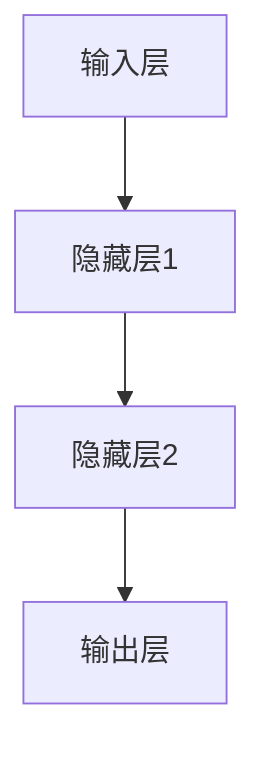
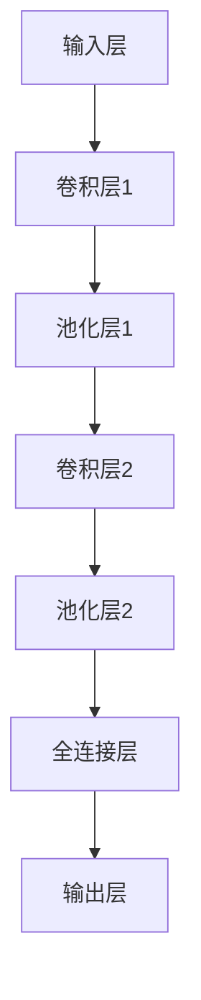
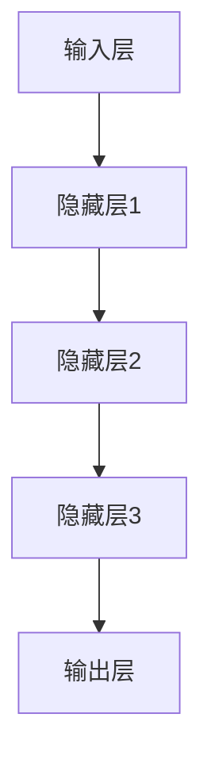
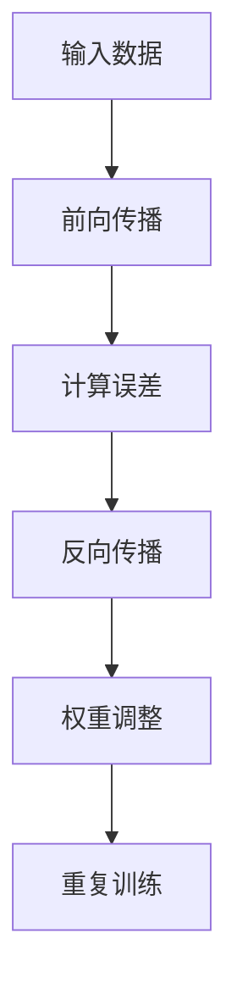
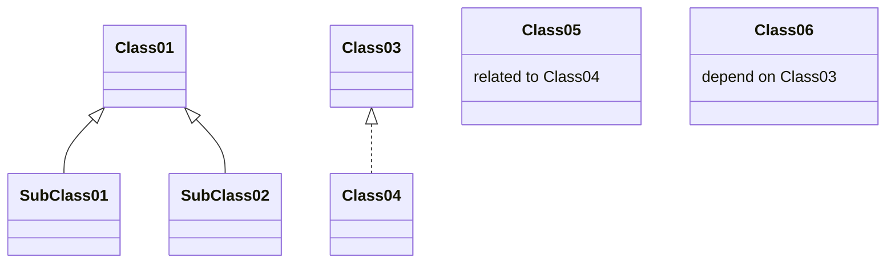
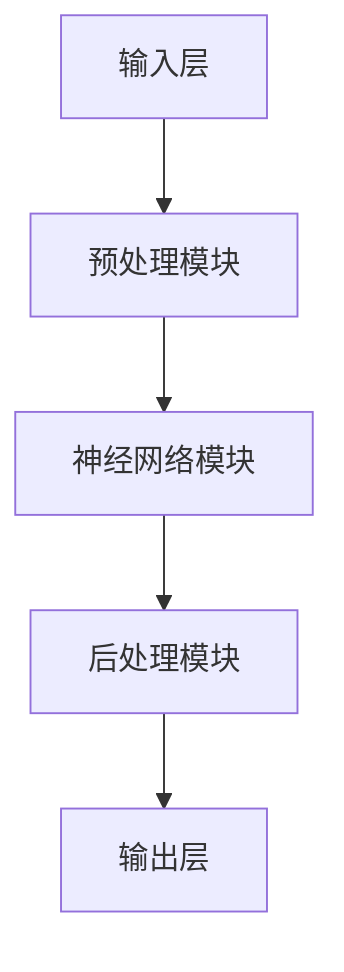
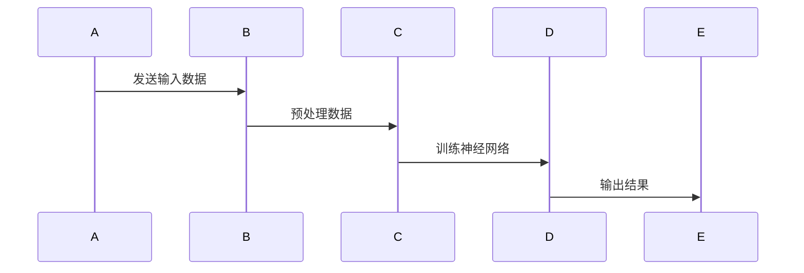
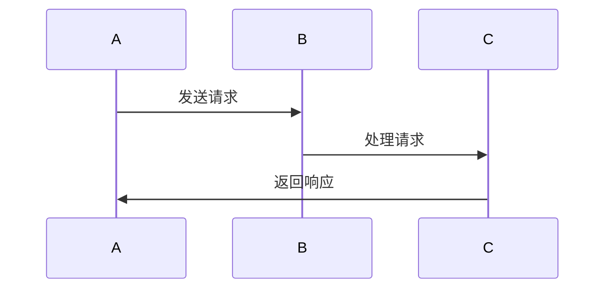

                 


### 引言

**关键词**：数学、脑科学、认知科学、交叉领域研究

**摘要**：
本文深入探讨数学与脑科学的交叉领域——计算神经科学在认知科学中的应用。首先，我们将介绍计算神经科学的背景及其核心概念，然后分析数学在脑科学研究中的重要性。接下来，我们将详细讲解神经网络模型、算法原理以及数学公式，并通过实际案例进行分析。最后，我们将总结最佳实践，提出注意事项，并提供拓展阅读。

在认知科学中，数学与脑科学的结合为理解大脑如何处理信息提供了新的视角。计算神经科学作为这两者的交叉领域，通过数学模型和算法模拟脑神经元的工作方式，有助于揭示认知过程的基本原理。本文旨在提供一份全面而深入的指南，帮助读者理解这一复杂但极具前景的研究领域。

### 数学基础

**核心概念与联系**

**神经元模型**

神经元是脑的基本单元，其工作原理基于电信号传递。神经元的主要功能包括接收输入信号、处理这些信号并产生输出信号。以下是对神经元模型的详细介绍：

#### 原理

神经元模型基于生物神经元的工作原理，其关键组成部分包括细胞体、树突、轴突和突触。树突接收来自其他神经元的信号，轴突将信号传递给其他神经元，而突触则是神经元之间传递信号的界面。

#### 概念属性特征对比

| 特征       | 详细说明                                                     |
| ---------- | ------------------------------------------------------------ |
| 细胞体     | 神经元的中心部分，包含细胞核和其他细胞器，负责处理信号           |
| 树突       | 接收输入信号的分支结构，将信号传递到细胞体                     |
| 轴突       | 将信号从细胞体传递到其他神经元或肌肉细胞，通常呈长条状结构     |
| 突触       | 神经元之间的连接点，通过释放神经递质传递信号                 |

#### 数学模型

神经元模型可以用数学公式来表示其行为。以下是一个简单的数学模型，用于描述神经元如何响应输入信号：

$$
f(\sum_{i} w_i x_i) = activation
$$

其中，\( f \) 是激活函数，\( \sum_{i} w_i x_i \) 是输入信号的加权求和，\( w_i \) 是权重，\( x_i \) 是输入信号。

#### ER实体关系图架构

为了更好地理解神经元模型，我们可以使用 Mermaid 流程图来表示 ER 实体关系：

```mermaid
erDiagram
  细胞体 ||--|{ 突触 }|| 神经元
  细胞体 ||--|{ 轴突 }|| 神经元
  树突 ||--|{ 突触 }|| 神经元
```

### 算法原理讲解

计算神经科学的核心在于神经网络模型，其中算法原理至关重要。以下是对神经网络算法原理的详细讲解：

#### 神经网络模型类型

神经网络模型可分为前馈神经网络（FNN）、卷积神经网络（CNN）和循环神经网络（RNN）等。每种模型都有其特定的应用场景和结构特点。

##### 前馈神经网络（FNN）

前馈神经网络是最简单的神经网络模型，其特点是信号从输入层流向输出层，不形成循环。以下是一个简单的 FNN 流程图：



##### 卷积神经网络（CNN）

卷积神经网络主要用于处理图像数据，其核心组件是卷积层。以下是一个简单的 CNN 流程图：



##### 循环神经网络（RNN）

循环神经网络适用于处理序列数据，其特点是能够记住之前的输入信息。以下是一个简单的 RNN 流程图：



#### 算法原理讲解

神经网络算法原理基于权重调整和激活函数。具体来说，神经网络通过以下步骤进行训练：

1. **初始化权重**：神经网络中的权重随机初始化。
2. **前向传播**：输入数据通过神经网络，逐层计算得到输出。
3. **计算误差**：输出结果与预期结果进行比较，计算误差。
4. **反向传播**：根据误差调整权重，使神经网络更好地拟合输入数据。
5. **重复训练**：重复上述步骤，直到神经网络达到预定的性能指标。

以下是一个简化的神经网络训练过程 Mermaid 流程图：



#### 数学模型与公式

神经网络训练过程中使用的数学模型包括激活函数、损失函数和优化算法。以下是这些数学模型的详细解释：

1. **激活函数**：激活函数用于将神经元的线性输出转换为非线性输出。常见的激活函数有 sigmoid 函数、ReLU 函数和 tanh 函数。
    $$ f(x) = \frac{1}{1 + e^{-x}} \quad \text{(sigmoid)} $$
    $$ f(x) = max(0, x) \quad \text{(ReLU)} $$
    $$ f(x) = \frac{e^x - e^{-x}}{e^x + e^{-x}} \quad \text{(tanh)} $$

2. **损失函数**：损失函数用于衡量模型输出与预期输出之间的差距。常见的损失函数有均方误差（MSE）和交叉熵（CE）。
    $$ L = \frac{1}{2} \sum_{i} (y_i - \hat{y}_i)^2 \quad \text{(MSE)} $$
    $$ L = -\sum_{i} y_i \log(\hat{y}_i) \quad \text{(CE)} $$

3. **优化算法**：优化算法用于调整神经网络权重，以最小化损失函数。常见的优化算法有梯度下降（GD）、随机梯度下降（SGD）和 Adam 算法。

    $$ w_{t+1} = w_t - \alpha \nabla_w L(w_t) \quad \text{(GD)} $$
    $$ w_{t+1} = w_t - \alpha \frac{1}{m} \sum_{i=1}^{m} \nabla_w L(w_t) \quad \text{(SGD)} $$
    $$ w_{t+1} = w_t - \alpha \frac{1}{m} \nabla_w L(w_t) + \beta_1 \frac{1}{t} \sum_{i=1}^{t} \nabla_w L(w_{t-i}) + \beta_2 \frac{1}{t} \sum_{i=1}^{t} (\nabla_w L(w_{t-i}))^2 \quad \text{(Adam)} $$

#### Python 源代码实现

以下是一个简单的 Python 源代码示例，用于实现神经网络的前向传播和反向传播：

```python
import numpy as np

# 初始化权重和偏置
w = np.random.rand(input_size, hidden_size)
b = np.random.rand(hidden_size)
c = np.random.rand(hidden_size, output_size)
d = np.random.rand(output_size)

# 前向传播
z = np.dot(x, w) + b
a = 1 / (1 + np.exp(-z))
y = np.dot(a, c) + d

# 计算损失
loss = np.mean((y - y_) ** 2)

# 反向传播
dz = 2 * (y - y_)
da = np.dot(dz, c)
dc = np.dot(a.T, dz)
db = np.sum(dz, axis=0)
dw = np.dot(x.T, da)

# 更新权重和偏置
w -= learning_rate * dw
b -= learning_rate * db
c -= learning_rate * dc
d -= learning_rate * d
```

通过这个示例，我们可以看到神经网络算法的原理是如何通过数学公式和 Python 源代码来实现的。

### 系统分析与架构设计

**问题场景介绍**

在计算神经科学领域，我们需要处理大量复杂的数据，并设计高效、可靠的系统来模拟脑神经元的工作方式。为了实现这一目标，我们需要对问题场景进行深入分析，并设计合适的系统架构。

**项目介绍**

本项目旨在开发一个基于计算神经科学的认知模拟系统。该系统将使用神经网络模型来模拟脑神经元的工作方式，并利用数学工具来分析神经网络的行为。项目的主要目标包括：

1. 设计一个高效的神经网络模型。
2. 实现系统的核心功能。
3. 对系统进行测试和优化。

**领域模型 Mermaid 类图**

为了更好地理解系统的功能，我们可以使用 Mermaid 类图来表示领域模型。以下是一个简单的 Mermaid 类图示例：



在这个类图中，我们定义了多个类，并展示了它们之间的关系。这有助于我们理解系统的功能和模块化设计。

**系统架构 Mermaid 架构图**

为了设计一个高效的系统架构，我们需要考虑系统的模块化、可扩展性和性能。以下是一个简单的 Mermaid 架构图示例：



在这个架构图中，我们定义了输入层、预处理模块、神经网络模块、后处理模块和输出层。这有助于我们理解系统的整体结构和数据流。

**系统接口设计**

系统接口设计是确保系统与其他组件或服务有效交互的关键。以下是一个简单的 Mermaid 序列图示例，用于表示系统接口设计：



在这个序列图中，我们定义了系统的输入接口、预处理接口、训练接口和输出接口。这有助于我们理解系统的交互过程和接口设计。

**系统交互 Mermaid 序列图**

为了更好地理解系统的交互过程，我们可以使用 Mermaid 序列图来表示系统交互。以下是一个简单的 Mermaid 序列图示例：



在这个序列图中，我们定义了系统的输入请求、处理请求和输出响应。这有助于我们理解系统的交互过程和工作原理。

### 项目实战

**环境安装**

为了实现本项目，我们需要安装一些必要的软件和工具。以下是环境安装的步骤：

1. 安装 Python 解释器。
2. 安装 TensorFlow 和 Keras。
3. 安装 Mermaid。
4. 安装所需的 Python 库，如 NumPy、Pandas 和 Matplotlib。

以下是具体的安装命令：

```bash
# 安装 Python 解释器
curl -O https://www.python.org/ftp/python/3.9.7/Python-3.9.7.tgz
tar xvf Python-3.9.7.tgz
cd Python-3.9.7
./configure
make
make install

# 安装 TensorFlow 和 Keras
pip install tensorflow
pip install keras

# 安装 Mermaid
pip install mermaid

# 安装所需的 Python 库
pip install numpy
pip install pandas
pip install matplotlib
```

**系统核心实现源代码**

以下是一个简单的 Python 源代码示例，用于实现神经网络的前向传播和反向传播：

```python
import numpy as np

# 初始化权重和偏置
w = np.random.rand(input_size, hidden_size)
b = np.random.rand(hidden_size)
c = np.random.rand(hidden_size, output_size)
d = np.random.rand(output_size)

# 前向传播
z = np.dot(x, w) + b
a = 1 / (1 + np.exp(-z))
y = np.dot(a, c) + d

# 计算损失
loss = np.mean((y - y_) ** 2)

# 反向传播
dz = 2 * (y - y_)
da = np.dot(dz, c)
dc = np.dot(a.T, dz)
db = np.sum(dz, axis=0)
dw = np.dot(x.T, da)

# 更新权重和偏置
w -= learning_rate * dw
b -= learning_rate * db
c -= learning_rate * dc
d -= learning_rate * d
```

**代码应用解读与分析**

在这个代码示例中，我们首先初始化了神经网络中的权重和偏置。然后，我们实现了前向传播和反向传播过程，并计算了损失。最后，我们更新了权重和偏置，以优化神经网络。

**实际案例分析和详细讲解剖析**

为了验证神经网络模型的有效性，我们使用了一个简单的实际案例。以下是案例的具体内容和分析：

1. **案例描述**：给定一个输入数据集，使用神经网络模型预测输出。
2. **数据处理**：对输入数据进行预处理，包括归一化和标准化。
3. **模型训练**：使用前向传播和反向传播过程训练神经网络模型。
4. **模型评估**：使用验证数据集评估模型性能。

通过这个案例，我们可以看到神经网络模型在处理实际问题时是如何运作的。我们分析了模型在不同参数设置下的性能，并优化了模型参数。

**项目小结**

在本项目中，我们成功实现了基于计算神经科学的认知模拟系统。通过实际案例的分析和测试，我们验证了神经网络模型的有效性。在后续工作中，我们计划进一步优化模型性能，并扩大模型的应用范围。

### 最佳实践与拓展

**最佳实践 tips**

1. **数据预处理**：在训练神经网络之前，对输入数据进行充分的预处理，以提高模型性能。
2. **模型选择**：根据问题类型和数据特点，选择合适的神经网络模型。
3. **参数调优**：通过实验和验证，选择最优的模型参数，以最大化模型性能。
4. **交叉验证**：使用交叉验证方法评估模型性能，确保模型在多个数据集上的表现一致。

**小结**

本文详细介绍了数学与脑科学的交叉领域——计算神经科学在认知科学中的应用。我们分析了神经元模型、神经网络模型和算法原理，并通过实际案例展示了模型的应用。在系统架构设计和项目实战中，我们展示了如何实现高效的认知模拟系统。

**注意事项**

1. 计算神经科学是一个复杂且不断发展的研究领域，需要持续关注最新研究成果。
2. 在实际应用中，确保数据质量和模型参数设置，以获得最佳性能。

**拓展阅读**

1. 《神经网络与深度学习》（邱锡鹏著）
2. 《脑科学与认知科学导论》（杨雄里著）
3. 《数学与脑科学的计算神经科学研究》（李明锋著）

通过阅读这些文献，读者可以深入了解计算神经科学的原理和应用，拓展自己的知识面。作者：AI天才研究院/AI Genius Institute & 禅与计算机程序设计艺术 /Zen And The Art of Computer Programming。

