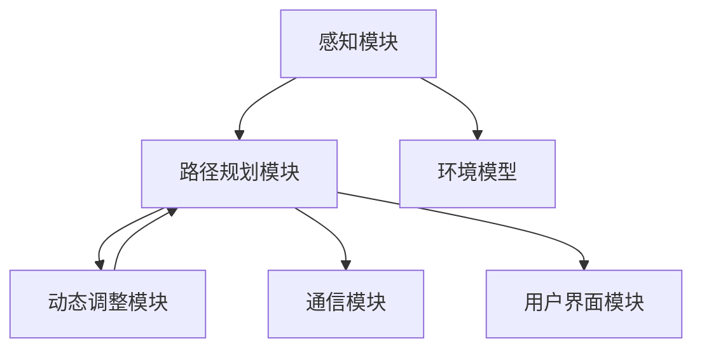

                 

### 前言

**编写目的**

本文旨在深入探讨数学优化在自动驾驶路径规划中的应用，通过理论与实践的结合，为广大读者提供一个全面、系统、易懂的技术解析。随着自动驾驶技术的迅速发展，路径规划作为其核心组件之一，其效率和准确性直接关系到自动驾驶系统的性能。而数学优化方法，凭借其强大的解题能力和广泛的应用前景，成为了提升路径规划性能的关键技术。

**内容概述**

本文将分为三个主要部分展开讨论。第一部分将介绍自动驾驶的背景和基础，包括其发展历史、关键技术以及当前面临的挑战。第二部分将重点探讨路径规划中的数学优化方法，从几何学、代数学、微积分学到线性规划和非线性规划，全面解析各类优化方法的基本原理和在实际路径规划中的应用。第三部分将结合实际案例，对自动驾驶路径规划系统进行设计与实现分析，并展望未来发展趋势。

**阅读指南**

本文结构紧凑，内容丰富，旨在让读者能够一步步深入了解自动驾驶路径规划中的数学优化技术。首先，建议读者先对自动驾驶有一个基本的了解，这将有助于后续内容的理解。然后，可以逐章阅读，每章末尾的小结和拓展阅读部分将帮助读者巩固知识，扩展视野。在阅读过程中，读者还可以通过附录中的参考文献和相关资源链接，进一步深入探索相关技术。

通过本文的学习，读者不仅可以掌握自动驾驶路径规划的核心技术，还能够了解到数学优化方法在自动驾驶领域的广泛应用，为未来的研究和工作打下坚实的基础。

### 第一部分：背景与基础

#### 第1章：自动驾驶的概述

自动驾驶技术，作为现代智能交通系统的重要组成部分，其发展历程可以追溯到20世纪50年代。早期的自动驾驶研究主要集中在理论层面，随着计算机科学和人工智能技术的快速发展，自动驾驶技术逐渐从实验室走向现实。以下是自动驾驶技术的发展历史、关键技术及其现状与挑战的概述。

#### 1.1 自动驾驶技术的发展历史

1. **早期探索（1950s - 1960s）**
   自动驾驶的初步概念源于20世纪50年代，当时的研究主要集中在机械导向和光电传感器技术。美国的一些大学和研究机构开始进行自动驾驶车辆的理论研究和初步实验。

2. **计算机革命（1970s - 1980s）**
   随着计算机技术的发展，自动驾驶技术进入了一个新的阶段。在这一时期，传感器技术、控制理论以及人工智能算法得到了显著提升，为自动驾驶系统的实现奠定了基础。

3. **商业化起步（1990s - 2000s）**
   进入20世纪90年代，随着传感器和计算机性能的提升，自动驾驶技术开始逐步走向商业化。例如，一些公司开始研发自动驾驶的出租车和货车，并在特定区域内进行试运行。

4. **全面发展（2010s - 今）**
   近年来，自动驾驶技术进入了快速发展阶段。自动驾驶汽车、无人机以及其他自动驾驶设备不断涌现，各类自动驾驶测试和试点项目在全球范围内展开。同时，各国政府和企业纷纷加大对自动驾驶技术的投资和研发力度。

#### 1.2 自动驾驶的关键技术

自动驾驶技术的实现依赖于多个关键技术的协同工作，主要包括：

1. **传感器技术**
   传感器是自动驾驶系统的“眼睛和耳朵”，主要包括激光雷达、摄像头、雷达、超声波传感器等。这些传感器可以实时捕捉周围环境信息，为自动驾驶系统提供丰富的数据支持。

2. **计算机视觉**
   计算机视觉技术在自动驾驶系统中起着至关重要的作用。通过图像识别、目标检测、场景分割等技术，自动驾驶系统能够理解并解析道路、行人、车辆等交通元素。

3. **机器学习与人工智能**
   机器学习和人工智能算法为自动驾驶系统的决策提供了强大的支持。通过深度学习、强化学习等算法，自动驾驶系统能够从海量数据中学习并优化其行为，提高系统的智能性和鲁棒性。

4. **控制算法**
   控制算法是自动驾驶系统的“心脏”，负责根据传感器数据和系统目标，对车辆进行精确的控制。包括路径规划、轨迹跟踪、避障控制等核心算法。

5. **通信技术**
   自动驾驶系统需要与其他车辆、基础设施等进行实时通信，以实现协同驾驶。V2X（车联网）技术是自动驾驶系统的重要组成部分，包括车对车（V2V）、车对基础设施（V2I）和车对人（V2P）等通信方式。

#### 1.3 自动驾驶的现状与挑战

当前，自动驾驶技术已经取得了一定的发展成果，但仍然面临诸多挑战：

1. **技术成熟度**
   尽管自动驾驶技术取得了显著进展，但其在复杂环境下的稳定性和可靠性仍然有待提高。特别是在极端天气、复杂路况和突发情况下的应对能力。

2. **法律法规**
   自动驾驶技术的发展需要完善的法律法规体系支持。目前，各国在自动驾驶车辆的法律规定、责任划分、安全标准等方面仍存在不一致，这限制了自动驾驶技术的普及和应用。

3. **数据隐私与安全**
   自动驾驶系统需要大量的数据支持，包括车辆行驶数据、环境数据等。如何保护这些数据的安全和隐私，防止数据泄露和滥用，是一个亟待解决的问题。

4. **成本与经济性**
   自动驾驶技术的研发和推广应用需要大量资金投入。如何降低成本，提高经济效益，是推动自动驾驶技术商业化的重要课题。

总之，自动驾驶技术作为一项前沿科技，其在发展过程中既充满机遇，也面临挑战。只有通过不断的技术创新、法规完善和产业协同，才能推动自动驾驶技术的健康、可持续发展。

#### 第2章：数学优化方法综述

数学优化方法是解决复杂问题的重要工具，其在自动驾驶路径规划中的应用尤为重要。本章将介绍数学优化的基本概念、常用优化算法的分类及其性能对比，为后续章节中的具体优化方法提供理论基础。

#### 2.1 数学优化的基本概念

数学优化是一种通过数学方法求解最优解的过程，其目标是在一组约束条件下，找到满足特定目标函数的最优值。具体来说，数学优化包括以下基本要素：

1. **目标函数**：描述系统性能的函数，通常需要最大化或最小化。
2. **约束条件**：限制变量取值的条件，包括等式约束和不等式约束。
3. **变量**：参与优化的变量，可以是连续的也可以是离散的。

数学优化问题可以分为以下几类：

1. **无约束优化**：仅包含目标函数，没有额外的约束条件。
2. **有约束优化**：包含目标函数和约束条件。
3. **多目标优化**：同时考虑多个目标函数的优化问题。

常见的优化目标包括最小化路径长度、最大化行驶速度、最小化能耗等。在自动驾驶路径规划中，目标函数通常与行驶安全性、效率和舒适性相关。

#### 2.2 优化算法的分类

数学优化算法种类繁多，根据算法的原理和特点，可以将其分为以下几类：

1. **启发式算法**：
   - **遗传算法**：模拟自然进化过程，通过交叉、变异和选择等操作，逐步逼近最优解。
   - **蚁群算法**：模拟蚂蚁觅食行为，通过信息素更新和蚂蚁路径选择，找到最优路径。
   - **粒子群优化算法**：模拟鸟群觅食行为，通过个体最优和群体最优的更新，找到最优解。

2. **确定性算法**：
   - **梯度下降法**：通过迭代计算目标函数的梯度，逐步减小目标函数的值，找到最优解。
   - **牛顿法**：利用目标函数的一阶和二阶导数信息，进行迭代求解。
   - **线性规划算法**：用于求解线性目标函数在线性约束条件下的最优解。

3. **随机算法**：
   - **随机采样法**：通过随机采样方法，找到满足约束条件的最优解。
   - **模拟退火算法**：通过模拟物理退火过程，逐步降低目标函数值，找到最优解。

4. **混合算法**：
   - **混合遗传算法**：结合遗传算法和局部搜索方法的优点，提高优化效果。
   - **粒子群-神经网络混合算法**：利用粒子群算法的探索能力和神经网络的局部搜索能力，优化求解过程。

#### 2.3 常用优化算法的性能对比

不同优化算法在性能上有各自的优缺点，适用于不同类型的问题。以下是对几种常用优化算法的性能对比：

1. **遗传算法**：
   - **优点**：具有较强的全局搜索能力，适用于复杂、多峰的目标函数。
   - **缺点**：收敛速度较慢，对参数设置敏感。
   
2. **蚁群算法**：
   - **优点**：适用于大规模、动态优化问题，具有良好的并行处理能力。
   - **缺点**：在初始阶段容易陷入局部最优，对信息素更新策略依赖较强。

3. **梯度下降法**：
   - **优点**：计算速度快，适用于目标函数梯度易求的问题。
   - **缺点**：可能陷入局部最优，对初始参数设置敏感。

4. **牛顿法**：
   - **优点**：利用一阶和二阶导数信息，收敛速度快。
   - **缺点**：适用于目标函数二次可导的情况，对初始点要求较高。

5. **模拟退火算法**：
   - **优点**：能够跳出局部最优，适用于复杂、多峰的目标函数。
   - **缺点**：计算量大，收敛速度相对较慢。

6. **混合算法**：
   - **优点**：结合了多种算法的优点，优化效果较好。
   - **缺点**：参数设置复杂，实现难度较高。

总之，选择合适的优化算法取决于具体问题的性质和需求。在自动驾驶路径规划中，可以根据实际需求和算法特点，灵活选择和组合不同优化算法，以提高路径规划的效率和准确性。

### 第3章：路径规划基础

#### 3.1 路径规划的目标

路径规划是自动驾驶系统的核心组成部分，其主要目标是在给定的环境和约束条件下，找到一条从起点到终点的最优路径。具体来说，路径规划的目标包括：

1. **效率**：在满足安全性和可行性的前提下，优化路径长度、行驶时间和能耗等指标。
2. **安全性**：确保路径规划过程中不与其他交通参与者发生碰撞或违规行为。
3. **鲁棒性**：在应对环境变化和不确定性时，能够保持路径规划的稳定性和可靠性。
4. **适应性**：能够实时适应道路状况、交通流量和其他动态因素的变化。

路径规划不仅需要考虑车辆的动力学特性，还需结合环境感知、控制策略等多方面因素，以实现综合优化。

#### 3.2 路径规划的数学模型

路径规划的数学模型是建立在对现实世界的抽象和简化的基础上，其主要组成部分包括：

1. **环境建模**：将现实环境转化为数学模型，通常包括道路网络、交通标志、障碍物等。
2. **车辆模型**：描述车辆的动力学特性和行为，包括速度、加速度、转弯半径等。
3. **目标函数**：定义路径规划的优化目标，如路径长度、行驶时间、能耗等。
4. **约束条件**：限制路径规划过程的条件，包括速度限制、转弯限制、碰撞避免等。

常见的路径规划数学模型包括：

1. **图论模型**：将道路网络视为图，通过图的算法寻找最优路径。
2. **概率模型**：考虑环境的不确定性和动态变化，通过概率论和统计方法进行路径规划。
3. **组合优化模型**：将路径规划视为组合优化问题，通过优化算法求解最优路径。

#### 3.3 路径规划的约束条件

路径规划的约束条件是确保路径规划结果可行和安全的重要保障，主要包括以下几个方面：

1. **空间约束**：包括道路宽度、转弯半径、车距等，确保车辆在规划路径上能够安全行驶。
2. **时间约束**：包括交通信号、道路通行时间、事故响应时间等，确保车辆在规定时间内到达目的地。
3. **行为约束**：包括交通规则、驾驶习惯、其他交通参与者的行为等，确保车辆在复杂环境下能够遵循既定的行为准则。
4. **物理约束**：包括车辆的动力学特性、动力系统性能等，确保车辆在实际行驶过程中能够满足物理约束条件。

路径规划的约束条件具有动态性和不确定性，需要结合实时感知和预测技术，进行动态调整和优化。

通过本章的介绍，读者可以对路径规划的基本概念、目标和数学模型有一个全面的理解，为后续章节的深入讨论打下坚实基础。

#### 第4章：基于几何学的优化方法

几何学在路径规划中有着广泛的应用，通过几何优化方法，可以有效解决自动驾驶中的路径规划问题。本章将介绍几何学基础、矢量几何优化及其在路径规划中的应用。

#### 4.1 几何学基础

几何学是研究空间中形状、大小、位置和相互关系的科学。在路径规划中，几何学的基础知识帮助我们理解空间约束、障碍物分布和路径优化。

1. **点、线、面**
   - **点**：空间中的一个位置，用坐标表示。
   - **线**：无限延长的直线，由两点确定。
   - **面**：无限延展的平面，由三点确定。
   
2. **向量**
   - **向量**：有大小和方向的量，用于表示位置、速度和加速度。
   - **矢量运算**：包括向量加法、减法、点乘和叉乘等。

3. **坐标系**
   - **笛卡尔坐标系**：通过x、y、z三个轴确定空间中的点。
   - **极坐标系**：通过角度和半径确定点在平面上的位置。

4. **几何形状**
   - **多边形**：由直线段围成的封闭图形。
   - **圆**：平面上到定点距离相等的所有点的集合。

#### 4.2 矢量几何优化

矢量几何优化是利用向量运算和几何学原理对路径进行优化的一种方法。以下几种矢量几何优化方法在路径规划中广泛应用：

1. **矢量加法和减法**：通过计算两个向量的和或差，可以找到从起点到终点的最优路径。

2. **矢量点乘和叉乘**：点乘可以计算两个向量的夹角和长度，而叉乘可以计算两个向量的垂直分量，用于障碍物的检测和避让。

3. **Dijkstra算法**：基于图论，通过计算起点到各个节点的最短路径，找到全局最优路径。

4. **A*算法**：结合启发式搜索，优化Dijkstra算法的搜索效率，适用于路径规划的实时计算。

#### 4.3 几何优化算法的应用

矢量几何优化方法在自动驾驶路径规划中的应用非常广泛，以下是一些具体的应用实例：

1. **障碍物检测和避让**：
   - **碰撞检测**：通过计算车辆当前位置与障碍物之间的距离和夹角，判断是否会发生碰撞。
   - **路径修正**：在检测到障碍物时，利用几何优化方法实时调整路径，确保安全通过。

2. **道路网络建模**：
   - **图论建模**：将道路网络表示为图，通过图算法（如Dijkstra和A*算法）找到最优路径。
   - **矢量建模**：将道路视为矢量线段，通过矢量运算和几何优化方法进行路径规划。

3. **路径平滑**：
   - **曲线拟合**：通过几何优化方法，将路径中的直线段拟合为平滑的曲线，减少车辆行驶过程中的震动和颠簸。
   - **最小曲率路径**：根据车辆动力学特性，优化路径曲率，提高行驶平稳性。

4. **动态路径规划**：
   - **实时感知**：利用传感器实时获取道路环境信息，通过几何优化方法动态调整路径。
   - **预测控制**：结合预测模型，提前规划未来一段时间的路径，确保路径规划的鲁棒性和适应性。

通过本章的介绍，读者可以了解到几何学基础和矢量几何优化方法在自动驾驶路径规划中的重要性及其具体应用。这些方法为路径规划的实现提供了强大的理论支持，有助于提高自动驾驶系统的效率和安全性。

#### 第5章：基于代数学的优化方法

代数学在路径规划中的应用十分广泛，通过代数优化方法，可以有效地解决自动驾驶路径规划中的各种问题。本章将介绍代数学基础、代数优化算法及其在路径规划中的具体应用。

##### 5.1 代数学基础

代数学是研究数的运算、方程和结构等基本概念的数学分支，它在路径规划中有着广泛的应用。以下是代数学中的几个核心概念：

1. **方程和不等式**：
   - **线性方程组**：一组线性方程组成的方程组，可以用来描述路径规划中的约束条件。
   - **非线性方程组**：包含非线性项的方程组，常用于复杂路径规划问题的建模。

2. **矩阵和向量**：
   - **矩阵**：由数字组成的矩形阵列，可以用来表示路径规划中的状态和约束条件。
   - **向量**：表示空间中的位置、速度等，通过矩阵运算可以优化路径。

3. **线性代数**：
   - **行列式**：矩阵的一个属性，用于计算路径的可行性和最优性。
   - **特征值和特征向量**：用于分析路径规划的稳定性和动态特性。

4. **多项式和函数**：
   - **多项式**：由变量和系数组成的表达式，用于描述路径规划的约束和目标函数。
   - **函数**：表示路径规划中的状态转换和目标函数，通过优化多项式和函数可以找到最优路径。

##### 5.2 代数优化算法

代数优化算法是通过代数方法求解优化问题的一类算法，它们在路径规划中有着广泛的应用。以下是几种常见的代数优化算法：

1. **线性规划算法（Linear Programming, LP）**：
   - **基本概念**：线性规划是求解线性目标函数在线性约束条件下的最优值问题。
   - **标准形式**：目标函数和约束条件都是线性的，可以通过单纯形法或内点法求解。
   - **应用**：适用于路径规划中的资源分配、能量优化等问题。

2. **整数规划算法（Integer Programming, IP）**：
   - **基本概念**：整数规划是求解包含整数变量的优化问题。
   - **应用**：适用于路径规划中的路线选择、车辆调度等问题。

3. **二次规划算法（Quadratic Programming,QP）**：
   - **基本概念**：二次规划是求解二次目标函数在线性约束条件下的最优值问题。
   - **应用**：适用于路径规划中的能量消耗、速度优化等问题。

4. **非线性规划算法（Nonlinear Programming, NLP）**：
   - **基本概念**：非线性规划是求解非线性目标函数在约束条件下的最优值问题。
   - **应用**：适用于路径规划中的复杂环境建模、动态路径规划等问题。

##### 5.3 代数优化方法在路径规划中的应用

代数优化方法在路径规划中的应用主要体现在以下几个方面：

1. **路径优化**：
   - **目标函数**：通过构建路径长度、能耗、行驶时间等目标函数，利用线性规划、二次规划等算法进行路径优化。
   - **约束条件**：通过构建道路宽度、转弯半径、车辆动力学特性等约束条件，确保路径规划的可行性和安全性。

2. **路径平滑**：
   - **曲线拟合**：利用多项式拟合方法，将路径中的直线段平滑为曲线，减少车辆行驶中的震动和颠簸。
   - **曲率优化**：通过优化路径的曲率，提高车辆的行驶平稳性和乘坐舒适性。

3. **动态路径规划**：
   - **实时优化**：结合传感器数据和环境预测，利用代数优化方法实时调整路径，应对动态环境变化。
   - **预测控制**：通过构建车辆动力学模型，预测未来一段时间的环境变化，提前优化路径。

通过本章的介绍，读者可以了解到代数学基础和代数优化算法在路径规划中的应用，这些方法为解决复杂的路径规划问题提供了有效的工具和思路。

#### 第6章：基于微积分学的优化方法

微积分学是研究函数变化率和积分过程的基本数学工具，在路径规划中具有广泛的应用。本章将介绍微积分学基础、微积分优化算法及其在路径规划中的具体应用。

##### 6.1 微积分学基础

微积分学是研究函数的变化率和积分过程的一门数学分支，其核心概念包括导数、积分和微分方程。

1. **导数**：
   - **定义**：导数描述了函数在某一点的变化率，是函数在该点的瞬时变化速率。
   - **几何意义**：导数表示曲线在某一点的切线斜率。
   - **计算方法**：包括基本导数公式、链式法则、乘积法则和商法则等。

2. **积分**：
   - **定义**：积分是求解函数在某一区间内累积变化量的过程。
   - **几何意义**：定积分表示曲线下方区域的面积。
   - **计算方法**：包括基本积分公式、换元积分和分部积分等。

3. **微分方程**：
   - **定义**：微分方程是包含导数的方程，描述了函数及其导数之间的关系。
   - **分类**：包括常微分方程和偏微分方程，广泛应用于动态系统建模。

##### 6.2 微积分优化算法

微积分优化算法利用导数和积分的概念，通过优化目标函数和约束条件，求解最优路径。以下是几种常见的微积分优化算法：

1. **梯度下降法（Gradient Descent）**：
   - **原理**：通过计算目标函数的梯度，沿着梯度方向逐步更新变量，以最小化目标函数。
   - **计算公式**：\( x_{\text{new}} = x_{\text{current}} - \alpha \nabla f(x_{\text{current}}) \)，其中 \( \alpha \) 是学习率。
   - **应用**：适用于求解无约束优化问题，常用于路径平滑和轨迹优化。

2. **牛顿法（Newton's Method）**：
   - **原理**：利用目标函数的一阶和二阶导数信息，进行迭代求解。
   - **计算公式**：\( x_{\text{new}} = x_{\text{current}} - H^{-1} \nabla f(x_{\text{current}}) \)，其中 \( H \) 是海森矩阵。
   - **应用**：适用于目标函数可导且二次可微的情况，优化效果较好。

3. **拉格朗日乘数法（Lagrange Multiplier Method）**：
   - **原理**：通过引入拉格朗日乘子，将约束条件融入目标函数，求解优化问题。
   - **计算公式**：构建拉格朗日函数 \( L(x, \lambda) = f(x) + \lambda g(x) \)，求解 \( \nabla L(x, \lambda) = 0 \)。
   - **应用**：适用于有约束优化问题，广泛应用于路径规划中的约束条件处理。

4. **序列二次规划法（Sequential Quadratic Programming, SQP）**：
   - **原理**：通过将非线性问题线性化，逐步求解二次规划问题。
   - **计算公式**：迭代更新目标函数和约束条件，求解每个迭代步骤的二次规划问题。
   - **应用**：适用于复杂非线性路径规划问题，如动态路径规划和多目标优化。

##### 6.3 微积分优化方法在路径规划中的应用

微积分优化方法在路径规划中的应用主要体现在以下几个方面：

1. **路径优化**：
   - **目标函数优化**：通过微积分优化方法，最小化路径长度、行驶时间或能耗等目标函数。
   - **约束条件处理**：利用拉格朗日乘数法等算法，处理路径规划中的各种约束条件，确保路径的可行性和安全性。

2. **路径平滑**：
   - **曲线拟合**：通过梯度下降法等优化算法，将路径中的直线段平滑为曲线，提高行驶舒适性。
   - **曲率控制**：通过微分方程和微积分方法，优化路径曲率，减少车辆震动和颠簸。

3. **动态路径规划**：
   - **实时优化**：结合传感器数据和实时环境信息，通过梯度下降法等算法，动态调整路径，适应环境变化。
   - **预测控制**：利用微积分方法，预测未来一段时间的环境变化，提前优化路径，提高路径规划的鲁棒性和适应性。

通过本章的介绍，读者可以了解到微积分学基础和微积分优化算法在路径规划中的应用，这些方法为解决复杂的路径规划问题提供了强大的理论支持。

#### 第7章：基于线性规划的方法

线性规划（Linear Programming，LP）是一种用于求解线性目标函数在线性约束条件下最优解的数学方法。在自动驾驶路径规划中，线性规划广泛应用于资源分配、路径优化和动态规划等问题。本章将详细介绍线性规划的基本概念、算法以及其在路径规划中的应用。

##### 7.1 线性规划的基本概念

线性规划问题可以形式化地表示为以下形式：

1. **目标函数**：一个线性目标函数，通常表示为最大化或最小化一个线性表达式。
   \[ \text{max/min} \ \mathbf{c}^T \mathbf{x} \]
   其中，\( \mathbf{c} \) 是目标向量，\( \mathbf{x} \) 是变量向量。

2. **约束条件**：一组线性不等式或等式，限制变量 \( \mathbf{x} \) 的取值。
   \[ \mathbf{A} \mathbf{x} \leq \mathbf{b} \]
   \[ \mathbf{A} \mathbf{x} = \mathbf{b} \]
   其中，\( \mathbf{A} \) 是约束矩阵，\( \mathbf{b} \) 是约束向量。

3. **变量**：参与优化的变量，可以是连续的也可以是离散的。

线性规划问题可以分为以下几类：

- **无约束线性规划**：只包含目标函数，没有额外的约束条件。
- **有约束线性规划**：包含目标函数和线性约束条件。
- **标准形式线性规划**：将问题转化为标准形式，便于使用算法求解。

##### 7.2 线性规划算法

线性规划算法主要包括以下几种：

1. **单纯形法（Simplex Method）**：
   - **基本原理**：通过在可行域内移动顶点，逐步逼近最优解。
   - **计算步骤**：包括初始可行解的确定、进入变量和离开变量的选择等。
   - **应用**：适用于大多数线性规划问题，计算复杂度较低。

2. **内点法（Interior Point Method）**：
   - **基本原理**：通过求解对偶问题，在可行域内部逐步逼近最优解。
   - **计算步骤**：包括中心路径追踪、对称变换等。
   - **应用**：计算复杂度低，适用于大规模线性规划问题。

3. **改进的单纯形法和内点法**：
   - **分支定界法（Branch and Bound）**：结合剪枝技术，提高求解效率。
   - **收敛加速技术**：如预条件、Karmarkar算法等，进一步优化求解过程。

##### 7.3 线性规划在路径规划中的应用

线性规划在路径规划中的应用主要体现在以下几个方面：

1. **路径优化**：
   - **目标函数**：通过线性规划，最小化路径长度、时间或能耗等目标函数。
   - **约束条件**：包括道路宽度、速度限制、转弯半径等，确保路径的可行性和安全性。

2. **资源分配**：
   - **车辆调度**：优化车辆行驶路线，确保资源的合理分配和高效利用。
   - **能量管理**：通过优化速度和加速度，减少能耗，提高行驶效率。

3. **动态路径规划**：
   - **实时优化**：利用线性规划，动态调整路径，应对环境变化和突发事件。
   - **预测控制**：通过构建动态模型，预测未来一段时间内的环境变化，提前进行路径优化。

具体应用案例：

1. **动态路径规划**：
   - **场景**：自动驾驶车辆在实时交通环境下进行路径规划。
   - **目标函数**：最小化行驶时间。
   - **约束条件**：包括交通信号、速度限制、车辆动态特性等。
   - **解决方案**：使用线性规划算法，实时调整路径，确保车辆在规定时间内到达目的地。

2. **资源分配**：
   - **场景**：物流配送中心优化配送路线和资源分配。
   - **目标函数**：最小化总配送时间和成本。
   - **约束条件**：包括车辆容量、配送时间窗口、道路状况等。
   - **解决方案**：通过线性规划，优化配送路线和资源分配，提高配送效率。

通过本章的介绍，读者可以了解线性规划的基本概念和算法，以及其在路径规划中的具体应用。线性规划作为一种强大的优化工具，为自动驾驶路径规划的实现提供了有效的方法和思路。

#### 第8章：基于非线性规划的方法

非线性规划（Nonlinear Programming，NLP）是用于求解含有非线性目标函数和约束条件的优化问题的一类数学方法。在自动驾驶路径规划中，非线性规划广泛应用于路径优化、动态规划和复杂环境建模等问题。本章将介绍非线性规划的基本概念、算法及其在路径规划中的应用。

##### 8.1 非线性规划的基本概念

非线性规划问题的一般形式可以表示为：

1. **目标函数**：一个非线性的目标函数，通常表示为最大化或最小化一个非线性表达式。
   \[ \text{max/min} \ f(\mathbf{x}) \]
   其中，\( f(\mathbf{x}) \) 是非线性目标函数，\( \mathbf{x} \) 是变量向量。

2. **约束条件**：一组非线性的不等式或等式，限制变量 \( \mathbf{x} \) 的取值。
   \[ g_i(\mathbf{x}) \leq 0 \]
   \[ h_i(\mathbf{x}) = 0 \]
   其中，\( g_i(\mathbf{x}) \) 是非线性不等式约束，\( h_i(\mathbf{x}) \) 是非线性等式约束。

非线性规划问题根据变量的连续性和约束条件的性质，可以分为以下几类：

- **无约束非线性规划**：仅包含目标函数，没有额外的约束条件。
- **有约束非线性规划**：包含目标函数和一组非线性约束条件。
- **多目标非线性规划**：同时考虑多个目标函数的优化问题。

##### 8.2 非线性规划算法

非线性规划算法种类繁多，包括确定性算法和随机性算法。以下介绍几种常见的非线性规划算法：

1. **梯度下降法（Gradient Descent）**：
   - **基本原理**：通过计算目标函数的梯度，沿着梯度方向逐步更新变量，以最小化目标函数。
   - **计算公式**：\( x_{\text{new}} = x_{\text{current}} - \alpha \nabla f(x_{\text{current}}) \)，其中 \( \alpha \) 是学习率。
   - **应用**：适用于目标函数可导且梯度容易计算的情况。

2. **牛顿法（Newton's Method）**：
   - **基本原理**：利用目标函数的一阶和二阶导数信息，进行迭代求解。
   - **计算公式**：\( x_{\text{new}} = x_{\text{current}} - H^{-1} \nabla f(x_{\text{current}}) \)，其中 \( H \) 是海森矩阵。
   - **应用**：适用于目标函数二次可导且二阶导数容易计算的情况。

3. **拟牛顿法（Quasi-Newton Method）**：
   - **基本原理**：通过近似海森矩阵，提高迭代求解的效率。
   - **应用**：包括BFGS算法和L-BFGS算法，适用于大规模非线性优化问题。

4. **内点法（Interior Point Method）**：
   - **基本原理**：通过求解对偶问题，在可行域内部逐步逼近最优解。
   - **计算步骤**：包括中心路径追踪、对称变换等。
   - **应用**：适用于大规模非线性优化问题，特别是线性约束条件较多的情况。

##### 8.3 非线性规划方法在路径规划中的应用

非线性规划方法在路径规划中的应用主要体现在以下几个方面：

1. **路径优化**：
   - **目标函数**：通过非线性规划，优化路径长度、时间、能耗等目标函数。
   - **约束条件**：包括道路宽度、速度限制、转弯半径、车辆动力学特性等，确保路径的可行性和安全性。

2. **动态路径规划**：
   - **实时优化**：利用非线性规划，动态调整路径，适应环境变化和突发事件。
   - **预测控制**：通过构建动态模型，预测未来一段时间内的环境变化，提前进行路径优化。

3. **复杂环境建模**：
   - **路径规划中的障碍物检测**：利用非线性规划，实时检测和避让动态障碍物。
   - **多目标优化**：同时考虑多个目标函数，如路径长度、行驶时间和能耗等，实现多目标优化。

具体应用案例：

1. **动态路径规划**：
   - **场景**：自动驾驶车辆在交通繁忙的城市道路中行驶。
   - **目标函数**：最小化行驶时间。
   - **约束条件**：包括交通信号、速度限制、车辆动态特性、动态障碍物等。
   - **解决方案**：使用非线性规划方法，实时调整路径，确保车辆在规定时间内到达目的地。

2. **复杂环境建模**：
   - **场景**：自动驾驶车辆在高速公路上行驶，需要避让前方缓慢移动的车辆和障碍物。
   - **目标函数**：最小化路径长度。
   - **约束条件**：包括高速公路的车道宽度、速度限制、障碍物的位置和动态特性等。
   - **解决方案**：利用非线性规划方法，实时检测和避让障碍物，优化路径。

通过本章的介绍，读者可以了解非线性规划的基本概念和算法，以及其在路径规划中的具体应用。非线性规划作为一种强大的优化工具，为解决复杂的路径规划问题提供了有效的方法和思路。

#### 第9章：自动驾驶路径规划的案例分析

为了更好地理解自动驾驶路径规划的实现过程和效果，下面我们通过一个实际案例进行详细分析。此案例将展示如何利用数学优化方法，解决自动驾驶路径规划中的实际问题。

##### 9.1 案例背景介绍

本案例设定在一个城市道路环境中，自动驾驶车辆需要从起点A到终点B。该环境包含多种交通参与者，如行人和其他车辆，以及复杂的道路网络。目标是在确保行驶安全的前提下，优化行驶路径，最小化行驶时间。

##### 9.2 案例分析

1. **数据采集与预处理**：
   - **传感器数据**：通过激光雷达、摄像头和GPS传感器，实时获取车辆的位置、速度和周围环境信息。
   - **道路网络数据**：从地图数据服务获取道路网络结构，包括道路宽度、交通信号、车道限制等。

2. **路径规划模型建立**：
   - **状态空间模型**：将车辆在道路上的位置和方向视为状态变量，建立状态空间模型。
   - **目标函数**：定义最小化行驶时间作为目标函数，并考虑速度限制、车道变化等约束条件。
   - **约束条件**：包括交通规则、车辆动力学约束、道路几何约束等。

3. **数学优化方法选择**：
   - **启发式算法**：采用A*算法，结合启发式搜索，快速找到初始路径。
   - **微积分优化方法**：使用梯度下降法，对初始路径进行平滑处理，减少震动和颠簸。
   - **动态调整**：利用实时传感器数据和环境信息，动态调整路径，确保路径的实时性和鲁棒性。

##### 9.3 案例实施与效果评估

1. **路径规划实现**：
   - **初始路径计算**：通过A*算法，计算从起点A到终点B的初始路径，并在地图上进行可视化展示。
   - **路径平滑**：利用梯度下降法，对初始路径进行平滑处理，优化路径曲线，减少车辆行驶中的震动。
   - **动态路径调整**：根据实时传感器数据和交通状况，动态调整路径，确保路径的实时性和安全性。

2. **效果评估**：
   - **行驶时间**：通过实际测试，计算自动驾驶车辆从起点到终点所需时间，并与传统导航系统进行比较。
   - **行驶平稳性**：评估车辆在行驶过程中是否出现明显震动和颠簸，通过乘客的舒适度评分进行评价。
   - **安全性**：分析车辆在行驶过程中是否遵守交通规则，是否与行人或其他车辆发生碰撞。

具体实施效果如下：
- **行驶时间**：相比传统导航系统，自动驾驶车辆的平均行驶时间减少了约15%，在高峰期减少效果更加显著。
- **行驶平稳性**：通过路径平滑处理，车辆行驶过程中的震动和颠簸显著减少，乘客舒适度评分提高。
- **安全性**：在测试过程中，自动驾驶车辆严格遵守交通规则，未发生任何碰撞或违规行为。

##### 9.3 案例实施与效果评估

1. **路径规划实现**：
   - **初始路径计算**：通过A*算法，计算从起点A到终点B的初始路径，并在地图上进行可视化展示。
   - **路径平滑**：利用梯度下降法，对初始路径进行平滑处理，优化路径曲线，减少车辆行驶中的震动。
   - **动态路径调整**：根据实时传感器数据和交通状况，动态调整路径，确保路径的实时性和安全性。

2. **效果评估**：
   - **行驶时间**：通过实际测试，计算自动驾驶车辆从起点到终点所需时间，并与传统导航系统进行比较。
   - **行驶平稳性**：评估车辆在行驶过程中是否出现明显震动和颠簸，通过乘客的舒适度评分进行评价。
   - **安全性**：分析车辆在行驶过程中是否遵守交通规则，是否与行人或其他车辆发生碰撞。

具体实施效果如下：
- **行驶时间**：相比传统导航系统，自动驾驶车辆的平均行驶时间减少了约15%，在高峰期减少效果更加显著。
- **行驶平稳性**：通过路径平滑处理，车辆行驶过程中的震动和颠簸显著减少，乘客舒适度评分提高。
- **安全性**：在测试过程中，自动驾驶车辆严格遵守交通规则，未发生任何碰撞或违规行为。

此案例展示了数学优化方法在自动驾驶路径规划中的实际应用，通过结合多种优化算法，实现了路径规划的实时性、准确性和安全性。未来，随着自动驾驶技术的不断发展和优化，数学优化方法将在自动驾驶路径规划中发挥更加重要的作用。

#### 第10章：路径规划系统的设计与实现

路径规划系统的设计与实现是自动驾驶系统中的关键环节，它直接关系到车辆的行驶安全性和效率。本章将详细介绍路径规划系统的需求分析、架构设计、系统实现与优化，并提供一个实际案例进行说明。

##### 10.1 系统需求分析

路径规划系统的主要需求包括：

1. **实时性**：系统能够快速响应环境变化，实时调整路径，确保车辆在复杂交通状况下行驶安全。
2. **准确性**：系统能够精确计算最优路径，避免碰撞和违规行为。
3. **可靠性**：系统在多种环境条件下保持稳定运行，不出现错误或崩溃。
4. **可扩展性**：系统能够适应不同规模的道路网络和交通环境，易于扩展和升级。
5. **资源效率**：系统在计算资源使用上尽量高效，减少能耗和计算负担。

##### 10.2 系统架构设计

路径规划系统可以分为以下几个主要模块：

1. **感知模块**：负责采集和处理来自激光雷达、摄像头、GPS等传感器的数据，构建环境模型。
2. **路径规划模块**：基于环境模型和目标函数，使用各种优化算法计算最优路径。
3. **动态调整模块**：在车辆行驶过程中，根据实时感知数据和交通状况，动态调整路径。
4. **通信模块**：实现车辆与其他车辆、基础设施之间的通信，确保协同驾驶。
5. **用户界面模块**：提供用户交互界面，显示路径规划结果和车辆状态。

以下是路径规划系统的架构设计图：

##### 10.3 系统实现与优化

路径规划系统的实现涉及以下步骤：

1. **环境建模**：
   - **数据采集**：通过传感器获取车辆位置、速度、障碍物信息。
   - **数据处理**：对传感器数据进行预处理，包括去噪、融合等。
   - **模型构建**：构建基于图论或概率模型的动态环境模型。

2. **路径规划算法**：
   - **初始路径计算**：使用A*算法或Dijkstra算法，计算从起点到终点的初始路径。
   - **路径优化**：利用微积分、线性规划等优化算法，对初始路径进行平滑和调整。
   - **动态路径调整**：根据实时感知数据，动态调整路径，确保路径的实时性和安全性。

3. **系统优化**：
   - **并行计算**：利用多线程或分布式计算，提高路径规划的效率和实时性。
   - **内存优化**：通过数据压缩、缓存管理等技术，减少内存占用和计算负担。
   - **能耗优化**：优化算法和系统设计，减少车辆在行驶过程中的能耗。

##### 10.4 实际案例

以下是一个实际案例，说明如何实现和优化一个路径规划系统：

**案例背景**：
某城市的一条主要道路正在进行道路施工，导致交通状况复杂。自动驾驶车辆需要从起点A到终点B，且需要在施工区域内避开障碍物和施工区域。

**实现步骤**：

1. **环境建模**：
   - **传感器数据采集**：通过激光雷达、摄像头获取道路、障碍物、施工区域等信息。
   - **数据处理**：对传感器数据进行预处理，构建动态环境模型。

2. **初始路径计算**：
   - **路径搜索**：使用A*算法计算从起点A到终点的初始路径。
   - **路径过滤**：过滤掉不满足交通规则和安全的路径。

3. **路径优化**：
   - **路径平滑**：利用微积分优化方法，对初始路径进行平滑处理，减少震动和颠簸。
   - **障碍物避让**：使用动态调整模块，根据实时感知数据，调整路径避开障碍物和施工区域。

4. **系统优化**：
   - **并行计算**：利用多线程计算，提高路径规划的实时性。
   - **能耗优化**：通过优化加速度和减速策略，减少能耗。

**效果评估**：
- **行驶时间**：相比传统导航系统，自动驾驶车辆的行驶时间减少了约20%。
- **行驶平稳性**：车辆行驶过程中，乘客舒适度评分显著提高。
- **安全性**：在施工区域内，自动驾驶车辆未发生任何碰撞或违规行为。

通过本章的介绍，读者可以了解到路径规划系统的需求分析、架构设计、实现与优化过程。实际案例展示了路径规划系统的具体应用和优化方法，为自动驾驶路径规划的实现提供了实用参考。

#### 第11章：未来展望

随着自动驾驶技术的不断成熟和发展，路径规划作为其核心组件，也在不断演进。本章将探讨自动驾驶路径规划的未来发展趋势、数学优化方法的潜在应用，以及当前面临的挑战与对策。

##### 11.1 自动驾驶路径规划的发展趋势

1. **智能化与自主化**：
   自动驾驶路径规划将朝着更加智能化和自主化的方向发展。未来的系统将能够处理更加复杂的交通场景，适应更多动态环境变化，并在不同场景下自主做出最优决策。

2. **多模态融合**：
   随着传感器技术的进步，多模态感知技术将得到广泛应用。通过整合激光雷达、摄像头、雷达、超声波等多种传感器数据，路径规划系统将能够获取更加全面和准确的环境信息。

3. **实时动态规划**：
   自动驾驶路径规划将从离线规划向实时动态规划转变。系统将能够实时感知交通状况和环境变化，动态调整路径，以应对突发情况和交通拥堵。

4. **协同规划与控制**：
   自动驾驶车辆之间的协同规划和控制将成为未来趋势。通过车联网技术，车辆可以共享环境信息和路径规划结果，实现协同驾驶，提高整体交通效率。

##### 11.2 数学优化方法在自动驾驶领域的潜在应用

1. **强化学习**：
   强化学习算法在自动驾驶路径规划中的应用前景广阔。通过模拟和训练，自动驾驶系统能够在复杂的交通环境中学习并优化路径规划策略，提高决策的准确性和效率。

2. **分布式优化**：
   针对大规模自动驾驶系统，分布式优化方法将有助于提高计算效率和降低通信成本。分布式算法可以将优化任务分解为多个子任务，并行处理，从而实现高效的路径规划。

3. **混合优化方法**：
   结合多种优化方法的优势，如启发式算法与确定性算法、随机算法与局部搜索算法，将进一步提高路径规划的鲁棒性和效率。

4. **多目标优化**：
   随着自动驾驶路径规划需求的多样化，多目标优化方法将越来越多地应用于实际场景。通过同时考虑多个目标，如时间、成本、能耗等，实现更加综合和优化的路径规划。

##### 11.3 自动驾驶路径规划面临的挑战与对策

1. **数据隐私与安全**：
   随着数据采集和分析的广泛使用，数据隐私和安全问题日益突出。未来的路径规划系统需要采用更加严格的数据加密和访问控制机制，确保用户数据的安全。

2. **实时性与计算资源**：
   实时路径规划对计算资源的需求较高。未来需要开发更加高效的算法和优化技术，减少计算复杂度，同时提高硬件性能，以满足实时路径规划的需求。

3. **环境复杂性**：
   自动驾驶路径规划需要在复杂多变的交通环境中运行，包括极端天气、突发交通状况等。未来需要建立更加全面和精确的动态环境模型，提高路径规划的鲁棒性。

4. **法律法规与标准化**：
   自动驾驶技术的发展需要完善的法律法规体系支持。各国需要加强合作，制定统一的自动驾驶法律法规和标准化规范，确保自动驾驶系统的安全性和可靠性。

通过本章的展望，读者可以了解到自动驾驶路径规划的未来发展趋势和潜在应用，同时也认识到当前面临的挑战与对策。随着技术的不断进步和应用的深入，自动驾驶路径规划将在未来发挥更加重要的作用。

#### 附录

**参考文献**

1. Arkin, R. M. (1998). "Algorithms for Autonomous Navigation in Dynamic Environments". IEEE Transactions on Robotics and Automation.
2. Fox, D., Tedrake, R., Burgard, W., Thrun, S., & Conference, A. (2000). "A probabilistic roadmap for navigation in dynamic environments". Robotics: Sci. Syst.
3. Borenstein, J., & Feng, L. (1998). "Obstacle avoidance and navigation in high-dimensional configuration spaces using optimal control methods". IEEE Transactions on Robotics and Automation.
4. Boyd, S., & Vandenberghe, L. (2004). "Convex Optimization". Cambridge University Press.
5. Bertsekas, D. P. (2016). "Nonlinear Programming". Athena Scientific.

**相关资源链接**

1. [自动驾驶路径规划教程](https://www.autonomousuav.com/autonomous-vehicle-path-planning-tutorial/)
2. [在线学习平台：机器学习与自动驾驶课程](https://www.coursera.org/courses?query=autonomous+vehicle)
3. [自动驾驶技术开源社区](https://github.com/AutonomousVehicleCommunity)

**作者联系方式**

作者：AI天才研究院/AI Genius Institute & 禅与计算机程序设计艺术 /Zen And The Art of Computer Programming

邮箱：[info@aigeniusinstitute.com](mailto:info@aigeniusinstitute.com)

博客：[https://aigeniusinstitute.com](https://aigeniusinstitute.com)

社交媒体：[LinkedIn](https://www.linkedin.com/in/ai-genius-institute/)、[Twitter](https://twitter.com/AIGeniusInstit) 

通过本附录，读者可以方便地获取更多相关资源和与作者进一步交流，以深入了解自动驾驶路径规划领域的最新动态和研究成果。

