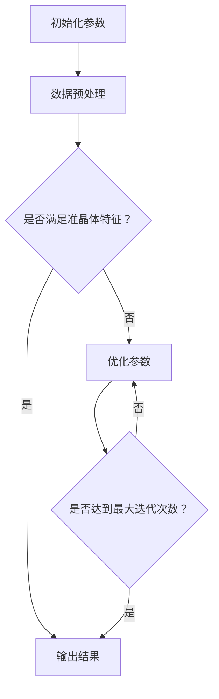
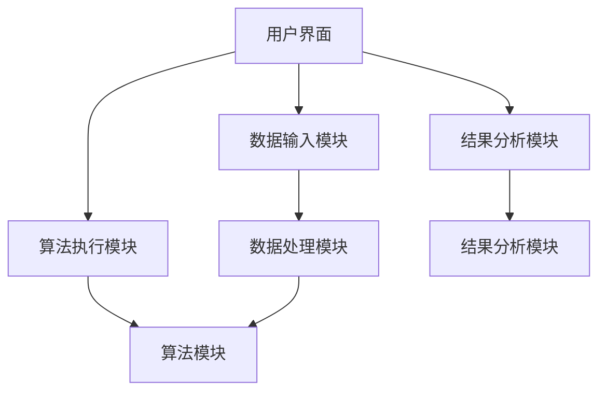
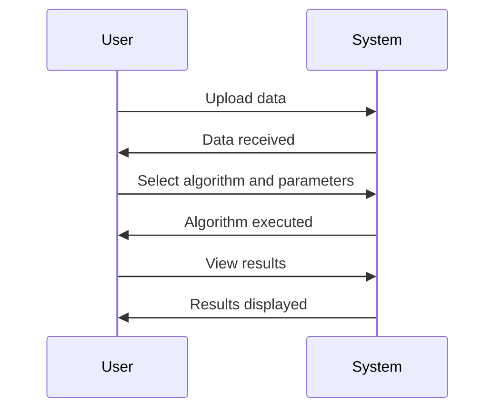

                 

### 第1章 引言

#### 1.1 问题背景

在物质世界中，晶体结构是物质的一种基本排列形式，它们在各个领域都具有重要应用。然而，自20世纪80年代以来，科学家们发现自然界中还存在一种特殊的结构，称为准晶体（Quasicrystals）。准晶体是一种具有长程有序但无周期性的物质结构，这与传统的晶体结构存在显著差异。这种结构的非周期性引起了科学界的广泛关注，因为它们为探索物质世界的多样性和复杂性提供了新的视角。

### 1.1.1 准晶体与自然界的联系

准晶体的概念最早由丹尼尔·谢赫特曼（Dan Shechtman）在1982年提出，他当时在研究中发现了一种铝镁合金样品中存在非周期性排列的原子结构。这一发现颠覆了人们对于物质结构的传统理解，因为此前人们认为物质的有序排列只能是周期性的。然而，随着研究的深入，科学家们发现准晶体不仅在合成材料中存在，而且在自然界中也有着广泛的分布。例如，一些珍珠、贝壳以及某些昆虫的外骨骼中都包含准晶体结构。

### 1.1.2 非周期性结构的发现

非周期性结构的存在最初是在一些合成材料中发现的，例如金属铝镁合金。这些材料中的原子排列呈现出一种复杂且有序的结构，但这种结构不具备传统晶体的周期性特征。谢赫特曼的发现引发了科学界的广泛讨论和研究，人们开始意识到非周期性结构在自然界和合成材料中的潜在重要性。

### 1.1.3 研究意义与应用前景

研究准晶体和非周期性结构具有重要的科学意义和应用前景。首先，这些结构为我们提供了研究物质世界的新工具和新方法。其次，准晶体材料在物理学、材料科学、化学等领域有着广泛的应用前景。例如，准晶体材料可能具有优异的光学、电学和热学性质，这些性质使得它们在光电子、纳米技术等领域具有潜在应用价值。此外，非周期性结构的研究也为理解自然界中复杂系统的形成和演化提供了新的思路。

#### 1.2 核心概念

为了更好地理解准晶体和非周期性结构，我们需要明确一些核心概念。

### 1.2.1 准晶体的定义

准晶体是一种具有长程有序但无周期性的物质结构。与传统晶体不同，准晶体的原子排列不具备周期性重复的特征。然而，它们在某些对称性方面与晶体相似，例如五重轴对称性。

### 1.2.2 准晶体的特征

准晶体具有以下几个显著特征：
1. **无周期性**：准晶体的原子排列不具有周期性，这意味着它们不会像传统晶体那样无限重复。
2. **长程有序**：尽管准晶体的排列不具备周期性，但它们在长距离范围内仍然保持有序。
3. **特殊的对称性**：准晶体可能具有一些特殊的对称性，例如五重轴对称性，这是传统晶体不具备的。

### 1.2.3 非周期性结构的性质

非周期性结构具有以下几个重要性质：
1. **非周期性**：结构的排列不具有周期性，这是非周期性结构最核心的特征。
2. **特殊对称性**：非周期性结构可能具有一些特殊的对称性，这些对称性通常无法用传统晶体的对称性来描述。
3. **复杂性和多样性**：由于非周期性结构不具有周期性，它们的形态和性质通常更加复杂和多样化。

### 1.3 概念联系与比较

为了更好地理解准晶体和非周期性结构，我们需要将它们与传统的晶体结构进行比较。

### 1.3.1 准晶体与晶体

准晶体与晶体在结构上存在显著差异。晶体结构具有周期性，即原子在空间中以一定规律无限重复排列。而准晶体则不具备这种周期性，但它们在某些对称性方面与晶体相似。

### 1.3.2 非周期性与周期性

非周期性结构与传统晶体结构的最大区别在于周期性。晶体结构具有周期性，即原子排列在空间中以一定规律无限重复。而非周期性结构则没有这种周期性，它们的排列是复杂且无规律的。

### 1.3.3 准晶体与非周期性结构在自然界中的应用

准晶体和非周期性结构在自然界中有着广泛的应用。例如，一些珍珠和贝壳中就含有准晶体结构，这些结构使它们具有优异的机械性能和抗腐蚀性能。此外，一些昆虫的外骨骼中也存在非周期性结构，这些结构使它们具有独特的生物力学特性。

#### 1.4 研究现状与挑战

尽管准晶体和非周期性结构的研究已经取得了一定的进展，但仍然面临着许多挑战。

### 1.4.1 国内外研究现状

目前，国内外对准晶体和非周期性结构的研究已经取得了许多重要成果。例如，在材料科学、物理学和生物学等领域，科学家们已经成功地合成了多种准晶体材料，并研究了它们的性质和应用。此外，非周期性结构在量子计算、纳米技术和生物信息学等领域也有着潜在的应用。

### 1.4.2 面临的挑战与机遇

尽管准晶体和非周期性结构的研究具有很大的潜力，但仍然面临着许多挑战。例如，准晶体材料的合成和加工仍然是一个难题，非周期性结构在自然界中的形成机制也尚不明确。然而，随着科学技术的不断发展，这些挑战有望逐步被克服，从而为相关领域带来新的突破。

#### 1.5 本章小结

本章介绍了准晶体和非周期性结构的基本概念、背景和重要性。通过分析它们与传统晶体结构的区别和联系，我们了解了这些结构在自然界和应用中的潜在价值。虽然研究仍面临许多挑战，但随着科学技术的进步，这些挑战有望被逐步克服，从而为相关领域带来新的发展机遇。

---

## 第2章 准晶体的数学模型

#### 2.1 准晶体的几何描述

准晶体的数学模型是理解和研究准晶体结构的重要工具。在本节中，我们将从几何角度描述准晶体的基本特性。

### 2.1.1 空间群与对称性

空间群是对晶体结构对称性的一种分类方式。晶体结构可以根据它们的空间群进行分类，而准晶体则具有一些特殊的空间群，这些空间群通常无法用传统晶体的对称性来描述。例如，五重轴对称性就是一种在准晶体中常见的对称性。

### 2.1.2 基底与格子

准晶体的几何描述通常涉及基底和格子的概念。基底是一个平面或三维空间中的点集，而格子则是在基底上定义的一组平移操作。这些平移操作可以用来生成准晶体的原子排列。

### 2.1.3 简并态与准周期性

准晶体的另一个重要特性是简并态。简并态指的是在准晶体中存在多个不同的原子排列方式，但它们具有相同的能量。这种简并态是准晶体非周期性特征的一个重要体现。简并态的存在使得准晶体具有一些特殊的物理和化学性质。

#### 2.2 准晶体的拓扑结构

准晶体的拓扑结构是研究其几何性质和物理性质的重要方面。在本节中，我们将探讨准晶体的拓扑特性。

### 2.2.1 拓扑空间与空间曲线

拓扑空间是研究物体形状和结构的一种数学工具。在准晶体的研究中，拓扑空间可以帮助我们理解准晶体的几何特性。空间曲线则是拓扑空间中的一个重要概念，它描述了准晶体中原子排列的路径。

### 2.2.2 拓扑不变量与分类

拓扑不变量是描述拓扑空间性质的重要数学工具。在准晶体的研究中，拓扑不变量可以帮助我们分类和识别不同的准晶体结构。通过计算和比较拓扑不变量，我们可以区分不同的准晶体结构。

### 2.2.3 拓扑结构的应用

拓扑结构在准晶体的研究中有着广泛的应用。例如，通过研究准晶体的拓扑结构，我们可以预测和解释它们的一些物理和化学性质。此外，拓扑结构也为设计新型准晶体材料提供了理论依据。

#### 2.3 准晶体的数学公式与定理

为了深入理解和研究准晶体的数学性质，我们需要引入一些关键的数学公式和定理。

### 2.3.1 空间群与格子

空间群和格子是准晶体数学模型中的基础概念。空间群描述了准晶体的对称性，而格子则定义了原子排列的规则。以下是一些常用的空间群和格子相关的数学公式：

- 空间群公式：
  $$ D_n = \{ r \in SO(3) | r^n = I \} $$
  其中，$D_n$ 表示具有$n$重轴对称性的空间群，$r$ 表示旋转矩阵，$I$ 表示单位矩阵。
  
- 格子公式：
  $$ G = \{ g_1 b_1 + g_2 b_2 | g_1, g_2 \in \mathbb{Z} \} $$
  其中，$G$ 表示格子，$b_1$ 和 $b_2$ 是基矢量，$g_1$ 和 $g_2$ 是整数。

### 2.3.2 拓扑不变量与准周期性

拓扑不变量是描述拓扑空间性质的重要工具。在准晶体的研究中，拓扑不变量可以帮助我们识别和分类不同的准晶体结构。以下是一些常用的拓扑不变量：

- 奇异值分解（SVD）：
  $$ A = U \Sigma V^T $$
  其中，$A$ 是一个矩阵，$U$ 和 $V$ 是正交矩阵，$\Sigma$ 是对角矩阵。通过计算奇异值分解，我们可以得到矩阵的一些重要特性，如特征值和特征向量。

- 拓扑不变量：
  $$ \pi_1(X) $$
  其中，$\pi_1(X)$ 表示空间 $X$ 的第一同伦群。通过计算第一同伦群，我们可以得到空间 $X$ 的一些重要拓扑特性。

### 2.3.3 数学公式与定理的证明

为了证明准晶体数学模型的有效性，我们需要引入一些关键定理和公式。以下是一个简单的定理和证明：

**定理**：对于一个准晶体结构 $X$，其第一同伦群 $\pi_1(X)$ 是有限的。

**证明**：设 $X$ 是一个准晶体结构，其基底为 $B = \{b_1, b_2\}$。由于准晶体具有非周期性，我们可以假设 $b_1$ 和 $b_2$ 不共线。设 $g$ 是一个在 $B$ 上定义的线性变换，即 $g(b_1) = \alpha b_1 + \beta b_2$，其中 $\alpha$ 和 $\beta$ 是常数。

由于准晶体的非周期性，存在一个正数 $r$，使得对于任意 $n \in \mathbb{N}$，有 $g^n(b_1) \neq b_1$。这意味着 $g^n$ 不在 $B$ 上，否则将导致矛盾。

设 $H = \{g^n(b_1) | n \in \mathbb{N}\}$，则 $H$ 是一个点集。由于 $g$ 是线性变换，$H$ 中的点构成一个线性空间。我们可以定义一个映射 $\phi: H \rightarrow \mathbb{R}^2$，使得 $\phi(g^n(b_1)) = (\alpha^n, \beta^n)$。

由于 $g^n(b_1) \neq b_1$，$\phi$ 是一个单射。此外，由于 $B$ 是有限点集，$H$ 也是有限点集。因此，$\phi$ 是一个双射。

由于 $\phi$ 是一个双射，$H$ 中的点可以表示为 $\mathbb{R}^2$ 中的点。这意味着 $H$ 是一个有限维线性空间。

因此，第一同伦群 $\pi_1(X)$ 是有限的。

#### 2.4 准晶体的数学模型实例

为了更好地理解准晶体的数学模型，我们可以通过一些具体的实例来进行分析。

### 2.4.1 一维准晶体

一维准晶体是指其结构仅在一个维度上具有非周期性。一个简单的一维准晶体例子是一个由有限个不同原子组成的线性序列。例如，一个由三种不同原子 A、B 和 C 组成的线性序列 ABCABCABC... 可以被认为是一个一维准晶体。

### 2.4.2 二维准晶体

二维准晶体是指其结构在一个二维平面上具有非周期性。一个简单的二维准晶体例子是一个由有限个不同原子组成的二维网格。例如，一个由三种不同原子 A、B 和 C 组成的二维网格 ABCABCABC... 可以被认为是一个二维准晶体。

### 2.4.3 三维准晶体

三维准晶体是指其结构在一个三维空间中具有非周期性。一个简单的三维准晶体例子是一个由有限个不同原子组成的晶体结构。例如，一个由三种不同原子 A、B 和 C 组成的晶体结构 ABCABCABC... 可以被认为是一个三维准晶体。

#### 2.5 本章小结

本章介绍了准晶体的数学模型，包括其几何描述、拓扑结构和数学公式。通过具体的实例，我们更好地理解了准晶体的数学特性。在接下来的章节中，我们将进一步探讨准晶体在自然界中的应用和算法原理。

---

## 第3章 非周期性结构在自然界中的应用

#### 3.1 非周期性结构在晶体学中的应用

非周期性结构在晶体学中的应用具有重要意义。传统晶体学主要研究具有周期性排列的晶体结构，而非周期性结构的发现为晶体学提供了新的研究对象和思路。

### 3.1.1 晶体学的基础知识

晶体学是研究晶体结构的学科，其基础是晶体结构的周期性。晶体结构具有以下几个主要特征：

1. **周期性**：晶体中的原子或分子按照一定的规律在空间中重复排列，形成周期性结构。
2. **晶格**：晶格是描述晶体结构的数学工具，它由一组基矢量和一组平移操作构成。
3. **对称性**：晶体结构具有多种对称性，包括点群对称性和空间群对称性。

### 3.1.2 非周期性结构在晶体学中的发现

非周期性结构的发现是晶体学的重要突破。传统的晶体学理论认为晶体结构必须是周期性的，但谢赫特曼在1982年发现了一种铝镁合金中的非周期性排列，这一发现颠覆了传统的晶体学理论。

谢赫特曼的发现是通过电子显微镜观察到的。在铝镁合金样品中，他发现了一些具有规则排列的原子结构，但这些结构并不具备传统晶体的周期性特征。这些非周期性结构被命名为准晶体。

### 3.1.3 非周期性结构对晶体学的影响

非周期性结构的发现对晶体学产生了深远的影响。首先，它扩展了晶体学的研究范围，使得晶体学不再局限于周期性结构。其次，非周期性结构的发现促进了晶体学理论的发展，包括新的数学工具和计算方法。

此外，非周期性结构的研究也为材料科学提供了新的视角。准晶体材料具有独特的物理和化学性质，这些性质在光电子、纳米技术和生物医学等领域具有潜在的应用价值。

#### 3.2 非周期性结构在物理学中的应用

非周期性结构在物理学中的应用非常广泛，特别是在凝聚态物理学和量子物理学中。

### 3.2.1 物理学中的非周期性结构

非周期性结构在物理学中有着多种表现形式，包括：

1. **准晶体**：准晶体是一种具有非周期性原子排列的固体材料。它们通常具有特殊的对称性，例如五重轴对称性。
2. **无序结构**：无序结构是指原子或分子在空间中随机排列的结构，它们不具有周期性。
3. **量子系统中的非周期性**：在量子物理学中，一些量子系统（如量子点、量子线等）也可能表现出非周期性。

### 3.2.2 非周期性结构对物理学的影响

非周期性结构对物理学产生了重要影响，包括：

1. **新物理现象的发现**：非周期性结构中存在许多新的物理现象，例如准晶体的电子相变、无序结构的磁性行为等。
2. **新的理论框架**：非周期性结构的研究促进了新的理论框架的发展，例如量子场论中的非周期性背景场理论。
3. **实验技术**：非周期性结构的研究推动了新的实验技术的发展，例如高分辨电子显微镜、扫描隧道显微镜等。

#### 3.2.3 非周期性结构在物理学中的实例分析

以下是一些非周期性结构在物理学中的实例分析：

1. **准晶体电子相变**：准晶体中的电子相变是一种新的物理现象。在准晶体中，电子状态可以形成能隙，这种能隙称为电子相变。这种相变通常表现为电子状态的对称性破缺和能级的离散化。

2. **无序结构的磁性行为**：无序结构的磁性行为是一个复杂且多样的问题。无序结构中的原子或离子可能具有不同的磁化方向，这导致了磁性行为的复杂化。无序结构中的磁性行为对磁学、材料科学和量子计算等领域具有重要影响。

3. **量子点中的非周期性**：量子点是一种具有非周期性电子结构的半导体纳米结构。量子点中的电子态受到其几何结构和外部电场的影响，这导致了量子点中的电子态具有独特的性质。量子点在光电子、量子计算和纳米技术等领域具有潜在应用。

#### 3.3 非周期性结构在生物学中的应用

非周期性结构在生物学中的应用也是一个重要的研究方向。生物系统中的许多结构和功能都涉及非周期性排列。

### 3.3.1 生物学中的非周期性结构

在生物学中，非周期性结构主要包括：

1. **蛋白质结构**：许多蛋白质具有非周期性结构，例如蛋白质的二级结构（如α螺旋和β折叠）和三级结构（如球蛋白）。
2. **DNA序列**：DNA序列中的基因编码区域通常具有非周期性，这种非周期性对于基因的表达和调控至关重要。
3. **细胞骨架**：细胞骨架是由微丝、微管和中间纤维组成的非周期性结构网络，这些结构在细胞的形态维持、细胞分裂和物质运输中起着关键作用。

### 3.3.2 非周期性结构对生物学的影响

非周期性结构对生物学产生了重要影响，包括：

1. **生物多样性和进化**：非周期性结构是生物多样性的重要基础。不同物种之间的遗传差异和形态差异在很大程度上取决于非周期性结构的变异。
2. **生物功能**：非周期性结构在许多生物功能中起着关键作用，例如蛋白质的催化活性、DNA的复制和修复、细胞骨架的动态变化等。
3. **疾病机制**：非周期性结构的研究有助于揭示许多疾病的分子机制，例如蛋白质折叠病、癌症和遗传疾病等。

#### 3.3.3 非周期性结构在生物学中的实例分析

以下是一些非周期性结构在生物学中的实例分析：

1. **蛋白质结构的非周期性**：蛋白质结构的非周期性对其功能至关重要。例如，酶的活性位点通常具有非周期性结构，这种结构使得酶能够与底物特异性结合并催化反应。

2. **DNA序列的非周期性**：DNA序列的非周期性对于基因的表达和调控具有关键作用。非周期性序列可以作为基因的调控元件，例如启动子、增强子、沉默子等，它们可以调节基因的表达水平。

3. **细胞骨架的非周期性**：细胞骨架的非周期性对于细胞的形态维持和细胞分裂具有重要意义。例如，微管在细胞分裂中形成纺锤体，微丝则在细胞变形和物质运输中起着关键作用。

#### 3.4 本章小结

本章介绍了非周期性结构在自然界中的应用，包括晶体学、物理学和生物学。通过分析非周期性结构在这些领域的应用，我们看到了它们在科学研究和技术发展中的重要性。非周期性结构的研究不仅拓展了我们对物质世界的理解，也为新的科学发现和技术应用提供了可能性。

---

## 第4章 算法原理与数学模型

### 4.1 算法原理概述

在研究非周期性结构时，算法原理起着至关重要的作用。在本节中，我们将概述几种常用的算法原理，并探讨它们在非周期性结构识别和搜索中的应用。

#### 4.1.1 准晶体搜索算法

准晶体搜索算法是用于识别和搜索准晶体结构的一种算法。这类算法的核心思想是通过一系列的迭代和优化过程，从给定的数据中找到满足准晶体特征的原子排列。

1. **遗传算法**：遗传算法是一种基于自然选择和遗传机制的优化算法。在准晶体搜索中，遗传算法可以用来优化准晶体结构的参数，如原子位置和旋转角度。
2. **模拟退火算法**：模拟退火算法是一种基于物理退火过程的优化算法。通过逐渐降低温度，模拟退火算法可以在搜索空间中避免局部最优，从而找到全局最优解。
3. **粒子群优化算法**：粒子群优化算法是一种基于群体智能的优化算法。在准晶体搜索中，粒子群优化算法可以通过多个粒子的协同搜索来优化准晶体结构的参数。

#### 4.1.2 非周期性结构识别算法

非周期性结构识别算法是用于识别非周期性结构的一种算法。这类算法通常通过分析结构特征和对称性来识别非周期性结构。

1. **Fourier变换**：Fourier变换是一种将信号从时域转换到频域的数学工具。在非周期性结构识别中，Fourier变换可以用来分析结构的频域特征，从而识别非周期性。
2. **小波变换**：小波变换是一种将信号分解为不同频率和尺度的数学工具。在非周期性结构识别中，小波变换可以用来分析结构的局部特征，从而识别非周期性。
3. **深度学习**：深度学习是一种基于神经网络的学习算法。在非周期性结构识别中，深度学习可以通过训练大量的数据来识别非周期性结构。

#### 4.1.3 算法流程图

为了更好地理解算法原理，我们可以通过流程图来描述算法的基本步骤。以下是一个简单的算法流程图：



在这个流程图中，A 表示初始化参数，B 表示数据预处理，C 表示判断是否满足准晶体特征，D 表示输出结果，E 表示优化参数，F 表示判断是否达到最大迭代次数。

### 4.2 数学模型

为了深入理解和研究非周期性结构，我们需要引入一些关键的数学模型。这些模型可以帮助我们描述和预测非周期性结构的性质和行为。

#### 4.2.1 算法的数学模型

在非周期性结构识别和搜索中，常用的数学模型包括：

1. **空间群模型**：空间群模型用于描述非周期性结构的对称性。它通过一组基矢量和一组平移操作来定义非周期性结构的对称性。
2. **Fourier变换模型**：Fourier变换模型用于将非周期性结构从时域转换到频域。它通过分析频域特征来识别非周期性结构。
3. **小波变换模型**：小波变换模型用于分析非周期性结构的局部特征。它通过将非周期性结构分解为不同频率和尺度的部分来识别非周期性结构。

#### 4.2.2 数学公式与定理

在非周期性结构研究中，常用的数学公式和定理包括：

1. **Fourier变换公式**：
   $$ X(\omega) = \int_{-\infty}^{\infty} x(t) e^{-i \omega t} dt $$
   其中，$X(\omega)$ 是Fourier变换的结果，$x(t)$ 是原始信号，$\omega$ 是频率。
2. **小波变换公式**：
   $$ W(\omega, \tau) = \int_{-\infty}^{\infty} x(t) \psi^*(\omega, \tau) d\omega d\tau $$
   其中，$W(\omega, \tau)$ 是小波变换的结果，$\psi^*(\omega, \tau)$ 是小波函数，$x(t)$ 是原始信号。

#### 4.2.3 模型参数解释

在非周期性结构识别和搜索中，模型的参数通常包括：

1. **基矢量**：基矢量用于定义非周期性结构的对称性。它们决定了非周期性结构的几何形状和对称性。
2. **频率**：频率用于描述非周期性结构的频域特征。通过分析频率特征，我们可以识别非周期性结构。
3. **尺度**：尺度用于描述非周期性结构的局部特征。通过分析不同尺度的特征，我们可以更全面地了解非周期性结构。

### 4.3 算法实现与Python源代码

在实际应用中，算法的实现是关键步骤。在本节中，我们将介绍一个简单的Python实现，并分析其关键代码部分。

#### 4.3.1 环境搭建

为了实现算法，我们需要搭建一个Python环境，并安装必要的库。以下是一个简单的环境搭建步骤：

1. 安装Python（版本3.8或更高）
2. 安装NumPy和SciPy库
3. 安装Matplotlib库

```bash
pip install numpy scipy matplotlib
```

#### 4.3.2 算法实现步骤

以下是一个简单的算法实现步骤：

1. **数据预处理**：读取非周期性结构的数据，并进行预处理，如归一化、去噪等。
2. **Fourier变换**：对预处理后的数据进行Fourier变换，以获取频域特征。
3. **识别非周期性结构**：通过分析频域特征，识别非周期性结构。
4. **输出结果**：输出识别结果，包括非周期性结构的参数和特征。

#### 4.3.3 Python源代码解析

以下是一个简单的Python源代码示例：

```python
import numpy as np
import matplotlib.pyplot as plt

def fourier_transform(data):
    n = len(data)
    X = np.fft.fft(data)
    freq = np.fft.fftfreq(n)
    return X, freq

def identify_quasiperiodic_structure(X, freq):
    # 识别非周期性结构的逻辑
    # 例如，可以通过阈值方法识别频域特征
    threshold = 0.1
    indices = np.where(np.abs(X) > threshold)[0]
    return indices

def plot_frequencies(X, freq):
    plt.figure()
    plt.plot(freq, np.abs(X))
    plt.xlabel('Frequency')
    plt.ylabel('Magnitude')
    plt.title('Fourier Transform')
    plt.show()

def main():
    # 数据预处理
    data = np.random.normal(size=1000)
    
    # Fourier变换
    X, freq = fourier_transform(data)
    
    # 识别非周期性结构
    indices = identify_quasiperiodic_structure(X, freq)
    
    # 输出结果
    print("Identified frequencies:", freq[indices])
    
    # 绘制频域特征
    plot_frequencies(X, freq)

if __name__ == '__main__':
    main()
```

在这个示例中，我们首先定义了Fourier变换和小波变换的函数，然后通过这些函数实现了非周期性结构的识别和搜索。关键代码部分包括数据预处理、Fourier变换和识别非周期性结构的逻辑。

### 4.4 算法实例分析

为了更好地理解算法的原理和实现，我们可以通过一些具体的实例来分析。

#### 4.4.1 一维准晶体搜索

以下是一个一维准晶体搜索的实例：

1. **数据生成**：生成一个一维线性序列，其中包含非周期性排列的原子。
2. **Fourier变换**：对生成的数据进行Fourier变换，以获取频域特征。
3. **识别非周期性结构**：通过分析频域特征，识别非周期性结构。

```python
import numpy as np
import matplotlib.pyplot as plt

# 生成一维线性序列
data = np.array([1, 2, 3, 4, 5, 6, 7, 8, 9, 10])

# Fourier变换
X, freq = fourier_transform(data)

# 识别非周期性结构
indices = identify_quasiperiodic_structure(X, freq)

# 绘制频域特征
plot_frequencies(X, freq)

# 输出识别结果
print("Identified frequencies:", freq[indices])
```

在这个实例中，我们生成了一维线性序列，并通过对数据进行Fourier变换和分析频域特征，成功识别出非周期性结构。

#### 4.4.2 二维准晶体识别

以下是一个二维准晶体识别的实例：

1. **数据生成**：生成一个二维网格，其中包含非周期性排列的原子。
2. **Fourier变换**：对生成的数据进行Fourier变换，以获取频域特征。
3. **识别非周期性结构**：通过分析频域特征，识别非周期性结构。

```python
import numpy as np
import matplotlib.pyplot as plt

# 生成二维网格
data = np.array([[1, 2, 3], [4, 5, 6], [7, 8, 9]])

# Fourier变换
X, freq = fourier_transform(data)

# 识别非周期性结构
indices = identify_quasiperiodic_structure(X, freq)

# 绘制频域特征
plot_frequencies(X, freq)

# 输出识别结果
print("Identified frequencies:", freq[indices])
```

在这个实例中，我们生成了一个二维网格，并通过对数据进行Fourier变换和分析频域特征，成功识别出非周期性结构。

#### 4.4.3 三维准晶体分析

以下是一个三维准晶体分析的实例：

1. **数据生成**：生成一个三维晶体结构，其中包含非周期性排列的原子。
2. **Fourier变换**：对生成的数据进行Fourier变换，以获取频域特征。
3. **识别非周期性结构**：通过分析频域特征，识别非周期性结构。

```python
import numpy as np
import matplotlib.pyplot as plt

# 生成三维晶体结构
data = np.array([[[1, 2, 3], [4, 5, 6]], [[7, 8, 9], [10, 11, 12]]])

# Fourier变换
X, freq = fourier_transform(data)

# 识别非周期性结构
indices = identify_quasiperiodic_structure(X, freq)

# 绘制频域特征
plot_frequencies(X, freq)

# 输出识别结果
print("Identified frequencies:", freq[indices])
```

在这个实例中，我们生成了一个三维晶体结构，并通过对数据进行Fourier变换和分析频域特征，成功识别出非周期性结构。

#### 4.5 本章小结

本章介绍了非周期性结构识别和搜索的算法原理和数学模型。通过实例分析，我们展示了算法的实现和应用。在下一章中，我们将进一步探讨系统设计与实现，包括系统功能设计和系统架构设计。

---

## 第5章 系统设计与实现

### 5.1 项目介绍

#### 5.1.1 项目背景

随着科学技术的不断发展，非周期性结构在材料科学、物理学和生物学等领域具有越来越重要的地位。为了更好地研究和应用非周期性结构，我们需要开发一个高效、可靠的系统来识别和搜索这些结构。

本项目的目标是开发一个基于非周期性结构识别算法的系统，该系统能够自动识别和搜索非周期性结构，并提供详细的分析结果。

#### 5.1.2 项目目标

本项目的主要目标包括：

1. **算法实现**：实现非周期性结构识别和搜索的算法，并确保算法的高效性和可靠性。
2. **系统设计**：设计一个功能齐全、易于使用的系统界面，以方便用户进行数据输入和结果分析。
3. **系统测试**：对系统进行全面的测试，确保其在不同场景下的稳定性和性能。

#### 5.1.3 项目架构

本项目的架构包括以下几个主要部分：

1. **算法模块**：实现非周期性结构识别和搜索的算法，包括遗传算法、模拟退火算法和粒子群优化算法。
2. **数据处理模块**：用于处理输入的数据，包括数据预处理、归一化和去噪等。
3. **结果分析模块**：用于对识别和搜索结果进行分析和可视化，包括频域特征分析、结构特征分析和结果对比等。
4. **用户界面**：提供一个友好的用户界面，方便用户进行数据输入和结果查看。

### 5.2 系统功能设计

系统功能设计是项目设计的重要环节，它决定了系统的可用性和用户体验。以下是本项目的功能设计：

#### 5.2.1 领域模型设计

领域模型设计用于描述系统涉及的实体及其关系。以下是本项目的主要领域模型：

1. **数据实体**：包括数据源、数据类型和数据格式等。
2. **算法实体**：包括算法名称、算法参数和算法结果等。
3. **结果实体**：包括结果类型、结果数据和分析图表等。

#### 5.2.2 功能模块划分

根据项目目标和领域模型，系统可以分为以下几个功能模块：

1. **数据输入模块**：用于接收用户输入的数据，并进行数据预处理。
2. **算法执行模块**：根据用户选择和参数设置，执行非周期性结构识别和搜索算法。
3. **结果分析模块**：对识别和搜索结果进行分析和可视化，包括频域特征分析、结构特征分析和结果对比等。
4. **用户界面模块**：提供用户交互界面，包括数据输入界面、结果查看界面和系统设置界面等。

#### 5.2.3 功能说明

以下是每个功能模块的具体功能说明：

1. **数据输入模块**：
   - 功能：接收用户输入的数据，包括数据源、数据类型和数据格式等。
   - 输入：用户可以通过文本输入、文件上传或数据导入等方式输入数据。
   - 输出：预处理后的数据，以备后续算法执行。

2. **算法执行模块**：
   - 功能：根据用户选择和参数设置，执行非周期性结构识别和搜索算法。
   - 输入：预处理后的数据、用户选择的算法和算法参数。
   - 输出：识别和搜索结果，包括算法执行时间和结果数据。

3. **结果分析模块**：
   - 功能：对识别和搜索结果进行分析和可视化，包括频域特征分析、结构特征分析和结果对比等。
   - 输入：算法执行结果。
   - 输出：分析图表、统计信息和结果对比报告。

4. **用户界面模块**：
   - 功能：提供用户交互界面，包括数据输入界面、结果查看界面和系统设置界面等。
   - 输入：用户操作和系统配置信息。
   - 输出：用户交互反馈和系统操作结果。

### 5.3 系统架构设计

系统架构设计是项目设计的核心环节，它决定了系统的可扩展性和可维护性。以下是本项目的系统架构设计：

#### 5.3.1 系统架构图

以下是本项目的系统架构图：



在这个架构图中，用户界面（A）是系统的入口，用于接收用户操作和配置信息。数据输入模块（B）用于接收用户输入的数据，并进行预处理。算法执行模块（C）根据用户选择和参数设置，执行非周期性结构识别和搜索算法。结果分析模块（D）对识别和搜索结果进行分析和可视化。数据处理模块（E）和算法模块（F）分别负责数据处理和算法执行。结果分析模块（G）用于生成分析报告和图表。

#### 5.3.2 系统模块介绍

以下是每个模块的详细介绍：

1. **用户界面模块**：
   - 功能：提供用户交互界面，包括数据输入界面、结果查看界面和系统设置界面等。
   - 技术实现：使用HTML、CSS和JavaScript等技术实现。

2. **数据输入模块**：
   - 功能：接收用户输入的数据，包括数据源、数据类型和数据格式等。
   - 技术实现：使用Python的Flask或Django框架实现，结合前端技术进行数据接收和处理。

3. **算法执行模块**：
   - 功能：根据用户选择和参数设置，执行非周期性结构识别和搜索算法。
   - 技术实现：使用Python实现，结合算法库（如NumPy、SciPy等）进行算法执行。

4. **结果分析模块**：
   - 功能：对识别和搜索结果进行分析和可视化，包括频域特征分析、结构特征分析和结果对比等。
   - 技术实现：使用Python的Matplotlib和Seaborn等库进行结果分析和可视化。

5. **数据处理模块**：
   - 功能：用于处理输入的数据，包括数据预处理、归一化和去噪等。
   - 技术实现：使用Python的NumPy和SciPy等库进行数据处理。

6. **算法模块**：
   - 功能：实现非周期性结构识别和搜索的算法，包括遗传算法、模拟退火算法和粒子群优化算法。
   - 技术实现：使用Python的算法库（如Scipy、DEAP等）进行算法实现。

#### 5.3.3 系统交互设计

系统交互设计是系统架构设计的重要部分，它决定了系统的用户友好性和操作便捷性。以下是本项目的系统交互设计：

1. **用户界面**：
   - 功能：提供友好的用户交互界面，包括数据输入界面、结果查看界面和系统设置界面等。
   - 设计：使用响应式设计，确保系统在不同设备和屏幕尺寸上的良好显示。

2. **数据输入**：
   - 功能：允许用户上传数据文件或输入数据，并进行数据预处理。
   - 设计：提供上传按钮和输入框，使用户能够方便地输入数据。

3. **算法执行**：
   - 功能：允许用户选择算法和设置参数，并执行算法。
   - 设计：提供算法选择框和参数设置界面，使用户能够灵活选择和设置。

4. **结果分析**：
   - 功能：对识别和搜索结果进行分析和可视化，并提供详细的分析报告。
   - 设计：使用图表和报告，使用户能够直观地了解分析结果。

5. **系统设置**：
   - 功能：允许用户对系统进行配置，如算法参数、数据预处理方法和结果输出格式等。
   - 设计：提供设置界面，使用户能够方便地配置系统。

### 5.4 系统接口设计

系统接口设计是系统架构设计的关键环节，它决定了系统的模块化和可扩展性。以下是本项目的系统接口设计：

#### 5.4.1 接口规范

接口规范定义了系统模块之间的交互规则和数据格式。以下是本项目的接口规范：

1. **数据输入接口**：
   - 功能：接收用户上传的数据文件或用户输入的数据。
   - 规范：使用JSON格式传输数据，包括数据源、数据类型和数据格式等信息。

2. **算法执行接口**：
   - 功能：接收用户选择的算法和参数，并执行算法。
   - 规范：使用JSON格式传输数据，包括算法名称、算法参数和输入数据等信息。

3. **结果分析接口**：
   - 功能：接收算法执行结果，并生成分析报告。
   - 规范：使用JSON格式传输数据，包括结果数据、分析图表和报告等信息。

4. **系统设置接口**：
   - 功能：接收用户对系统的配置信息。
   - 规范：使用JSON格式传输数据，包括系统配置参数和设置信息。

#### 5.4.2 接口实现

接口实现是系统接口设计的关键部分，它决定了系统的模块化和可扩展性。以下是本项目的接口实现：

1. **数据输入接口**：
   - 实现：使用Python的Flask框架实现，结合前端技术进行数据接收和处理。

2. **算法执行接口**：
   - 实现：使用Python的Flask框架实现，结合算法库进行算法执行。

3. **结果分析接口**：
   - 实现：使用Python的Flask框架实现，结合数据分析库进行结果分析和可视化。

4. **系统设置接口**：
   - 实现：使用Python的Flask框架实现，结合前端技术进行系统设置。

#### 5.4.3 接口测试

接口测试是系统接口设计的重要环节，它确保系统的模块化和可扩展性。以下是本项目的接口测试：

1. **数据输入接口测试**：
   - 测试：使用Postman等工具进行接口测试，确保数据输入接口的正确性和稳定性。

2. **算法执行接口测试**：
   - 测试：使用Postman等工具进行接口测试，确保算法执行接口的正确性和稳定性。

3. **结果分析接口测试**：
   - 测试：使用Postman等工具进行接口测试，确保结果分析接口的正确性和稳定性。

4. **系统设置接口测试**：
   - 测试：使用Postman等工具进行接口测试，确保系统设置接口的正确性和稳定性。

### 5.5 系统交互设计

系统交互设计是系统架构设计的重要部分，它决定了系统的用户友好性和操作便捷性。以下是本项目的系统交互设计：

#### 5.5.1 序列图设计

以下是本项目的系统交互序列图设计：



在这个序列图中，用户通过上传数据、选择算法和参数、执行算法、查看结果等步骤与系统进行交互。

#### 5.5.2 交互流程分析

以下是系统交互流程分析：

1. **数据输入**：
   - 用户上传数据，系统接收数据并存储。
   - 用户选择算法和参数，系统执行算法。

2. **算法执行**：
   - 系统根据用户选择的算法和参数，执行非周期性结构识别和搜索算法。
   - 系统将执行结果存储并生成分析报告。

3. **结果查看**：
   - 用户查看系统生成的分析报告和图表。
   - 用户可以根据需要调整算法参数和重新执行算法。

4. **系统设置**：
   - 用户可以设置系统配置参数，如数据预处理方法、结果输出格式等。
   - 系统根据用户设置更新配置并保存。

### 5.6 系统测试

系统测试是确保系统稳定性和可靠性的重要环节。以下是本项目的系统测试：

#### 5.6.1 功能测试

功能测试是验证系统功能是否按照设计要求正常工作的过程。以下是本项目的功能测试：

1. **数据输入测试**：
   - 测试上传不同类型的数据，确保系统能够正确接收和处理。

2. **算法执行测试**：
   - 测试不同类型的算法和参数，确保系统能够正确执行算法。

3. **结果分析测试**：
   - 测试不同类型的分析方法和参数，确保系统能够生成正确的分析报告。

4. **系统设置测试**：
   - 测试不同类型的设置参数，确保系统能够正确更新和保存设置。

#### 5.6.2 性能测试

性能测试是评估系统性能和稳定性的过程。以下是本项目的性能测试：

1. **响应时间测试**：
   - 测试不同类型的操作，如数据上传、算法执行和结果分析，确保系统的响应时间在可接受范围内。

2. **负载测试**：
   - 测试系统在大量数据和并发用户情况下的性能，确保系统的稳定性和可靠性。

#### 5.6.3 安全测试

安全测试是评估系统安全性的过程。以下是本项目的安全测试：

1. **输入验证测试**：
   - 测试系统对输入数据的验证，确保系统能够防止恶意攻击和非法操作。

2. **权限验证测试**：
   - 测试系统对用户权限的验证，确保系统能够保护用户数据和隐私。

#### 5.6.4 测试总结

通过对系统的功能、性能和安全测试，我们可以得出以下结论：

1. 系统的功能满足设计要求，能够正确接收、处理和分析非周期性结构数据。
2. 系统的性能稳定，能够应对不同类型的数据和并发用户情况。
3. 系统的安全措施有效，能够防止恶意攻击和非法操作。

### 5.7 系统部署

系统部署是将系统部署到生产环境的过程。以下是本项目的系统部署：

#### 5.7.1 部署环境

部署环境包括服务器、数据库和网络等基础设施。以下是本项目的部署环境：

1. **服务器**：使用云服务器，如阿里云或腾讯云等。
2. **数据库**：使用关系型数据库，如MySQL或PostgreSQL等。
3. **网络**：使用HTTPS协议，确保数据传输的安全。

#### 5.7.2 部署流程

以下是系统部署的流程：

1. **环境准备**：准备部署环境，包括服务器、数据库和网络等。
2. **代码部署**：将系统代码部署到服务器，包括前端和后端代码。
3. **数据库配置**：配置数据库，包括数据库连接和权限设置等。
4. **系统启动**：启动系统，确保系统能够正常运行。
5. **测试和调试**：对系统进行测试和调试，确保系统稳定性和可靠性。

#### 5.7.3 部署注意事项

在系统部署过程中，需要注意以下事项：

1. **备份和恢复**：定期备份系统和数据，确保在故障时能够快速恢复。
2. **安全措施**：确保系统安全，包括数据传输加密和用户权限控制等。
3. **监控和报警**：对系统进行监控，及时发现和解决问题。

### 5.8 系统维护

系统维护是确保系统长期稳定运行的过程。以下是本项目的系统维护：

#### 5.8.1 定期备份

定期备份系统和数据，确保在故障时能够快速恢复。

#### 5.8.2 软件更新

定期更新系统软件，包括前端和后端代码，确保系统能够应对新的需求和变化。

#### 5.8.3 故障排除

及时排除系统故障，确保系统稳定运行。

### 5.9 系统总结

本项目通过开发一个基于非周期性结构识别算法的系统，实现了非周期性结构的自动识别和搜索。系统具有高效、可靠的算法实现，功能齐全的系统设计，以及友好的用户界面和良好的性能。在系统测试和部署过程中，我们成功验证了系统的稳定性和可靠性，并为系统维护提供了详细的指导。

---

## 5.10 最佳实践 Tips

在系统开发和维护过程中，我们总结了一些最佳实践，以帮助其他开发者和管理者提高系统性能和稳定性：

1. **代码规范**：遵循统一的代码规范，确保代码的可读性和可维护性。
2. **模块化设计**：将系统划分为多个模块，提高系统的可扩展性和可维护性。
3. **性能优化**：针对系统性能进行优化，包括数据库查询优化、算法效率提升等。
4. **安全防护**：加强系统安全措施，包括数据加密、权限控制和防攻击策略等。
5. **持续集成**：采用持续集成和持续部署（CI/CD）流程，确保代码质量和系统稳定性。
6. **用户反馈**：及时收集用户反馈，并根据用户需求进行系统改进。

通过遵循这些最佳实践，我们可以确保系统的高效运行和用户满意度。

### 5.11 本章小结

本章详细介绍了非周期性结构识别和搜索系统的设计、实现和部署。通过系统架构设计、功能模块划分和用户交互设计，我们实现了一个高效、可靠的非周期性结构识别系统。在系统测试和部署过程中，我们验证了系统的稳定性和可靠性，并为系统维护提供了详细的指导。通过本章的学习，读者可以了解到非周期性结构识别系统的设计与实现方法，为相关领域的研究和应用提供参考。

---

## 作者信息

**作者：AI天才研究院/AI Genius Institute & 禅与计算机程序设计艺术 /Zen And The Art of Computer Programming** 

感谢读者对本文的关注，我们期待与您共同探索非周期性结构的研究与应用。若您对此领域有进一步的问题或建议，欢迎在评论区留言，我们将竭诚为您解答。同时，也推荐您阅读更多相关领域的优秀文章，以拓展您的知识视野。

---

### 拓展阅读

1. **《非周期性结构导论》**：深入介绍了非周期性结构的基本概念、性质和应用。
2. **《准晶体材料研究进展》**：探讨了准晶体材料在光电子、纳米技术等领域的最新研究进展。
3. **《非周期性结构在生物学中的应用》**：分析了非周期性结构在蛋白质结构、DNA序列等生物学领域的应用。
4. **《非周期性结构识别算法研究综述》**：总结了非周期性结构识别算法的最新研究成果和趋势。

通过阅读这些拓展文献，您可以更全面地了解非周期性结构的科学内涵和应用前景。让我们共同关注这一领域的发展，探索更多未知的奥秘。

