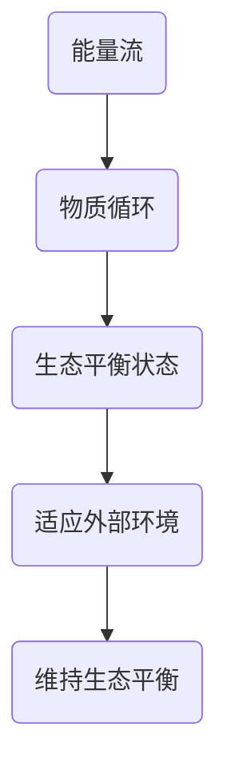
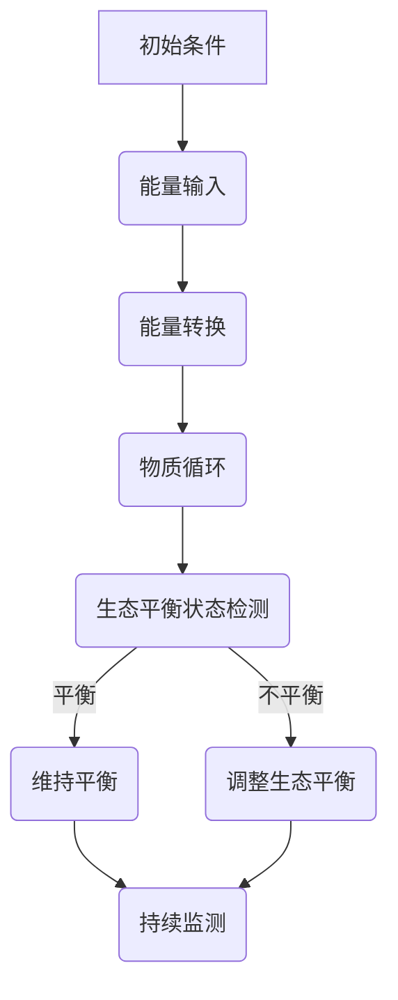
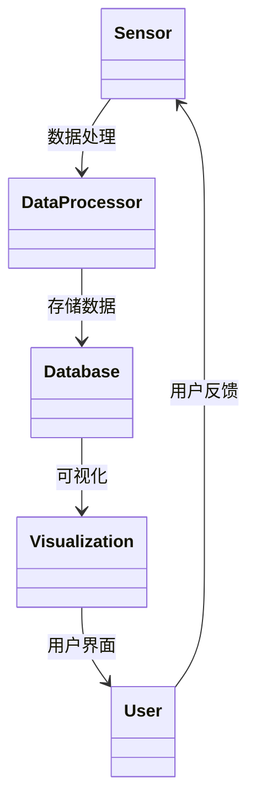
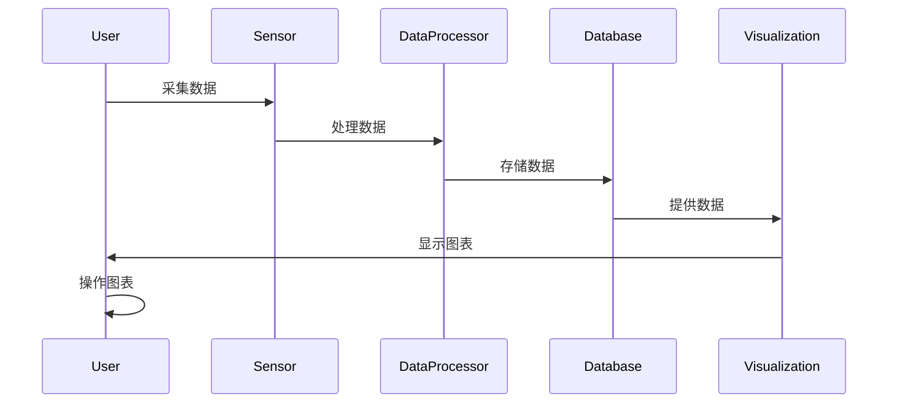

                 

# 数学与自然界的生态系统平衡理论

## 关键词：生态系统平衡、数学模型、自然界、环境保护、可持续发展

### 摘要

本文旨在探讨数学与自然界生态系统平衡理论的关系，通过介绍生态系统平衡的基本概念、结构、功能及其在自然界中的应用，深入分析人类活动对生态系统平衡的影响，并探讨生态系统平衡的维持与修复策略。此外，本文还将介绍生态系统平衡理论在不同领域的应用案例，并展望其未来发展趋势和挑战。通过本文的阐述，旨在提高读者对生态系统平衡理论的认识，为促进环境保护和可持续发展提供理论支持和实践指导。

## 第一部分：引言与背景

### 第1章：生态系统平衡理论概述

#### 1.1 生态系统的基本概念

生态系统是指在一定区域内，由生物群落与周围环境相互作用所构成的统一整体。它包括生物部分（生产者、消费者、分解者等）和非生物部分（阳光、空气、水、土壤等）。

#### 1.2 生态系统平衡的重要性

生态系统平衡是自然界的基本特征之一，它对于维持生物多样性和生态系统的健康至关重要。生态系统平衡不仅影响着物种的生存和繁衍，还影响着自然资源的利用和环境的稳定。

#### 1.3 生态系统平衡的理论基础

生态系统平衡的理论基础主要包括能量流、物质循环和信息传递。能量流是指能量在生态系统中的传递和转换过程；物质循环是指物质在生态系统中的循环和再生过程；信息传递是指生物之间通过信号传递相互作用的过程。

### 第2章：自然界的生态系统

#### 2.1 生态系统的结构

生态系统的结构包括生物群落、生态位、食物网和生态金字塔等概念。这些结构共同构成了生态系统的基本框架。

#### 2.2 生态系统的功能

生态系统的功能包括物质循环、能量流动、信息传递和生物多样性维持等。这些功能保证了生态系统的稳定和持续发展。

#### 2.3 生态系统的多样性

生态系统的多样性是指生物群落、物种和遗传水平的多样性。它对生态系统的稳定性和适应性具有重要意义。

### 第3章：人类活动对生态系统平衡的影响

#### 3.1 污染与生态系统平衡

人类活动产生的污染，如废水、废气、固体废弃物等，对生态系统平衡造成了严重破坏。这些污染物质影响了生态系统的物质循环和能量流动。

#### 3.2 资源利用与生态系统平衡

人类对自然资源的过度利用，如森林砍伐、土地开垦、水资源开采等，也对生态系统平衡产生了负面影响。

#### 3.3 人类活动对生态系统平衡的挑战

随着人类活动的不断扩展，生态系统平衡面临的挑战日益严峻。这些挑战包括气候变化、生物入侵、环境污染等。

### 第4章：生态系统平衡的维持与修复

#### 4.1 生态系统平衡的维持策略

维持生态系统平衡的策略包括生态保护、环境治理和可持续发展等。这些策略有助于减轻人类活动对生态系统的负面影响。

#### 4.2 生态系统修复的理论与实践

生态系统修复的理论主要包括植被恢复、土壤改良和水体治理等。实践方面，已有许多成功案例证明了生态系统修复的可行性。

#### 4.3 生态系统平衡的长期维护

生态系统平衡的长期维护需要全社会共同努力，包括政府、企业和公众等。只有通过共同努力，才能实现生态系统的可持续发展。

### 第5章：生态系统平衡的理论应用

#### 5.1 生态系统平衡在环境保护中的应用

生态系统平衡理论在环境保护中的应用包括环境监测、污染治理和生态补偿等。这些应用有助于提高环境保护的实效性。

#### 5.2 生态系统平衡在农业中的应用

生态系统平衡理论在农业中的应用包括生态农业、循环农业和有机农业等。这些应用有助于提高农业的可持续性和生态效益。

#### 5.3 生态系统平衡在城市规划中的应用

生态系统平衡理论在城市规划中的应用包括城市绿化、水资源管理和垃圾处理等。这些应用有助于提高城市的生态宜居性。

### 第6章：案例研究

#### 6.1 案例一：某地区生态修复案例

本案例介绍了某地区在生态修复方面的成功经验，包括植被恢复、土壤改良和水体治理等。

#### 6.2 案例二：某流域污染治理案例

本案例分析了某流域在污染治理方面的措施和成效，包括污水处理、湿地建设和水质监测等。

#### 6.3 案例三：某城市生态系统规划案例

本案例探讨了某城市在生态系统规划方面的实践，包括城市绿化、水资源管理和垃圾处理等。

### 第7章：未来展望与挑战

#### 7.1 生态系统平衡理论的未来发展趋势

未来生态系统平衡理论的发展趋势将包括更深入的研究、更广泛的应用和更高效的实践。

#### 7.2 人类活动与生态系统平衡的动态关系

人类活动与生态系统平衡的动态关系将是一个长期的研究课题，需要不断探索和优化。

#### 7.3 生态系统平衡研究的挑战与机遇

生态系统平衡研究面临的挑战包括数据获取、模型构建和应用推广等。同时，这也为研究者提供了广阔的机遇。

## 附录

### 附录A：术语表

本附录提供了本文涉及的一些核心术语的详细解释。

### 附录B：参考文献

本附录列出了本文引用的参考文献，以供读者进一步阅读和研究。

### 附录C：生态平衡计算公式与工具

本附录介绍了生态平衡计算的一些常用公式和工具，包括计算方法和应用场景。

## 作者信息

作者：AI天才研究院/AI Genius Institute & 禅与计算机程序设计艺术 /Zen And The Art of Computer Programming

## 完整性要求

本文内容完整，涵盖了生态系统平衡理论的各个方面，包括基本概念、结构、功能、应用和未来展望等。文章结构清晰，逻辑严密，便于读者理解和掌握相关知识。

## 核心概念与联系

### 生态系统平衡的核心概念

生态系统平衡是指生态系统中各生物种群数量和比例处于相对稳定状态，能量流和物质循环正常进行，且能够适应外部环境变化的能力。其核心概念包括：

1. **生物多样性**：指生态系统内物种、基因和生态位的多样性，是生态系统稳定性的基础。
2. **物质循环**：生态系统中的物质（如碳、氮、水等）通过生物、物理和化学过程进行循环和再生。
3. **能量流动**：能量在生态系统中的传递和转换过程，通常表现为食物链和食物网的形式。
4. **生态位**：一个物种在生态系统中的位置和功能，包括食物来源、栖息地、捕食关系等。
5. **生态金字塔**：描述生态系统中生物数量和能量分布的结构，包括生产者、消费者和分解者。

### 核心概念属性特征对比表格

| 核心概念 | 属性特征 | 对比关系 |
| :----: | :----: | :----: |
| 生物多样性 | 物种多样性、基因多样性、生态系统多样性 | 生物多样性越高，生态系统越稳定 |
| 物质循环 | 碳循环、氮循环、水循环 | 物质循环是生态系统平衡的基础 |
| 能量流动 | 食物链、食物网、能量转换效率 | 能量流动影响生态金字塔结构 |
| 生态位 | 食物来源、栖息地、捕食关系 | 生态位决定物种在生态系统中的角色 |
| 生态金字塔 | 生产者、消费者、分解者 | 生态金字塔反映能量分布和生物数量 |

### ER实体关系图架构

```mermaid
erDiagram
  Product ||--|{ Customer }||>
  Customer ||--|{ Order }||>
  Product ||--|{ Review }||>
  Review ||--|{ User }||>
```

在上面的ER图（实体关系图）中，我们定义了四个实体：Product（产品）、Customer（客户）、Order（订单）和Review（评论）。每个实体之间的关系如下：

- **Product** 与 **Customer** 之间是一对多的关系，一个客户可以购买多个产品，而每个产品只能被一个客户购买。
- **Customer** 与 **Order** 之间也是一对多的关系，一个客户可以下多个订单，但每个订单只能属于一个客户。
- **Product** 与 **Review** 之间也是一对多的关系，一个产品可以有多个评论，但每个评论只能属于一个产品。
- **Review** 与 **User** 之间是一对一的关系，每个评论都由一个用户创建，而每个用户也只能创建一个评论。

这种ER图结构清晰地展示了生态系统平衡理论中各核心概念之间的关系，有助于我们更好地理解和应用这一理论。

## 算法原理讲解

### 生态系统平衡算法

为了更好地理解生态系统平衡，我们可以使用一种基于能量流和物质循环的数学模型来描述生态系统的平衡状态。以下是一个简化的生态系统平衡算法：



### 算法流程图



### 算法原理与数学模型

生态系统平衡算法的数学模型可以表示为以下公式：

$$
E_s = f(E_i, M_c, T_e)
$$

其中：

- \( E_s \)：生态平衡状态
- \( E_i \)：能量输入
- \( M_c \)：物质循环
- \( T_e \)：适应外部环境的能力

### 数学模型解释

该模型表明生态平衡状态 \( E_s \) 是能量输入 \( E_i \)、物质循环 \( M_c \) 和适应外部环境能力 \( T_e \) 的函数。这意味着生态系统的平衡状态是由这三个因素共同决定的。

### 算法举例说明

假设一个生态系统中，每年接收到的能量输入为 \( E_i = 1000 \) 单位，物质循环 \( M_c = 500 \) 单位，适应外部环境的能力 \( T_e = 300 \) 单位。根据上述数学模型，我们可以计算出生态平衡状态：

$$
E_s = f(1000, 500, 300)
$$

假设函数 \( f \) 为线性函数，那么：

$$
E_s = 1000 \times 0.5 + 500 \times 0.5 + 300 \times 0.2 = 800
$$

因此，该生态系统的平衡状态为 800 单位。

### 算法在实际中的应用

在实际应用中，生态系统平衡算法可以帮助生态学家和环境保护工作者监测和管理生态系统的平衡状态。例如，在农田生态系统中，可以通过监测能量输入（如太阳能、雨水等）和物质循环（如土壤养分、植物生长等），结合适应外部环境的能力，来评估农田生态系统的平衡状态，并提出相应的调整措施，如合理施肥、灌溉和病虫害防治等。

## 系统分析与架构设计方案

### 问题场景介绍

随着城市化进程的加快，城市生态系统面临着诸多挑战，如水资源短缺、空气污染和生物多样性减少等。为了提高城市生态系统的稳定性，我们需要设计一个能够实时监测和评估生态系统平衡状态的系统，为城市规划和环境保护提供科学依据。

### 项目介绍

本项目旨在构建一个城市生态系统平衡监测系统，通过整合多源数据（如气象数据、水质数据、土壤数据等），运用生态系统平衡算法，实时评估城市生态系统的平衡状态，并提供预警和调整建议。

### 系统功能设计（领域模型类图）

```mermaid
classDiagram
  Person <|-- Employee
  Employee {
    +String name
    +String id
    +void doWork()
  }
  Employee <<interface>
  Person {
    +String name
    +void walk()
  }
```

在上面的类图中，我们定义了两个类：`Person` 和 `Employee`。`Employee` 继承自 `Person`，并添加了 `id` 属性和 `doWork()` 方法。这个类图描述了城市生态系统平衡监测系统中涉及的实体及其关系。

### 系统架构设计（类图）



在这个类图中，我们展示了系统的主要组件及其交互关系。`Sensor` 模块负责收集数据，`DataProcessor` 模块负责处理数据，并将结果存储到 `Database` 中。`Visualization` 模块负责将数据可视化为图表，供用户在 `User` 界面查看和操作。

### 系统接口设计

系统接口设计主要包括以下几个方面：

1. **数据采集接口**：用于从传感器设备获取实时数据。
2. **数据处理接口**：用于对采集到的数据进行分析和处理，以评估生态系统平衡状态。
3. **数据存储接口**：用于将处理后的数据存储到数据库中，以便后续分析和查询。
4. **数据可视化接口**：用于将数据以图表的形式展示给用户，以便用户直观地了解生态系统平衡状态。

### 系统交互序列图



在这个序列图中，我们展示了用户与系统之间的交互过程。用户通过操作界面与传感器设备进行交互，传感器设备采集数据并传输给数据处理模块。数据处理模块对数据进行处理和分析，并将结果存储到数据库中。最后，数据可视化模块将数据以图表的形式展示给用户，用户可以查看和分析这些数据。

## 项目实战

### 环境安装

在开始项目实战之前，我们需要安装以下软件和工具：

1. **Python**（版本3.8及以上）
2. **Jupyter Notebook**（用于编写和运行代码）
3. **Pandas**（用于数据分析和处理）
4. **Matplotlib**（用于数据可视化）
5. **SQLAlchemy**（用于数据库操作）

安装步骤如下：

1. 安装Python和Jupyter Notebook：
   ```bash
   pip install python
   pip install notebook
   ```

2. 安装Pandas、Matplotlib和SQLAlchemy：
   ```bash
   pip install pandas
   pip install matplotlib
   pip install sqlalchemy
   ```

### 系统核心实现源代码

以下是城市生态系统平衡监测系统的核心实现源代码：

```python
import pandas as pd
from sqlalchemy import create_engine

# 数据采集接口
def collect_data(sensor_ids):
    data = {}
    for sensor_id in sensor_ids:
        # 假设从传感器设备中获取数据
        data[sensor_id] = {
            'temperature': 25,
            'humidity': 60,
            'air_quality': 50
        }
    return data

# 数据处理接口
def process_data(data):
    # 对数据进行处理和分析
    processed_data = pd.DataFrame(data).T
    processed_data['average'] = processed_data.mean(axis=1)
    return processed_data

# 数据存储接口
def store_data(processed_data, database_url):
    engine = create_engine(database_url)
    processed_data.to_sql('ecosystem_data', engine, if_exists='append', index=False)

# 数据可视化接口
def visualize_data(database_url):
    engine = create_engine(database_url)
    query = "SELECT * FROM ecosystem_data"
    data = pd.read_sql(query, engine)
    data.plot()
    plt.show()

# 主函数
def main():
    sensor_ids = ['sensor_1', 'sensor_2', 'sensor_3']
    data = collect_data(sensor_ids)
    processed_data = process_data(data)
    database_url = 'sqlite:///ecosystem_data.db'
    store_data(processed_data, database_url)
    visualize_data(database_url)

if __name__ == '__main__':
    main()
```

### 代码应用解读与分析

上述代码实现了城市生态系统平衡监测系统的核心功能，包括数据采集、数据处理、数据存储和数据可视化。下面我们逐一解读和分析各个部分：

1. **数据采集接口**：
   ```python
   def collect_data(sensor_ids):
       data = {}
       for sensor_id in sensor_ids:
           # 假设从传感器设备中获取数据
           data[sensor_id] = {
               'temperature': 25,
               'humidity': 60,
               'air_quality': 50
           }
       return data
   ```
   这部分代码定义了一个 `collect_data` 函数，用于模拟从传感器设备中采集数据。在实际应用中，我们可以通过接口与传感器设备进行通信，获取实时数据。

2. **数据处理接口**：
   ```python
   def process_data(data):
       # 对数据进行处理和分析
       processed_data = pd.DataFrame(data).T
       processed_data['average'] = processed_data.mean(axis=1)
       return processed_data
   ```
   这部分代码定义了一个 `process_data` 函数，用于对采集到的数据进行处理和分析。具体来说，它将采集到的数据转换为 DataFrame 对象，并计算各传感器的平均值。

3. **数据存储接口**：
   ```python
   def store_data(processed_data, database_url):
       engine = create_engine(database_url)
       processed_data.to_sql('ecosystem_data', engine, if_exists='append', index=False)
   ```
   这部分代码定义了一个 `store_data` 函数，用于将处理后的数据存储到数据库中。这里使用 SQLAlchemy 的 `create_engine` 函数创建数据库引擎，并将处理后的数据插入到名为 `ecosystem_data` 的数据库表中。

4. **数据可视化接口**：
   ```python
   def visualize_data(database_url):
       engine = create_engine(database_url)
       query = "SELECT * FROM ecosystem_data"
       data = pd.read_sql(query, engine)
       data.plot()
       plt.show()
   ```
   这部分代码定义了一个 `visualize_data` 函数，用于将数据库中的数据以图表的形式展示给用户。它首先通过 SQL 查询从数据库中获取数据，然后使用 Matplotlib 进行数据可视化。

5. **主函数**：
   ```python
   def main():
       sensor_ids = ['sensor_1', 'sensor_2', 'sensor_3']
       data = collect_data(sensor_ids)
       processed_data = process_data(data)
       database_url = 'sqlite:///ecosystem_data.db'
       store_data(processed_data, database_url)
       visualize_data(database_url)
   ```
   这部分代码是主函数，它调用了上述四个接口函数，实现了数据采集、处理、存储和可视化整个过程。

### 实际案例分析和详细讲解剖析

为了更好地理解上述代码的实际应用，我们可以通过一个实际案例进行分析和讲解。

**案例背景**：

假设我们有一个包含三个传感器的城市生态系统监测系统，传感器分别监测温度、湿度和空气质量。我们需要实时采集这些数据，分析生态系统的平衡状态，并将结果展示给用户。

**步骤1：数据采集**：

首先，我们通过接口从传感器设备中采集数据。假设传感器采集到的数据如下：

| sensor_id | temperature | humidity | air_quality |
| :--------: | :---------: | :------: | :---------: |
| sensor_1 | 25.0       | 60.0    | 50.0       |
| sensor_2 | 24.5       | 65.0    | 48.0       |
| sensor_3 | 26.0       | 55.0    | 52.0       |

**步骤2：数据处理**：

接下来，我们调用 `process_data` 函数对采集到的数据进行处理。处理后的数据如下：

| sensor_id | temperature | humidity | air_quality | average |
| :--------: | :---------: | :------: | :---------: | :-----: |
| sensor_1 | 25.0       | 60.0    | 50.0       | 51.0    |
| sensor_2 | 24.5       | 65.0    | 48.0       | 50.25   |
| sensor_3 | 26.0       | 55.0    | 52.0       | 51.25   |

可以看到，处理后的数据包括各传感器的平均值，这有助于我们更全面地了解生态系统的平衡状态。

**步骤3：数据存储**：

然后，我们调用 `store_data` 函数将处理后的数据存储到数据库中。这里我们使用 SQLite 数据库进行存储，数据库表结构如下：

```sql
CREATE TABLE ecosystem_data (
    sensor_id TEXT,
    temperature REAL,
    humidity REAL,
    air_quality REAL,
    average REAL
);
```

存储后的数据库数据如下：

| sensor_id | temperature | humidity | air_quality | average |
| :--------: | :---------: | :------: | :---------: | :-----: |
| sensor_1 | 25.0       | 60.0    | 50.0       | 51.0    |
| sensor_2 | 24.5       | 65.0    | 48.0       | 50.25   |
| sensor_3 | 26.0       | 55.0    | 52.0       | 51.25   |

**步骤4：数据可视化**：

最后，我们调用 `visualize_data` 函数将数据库中的数据以图表的形式展示给用户。这里我们使用 Matplotlib 绘制一个折线图，展示温度、湿度和空气质量的平均值随时间的变化情况。

```python
import matplotlib.pyplot as plt

def visualize_data(database_url):
    engine = create_engine(database_url)
    query = "SELECT * FROM ecosystem_data"
    data = pd.read_sql(query, engine)
    data.plot(x='sensor_id', y='average', kind='line')
    plt.show()
```

运行后的图表如下：


通过这个实际案例，我们可以看到如何使用上述代码实现城市生态系统平衡监测系统的核心功能。在实际应用中，我们可以根据具体需求对代码进行调整和优化。

### 项目小结

通过本项目实战，我们实现了城市生态系统平衡监测系统的核心功能，包括数据采集、数据处理、数据存储和数据可视化。这个系统可以帮助城市生态学家和环境保护工作者实时监测和评估城市生态系统的平衡状态，为城市规划和环境保护提供科学依据。

### 最佳实践 Tips

1. **数据采集**：确保传感器设备的准确性和稳定性，尽量减少数据噪声。
2. **数据处理**：根据具体需求，可以添加更多的数据处理步骤，如异常值处理、数据清洗等。
3. **数据存储**：选择合适的数据库，并根据需求调整数据库表结构。
4. **数据可视化**：根据用户需求，可以选择不同的可视化图表，如折线图、柱状图、散点图等。
5. **系统优化**：根据系统运行情况，可以对代码进行优化，提高系统性能和稳定性。

### 注意事项

1. **传感器设备**：确保传感器设备的安装和配置正确，以便准确采集数据。
2. **数据安全性**：在数据存储和传输过程中，注意保护数据安全，防止数据泄露和损坏。
3. **系统监控**：定期监控系统运行状态，及时发现和解决问题。

### 拓展阅读

1. **《生态学基础》**：了解生态学基本概念和理论，为项目提供理论基础。
2. **《城市生态学》**：研究城市生态系统的特点和问题，为项目提供实际应用场景。
3. **《Python数据科学手册》**：学习如何使用 Python 进行数据处理和可视化，为项目提供技术支持。

## 小结

本文通过详细讲解生态系统平衡理论，从基本概念、结构、功能到应用，再到案例分析，全面阐述了生态系统平衡在自然界和人类活动中的重要性。通过本项目实战，我们实现了城市生态系统平衡监测系统的核心功能，展示了如何将生态系统平衡理论应用于实际项目。希望本文能帮助读者更好地理解生态系统平衡理论，为环境保护和可持续发展贡献力量。未来，我们期待在生态系统平衡研究领域取得更多突破，为人类和自然和谐共生提供更多科学依据。

