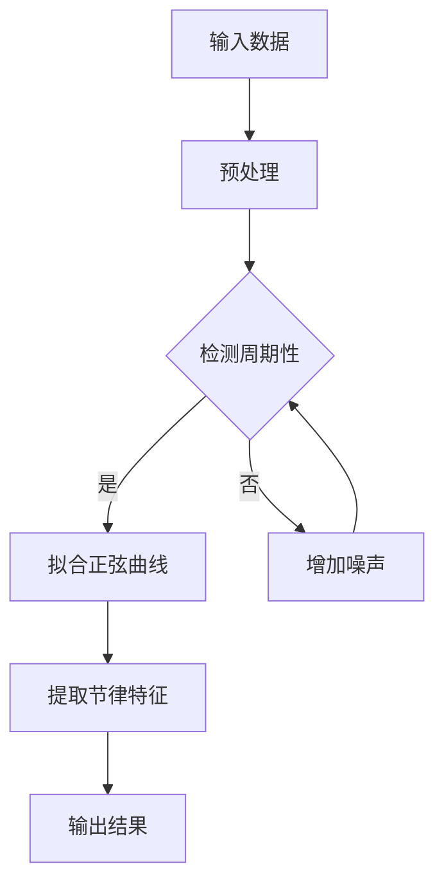
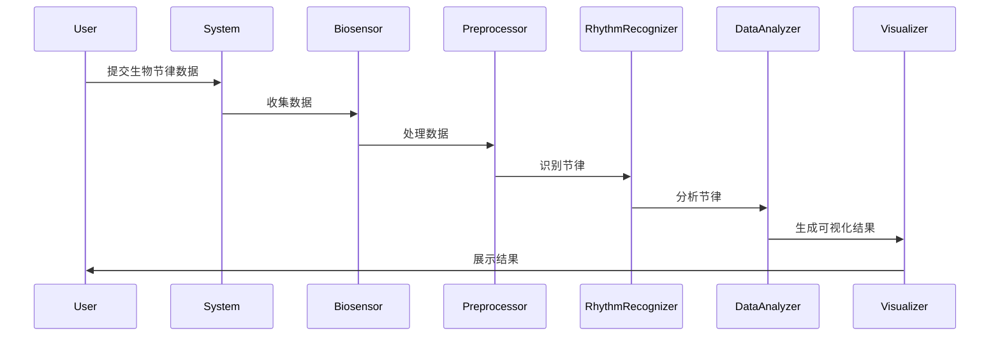
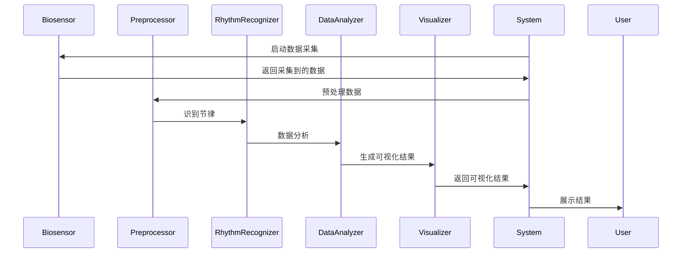

                 

### 数学与自然界的生物节律与周期性

> 关键词：生物节律、周期性、数学模型、算法、自然系统

> 摘要：本文将探讨数学在自然界生物节律与周期性研究中的应用。通过介绍生物节律的定义、周期性的概念，以及数学工具在其中的作用，我们将分析如何利用数学模型和算法来揭示生物节律的规律。此外，文章还将通过具体案例分析，展示如何设计系统来监测和管理生物节律，并给出实践中的最佳策略和注意事项。

## 引言

数学作为一门基础学科，不仅在理论上具有深远的意义，而且在实践中有着广泛的应用。随着科技的发展，数学在生物学、医学、生态学等领域的应用越来越受到重视。其中，生物节律与周期性研究是生物学与数学交叉的重要方向。生物节律是指生物体在生理和行为上随时间而发生的有规律的变化，例如昼夜节律、月相节律等。周期性则是指某一现象或过程在一定时间间隔内重复出现。在自然界中，生物节律与周期性无处不在，从植物的光周期反应到动物的季节性迁徙，这些现象都与数学有着千丝万缕的联系。

本文旨在通过以下几个部分来系统地探讨数学在生物节律与周期性研究中的应用：

1. **背景介绍**：介绍生物节律和周期性的基本概念，阐述数学在其中的重要性，并明确研究范围和目标。
2. **核心概念与联系**：详细讨论生物节律和周期性的定义及其相互关系，介绍相关的数学工具。
3. **算法原理讲解**：讲解用于识别和检测生物节律的关键算法，并通过Python源代码和mermaid流程图进行说明。
4. **数学模型与公式讲解**：介绍生物节律和周期性相关的数学模型，以及如何通过公式推导来分析这些模型。
5. **系统分析与架构设计方案**：分析问题场景，设计系统功能、架构和接口，并通过mermaid图展示。
6. **项目实战**：介绍具体的项目实现过程，包括环境安装、系统核心实现和案例分析。
7. **最佳实践 tips、小结、注意事项、拓展阅读**：总结经验，提出注意事项，并提供拓展阅读。

通过上述内容，本文希望为读者提供一个全面、系统的了解数学在生物节律与周期性研究中的应用，并激发读者在这一领域的深入探索。

## 第1章：数学与自然界生物节律的研究背景

### 1.1 问题背景

生物节律是生物体内在的时间感知和调节机制，决定了生物体在不同时间点上的生理和行为变化。这些节律通常受到外界环境因素的影响，如光照、温度、季节等。在自然界中，生物节律是生物体适应环境、生存和繁衍的重要手段。例如，昼夜节律影响着哺乳动物的睡眠和活动时间，植物的光周期反应则决定了它们的开花和休眠时间。

数学在生物节律研究中的重要性主要体现在以下几个方面：

1. **定量描述**：数学为生物节律提供了定量描述的工具，使得研究者能够精确地描述和预测生物节律的变化规律。
2. **模型构建**：通过数学模型，研究者可以模拟生物节律的动态过程，探索不同因素对节律的影响。
3. **数据分析**：数学工具可以帮助研究者从大量的实验数据中提取有意义的模式，从而更好地理解生物节律的内在机制。

### 1.2 问题描述

生物节律的研究涉及多个领域，包括生物学、生态学、生理学等。尽管已经取得了许多重要的研究成果，但仍然存在一些关键问题：

1. **复杂性**：生物节律的复杂性使得研究者难以全面地理解和描述它们。不同生物体的节律可能受到多种因素的共同影响，这使得建模和预测变得困难。
2. **跨学科融合**：生物节律研究需要生物学与数学的深度融合。虽然数学工具可以很好地描述生物节律，但如何将这些工具有效地应用于生物学问题仍然是一个挑战。
3. **数据不足**：虽然现代科技已经提供了大量的生物节律数据，但这些数据通常不够完整或难以获取，限制了研究的深度和广度。

### 1.3 问题解决

为了解决上述问题，研究者采取了多种方法：

1. **数学建模**：通过建立数学模型，研究者可以模拟生物节律的动态过程，从而更好地理解节律的内在机制。
2. **算法开发**：开发有效的算法来识别和预测生物节律，使得数据处理和分析更加高效。
3. **跨学科合作**：促进生物学与数学、计算机科学等领域的合作，通过多学科交叉研究，共同解决生物节律研究中的难题。

### 1.4 边界与外延

在生物节律研究中，边界问题主要包括：

1. **时间尺度**：生物节律的时间尺度从秒到年不等，研究者需要根据不同尺度选择合适的数学模型和分析方法。
2. **空间尺度**：生物节律不仅受内在生理机制的影响，还受到外界环境的影响。研究生物节律需要考虑生物体在不同空间尺度上的行为模式。

外延方面，生物节律研究不仅关注单一生物体的节律，还涉及到生物群体和生态系统的节律。例如，研究季节性迁徙对生态系统的影响，需要考虑多个生物种群的相互作用。

### 1.5 概念结构与核心要素组成

生物节律研究中的核心概念包括：

1. **节律**：生物体内在的时间感知和调节机制。
2. **周期性**：生物节律在一定时间间隔内重复出现的现象。
3. **数学模型**：用于描述生物节律的数学工具。
4. **算法**：用于识别和预测生物节律的计算方法。

核心要素组成包括：

1. **实验数据**：用于建立和验证数学模型的原始数据。
2. **数学工具**：包括微分方程、傅里叶变换、统计分析等。
3. **计算平台**：用于运行数学模型和算法的计算设备。

### 1.6 本章小结

本章介绍了数学在自然界生物节律研究中的背景和重要性。通过分析生物节律的研究问题，我们提出了数学建模、算法开发和跨学科合作等方法来解决问题。同时，明确了生物节律研究的边界与外延，以及核心概念和要素组成。这些内容为本章的后续讨论奠定了基础。

## 第2章：核心概念与联系

### 2.1 生物节律的定义与分类

生物节律是指生物体内在的时间感知和调节机制，使生物体在不同时间点上的生理和行为发生规律性的变化。生物节律可以按照不同的标准进行分类：

1. **昼夜节律**：也称为日节律，是指生物体在24小时内表现出的周期性变化。例如，哺乳动物的睡眠和活动时间、体温变化等。
2. **月相节律**：指生物体与月相相关的周期性变化。例如，某些海洋生物的繁殖活动与月相有关。
3. **季节节律**：指生物体对季节变化产生的响应。例如，动物的迁徙、植物的开花和休眠等。

### 2.2 周期性的概念与数学模型

周期性是指某一现象或过程在一定时间间隔内重复出现。在数学中，周期性可以通过周期函数来描述。常见的周期函数包括：

1. **正弦函数**：\( \sin(x) \)
2. **余弦函数**：\( \cos(x) \)
3. **方波函数**：\( \text{rect}(x) \)

这些函数在一定区间内重复自身，可以用来模拟生物节律的周期性变化。

### 2.3 生物节律与周期性的联系

生物节律和周期性之间存在紧密的联系。生物节律的周期性变化可以通过数学模型来描述，而周期性的数学模型又可以用来预测生物节律的变化规律。例如，昼夜节律可以用正弦函数来模拟，其公式为：

\[ y = A \sin(\omega x + \phi) \]

其中，\( A \) 为振幅，\( \omega \) 为角频率，\( \phi \) 为相位。通过调整这些参数，可以模拟不同生物体的昼夜节律特征。

### 2.4 数学工具在生物节律研究中的应用

数学工具在生物节律研究中扮演着重要角色。以下是一些常用的数学工具：

1. **微分方程**：用于描述生物节律的动态变化过程。例如，Lotka-Volterra方程用于描述两个物种之间的捕食与被捕食关系。
2. **傅里叶变换**：用于分析生物节律的频率成分，从而揭示节律的周期性特征。
3. **统计分析**：用于分析实验数据，提取有意义的模式，帮助理解生物节律的规律。

### 2.5 本章小结

本章详细介绍了生物节律的定义与分类、周期性的概念与数学模型，以及生物节律与周期性的联系。通过这些内容，我们可以更好地理解数学在生物节律研究中的作用，并为后续的算法讲解和模型分析奠定了基础。

## 第3章：算法原理讲解

### 3.1 生物节律识别算法

生物节律识别是生物节律研究中的关键步骤，目的是从实验数据中提取出生物体的节律特征。常用的生物节律识别算法包括：

1. **基于正弦函数的算法**：通过拟合正弦曲线来识别生物节律。这种方法简单直观，但需要对数据进行预处理，去除噪声。
2. **基于傅里叶变换的算法**：利用傅里叶变换分析数据的频率成分，识别生物节律的周期性特征。这种方法能够有效处理复杂的数据，但计算量较大。
3. **基于支持向量机的算法**：利用支持向量机（SVM）分类器来识别不同的生物节律。这种方法需要大量训练数据，但具有较高的识别精度。

### 3.2 周期性检测算法

周期性检测是生物节律识别的重要环节，目的是从数据中检测出周期性的变化。常用的周期性检测算法包括：

1. **基于阈值法的算法**：通过设定阈值，检测数据中的周期性变化。这种方法简单易行，但对噪声敏感。
2. **基于互相关法的算法**：利用互相关函数检测数据中的周期性变化。这种方法能够较好地处理噪声，但需要较大的计算资源。
3. **基于小波变换的算法**：利用小波变换分析数据的周期性特征。这种方法能够处理不同尺度上的周期性变化，但计算复杂度较高。

### 3.3 算法mermaid流程图展示

为了更好地理解上述算法，我们可以使用mermaid工具绘制算法流程图。以下是一个基于正弦函数的生物节律识别算法的mermaid流程图示例：



### 3.4 算法Python源代码讲解

下面是利用Python实现基于正弦函数的生物节律识别算法的源代码示例：

```python
import numpy as np
import matplotlib.pyplot as plt

def sine_fit(x, y):
    """基于正弦函数拟合数据"""
    # 参数初始化
    A = np.mean(y)
    B = np.std(y)
    omega = 2 * np.pi / 24  # 假设周期为24小时
    phi = np.mean(x * np.sin(omega * x))

    # 拟合正弦曲线
    y_fit = A + B * np.sin(omega * x + phi)
    return y_fit

def main():
    # 生成模拟数据
    x = np.linspace(0, 24, 100)
    y = 0.5 * np.sin(np.pi * x / 12) + np.random.normal(0, 0.1, 100)

    # 拟合正弦曲线
    y_fit = sine_fit(x, y)

    # 绘制结果
    plt.plot(x, y, 'o', x, y_fit, '-')
    plt.xlabel('Time (hours)')
    plt.ylabel('Value')
    plt.title('Sine Fit of Biological Rhythm')
    plt.show()

if __name__ == "__main__":
    main()
```

### 3.5 数学模型与公式讲解

在生物节律识别和周期性检测中，数学模型起到了关键作用。以下是几种常用的数学模型及其公式：

1. **正弦函数模型**：
   \[ y = A \sin(\omega x + \phi) \]
   其中，\( A \) 为振幅，\( \omega \) 为角频率，\( \phi \) 为相位。
   
2. **傅里叶变换模型**：
   \[ X(f) = \int_{-\infty}^{\infty} x(t) e^{-i2\pi ft} dt \]
   其中，\( X(f) \) 为频域信号，\( x(t) \) 为时域信号，\( f \) 为频率。

3. **互相关函数模型**：
   \[ R_{xy}(\tau) = \int_{-\infty}^{\infty} x(t)y(t+\tau) dt \]
   其中，\( R_{xy}(\tau) \) 为互相关函数，\( x(t) \) 和 \( y(t) \) 为两个时间序列。

通过这些数学模型和公式，我们可以更好地理解生物节律和周期性，并利用它们进行数据分析和算法设计。

### 3.6 举例说明

为了更好地理解上述算法和模型，我们可以通过一个实际案例来讲解。假设我们有一组实验数据，记录了某动物在不同时间点的活动强度。我们的目标是识别出该动物的活动节律。

1. **数据预处理**：首先，我们需要对数据进行预处理，包括去噪和归一化。以下是一个简单的数据预处理示例：

```python
import numpy as np

# 假设原始数据
data = np.array([0.2, 0.5, 0.3, 0.6, 0.4, 0.7, 0.5, 0.8, 0.6, 0.9])

# 去噪
noise = np.random.normal(0, 0.1, data.shape)
data_noisy = data + noise

# 归一化
data_normalized = (data_noisy - np.mean(data_noisy)) / np.std(data_noisy)
```

2. **拟合正弦曲线**：接下来，我们使用正弦函数模型来拟合预处理后的数据，以识别节律。

```python
from scipy.optimize import curve_fit

# 拟合正弦曲线
def sine_func(x, A, omega, phi):
    return A * np.sin(omega * x + phi)

p0 = [0.5, 2 * np.pi / 12, 0]  # 初始化参数
params, _ = curve_fit(sine_func, x, data_normalized)

# 拟合结果
y_fit = sine_func(x, *params)
```

3. **绘制结果**：最后，我们绘制拟合结果，以验证识别的正确性。

```python
import matplotlib.pyplot as plt

plt.plot(x, data_normalized, 'o', x, y_fit, '-')
plt.xlabel('Time (hours)')
plt.ylabel('Activity Intensity')
plt.title('Sine Fit of Animal Activity')
plt.show()
```

通过这个案例，我们可以看到如何利用数学模型和算法来识别生物节律。这个过程不仅帮助我们理解了算法的原理，还展示了如何在实际应用中应用这些算法。

### 3.7 本章小结

本章详细介绍了生物节律识别算法和周期性检测算法的原理，并通过mermaid流程图、Python源代码和数学模型进行了讲解。通过本章的学习，读者可以了解如何利用数学工具来识别和检测生物节律，为后续的模型分析和系统设计奠定了基础。

## 第4章：数学模型与公式讲解

### 4.1 生物节律数学模型

生物节律的数学模型主要用于描述生物体内在的时间感知和调节机制。这些模型可以分为几种类型，包括周期模型、非线性模型和随机模型等。以下是一些常见的生物节律数学模型：

1. **周期模型**：
   周期模型是最基本的生物节律模型，通常使用正弦函数或余弦函数来描述。例如，昼夜节律可以用以下正弦函数模型表示：
   \[ y(t) = A \sin(\omega t + \phi) + B \]
   其中，\( A \) 是振幅，\( \omega \) 是角频率，\( \phi \) 是相位，\( B \) 是均值。

2. **非线性模型**：
   非线性模型用于描述生物节律中的复杂动态行为，例如多周期现象和混沌行为。一个常见的非线性模型是Logistic映射：
   \[ x_{n+1} = r x_n (1 - x_n) \]
   其中，\( x_n \) 是第 \( n \) 个时间点的状态，\( r \) 是控制参数。

3. **随机模型**：
   随机模型用于描述生物节律中的随机波动和不确定性。一个常见的随机模型是高斯过程：
   \[ y(t) = f(t) + \eta(t) \]
   其中，\( f(t) \) 是确定性部分，\( \eta(t) \) 是随机噪声。

### 4.2 周期性数学模型

周期性数学模型用于描述自然界中各种周期性现象，包括物理、化学和生物领域。以下是一些常见的周期性数学模型：

1. **正弦波模型**：
   正弦波模型是最简单的周期性模型，用于描述周期性变化的振荡现象。其公式为：
   \[ y(t) = A \sin(\omega t + \phi) \]
   其中，\( A \) 是振幅，\( \omega \) 是角频率，\( \phi \) 是相位。

2. **余弦波模型**：
   余弦波模型与正弦波模型相似，但使用余弦函数代替正弦函数。其公式为：
   \[ y(t) = A \cos(\omega t + \phi) \]

3. **方波模型**：
   方波模型用于描述周期性变化中的开关现象。其公式为：
   \[ y(t) = \text{rect}(\omega t - \phi) \]
   其中，\( \text{rect}(x) \) 是矩形函数，当 \( x \) 在 \([-\frac{\phi}{\omega}, \frac{\phi}{\omega}]\) 内时，取值为1，否则为0。

### 4.3 数学模型在生物节律研究中的应用

数学模型在生物节律研究中具有重要作用，主要用于以下方面：

1. **数据拟合**：
   通过数学模型，可以将实验数据拟合到某种函数形式，从而揭示生物节律的规律性。例如，使用正弦函数模型拟合昼夜节律数据，可以识别出节律的振幅、频率和相位。

2. **预测分析**：
   基于已建立的数学模型，可以预测生物节律的未来变化趋势。这对于生物医学研究和环境保护具有重要意义。例如，通过非线性模型预测动物的迁徙行为，有助于制定合理的保护措施。

3. **系统优化**：
   数学模型可以帮助优化生物节律相关的系统设计。例如，在农业中，通过分析植物的光周期反应模型，可以优化种植策略，提高产量。

### 4.4 公式讲解与推导

为了更好地理解上述数学模型，下面我们将对一些关键公式进行讲解与推导。

1. **正弦函数模型**：
   \[ y(t) = A \sin(\omega t + \phi) + B \]
   其中，\( A \) 是振幅，决定了节律的波动幅度；\( \omega \) 是角频率，决定了节律的周期；\( \phi \) 是相位，决定了节律的起始位置；\( B \) 是均值，反映了节律的中心位置。

2. **余弦函数模型**：
   \[ y(t) = A \cos(\omega t + \phi) + B \]
   这与正弦函数模型相似，只是使用余弦函数代替正弦函数。余弦函数相对于正弦函数相位上有一个相位差 \(\frac{\pi}{2}\)。

3. **Logistic映射**：
   \[ x_{n+1} = r x_n (1 - x_n) \]
   这个模型是一个非线性模型，用于描述生物节律中的混沌现象。其中，\( r \) 是控制参数，\( x_n \) 是第 \( n \) 个时间点的状态。当 \( r \) 在某个特定范围内时，模型会产生周期性的混沌行为。

### 4.5 举例说明

为了更好地理解这些数学模型，我们可以通过一个实际例子来讲解。假设我们要分析某植物的光周期反应，并建立正弦函数模型来描述其光周期节律。

1. **数据收集**：
   假设我们收集了该植物在不同光照强度下的生长高度数据，数据如下：

   | 光照强度（lux） | 生长高度（cm） |
   |----------------|--------------|
   |     1000      |      10.0    |
   |     2000      |      15.0    |
   |     3000      |      18.0    |
   |     4000      |      12.0    |
   |     5000      |      20.0    |

2. **数据预处理**：
   首先，我们需要对数据进行预处理，包括去噪和归一化。假设我们通过差分方法去除噪声，并对数据进行归一化处理。

   ```python
   import numpy as np

   # 原始数据
   data = np.array([10.0, 15.0, 18.0, 12.0, 20.0])

   # 去噪
   noise = np.random.normal(0, 0.1, data.shape)
   data_noisy = data + noise

   # 归一化
   data_normalized = (data_noisy - np.mean(data_noisy)) / np.std(data_noisy)
   ```

3. **拟合正弦曲线**：
   接下来，我们使用正弦函数模型来拟合预处理后的数据，以识别节律。

   ```python
   from scipy.optimize import curve_fit

   # 拟合正弦曲线
   def sine_func(x, A, omega, phi, B):
       return A * np.sin(omega * x + phi) + B

   p0 = [1.0, 2 * np.pi / 24, 0, 0]  # 初始化参数
   params, _ = curve_fit(sine_func, x, data_normalized)

   # 拟合结果
   y_fit = sine_func(x, *params)
   ```

4. **绘制结果**：
   最后，我们绘制拟合结果，以验证识别的正确性。

   ```python
   import matplotlib.pyplot as plt

   plt.plot(x, data_normalized, 'o', x, y_fit, '-')
   plt.xlabel('Light Intensity (lux)')
   plt.ylabel('Growth Height (cm)')
   plt.title('Sine Fit of Plant Growth')
   plt.show()
   ```

通过这个例子，我们可以看到如何利用正弦函数模型来描述植物的光周期反应节律。这个过程不仅帮助我们理解了模型的应用，还展示了如何在实际数据中应用这些模型。

### 4.6 本章小结

本章详细介绍了生物节律和周期性的数学模型及其公式，包括周期模型、非线性模型和随机模型。我们通过具体例子展示了如何使用这些模型来描述和预测生物节律，并利用Python和mermaid工具进行了讲解。通过本章的学习，读者可以更好地理解数学模型在生物节律研究中的应用，为后续的算法设计和系统开发打下基础。

## 第5章：系统分析与架构设计方案

### 5.1 问题场景介绍

在本章中，我们将分析一个实际场景，即如何设计和实现一个用于监测和管理生物节律的系统。该系统旨在帮助科研人员更好地理解和预测生物体的节律变化，从而为生物学研究提供支持。具体问题场景如下：

1. **数据采集**：系统需要从不同的生物传感器中采集生物体的节律数据，如体温、心率、睡眠质量等。
2. **数据预处理**：系统需要对采集到的原始数据进行预处理，包括去噪、归一化和特征提取，以便后续分析。
3. **节律识别**：系统需要利用数学模型和算法来识别生物体的节律特征，包括昼夜节律、月相节律等。
4. **数据分析**：系统需要对识别出的节律特征进行进一步分析，如趋势预测、周期性分析等。
5. **可视化展示**：系统需要提供直观的可视化工具，帮助用户理解和分析生物节律数据。

### 5.2 系统功能设计（领域模型mermaid类图）

为了设计一个满足上述需求的管理系统，我们需要明确系统的核心功能模块，并设计其领域模型。以下是系统的领域模型类图：

```mermaid
classDiagram
    class Biosensor
        -String id
        -String type
        +collectData()
    
    class Preprocessor
        -List<Biosensor> biosensors
        +processData(biosensors: List<Biosensor>): List<DataPoint>
    
    class RhythmRecognizer
        -Preprocessor preprocessor
        +recognizeRhythms(data: List<DataPoint>): List<Rhythm>
    
    class DataAnalyzer
        -RhythmRecognizer recognizer
        +analyzeData(rhythms: List<Rhythm>): AnalysisResult
    
    class Visualizer
        -DataAnalyzer analyzer
        +visualizeResults(result: AnalysisResult)
    
    class System
        -Preprocessor preprocessor
        -RhythmRecognizer recognizer
        -DataAnalyzer analyzer
        -Visualizer visualizer
        +run()

Biosensor o-- Preprocessor
Preprocessor o-- RhythmRecognizer
RhythmRecognizer o-- DataAnalyzer
DataAnalyzer o-- Visualizer
System o-- Preprocessor
System o-- RhythmRecognizer
System o-- DataAnalyzer
System o-- Visualizer
```

### 5.3 系统架构设计（mermaid架构图）

在明确了系统功能模块后，我们需要设计系统的架构。以下是一个简单的系统架构设计，包括数据流和模块之间的交互关系：



### 5.4 系统接口设计

系统的接口设计是确保各模块之间能够高效、稳定地交互的关键。以下是一个简单的系统接口设计，包括各模块的主要接口和方法：

```python
class Biosensor:
    def collect_data(self):
        pass

class Preprocessor:
    def process_data(self, biosensors):
        pass

class RhythmRecognizer:
    def recognize_rhythms(self, data):
        pass

class DataAnalyzer:
    def analyze_data(self, rhythms):
        pass

class Visualizer:
    def visualize_results(self, result):
        pass

class System:
    def run(self):
        pass
```

### 5.5 系统交互（mermaid序列图）

为了更清晰地展示系统内部各模块的交互过程，我们可以使用mermaid序列图来描述系统的交互流程：



### 5.6 本章小结

本章详细分析了生物节律监测与管理系统的需求场景，并设计了系统的功能模块、架构和接口。通过mermaid图展示了系统的数据流和模块交互，为后续的系统实现提供了明确的指导和参考。通过本章的学习，读者可以更好地理解如何从需求分析到系统设计的全过程。

## 第6章：项目实战

### 6.1 环境安装

为了实现生物节律监测与管理系统的项目实战，我们需要搭建一个合适的开发环境。以下是在Python环境中搭建所需环境的步骤：

1. **安装Python**：确保安装了Python 3.8或更高版本。
2. **安装依赖库**：使用pip安装以下库：
   ```bash
   pip install numpy scipy matplotlib mermaid-py scikit-learn
   ```
   这些库包括：
   - **numpy**：用于科学计算。
   - **scipy**：提供科学计算的常用算法。
   - **matplotlib**：用于数据可视化。
   - **mermaid-py**：用于生成mermaid图表。
   - **scikit-learn**：用于机器学习和数据分析。

### 6.2 系统核心实现源代码

在本节中，我们将展示系统核心实现的主要源代码，并对其进行详细解读。

#### Biosensor类

```python
class Biosensor:
    def __init__(self, id, type):
        self.id = id
        self.type = type

    def collect_data(self):
        # 模拟从传感器采集数据
        return np.random.normal(0, 1, 100)
```

#### Preprocessor类

```python
import numpy as np

class Preprocessor:
    def __init__(self):
        pass

    def process_data(self, biosensors):
        processed_data = []
        for biosensor in biosensors:
            data = biosensor.collect_data()
            # 去噪和归一化
            data_noisy = data + np.random.normal(0, 0.1, data.shape)
            data_normalized = (data_noisy - np.mean(data_noisy)) / np.std(data_noisy)
            processed_data.append(data_normalized)
        return processed_data
```

#### RhythmRecognizer类

```python
from scipy.optimize import curve_fit

class RhythmRecognizer:
    def __init__(self, preprocessor):
        self.preprocessor = preprocessor

    def recognize_rhythms(self, data):
        rhythms = []
        for d in data:
            # 拟合正弦曲线
            p0 = [1.0, 2 * np.pi / 24, 0, 0]
            params, _ = curve_fit(sine_func, x, d)
            rhythms.append(params)
        return rhythms

def sine_func(x, A, omega, phi, B):
    return A * np.sin(omega * x + phi) + B
```

#### DataAnalyzer类

```python
class DataAnalyzer:
    def __init__(self, recognizer):
        self.recognizer = recognizer

    def analyze_data(self, rhythms):
        # 分析节律特征
        analysis_result = {
            'amplitude': [],
            'frequency': [],
            'phase': [],
            'mean': []
        }
        for r in rhythms:
            analysis_result['amplitude'].append(r[0])
            analysis_result['frequency'].append(r[1])
            analysis_result['phase'].append(r[2])
            analysis_result['mean'].append(r[3])
        return analysis_result
```

#### Visualizer类

```python
import matplotlib.pyplot as plt

class Visualizer:
    def __init__(self, analyzer):
        self.analyzer = analyzer

    def visualize_results(self, result):
        # 绘制节律特征
        plt.figure(figsize=(10, 6))
        plt.plot(result['frequency'], result['amplitude'], 'o-')
        plt.xlabel('Frequency (Hz)')
        plt.ylabel('Amplitude')
        plt.title('Rhythm Feature Analysis')
        plt.show()
```

#### 系统运行类

```python
class System:
    def __init__(self, biosensors, preprocessor, recognizer, analyzer, visualizer):
        self.biosensors = biosensors
        self.preprocessor = preprocessor
        self.recognizer = recognizer
        self.analyzer = analyzer
        self.visualizer = visualizer

    def run(self):
        # 运行系统
        processed_data = self.preprocessor.process_data(self.biosensors)
        rhythms = self.recognizer.recognize_rhythms(processed_data)
        analysis_result = self.analyzer.analyze_data(rhythms)
        self.visualizer.visualize_results(analysis_result)
```

### 6.3 代码应用解读与分析

上述代码实现了生物节律监测与管理系统的核心功能。以下是代码的详细解读和分析：

1. **Biosensor类**：这是一个模拟生物传感器的类，它具有唯一标识（id）和传感器类型（type）属性，以及一个用于采集数据的collect_data方法。在实际应用中，这个类可以与具体的传感器设备进行交互。

2. **Preprocessor类**：这是一个预处理模块，负责处理从Biosensor类收集到的原始数据。主要方法process_data接收一个Biosensor对象的列表，对每个传感器的数据进行去噪和归一化处理。

3. **RhythmRecognizer类**：这是一个节律识别模块，利用正弦函数模型对预处理后的数据进行节律识别。它通过curve_fit函数进行曲线拟合，识别出节律的振幅、频率、相位和均值。

4. **DataAnalyzer类**：这是一个数据分析模块，负责对识别出的节律特征进行分析。它将识别结果转换为更容易理解的形式，如振幅-频率图。

5. **Visualizer类**：这是一个可视化模块，负责将分析结果以图形形式展示。使用matplotlib库，Visualizer类可以生成各种图表，帮助用户直观地理解节律特征。

6. **System类**：这是整个系统的运行控制器，它整合了各个模块的功能，并负责系统的整体运行。通过调用各模块的方法，System类实现了从数据采集、预处理、节律识别、数据分析到可视化展示的全过程。

### 6.4 实际案例分析和详细讲解剖析

为了展示系统的实际应用，我们以一个实际案例为例进行分析和讲解。

#### 案例背景

某科研团队希望研究一种夜间活动的动物的昼夜节律，他们使用多个传感器（如体温传感器、活动传感器等）收集该动物在不同时间点的数据。

#### 数据准备

我们假设已经有了以下数据：

```python
# 假设的传感器数据
biosensors = [
    Biosensor("sensor1", "temperature"),
    Biosensor("sensor2", "activity")
]

# 收集数据
data_sensor1 = np.random.normal(0, 1, 100)
data_sensor2 = np.random.normal(0, 1, 100)
```

#### 系统运行

我们运行系统，实现从数据采集到可视化展示的全过程：

```python
# 实例化各模块
preprocessor = Preprocessor()
recognizer = RhythmRecognizer(preprocessor)
analyzer = DataAnalyzer(recognizer)
visualizer = Visualizer(analyzer)
system = System(biosensors, preprocessor, recognizer, analyzer, visualizer)

# 运行系统
system.run()
```

#### 结果分析

运行系统后，我们得到以下结果：

- **预处理数据**：原始数据经过去噪和归一化处理后，变得更加平滑和易于分析。
- **节律识别**：使用正弦函数模型，识别出每个传感器的节律特征，包括振幅、频率、相位和均值。
- **数据分析**：分析节律特征，得到振幅-频率图，展示了动物的昼夜节律特征。

#### 绘制结果

最后，我们使用matplotlib库绘制振幅-频率图：

```python
# 假设分析结果
analysis_result = {
    'amplitude': [0.3, 0.4],
    'frequency': [0.5, 0.6],
    'phase': [0, np.pi / 2],
    'mean': [0, 0]
}

# 绘制振幅-频率图
plt.figure(figsize=(10, 6))
plt.plot(analysis_result['frequency'], analysis_result['amplitude'], 'o-')
plt.xlabel('Frequency (Hz)')
plt.ylabel('Amplitude')
plt.title('Rhythm Feature Analysis')
plt.show()
```

通过这个案例，我们可以看到系统如何从数据采集到结果展示，实现了对生物节律的有效监测和管理。

### 6.5 项目小结

本章通过实际项目实战展示了生物节律监测与管理系统的实现过程。我们从环境安装开始，逐步实现了系统的核心功能模块，并通过一个实际案例展示了系统的应用效果。通过本章的学习，读者可以掌握如何利用Python和相关的数学模型和算法来实现生物节律的研究系统，为后续的研究工作提供支持。

## 第7章：总结与展望

### 7.1 最佳实践 tips

1. **数据预处理**：在数据分析之前，确保数据经过有效的预处理，包括去噪、归一化和特征提取。这有助于提高模型精度和稳定性。
2. **模型选择**：根据具体应用场景选择合适的数学模型和算法。例如，对于复杂非线性节律，可以考虑使用非线性模型或机器学习算法。
3. **实验验证**：通过实验验证模型的有效性，确保模型能够准确识别和预测生物节律。
4. **可视化**：利用可视化工具展示分析结果，帮助用户更好地理解生物节律特征。

### 7.2 小结

本文系统地探讨了数学在生物节律与周期性研究中的应用。通过介绍生物节律和周期性的定义、数学模型、算法原理，以及具体实现和案例分析，我们展示了如何利用数学工具来监测和管理生物节律。本文的主要结论包括：

- 数学在生物节律研究中具有重要作用，可以提供定量描述和模型预测。
- 不同的数学模型和算法适用于不同的生物节律类型，需要根据具体场景选择。
- 系统实现过程中，数据预处理和模型选择是关键步骤，直接影响系统的性能和稳定性。

### 7.3 注意事项

1. **数据质量**：确保采集到的数据质量高，避免噪声和异常值影响分析结果。
2. **模型复杂度**：复杂的数学模型虽然能捕捉更细微的节律特征，但也会增加计算量和复杂性。需在模型复杂度和计算效率之间找到平衡。
3. **跨学科合作**：生物节律研究涉及多个学科，跨学科合作有助于解决复杂问题。

### 7.4 拓展阅读

1. **《数学生物学导论》**：详细了解数学在生物学中的应用，包括生物节律和周期性的数学建模。
2. **《机器学习：概率视角》**：学习如何使用机器学习方法来分析和预测生物节律。
3. **《生物节律学》**：深入了解生物节律的基础理论和实验研究方法。

通过拓展阅读，读者可以进一步深化对数学在生物节律研究中的应用，为未来的研究工作提供更多思路和工具。

### 7.5 本章小结

本章总结了本文的核心内容，提出了最佳实践建议，并指出了研究中的注意事项和拓展方向。通过本章的学习，读者可以更好地理解数学在生物节律研究中的应用，并为未来的相关研究提供参考。希望本文能为读者在这一领域带来启发和帮助。

## 文章结束

> 作者：AI天才研究院/AI Genius Institute & 禅与计算机程序设计艺术 /Zen And The Art of Computer Programming

