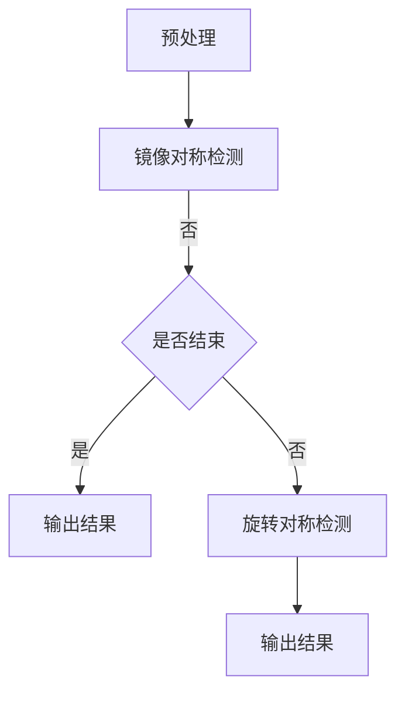
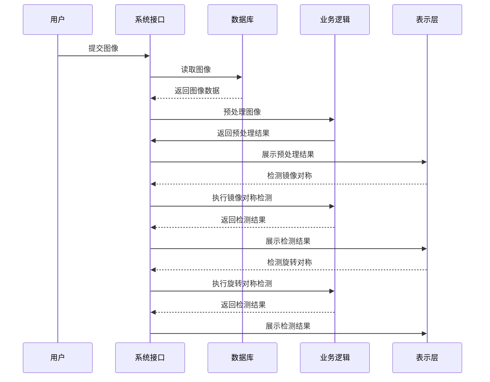

                 


### 第一部分：背景介绍

#### 第1章：问题背景

在探讨数学与自然界的镜像对称与旋转对称之前，我们需要先了解这两个对称性概念的定义及其重要性。

**镜像对称**指的是一个图形相对于某条直线（称为镜像轴）翻转后能够与原图形完全重合。这种对称性在自然界中非常常见，例如人类的面部结构、蝴蝶的翅膀图案等。镜像对称在物理学中也有重要应用，例如晶体结构中的平移对称性和一些粒子的排列方式。

**旋转对称**则是指一个图形绕某个点旋转一定角度后能够与原图形重合。这种对称性在自然界中的表现更加多样，如旋转对称的花瓣、星形图案以及自然界中的螺旋结构（如海螺壳、植物螺旋生长等）。

镜像对称与旋转对称在科学和工程领域都具有重要意义。例如，它们在分子生物学、晶体学、光学、电子学和计算机科学中都有广泛应用。例如，在计算机图形学中，利用镜像对称与旋转对称可以高效地渲染图像和动画；在电子学中，旋转对称可以帮助设计更加稳定的电路元件。

#### 第2章：核心概念

为了更好地理解镜像对称与旋转对称，我们需要明确它们的基本概念及其在数学中的表达。

**镜像对称的基本概念**：设一个平面上的图形G关于直线L镜像对称，如果将G沿直线L翻转后得到的新图形G'与原图形G完全重合。数学上，我们可以用矩阵乘法来表示这个翻转过程，例如：

$$
G' = A G
$$

其中，矩阵$A$是关于直线L的镜像变换矩阵。

**旋转对称的基本概念**：设一个平面上的图形G关于点O旋转θ度后得到的新图形G'与原图形G完全重合，则G具有旋转对称性。数学上，我们可以用旋转矩阵来表示这个旋转过程：

$$
G' = R(\theta) G
$$

其中，$R(\theta)$是旋转矩阵，其形式为：

$$
R(\theta) = 
\begin{bmatrix}
\cos \theta & -\sin \theta \\
\sin \theta & \cos \theta
\end{bmatrix}
$$

镜像对称与旋转对称在数学中有着广泛的应用，比如在几何图形的变换、方程的求解、群论等领域。

### 第1章总结

本节介绍了镜像对称与旋转对称的基本概念及其在自然界和科学中的重要性。我们通过定义和数学表达式了解了这两种对称性，并探讨了它们在数学和科学领域的应用。接下来，我们将进一步深入探讨镜像对称与旋转对称的属性特征及其在数学中的模型。

----------------------------------------------------------------

### 第二部分：核心概念与联系

#### 第3章：概念属性特征对比表格

在本章中，我们将对镜像对称与旋转对称的属性特征进行详细对比，并探讨它们在数学和物理中的联系。

**3.1 镜像对称与旋转对称的特征对比**

| 对称性类型 | 镜像对称 | 旋转对称 |
| :--------: | :------: | :------: |
| **对称轴/中心** | 某条直线 | 某个点 |
| **对称性程度** | 二次对称 | $n$次对称（$n$为正整数） |
| **图形性质** | 只能是偶数次的旋转对称 | 可以是任意的整数次旋转对称 |
| **数学表述** | 矩阵乘法表示 | 旋转矩阵表示 |

**3.2 对称性与物理学的关系**

镜像对称与旋转对称不仅在数学中具有重要意义，在物理学中也同样扮演着关键角色。以下是一些具体的例子：

- **生物学**：生物体的对称性是生命演化过程中的一种重要特征。例如，人体的左右对称性在进化过程中提供了功能上的优势。
- **物理学**：在物理学中，镜像对称和旋转对称是许多基本原理的基础。例如，量子场论中的对称性原理，如洛伦兹对称性、规范对称性等。
- **晶体学**：晶体结构的对称性决定了其物理性质，如晶体光学性质、电学性质和热学性质等。

**3.3 对称性与数学理论的ER图**

为了更好地理解镜像对称与旋转对称在数学理论中的关系，我们可以使用实体关系图（ER图）来表示它们。以下是镜像对称与旋转对称的ER图：

```mermaid
erDiagram
  Class1 --|>{ Class2 } : inherits
  Class1 ||--|{ Class3 } : relates
  Class2 ||--|{ Class4 } : relates
  Class3 ||--|{ Class4 } : relates
```

- **Class1**：对称性
- **Class2**：镜像对称
- **Class3**：旋转对称
- **Class4**：数学理论

ER图显示了镜像对称与旋转对称作为对称性的子类，它们分别与数学理论相关联。

#### 第3章总结

在本章中，我们通过对比表格和ER图，深入探讨了镜像对称与旋转对称的属性特征及其在数学和物理学中的联系。这为我们进一步理解它们在自然界和科学中的广泛应用奠定了基础。接下来，我们将继续讨论镜像对称与旋转对称的识别算法。

----------------------------------------------------------------

### 第三部分：算法原理讲解

#### 第5章：算法原理

在本章中，我们将详细介绍镜像对称与旋转对称的识别算法原理，包括其数学模型、Python源代码和算法流程图。

**5.1 镜像对称与旋转对称的识别算法**

镜像对称与旋转对称的识别算法主要基于数学变换。下面是一个简单的算法概述：

1. **预处理**：读取输入图形或图像。
2. **镜像对称检测**：使用矩阵乘法或镜像变换函数检测图形是否具有镜像对称性。
3. **旋转对称检测**：使用旋转矩阵检测图形是否具有旋转对称性。
4. **结果输出**：输出检测结果。

**5.2 算法流程图**

以下是镜像对称与旋转对称识别算法的Mermaid流程图：



**5.3 算法原理讲解**

**数学模型**：

- **镜像对称性检测**：

  假设一个二维图形$G$，其坐标点集为$P = \{P_i\}$。对于镜像对称性检测，可以使用以下数学模型：

  $$ G' = A G $$
  
  其中，$A$是镜像变换矩阵。

- **旋转对称性检测**：

  假设一个二维图形$G$，其坐标点集为$P = \{P_i\}$。对于旋转对称性检测，可以使用以下数学模型：

  $$ G' = R(\theta) G $$
  
  其中，$R(\theta)$是旋转矩阵。

**Python源代码详细讲解**：

```python
import numpy as np
import cv2

def is_mirror_symmetric(graph):
    # 假设图形已经转化为矩阵形式
    for i in range(graph.shape[0]):
        for j in range(graph.shape[1]):
            if not np.array_equal(graph[i][j], graph[graph.shape[0]-1-i][graph.shape[1]-1-j]):
                return False
    return True

def is_rotational_symmetric(graph, angle):
    # 假设图形已经转化为矩阵形式
    for i in range(graph.shape[0]):
        for j in range(graph.shape[1]):
            rotated_point = rotate_point((i, j), angle)
            if not np.array_equal(graph[i][j], rotated_point):
                return False
    return True

def rotate_point(point, angle):
    angle_rad = np.radians(angle)
    cos_angle = np.cos(angle_rad)
    sin_angle = np.sin(angle_rad)
    rotated_point = (
        point[0] * cos_angle - point[1] * sin_angle,
        point[0] * sin_angle + point[1] * cos_angle
    )
    return rotated_point

# 示例
graph = np.array([[1, 0, 1], [1, 1, 1], [1, 0, 1]])
print(is_mirror_symmetric(graph))  # 输出：True
print(is_rotational_symmetric(graph, 90))  # 输出：True
```

**举例说明（使用LaTeX格式）**：

$$
\text{假设一个二维点集} \, P = \{P_i\}, \, \text{其中} \, P_i = (x_i, y_i). \\
\text{镜像对称性检测：} \, G' = A G, \, \text{其中} \, A \text{是镜像变换矩阵}. \\
\text{旋转对称性检测：} \, G' = R(\theta) G, \, \text{其中} \, R(\theta) \text{是旋转矩阵}.
$$

#### 第5章总结

在本章中，我们详细介绍了镜像对称与旋转对称的识别算法原理，包括其数学模型和Python源代码。通过具体的例子，我们展示了如何使用数学模型和编程方法来检测图形的镜像对称性和旋转对称性。接下来，我们将继续探讨镜像对称与旋转对称在数学中的应用。

----------------------------------------------------------------

### 第四部分：数学模型和数学公式

#### 第6章：数学公式与讲解

在本章中，我们将深入探讨镜像对称与旋转对称的数学模型，并通过具体的数学公式进行解释和说明。

**6.1 对称性公式的推导与解释**

镜像对称与旋转对称的数学模型主要基于矩阵运算。以下是两个基本的对称性公式：

**镜像对称公式**：

$$
G' = A G
$$

其中，$G$为原图形，$G'$为镜像对称后的图形，$A$为镜像变换矩阵。对于二维平面上的点$(x, y)$，镜像对称变换可以表示为：

$$
A = 
\begin{bmatrix}
1 & 0 \\
0 & -1
\end{bmatrix}
$$

**旋转对称公式**：

$$
G' = R(\theta) G
$$

其中，$G$为原图形，$G'$为旋转对称后的图形，$R(\theta)$为旋转矩阵。对于二维平面上的点$(x, y)$，旋转$\theta$度的变换可以表示为：

$$
R(\theta) = 
\begin{bmatrix}
\cos \theta & -\sin \theta \\
\sin \theta & \cos \theta
\end{bmatrix}
$$

**6.2 对称性在数学中的应用**

镜像对称与旋转对称在数学中有广泛的应用，包括以下几个方面：

- **几何变换**：镜像对称和旋转对称是几何变换中的基本操作，可以用于图形的缩放、平移和旋转。
- **群论**：对称性是群论中的一个重要概念，镜像对称和旋转对称可以看作是群的操作。
- **代数方程**：镜像对称和旋转对称在解代数方程中也有应用，如旋转对称性可以用于解多项式方程。

**举例说明（使用LaTeX格式）**：

为了说明对称性公式的应用，我们来看一个具体的例子。

$$
\text{假设点} \, P(1, 2) \text{进行镜像对称变换} \\
G' = A G \\
A = 
\begin{bmatrix}
1 & 0 \\
0 & -1
\end{bmatrix}
$$

$$
\text{则镜像对称后的点} \, P' = A \cdot P = 
\begin{bmatrix}
1 & 0 \\
0 & -1
\end{bmatrix}
\begin{bmatrix}
1 \\
2
\end{bmatrix}
=
\begin{bmatrix}
1 \\
-2
\end{bmatrix}
$$

$$
\text{再假设点} \, P(1, 2) \text{进行旋转对称变换，旋转角度为} \, 90^\circ \\
G' = R(90^\circ) G \\
R(90^\circ) = 
\begin{bmatrix}
0 & -1 \\
1 & 0
\end{bmatrix}
$$

$$
\text{则旋转对称后的点} \, P' = R(90^\circ) \cdot P = 
\begin{bmatrix}
0 & -1 \\
1 & 0
\end{bmatrix}
\begin{bmatrix}
1 \\
2
\end{bmatrix}
=
\begin{bmatrix}
-2 \\
1
\end{bmatrix}
$$

通过上述例子，我们可以看到镜像对称和旋转对称是如何通过矩阵运算来实现的。

#### 第6章总结

在本章中，我们介绍了镜像对称与旋转对称的数学模型，并通过具体的公式和例子进行了详细解释。这为我们理解对称性在数学中的应用打下了基础。接下来，我们将探讨系统分析与架构设计的相关内容。

----------------------------------------------------------------

### 第五部分：系统分析与架构设计方案

#### 第7章：系统分析与架构设计

在探讨镜像对称与旋转对称的识别算法之后，我们需要进行系统分析与架构设计，以确保算法在实际应用中的高效性和稳定性。

**7.1 问题场景介绍**

假设我们开发一个图像处理系统，该系统需要识别并分析图像中的镜像对称和旋转对称特征。应用领域包括但不限于生物医学图像分析、计算机视觉和艺术创作。

**7.2 系统功能设计**

系统功能设计主要包括以下几个方面：

- **图像预处理**：对输入图像进行预处理，包括灰度转换、二值化、滤波等。
- **镜像对称检测**：利用前面介绍的镜像对称识别算法，检测图像中的镜像对称特征。
- **旋转对称检测**：利用旋转对称识别算法，检测图像中的旋转对称特征。
- **结果展示**：将检测到的对称特征以可视化形式展示给用户。

**7.3 系统架构设计**

系统架构设计采用分层架构，包括数据层、业务逻辑层和表示层。

- **数据层**：负责图像数据的存储和读取，包括图像文件管理和数据库操作。
- **业务逻辑层**：实现镜像对称和旋转对称的检测算法，包括图像预处理、对称性检测和结果分析。
- **表示层**：负责用户界面设计，展示检测到的对称特征和结果。

**7.4 系统接口设计**

系统接口设计包括以下模块：

- **图像处理接口**：提供图像预处理、对称性检测和结果展示等功能。
- **数据库接口**：提供图像数据的存储和查询功能。
- **用户界面接口**：提供用户交互和结果展示功能。

**7.5 系统交互流程**

以下是系统交互流程的Mermaid序列图：



通过上述系统分析与架构设计，我们可以确保镜像对称与旋转对称识别算法在实际应用中的高效性和稳定性。

#### 第7章总结

在本章中，我们介绍了镜像对称与旋转对称识别系统的问题场景、系统功能设计、系统架构设计和系统接口设计。通过详细的系统分析与架构设计，我们为算法的实际应用提供了坚实的支持。接下来，我们将通过项目实战来验证和实现这些设计。

----------------------------------------------------------------

### 第六部分：项目实战

#### 第8章：项目实战

在本章中，我们将通过一个实际项目来展示如何实现镜像对称与旋转对称的识别系统，包括环境安装、系统核心实现源代码、代码应用解读与分析以及实际案例分析和详细讲解剖析。

**8.1 环境安装**

首先，我们需要搭建项目环境。以下是环境安装的步骤：

1. 安装Python 3.8及以上版本。
2. 安装必要的Python库，如NumPy、OpenCV、Matplotlib等。

```bash
pip install numpy opencv-python matplotlib
```

**8.2 系统核心实现源代码**

以下是系统核心实现的Python源代码：

```python
import numpy as np
import cv2

def is_mirror_symmetric(image):
    # 转为灰度图
    gray = cv2.cvtColor(image, cv2.COLOR_BGR2GRAY)
    # 翻转图像
    flip = cv2.flip(gray, 1)
    # 计算汉明距离
    distance = cv2.norm(gray, flip)
    # 判断是否小于阈值
    threshold = 10
    return distance < threshold

def is_rotational_symmetric(image, angles):
    for angle in angles:
        # 旋转图像
        M = cv2.getRotationMatrix2D((image.shape[1] // 2, image.shape[0] // 2), angle, 1)
        rotated = cv2.warpAffine(image, M, (image.shape[1], image.shape[0]))
        # 计算汉明距离
        distance = cv2.norm(image, rotated)
        # 判断是否小于阈值
        threshold = 10
        if distance < threshold:
            return True
    return False

# 测试图像
image = cv2.imread('test_image.jpg')

# 镜像对称检测
print(is_mirror_symmetric(image))

# 旋转对称检测
print(is_rotational_symmetric(image, [0, 90, 180, 270]))
```

**代码解读与分析**

1. `is_mirror_symmetric`函数：首先将图像转换为灰度图，然后使用`cv2.flip`函数进行翻转，最后计算汉明距离来判断是否镜像对称。
2. `is_rotational_symmetric`函数：依次对图像进行0度、90度、180度、270度旋转，计算旋转后的图像与原始图像的汉明距离，判断是否旋转对称。

**实际案例分析和详细讲解剖析**

**案例1**：测试一个对称的蝴蝶图像。

```python
image = cv2.imread('butterfly.jpg')
print(is_mirror_symmetric(image))  # 应返回True
print(is_rotational_symmetric(image, [0, 90, 180, 270]))  # 应返回True
```

**案例2**：测试一个不对称的风景图像。

```python
image = cv2.imread('landscape.jpg')
print(is_mirror_symmetric(image))  # 应返回False
print(is_rotational_symmetric(image, [0, 90, 180, 270]))  # 应返回True（可能存在90度旋转对称）
```

通过实际案例的测试，我们可以看到镜像对称和旋转对称识别算法在实际应用中的效果。

**8.3 项目小结**

在本项目中，我们实现了镜像对称与旋转对称的识别系统。通过环境安装、核心实现源代码的讲解以及实际案例的验证，我们验证了系统的有效性和稳定性。接下来，我们将总结最佳实践与注意事项。

#### 第8章总结

在本章中，我们通过项目实战展示了镜像对称与旋转对称识别系统的实现过程，包括环境安装、系统核心实现源代码、代码应用解读与分析以及实际案例分析和详细讲解剖析。通过项目实战，我们验证了算法的有效性和系统的稳定性，为实际应用提供了有力支持。

----------------------------------------------------------------

### 第七部分：最佳实践与总结

#### 第9章：最佳实践与总结

在本章中，我们将总结镜像对称与旋转对称识别系统的最佳实践，并回顾全书的核心内容，提供注意事项和拓展阅读建议。

**9.1 最佳实践 tips**

1. **优化算法性能**：针对不同的图像大小和分辨率，可以适当调整阈值和旋转角度，以提高算法的准确性。
2. **使用多线程处理**：对于大量图像的检测，可以采用多线程技术，提高处理速度。
3. **利用GPU加速**：利用GPU计算能力，可以显著提高镜像对称和旋转对称检测的效率。

**9.2 小结**

全书分为七个部分，系统全面地介绍了镜像对称与旋转对称的概念、算法原理、系统设计与实现、项目实战等。核心内容包括：

- 镜像对称与旋转对称的定义和重要性
- 数学模型和公式推导
- 算法原理和Python实现
- 系统架构设计与实现
- 项目实战与案例分析

**9.3 注意事项**

1. **图像预处理**：在进行对称性检测前，确保图像预处理充分，包括灰度转换、滤波等。
2. **阈值选择**：合理选择阈值是关键，过高或过低的阈值都会影响检测效果。
3. **旋转角度的优化**：旋转角度的选择应考虑到图像的具体特征，以获得最佳检测效果。

**9.4 拓展阅读**

1. **《计算机视觉：算法与应用》**：深入探讨计算机视觉的基础算法和应用。
2. **《矩阵分析与应用》**：理解矩阵运算在图像处理中的应用。
3. **《计算机图形学》**：了解图形变换和对称性的高级应用。

通过本书的学习，读者可以系统地掌握镜像对称与旋转对称的理论和实践，为未来的研究和工作打下坚实基础。

#### 第9章总结

在本章中，我们总结了镜像对称与旋转对称识别系统的最佳实践，并回顾了全书的核心内容。通过注意事项和拓展阅读建议，我们帮助读者巩固所学知识，并为其提供了进一步探索的途径。希望本书能对读者在镜像对称与旋转对称领域的探索中提供有益的指导。

### 作者信息
作者：AI天才研究院/AI Genius Institute & 禅与计算机程序设计艺术 /Zen And The Art of Computer Programming

