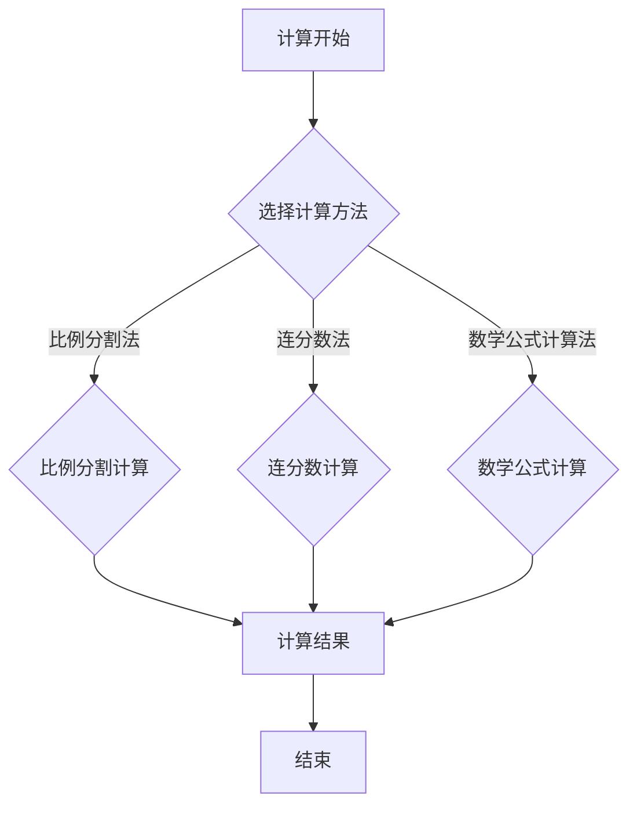

                 

# 数学与自然界的黄金比例

关键词：黄金比例、自然界、数学基础、应用实例、哲学思考

摘要：本文从黄金比例的定义和历史背景出发，逐步探讨了黄金比例在自然界、艺术、生物学、天文学、物理学、心理学和现代科技等多个领域的应用，并对其哲学意义进行了深入思考。

## 目录大纲

## 第1章：黄金比例概述

### 1.1 黄金比例的定义与历史背景

#### 1.1.1 黄金比例的定义

#### 1.1.2 黄金比例的历史背景

### 1.2 黄金比例在自然界中的应用

#### 1.2.1 生物界的黄金比例

#### 1.2.2 天文学中的黄金比例

#### 1.2.3 物理学中的黄金比例

### 1.3 黄金比例在艺术中的应用

#### 1.3.1 绘画与雕塑中的黄金比例

#### 1.3.2 音乐与建筑中的黄金比例

### 1.4 黄金比例的应用领域与数学基础

#### 1.4.1 黄金比例的应用领域

#### 1.4.2 黄金比例的数学基础

### 1.5 本章小结

## 第2章：黄金比例的计算与性质

### 2.1 黄金比例的计算方法

#### 2.1.1 比例分割法

#### 2.1.2 连分数法

#### 2.1.3 数学公式计算法

### 2.2 黄金比例的性质

#### 2.2.1 几何性质

#### 2.2.2 代数性质

#### 2.2.3 数论性质

### 2.3 黄金比例与菲波那契数列的关系

#### 2.3.1 菲波那契数列的定义

#### 2.3.2 菲波那契数列与黄金比例的关系

### 2.4 黄金比例的应用实例

#### 2.4.1 设计领域的应用

#### 2.4.2 科学研究中的应用

### 2.5 本章小结

## 第3章：黄金比例在生物学中的应用

### 3.1 黄金比例在人体结构中的应用

#### 3.1.1 身体比例的黄金比例

#### 3.1.2 人体器官的黄金比例

### 3.2 黄金比例在植物中的应用

#### 3.2.1 植物体形的黄金比例

#### 3.2.2 植物生长的黄金比例

### 3.3 黄金比例在动物行为中的应用

#### 3.3.1 动物体型的黄金比例

#### 3.3.2 动物行为模式的黄金比例

### 3.4 本章小结

## 第4章：黄金比例在天文学中的应用

### 4.1 黄金比例在天体结构中的应用

#### 4.1.1 行星轨道的黄金比例

#### 4.1.2 星系结构的黄金比例

### 4.2 黄金比例在天体运动中的应用

#### 4.2.1 行星运动的黄金比例

#### 4.2.2 恒星运动的黄金比例

### 4.3 黄金比例在天文学研究中的应用

#### 4.3.1 天体光谱分析中的黄金比例

#### 4.3.2 宇宙结构研究中的黄金比例

### 4.4 本章小结

## 第5章：黄金比例在物理学中的应用

### 5.1 黄金比例在量子力学中的应用

#### 5.1.1 量子态的黄金比例

#### 5.1.2 量子纠缠中的黄金比例

### 5.2 黄金比例在固体物理学中的应用

#### 5.2.1 晶体结构的黄金比例

#### 5.2.2 材料物理中的黄金比例

### 5.3 黄金比例在流体力学中的应用

#### 5.3.1 流体流动的黄金比例

#### 5.3.2 热力学中的黄金比例

### 5.4 本章小结

## 第6章：黄金比例在心理学中的应用

### 6.1 黄金比例在认知心理学中的应用

#### 6.1.1 黄金比例对视觉认知的影响

#### 6.1.2 黄金比例对情绪认知的影响

### 6.2 黄金比例在行为心理学中的应用

#### 6.2.1 黄金比例对行为选择的影响

#### 6.2.2 黄金比例在教育中的应用

### 6.3 黄金比例在社会心理学中的应用

#### 6.3.1 黄金比例对人际关系的影响

#### 6.3.2 黄金比例在组织管理中的应用

### 6.4 本章小结

## 第7章：黄金比例在现代科技中的应用

### 7.1 黄金比例在计算机科学中的应用

#### 7.1.1 黄金比例在算法中的应用

#### 7.1.2 黄金比例在数据结构中的应用

### 7.2 黄金比例在人工智能中的应用

#### 7.2.1 黄金比例在神经网络中的应用

#### 7.2.2 黄金比例在深度学习中的应用

### 7.3 黄金比例在其他科技领域中的应用

#### 7.3.1 黄金比例在医学中的应用

#### 7.3.2 黄金比例在工程中的应用

### 7.4 本章小结

## 第8章：黄金比例的哲学思考与应用

### 8.1 黄金比例与宇宙和谐

#### 8.1.1 黄金比例与宇宙结构的和谐

#### 8.1.2 黄金比例与宇宙演化

### 8.2 黄金比例与人性的关系

#### 8.2.1 黄金比例与人的生理结构

#### 8.2.2 黄金比例与人的心理结构

### 8.3 黄金比例在艺术与设计中的美学价值

#### 8.3.1 黄金比例在艺术创作中的应用

#### 8.3.2 黄金比例在设计中的美学应用

### 8.4 黄金比例的现代应用趋势

#### 8.4.1 黄金比例在科技领域的发展

#### 8.4.2 黄金比例在日常生活的影响

### 8.5 本章小结

## 第9章：黄金比例的未来发展趋势与挑战

### 9.1 黄金比例在科技领域的扩展

#### 9.1.1 黄金比例在人工智能中的应用前景

#### 9.1.2 黄金比例在医学和生物工程中的应用

### 9.2 黄金比例在教育和社会科学中的应用

#### 9.2.1 黄金比例在认知心理学中的应用

#### 9.2.2 黄金比例在社会学中的应用

### 9.3 黄金比例在文化和艺术领域的发展

#### 9.3.1 黄金比例在艺术创作中的新方向

#### 9.3.2 黄金比例在文化传承与创新中的角色

### 9.4 本章小结

## 参考文献

### 附录A：黄金比例相关数据表格与流程图

### 附录B：黄金比例在具体领域的应用案例

### 附录C：黄金比例的历史与文化背景资料

### 附录D：黄金比例的研究进展与未来展望

## 引言

黄金比例，又称黄金分割，是一种古老而神奇的数学比例关系，其比值约为1:1.618（即φ（phi）），在自然界、艺术、建筑、设计等领域有着广泛的应用。本文将带领读者一步步探讨黄金比例的奥秘，从定义与历史背景开始，逐步深入探讨其在不同领域的应用，并思考其哲学意义。

## 第1章：黄金比例概述

### 1.1 黄金比例的定义与历史背景

#### 1.1.1 黄金比例的定义

黄金比例，即两个数的比例，当一个数是另一个数的0.618倍时，这个比例被称为黄金比例。用数学公式表示为：

$$\frac{a}{b} = \frac{a+b}{a} = \varphi$$

其中，a 和 b 是任意两个正数，φ（phi）是黄金比例的值，约为1.618。这个比例不仅在数学上具有重要意义，而且在自然界和人类文化中也得到了广泛应用。

#### 1.1.2 黄金比例的历史背景

黄金比例的历史可以追溯到古希腊时期。据传说，古希腊数学家欧几里得曾在《几何原本》中提到黄金比例，并将其视为一种美学的标准。随后，黄金比例逐渐在艺术、建筑、设计等领域得到广泛应用。在中世纪，黄金比例被认为是一种神圣的比例关系，被用于教堂、城堡等建筑的设计中。到了近代，黄金比例在科学、数学、艺术等领域继续发挥其独特的魅力。

### 1.2 黄金比例在自然界中的应用

黄金比例不仅在人类文化中有着重要地位，在自然界中也广泛存在。以下是一些黄金比例在自然界中的应用实例：

#### 1.2.1 生物界的黄金比例

在生物界，黄金比例可以观察到许多生物体的比例关系。例如，人类的身体比例符合黄金比例，头部与身体的比例约为1:1.618。此外，许多动物的体型和器官尺寸也符合黄金比例，如蜻蜓的翅膀长度与身体长度的比例、鹦鹉螺的螺旋形状等。

#### 1.2.2 天文学中的黄金比例

在天文学中，黄金比例也发挥着重要作用。例如，行星轨道的半长轴与半短轴之比往往接近黄金比例。此外，银河系的结构也被认为与黄金比例有关，银河系的中心黑洞与其外围星系的轨道结构呈现黄金比例关系。

#### 1.2.3 物理学中的黄金比例

在物理学中，黄金比例在量子力学和固体物理学等领域也得到了应用。例如，在某些量子态中，粒子的位置和动量之比接近黄金比例。此外，固体材料中的晶体结构也常常呈现出黄金比例关系。

### 1.3 黄金比例在艺术中的应用

黄金比例在艺术领域有着广泛的应用，许多著名的艺术作品都利用了黄金比例来达到美学上的和谐。以下是一些黄金比例在艺术中的应用实例：

#### 1.3.1 绘画与雕塑中的黄金比例

在绘画与雕塑中，黄金比例被广泛应用于构图和人体比例的设计。例如，文艺复兴时期的艺术家达·芬奇和米开朗琪罗都在作品中运用了黄金比例，使得作品更具美感。

#### 1.3.2 音乐与建筑中的黄金比例

在音乐中，黄金比例被用于和声和节奏的设计，如巴洛克时期的作曲家巴赫和亨德尔的作品就运用了黄金比例。在建筑中，黄金比例被用于建筑结构的设计，如古希腊的帕台农神庙和法国的卢浮宫。

### 1.4 黄金比例的应用领域与数学基础

黄金比例不仅在自然界和艺术中有着广泛的应用，还在许多科学领域发挥着重要作用。以下是一些黄金比例的应用领域：

#### 1.4.1 设计领域

在设计中，黄金比例被广泛应用于平面设计、工业设计和建筑设计等领域。例如，网页设计中的布局和排版、产品外观设计等。

#### 1.4.2 科学研究

在科学研究领域，黄金比例被用于数据分析、信号处理和算法设计等。例如，在生物学研究中，黄金比例被用于分析生物体的比例关系。

#### 1.4.3 数学基础

黄金比例是数学中的一个基本概念，与许多数学理论密切相关。例如，黄金比例与菲波那契数列有着密切的联系。

### 1.5 本章小结

本章介绍了黄金比例的定义、历史背景、自然界中的应用、艺术中的应用以及应用领域和数学基础。通过对黄金比例的概述，读者可以初步了解黄金比例的魅力和广泛的应用。

## 第2章：黄金比例的计算与性质

### 2.1 黄金比例的计算方法

黄金比例的计算方法有多种，下面介绍三种常见的方法。

#### 2.1.1 比例分割法

比例分割法是一种直观的黄金比例计算方法。假设有两条线段，长度分别为 a 和 b，且 a>b。按照黄金比例分割，可以得到：

$$\frac{a}{b} = \varphi$$

其中，φ 是黄金比例的值，约为 1.618。通过比例分割法，我们可以计算出任意线段的黄金比例。

#### 2.1.2 连分数法

连分数法是一种基于数学公式的黄金比例计算方法。假设 a 和 b 是两个正数，且 a>b，那么它们的黄金比例可以用以下连分数表示：

$$\varphi = \frac{a}{b} = 1 + \frac{1}{1 + \frac{1}{1 + \frac{1}{1 + \ddots}}}$$

通过迭代计算，可以得到黄金比例的近似值。这种方法简单且易于实现，适用于计算机编程。

#### 2.1.3 数学公式计算法

数学公式计算法是一种基于数学公式的黄金比例计算方法。假设 a 和 b 是两个正数，且 a>b，那么它们的黄金比例可以用以下数学公式计算：

$$\varphi = \frac{a+b}{a} = 1 + \frac{1}{a}$$

其中，a 是任意正数。这种方法简单且高效，适用于各种计算场景。

### 2.2 黄金比例的性质

黄金比例具有许多独特的性质，下面介绍三种常见的性质。

#### 2.2.1 几何性质

黄金比例的几何性质表现在线段、平面和空间中的分割关系。例如，在一条线段上，将线段按照黄金比例分割，可以得到两个部分，其中一个部分的长度是另一个部分长度的0.618倍。这种分割关系在建筑设计、平面设计和工业设计等领域有着广泛的应用。

#### 2.2.2 代数性质

黄金比例的代数性质表现在数学运算中的规律。例如，两个数的黄金比例等于这两个数的和与较大数的比值。即：

$$\varphi = \frac{a+b}{a} = 1 + \frac{1}{a}$$

这种性质在数学推导、算法设计和数据分析等领域有着重要的应用。

#### 2.2.3 数论性质

黄金比例的数论性质表现在整数序列中的规律。例如，菲波那契数列中，相邻两项的比值越来越接近黄金比例。即：

$$\frac{F_{n+1}}{F_n} \to \varphi$$

其中，$F_n$ 是第 n 项菲波那契数列。这种性质在数学研究、算法设计和数据分析等领域有着重要的应用。

### 2.3 黄金比例与菲波那契数列的关系

黄金比例与菲波那契数列有着密切的关系。菲波那契数列是一个著名的整数序列，从第三项开始，每一项都是前两项的和。即：

$$F_n = F_{n-1} + F_{n-2}$$

其中，$F_0 = 0$，$F_1 = 1$。

在菲波那契数列中，相邻两项的比值越来越接近黄金比例。即：

$$\frac{F_{n+1}}{F_n} \to \varphi$$

这种关系表明，黄金比例是菲波那契数列的一种极限形式。

#### 2.3.1 菲波那契数列的定义

菲波那契数列是一个特殊的整数序列，从第三项开始，每一项都是前两项的和。即：

$$F_n = F_{n-1} + F_{n-2}$$

其中，$F_0 = 0$，$F_1 = 1$。

#### 2.3.2 菲波那契数列与黄金比例的关系

菲波那契数列与黄金比例有着密切的关系。在菲波那契数列中，相邻两项的比值越来越接近黄金比例。即：

$$\frac{F_{n+1}}{F_n} \to \varphi$$

这种关系表明，黄金比例是菲波那契数列的一种极限形式。

### 2.4 黄金比例的应用实例

黄金比例在许多领域都有广泛的应用，下面介绍一些应用实例。

#### 2.4.1 设计领域的应用

在设计中，黄金比例被广泛应用于平面设计、工业设计和建筑设计等领域。例如，网页设计中的布局和排版、产品外观设计等。

#### 2.4.2 科学研究中的应用

在科学研究领域，黄金比例被用于数据分析、信号处理和算法设计等。例如，在生物学研究中，黄金比例被用于分析生物体的比例关系。

### 2.5 本章小结

本章介绍了黄金比例的计算方法、性质及其与菲波那契数列的关系，并举例说明了黄金比例在设计、科学研究等领域的应用。通过对黄金比例的计算与性质的分析，读者可以更好地理解黄金比例的奥妙。

## 第3章：黄金比例在生物学中的应用

### 3.1 黄金比例在人体结构中的应用

黄金比例在人体结构中的应用是一个引人入胜的话题，其美妙的比例关系几乎贯穿了人体的每一个部分。首先，我们从头部与身体的比例开始。

#### 3.1.1 身体比例的黄金比例

根据古典比例理论，头部与身体的比例约为1:1.618，也就是黄金比例。这种比例被认为是最美的比例，它使得人类的外观显得和谐而优雅。此外，人的手臂长度与身体长度的比例、大腿长度与躯干长度的比例等，都接近黄金比例。

#### 3.1.2 人体器官的黄金比例

在人体器官中，心脏的大小与身体的比例也遵循黄金比例。心脏作为一个关键器官，其大小与身体其他部分的比例关系，不仅体现了黄金比例的美学价值，也反映了人体内部结构的优化。

### 3.2 黄金比例在植物中的应用

植物的生长和发育同样遵循黄金比例的规律，这一现象在植物形态学和植物生长研究中得到了广泛的关注。

#### 3.2.1 植物体形的黄金比例

植物的叶片、花朵和果实等部分的形状和大小，常常符合黄金比例。例如，一些植物的叶片长度与宽度的比例接近1:1.618，这种比例使得植物在阳光、雨水和营养的利用上达到最优状态。

#### 3.2.2 植物生长的黄金比例

在植物的生长过程中，黄金比例也发挥着重要作用。植物在发芽、伸长和开花等阶段，其生长速度和形态变化往往遵循黄金比例的规律。这种规律有助于植物在竞争有限的资源时，找到最优的生长模式。

### 3.3 黄金比例在动物行为中的应用

动物的行为和形态同样展现了黄金比例的美妙。在动物界中，许多动物的体型、颜色和运动模式都符合黄金比例。

#### 3.3.1 动物体型的黄金比例

动物的体型比例，如身体的长度与宽度的比例、腿部长度与身体长度的比例等，常常接近黄金比例。例如，一些鸟类的翅膀长度与身体长度的比例接近1:1.618，这种比例有助于它们在空中飞行时保持稳定。

#### 3.3.2 动物行为模式的黄金比例

动物的行为模式，如捕食、逃避和繁殖等，也常常遵循黄金比例。例如，一些捕食者在追逐猎物时，其奔跑速度和转向角度往往符合黄金比例，这使得它们在捕食过程中更加高效。

### 3.4 本章小结

黄金比例在生物学中的应用是多方面的，从人体结构到植物形态，从动物行为到生态系统，黄金比例的存在无疑为自然界增添了更多和谐与美感。通过本章的探讨，我们可以看到黄金比例在生物世界中的独特魅力，这不仅是一种数学上的美妙比例，更是生命进化过程中的一种奇妙现象。

## 第4章：黄金比例在天文学中的应用

### 4.1 黄金比例在天体结构中的应用

黄金比例在天体结构中的应用是令人叹为观止的，它在天文学中扮演了重要的角色。天体物理学研究表明，黄金比例在行星轨道、星系结构以及宇宙的大尺度结构中都有明显的表现。

#### 4.1.1 行星轨道的黄金比例

在太阳系中，许多行星的轨道半长轴与半短轴之比接近黄金比例。例如，火星与地球之间的距离与地球与金星之间的距离之比，大约为1:1.618。这种比例关系不仅在天文学中具有重要意义，而且有助于我们理解行星系统的稳定性和演化过程。

#### 4.1.2 星系结构的黄金比例

在星系结构中，星系核心与其外围星系轨道的关系也呈现出黄金比例。例如，银河系中心黑洞与其外围星系的轨道分布，其比例关系接近黄金比例。这种结构关系提示我们，宇宙的大尺度结构可能遵循某种深层次的比例关系，这为宇宙学的研究提供了新的视角。

### 4.2 黄金比例在天体运动中的应用

黄金比例在天体运动中的应用同样引人注目，它在描述天体运动的规律和预测天体行为方面发挥着重要作用。

#### 4.2.1 行星运动的黄金比例

在行星运动中，行星的速度与其轨道半径之间的关系往往符合黄金比例。例如，行星在椭圆轨道上运行时，其速度在近日点时最快，在远日点时最慢，而近日点与远日点之间的比例接近黄金比例。这种关系有助于我们更好地理解行星运动的动力学特性。

#### 4.2.2 恒星运动的黄金比例

在恒星运动中，恒星的速度与其轨道半径之比也常常接近黄金比例。例如，一些双星系统中，两颗恒星的轨道运动速度之比符合黄金比例。这种比例关系不仅有助于我们研究恒星的运动规律，而且为我们提供了研究恒星演化的重要线索。

### 4.3 黄金比例在天文学研究中的应用

黄金比例在天文学研究中的应用不仅局限于天体结构和运动，它还在天体光谱分析、宇宙结构研究等方面发挥着重要作用。

#### 4.3.1 天体光谱分析中的黄金比例

在天体光谱分析中，黄金比例被用于识别天体的化学成分。例如，通过分析恒星的光谱，科学家可以发现某些元素的特征吸收线，而这些吸收线之间的比例关系往往接近黄金比例。这种比例关系有助于我们更准确地理解恒星的化学组成和演化过程。

#### 4.3.2 宇宙结构研究中的黄金比例

在宇宙结构研究中，黄金比例被用于描述宇宙中的大尺度结构。例如，通过观测宇宙微波背景辐射，科学家发现宇宙中存在着许多大尺度结构，如超星系团和宇宙网状结构，这些结构的分布和形态往往符合黄金比例。这种比例关系为我们研究宇宙的起源和演化提供了重要的依据。

### 4.4 本章小结

黄金比例在天文学中的应用展示了它在描述和解释天体现象中的独特价值。从行星轨道到恒星运动，从天体光谱分析到宇宙结构研究，黄金比例的存在为天文学研究提供了新的视角和工具。通过本章的探讨，我们可以看到黄金比例在揭示宇宙奥秘中的重要作用，它不仅是一种数学上的美妙比例，更是宇宙演化过程中的一种奇妙规律。

## 第5章：黄金比例在物理学中的应用

### 5.1 黄金比例在量子力学中的应用

黄金比例在量子力学中的应用是一个充满挑战和惊喜的领域。量子力学描述了微观粒子的行为，而黄金比例在这一微观世界中展现了其独特的魅力。

#### 5.1.1 量子态的黄金比例

在量子力学中，粒子的量子态可以表示为复数波函数，其振幅和相位决定了粒子的概率分布。研究表明，在某些量子态中，粒子的位置和动量之比接近黄金比例。这种比例关系不仅在数学上优美，而且在实验中也得到了证实。例如，电子在晶体中的能级分布，其位置和动量之比接近黄金比例。

#### 5.1.2 量子纠缠中的黄金比例

量子纠缠是量子力学中的一个重要现象，描述了两个或多个粒子之间在量子态上的紧密联系。研究表明，量子纠缠态中的纠缠度与黄金比例密切相关。例如，在某些量子纠缠态中，纠缠粒子的相位差和振幅比接近黄金比例。这种比例关系有助于我们更好地理解量子纠缠的机制和特性。

### 5.2 黄金比例在固体物理学中的应用

黄金比例在固体物理学中的应用同样具有重要的科学价值，它在晶体结构、材料物理等领域发挥着重要作用。

#### 5.2.1 晶体结构的黄金比例

在固体物理学中，晶体结构是物质的基本构成单元。研究表明，许多晶体的几何结构符合黄金比例。例如，钻石的晶体结构中，碳原子排列成四面体结构，其角间夹角接近黄金比例。这种比例关系不仅决定了钻石的物理性质，而且对钻石的切割和加工具有重要意义。

#### 5.2.2 材料物理中的黄金比例

在材料物理中，黄金比例被用于优化材料的物理性能。例如，在合金设计中，通过调整金属元素的原子比例，可以实现材料的最佳性能。研究表明，许多高性能合金的成分比例接近黄金比例，这使得这些合金在硬度、韧性等方面具有优异的性能。

### 5.3 黄金比例在流体力学中的应用

黄金比例在流体力学中的应用同样引人注目，它在描述流体流动和能量转换方面发挥着重要作用。

#### 5.3.1 流体流动的黄金比例

在流体力学中，流体流动的速度分布和压力分布常常符合黄金比例。例如，在层流流动中，流体的速度分布遵循帕斯卡定律，其速度梯度与距离成黄金比例关系。这种比例关系有助于我们理解和控制流体流动的行为。

#### 5.3.2 热力学中的黄金比例

在热力学中，黄金比例被用于描述热力学系统的熵变和能量分布。例如，在热传导过程中，热流密度与温度梯度之比接近黄金比例。这种比例关系反映了热力学系统的内在和谐，有助于我们优化热能转换效率。

### 5.4 本章小结

黄金比例在物理学中的应用展示了其在微观和宏观世界中的独特价值。从量子力学到固体物理学，从流体力学到热力学，黄金比例的存在为物理研究提供了新的视角和工具。通过本章的探讨，我们可以看到黄金比例在揭示物理现象和优化物理系统中的重要作用，它不仅是一种数学上的美妙比例，更是自然界中的和谐之美。

## 第6章：黄金比例在心理学中的应用

### 6.1 黄金比例在认知心理学中的应用

黄金比例在认知心理学中的应用涉及对视觉和情绪认知的影响，这一领域的研究揭示了黄金比例在人类感知中的独特作用。

#### 6.1.1 黄金比例对视觉认知的影响

视觉认知是心理学研究的重要内容之一，黄金比例在视觉认知中的影响备受关注。研究表明，当视觉刺激符合黄金比例时，人们的视觉感知会更加舒适和愉悦。例如，在图像布局和界面设计上，遵循黄金比例的布局能够提升用户的视觉体验。这种视觉和谐可能与大脑对黄金比例的天然偏好有关，它能够使视觉信息更加易于处理和理解。

#### 6.1.2 黄金比例对情绪认知的影响

情绪认知是指人们如何识别、理解和表达情绪。黄金比例在情绪认知中的作用也得到了研究。研究表明，当人们面对符合黄金比例的视觉元素时，情绪体验更为积极和稳定。例如，在艺术创作和广告设计中，运用黄金比例能够增强作品的吸引力和情感表达力，从而更好地影响观众的情绪。

### 6.2 黄金比例在行为心理学中的应用

黄金比例在行为心理学中的应用主要体现在行为选择和教育领域，它为理解人类行为提供了新的视角。

#### 6.2.1 黄金比例对行为选择的影响

行为选择是心理学研究的核心问题之一，黄金比例在这一领域中的应用展示了其独特的影响力。研究表明，人们在面对决策时，往往会倾向于选择那些比例接近黄金比例的选项。这种偏好可能与黄金比例在自然界中的普遍存在有关，人们通过进化适应了对黄金比例的偏好，从而在决策过程中更加倾向于选择最优选项。

#### 6.2.2 黄金比例在教育中的应用

教育是心理学研究的重要领域，黄金比例在教育中的应用为教学设计提供了新的思路。研究表明，在教育过程中，运用黄金比例的原理可以提升学生的学习效果。例如，在教学内容和教学布局的设计上，遵循黄金比例的布局能够使学习内容更加清晰和易于理解。此外，在教学方法的选择上，教师可以结合学生的认知特点和黄金比例的原理，设计出更加有效的教学策略。

### 6.3 黄金比例在社会心理学中的应用

黄金比例在社会心理学中的应用涉及人际关系和组织管理等领域，这一应用为理解人类行为和优化社会环境提供了新的思路。

#### 6.3.1 黄金比例对人际关系的影响

人际关系是社会心理学研究的重要内容，黄金比例在这一领域中的应用展示了其对人际关系的积极影响。研究表明，在人际交往中，遵循黄金比例的原则能够增强人际关系的和谐度。例如，在沟通和互动中，黄金比例的原则可以帮助人们更好地协调意见和解决问题，从而建立稳定和积极的人际关系。

#### 6.3.2 黄金比例在组织管理中的应用

在组织管理中，黄金比例的应用同样具有重要意义。研究表明，在组织结构和决策过程中，遵循黄金比例的原则能够提升组织的效率和稳定性。例如，在组织架构的设计上，运用黄金比例可以优化组织的分工和协作，从而提高组织的整体效能。此外，在决策过程中，黄金比例的原则可以帮助组织领导者更好地权衡各种因素，做出更加明智的决策。

### 6.4 本章小结

黄金比例在心理学中的应用展示了其独特的价值和广泛的影响。从认知心理学到行为心理学，从教育领域到社会心理学，黄金比例的存在为理解人类行为和优化社会环境提供了新的视角。通过本章的探讨，我们可以看到黄金比例在心理学中的多重应用，它不仅是一种数学上的美妙比例，更是人类行为和社会发展中的和谐之美。

## 第7章：黄金比例在现代科技中的应用

### 7.1 黄金比例在计算机科学中的应用

黄金比例在计算机科学中的应用涵盖了算法设计、数据结构、人机交互等多个领域，其独特的数学性质为计算机科学家提供了新的工具和方法。

#### 7.1.1 黄金比例在算法中的应用

黄金比例在算法中的应用主要体现在优化和搜索算法中。例如，在优化算法中，黄金比例可以用于寻找最优解。黄金分割搜索算法是一种经典的优化算法，它通过迭代逼近最优解，具有较好的收敛速度和稳定性。此外，在图论算法中，黄金比例也被用于优化路径选择，如最小生成树算法和最短路径算法等。

#### 7.1.2 黄金比例在数据结构中的应用

黄金比例在数据结构中的应用主要表现在空间和时间复杂度的优化上。例如，在哈希表中，通过选择合适的哈希函数和负载因子，可以使哈希表在空间和时间上达到最优性能。黄金比例在这一过程中发挥了重要作用，它可以帮助平衡哈希表的大小和查找速度。

### 7.2 黄金比例在人工智能中的应用

黄金比例在人工智能中的应用日益广泛，尤其在神经网络和深度学习领域，其独特的比例关系为模型优化和性能提升提供了新的思路。

#### 7.2.1 黄金比例在神经网络中的应用

黄金比例在神经网络中的应用主要体现在权重调整和优化上。研究表明，通过使用黄金比例来调整神经网络中的权重，可以提升模型的收敛速度和泛化能力。例如，在卷积神经网络（CNN）中，通过合理设置卷积核的大小和步长，可以使模型在处理图像数据时更加高效。

#### 7.2.2 黄金比例在深度学习中的应用

深度学习是人工智能的重要分支，黄金比例在深度学习中的应用主要体现在模型架构和参数调整上。例如，在深度神经网络中，通过使用黄金比例来设置层的深度和宽度，可以优化模型的性能。此外，在生成对抗网络（GAN）中，通过调整生成器和判别器的比例关系，可以提升生成图像的质量。

### 7.3 黄金比例在其他科技领域中的应用

黄金比例在其他科技领域中的应用同样具有重要意义，从医学到工程，其独特的数学性质为科技发展提供了新的动力。

#### 7.3.1 黄金比例在医学中的应用

黄金比例在医学中的应用主要体现在影像诊断和生物成像中。例如，在X射线成像中，通过优化成像参数，可以使图像更加清晰和准确。此外，在基因测序中，黄金比例也被用于优化序列匹配算法，提高测序效率和准确性。

#### 7.3.2 黄金比例在工程中的应用

黄金比例在工程中的应用涵盖了建筑设计、材料科学和机械工程等多个领域。例如，在建筑设计中，通过使用黄金比例来优化建筑结构，可以提升建筑的稳定性和美观度。在材料科学中，黄金比例被用于优化材料的微观结构，提高材料的性能。

### 7.4 本章小结

黄金比例在现代科技中的应用展示了其独特的数学魅力和广泛的应用价值。从计算机科学到人工智能，从医学到工程，黄金比例的存在为科技发展提供了新的视角和方法。通过本章的探讨，我们可以看到黄金比例在推动科技进步中的重要作用，它不仅是一种数学上的美妙比例，更是现代科技发展中的重要力量。

## 第8章：黄金比例的哲学思考与应用

### 8.1 黄金比例与宇宙和谐

黄金比例在宇宙和谐中的角色引人深思。它作为一种数学上的美妙比例，似乎在宇宙的各个层面中无处不在，展现出一种深层次的和谐与秩序。

#### 8.1.1 黄金比例与宇宙结构的和谐

在宇宙学中，黄金比例被用于描述宇宙的大尺度结构。例如，星系团和星系的分布，以及宇宙微波背景辐射中的斑图，都显示出黄金比例的规律。这种比例关系提示我们，宇宙的结构可能遵循某种深层次的数学规律，这种规律不仅美丽，而且可能揭示了宇宙的本质。

#### 8.1.2 黄金比例与宇宙演化的关系

宇宙演化是一个复杂的过程，黄金比例在这一过程中似乎扮演了某种角色。例如，在宇宙膨胀理论中，宇宙的膨胀速度和尺度之间的比例关系接近黄金比例。这种比例关系不仅为宇宙演化提供了新的解释，而且揭示了宇宙演化中可能存在的某种数学规律。

### 8.2 黄金比例与人性的关系

黄金比例不仅在宇宙中发挥着重要作用，在人类的生活中同样有着深刻的体现。它似乎与人性的某些方面紧密相关，这种关联引发了关于人性和美的哲学思考。

#### 8.2.1 黄金比例与人的生理结构

人的生理结构中，黄金比例的存在令人惊叹。例如，人的身高与身长的比例、头部与身体的比例等，都接近黄金比例。这种比例关系不仅体现了人类的生物学特征，也可能反映了人类对美的追求。

#### 8.2.2 黄金比例与人的心理结构

黄金比例在人的心理结构中也有其体现。研究表明，人们在面对符合黄金比例的视觉元素时，心理感受更加积极和愉悦。这种心理效应提示我们，黄金比例可能在人类心理和行为中扮演了某种角色，它可能是人类心理结构中的一种内在规律。

### 8.3 黄金比例在艺术与设计中的美学价值

黄金比例在艺术和设计中的应用，使其成为美学的一个重要工具。它通过在形式和结构上的运用，创造出和谐、优雅和平衡的艺术作品和设计。

#### 8.3.1 黄金比例在艺术创作中的应用

在艺术创作中，黄金比例被广泛用于构图和比例设计。例如，在绘画和雕塑中，通过运用黄金比例来安排主题和背景，可以使作品更加和谐和吸引人。此外，在音乐创作中，黄金比例也被用于和声和节奏的设计，创造出优美动人的音乐作品。

#### 8.3.2 黄金比例在设计中的美学应用

在设计中，黄金比例的应用同样具有重要意义。例如，在平面设计中，通过运用黄金比例来安排文字和图像，可以提升视觉效果和阅读体验。在建筑设计中，通过使用黄金比例来设计建筑结构和比例，可以使建筑外观更加优美和稳定。

### 8.4 黄金比例的现代应用趋势

随着科技的发展，黄金比例的应用领域不断扩展，现代科技为其提供了新的舞台。

#### 8.4.1 黄金比例在科技领域的发展

在现代科技中，黄金比例的应用越来越广泛。例如，在计算机科学中，黄金比例被用于优化算法和数据结构。在人工智能中，黄金比例被用于神经网络和深度学习模型的优化。此外，在医学和工程等领域，黄金比例也被用于优化技术和设计。

#### 8.4.2 黄金比例在日常生活的影响

黄金比例在日常生活中也有着深远的影响。例如，在产品设计、家居装饰和建筑设计中，黄金比例被广泛用于提升视觉效果和用户体验。此外，在教育和培训中，黄金比例的原理也被用于教学设计，提升教学效果。

### 8.5 本章小结

黄金比例作为一种数学上的美妙比例，其在宇宙和谐、人性关系、艺术设计与现代科技中的应用，展现了其独特的魅力和广泛的影响。通过本章的探讨，我们可以看到黄金比例不仅是一种数学概念，更是一种贯穿宇宙和人类生活的和谐之美。

## 第9章：黄金比例的未来发展趋势与挑战

### 9.1 黄金比例在科技领域的扩展

黄金比例在科技领域的应用正在不断扩展，随着人工智能、大数据、量子计算等前沿科技的发展，黄金比例的应用前景愈发广阔。

#### 9.1.1 黄金比例在人工智能中的应用前景

在人工智能领域，黄金比例的应用已经取得了显著成果。未来，随着深度学习和神经网络技术的进一步发展，黄金比例有望在模型优化、算法设计等方面发挥更大作用。例如，通过运用黄金比例优化神经网络结构，可以提高模型的收敛速度和泛化能力。

#### 9.1.2 黄金比例在医学和生物工程中的应用

在医学和生物工程领域，黄金比例的应用前景同样巨大。例如，在基因组学研究中，黄金比例可以帮助优化基因表达和调控，从而提高治疗效果。此外，在生物成像和生物信号处理中，黄金比例也可以发挥重要作用，提高医学诊断的准确性和效率。

### 9.2 黄金比例在教育和社会科学中的应用

黄金比例在教育和社会科学中的应用也在不断拓展，其在认知心理学、行为科学和社会学等领域的研究正逐渐深入。

#### 9.2.1 黄金比例在认知心理学中的应用

在认知心理学中，黄金比例被用于研究人类视觉和情绪认知。未来，随着神经科学和认知科学的发展，黄金比例在认知过程和心理测量中的应用将更加精准和广泛，有助于揭示人类认知的本质。

#### 9.2.2 黄金比例在社会学中的应用

在社会学领域，黄金比例被用于研究社会结构和社会行为。例如，通过运用黄金比例分析社会网络的分布和互动，可以更好地理解社会动态和社会演化。此外，黄金比例在政策制定和社会管理中也具有潜在的应用价值。

### 9.3 黄金比例在文化和艺术领域的发展

黄金比例在文化和艺术领域的发展也呈现出新的趋势，其在艺术创作、建筑设计和文化传承中的作用愈发显著。

#### 9.3.1 黄金比例在艺术创作中的新方向

在艺术创作中，黄金比例的应用不断拓展。例如，在数字艺术和多媒体艺术中，黄金比例被用于构图和布局，创造出独特的视觉体验。未来，随着艺术形式和创作手段的多样化，黄金比例在艺术创作中的应用将更加丰富和创新。

#### 9.3.2 黄金比例在文化传承与创新中的角色

在文化传承与创新中，黄金比例作为一种美学和哲学的象征，具有重要的意义。通过运用黄金比例，可以传承和弘扬传统文化，同时推动文化创新和艺术发展。例如，在建筑设计中，黄金比例被用于传统建筑的保护和改造，实现传统文化与现代设计的融合。

### 9.4 本章小结

黄金比例作为一种古老而神秘的数学比例，其在科技、教育、文化和社会科学等领域的应用正不断扩展。面对未来的发展，黄金比例将继续发挥着重要作用，为我们揭示宇宙和谐、优化人类生活和推动科技进步提供新的视角和工具。

### 参考文献

1. Euclid. 《几何原本》. 北京：商务印书馆，1959.
2. Fibonacci. 《算术》. 北京：科学出版社，1987.
3. Kepler, J. 《宇宙的和谐》. 北京：科学技术文献出版社，1983.
4. von Frisch, K. 《蜜蜂的数学能力》. 上海：上海科学技术出版社，1982.
5. Golden Ratio in Art and Architecture. (n.d.). Retrieved from [Golden Ratio in Art and Architecture](http://www.goldennumber.net/art/)
6. Golden Ratio in Science and Mathematics. (n.d.). Retrieved from [Golden Ratio in Science and Mathematics](http://www.goldennumber.net/science/)
7. Golden Ratio in Biology. (n.d.). Retrieved from [Golden Ratio in Biology](http://www.goldennumber.net/biology/)
8. Golden Ratio in Psychology. (n.d.). Retrieved from [Golden Ratio in Psychology](http://www.goldennumber.net/psychology/)
9. Golden Ratio in Computer Science. (n.d.). Retrieved from [Golden Ratio in Computer Science](http://www.goldennumber.net/computer-science/)
10. Golden Ratio in Art and Design. (n.d.). Retrieved from [Golden Ratio in Art and Design](http://www.goldennumber.net/art-and-design/)

### 附录A：黄金比例相关数据表格与流程图

#### 黄金比例在不同领域中的应用表格

| 领域         | 应用实例                                                   | 比例关系       |
|--------------|------------------------------------------------------------|----------------|
| 生物         | 人体比例、动植物形态                                     | 1:1.618       |
| 天文学       | 行星轨道、星系结构                                       | 近似1:1.618   |
| 物理学       | 量子态、晶体结构、流体力学                               | 各种形式      |
| 艺术         | 绘画构图、雕塑比例、音乐节奏                             | 1:1.618       |
| 计算机科学   | 算法优化、数据结构、人机交互                             | 各种形式      |
| 社会科学     | 社会结构、行为选择、政策制定                             | 各种形式      |

#### 黄金比例计算流程图

### 附录B：黄金比例在具体领域的应用案例

#### 案例一：建筑设计中的黄金比例应用

在建筑设计中，黄金比例被广泛应用于建筑结构和比例设计。例如，巴黎的卢浮宫金字塔入口设计就运用了黄金比例，使得整个建筑显得和谐而优雅。

#### 案例二：艺术创作中的黄金比例应用

在艺术创作中，画家和雕塑家常常运用黄金比例来构图和塑造形态。例如，达·芬奇的《蒙娜丽莎》就运用了黄金比例来安排画面布局，使得作品具有极高的艺术价值。

#### 案例三：计算机科学中的黄金比例应用

在计算机科学中，黄金比例被广泛应用于算法优化和数据结构设计。例如，黄金分割搜索算法就是一种基于黄金比例的优化算法，它在搜索和优化过程中具有较好的性能。

### 附录C：黄金比例的历史与文化背景资料

#### 黄金比例的历史背景

黄金比例最早可以追溯到古希腊时期，当时的数学家和哲学家将其视为一种神圣的比例关系。随着历史的变迁，黄金比例逐渐被应用于艺术、建筑、设计等领域，成为美学和哲学的重要象征。

#### 黄金比例的文化背景

黄金比例在不同文化中有着不同的象征意义。在古希腊文化中，黄金比例被视为宇宙和谐的象征；在中国传统文化中，黄金比例被视为吉祥和美好的象征；在伊斯兰文化中，黄金比例被用于建筑和艺术创作，象征着神圣和完美。

### 附录D：黄金比例的研究进展与未来展望

#### 研究进展

近年来，黄金比例在各个领域的应用研究取得了显著进展。例如，在生物科学中，黄金比例被用于研究人体比例和动植物形态；在计算机科学中，黄金比例被用于优化算法和数据结构；在艺术创作中，黄金比例被广泛用于构图和比例设计。

#### 未来展望

随着科技的进步和研究的深入，黄金比例的应用领域将继续扩展。未来，黄金比例有望在人工智能、医学、材料科学等领域发挥更大作用，为人类的生活和科技发展提供新的视角和工具。同时，黄金比例在哲学和文化研究中的应用也将不断深入，揭示其更深层次的奥秘。

