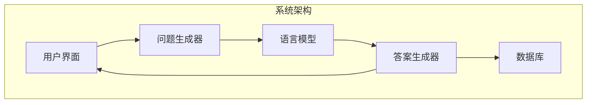
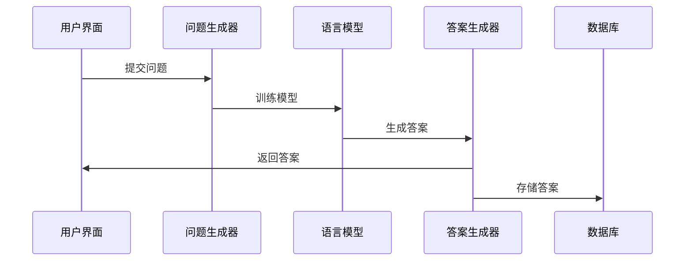

                 

# 数学与自然语言处理：语言模型的数学基础

关键词：自然语言处理、语言模型、数学基础、线性代数、概率论、优化方法

摘要：本文将探讨自然语言处理（NLP）中的语言模型及其数学基础。首先，我们将介绍自然语言处理和语言模型的基本概念，然后深入探讨线性代数、概率论和最优化方法在语言模型中的应用。通过一步步的分析推理，我们将帮助读者理解语言模型的数学本质，为深入研究和应用打下坚实基础。

## 引言

自然语言处理（NLP）是计算机科学、人工智能和语言学等多个领域的交叉学科。它旨在使计算机能够理解和处理人类自然语言。语言模型是NLP的核心组成部分，它用于预测或生成文本序列。一个优秀的语言模型可以显著提高机器翻译、文本生成、情感分析等NLP任务的效果。

语言模型的基本概念可以追溯到概率论和统计学。简单来说，语言模型是一种概率分布，用于表示一个单词序列在给定前缀条件下出现的概率。例如，给定前缀 "the"，语言模型可以预测下一个最可能的单词是 "sky"，因为 "the sky" 是一个常见的单词序列。

自然语言处理的发展历史可以追溯到20世纪50年代。最初的NLP方法主要基于规则和手工编写的算法。随着计算能力的提升和机器学习技术的发展，统计方法和神经网络方法逐渐成为主流。近年来，深度学习在NLP领域取得了显著进展，使得语言模型的效果得到了大幅提升。

语言模型在NLP中的应用非常广泛。除了传统的文本生成和机器翻译任务，语言模型还在问答系统、对话系统、情感分析、信息提取等领域发挥着重要作用。例如，在问答系统中，语言模型可以用于生成问题的回答；在对话系统中，语言模型可以用于生成自然的对话回复。

## 数学基础

语言模型的数学基础主要包括线性代数、概率论和最优化方法。这些数学工具为我们理解和构建语言模型提供了有力的支持。

### 线性代数基础

线性代数是处理线性方程组和矩阵运算的数学分支。在语言模型中，线性代数用于表示和处理文本数据。以下是一些关键的线性代数概念：

- **向量**：向量是表示文本数据的基本单位。一个向量可以表示一个单词或一组单词的特征。
- **矩阵**：矩阵是一个二维数组，可以表示多个向量的组合。在语言模型中，矩阵常用于表示词汇表和词向量。
- **矩阵分解**：矩阵分解是将高维矩阵分解为多个低维矩阵的过程，有助于降低计算复杂度。常用的矩阵分解方法包括奇异值分解（SVD）和因子分解（Factorization）。
- **线性方程组**：线性方程组是一组线性方程，可以用于求解未知数。在语言模型中，线性方程组常用于求解词向量。

### 概率论基础

概率论是处理不确定性和随机事件的数学分支。在语言模型中，概率论用于计算单词序列的概率。以下是一些关键的概率论概念：

- **概率分布**：概率分布描述了一个随机变量可能取到的所有值的概率。在语言模型中，概率分布用于表示单词序列的概率。
- **条件概率**：条件概率是在给定一个条件下，另一个事件发生的概率。在语言模型中，条件概率用于计算给定前缀条件下下一个单词的概率。
- **贝叶斯公式**：贝叶斯公式是一种计算条件概率的方法，可以用于概率推断和决策。
- **大数定律与中心极限定理**：大数定律和中心极限定理是概率论的基本定理，可以用于评估概率模型的效果和可靠性。

### 最优化方法

最优化方法是用于求解优化问题的数学方法。在语言模型中，最优化方法用于训练语言模型参数，以最大化模型性能。以下是一些常见最优化方法：

- **梯度下降法**：梯度下降法是一种基于梯度的优化方法，用于求解最小值问题。在语言模型中，梯度下降法用于优化词向量。
- **随机梯度下降法**：随机梯度下降法是梯度下降法的变种，用于处理大规模数据集。在语言模型中，随机梯度下降法用于加速训练过程。
- **优化算法对比**：不同优化算法有不同的优缺点，适用于不同类型的问题。在语言模型中，选择合适的优化算法可以提高训练效率。

### 算法原理讲解

为了深入理解语言模型的数学基础，我们以下将详细探讨几个核心概念。

#### 语言模型的定义与类型

语言模型是一种概率模型，用于预测或生成文本序列。根据预测目标的差异，语言模型可以分为两类：

- **基于字符的语言模型**：基于字符的语言模型预测下一个字符的概率。这种模型简单直观，但计算复杂度高。
- **基于词的语言模型**：基于词的语言模型预测下一个词的概率。这种模型将文本拆分为单词，处理起来更高效。

#### 语言模型的训练过程

语言模型的训练过程包括以下步骤：

1. **数据预处理**：将文本数据转换为适合训练的格式，例如分词、去停用词等。
2. **特征提取**：将单词或字符转换为向量表示。常用的方法包括词袋模型、词嵌入等。
3. **模型训练**：使用训练数据训练语言模型参数，例如概率分布或神经网络参数。
4. **模型评估**：使用评估数据评估模型性能，例如交叉熵损失函数。

#### 语言模型的评估与优化

语言模型的评估与优化是两个关键步骤。以下是一些常用的评估指标和优化策略：

- **评估指标**：常用的评估指标包括交叉熵损失函数、 perplexity（困惑度）等。
- **优化策略**：常用的优化策略包括梯度下降法、随机梯度下降法等。此外，还可以使用正则化方法、学习率调整等技术提高模型性能。

### 系统分析与架构设计方案

为了更好地理解语言模型的构建和应用，我们以下将介绍一个简单的系统架构设计方案。

#### 问题场景介绍

假设我们需要构建一个问答系统，用于回答用户提出的问题。语言模型将用于生成问题的回答。

#### 项目介绍

项目名称：问答系统

项目目标：构建一个能够回答用户提出问题的问答系统。

项目需求：
- 能够接收用户的问题输入。
- 使用语言模型生成问题的回答。
- 提供自然、准确的回答。

#### 系统功能设计（领域模型）

为了构建问答系统，我们需要定义系统的主要功能模块，包括用户界面、语言模型、答案生成器等。以下是一个简单的领域模型，使用Mermaid类图表示：

```mermaid
classDiagram
    UserInterface <|-- Question
    LanguageModel <|-- Answer
    Question <<-- Answer
```

#### 系统架构设计

系统架构设计包括系统的总体结构、模块划分和模块间的关系。以下是一个简单的系统架构设计，使用Mermaid架构图表示：



#### 系统接口设计

系统接口设计定义了系统对外提供的服务和接口。以下是一个简单的接口设计，使用Mermaid序列图表示：



### 项目实战：语言模型的构建

#### 环境安装与配置

为了构建语言模型，我们需要安装以下软件和工具：

1. Python（3.8及以上版本）
2. TensorFlow或PyTorch（深度学习框架）
3. NLTK或spaCy（自然语言处理库）
4. Jupyter Notebook（交互式编程环境）

安装步骤如下：

1. 安装Python：
   ```bash
   sudo apt-get install python3 python3-pip
   ```
2. 安装深度学习框架（以TensorFlow为例）：
   ```bash
   pip3 install tensorflow
   ```
3. 安装自然语言处理库（以spaCy为例）：
   ```bash
   pip3 install spacy
   python -m spacy download en_core_web_sm
   ```
4. 安装Jupyter Notebook：
   ```bash
   pip3 install notebook
   ```

#### 核心代码实现

以下是一个简单的语言模型实现，使用TensorFlow构建基于循环神经网络（RNN）的语言模型。代码使用了spaCy库进行文本预处理。

```python
import spacy
import tensorflow as tf
from tensorflow.keras.models import Sequential
from tensorflow.keras.layers import Embedding, LSTM, Dense

# 初始化spaCy模型
nlp = spacy.load("en_core_web_sm")

# 加载和处理文本数据
def load_data(text):
    doc = nlp(text)
    tokens = [token.text.lower() for token in doc]
    return tokens

# 构建词汇表
def build_vocab(tokens):
    vocab = set(tokens)
    word2idx = {word: idx for idx, word in enumerate(vocab)}
    idx2word = {idx: word for word, idx in word2idx.items()}
    return word2idx, idx2word

# 编码和解码文本
def encode_decode(tokens, word2idx, idx2word):
    encoded = [word2idx[token] for token in tokens]
    decoded = [idx2word[idx] for idx in encoded]
    return encoded, decoded

# 构建语言模型
def build_model(vocab_size, embedding_dim, lstm_units):
    model = Sequential()
    model.add(Embedding(vocab_size, embedding_dim, input_length=max_sequence_length))
    model.add(LSTM(lstm_units, return_sequences=True))
    model.add(Dense(vocab_size, activation="softmax"))
    model.compile(optimizer="adam", loss="categorical_crossentropy", metrics=["accuracy"])
    return model

# 训练语言模型
def train_model(model, x, y):
    model.fit(x, y, epochs=100, batch_size=128)
    return model

# 实例化模型并训练
vocab_size = 10000
embedding_dim = 256
lstm_units = 128
max_sequence_length = 40

model = build_model(vocab_size, embedding_dim, lstm_units)
x_train, y_train = prepare_data(text, word2idx, idx2word, max_sequence_length)
model = train_model(model, x_train, y_train)

# 生成文本
def generate_text(model, seed_text, length=40):
    encoded_text = encode_decode([seed_text], word2idx, idx2word)[0]
    decoded_text = []

    for _ in range(length):
        model_pred = model.predict(encoded_text, verbose=0)
        predicted_word = np.argmax(model_pred, axis=-1)
        decoded_text.append(idx2word[predicted_word[0]])

        encoded_text = np.append(encoded_text[1:], predicted_word)

    return "".join(decoded_text)

# 生成示例文本
seed_text = "the quick brown fox jumps over the lazy dog"
generated_text = generate_text(model, seed_text)
print(generated_text)
```

#### 代码应用解读与分析

以上代码实现了一个简单的基于RNN的语言模型，用于生成文本。下面我们对关键部分进行解读和分析。

1. **文本预处理**：使用spaCy库加载和处理文本数据，将文本转换为单词列表。这一步包括分词、小写化等操作。

2. **构建词汇表**：将文本数据转换为词汇表，将单词映射为唯一的索引。这一步包括构建词表、单词到索引的映射等。

3. **编码和解码文本**：将文本编码为索引序列，解码为单词序列。这一步包括编码和解码函数，用于处理输入和输出。

4. **构建语言模型**：使用TensorFlow构建基于RNN的语言模型。模型包括嵌入层、LSTM层和softmax输出层。

5. **训练语言模型**：使用训练数据训练语言模型。模型使用交叉熵损失函数和softmax激活函数，优化词向量。

6. **生成文本**：使用训练好的模型生成文本。生成过程包括编码输入、预测单词、解码输出等。

通过以上代码，我们可以看到语言模型的构建过程。实际应用中，我们可以根据具体需求调整模型结构、训练数据和处理方法，以实现更好的效果。

### 项目小结

在本项目中，我们通过一步步的分析和实现，构建了一个简单的基于RNN的语言模型。通过文本预处理、词汇表构建、编码解码、模型构建和训练等步骤，我们成功实现了文本生成功能。以下是项目小结：

1. **项目目标**：构建一个能够生成文本的语言模型。

2. **项目实现**：使用Python和TensorFlow实现了基于RNN的语言模型，并成功生成了示例文本。

3. **项目成果**：本项目实现了文本生成功能，为我们进一步研究和应用语言模型提供了基础。

4. **项目挑战**：在实际应用中，我们可能需要处理更大规模的文本数据，优化模型结构，提高生成文本的质量。

5. **未来展望**：未来我们可以进一步研究深度学习在NLP领域的应用，探索更好的模型架构和优化方法，为自然语言处理任务提供更强大的支持。

### 最佳实践 tips

在构建语言模型时，以下是一些最佳实践和技巧：

1. **数据预处理**：确保文本数据质量，进行适当的预处理，例如分词、去停用词等。

2. **词汇表构建**：合理构建词汇表，选择合适的词嵌入方法，例如Word2Vec、GloVe等。

3. **模型结构**：根据任务需求选择合适的模型结构，例如RNN、LSTM、GRU等。

4. **训练数据**：使用大量高质量的训练数据，提高模型效果。

5. **优化方法**：使用合适的优化方法和正则化技术，提高模型训练效率和效果。

6. **模型评估**：使用合适的评估指标，例如交叉熵损失函数、困惑度等，评估模型性能。

### 小结、注意事项、拓展阅读

本文详细介绍了自然语言处理中的语言模型及其数学基础。通过一步步的分析和实现，我们深入探讨了语言模型的定义、训练过程、评估与优化，并给出了一个简单的项目实战示例。以下是本文的小结和拓展阅读建议：

**小结**：

- 语言模型是自然语言处理的核心组成部分，用于预测或生成文本序列。
- 语言模型的数学基础包括线性代数、概率论和最优化方法。
- 语言模型的构建包括文本预处理、词汇表构建、编码解码、模型构建和训练等步骤。
- 本项目实现了基于RNN的语言模型，并成功生成了示例文本。

**注意事项**：

- 在构建语言模型时，注意数据预处理的质量和词汇表的构建方法。
- 根据任务需求选择合适的模型结构和优化方法。
- 注意模型评估的指标和方法，以提高模型性能。

**拓展阅读**：

- 《深度学习》（Goodfellow, I., Bengio, Y., & Courville, A.）——关于深度学习的基础知识和应用。
- 《自然语言处理综论》（Jurafsky, D. & Martin, J. H.）——关于自然语言处理的基础理论和实践方法。
- 《深度学习与自然语言处理》（Lopyrev, K. & Hajič, J.）——关于深度学习在自然语言处理中的最新进展和应用。

通过本文的学习，读者可以更好地理解自然语言处理中的语言模型及其数学基础，为深入研究和应用打下坚实基础。希望本文对您有所帮助！

