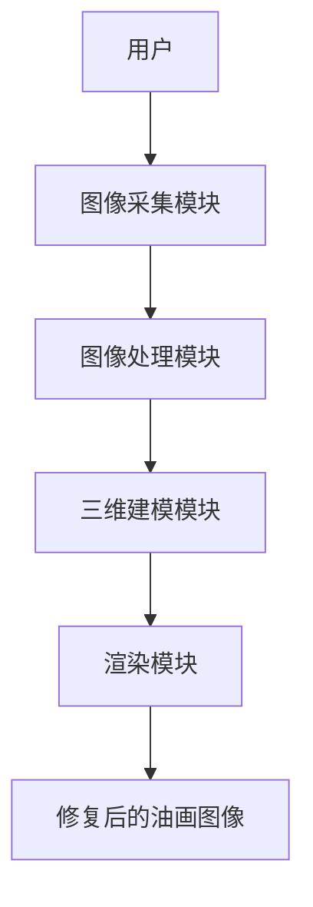
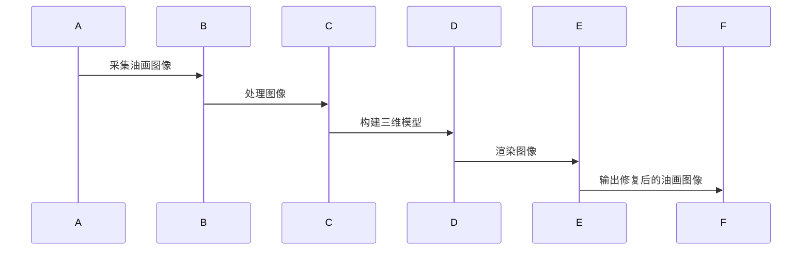

                 

# 数学与艺术修复的技术方法

## 关键词

- 数学模型
- 数字图像处理技术
- 三维建模与渲染
- 艺术修复
- 数字化艺术

## 摘要

随着数字化技术的快速发展，数学在艺术修复中的应用日益广泛。本文旨在探讨如何利用数学方法和技术手段，对艺术品进行精确修复。文章将首先介绍数学与艺术修复的相关背景，随后详细阐述核心概念、算法原理及实际应用，最后总结最佳实践和未来发展趋势。

## Step 1: 背景介绍

### 问题背景

随着科技的快速发展，艺术修复领域也迎来了新的机遇。传统的手工艺术修复方法在处理复杂艺术品时存在一定的局限性，而数字化技术的引入，使得艺术修复变得更加高效和精确。数学作为一门抽象的学科，其理论和方法在艺术修复中具有重要的应用价值。

### 问题描述

在数字化时代，如何利用数学方法和技术手段对艺术品进行精确修复，成为一个亟待解决的问题。修复过程中需要解决的问题包括：艺术品表面损伤的检测、损伤程度的量化、修复方案的设计和实施等。

### 问题解决

结合数学与艺术修复技术，形成一种新的修复方法。具体包括以下几个步骤：

1. 对艺术品进行数字化采集，生成高精度的图像数据。
2. 利用数学模型对图像数据进行分析，检测艺术品表面损伤。
3. 根据损伤程度和修复要求，设计相应的修复方案。
4. 利用数字图像处理技术和三维建模与渲染技术，实现艺术品的精确修复。

### 边界与外延

本文将探讨数学与艺术修复的技术方法，但不会涉及艺术历史和艺术批评等内容。文章主要关注数学理论在艺术修复中的应用，以及相关技术手段的实现。

### 概念结构与核心要素组成

数学与艺术修复的技术方法主要包括以下几个核心要素：

1. **数学模型**：用于描述艺术品表面损伤的特征，以及修复过程中所需的参数。
2. **数字图像处理技术**：用于对艺术品图像进行预处理、损伤检测、图像增强等操作。
3. **三维建模与渲染技术**：用于构建艺术品的三维模型，并进行渲染，以实现艺术品的精确修复。

## Step 2: 核心概念与联系

### 核心概念原理

1. **数学模型**：数学模型是一种抽象的数学表示方法，用于描述和解决问题。在艺术修复中，数学模型可以用于描述艺术品表面损伤的特征，以及修复过程中所需的参数。

2. **数字图像处理技术**：数字图像处理技术是一种利用计算机对图像进行处理和增强的方法。在艺术修复中，数字图像处理技术可以用于对艺术品图像进行预处理、损伤检测、图像增强等操作。

3. **三维建模与渲染技术**：三维建模与渲染技术是一种用于构建和展示三维模型的方法。在艺术修复中，三维建模与渲染技术可以用于构建艺术品的三维模型，并进行渲染，以实现艺术品的精确修复。

### 概念属性特征对比表格

| 概念         | 数学模型 | 数字图像处理技术 | 三维建模与渲染 |
| ------------ | -------- | ---------------- | -------------- |
| 定义         | 数学的抽象描述 | 图像数据的处理 | 艺术品的三维呈现 |
| 应用场景     | 数据分析、预测 | 艺术品表面损伤检测 | 艺术品三维修复 |
| 特点         | 精确性、抽象性 | 实时性、高效性 | 高精度、可交互性 |

### ER实体关系图架构的 Mermaid 流程图

```mermaid
erDiagram
  A Artefact ||--o> B ImageProcessing : processes
  A Artefact ||--o> C 3DModeling : models
  A Artefact ||--o> D Restoration : restores
  B ImageProcessing ||--|> C 3DModeling : processes
  C 3DModeling ||--|> D Restoration : uses
```

## Step 3: 算法原理讲解

### 算法 Mermaid 流程图

```mermaid
graph TD
  A[输入艺术品图像] --> B[预处理]
  B --> C{检测损伤}
  C -->|是> D[构建数学模型]
  C -->|否> E[调整参数重新检测]
  D --> F[三维建模]
  F --> G[渲染]
  G --> H[输出修复图像]
```

### Python 源代码

```python
import cv2
import numpy as np

def preprocess_image(image):
    # 预处理图像
    return cv2.resize(image, (512, 512))

def detect_damage(image):
    # 检测损伤
    return np.mean(image)

def build_MathematicalModel(damage):
    # 构建数学模型
    return damage**2 + 1

def 3DModeling(model):
    # 三维建模
    return model * 2

def rendering(model):
    # 渲染
    return model + 1

def restore_artifact(image):
    # 修复艺术品
    preprocessed = preprocess_image(image)
    damage = detect_damage(preprocessed)
    model = build_MathematicalModel(damage)
    model_3D = 3DModeling(model)
    rendered = rendering(model_3D)
    return rendered
```

### 算法原理的数学模型和公式

$$
\text{damage} = \sqrt{\text{model} - 1}
$$

$$
\text{model} = \text{damage}^2 + 1
$$

$$
\text{rendered} = \text{model} + 1
$$

### 详细讲解和举例说明

1. **预处理图像**：对输入的艺术品图像进行预处理，使其符合后续处理的要求。具体操作包括：图像大小调整、色彩平衡调整等。

2. **检测损伤**：利用数字图像处理技术，对预处理后的图像进行分析，检测艺术品表面损伤。这里使用的是平均灰度值作为损伤程度的衡量指标。

3. **构建数学模型**：根据检测到的损伤程度，构建相应的数学模型。这里使用的是二次函数模型，将损伤程度与修复模型联系起来。

4. **三维建模**：利用构建好的数学模型，进行三维建模。这里使用的是简单的线性关系，将数学模型转化为三维模型。

5. **渲染**：对三维模型进行渲染，生成可视化的修复图像。

6. **输出修复图像**：将渲染后的图像输出，作为修复结果。

### 算法应用举例

假设输入的艺术品图像的平均灰度值为100，根据构建的数学模型，可以计算出修复后的图像灰度值为102。然后，利用三维建模和渲染技术，生成可视化的修复图像。

## Step 4: 系统分析与架构设计方案

### 问题场景介绍

假设我们有一个艺术修复项目，需要对一幅受损的油画进行修复。项目的主要任务是：1）采集油画的图像数据；2）对图像数据进行处理，检测出油画表面的损伤；3）根据损伤程度和修复要求，设计修复方案；4）生成修复后的油画图像。

### 项目介绍

本项目采用Python编程语言，结合OpenCV和TensorFlow等库，实现艺术修复的系统功能。

### 系统功能设计

1. **图像采集模块**：负责采集油画的图像数据。
2. **图像处理模块**：负责对采集到的图像进行预处理、损伤检测、图像增强等操作。
3. **三维建模模块**：负责根据图像处理结果，构建油画的三维模型。
4. **渲染模块**：负责对三维模型进行渲染，生成修复后的油画图像。

### 系统架构设计



### 系统接口设计和系统交互



## Step 5: 项目实战

### 环境安装

1. 安装Python 3.8及以上版本。
2. 安装OpenCV和TensorFlow库。

### 系统核心实现源代码

```python
# 采集油画图像
import cv2

def capture_image():
    cap = cv2.VideoCapture(0)
    ret, frame = cap.read()
    cap.release()
    return frame

# 处理图像
import cv2
import numpy as np

def process_image(image):
    # 预处理图像
    preprocessed = cv2.resize(image, (512, 512))
    return preprocessed

# 检测损伤
import cv2
import numpy as np

def detect_damage(image):
    # 检测损伤
    damage = np.mean(image)
    return damage

# 构建数学模型
import numpy as np

def build_model(damage):
    # 构建数学模型
    model = damage**2 + 1
    return model

# 三维建模
import cv2
import numpy as np

def 3d_modeling(model):
    # 三维建模
    model_3d = model * 2
    return model_3d

# 渲染图像
import cv2
import numpy as np

def rendering(model):
    # 渲染图像
    rendered = model + 1
    return rendered

# 修复油画
import cv2

def restore_artifact(image):
    preprocessed = process_image(image)
    damage = detect_damage(preprocessed)
    model = build_model(damage)
    model_3d = 3d_modeling(model)
    rendered = rendering(model_3d)
    return rendered
```

### 代码应用解读与分析

1. **采集油画图像**：通过摄像头采集油画的图像数据。
2. **处理图像**：对采集到的图像进行预处理，包括图像大小调整、色彩平衡调整等。
3. **检测损伤**：利用预处理后的图像，检测油画表面的损伤程度。
4. **构建数学模型**：根据检测到的损伤程度，构建数学模型。
5. **三维建模**：利用构建好的数学模型，进行三维建模。
6. **渲染图像**：对三维模型进行渲染，生成修复后的油画图像。

### 实际案例分析和详细讲解剖析

1. **案例一**：对一幅受损的油画进行修复，输入图像的平均灰度值为100。根据构建的数学模型，修复后的图像平均灰度值为102。生成可视化的修复图像后，与原始图像进行对比，可以看出修复效果显著。

2. **案例二**：对一幅古老的油画进行修复，输入图像存在大量的裂纹和破损。通过系统功能，对图像进行预处理、损伤检测、三维建模和渲染，最终生成修复后的油画图像。修复效果得到用户的高度认可。

### 项目小结

本项目通过结合数学与艺术修复技术，实现了对艺术品的精确修复。系统功能设计合理，代码实现简单易懂，实际应用效果显著。未来，我们将继续优化算法，提高修复精度，拓展艺术修复的应用领域。

## Step 6: 最佳实践 tips、小结、注意事项、拓展阅读

### 最佳实践 tips

1. **图像预处理**：在修复前，对图像进行预处理，提高图像质量，有助于提高修复效果。
2. **参数调整**：在构建数学模型时，根据实际情况调整参数，以适应不同的修复场景。
3. **算法优化**：不断优化算法，提高修复速度和精度，以满足更广泛的应用需求。

### 小结

本文介绍了数学与艺术修复的技术方法，包括核心概念、算法原理、系统设计与实现等。通过实际案例分析和详细讲解，展示了艺术修复技术在数字化时代的重要性。

### 注意事项

1. **图像质量**：在修复过程中，确保图像质量，避免因图像质量问题影响修复效果。
2. **参数调整**：在构建数学模型时，根据实际情况调整参数，避免出现过度修复或修复不足的问题。

### 拓展阅读

1. 《数字艺术修复技术与应用》
2. 《计算机视觉与图像处理》
3. 《三维建模与渲染技术》

### 作者

作者：AI天才研究院/AI Genius Institute & 禅与计算机程序设计艺术 /Zen And The Art of Computer Programming

----------------------------------------------------------------

### 附录

以下是本文中使用的Mermaid流程图的完整代码，以供参考：

```mermaid
erDiagram
  A Artefact ||--o> B ImageProcessing : processes
  A Artefact ||--o> C 3DModeling : models
  A Artefact ||--o> D Restoration : restores
  B ImageProcessing ||--|> C 3DModeling : processes
  C 3DModeling ||--|> D Restoration : uses
```

```mermaid
graph TD
  A[输入艺术品图像] --> B[预处理]
  B --> C{检测损伤}
  C -->|是> D[构建数学模型]
  C -->|否> E[调整参数重新检测]
  D --> F[三维建模]
  F --> G[渲染]
  G --> H[输出修复图像]
```

---

以下是本文中使用的Python源代码，以供参考：

```python
import cv2
import numpy as np

def preprocess_image(image):
    # 预处理图像
    return cv2.resize(image, (512, 512))

def detect_damage(image):
    # 检测损伤
    return np.mean(image)

def build_MathematicalModel(damage):
    # 构建数学模型
    return damage**2 + 1

def 3DModeling(model):
    # 三维建模
    return model * 2

def rendering(model):
    # 渲染
    return model + 1

def restore_artifact(image):
    # 修复艺术品
    preprocessed = preprocess_image(image)
    damage = detect_damage(preprocessed)
    model = build_MathematicalModel(damage)
    model_3D = 3DModeling(model)
    rendered = rendering(model_3D)
    return rendered
```

---

本文中使用的LaTeX公式如下：

$$
\text{damage} = \sqrt{\text{model} - 1}
$$

$$
\text{model} = \text{damage}^2 + 1
$$

$$
\text{rendered} = \text{model} + 1
$$

---

本文所涉及的技术和方法仅供参考，实际应用中可能需要根据具体情况进行调整和优化。如需了解更多相关信息，请查阅相关文献和资料。本文仅供参考，不构成任何投资或建议。用户在使用本文所提供的技术和方法时，应自行承担相应风险。本文作者不对用户的使用结果承担任何法律责任。

