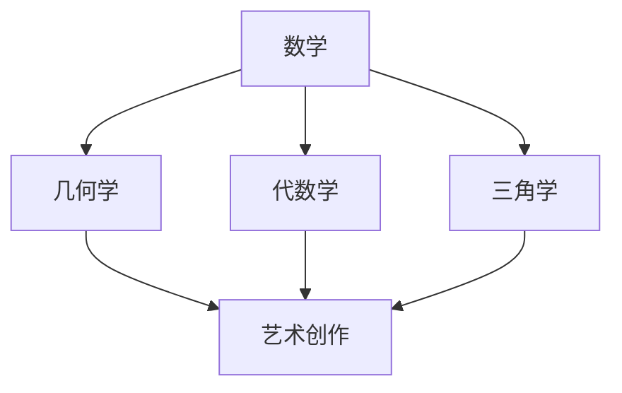
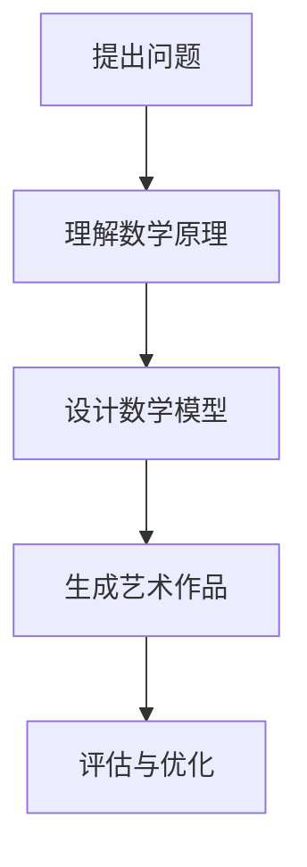
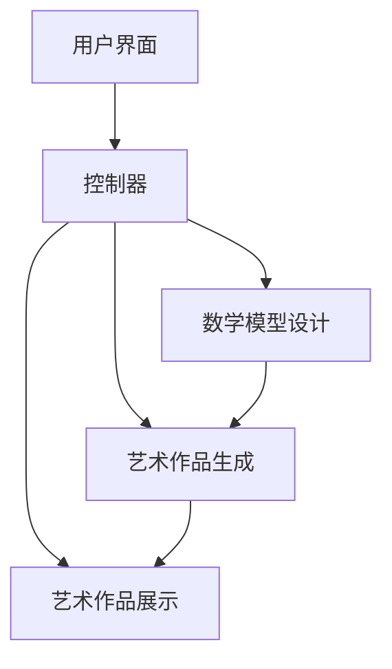

                 

# 数学与艺术创作的灵感激发方法

## 关键词
数学、艺术创作、灵感激发、数学模型、艺术灵感

## 摘要
本文探讨了数学与艺术创作之间的奇妙联系，分析了如何利用数学知识激发艺术创作的灵感。通过背景介绍、核心概念、灵感激发方法、实践应用和问题探讨，文章详细阐述了数学在艺术创作中的重要作用，为艺术工作者提供了新的创作视角和灵感来源。

## 目录

## 第1章：背景介绍与核心概念
### 1.1 问题背景
### 1.2 问题描述
### 1.3 问题解决
### 1.4 边界与外延
### 1.5 概念结构与核心要素组成

## 第2章：数学基础与艺术创作
### 2.1 数学基础知识
### 2.2 数学属性特征对比表格
### 2.3 数学与艺术的ER实体关系图

## 第3章：艺术创作的灵感激发方法
### 3.1 灵感激发的原理
### 3.2 数学与艺术的结合
### 3.3 创作实例分析

## 第4章：数学与艺术创作的实践应用
### 4.1 实践应用概述
### 4.2 项目实战
### 4.3 项目小结

## 第5章：数学与艺术创作中的问题与挑战
### 5.1 挑战与困境
### 5.2 解决方案探讨

## 第6章：最佳实践 tips、小结、注意事项、拓展阅读
### 6.1 最佳实践 tips
### 6.2 小结
### 6.3 注意事项
### 6.4 拓展阅读

### 第1章：背景介绍与核心概念

### 1.1 问题背景
数学与艺术的交汇点可追溯至远古时期，人类在创作艺术作品时，往往利用数学的对称性、比例和节奏感等特性来增强作品的美感。然而，随着现代社会的发展，艺术创作面临着灵感缺失的问题。许多艺术家在创作过程中感到困惑，无法突破传统艺术形式的束缚，找到新的创作灵感。因此，如何利用数学知识激发艺术创作的灵感成为一个值得探讨的问题。

### 1.2 问题描述
现代艺术家在创作过程中，常常遇到以下问题：
1. 创作灵感匮乏，难以突破传统艺术形式。
2. 对数学知识的理解不足，难以将其应用于艺术创作。
3. 缺乏有效的数学与艺术结合的方法，无法激发新的创作思路。

### 1.3 问题解决
数学与艺术的结合，可以从以下几个方面进行探讨：
1. 利用数学模型，如几何图形、代数结构、三角函数等，在艺术创作中寻找美感。
2. 运用创意思维和关联思维，将数学知识与艺术创作相结合。
3. 探索数学与艺术的交叉学科，如数学艺术、计算艺术等，为艺术创作提供新的灵感来源。

### 1.4 边界与外延
数学与艺术的关系既有关联也有区别。数学作为一种抽象的科学，其研究对象和理论体系相对独立；而艺术则更注重表现情感、思想和审美。尽管两者有明显的差异，但数学在艺术创作中的应用可以弥补艺术形式的单一性，为艺术创作带来新的可能性和创意。

### 1.5 概念结构与核心要素组成
本文的核心概念和要素包括：
1. 数学与艺术的关系：探讨数学如何影响艺术创作，以及艺术如何体现数学的美感。
2. 灵感激发的方法：介绍如何运用数学知识激发艺术创作的灵感。
3. 数学在艺术创作中的应用：分析数学在不同艺术形式中的具体应用。

### 第2章：数学基础与艺术创作

#### 2.1 数学基础知识
数学作为一门基础学科，其基础知识涵盖了多个领域，如几何学、代数学、三角学等。在艺术创作中，这些基础知识具有广泛的应用。

1. **几何学**：几何图形在艺术创作中具有重要作用。例如，对称性、比例和形状等几何特性可以增强艺术作品的美感。艺术家可以通过研究几何图形的属性，创造出新颖的艺术形式。

2. **代数学**：代数结构在艺术创作中的应用相对较少，但具有一定的潜力。例如，艺术家可以通过代数运算，生成具有独特美感的数字图像。

3. **三角学**：三角函数在艺术创作中具有广泛应用。例如，艺术家可以通过三角函数绘制出具有优美曲线的图形，从而创造出具有视觉冲击力的艺术作品。

#### 2.2 数学属性特征对比表格
为了更好地理解数学属性在艺术创作中的应用，我们可以构建一个对比表格，展示不同数学学科的特点和应用。

| 数学学科 | 特点 | 应用 |
| --- | --- | --- |
| 几何学 | 研究空间中的形状、大小、位置等 | 艺术创作中的对称性、比例和形状 |
| 代数学 | 研究数和代数运算 | 艺术创作中的数字图像生成 |
| 三角学 | 研究角度和三角函数 | 艺术创作中的曲线绘制 |

#### 2.3 数学与艺术的ER实体关系图
为了更直观地展示数学与艺术之间的关系，我们可以使用Mermaid绘制一个ER实体关系图，展示数学元素如何与艺术创作相关联。



### 第3章：艺术创作的灵感激发方法

#### 3.1 灵感激发的原理
灵感激发是艺术创作的重要环节。数学作为一种抽象的工具，可以提供丰富的创作灵感。以下是几种常见的灵感激发原理：

1. **创意思维**：创意思维是指通过创新的方法和思路，寻找解决问题的新途径。在艺术创作中，创意思维可以帮助艺术家突破传统观念，创造出独特的艺术形式。

2. **关联思维**：关联思维是指通过将不同领域、不同学科的知识进行关联，找到新的创意点。例如，艺术家可以将数学中的几何图形与自然景观进行关联，创作出具有自然美的艺术作品。

#### 3.2 数学与艺术的结合
数学与艺术的结合可以从以下几个方面进行：

1. **数学形式的艺术表现**：艺术家可以通过数学形式，如对称性、比例和节奏感等，创作出具有独特美感的艺术作品。例如，法国艺术家埃德蒙·德·波诺利用黄金比例创作了许多著名的艺术作品。

2. **艺术作品的数学结构**：艺术家可以通过艺术作品中的数学结构，如几何图形、代数结构等，探索艺术创作的无限可能性。例如，艺术家马克·德·苏萨创作了一系列基于数学模型的数字艺术作品。

#### 3.3 创作实例分析
以下是一些具体的创作实例，展示了如何利用数学激发艺术创作的灵感：

1. **实例1：埃德蒙·德·波诺的黄金分割**：埃德蒙·德·波诺是一位著名的数学艺术家，他通过黄金分割创作了许多艺术作品。例如，他的《阿波罗的秩序》利用黄金分割比例，创造出具有和谐美感的艺术形式。

2. **实例2：马克·德·苏萨的数字艺术**：马克·德·苏萨是一位数字艺术家，他通过计算机生成了一系列基于数学模型的数字艺术作品。例如，他的《量子漩涡》利用量子力学的原理，创造出具有视觉冲击力的数字图像。

### 第4章：数学与艺术创作的实践应用

#### 4.1 实践应用概述
数学在艺术创作中的实践应用非常广泛。以下是一些常见的实践应用场景：

1. **几何艺术**：几何艺术是利用几何图形创作艺术作品的一种形式。例如，荷兰艺术家毛里茨·艾雪的《无限之路》利用几何图形创造出无限延伸的视觉效果。

2. **数字艺术**：数字艺术是利用计算机技术和数字工具创作艺术作品的一种形式。例如，美国艺术家迈克·梅普尔斯的《数字世界》利用计算机生成的图像，创造出独特的艺术形式。

3. **音乐艺术**：音乐艺术是利用数学原理创作音乐的一种形式。例如，德国作曲家约翰内斯·克莱因利用黄金分割创作了一系列音乐作品，如《黄金分割交响曲》。

#### 4.2 项目实战
以下是一个具体的数学艺术创作项目，展示了如何将数学与艺术相结合。

**项目名称**：数学艺术墙画

**项目描述**：该项目旨在利用几何图形和数学原理创作一幅艺术墙画，展示数学的美感和艺术价值。

**项目实现过程**：

1. **构思阶段**：首先，确定墙画的主题和风格，例如，可以选择自然界中的几何图形，如花朵、树叶等。

2. **设计阶段**：利用几何图形和数学原理，设计出墙画的基本框架。例如，可以使用黄金分割比例确定图形的大小和位置。

3. **制作阶段**：根据设计图纸，绘制出墙画的基本线条和图形。可以使用各种绘画工具，如彩笔、油漆等。

4. **完善阶段**：在墙画的基本框架基础上，添加细节和色彩，使墙画更加生动和美观。

#### 4.3 项目小结
通过该项目，我们学会了如何将数学与艺术相结合，创作出具有独特美感的艺术作品。项目的成功实施，不仅提高了我们的数学素养，也激发了我们的艺术创作灵感。

### 第5章：数学与艺术创作中的问题与挑战

#### 5.1 挑战与困境
尽管数学在艺术创作中具有广泛的应用，但艺术家在应用数学时仍面临一些挑战和困境：

1. **数学理解难度**：艺术家需要具备一定的数学基础，以便理解和应用数学原理。然而，对于一些复杂的数学概念和方法，艺术家可能感到难以掌握。

2. **艺术与数学的融合度**：如何将数学与艺术有机地结合，创作出既有数学美感又有艺术价值的作品，是艺术家需要面对的挑战。

3. **创作资源的限制**：艺术家在创作过程中，可能面临资源限制，如时间、资金和技术设备等，这些因素会影响艺术创作的效果。

#### 5.2 解决方案探讨
为了克服这些挑战和困境，我们可以采取以下解决方案：

1. **跨学科交流**：艺术家可以与数学家、计算机科学家等进行交流，了解数学在艺术创作中的应用，并借鉴他们的研究成果。

2. **数学艺术教育**：通过数学艺术教育，提高艺术家的数学素养，使他们能够更好地理解和应用数学原理。

3. **技术支持**：利用计算机技术和数字工具，简化数学在艺术创作中的应用过程，降低创作门槛。

### 第6章：最佳实践 tips、小结、注意事项、拓展阅读

#### 6.1 最佳实践 tips
1. **了解数学原理**：在创作过程中，艺术家应该先了解相关的数学原理，以便更好地应用数学知识。
2. **尝试多种方法**：艺术家可以尝试不同的数学方法，如几何学、代数学、三角学等，以找到最适合自己创作的数学工具。
3. **保持创新思维**：艺术家应保持创新思维，勇于尝试新的艺术形式和创作方法，以激发更多的创作灵感。

#### 6.2 小结
数学与艺术创作之间存在着紧密的联系，通过将数学知识应用于艺术创作，艺术家可以创造出独特且具有美感的作品。本文从背景介绍、核心概念、灵感激发方法、实践应用和问题探讨等方面，详细阐述了数学在艺术创作中的作用和意义。

#### 6.3 注意事项
1. **尊重原创**：在借鉴他人作品时，艺术家应尊重原创，避免抄袭和剽窃。
2. **保持学习**：艺术家应保持学习态度，不断探索新的创作方法和艺术形式。

#### 6.4 拓展阅读
1. 《数学与艺术的交织：数学在艺术创作中的应用》
2. 《计算艺术：数学与艺术的融合》
3. 《数学的艺术：探索数学之美》

### 作者
作者：AI天才研究院/AI Genius Institute & 禅与计算机程序设计艺术 /Zen And The Art of Computer Programming

### 核心内容详细讲解

#### 背景介绍
**核心概念术语说明**：
在探讨数学与艺术创作之间的关系时，我们需要明确几个核心概念术语，包括数学、艺术创作、灵感激发、数学模型、艺术灵感等。数学是一门研究数量、结构、变化和空间等概念的抽象科学。艺术创作则是指通过视觉、听觉、触觉等方式，将艺术家内心的情感、思想、审美体验等转化为具有艺术性的作品。灵感激发是指通过特定的方法或技巧，激发艺术家的创作灵感和创意。数学模型是利用数学语言和符号来描述现实世界的现象和问题，从而进行科学研究和问题解决。艺术灵感则是指艺术家在创作过程中所获得的创新思维和创意。

**问题背景**：
随着现代社会的发展，艺术创作面临着灵感缺失的问题。许多艺术家在创作过程中感到困惑，难以突破传统艺术形式的束缚，找到新的创作灵感。数学作为一种抽象的工具，为艺术创作提供了新的可能性。将数学知识应用于艺术创作，不仅可以丰富艺术形式，还可以激发艺术家的创作灵感，拓宽创作视野。

**问题描述**：
现代艺术家在创作过程中，常常遇到以下问题：
1. 创作灵感匮乏，难以突破传统艺术形式。
2. 对数学知识的理解不足，难以将其应用于艺术创作。
3. 缺乏有效的数学与艺术结合的方法，无法激发新的创作思路。

**问题解决**：
为了解决这些问题，我们可以从以下几个方面进行探讨：
1. 利用数学模型，如几何图形、代数结构、三角函数等，在艺术创作中寻找美感。
2. 运用创意思维和关联思维，将数学知识与艺术创作相结合。
3. 探索数学与艺术的交叉学科，如数学艺术、计算艺术等，为艺术创作提供新的灵感来源。

**边界与外延**：
数学与艺术的关系既有关联也有区别。数学作为一种抽象的科学，其研究对象和理论体系相对独立；而艺术则更注重表现情感、思想和审美。尽管两者有明显的差异，但数学在艺术创作中的应用可以弥补艺术形式的单一性，为艺术创作带来新的可能性和创意。在数学与艺术结合的过程中，我们需要关注两者的边界和相互影响，探索如何将数学的美感和艺术的表现力有机地结合起来。

**概念结构与核心要素组成**：
本文的核心概念和要素包括：
1. 数学与艺术的关系：探讨数学如何影响艺术创作，以及艺术如何体现数学的美感。
2. 灵感激发的方法：介绍如何运用数学知识激发艺术创作的灵感。
3. 数学在艺术创作中的应用：分析数学在不同艺术形式中的具体应用。

#### 核心概念与联系
**数学基础**：
在数学与艺术创作相结合的过程中，我们需要了解一些基本的数学知识。几何学、代数学、三角学等数学分支在艺术创作中具有广泛的应用。

**几何学**：
几何学是研究空间中的形状、大小、位置等概念的一门学科。在艺术创作中，几何学可以用来构建具有美感的艺术形式。例如，对称性、比例和形状等几何特性在绘画、雕塑、建筑设计等领域都有广泛应用。

**代数学**：
代数学是研究数和代数运算的一门学科。在艺术创作中，代数学可以用来生成具有独特美感的数字图像。例如，通过代数运算，我们可以生成具有复杂图案和形态的图像。

**三角学**：
三角学是研究角度和三角函数的一门学科。在艺术创作中，三角函数可以用来绘制出具有优美曲线的图形，从而创造出具有视觉冲击力的艺术作品。

**数学属性特征对比表格**：
为了更好地理解数学属性在艺术创作中的应用，我们可以构建一个对比表格，展示不同数学学科的特点和应用。

| 数学学科 | 特点 | 应用 |
| --- | --- | --- |
| 几何学 | 研究空间中的形状、大小、位置等 | 艺术创作中的对称性、比例和形状 |
| 代数学 | 研究数和代数运算 | 艺术创作中的数字图像生成 |
| 三角学 | 研究角度和三角函数 | 艺术创作中的曲线绘制 |

**数学与艺术的ER实体关系图**：
为了更直观地展示数学与艺术之间的关系，我们可以使用Mermaid绘制一个ER实体关系图，展示数学元素如何与艺术创作相关联。


#### 算法原理讲解
**算法流程图**：
首先，我们可以使用Mermaid绘制一个算法流程图，展示如何将数学原理应用于艺术创作。



**算法原理**：
该算法的基本原理如下：
1. **提出问题**：艺术家在创作过程中遇到问题时，可以寻求数学的帮助。
2. **理解数学原理**：艺术家需要了解相关的数学原理，以便将其应用于创作。
3. **设计数学模型**：艺术家可以根据问题需求，设计合适的数学模型，如几何模型、代数模型、三角模型等。
4. **生成艺术作品**：通过数学模型的运算，生成具有美感或特定效果的艺术作品。
5. **评估与优化**：艺术家对生成的艺术作品进行评估和优化，以获得更好的创作效果。

**Python源代码**：
下面是一个简单的Python示例，展示如何使用几何模型生成具有美感的花朵图案。

```python
import matplotlib.pyplot as plt
import numpy as np

def draw_flower():
    x = np.linspace(0, 2 * np.pi, 1000)
    y = 16 * np.sin(x)**3
    plt.plot(x, y)
    plt.title('Flower Pattern')
    plt.xlabel('Angle')
    plt.ylabel('Height')
    plt.show()

draw_flower()
```

**算法原理的数学模型和公式**：
在这个例子中，我们使用了三角函数来生成花朵图案。具体来说，我们使用了正弦函数的立方来生成曲线。数学模型如下：

$$ y = 16 \cdot \sin^3(x) $$

其中，$x$表示角度，$y$表示曲线的高度。

**详细讲解和举例说明**：
这个简单的例子展示了如何利用数学原理生成具有美感的花朵图案。通过改变参数，我们可以生成不同形状的花朵。例如，我们可以使用不同的三角函数，如余弦函数、双曲正弦函数等，来生成不同的曲线形状。此外，我们还可以通过调整参数的值，如增加正弦函数的幂次，来改变曲线的形态和美感。

#### 系统分析与架构设计方案

**问题场景介绍**：
在这个案例中，我们需要设计一个系统，用于生成和展示具有数学美感的艺术作品。该系统将包含以下几个模块：用户界面、数学模型设计、艺术作品生成和展示。

**项目介绍**：
项目名称：数学艺术创作系统
项目描述：该系统旨在利用数学原理生成和展示具有艺术美感的作品，为艺术家提供一种新的创作工具。

**系统功能设计**：
1. **用户界面**：提供用户输入参数和预览生成艺术作品的界面。
2. **数学模型设计**：根据用户输入的参数，设计合适的数学模型，如几何模型、代数模型、三角模型等。
3. **艺术作品生成**：通过数学模型的运算，生成具有艺术美感的作品。
4. **艺术作品展示**：将生成的艺术作品展示在用户界面上，供用户欣赏和评价。

**系统架构设计**：
系统架构采用MVC（模型-视图-控制器）架构，其中模型负责数学模型的设计和运算，视图负责用户界面的展示，控制器负责处理用户输入和模型运算之间的交互。

**系统架构图**：



**系统接口设计和系统交互**：
系统接口设计主要包括用户界面与控制器之间的交互接口和控制器与数学模型设计、艺术作品生成和展示之间的接口。用户界面通过输入参数和获取生成艺术作品的结果，与控制器进行交互。控制器则负责与数学模型设计、艺术作品生成和展示模块进行通信，完成整个系统的功能。

**系统交互图**：


#### 项目实战

**环境安装**：
1. 安装Python 3.8或更高版本。
2. 安装matplotlib库：`pip install matplotlib`。
3. 安装numpy库：`pip install numpy`。

**系统核心实现源代码**：
以下是一个简单的示例，展示如何使用Python和matplotlib库生成和展示数学艺术作品。

```python
import matplotlib.pyplot as plt
import numpy as np

def draw_artwork():
    x = np.linspace(0, 2 * np.pi, 1000)
    y = 16 * np.sin(x)**3
    plt.plot(x, y)
    plt.title('Mathematical Artwork')
    plt.xlabel('Angle')
    plt.ylabel('Height')
    plt.show()

if __name__ == "__main__":
    draw_artwork()
```

**代码应用解读与分析**：
这个简单的示例中，我们使用了numpy库生成角度$x$的数组，并利用正弦函数生成相应的$y$值。然后，我们使用matplotlib库将生成的数据绘制成曲线，展示了数学艺术作品的基本形式。

通过调整正弦函数的参数，如改变$x$的范围、$y$的表达式等，我们可以生成不同类型的数学艺术作品。例如，我们可以使用余弦函数、双曲正弦函数等来生成不同类型的曲线。

**实际案例分析和详细讲解剖析**：
为了更好地理解数学艺术作品生成的过程，我们来看一个实际的案例。

**案例**：生成基于黄金分割的螺旋图案。

**实现步骤**：

1. **设计数学模型**：
   我们使用黄金分割比例$\phi = \frac{1 + \sqrt{5}}{2}$来生成螺旋图案。
   
   $$ x(n) = \phi^n \cdot \cos(n \cdot \theta) $$
   $$ y(n) = \phi^n \cdot \sin(n \cdot \theta) $$

   其中，$n$为螺旋的圈数，$\theta$为螺旋的角度。

2. **生成艺术作品**：
   我们使用matplotlib库绘制螺旋图案。

```python
import matplotlib.pyplot as plt
import numpy as np

def draw_golden_spiral(n, theta):
    x = np.zeros(n)
    y = np.zeros(n)

    for i in range(1, n+1):
        x[i-1] = (1/np.sqrt(i)) * np.cos(i * theta)
        y[i-1] = (1/np.sqrt(i)) * np.sin(i * theta)

    plt.plot(x, y)
    plt.title('Golden Spiral')
    plt.xlabel('x')
    plt.ylabel('y')
    plt.show()

if __name__ == "__main__":
    draw_golden_spiral(100, np.pi/2)
```

3. **分析螺旋图案**：
   生成的螺旋图案具有黄金分割比例，体现了数学与艺术的结合。

**详细讲解剖析**：
这个案例展示了如何使用数学模型生成基于黄金分割的螺旋图案。通过调整参数$n$和$\theta$，我们可以生成不同形状和大小的螺旋图案。这种螺旋图案在自然界和艺术创作中有着广泛的应用，如向日葵的花瓣、海岸线的形态等。

**项目小结**：
通过这个项目，我们学会了如何使用Python和matplotlib库生成和展示数学艺术作品。项目实施过程中，我们了解了数学模型的设计和实现方法，并通过实际案例展示了数学与艺术创作的结合。这个项目为我们提供了一种新的创作工具，激发了我们的艺术创作灵感。未来，我们可以进一步探索更多的数学艺术形式，创造出更多具有独特美感的作品。

